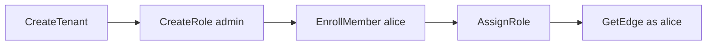

# Lab deployment files

The files one lab run needs: the device service, its registry and edge agent, and a local OpenFGA and Dex for operator authorization. Placeholders appear in every position that takes an environment-specific value.

| File | What it is |
| --- | --- |
| `central.textproto` | `DeviceServiceConfig`: the device service deployment |
| `registry.textproto` | `DeviceRegistry`: the switch central serves and the policy it resolves |
| `agent.textproto` | `AgentConfig`: where edge agent state lives and which provisioning file it reads |
| `provisioning.textproto` | `EdgeProvisioning`: the credentials central issues to an edge |
| `compose.yaml` | Container definitions for Postgres, OpenFGA, and Dex |
| `dex/config.yaml` | Dex identity provider configuration |
| `write-lab-secrets.sh` | Generates TLS certificates, keys, and user credentials under `secrets/` |
| `write-openfga-store.sh` | Creates the OpenFGA store, writes the authorization model, and prints the `authorization` block |

The provisioning file is the only file that holds an edge credential. Its placeholders fail validation on purpose, so an agent given an unedited file refuses it at load and names the field, instead of failing later somewhere less obvious.

`registry.textproto` fails the same way for the two positions that describe a device rather than the deployment: the management address and `ssh_host_key_sha256`. `write-registry.sh` refuses to render the shipped file while either is still a placeholder.

Read [the runbook](../../docs/runbooks/lab-icx7150-first-write.md) before using any of this against a switch. Two values cannot be copied from a document because they are measurements: the delayed-apply horizon and the switch's SSH host key.

## Lab run

Run every command from this directory. Compose publishes each port on `127.0.0.1` only. The commands below assume `DOCKER_HOST` already points at your Docker daemon.

1. Generate secrets and certificates. The script refuses to overwrite an existing `secrets/` directory, which `.gitignore` keeps out of the repository:

```bash
./write-lab-secrets.sh
```

`credentials.txt` holds the preshared key, the client secret, and one password per lab user.

2. Start the local containers:

```bash
docker compose up -d --wait
```

3. Create the OpenFGA store and write the authorization model:

```bash
./write-openfga-store.sh
```

The script prints an `authorization` block. Paste it over the `authorization` section of `central.textproto`, which replaces the placeholder ids and the key path. Central validates the store and model identifiers at startup (`src/services/device/internal/authz/openfga/checker.go:153`) and refuses to start while `PLACEHOLDER_STORE_ID` or `PLACEHOLDER_MODEL_ID` remains. The block's `ca_file` is the lab CA. The `authentication` section needs the same file as its own `ca_file`, because Dex serves a certificate the system trust store does not know.

4. Request an operator token for each lab user by password grant, with the cross-client audience scope. `alice` belongs to the groups `acme` and `globex`, and `admin` to `flowseer-platform`:

```bash
lab_token() {
  curl -sS --cacert secrets/ca.crt \
    -d "grant_type=password" \
    -d "client_id=flowseer-lab" \
    -d "client_secret=$(cat secrets/dex_client.secret)" \
    -d "username=$1@flowseer.local" \
    -d "password=$(grep "Dex User $1:" secrets/credentials.txt | cut -d: -f2 | tr -d ' ')" \
    -d "scope=openid groups audience:server:client_id:flowseer-device" \
    https://127.0.0.1:8445/dex/token | jq -r .id_token
}
ALICE_TOKEN=$(lab_token alice)
ADMIN_TOKEN=$(lab_token admin)
```

Read the claims the device service will see. The `platform_admin` block in
`central.textproto` names the encoded subject of the Dex `admin` user in
`dex/config.yaml`. Dex v2.45.1 combines the user ID and connector ID in
[`genSubject`](https://github.com/dexidp/dex/blob/v2.45.1/server/oauth2.go),
then encodes the protobuf as unpadded URL-base64 in
[`server/internal/codec.go`](https://github.com/dexidp/dex/blob/v2.45.1/server/internal/codec.go).
Confirm that the token's `sub` matches `platform_admin.subjects`:

```bash
echo "${ADMIN_TOKEN}" | jq -R 'split(".")[1] | gsub("-";"+") | gsub("_";"/") | @base64d | fromjson | {iss, sub, aud, groups}'
```

5. Provision the tenant record and alice's admin role. Start central first.

The config points at `/etc/flowseer/registry.textproto` and
`/etc/flowseer/credentials`, so install or mount those paths before starting.
The service validates the registry before it binds. Central requires a registry
at `/etc/flowseer/registry.textproto` with the integration and no devices for
this first bootstrap start (the "Bringing the deployment up" section of
`docs/runbooks/lab-icx7150-first-write.md`).
The integration ref comes from `registry.textproto:13` with a placeholder edge
UUID:

```bash
cat << 'EOF' > /etc/flowseer/registry.textproto
integration {
  ref { integration { id: "0192e6a0-0000-7000-8000-0000000000c1" } }
  edge { edge { id: "0192e6a0-0000-7000-8000-00000000dead" } }
}
EOF
```

After `CreateEdge` returns, `write-registry.sh` renders `registry.textproto` with
the minted edge identifier to `/etc/flowseer/registry.textproto`
(`deploy/lab/write-registry.sh`), and central is restarted before device
procedures can be used. The runbook's "Fill the device's two positions in the
registry template" section describes that two-start sequence in detail.

Run central in a separate terminal from this directory:

```bash
go run ../../src/services/device/cmd/device --config central.textproto
```

Expected log entry:

```text
device api listening
```

Central generates its certificate into `/var/lib/flowseer/device/tls.crt` on first start. Operator calls trust this certificate rather than `secrets/ca.crt`.

The host serves both identity services on the operator interceptor chain
(`TestHostMountsServicesOnTheCorrectInterceptorChains` in
`src/services/device/internal/host/host_test.go`). These calls use
`ADMIN_TOKEN`. The projector derives access from stored records and removes
direct OpenFGA grants that no record explains
(`src/services/device/internal/projector/projector.go`).



### Create the tenant

`CreateTenant` returns its UUID and writes the record through
`tenantstore.Store.Create` (`src/services/device/internal/identityapi/tenant.go`).
The UUIDs in the expected answers are examples. Use the returned identifiers.

```bash
curl -fsS --cacert /var/lib/flowseer/device/tls.crt \
  -H "Authorization: Bearer ${ADMIN_TOKEN}" \
  -H "Content-Type: application/json" \
  -d '{"issuer":"https://127.0.0.1:8445/dex","organizationClaimName":"groups","organizationClaimValue":"acme","name":"Acme"}' \
  https://127.0.0.1:8443/flowseer.api.identity.v1.TenantService/CreateTenant > tenant.json
TENANT_ID=$(jq -er .tenant.config.ref.tenant.id tenant.json)
jq '{tenant: {config: .tenant.config}}' tenant.json
```

Expected answer (configuration fields):

```json
{
  "tenant": {
    "config": {
      "ref": {"tenant": {"id": "0192e6a0-0000-7000-8000-0000000000ac"}},
      "issuer": "https://127.0.0.1:8445/dex",
      "organizationClaimName": "groups",
      "organizationClaimValue": "acme",
      "name": "Acme"
    }
  }
}
```

### Create an admin role

```bash
curl -fsS --cacert /var/lib/flowseer/device/tls.crt \
  -H "Authorization: Bearer ${ADMIN_TOKEN}" \
  -H "X-FlowSeer-Tenant: ${TENANT_ID}" \
  -H "Content-Type: application/json" \
  -d '{"name":"admin","relations":["TENANT_RELATION_ADMIN"]}' \
  https://127.0.0.1:8443/flowseer.api.identity.v1.TenantAdminService/CreateRole > role.json
ROLE_ID=$(jq -er .role.ref.role.id role.json)
cat role.json
```

Expected answer:

```json
{
  "role": {
    "ref": {"role": {"id": "0192e6a0-0000-7000-8000-0000000000ad"}},
    "name": "admin",
    "relations": ["TENANT_RELATION_ADMIN"]
  }
}
```

### Enroll alice

The verifier supplies `claimed` from the tenant record at request time
(`src/services/device/internal/authn/verifier.go:452-476`). Alice's token
claims `acme`, and enrollment supplies the other half of membership.

```bash
ALICE_SUB=$(echo "${ALICE_TOKEN}" | jq -r -R 'split(".")[1] | gsub("-";"+") | gsub("_";"/") | @base64d | fromjson | .sub')
curl -fsS --cacert /var/lib/flowseer/device/tls.crt \
  -H "Authorization: Bearer ${ADMIN_TOKEN}" \
  -H "X-FlowSeer-Tenant: ${TENANT_ID}" \
  -H "Content-Type: application/json" \
  -d "{\"member\":{\"issuer\":\"https://127.0.0.1:8445/dex\",\"subject\":\"${ALICE_SUB}\"}}" \
  https://127.0.0.1:8443/flowseer.api.identity.v1.TenantAdminService/EnrollMember \
  | jq '{member: {operator: .member.operator, roles: (.member.roles // [])}}'
```

Expected answer (identity and roles):

```json
{
  "member": {
    "operator": {
      "issuer": "https://127.0.0.1:8445/dex",
      "subject": "CiQwMDAwMDAwMC0wMDAwLTAwMDAtMDAwMC0wMDAwMDAwMDAwMDESBWxvY2Fs"
    },
    "roles": []
  }
}
```

### Assign the role

```bash
curl -fsS --cacert /var/lib/flowseer/device/tls.crt \
  -H "Authorization: Bearer ${ADMIN_TOKEN}" \
  -H "X-FlowSeer-Tenant: ${TENANT_ID}" \
  -H "Content-Type: application/json" \
  -d "{\"member\":{\"issuer\":\"https://127.0.0.1:8445/dex\",\"subject\":\"${ALICE_SUB}\"},\"role\":{\"role\":{\"id\":\"${ROLE_ID}\"}}}" \
  https://127.0.0.1:8443/flowseer.api.identity.v1.TenantAdminService/AssignRole \
  | jq '{member: {operator: .member.operator, roles: .member.roles}}'
```

Expected answer (identity and roles):

```json
{
  "member": {
    "operator": {
      "issuer": "https://127.0.0.1:8445/dex",
      "subject": "CiQwMDAwMDAwMC0wMDAwLTAwMDAtMDAwMC0wMDAwMDAwMDAwMDESBWxvY2Fs"
    },
    "roles": [{"role": {"id": "0192e6a0-0000-7000-8000-0000000000ad"}}]
  }
}
```

6. Call an operator procedure. Central serves no reflection, so calls provide `--schema ../../spec/proto`. Create an edge first, because the bootstrap registry has no devices:

```bash
buf curl --schema ../../spec/proto --cacert /var/lib/flowseer/device/tls.crt \
  -H "Authorization: Bearer ${ALICE_TOKEN}" \
  -H "X-FlowSeer-Tenant: ${TENANT_ID}" \
  -d '{"name":"lab"}' \
  https://127.0.0.1:8443/flowseer.api.edge.v1.EdgeAdminService/CreateEdge > created.json
EDGE_ID=$(sed -n 's/.*"id": *"\([^"]*\)".*/\1/p' created.json | head -1)
cat created.json
```

Expected answer:

```json
{
  "edge": {
    "config": {
      "ref": {
        "edge": {
          "id": "0192e6a0-0000-7000-8000-000000000001"
        }
      },
      "name": "lab"
    },
    "state": {
      "ref": {
        "edge": {
          "id": "0192e6a0-0000-7000-8000-000000000001"
        }
      },
      "lifecycle": "EDGE_LIFECYCLE_PENDING",
      "setupKey": {
        "id": "234567abcdefghijklmnopqrst",
        "status": "SETUP_KEY_STATUS_ISSUED",
        "issuedAt": "2026-10-04T08:00:00Z",
        "expiresAt": "2027-04-02T08:00:00Z"
      }
    }
  },
  "provisioning": {
    "centralUrl": "https://127.0.0.1:8443",
    "setupKey": "fse1_234567abcdefghijklmnopqrst_abcdefghijklmnopqrstuvwxyzabcdefghijklmnopqrstuvwxyz",
    "trustAnchors": [
      "AAAAAAAAAAAAAAAAAAAAAAAAAAAAAAAAAAAAAAAAAAA="
    ]
  }
}
```

Requesting `GetEdge` with the bearer token and tenant header:

```bash
buf curl --schema ../../spec/proto --cacert /var/lib/flowseer/device/tls.crt \
  -H "Authorization: Bearer ${ALICE_TOKEN}" \
  -H "X-FlowSeer-Tenant: ${TENANT_ID}" \
  -d "{\"edge\":{\"edge\":{\"id\":\"${EDGE_ID}\"}}}" \
  https://127.0.0.1:8443/flowseer.api.edge.v1.EdgeAdminService/GetEdge
```

Expected answer:

```json
{
  "edge": {
    "config": {
      "ref": {
        "edge": {
          "id": "0192e6a0-0000-7000-8000-000000000001"
        }
      },
      "name": "lab"
    },
    "state": {
      "ref": {
        "edge": {
          "id": "0192e6a0-0000-7000-8000-000000000001"
        }
      },
      "lifecycle": "EDGE_LIFECYCLE_PENDING",
      "setupKey": {
        "id": "234567abcdefghijklmnopqrst",
        "status": "SETUP_KEY_STATUS_ISSUED",
        "issuedAt": "2026-10-04T08:00:00Z",
        "expiresAt": "2027-04-02T08:00:00Z"
      }
    }
  }
}
```

The same call without the header answers `InvalidArgument`:

```bash
buf curl --schema ../../spec/proto --cacert /var/lib/flowseer/device/tls.crt \
  -H "Authorization: Bearer ${ALICE_TOKEN}" \
  -d "{\"edge\":{\"edge\":{\"id\":\"${EDGE_ID}\"}}}" \
  https://127.0.0.1:8443/flowseer.api.edge.v1.EdgeAdminService/GetEdge
```

Expected answer:

```json
{
  "code": "invalid_argument",
  "message": "no tenant named"
}
```

7. Verify OpenFGA preshared key enforcement on both listeners.

On the HTTP listener, a request with no `Authorization` header returns HTTP 401 with `bearer_token_missing`:

```bash
curl -i --cacert secrets/ca.crt https://127.0.0.1:8080/stores
```

Expected answer (read from source in `github.com/openfga/openfga@v1.21.0/internal/authn/authn.go:17` and `pkg/server/errors/encoded_errors.go:125-130`):

```text
HTTP/2 401
{"code":"bearer_token_missing","message":"missing bearer token"}
```

A request with a wrong preshared key returns HTTP 401 with `unauthenticated`:

```bash
curl -i --cacert secrets/ca.crt -H "Authorization: Bearer wrong-key" https://127.0.0.1:8080/stores
```

Expected answer (read from source in `github.com/openfga/openfga@v1.21.0/internal/authn/authn.go:16` and `pkg/server/errors/encoded_errors.go:125-130`):

```text
HTTP/2 401
{"code":"unauthenticated","message":"unauthenticated"}
```

Over gRPC, `ListStores` without `authorization` metadata fails with status 1010:

```bash
printf '\0\0\0\0\0' | curl -sS -i --http2 --cacert secrets/ca.crt \
  -H 'content-type: application/grpc' --data-binary @- \
  https://127.0.0.1:8081/openfga.v1.OpenFGAService/ListStores | grep -a -i '^grpc-status'
```

Expected answer:

```text
grpc-status: 1010
```

With a wrong key it fails with status 1500:

```bash
printf '\0\0\0\0\0' | curl -sS -i --http2 --cacert secrets/ca.crt \
  -H 'content-type: application/grpc' -H 'authorization: Bearer wrong-key' --data-binary @- \
  https://127.0.0.1:8081/openfga.v1.OpenFGAService/ListStores | grep -a -i '^grpc-status'
```

Expected answer:

```text
grpc-status: 1500
```

9. Stop the containers and drop their state:

```bash
docker compose down -v
```

## User groups and key rotation

A user leaves a group by editing `dex/config.yaml` and restarting the container. Dex stores state in memory, so each restart generates new signing keys and invalidates previously issued tokens.

## Secret files

`write-lab-secrets.sh` creates every file owner-only. Compose bind-mounts `server.key` into the OpenFGA and Dex containers, which run as non-root users, and both read it on the Colima setup the tier tests use. Another Docker host may map file ownership differently. If a container cannot read the key, loosen the mode of `secrets/server.key` there only.

## Testing

The issuer integration suite in [`lab_issuer_test.go`](../../src/services/device/test/integration/lab_issuer_test.go) runs against a containerized Dex instance. Run the whole tier as the [integration README](../../src/services/device/test/integration/README.md) gives it:

```bash
DOCKER_HOST="unix://$HOME/.colima/default/docker.sock" \
TMPDIR="$HOME/tmp" \
TESTCONTAINERS_RYUK_DISABLED=true \
go test -v -race -tags=authz_integration ./src/services/device/test/integration/
```

The tier does not run these scripts or the README steps above. [`lab_fixtures_test.go`](../../src/services/device/test/integration/lab_fixtures_test.go) holds the script text, the compose file, and the README's file names to the properties that broke a real run.
