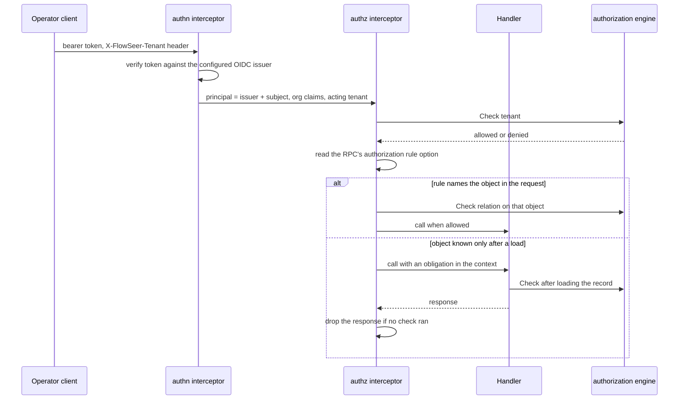

# Operator Authorization - Direction

`DeviceService`, `EdgeAdminService`, and `CaptureService` accept any caller
that reaches the API port. Nothing authenticates the caller, and a capture's
`requested_by` is whatever the caller writes about itself
(`src/services/device/README.md`, "What a deployment has to put in front of
it"). `GOALS.md` names OpenFGA for these surfaces and says no record decides
its shape. The [capture record's 2026-09-28
amendment](2026-09-09-remote-packet-capture-direction.md#2026-09-28--operator-identity-and-the-relations-capture-needs)
lists the relations capture needs and defers the model to this record.

This record decides how a caller becomes a principal and a tenant, how every
RPC is authorized, and who owns the relationships. It keeps the engine choice
open until a person reads both measured spikes. The measurements are in the
[OpenFGA note](../research/2026-09-30-openfga-authorization-spike.md) and the
[SpiceDB note](../research/2026-09-30-spicedb-authorization-spike.md).

This record now decides operator authorization. The earlier
`2026-09-28-operator-authorization-direction.md` remains useful as history,
including the identity and tenancy foundation that landed under it, but its
direction is superseded here.

## A request, end to end



## Decisions

### The engine remains a user decision

The two spikes ran the same workload on the same laptop. This record does not
recommend one engine. A person chooses after reading the measured evidence,
then amends this section and changes the record status.

#### OpenFGA evidence

The OpenFGA spike measured a self-hosted Apache-2.0 service with one shared
store. Its store boundary makes cross-tenant relationships straightforward,
so connected tenants such as a provider and its customer stay in one store.
Its cache-off mode gives the service a simple consistency rule. The
spike also found that recursive membership intersections made `ListObjects`
unreliable for filtered listings, so the direction lists FlowSeer records and
checks each parent rather than depending on that endpoint. See the
[OpenFGA spike](../research/2026-09-30-openfga-authorization-spike.md) for
the measurements and the OpenFGA-specific store and cache settings.

#### SpiceDB evidence

The SpiceDB spike measured v1.56.2 on PostgreSQL 17 beside OpenFGA v1.21.0
on its own PostgreSQL 17 datastore. In that session SpiceDB reached 2,158.3
checks per second versus OpenFGA's 1,218.2 with caches off. Both returned
complete 1,104-edge and 40,000-edge lookups. Both previewed the Tag deletion
with 698 remaining resources and agreed on every membership result. SpiceDB
also supplied `fully_consistent`, `at_least_as_fresh`, and
`minimize_latency` checks with a ZedToken for the freshness-sensitive cases.
See the [SpiceDB spike](../research/2026-09-30-spicedb-authorization-spike.md)
for the complete tables.

### A separate engine deployment next to its own Postgres

The selected engine runs as its own service, never embedded in a FlowSeer
host, backed by a Postgres datastore external from the first deployment. The
engine and its datastore can then move or scale without redeploying a FlowSeer
host. Each deployment enables authentication and TLS before it serves
FlowSeer and runs its schema migration as its own job. The OpenFGA spike used
`Authn.Method: none` and plaintext gRPC only for its local benchmark.

### Consistency is explicit at the adapter boundary

The initial deployment keeps OpenFGA's check caches off. If that engine is
selected and caching is enabled later, calls that hand out full payload,
device credentials, or admin grants use its higher-consistency option. If
SpiceDB is selected, the adapter chooses among `minimize_latency`,
`at_least_as_fresh` with the relevant ZedToken, and `fully_consistent` for the
same policy points. The engine-specific defaults and measurements stay in the
two research notes.

### The service boundary names no engine

FlowSeer reaches the selected engine through a Go interface for checks, bulk
checks, resource lookup, and relationship writes and deletes. An in-memory
fake implements the same interface for tests. The model configuration belongs
to the service adapter. Nothing under `spec/proto/` names an engine, stores an
engine schema fragment, or exposes an engine token format.

The wire contract carries structured object, relation, and subject fields. A
consistency token that must survive a restart is opaque bytes owned by the
adapter. Changing engines therefore changes the adapter and its configuration,
not the protobuf contract.

### Tenants, as landed

The tenant is a UUID-identified entity in `flowseer.model.identity.v1`, beside
`OperatorRef`, with `TenantLocalRef` and `TenantGlobalRef` plus the Config,
State, and Event triad
([tenant.proto](../../spec/proto/flowseer/model/identity/v1/tenant.proto)).
Its Config binds an issuer, an organization claim name, and an organization
value. The tenant store resolves an issuer and organization through its
`org_` index in one conditional batch
([tenantstore/store.go](../../src/services/device/internal/tenantstore/store.go)).

Tenant ids are canonical lowercase UUIDs in store keys, bus subjects, and
capture paths. The bus carries the id in tenant subjects and central audit
streams use a wildcard in the tenant position
([edgebus/subjects.go](../../src/modules/edgebus/subjects.go),
[edgebus/hub.go](../../src/modules/edgebus/hub.go)). Central stores partition
their keys by tenant. Lookup indexes are the exception because they resolve
an id before the tenant is known. Edge lookup uses `edge_<edge_id>`, setup-key
lookup uses `setupkey_<key_id>`, and tenant lookup uses `org_<hash>`
([edgestore/store.go](../../src/services/device/internal/edgestore/store.go),
[tenantstore/store.go](../../src/services/device/internal/tenantstore/store.go)).
Capture artifacts live under `<StateDir>/captures/<tenant_id>`
([captureapi/store.go](../../src/services/device/internal/captureapi/store.go)).

The platform admin configuration names its issuer, organization claim name and
value, and subject. The host validates those fields before it serves the
operator APIs
([config.go](../../src/services/device/internal/host/config.go)). The
identity tenant entity replaces the unused keyless inventory tenant shape, so
the tenant store is the source of existence and organization ownership.

`TenantService` is defined but not served until callers are authenticated.
Tests and development create tenants through the tenant store, so an
unauthenticated caller cannot create a tenant or claim an organization. State
written before the tenant change is not read: unprefixed keys, unscoped
capture files, and edge accounts without a persisted tenant are not migration
inputs.

### Any OIDC provider, and a tenant the request names

Authentication accepts tokens from a configured OIDC issuer: discovery,
JWKS, and the `iss`, `aud`, and `exp` checks. Nothing depends on one
provider. The principal is the issuer and the subject together, because
OIDC makes `sub` unique only within one issuer.

OIDC has no standard tenant claim. A request names the tenant it acts in in
a header, and the authorization interceptor admits it only when the
principal is an enrolled `member` of that tenant and the token claims the
tenant's configured organization. The tenant binding resolves the token's
issuer and organization claim to a FlowSeer tenant id. A request whose named
tenant is not claimed by the token, or whose caller is not enrolled, is
`PermissionDenied`, not `Unauthenticated`. Selecting the tenant through a
provider's organization scope was rejected because providers spell it
differently, and Zitadel's `urn:zitadel:iam:org:id` scope rejects users
whose access comes from a grant
([zitadel#11869](https://github.com/zitadel/zitadel/issues/11869)). Tenancy
stays ambient inside FlowSeer: the admitted tenant rides the request context,
never a payload field.

### Membership: owned by FlowSeer, confirmed by the token

The initial OpenFGA shape is:

```
type tenant
  relations
    define platform: [platform]
    define partner: [tenant]
    define claimed: [user]
    define enrolled: [user]
    define admin: [user, role#assignee] or admin from platform
    define active_admin: admin and member
    define member: (claimed and enrolled) or active_admin from partner or admin from platform
```

- `enrolled` is written and removed by FlowSeer's own membership API
  (invite, remove). Removing a member also removes that member's grants in
  the tenant, so an access review reads exact state.
- `claimed` is never stored. The authentication layer resolves every
  organization claim through the tenant binding, then supplies the matching
  claimed relationship or caveat context for the named tenant. When a
  provider removes someone from an organization, their access ends at the
  next token refresh, the access-token lifetime the provider configures. An
  issuer with no organization claim cannot satisfy the claimed-member path.
- `platform#admin` is a global admin. It inherits `tenant#admin` everywhere.
  It does not inherit `tenant#full_payload`, the grant to read captured
  payload, which is the most restricted data FlowSeer holds. Full payload
  stays an explicit, time-bounded grant that is written to the operator
  action trail.
- `partner` connects a service-provider tenant. A customer grants a role to
  `tenant:<provider>#active_admin`, and removes it with one delete.

The membership check runs once per request, on the tenant object. Resource
permissions (`edge#capture`, `capture_session#download`) are plain unions
over stored relationships in the initial OpenFGA model, with no intersection.
The OpenFGA spike measured why: an `and member from tenant` inside every
resource permission kept checks correct but made `ListObjects` return 11 of
1104 edges after 60 s for a Tag-derived grant, and 0 for a platform admin.
The same query on the union model took 9 ms and 148 ms. The
[OpenFGA spike](../research/2026-09-30-openfga-authorization-spike.md)
records the engine-specific failure. The
[SpiceDB spike](../research/2026-09-30-spicedb-authorization-spike.md)
reports the corresponding caveat-gated resource model and lookup.

Because resource permissions carry no membership term in the initial
OpenFGA model, every object check also asks whether the object's `tenant`
relation names the admitted tenant, and FlowSeer's grant API writes grants
only to members of the granting tenant. A capture session's permissions
derive from the edge stored with it, never from the edge a request names: the
capture store reads a session by its id alone (`Store.Session` in
`src/services/device/internal/captureapi/store.go`).

### Every RPC declares its rule

Each operator RPC carries an authorization rule as a protobuf method
option. One Connect interceptor enforces it:

| Rule mode | The interceptor |
| --- | --- |
| The object is named in a request field | checks the relation on that object before the handler runs |
| The object is the admitted tenant (creating an edge) | checks the relation on the tenant before the handler runs |
| The object is known only after a load | runs the handler with an obligation in the context, and returns `Internal` and drops the response when the handler returned without a check |
| The handler filters a list | same obligation as a load |
| No rule | refuses the call |

A conformance gate fails any operator RPC without a rule, so a forgotten
check is a denied call and a failed build, never an open door. Streaming
RPCs are refused until their rules are designed.

### Lists check per parent, never through ListObjects

A list reads a page from FlowSeer's own records and checks each distinct
parent once with `BatchCheck`: a page of capture sessions shares a few
edges. `ListObjects` is not used on a request path. OpenFGA caps results at
`listObjectsMaxResults` (1000 by default) and can return a partial result at
its deadline with no sign that the list is partial
([openfga/openfga#2828](https://github.com/openfga/openfga/issues/2828)).
The [SpiceDB spike](../research/2026-09-30-spicedb-authorization-spike.md)
reports its cursor-paged `LookupResources` equivalent.

### FlowSeer's records own every relationship

The selected engine holds a projection. Each relationship derives from a
FlowSeer record: an edge's tenant, a session's edge and requester, a member's
enrollment, a role, or a grant. A projector writes relationships as records
change and repairs drift. A removal that revokes access (a member, a grant,
a role assignment) also deletes its relationships before the RPC returns,
so revocation never waits on the projector. Keeping the source in FlowSeer's
records means any tenant's relationships can be rebuilt from them. That is
needed for the loss preview, and avoids depending on OpenFGA's shared-store
`Read` semantics when OpenFGA is selected.

### Previews of an access change

Adding or removing a Tag that changes access previews who gains or loses
what before an admin signs it off (`GOALS.md`). Sites and Tags have schemas
but no inventory service stores them yet, so the preview lands with that
service. Its shape is decided here:

- **Gains**: the candidate relationships go in as request-scoped additions
  supported by the selected adapter, and a per-edge comparison before and
  after gives who gains.
- **Losses**: the tenant's relationships are rebuilt into an isolated
  disposable datastore, the change is applied there, and the same per-edge
  diff runs against the live store. The OpenFGA spike rebuilt a
  14,629-relationship tenant in 0.55 s. The SpiceDB spike measured the same
  shape with 406 affected edges and 698 surviving resources. Both notes hold
  the engine-specific operations and timings.

An exclusion (`but not blocked`) on the recursive Tag relation was rejected
for the OpenFGA request path. It previewed losses exactly, but `ListObjects`
returned no results after 60 s for any grant that reaches an edge through a
Tag, with both of OpenFGA's ListObjects algorithms. The SpiceDB equivalent
and its `LookupResources` result are recorded in the
[SpiceDB spike](../research/2026-09-30-spicedb-authorization-spike.md).

### The operator action trail ships with authorization

Nothing records today who created an edge or minted a setup key
(`src/services/device/README.md`). Authorization adds global admins and
cross-tenant grants, so each admin-surface change and each full-payload
grant is recorded with its principal in the same change that turns
authorization on.

## Consequences

- Every operator request makes two checks. Both spikes measured the tenant
  gate and resource check separately, with the complete p50 and p99 tables in
  the research notes. The adapter keeps those checks behind one service
  contract.
- The operator API is unusable without an OIDC issuer and a selected engine
  deployment. The lab deployment gains both after the engine decision.
- `OperatorRef` names an issuer and a subject, and handlers stamp it from
  the authenticated principal instead of trusting the payload.
- Site and Tag grants and the preview wait for the inventory service. The
  selected engine's model reserves their types.
