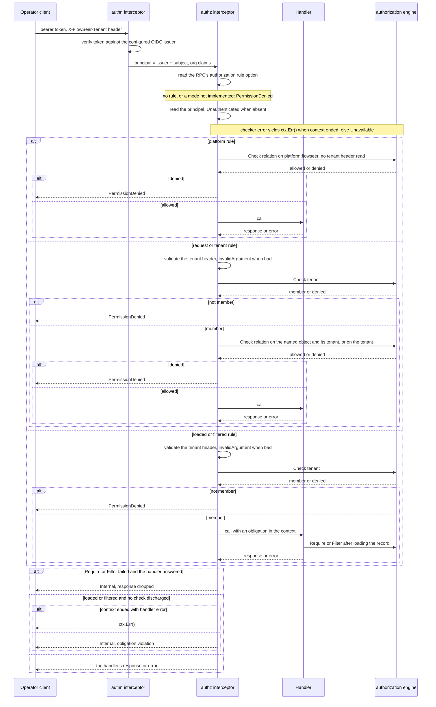

# Operator Authorization - Direction

`DeviceService`, `EdgeAdminService`, and `CaptureService` accept any caller
that reaches the API port. Nothing authenticates the caller, and a capture's
`requested_by` is whatever the caller writes about itself
(`src/services/device/README.md`, "Deployment"). `GOALS.md` names a
Zanzibar-style relationship engine for these surfaces and links this record.
The [capture record](2026-09-09-remote-packet-capture-direction.md#every-capture-is-bounded-and-authorized)
lists the relations capture needs and defers the model to this record.

This record describes how a caller becomes a principal and a tenant, how every
RPC is authorized, and who owns the relationships. Its engine is OpenFGA, chosen after a person read both measured spikes. The
measurements are in the
[OpenFGA note](../research/2026-09-30-openfga-authorization-spike.md) and the
[SpiceDB note](../research/2026-09-30-spicedb-authorization-spike.md).

This record takes over operator authorization from the
`2026-09-28-operator-authorization-direction.md` record. The earlier record
remains useful as history, including the identity and tenancy foundation that
landed under it. The user accepted this record on 2026-09-30.

## A request, end to end



## Decisions

### OpenFGA is the engine

The SpiceDB note measures both engines on one generated fixture and host.
Its dimensions match the OpenFGA note, but that note's individual fixture
list is absent. Grant distribution and stored-grant reference shape differ.
The OpenFGA note's client language is unknown. Neither note ranks the engines on latency or
throughput, and both keep revocation exact in their consistent modes. OpenFGA
was chosen: the rest of this record is written for its contextual tuples,
shared store, and check rules, and its consistency holds with the check cache
off or `HIGHER_CONSISTENCY`. SpiceDB would keep revocation exact with caching
on through ZedTokens. The triggers below say when that justifies a switch.
(decided by the user, 2026-09-30)

#### Why OpenFGA

OpenFGA is Apache-2.0, self-hostable, and a CNCF incubating project, which
satisfies the rule that infrastructure must be open and run in the EU under
our control.

The case for OpenFGA is that SpiceDB's advantages matter only under load
FlowSeer does not have: ZedTokens pay off when checks must be cached and
still see revocations at once, and cursored `LookupResources` pays off when
filtered listings run far past a page. Audit logging and Materialize sit in
SpiceDB's commercial builds. Under this argument, SpiceDB is worth revisiting
when any of these holds:

- authorization moves onto a hot path (per event, per assistant fan-out)
  where uncached checks cost too much,
- reads go to Postgres replicas or several regions while caching is on,
- a filtered listing must return far more than 1000 objects and cannot be
  paged against our own records,
- another system needs a push stream of access changes.

All tenants share one store. A store is OpenFGA's isolation boundary for
models and relationships, and a relationship cannot cross stores. Connected
tenants (a service provider's admins operating in a customer tenant) are a
relationship between two tenant objects, so they need one store.

Place OpenFGA close to its Postgres: one check makes several datastore round
trips and only one client round trip, and the spike measured the standalone
container faster than an embedded server that crossed a port forward to its
database.

Check caching stays off initially, so every read is strongly consistent.
The [OpenFGA note](../research/2026-09-30-openfga-authorization-spike.md#cache-staleness-across-replicas)
measured 1.509-9.019 s of stale allows across two instances on one datastore,
with the check cache and cache controller enabled at ten-second defaults.
The [SpiceDB note](../research/2026-09-30-spicedb-authorization-spike.md#revocation-and-cache-staleness)
re-measured OpenFGA over gRPC on its paired model with 292,238 relationships
plus temporary grant probes. Continuous polling and positive grant controls observed stale
allows, with last allows 1.924-8.743 s after the delete response. These
seconds-long windows agree. If caching is turned on later, calls that hand
out full payload, device credentials, or admin grants pass
`HIGHER_CONSISTENCY`. That preference skips the cache and reads the primary
even when a secondary datastore is configured
(`pkg/storage/postgres/postgres.go`, `getPgxPool`, OpenFGA v1.21.0).

The [OpenFGA membership note](../research/2026-09-30-openfga-authorization-spike.md#membership-gated-by-token-claims)
measured `and member from tenant` inside resource permissions on 336,249
relationships. At a 60-second deadline, it returned 11 of 1,104
Tag edges and zero platform-admin edges. The
[SpiceDB note's direct-tenant re-measurement](../research/2026-09-30-spicedb-authorization-spike.md#membership-aware-resource-lookup)
uses the paired model with 336,245 relationships and the same deadline. OpenFGA returned all 1,104
Tag edges in 905.764 ms, but zero platform-admin edges at 60 s. The Tag
lookup disagreement is unexplained. The fixtures and stored-grant reference
shape differ. On the 292,238-relationship union, the OpenFGA note measured
9 ms for Tag and 148 ms for admin. The SpiceDB note re-measured OpenFGA on the
paired model at
12.960 ms and 82.658 ms over gRPC. Because `ListObjects` caps results at
`listObjectsMaxResults` (1000 by default) and can return partial results at
its deadline without an indicator
([openfga/openfga#2828](https://github.com/openfga/openfga/issues/2828)),
lists check per parent against FlowSeer records rather than depending on that
endpoint. See the
[OpenFGA spike](../research/2026-09-30-openfga-authorization-spike.md) for the
measurements and configuration.

#### SpiceDB, the measured alternative

SpiceDB is Apache-2.0
([LICENSE](https://github.com/authzed/spicedb/blob/main/LICENSE)), a single Go
binary, and self-hosted on PostgreSQL
([datastores](https://authzed.com/docs/spicedb/concepts/datastores)).

The case for SpiceDB rests on four properties:

- **The tuple shape.** Its relationship API is already structured fields:
  `Relationship{resource: ObjectReference{object_type, object_id}, relation,
  subject: SubjectReference{object, optional_relation}}`
  ([authzed/api `core.proto`](https://raw.githubusercontent.com/authzed/api/main/authzed/api/v1/core.proto)).
- **Consistency.** It ships Zanzibar's consistency token as an opaque
  ZedToken ([ZedTokens](https://authzed.com/docs/spicedb/concepts/zedtokens)).
  A freshness-sensitive check uses `at_least_as_fresh` with the revoking
  write's ZedToken, or `fully_consistent` against the primary, to avoid
  serving a download from pre-revocation state. `minimize_latency` can
  select old state and allows the new-enemy problem
  ([consistency](https://authzed.com/docs/spicedb/concepts/consistency)).
- **Engine features.** SpiceDB provides caveats
  ([caveats](https://authzed.com/docs/spicedb/concepts/caveats)) and Watch.
  OpenFGA provides [conditions](https://openfga.dev/docs/modeling/conditions)
  and a polling [ReadChanges API](https://openfga.dev/docs/interacting/read-tuple-changes)
  for stored tuple changes. FlowSeer supplies tenant isolation with the
  tenant relation, key prefix, and handler check.
- **The vendor rule.** It is open source and self-hostable in our own
  environment without external cloud dependencies.

The [SpiceDB spike](../research/2026-09-30-spicedb-authorization-spike.md)
measures v1.56.2 on PostgreSQL 17 beside OpenFGA v1.21.0 over gRPC. Its tables
cover repeated point and batch latency (`fully_consistent` and
`minimize_latency`), throughput, cursor-paged resource lookup with last-page
timing, and continuously polled revocation with positive controls for all
three SpiceDB consistency modes. It also measures disposable rebuild/apply/diff,
and caveat-gated tenant and resource checks and lookup. It reports overlapping
spreads and unexplained contradictions of the OpenFGA note.

### A separate engine deployment next to its own Postgres

OpenFGA runs as its own service, never embedded in a FlowSeer
host, backed by a Postgres datastore external from the first deployment. The
engine and its datastore can then move or scale without redeploying a FlowSeer
host. OpenFGA starts with `Authn.Method: none` and plaintext gRPC by default.
Each deployment enables authentication and TLS before it serves FlowSeer
and runs its schema migration as its own job.

### Consistency is explicit at the adapter boundary

OpenFGA's check caching stays off initially. If caching is
enabled later, calls that hand out full payload, device credentials, or admin
grants use its higher-consistency option. Should SpiceDB replace it, the adapter
chooses among `minimize_latency`, `at_least_as_fresh` with the relevant
ZedToken, and `fully_consistent` for the same policy points. The
engine-specific defaults and measurements stay in the two research notes.

### The service boundary names no engine

FlowSeer reaches OpenFGA through a Go interface for checks, bulk
checks, resource lookup, and relationship writes and deletes. An in-memory
fake implements the same interface for tests. The model configuration belongs
to the service adapter. Nothing under `spec/proto/` names an engine, stores an
engine schema fragment, or exposes an engine token format.

The wire contract carries structured object, relation, and subject fields. A
consistency token that must survive a restart is opaque bytes owned by the
adapter. Changing engines therefore changes the adapter and its configuration,
not the protobuf contract.

### Tenants, as landed

The tenant is a UUID-identified entity in `flowseer.model.identity.v1`, beside
`OperatorRef`, with `TenantLocalRef` and `TenantGlobalRef` plus the Config,
State, and Event triad
([tenant.proto](../../spec/proto/flowseer/model/identity/v1/tenant.proto)).
Its Config binds an issuer, an organization claim name, and an organization
value.

The tenant store resolves an issuer and organization via `LookupByOrg` through
its `org_` index
(`src/services/device/internal/tenantstore/store.go:280`). `Create` stores a
tenant's record and its organization index together in one atomic batch on the
`tenants` bucket (`:113`, `:189`), so one organization binds at most one tenant
and a record without its index cannot exist (`:265`). Untested so far: a
physical file-store failure between the batch's stores, clustered
wrong-sequence responses, malformed records, and retry exhaustion.

Tenant ids are canonical lowercase UUIDs for tenant entities, in store keys,
bus subjects, and capture paths. `src/common/tenant/tenant.go` also accepts
`DefaultTenant = "default"`. Operator calls must supply the tenant in the
`X-FlowSeer-Tenant` request header (`src/services/device/internal/authz/interceptor.go:46-51`).
The bus carries the id in tenant subjects and central audit streams use a wildcard
in the tenant position ([edgebus/subjects.go](../../src/modules/edgebus/subjects.go),
[edgebus/hub.go](../../src/modules/edgebus/hub.go)).

Central's stores are partitioned by tenant: every key in the `device-lanes`,
`edges`, and `captures` buckets, and every key a later store adds, starts with
the tenant id. Lookup indexes are the exception because they resolve an
identifier before the tenant is known: `edge_<edge_id>` and `setupkey_<key_id>`
in `edges`, and `org_<hash>` in `tenants`
(`src/services/device/internal/edgestore/store.go:46-48`,
`orgIndexPrefix` and `OrgIndexKey` in
`src/services/device/internal/tenantstore/store.go`).
Stored bytes on disk, such as capture artifacts, live under
`<StateDir>/captures/<tenant_id>/`
(`Store.artifactPath`, `filepath.Join(s.capturesDir, tenantID)`, in
`src/services/device/internal/captureapi/store.go`).
A handler reads the tenant from the context and never from the request, so a
request cannot reach another tenant's keys.

An edge's tenant has one authority, its `edge_<edge_id>` index in `edges`
(`src/services/device/internal/edgestore/store.go:180`).
A device lane is keyed by its hosting edge's tenant
(`src/services/device/internal/journal/journal.go:100`,
`src/services/device/internal/host/serve.go:349-364`), and a
caller of another tenant gets `NotFound`
(`src/services/device/internal/deviceapi/service.go:159-162`,
`src/services/device/internal/deviceapi/errors.go:28`).
Nothing substitutes a default tenant for one it could not resolve
(`src/services/device/internal/host/host.go:334-343`).

The platform admin configuration names its issuer, organization claim name and
value, and subject. The host validates those fields before it serves the
operator APIs
(`parseConfig`, `protovalidate.Validate`, in
`src/services/device/internal/host/config.go`, and `PlatformAdmin` in
`spec/proto/flowseer/store/device/v1/service_config.proto`). The identity tenant
entity replaces the unused keyless inventory tenant shape, so
the tenant store is the source of existence and organization ownership.

`TenantService` is defined but not served until callers are authenticated.
Tests and development create tenants through the tenant store, so an
unauthenticated caller cannot create a tenant or claim an organization. State
written before the tenant change is not read: unprefixed keys, capture files
directly under `<StateDir>/captures/`, and edge accounts without a persisted
tenant are not migration inputs.

### Any OIDC provider, and a tenant the request names

Authentication accepts tokens from a configured OIDC issuer: discovery,
JWKS, and the `iss`, `aud`, and `exp` checks. Nothing depends on one
provider. The principal is the issuer and the subject together, because
OIDC makes `sub` unique only within one issuer.

OIDC has no standard tenant claim. A request names the tenant it acts in in
a header, and the authorization interceptor admits only a `member` of the
named tenant. Membership is FlowSeer enrollment with a token claiming the
tenant's configured organization, or reach through `partner` or `platform`.
The tenant binding resolves the token's issuer and organization claim to a
FlowSeer tenant id. A caller who is not a member of the named tenant is
`PermissionDenied`, not `Unauthenticated`. Selecting the tenant through a
provider's organization scope was rejected because providers spell it
differently, and Zitadel's `urn:zitadel:iam:org:id` scope rejects users
whose access comes from a grant
([zitadel#11869](https://github.com/zitadel/zitadel/issues/11869)). Tenancy
stays ambient inside FlowSeer: the admitted tenant rides the request context,
never a payload field.

### Membership: owned by FlowSeer, confirmed by the token

The initial OpenFGA shape is:

```
type tenant
  relations
    define platform: [platform]
    define partner: [tenant]
    define claimed: [user]
    define enrolled: [user]
    define admin: [user, role#assignee] or admin from platform
    define active_admin: admin and member
    define member: (claimed and enrolled) or active_admin from partner or admin from platform
```

- `enrolled` is written and removed by FlowSeer's own membership API
  (invite, remove). Removing a member also removes that member's grants in
  the tenant, so an access review reads exact state.
- `claimed` is never stored. The authentication layer resolves every
  organization claim through the tenant binding, then supplies the matching
  claimed relationship or caveat context for the named tenant. When a
  provider removes someone from an organization, their access ends at the
  next token refresh, the access-token lifetime the provider configures. An
  issuer with no organization claim cannot satisfy the claimed-member path.
- `platform#admin` is a global admin. It inherits `tenant#admin` everywhere.
  It does not inherit `tenant#full_payload`, the grant to read captured
  payload, which is the most restricted data FlowSeer holds. Full payload
  stays an explicit, time-bounded grant that is written to the operator
  action trail.
- `partner` connects a service-provider tenant. A customer grants a role to
  `tenant:<provider>#active_admin`, and removes it with one delete.

The membership check runs once per request, on the tenant object. Resource
permissions (`edge#capture`, `capture_session#download`) are plain unions
over stored relationships in the initial OpenFGA model, with no intersection.
The [OpenFGA note](../research/2026-09-30-openfga-authorization-spike.md#membership-gated-by-token-claims)
measured the direct-tenant intersection on 336,249 relationships:
11 of 1,104 Tag edges and zero platform-admin edges at a 60-second deadline.
The [SpiceDB note](../research/2026-09-30-spicedb-authorization-spike.md#membership-aware-resource-lookup)
re-measured that placement on 336,245 relationships over gRPC. OpenFGA
returned 1,104 Tag edges in 905.764 ms and zero platform-admin edges at 60 s.
The Tag disagreement is unexplained, with different fixtures and stored-grant
reference shapes. The OpenFGA note's 292,238-relationship union returned the
Tag and admin sets in 9 ms and 148 ms. The SpiceDB note's paired-model OpenFGA
counterparts took 12.960 ms and 82.658 ms. These observations apply to the
models and fixtures measured.

Because resource permissions carry no membership term in the initial
OpenFGA model, every object check also asks whether the object's `tenant`
relation names the admitted tenant, and FlowSeer's grant API writes grants
only to members of the granting tenant. A capture session's permissions
derive from the edge stored with it, never from the edge a request names: the
capture store reads a session by tenant and session id (`Store.Session` in
`src/services/device/internal/captureapi/store.go`).

### Every RPC declares its rule

Each operator RPC carries an authorization rule as a protobuf method
option. One Connect interceptor enforces it:

| Rule mode | The interceptor |
| --- | --- |
| The object is named in a request field | checks the relation on that object before the handler runs, drops a response returned while a check is in flight, and returns `Internal` and drops the response after a failed `Require`, `Filter`, or `Abandon` |
| The object is the admitted tenant (creating an edge) | checks the relation on the tenant before the handler runs, drops a response returned while a check is in flight, and returns `Internal` and drops the response after a failed `Require`, `Filter`, or `Abandon` |
| The object is the platform | checks the relation on `platform:flowseer` before the handler runs, reading no tenant header, drops a response returned while a check is in flight, and returns `Internal` and drops the response after a failed `Require`, `Filter`, or `Abandon` |
| The object is known only after a load | runs the handler with an obligation in the context, drops a response returned while a check is in flight, and returns `Internal` and drops the response when the handler returned without a check or answered after a failed `Require`, `Filter`, or `Abandon`, or `ctx.Err()` when the handler returned an error with no check after the context ended |
| The handler filters a list | same obligation as a load, with `Abandon` available for pre-check store failures |
| No rule | refuses the call |

A conformance gate fails any operator RPC without a rule, so a forgotten
check is a denied call and a failed build, never an open door. A streaming
call is authorized only under a request rule on a server stream. Client and
bidirectional streams, and streams under other modes, are refused with
`authz/streaming-unsupported`. The interceptor reads the rule, principal,
and tenant header and checks tenant membership before invoking the handler,
then evaluates object and tenant relationships on the first received message.

### Lists check per parent, never through ListObjects

A list reads a page from FlowSeer's own records and checks each distinct
parent once with `BatchCheck`: a page of capture sessions shares a few
edges. `ListObjects` is not used on a request path. OpenFGA caps results at
`listObjectsMaxResults` (1000 by default) and can return a partial result at
its deadline with no sign that the list is partial
([openfga/openfga#2828](https://github.com/openfga/openfga/issues/2828)).
The [SpiceDB spike](../research/2026-09-30-spicedb-authorization-spike.md)
reports its cursor-paged `LookupResources` equivalent.

### FlowSeer's records own every relationship

OpenFGA holds a projection. Each relationship derives from a
FlowSeer record: an edge's tenant, a session's edge and requester, a member's
enrollment, a role, or a grant. A projector writes relationships as records
change and repairs drift. A removal that revokes access (a member, a grant,
a role assignment) also deletes its relationships before the RPC returns,
so revocation never waits on the projector. Keeping the source in FlowSeer's
records means any tenant's relationships can be rebuilt from them. That is
needed for the loss preview, and avoids depending on engine-specific
relationship reads to select a single tenant's relationships.

### Previews of an access change

Adding or removing a Tag that changes access previews who gains or loses
what before an admin signs it off (`GOALS.md`). Sites and Tags have schemas
but no inventory service stores them yet, so the preview lands with that
service. Its shape is described here:

- **Gains**: OpenFGA can supply candidate relationships as contextual tuples,
  and a per-edge comparison gives who gains. SpiceDB has no request-scoped
  relationships, so its adapter must isolate candidate relationships in a
  disposable datastore before making that comparison.
- **Losses**: the tenant's relationships are rebuilt into an isolated
  disposable datastore, the change is applied there, and the same per-edge
  diff runs against the live store. The
  [OpenFGA note](../research/2026-09-30-openfga-authorization-spike.md#previewing-a-tag-change)
  rebuilt a 14,629-relationship union tenant, including sessions, in 0.55 s.
  Apply took 0.10 s and the all-user `ListUsers` diff of 406
  edges took 2.54 s, with 291 lost pairs. The
  [SpiceDB note](../research/2026-09-30-spicedb-authorization-spike.md#disposable-rebuild)
  re-measured a 14,615-relationship union tenant including sessions. OpenFGA
  took 1,489.714 ms to load, 56.711 ms to apply, and 1,793.662 ms to diff
  over gRPC. Its dedicated Tag-user fixture loses 406 pairs. The missing
  14 relationships and timing difference are unexplained. SpiceDB's
  corresponding times were 544.766, 38.017, and 3,204.364 ms.

The rejection of recursive Tag exclusion (`but not blocked`) applies to
the [OpenFGA note's exclusion fixture](../research/2026-09-30-openfga-authorization-spike.md#previewing-a-tag-change):
372,239 relationships, exclusion on recursive Tag permissions, and a
60-second deadline. It previewed losses exactly but returned zero Tag-derived
objects with both ListObjects algorithms.
The [SpiceDB note](../research/2026-09-30-spicedb-authorization-spike.md#tag-exclusion-and-preview)
did not measure the exclusion variant comparably.

### The operator action trail ships with authorization

The operator action trail records who created an edge, minted a setup key, or
downloaded a capture. Authorization adds global admins and cross-tenant grants,
so each recorded operator action is emitted with its authenticated
`OperatorRef`, object, action, and outcome in the same change that turns
authorization on. That event goes to a single stream using
`flowseer.<tenant>.operator.action.<action>` subjects (subject pattern in
`src/modules/edgebus/subjects.go:86-88`, stream binding in `src/modules/edgebus/hub.go:400`).

## Consequences

- Every operator request makes two checks. Both spikes measured the tenant
  gate and resource check separately, with the complete p50 and p99 tables in
  the research notes. The adapter keeps those checks behind one service
  contract.
- The operator API is unusable without an OIDC issuer and an OpenFGA
  deployment. The lab deployment gains both in this record's second phase.
- `OperatorRef` names an issuer and a subject, and handlers stamp it from
  the authenticated principal instead of trusting the payload.
- Site and Tag grants and the preview wait for the inventory service. The
  OpenFGA model reserves their types.

## Amendments

### 2026-10-02: platform rule mode

The rule-mode table gains a platform row for global admin RPCs on
`TenantService`. The interceptor checks `platform:flowseer` with its
relation, reads no tenant header, and sets no tenant in the context.

A tenant in a platform request is the object the RPC reads, never the
tenant the call is admitted to, so the interceptor reads no tenant header,
makes no membership check and no tenant-relation check, puts no tenant in
the context, and makes one check on `platform:flowseer`, and `Require` and
`Filter` refuse under it.

### 2026-10-02: failed checks and ended contexts

A response is dropped after any error from `Require` or `Filter`, in every
mode: a denial, a checker error, a short `BatchCheck` answer, or the refusal
under a platform rule. The caller gets `Internal` with
`authz/obligation-violation` and a retry disposition other than retryable,
and the failure is sticky for the call, so a later successful check does not
clear it. Without this a handler that ignores the error returns its response,
and a `Filter` handler that ignores it can return the unfiltered list. The
answer is `Internal` even when the ignored error was `Unavailable`, because
the response exists only because a handler discarded an error and no retry
repairs that. The interceptor cannot tell a retry of one check from a
different check, and a handler that wants a retry returns the retryable error
itself. The violation is not retryable because an `errs` chain reports the
outermost disposition any link expressed (`retryOf` in
`src/common/errs/retry.go`), so a violation that took the retryable
`authz/unavailable` as its cause would tell the caller to retry. The earlier
rule dropped a response only when the handler returned without a check, and
the table's rows say so now.

A call whose context has ended answers with `ctx.Err()` itself, bare and
outside `connecterr`, in two places. A checker error returned while
`ctx.Err()` is non-nil yields it in place of `Unavailable`, from the
interceptor, `Require`, and `Filter` alike. Under a loaded or filtered rule,
a handler path that ends in an error with no check discharged while
`ctx.Err()` is non-nil yields it in place of `Internal`. A response never
passes on this ground, and a query the checker answered false stays
`PermissionDenied`. The reasons:

- `docs/code-style.md:255-256` has cancellation surface as the unwrapped
  `ctx.Err()`, so `errors.Is(err, context.Canceled)` holds end to end.
- Connect's `NewUnaryHandler` returns `ctx.Err()` without calling the handler
  once the context has ended (`connectrpc.com/connect@v1.21.0`, `handler.go:44-46`),
  so a loaded or filtered handler never runs and no check is discharged.
- Connect codes a context error only when nothing has coded it. The close of
  the handler connection runs `wrapIfContextError`, which returns a
  `*connect.Error` as it is and otherwise maps `context.Canceled` to
  `Canceled` and `context.DeadlineExceeded` to `DeadlineExceeded`
  (`connectrpc.com/connect@v1.21.0`, `error.go:293-313`). Wrapping the
  context error with `connecterr` would fix a code first.
- The test is on `ctx.Err()` and not on the checker's error, because the
  interceptor cannot tell a handler Connect skipped from one that ran and
  failed before its check, and the second one's error could say whether an
  object exists. `Checker` does not promise an error that unwraps to the
  context's.

### 2026-10-03: authorization model, principal identity, and configuration

#### The authorization model

The OpenFGA model is stored in protojson format at
`src/services/device/internal/authz/openfga/model.json` and corresponds to this
DSL:

```openfga
model
  schema 1.1
type user
type platform
  relations
    define claimed: [user]
    define enrolled: [user]
    define admin: claimed and enrolled
type role
  relations
    define assignee: [user]
type tenant
  relations
    define platform: [platform]
    define partner: [tenant]
    define claimed: [user]
    define enrolled: [user]
    define admin: [user, role#assignee] or admin from platform
    define active_admin: admin and member
    define member: (claimed and enrolled) or active_admin from partner or admin from platform
    define operator: [user, role#assignee, tenant#active_admin] or admin
    define capturer: [user, role#assignee, tenant#active_admin] or admin
    define viewer: [user, role#assignee, tenant#active_admin] or operator or capturer
    define full_payload: [user, role#assignee]
type site
type tag
type edge
  relations
    define tenant: [tenant]
    define administer: [user, role#assignee] or admin from tenant
    define operate: [user, role#assignee] or operator from tenant
    define capture: [user, role#assignee] or capturer from tenant
    define view: [user, role#assignee] or administer or operate or capture or viewer from tenant
type device
  relations
    define tenant: [tenant]
    define operate: [user, role#assignee] or operator from tenant
    define view: [user, role#assignee] or operate or viewer from tenant
type capture_session
  relations
    define tenant: [tenant]
    define edge: [edge]
    define requester: [user]
    define manage: capture from edge
    define download: requester or capture from edge
```

The relations beyond the core tenant shape grant resource permissions and
cross-tenant roles:

- `platform#admin` is `claimed and enrolled`, so a contextual token claim and a
  stored platform assignment must both hold. A platform administrator loses
  reach when the token stops carrying the claim.
- Grants on `edge` and `device` are direct assignees or inherited from tenant
  roles. Direct grants support fine-grained permissions on individual devices
  or edges without site or tag infrastructure.
- `tenant#active_admin` is a grantee on `tenant#operator`, `tenant#capturer`,
  and `tenant#viewer`, so a partner administrator can hold an operational role
  in a customer tenant.
- `capture_session#manage` delegates to edge capture permissions, while
  `download` allows either the original requester or a user holding edge capture
  permissions.

The earlier decision stating that resource permissions avoid intersections
holds for resource types (`edge`, `device`, `capture_session`). Those types
evaluate unions of direct assignees and tenant-derived roles. Intersections
occur on `platform#admin` (`claimed and enrolled`), on `tenant#active_admin`
(`admin and member`), and on the `claimed and enrolled` term of `tenant#member`.
A resource permission reaches `platform#admin`, `tenant#active_admin`, and the
term of `tenant#member` only through `tenant`.

#### Principal identification

`ComputePrincipalID` returns the lowercase hex SHA-256 digest of
`issuer + "\x00" + subject`, and a `Principal` carries it in its `ID` field
(`src/services/device/internal/authn/principal.go`).
The zero-byte separator prevents collisions between distinct issuer and subject
pairs that share concatenations. The hex form sidesteps what OpenFGA rejects in
a user id. It refuses an id holding `:`
(`github.com/openfga/openfga@v1.21.0`, `pkg/tuple/tuple.go:417-438`), reads
`user:a#b` as a userset and `user:*` as a wildcard
(`pkg/tuple/tuple.go:515-517`), and caps the user at 512 characters
(`github.com/openfga/api/proto@v0.0.0-20260723150800-6981fff8d33b`,
`openfga/v1/openfga_service.pb.validate.go:2642`), while an issuer URL holds `:`
and may be 2048 characters long.

#### Issuer configuration

`OperatorAuthentication` configures up to 8 OIDC issuers, and the verifier
routes a token by its exact `iss`. Each entry requires an HTTPS issuer URL and
audience string, with an optional organization claim name. A tenant binds one
issuer (`TenantConfig` in
`spec/proto/flowseer/model/identity/v1/tenant.proto:36-57`), and a second
issuer's users reach it through `partner` or `platform`. An issuer configured
with no organization claim yields no `claimed` tenant. The record's "a
configured OIDC issuer" is one entry of this list. Issuers and engine endpoints
require HTTPS to prevent cleartext network manipulation of token verification
keys.

#### Engine configuration

`AuthorizationEngine` configures the OpenFGA connection through opaque bounded
strings (`store_id` and `model_id`) rather than naming engine internals in the
protobuf schema. The service adapter validates the engine identifier format and
verifies that the remote model matches the embedded model before first use.

### 2026-10-03: server-streaming authorization, in-flight checks, and abandon

Server-streaming RPCs under a request rule (`TailCaptureSession` and
`DownloadCaptureSession`) are authorized by checking tenant membership at
admission and evaluating object permissions on the first received request
message. Client and bidirectional streams, and streams under other modes, answer
`CodePermissionDenied` with `authz/streaming-unsupported`. The obligation tracker
tracks in-flight relationship checks, dropping responses returned while a check
is in flight with `Internal` and `authz/obligation-violation`. `authz.Abandon`
allows handlers encountering store errors before relationship checks to
discharge their obligation while failing closed against subsequent responses.

### 2026-10-03: interceptor chain, projector, identity, and action trail

#### Interceptor ordering and startup validation

Operator handlers run behind telemetry, panic recovery, authentication,
validation, authorization, and action trail interceptors in that order
(`operatorInterceptors` in `src/services/device/internal/host/serve.go:161-168`).
Running validation before authorization guarantees that object identifiers passed
to authorization rules conform to schema constraints. Placing the action trail
innermost ensures that it records only calls admitted by authorization. Edge
handlers mount telemetry, panic recovery, and validation only
(`edgeInterceptors` in `src/services/device/internal/host/serve.go:125-129`),
because edges authenticate through signed edge assertions
(`src/services/device/README.md`) rather than operator tokens.

`TenantInterceptor` and `DeviceServiceConfig.dev_tenant` are removed, so
tenancy derives strictly from the `X-FlowSeer-Tenant` request header.
Service configuration requires both `authentication` and `authorization` sections
because the service cannot safely process operator requests without them.
Offline configuration errors abort startup before listeners bind. Network
unreachability of the authorization engine leaves the service running, so edge
traffic continues uninterrupted while operator calls fail closed with
`CodeUnavailable`.

The OpenFGA adapter validates store and model identifier syntax offline, but
verifies the remote model against the embedded model before first use rather
than during service initialization. Verifying lazily avoids supervisor crash
loops when OpenFGA starts slowly or experiences transient outages during
central boot.

#### Relationship projector

The relationship projector synchronizes authorization tuples for edges,
devices, and capture sessions into OpenFGA. Handlers creating edges or sessions
trigger immediate synchronization hooks, while a background reconciler scans
storage every 10 minutes (`RelationshipReconcile` in
`src/services/device/internal/host/config.go:158-173`) to heal drift.

The projector owns five relations and touches no other tuple:

| Object | Relation | Derived from |
| --- | --- | --- |
| `edge:<id>` | `tenant` | the `edge_<id>` index entry (`src/services/device/internal/edgestore/store.go:169-189`) |
| `device:<id>` | `tenant` | the registry listing the device, and the index entry of the registry's edge (`src/services/device/internal/deviceapi/service.go:137-162`) |
| `capture_session:<id>` | `tenant` | the tenant part of the session's key (`src/services/device/internal/captureapi/store.go:88-93`) |
| `capture_session:<id>` | `edge` | `config.ref.edge.edge.id` (`CaptureSessionGlobalRef` in `spec/proto/flowseer/model/capture/v1/capture_session.proto:30-35`) |
| `capture_session:<id>` | `requester` | `user:` and `authn.ComputePrincipalID` of `config.authorization.requested_by` (`src/services/device/internal/authn/principal.go`) |

These five relations support the OpenFGA model's `from tenant` and `from edge`
terms and the interceptor's tenant check. A session stored with no issuer in
`requested_by` gets no `requester` tuple. A device relationship derives from the
registry listing and the hosting edge's index entry rather than Key-Value
records. A device has no Key-Value lane record until its first mutation
(`src/services/device/internal/journal/journal.go:175-176`), so deriving tenancy
from the registry allows initial authorization checks to succeed without
creating phantom records.

`Sync(object)` (`src/services/device/internal/projector/projector.go:90-132`)
is the only code that writes or deletes a relationship. It reads the object's
stored tuples, then the record, and writes the difference in one call. A
creating handler writes the record before its tuples, and identifiers are random
UUIDs that are never reused. Tuples whose record is absent when read afterwards
belong to a record that was deleted.

A handler that creates a record projects it before answering (`CreateEdge` in
`src/services/device/internal/edgeapi/admin.go:194`, `CreateCaptureSession` in
`src/services/device/internal/captureapi/operator_service.go:180-186`). A failed projection is
logged while the handler answers anyway. The record in storage is the authority
and the next reconciliation pass repairs the projection. For example,
`CreateEdge` returns the single-use setup key (`src/services/device/internal/edgeapi/admin.go:145-161`),
and failing the call would cause a retrying caller to mint a second edge.

A reconcile pass runs at start and then every 10 minutes (`intervals.relationship_reconcile`).
A failed pass is retried after 5 s, doubling on consecutive failures up to the
configured interval. The projector module is declared last in supervision so its
restart restarts nothing else. A device listed in the registry is authorized
once the first pass after start has run, because the registry is read once at
start (`src/services/device/internal/host/host.go:102`). `host.Options.Reconciled`
fires after each completed pass with no error, allowing tests and supervisory
callers to wait on initial projection completion just as `Bound` signals
listener availability.

#### Operator identity

`OperatorRef` requires both `issuer` and `subject` fields to uniquely identify
the caller across identity providers. The verifier
(`src/services/device/internal/authn/verifier.go:424-426`)
refuses a subject longer than 256 characters (the bound `OperatorRef.subject`
carries in `spec/proto/flowseer/model/identity/v1/operator.proto:12-16`), so every
admitted principal can be recorded.

Central stamps the authenticated principal onto request payloads, replacing
caller-supplied values in mutation intents and capture authorizations to prevent
identity spoofing (`src/services/device/internal/deviceapi/apply.go:25-37`,
`src/services/device/internal/captureapi/operator_service.go:155-162`). `MutationIntent.actor`
(`spec/proto/flowseer/model/access/v1/operation.proto:130`) and
`CaptureAuthorization.requested_by` (`spec/proto/flowseer/model/capture/v1/capture_session.proto:109-117`)
remain on their messages but are no longer required in schema validation. Both
messages serve as request payloads and stored records simultaneously (journal
records, audit logs, and edge dispatch requests). Introducing separate
request-only messages would require widespread breaking API changes where central
stamping prevents identity spoofing.

`AbandonMutationRequest.actor` and `ResolveDesynchronizationRequest.actor`
(`spec/proto/flowseer/api/device/v1/device_service.proto`) were removed and their
field numbers and names reserved. Neither handler ever read them
(`src/services/device/internal/deviceapi/resolve.go`), eliminating client-supplied
identity that was never verified or recorded.

Idempotency digests incorporate the principal as `operator:<issuer>\x00<subject>`
to isolate idempotency keys across operators (`src/services/device/internal/journal/journal.go:1017-1037`).

#### Operator action trail

The action trail records only the nine procedures in the interceptor table
(`src/services/device/internal/actiontrail/interceptor.go:32-45`): `CreateEdge`,
`IssueSetupKey`, `RevokeSetupKey`, `RetireEdge`, `GetEdge`, and `ListEdges` on
`EdgeAdminService`, along with full-payload `CreateCaptureSession`,
`TailCaptureSession`, and `DownloadCaptureSession` on `CaptureService`. Calls
refused by authentication or authorization interceptors are excluded from the
trail, preventing unauthenticated or unauthorized callers from polluting audit
streams. A denial inside the handler (such as the full-payload capture
authorization check in `src/services/device/internal/captureapi/operator_service.go:127-134`)
is recorded with outcome `OPERATOR_ACTION_OUTCOME_DENIED`
(`src/services/device/internal/actiontrail/interceptor.go:87-95`), because the handler
was reached by an authenticated caller and the attempt was already recorded. The
completion records the outcome the handler returned.

The `OperatorActionEvent` schema omits a dedicated tenant field because tenancy
is ambient and encoded directly into the NATS subject token
`flowseer.<tenant>.operator.action.<action>`. Records are stored in a single
JetStream stream `FLOWSEER_OPERATOR_ACTIONS` configured with file storage, a 64
MiB total budget, and a limit of 10,000 records per subject with oldest records
discarded first. Reads are recorded too, and a caller who may only view edges
could otherwise push the record of who minted a setup key out of a shared limit.
With a subject per tenant and action (`flowseer.<tenant>.operator.action.<action>`),
high-volume read operations under one action cannot evict setup key issuance
records, and a flood evicts only records of its own action.

A recorded call publishes an attempt event before the handler executes,
ensuring durable recording before any state change is made. If attempt
publication fails, execution halts and returns `CodeUnavailable` with
`actiontrail/unavailable`. If completion publication fails, the failure is
logged while the handler response returns to the caller, because the operation
has already taken effect and cannot be rolled back.
