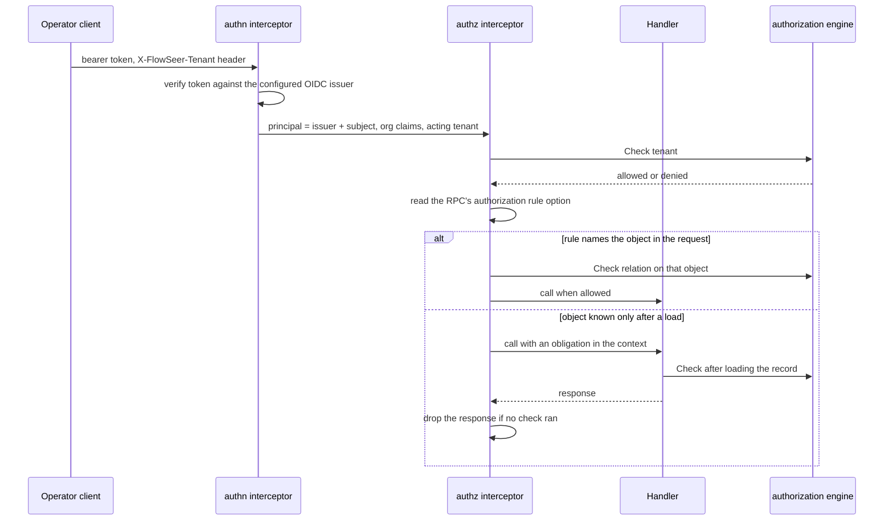

# Operator Authorization - Direction

`DeviceService`, `EdgeAdminService`, and `CaptureService` accept any caller
that reaches the API port. Nothing authenticates the caller, and a capture's
`requested_by` is whatever the caller writes about itself
(`src/services/device/README.md`, "Deployment"). `GOALS.md` names a
Zanzibar-style relationship engine for these surfaces and links this record.
The [capture record's 2026-09-28
amendment](2026-09-09-remote-packet-capture-direction.md#2026-09-28--operator-identity-and-capture-authorization)
lists the relations capture needs and defers the model to this record.

This record decides how a caller becomes a principal and a tenant, how every
RPC is authorized, and who owns the relationships. It keeps the engine choice
open until a person reads both measured spikes. The measurements are in the
[OpenFGA note](../research/2026-09-30-openfga-authorization-spike.md) and the
[SpiceDB note](../research/2026-09-30-spicedb-authorization-spike.md).

This record now decides operator authorization. The earlier
`2026-09-28-operator-authorization-direction.md` remains useful as history,
including the identity and tenancy foundation that landed under it, but its
direction is superseded here.

## A request, end to end



## Decisions

### The engine remains a user decision

The two spikes ran the same workload on the same laptop. This record does not
recommend one engine. A person chooses after reading the measured evidence,
then amends this section and changes the record status.

#### OpenFGA evidence

OpenFGA is Apache-2.0, self-hostable, and a CNCF incubating project, which
satisfies the rule that infrastructure must be open and run in the EU under
our control.

The case for OpenFGA is that SpiceDB's advantages matter only under load
FlowSeer does not have: ZedTokens pay off when checks must be cached and
still see revocations at once, and cursored `LookupResources` pays off when
filtered listings run far past a page. Audit logging and Materialize sit in
SpiceDB's commercial builds. Under this argument, SpiceDB is worth revisiting
when any of these holds:

- authorization moves onto a hot path (per event, per assistant fan-out)
  where uncached checks cost too much,
- reads go to Postgres replicas or several regions while caching is on,
- a filtered listing must return far more than 1000 objects and cannot be
  paged against our own records,
- another system needs a push stream of access changes.

All tenants share one store. A store is OpenFGA's isolation boundary for
models and relationships, and a relationship cannot cross stores. Connected
tenants (a service provider's admins operating in a customer tenant) are a
relationship between two tenant objects, so they need one store.

Place OpenFGA close to its Postgres: one check makes several datastore round
trips and only one client round trip, and the spike measured the standalone
container faster than an embedded server that crossed a port forward to its
database.

Check caching stays off initially, so every read is strongly consistent. With
several OpenFGA replicas each holds its own cache, and the spike measured a
revoked grant still allowed for 1.5 s to 9.0 s on the other replica, bounded
by `cacheController.ttl` (10 s by default). If caching is turned on later,
calls that hand out full payload, device credentials, or admin grants pass
`HIGHER_CONSISTENCY`. That preference skips the cache and reads the primary
even when a secondary datastore is configured
(`pkg/storage/postgres/postgres.go`, `getPgxPool`, OpenFGA v1.21.0).

The spike also measured why resource permissions are plain unions with no
intersection: an `and member from tenant` inside every resource permission
kept checks correct but made `ListObjects` return 11 of 1104 edges after 60 s
for a Tag-derived grant, and 0 for a platform admin. The same query on the
union model took 9 ms and 148 ms. Because `ListObjects` caps results at
`listObjectsMaxResults` (1000 by default) and can return partial results at
its deadline without an indicator
([openfga/openfga#2828](https://github.com/openfga/openfga/issues/2828)),
lists check per parent against FlowSeer records rather than depending on that
endpoint. See the
[OpenFGA spike](../research/2026-09-30-openfga-authorization-spike.md) for the
measurements and configuration.

#### SpiceDB evidence

SpiceDB is Apache-2.0
([LICENSE](https://github.com/authzed/spicedb/blob/main/LICENSE)), a single Go
binary, and self-hosted on PostgreSQL
([datastores](https://authzed.com/docs/spicedb/concepts/datastores)).

The case for SpiceDB rests on four properties:

- **The tuple shape.** Its relationship API is already structured fields:
  `Relationship{resource: ObjectReference{object_type, object_id}, relation,
  subject: SubjectReference{object, optional_relation}}`
  ([authzed/api `core.proto`](https://raw.githubusercontent.com/authzed/api/main/authzed/api/v1/core.proto)).
- **Consistency.** It ships Zanzibar's consistency token as an opaque
  ZedToken ([ZedTokens](https://authzed.com/docs/spicedb/concepts/zedtokens)).
  That closes the new-enemy problem: when an operator's access is revoked, a
  download a moment later is not served from old state. It provides
  `fully_consistent`, `at_least_as_fresh` with a ZedToken, and
  `minimize_latency` for freshness-sensitive paths.
- **Engine features an adapter cannot add.** Caveats
  ([Caveats](https://authzed.com/docs/spicedb/concepts/caveats)) and a Watch
  stream are engine features. Per-tenant isolation is not: FlowSeer supplies
  it with the tenant relation, the key prefix, and the handler check.
- **The vendor rule.** It is open source and self-hostable in our own
  environment without external cloud dependencies.

The [SpiceDB spike](../research/2026-09-30-spicedb-authorization-spike.md)
measures v1.56.2 on PostgreSQL 17 beside OpenFGA v1.21.0 on the same workload:
check latency across consistency modes (`fully_consistent`,
`at_least_as_fresh`, `minimize_latency`), throughput under concurrent callers,
cursor-paged `LookupResources` for Tag grants and platform admins, revocation
propagation across replicas with ZedTokens, Tag deletion preview using
exclusion (`-`), and caveat-gated membership.

### A separate engine deployment next to its own Postgres

The selected engine runs as its own service, never embedded in a FlowSeer
host, backed by a Postgres datastore external from the first deployment. The
engine and its datastore can then move or scale without redeploying a FlowSeer
host. Each deployment enables authentication and TLS before it serves
FlowSeer and runs its schema migration as its own job. The OpenFGA spike used
`Authn.Method: none` and plaintext gRPC only for its local benchmark.

### Consistency is explicit at the adapter boundary

If OpenFGA is selected, check caching stays off initially. If caching is
enabled later, calls that hand out full payload, device credentials, or admin
grants use its higher-consistency option. If SpiceDB is selected, the adapter
chooses among `minimize_latency`, `at_least_as_fresh` with the relevant
ZedToken, and `fully_consistent` for the same policy points. The
engine-specific defaults and measurements stay in the two research notes.

### The service boundary names no engine

FlowSeer reaches the selected engine through a Go interface for checks, bulk
checks, resource lookup, and relationship writes and deletes. An in-memory
fake implements the same interface for tests. The model configuration belongs
to the service adapter. Nothing under `spec/proto/` names an engine, stores an
engine schema fragment, or exposes an engine token format.

The wire contract carries structured object, relation, and subject fields. A
consistency token that must survive a restart is opaque bytes owned by the
adapter. Changing engines therefore changes the adapter and its configuration,
not the protobuf contract.

### Tenants, as landed

The tenant is a UUID-identified entity in `flowseer.model.identity.v1`, beside
`OperatorRef`, with `TenantLocalRef` and `TenantGlobalRef` plus the Config,
State, and Event triad
([tenant.proto](../../spec/proto/flowseer/model/identity/v1/tenant.proto)).
Its Config binds an issuer, an organization claim name, and an organization
value.

The tenant store resolves an issuer and organization via `LookupByOrg` through
its `org_` index
(`src/services/device/internal/tenantstore/store.go:280`). `Create` stores a
tenant's record and its organization index together in one atomic batch on the
`tenants` bucket (`:113`, `:189`), so one organization binds at most one tenant
and a record without its index cannot exist (`:265`). Untested so far: a
physical file-store failure between the batch's stores, clustered
wrong-sequence responses, malformed records, and retry exhaustion.

Tenant ids are canonical lowercase UUIDs for tenant entities, in store keys,
bus subjects, and capture paths. `src/common/tenant/tenant.go` also accepts
`DefaultTenant = "default"`, and operator calls run as `default` when
`dev_tenant` is unset (`src/services/device/README.md:181`). The bus carries the
id in tenant subjects and central audit streams use a wildcard in the tenant
position ([edgebus/subjects.go](../../src/modules/edgebus/subjects.go),
[edgebus/hub.go](../../src/modules/edgebus/hub.go)).

Central's stores are partitioned by tenant: every key in the `device-lanes`,
`edges`, and `captures` buckets, and every key a later store adds, starts with
the tenant id. Lookup indexes are the exception because they resolve an
identifier before the tenant is known: `edge_<edge_id>` and `setupkey_<key_id>`
in `edges`, and `org_<hash>` in `tenants`
(`src/services/device/internal/edgestore/store.go:46-48`,
`src/services/device/internal/tenantstore/store.go:37-43`).
Stored bytes on disk, such as capture artifacts, live under
`<StateDir>/captures/<tenant_id>/`
(`src/services/device/internal/captureapi/store.go:39`).
A handler reads the tenant from the context and never from the request, so a
request cannot reach another tenant's keys.

An edge's tenant has one authority, its `edge_<edge_id>` index in `edges`
(`src/services/device/internal/edgestore/store.go:180`).
A device lane is keyed by its hosting edge's tenant
(`src/services/device/internal/journal/journal.go:100`,
`src/services/device/internal/host/serve.go:245`), and a
caller of another tenant gets `NotFound`
(`src/services/device/internal/deviceapi/service.go:157`,
`src/services/device/internal/deviceapi/errors.go:27`).
Nothing substitutes a default tenant for one it could not resolve
(`src/services/device/internal/host/host.go:265`).

The platform admin configuration names its issuer, organization claim name and
value, and subject. The host validates those fields before it serves the
operator APIs
(`src/services/device/internal/host/config.go:61-75`). The
identity tenant entity replaces the unused keyless inventory tenant shape, so
the tenant store is the source of existence and organization ownership.

`TenantService` is defined but not served until callers are authenticated.
Tests and development create tenants through the tenant store, so an
unauthenticated caller cannot create a tenant or claim an organization. State
written before the tenant change is not read: unprefixed keys, capture files
directly under `<StateDir>/captures/`, and edge accounts without a persisted
tenant are not migration inputs.

### Any OIDC provider, and a tenant the request names

Authentication accepts tokens from a configured OIDC issuer: discovery,
JWKS, and the `iss`, `aud`, and `exp` checks. Nothing depends on one
provider. The principal is the issuer and the subject together, because
OIDC makes `sub` unique only within one issuer.

OIDC has no standard tenant claim. A request names the tenant it acts in in
a header, and the authorization interceptor admits it only when the
principal is an enrolled `member` of that tenant and the token claims the
tenant's configured organization. The tenant binding resolves the token's
issuer and organization claim to a FlowSeer tenant id. A request whose named
tenant is not claimed by the token, or whose caller is not enrolled, is
`PermissionDenied`, not `Unauthenticated`. Selecting the tenant through a
provider's organization scope was rejected because providers spell it
differently, and Zitadel's `urn:zitadel:iam:org:id` scope rejects users
whose access comes from a grant
([zitadel#11869](https://github.com/zitadel/zitadel/issues/11869)). Tenancy
stays ambient inside FlowSeer: the admitted tenant rides the request context,
never a payload field.

### Membership: owned by FlowSeer, confirmed by the token

The initial OpenFGA shape is:

```
type tenant
  relations
    define platform: [platform]
    define partner: [tenant]
    define claimed: [user]
    define enrolled: [user]
    define admin: [user, role#assignee] or admin from platform
    define active_admin: admin and member
    define member: (claimed and enrolled) or active_admin from partner or admin from platform
```

- `enrolled` is written and removed by FlowSeer's own membership API
  (invite, remove). Removing a member also removes that member's grants in
  the tenant, so an access review reads exact state.
- `claimed` is never stored. The authentication layer resolves every
  organization claim through the tenant binding, then supplies the matching
  claimed relationship or caveat context for the named tenant. When a
  provider removes someone from an organization, their access ends at the
  next token refresh, the access-token lifetime the provider configures. An
  issuer with no organization claim cannot satisfy the claimed-member path.
- `platform#admin` is a global admin. It inherits `tenant#admin` everywhere.
  It does not inherit `tenant#full_payload`, the grant to read captured
  payload, which is the most restricted data FlowSeer holds. Full payload
  stays an explicit, time-bounded grant that is written to the operator
  action trail.
- `partner` connects a service-provider tenant. A customer grants a role to
  `tenant:<provider>#active_admin`, and removes it with one delete.

The membership check runs once per request, on the tenant object. Resource
permissions (`edge#capture`, `capture_session#download`) are plain unions
over stored relationships in the initial OpenFGA model, with no intersection.
The OpenFGA spike measured why: an `and member from tenant` inside every
resource permission kept checks correct but made `ListObjects` return 11 of
1104 edges after 60 s for a Tag-derived grant, and 0 for a platform admin.
The same query on the union model took 9 ms and 148 ms. The
[OpenFGA spike](../research/2026-09-30-openfga-authorization-spike.md)
records the engine-specific failure. The
[SpiceDB spike](../research/2026-09-30-spicedb-authorization-spike.md)
measures the caveat-gated resource model and its lookup behavior.

Because resource permissions carry no membership term in the initial
OpenFGA model, every object check also asks whether the object's `tenant`
relation names the admitted tenant, and FlowSeer's grant API writes grants
only to members of the granting tenant. A capture session's permissions
derive from the edge stored with it, never from the edge a request names: the
capture store reads a session by its id alone (`Store.Session` in
`src/services/device/internal/captureapi/store.go`).

### Every RPC declares its rule

Each operator RPC carries an authorization rule as a protobuf method
option. One Connect interceptor enforces it:

| Rule mode | The interceptor |
| --- | --- |
| The object is named in a request field | checks the relation on that object before the handler runs |
| The object is the admitted tenant (creating an edge) | checks the relation on the tenant before the handler runs |
| The object is known only after a load | runs the handler with an obligation in the context, and returns `Internal` and drops the response when the handler returned without a check |
| The handler filters a list | same obligation as a load |
| No rule | refuses the call |

A conformance gate fails any operator RPC without a rule, so a forgotten
check is a denied call and a failed build, never an open door. Streaming
RPCs are refused until their rules are designed.

### Lists check per parent, never through ListObjects

A list reads a page from FlowSeer's own records and checks each distinct
parent once with `BatchCheck`: a page of capture sessions shares a few
edges. `ListObjects` is not used on a request path. OpenFGA caps results at
`listObjectsMaxResults` (1000 by default) and can return a partial result at
its deadline with no sign that the list is partial
([openfga/openfga#2828](https://github.com/openfga/openfga/issues/2828)).
The [SpiceDB spike](../research/2026-09-30-spicedb-authorization-spike.md)
reports its cursor-paged `LookupResources` equivalent.

### FlowSeer's records own every relationship

The selected engine holds a projection. Each relationship derives from a
FlowSeer record: an edge's tenant, a session's edge and requester, a member's
enrollment, a role, or a grant. A projector writes relationships as records
change and repairs drift. A removal that revokes access (a member, a grant,
a role assignment) also deletes its relationships before the RPC returns,
so revocation never waits on the projector. Keeping the source in FlowSeer's
records means any tenant's relationships can be rebuilt from them. That is
needed for the loss preview, and avoids depending on engine-specific
relationship reads to select a single tenant's relationships.

### Previews of an access change

Adding or removing a Tag that changes access previews who gains or loses
what before an admin signs it off (`GOALS.md`). Sites and Tags have schemas
but no inventory service stores them yet, so the preview lands with that
service. Its shape is decided here:

- **Gains**: the candidate relationships go in as request-scoped additions
  supported by the selected adapter, and a per-edge comparison before and
  after gives who gains.
- **Losses**: the tenant's relationships are rebuilt into an isolated
  disposable datastore, the change is applied there, and the same per-edge
  diff runs against the live store. The OpenFGA spike rebuilt a
  14,629-relationship tenant in 0.55 s. The
  [SpiceDB spike](../research/2026-09-30-spicedb-authorization-spike.md)
  measures the corresponding disposable datastore rebuild and diff.

An exclusion (`but not blocked`) on the recursive Tag relation was rejected
for the OpenFGA request path. It previewed losses exactly, but `ListObjects`
returned no results after 60 s for any grant that reaches an edge through a
Tag, with both of OpenFGA's ListObjects algorithms. The
[SpiceDB spike](../research/2026-09-30-spicedb-authorization-spike.md)
measures Tag loss preview with SpiceDB's exclusion operator (`-`) and the
resulting `LookupResources` behavior.

### The operator action trail ships with authorization

Nothing records today who created an edge or minted a setup key
(`src/services/device/README.md`). Authorization adds global admins and
cross-tenant grants, so each admin-surface change, each full-payload
grant, and every capture download is recorded with its authenticated
`OperatorRef`, tenant, object, action, and outcome in the same change that
turns authorization on. That event goes to a per-tenant operator stream
rather than the device-scoped audit stream.

## Consequences

- Every operator request makes two checks. Both spikes measured the tenant
  gate and resource check separately, with the complete p50 and p99 tables in
  the research notes. The adapter keeps those checks behind one service
  contract.
- The operator API is unusable without an OIDC issuer and a selected engine
  deployment. The lab deployment gains both after the engine decision.
- `OperatorRef` names an issuer and a subject, and handlers stamp it from
  the authenticated principal instead of trusting the payload.
- Site and Tag grants and the preview wait for the inventory service. The
  selected engine's model reserves their types.
