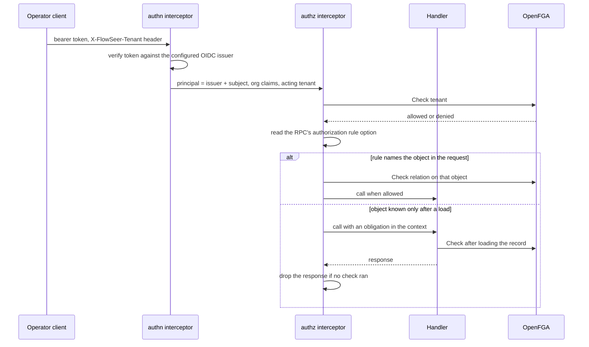

# Operator Authorization - Direction

`DeviceService`, `EdgeAdminService`, and `CaptureService` accept any caller
that reaches the API port. Nothing authenticates the caller, and a capture's
`requested_by` is whatever the caller writes about itself
(`src/services/device/README.md`, "What a deployment has to put in front of
it"). `GOALS.md` names OpenFGA for these surfaces and says no record decides
its shape. The [capture record's 2026-09-28
amendment](2026-09-09-remote-packet-capture-direction.md#2026-09-28--operator-identity-and-the-relations-capture-needs)
lists the relations capture needs and defers the model to this record.

This record decides the engine, where it runs, how a caller becomes a
principal and a tenant, how every RPC is authorized, and who owns the
relationships. The measurements it rests on are in
[`docs/research/2026-09-30-openfga-authorization-spike.md`](../research/2026-09-30-openfga-authorization-spike.md).

This proposal was written without
[`2026-09-28-operator-authorization-direction.md`](2026-09-28-operator-authorization-direction.md),
accepted two days earlier, whose first two phases have landed. The two
disagree on the engine and on how a request's tenant is chosen, and are
reconciled before either is extended.

## A request, end to end



## Decisions

### OpenFGA, in one shared store

OpenFGA is the engine. It is Apache-2.0, self-hostable, and a CNCF
incubating project, which satisfies the rule that infrastructure must be
open and run in the EU under our control. SpiceDB, also Apache-2.0, was the
serious alternative. It lost because its advantages matter only under load
FlowSeer does not have: ZedTokens pay off when checks must be cached and
still see revocations at once, and cursored `LookupResources` pays off when
filtered listings run far past a page. Audit logging and Materialize sit in
its commercial builds. Revisit SpiceDB when any of these holds:

- authorization moves onto a hot path (per event, per assistant fan-out)
  where uncached checks cost too much,
- reads go to Postgres replicas or several regions while caching is on,
- a filtered listing must return far more than 1000 objects and cannot be
  paged against our own records,
- another system needs a push stream of access changes.

All tenants share one store. A store is OpenFGA's isolation boundary for
models and relationships, and a relationship cannot cross stores. Connected
tenants (a service provider's admins operating in a customer tenant) are a
relationship between two tenant objects, so they need one store.

### A separate deployment next to its own Postgres

OpenFGA runs as its own service, never embedded in a FlowSeer host, backed
by a Postgres that is external from the first deployment. Either can then
move or scale without redeploying the other. Place OpenFGA close to its
Postgres: one check makes several datastore round trips and only one client
round trip, and the spike measured the standalone container faster than an
embedded server that crossed a port forward to its database.

OpenFGA starts with `Authn.Method: none` and plaintext gRPC by default. A
deployment turns on preshared-key or OIDC authentication and TLS before it
serves FlowSeer, and runs `openfga migrate` as its own job.

### No check cache

Check caching stays off, so every read is strongly consistent. With several
OpenFGA replicas each holds its own cache, and the spike measured a revoked
grant still allowed for 1.5 s to 9.0 s on the other replica, bounded by
`cacheController.ttl` (10 s by default). If caching is turned on later,
calls that hand out full payload, device credentials, or admin grants pass
`HIGHER_CONSISTENCY`. That preference skips the cache and reads the primary
even when a secondary datastore is configured
(`pkg/storage/postgres/postgres.go`, `getPgxPool`, OpenFGA v1.21.0).

### Any OIDC provider, and a tenant the request names

Authentication accepts tokens from a configured OIDC issuer: discovery,
JWKS, and the `iss`, `aud`, and `exp` checks. Nothing depends on one
provider. The principal is the issuer and the subject together, because
OIDC makes `sub` unique only within one issuer.

OIDC has no standard tenant claim. A request names the tenant it acts in in
a header, and the authorization interceptor admits it only when the
principal is a `member` of that tenant. Selecting the tenant through a
provider's organization scope was rejected: each provider spells it
differently, and Zitadel's `urn:zitadel:iam:org:id` scope rejects users
whose access comes from a grant ([zitadel#11869](https://github.com/zitadel/zitadel/issues/11869)).
Tenancy stays ambient inside FlowSeer: the admitted tenant rides the
request context, never a payload field.

### Membership: owned by FlowSeer, confirmed by the token

```
type tenant
  relations
    define platform: [platform]
    define partner: [tenant]
    define claimed: [user]
    define enrolled: [user]
    define admin: [user, role#assignee] or admin from platform
    define active_admin: admin and member
    define member: (claimed and enrolled) or active_admin from partner or admin from platform
```

- `enrolled` is written and removed by FlowSeer's own membership API
  (invite, remove). Removing a member also removes that member's grants in
  the tenant, so an access review reads exact state.
- `claimed` is never stored. The interceptor sends one contextual tuple per
  organization the verified token lists. When a provider removes someone
  from an organization, their access ends at the next token refresh, the
  access-token lifetime the provider configures. Calls that must not wait
  for that introspect the token. An issuer configured as carrying no
  organization claims gets a `claimed` tuple for the tenant the request
  names, so its gate rests on `enrolled` alone.
- `platform#admin` is a global admin. It inherits `tenant#admin` everywhere.
  It does not inherit `tenant#full_payload`, the grant to read captured
  payload, which is the most restricted data FlowSeer holds. Full payload
  stays an explicit, time-bounded grant that is written to the operator
  action trail.
- `partner` connects a service-provider tenant. A customer grants a role to
  `tenant:<provider>#active_admin`, and removes it with one delete.

The membership check runs once per request, on the tenant object. Resource
permissions (`edge#capture`, `capture_session#download`) are plain unions
over stored relationships, with no intersection. The spike measured why: an
`and member from tenant` inside every resource permission kept checks
correct but made `ListObjects` return 11 of 1104 edges after 60 s for a
Tag-derived grant, and 0 for a platform admin. The same query on the union
model took 9 ms and 148 ms. OpenFGA's ListUsers documentation names `and`
and `but not` as particularly expensive.

Because resource permissions carry no membership term, every object check
also asks whether the object's `tenant` relation names the admitted tenant,
and FlowSeer's grant API writes grants only to members of the granting
tenant. A capture session's permissions derive from the edge stored with
it, never from the edge a request names: the capture store reads a session
by its id alone (`Store.Session` in
`src/services/device/internal/captureapi/store.go`).

### Every RPC declares its rule

Each operator RPC carries an authorization rule as a protobuf method
option. One Connect interceptor enforces it:

| Rule mode | The interceptor |
| --- | --- |
| The object is named in a request field | checks the relation on that object before the handler runs |
| The object is the admitted tenant (creating an edge) | checks the relation on the tenant before the handler runs |
| The object is known only after a load | runs the handler with an obligation in the context, and returns `Internal` and drops the response when the handler returned without a check |
| The handler filters a list | same obligation as a load |
| No rule | refuses the call |

A conformance gate fails any operator RPC without a rule, so a forgotten
check is a denied call and a failed build, never an open door. Streaming
RPCs are refused until their rules are designed.

### Lists check per parent, never through ListObjects

A list reads a page from FlowSeer's own records and checks each distinct
parent once with `BatchCheck`: a page of capture sessions shares a few
edges. `ListObjects` is not used on a request path. It caps results at
`listObjectsMaxResults` (1000 by default) and returns what it has at its
deadline with no sign that the list is partial
([openfga/openfga#2828](https://github.com/openfga/openfga/issues/2828)).

### FlowSeer's records own every relationship

OpenFGA holds a projection. Each relationship derives from a FlowSeer
record: an edge's tenant, a session's edge and requester, a member's
enrollment, a role, a grant. A projector writes relationships as records
change and repairs drift. A removal that revokes access (a member, a grant,
a role assignment) also deletes its relationships before the RPC returns,
so revocation never waits on the projector. Keeping the source in
FlowSeer's records means any tenant's relationships can be rebuilt from
them, which the loss preview below needs, since OpenFGA's `Read` cannot
select one tenant's relationships from a shared store.

### Previews of an access change

Adding or removing a Tag that changes access previews who gains or loses
what before an admin signs it off (`GOALS.md`). Sites and Tags have schemas
but no inventory service stores them yet, so the preview lands with that
service. Its shape is decided here:

- **Gains**: the candidate relationships go in as contextual tuples, and a
  per-edge `ListUsers` before and after gives who gains.
- **Losses**: the tenant's relationships are rebuilt into a throwaway store,
  the change is applied there, and the same per-edge diff runs against the
  live store. The spike rebuilt a 14,629-relationship tenant in 0.55 s and
  diffed 406 edges in 2.54 s, matching a real delete exactly.

An exclusion (`but not blocked`) on the recursive Tag relation was rejected.
It previewed losses exactly, but `ListObjects` returned no results after
60 s for any grant that reaches an edge through a Tag, with both of
OpenFGA's ListObjects algorithms.

### The operator action trail ships with authorization

Nothing records today who created an edge or minted a setup key
(`src/services/device/README.md`). Authorization adds global admins and
cross-tenant grants, so each admin-surface change and each full-payload
grant is recorded with its principal in the same change that turns
authorization on.

## Consequences

- Every operator request makes two checks. The spike measured the tenant
  gate at 0.63 ms to 0.96 ms p50 and a resource check at 0.55 ms to 1.6 ms
  p50 against a standalone OpenFGA.
- The operator API is unusable without an OIDC issuer and an OpenFGA
  deployment. The lab deployment gains both.
- `OperatorRef` names an issuer and a subject, and handlers stamp it from
  the authenticated principal instead of trusting the payload.
- Site and Tag grants and the preview wait for the inventory service. The
  `.fga` model reserves their types.
