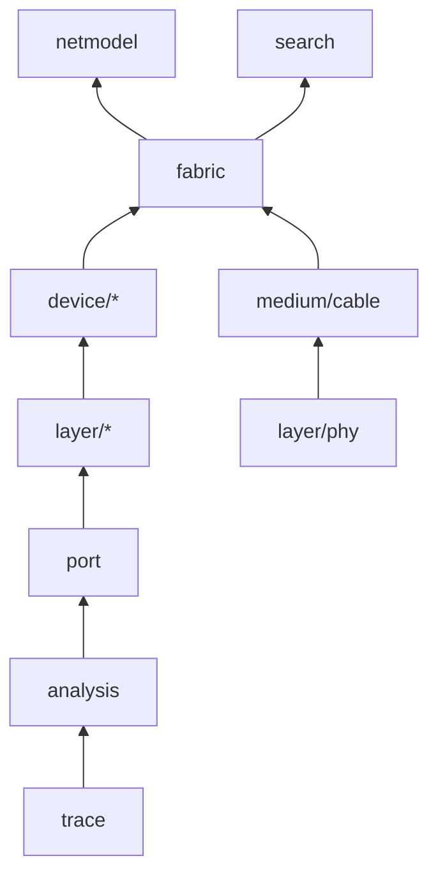

# Simulation Package Shape - Direction

## Context

The simulator under `src/common/netsim` grew around one device kind. Every
capability package sits under `vswitch`, so the tree says a relay or an IP
stack belongs to a switch. Three places already disagree with that:

- `fabric` builds each host's IP stack as a bare `routing.Layer`
  (`src/common/netsim/fabric/fabric.go`, `hostStacks`). A host is a second
  device kind with no package of its own.
- The cable model lives inside `fabric` (`medium.go`, `link.go`), and
  `fabric` calls `phy.Negotiate` per cable. A second medium has nowhere to go.
- `vswitch/netmodel` imports `fabric` (`netmodel/counters.go`), so the
  package under the switch depends on the package above it.

The switch composes its layers by hand. A capability appears in `Config`,
`Validate`, `Normalize`, `Clone`, `Diff`, `newSwitch`, `Fork`, `Derive`,
`Retention`, `Wake`, `NextWake`, `LinkChange`, `Start`, `Age`, and the
intercept chain in `forward`. One of those sites is already missed:
`Switch.Fork` in `src/common/netsim/vswitch/switch.go` never copies the
`filter` layer, so a forked switch forwards what its source drops, and
`fabric.Compare` forks both sides.

The capability packages agree on `Config.Clone` and `Diff` and on little
else. Constructors take five different argument lists, `RetentionKey` has
five signatures, four packages advance time with `Wake` and three with `Age`,
and `FlushTarget` is declared three times with the same fields.

The simulator is meant to grow past wired switching: clients that behave
(DHCP, roaming, supplicants), wireless access points, and a radio medium
where delivery depends on distance and channel. The tree has to take those
without another restructure.

## Decision

The simulator's root is `src/common/sim`. The `net` prefix goes because a
radio medium and client behaviour are in scope, and neither is a network
device.

```
src/common/sim/
  trace/  analysis/  stream/     unchanged leaves
  port/                          the port table every device is built on
  layer/                         the capability contract's shared types
    phy/ bridge/ lag/ stp/ loopprotect/ mcast/ routing/ filter/ traffic/
  device/                        the seam a fabric drives
    vswitch/                     a switch: layers composed over a port table
    host/                        an endpoint: an IP stack and its acceptance rules
  medium/
    cable/                       length, propagation, speed bound, faults
  fabric/                        topology, the event queue, journeys, comparison
  netmodel/                      the protobuf boundary
  search/
  internal/simtest/              the conformance corpus
```



An arrow points from the imported package to its importer. The rules the
diagram cannot show:

- A capability package imports `port`, `layer`, `trace`, `analysis`, and
  `src/common/net`. It imports no sibling capability and no device.
- A device imports capability packages and never `fabric`.
- `fabric` imports `device` and `medium/cable`, and no capability package
  directly. What it needs from a device (forwarding, emissions, state for a
  snapshot) crosses the device seam.
- A medium imports the physical-layer package of the ports it joins. The
  cable imports `layer/phy` for Ethernet settings and negotiation, so
  `fabric` depends on `layer/phy` through the cable and on no other layer.
- `netmodel` sits beside `fabric` because it builds fabric inputs as well as
  switch specs.

**The device seam.** `device` declares the interface `fabric` drives: receive
a frame on a port at a time, advance to a time, report the next wake, take a
link change, fork, and expose state. The switch and the host both implement
it, which is what `docs/code-style.md` asks of an interface. An access point
or a client with behaviour is a third package under `device/`, built from the
same layers plus its own.

**The medium seam.** The cable model moves to `medium/cable` and `fabric`
calls it as a concrete type. No `Medium` interface is written while the cable
is the only implementation. A radio medium is the second one, and the
interface is extracted from the two when it arrives. The package boundary is
drawn now so that extraction touches `fabric` and nothing else.

**One capability contract.** Every package under `layer/` has the same shape:

- `const LayerName trace.Layer`, with `Rule*` and `Reason*` constants
  declared by the package that produces them. The runtime type keeps the
  name `Layer`, so the constant cannot take it.
- `Config` with `Normalize` and `Validate`, each taking the same
  `layer.Env` (node identity, port table, device address, resolved speeds),
  and `Clone`, which takes nothing.
- `Diff(a, b Config) []trace.Change`. A change's subject key of several
  parts comes from `trace.CompositeKey`, which quotes each part with
  `strconv.Quote` and joins them with `/`, since port names hold `/`.
- `New(cfg, env)` returning the runtime layer, `Clone` on it, and for a layer
  with timers `Advance(now)` returning `layer.Effects` and `NextWake`.
- `RetentionKey(cfg, env)` on every layer that holds runtime state.
- Fact types unexported. A test asserts on `TypeID` and `Canonical`.

`layer` holds the types the contract shares: `Env`, `Effects`, `Emission`,
and `FlushTarget`. The switch drives timed layers through one interface it
declares, so `Fork`, `Advance`, and `NextWake` are loops over the layers a
device holds. Adding a capability then costs a package, a `Config` field,
and its place in the receive pipeline.

**Protocols follow their standards.** A protocol a layer runs conforms to its
standard in every mode the layer's README claims. The README names the
standard, the edition, and the clauses each state machine implements. A wire
format has a known-bytes fixture from a second source. Where the simulator
stops short, the README states the limit and why. This replaces the
virtual-device record's statement that LACP runs "as Open vSwitch runs it":
`lag` follows IEEE 802.1AX.

**Wire codecs live under `src/common/net`.** The BPDU and SSTP codecs move
out of `stp` to sit beside `net/lacp`, `net/igmp`, and `net/mld`.

## Alternatives

**Keep `netsim/vswitch/<capability>`.** No import churn. It loses because a
host or an access point would import its relay and IP stack through the
switch's directory, and the next device kind would repeat the argument.

**Hide the layer engines under `internal/`.** The public surface would shrink
to configuration types. It loses for now: it adds a package per capability,
and the host needs the routing engine from outside the switch. The question
reopens once `device/host` exists and the set of packages that reach an
engine is known.

**Write a `Medium` interface now.** It would show where radio goes. It loses
to the rule against an interface with one implementation, and a cable has
two ends where a radio medium has many, so an interface drawn from the cable
alone would be the wrong one.

**Keep the name `netsim`.** It loses to scope: the tree is planned to hold
radio propagation and client behaviour.

## Consequences

- Every import path under the tree changes once, in a move with no behaviour
  change. `src/edge/netsimload` becomes `src/edge/simload` to match.
- The three simulation records, the solutions under `docs/solutions/`,
  `CONCEPTS.md`, and `GOALS.md` name the new paths in that same change.
- The virtual-device record's Decision lists eight capability packages and
  places `netmodel` under `vswitch`. It is amended when the move lands.
- The model registry's calibration tasks name `src/common/netsim/fabric` at
  fixed base commits, so they keep working unchanged.
- A wireless access point, a client, and a radio medium each arrive as a
  package under `device/` or `medium/`, with radio layers under `layer/`.
  None of them is planned here.

## Amendments

### 2026-10-03: the contract as it landed

Landed 2026-10-03: the capability contract across `src/common/sim/layer`,
with `layer.Env`, `layer.Effects`, and one `Advance` verb in place of `Age`
and `Wake`, the BPDU and SSTP codecs in `src/common/net/bpdu`, and the gate
in `test/conformance/sim`. Two lines of the contract above changed to match
it. `Config.Clone` takes no `layer.Env`, since a copy needs no device
context. A subject key of several parts has one form, built by
`trace.CompositeKey`.
