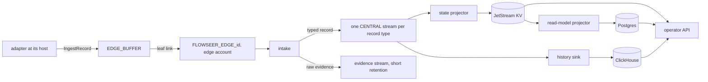

# Central Ingestion Pipeline - Direction

How observation data (syslog, traps, webhooks, poller results) travels from
the adapter that received it to the stores an operator queries, and which
store holds what.

## Context

The [device service record](2026-08-20-device-service-and-inventory-direction.md)
makes ingestion a plane of its own and NATS JetStream its carrier. It leaves
three things open that the first ingestion source needs:

- No event envelope exists. [`protobuf.md`](../conventions/protobuf.md) says
  `Provenance` rides one, and the `integration/` schema root holds only a
  README (`spec/proto/flowseer/integration/README.md`).
- Nothing central reads the `ingest` branch an edge buffer reserves. The OTLP
  forwarder is the only consumer of the per-edge hub streams
  (`src/modules/edgebus/forwarder.go`).
- No record names a store for history or for queryable state. All central
  state sits in four JetStream key-value buckets
  (`src/modules/edgebus/subjects.go`), and the
  [production monitoring baseline](../research/2026-10-01-production-monitoring-baseline.md)
  lists metric and event storage as an open risk.

## Decision

### Integrations conform to a schema, and central never reads the kind

An adapter maps what it received into FlowSeer-owned protobuf at its host, on
an edge or in central, before it publishes. The bus carries typed records
only. Central registers one consumer per record type and none per integration
kind, which is rule 10 of the device service record applied to ingestion.

A new kind therefore adds an adapter and, where it reports something new, a
record type. It adds no central code path of its own.

### One envelope carries every ingested record

`flowseer.integration.ingest.v1.IngestRecord` holds a record id, the
`Provenance` of the observation, a typed payload as a `oneof` with one arm
per record type, and optional raw evidence. The record id is also the NATS
message id, so a republish inside the stream's duplicate window is dropped.

Tenancy stays ambient. The envelope names no tenant, and intake takes the
tenant and the edge from the stream a record arrived in, never from its
subject or payload.

### Raw bytes stay at the edge unless asked for or unparsed

An adapter drops the original bytes once it has mapped them. Two cases attach
them to the envelope:

- **Parse failure.** A record the adapter could not parse completely carries
  its raw bytes, up to a bound per source. Past the bound the adapter samples:
  it keeps the raw bytes of one failure in a fixed number and reports how
  many it suppressed since the last one kept.
- **Raw window.** An operator opens a window for one integration, source, or
  device, with an expiry. While it is open the adapter attaches raw bytes to
  every record in scope.

The window is a Connect call to the edge, because the bus carries nothing an
edge must act on (device service record, 2026-09-06 amendment). The edge
enforces the expiry from its own clock, so a lost close cannot leave raw
bytes flowing.

Intake strips raw evidence from the typed streams and writes it to a
short-retention evidence stream, so no long-lived store holds device payload
it was never meant to keep.

### Stages

Intake follows each edge's hub stream with a durable consumer filtered to the
`ingest` branch, as the OTLP forwarder does for `otel`. Edge accounts import
and export nothing (`src/modules/edgebus/README.md`), so a consumer per edge
stream is the only way across, and intake is the one place that turns "this
edge said so" into a tenant-scoped central record. It validates the envelope,
refuses a record whose subject lies outside the edge's subtree, and
republishes into the CENTRAL account.

A centrally hosted adapter publishes its envelopes to intake's input in the
CENTRAL account and passes the same validation.

### Stores

| Data | Store | Reason |
| --- | --- | --- |
| Append-only records and numeric time-series | ClickHouse | One Apache-2.0 store for both. It acknowledges an asynchronous insert only after the flush when `wait_for_async_insert=1`, so the sink acknowledges the stream after the store holds the row. |
| Current state that gates a decision or that a stream processor reads | JetStream KV | Compare-and-set writes, a watch for live copies, and no second connection for a consumer already on the bus. |
| Lists, filters, sorts, and joins for the API | Postgres | A read model a projector derives from the KV buckets. |

The Postgres read model is disposable. A KV bucket is a stream, so the
projector follows it with a durable consumer and a dropped table is rebuilt
by replay. Two rules follow from that. A mutation response returns the record
read from KV, never from Postgres. And nothing reads Postgres to decide
whether a write may proceed.

### One central host, one module per stage

Intake, each sink, and each projector are Service Modules
(`src/common/service`) assembled into the process that runs the hub. Each
takes a JetStream handle and a store client from its host, so moving one into
its own service later changes the host and not the module.

## Alternatives

- **A registry of per-integration processors in central.** Rejected. Central
  would need code for every kind, which breaks rule 10, and a third-party
  kind would need an in-process plugin, which the device service record
  rejects.
- **Raw payloads on the bus with central mappers.** Rejected for the same
  reason, and because every record would cross the WAN link twice its size.
- **Raw bytes carried on every record until intake.** Rejected: the edge
  buffer and the link would carry about double the bytes for a replay window
  that is rarely used.
- **ClickHouse materialized views for latest state.** Rejected. Earlier
  operation of that pattern outside this repository had problems the tree
  does not document, so this record states it as a constraint and not as a
  measured finding.
- **TimescaleDB for history.** Rejected: columnstore, continuous aggregates,
  and retention policies are in the Community Edition under its own licence
  (TSL) and absent from the Apache 2 edition, which fails the open-source
  rule the device service record applied to NATS.
- **VictoriaLogs with VictoriaMetrics.** Rejected: two stores to run, and
  schema-free fields where the records are typed. VictoriaLogs itself
  handles high-cardinality fields. The metric side is the concern: series
  churn from volatile label values is the failure the baseline measured on
  LLDP data in a time-series store.
- **A streaming database for projections.** RisingWave is Apache-2.0 and
  reads JetStream with protobuf encoding. Rejected for now: its documented
  minimum is 2 cores and 8 GiB for a compute node, it would be a third system
  to run, and state that gates a decision needs compare-and-set and not a
  view. Materialize is under a Business Source License and needs a licence
  key.
- **Postgres as the source of truth for state.** Rejected: stream processors
  need latest state on the bus they already hold, and the lane journal's
  one-writer-per-device rule rests on KV compare-and-set.
- **Separate services per plane from the start.** Deferred. It needs a client
  listener on the hub, credentials for each service, and deployment decisions
  [`GOALS.md`](../../GOALS.md) lists as not decided.

## Consequences

- The device service record's Events bullet names
  `events.<tenant>.<integration>.>`. The subjects this record uses are the
  edge subtree's `ingest.<source>` branch and per-record-type subjects in the
  CENTRAL account. The change that lands intake amends that bullet.
- `integration/` gains its first package and starts importing `model/` and
  `event/`, which `test/conformance/proto/layering_test.go` must admit.
- ClickHouse and Postgres clients are new Go modules and enter under the
  [dependency admission record](2026-10-01-dependency-admission-direction.md).
- Postgres becomes a FlowSeer store, where until now it served only the
  authorization engine. It needs table migrations and a tenant column on
  every table.
- A list served from Postgres can lag a write. API responses that follow a
  mutation read KV.
- ClickHouse needs query limits from its first deployment. One wide analytic
  query stalled ingest on the legacy store for about two minutes
  (`docs/runbooks/production-clickhouse-queries.md`).

## Open questions

- Tenant isolation inside ClickHouse and Postgres: a tenant column with row
  policies, or a database per tenant. Unverified which ClickHouse mechanism
  holds against a query the API builds.
- Which ClickHouse settings bound an API query so it cannot stall inserts.
  Unverified.
- Retention per record type.
- Whether the device service record's per-tenant NATS account is still the
  target. The code isolates per edge account and names the tenant account as
  absent (`src/modules/edgebus/README.md`).

## Sources

- Repository: `src/modules/edgebus/README.md`, `src/modules/edgebus/forwarder.go`,
  `src/modules/edgebus/subjects.go`, `spec/proto/flowseer/integration/README.md`,
  `spec/proto/flowseer/event/README.md`,
  `spec/proto/flowseer/model/inventory/v1/provenance.proto`,
  `docs/runbooks/production-clickhouse-queries.md`.
- ClickHouse licence: <https://raw.githubusercontent.com/ClickHouse/ClickHouse/master/LICENSE>.
  Asynchronous inserts: <https://clickhouse.com/docs/optimize/asynchronous-inserts>.
- TimescaleDB editions: <https://www.tigerdata.com/docs/about/latest/timescaledb-editions>.
- VictoriaLogs: <https://docs.victoriametrics.com/victorialogs/>.
- RisingWave licence: <https://raw.githubusercontent.com/risingwavelabs/risingwave/main/LICENSE>.
  JetStream source: <https://docs.risingwave.com/integrations/sources/nats-jetstream>.
  Hardware: <https://docs.risingwave.com/deploy/hardware-requirements>.
- Materialize licence: <https://materialize.com/docs/license/>.
- JetStream key-value store: <https://docs.nats.io/nats-concepts/jetstream/key-value-store>.

## Amendments

### 2026-10-03 — payload messages drop their ids, and provenance widens its protocol

A payload message carried inside an `IngestRecord` (beginning with
`SyslogRecord`) holds no id of its own; deduplication and record identity
belong to `IngestRecord.record_id`. `flowseer.model.inventory.v1.Provenance`
widens its protocol field to a required `oneof protocol` with
`ManagementProtocol management = 10` and `LogProtocol log = 11`, so that
observation sources beyond management protocols (such as syslog) can name
their protocol without fabricating a management protocol value.

### 2026-10-03: the edge resolves a syslog sender from its device listing alone

Landed 2026-10-03: `lanehost.DeviceIndex` in `src/edge/agent/internal/lanehost`,
read by `src/edge/agent/internal/syslogsource`.

The edge publishes a datagram as the record of a device when exactly one
device in the listing central sends this edge claims the datagram's source
address. Whether the lane onboarded the device does not matter, since a UDP
source address is spoofable whether or not the lane logged in to the device,
and a gate on onboarding would drop syslog from a listed device whose
management session is down. An address two listed devices claim resolves to
neither and is counted under `ambiguous_source`. A device id listed at two
addresses resolves from both, each with its own row's binding. A device the
next listing omits or moves stops resolving at the old address, and a failed
listing leaves the index as it was.

A consumer of `IngestRecord` may therefore not assume the lane serves the
device a record names. A rule that needs a served device checks it against
the lane, not against the record.

### 2026-10-04: edge records enter central ingestion streams

Landed 2026-10-04: `src/services/device/internal/host/host.go` wires the
intake module, and `src/services/device/internal/intake/intake.go` follows each
attached edge stream.

An edge publishes on `flowseer.<tenant>.edge.<edge-id>.ingest.<source>`.
Intake republishes a typed record to
`flowseer.<tenant>.ingest.<record-type>.<device-id>` in
`FLOWSEER_INGEST_<RECORD_TYPE>`. Raw evidence goes to
`flowseer.<tenant>.evidence.<record-type>.<device-id>` in
`FLOWSEER_INGEST_EVIDENCE`. These shapes are defined in
`src/modules/edgebus/subjects.go`. Delivery is at least once. Each publication
uses `<tenant>.<record_id>` as its message id, so every JetStream sink
deduplicates that identity within its duplicate window.

The evidence stream keeps messages for 24 hours and discards its oldest
messages at its byte bound, as configured in `src/modules/edgebus/hub.go`. A
centrally hosted adapter input is not built. The current intake path accepts
records from edge streams only.
