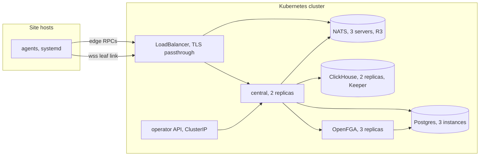

# Deployment - Direction

Where each FlowSeer process runs, which tool renders its manifests, and what
a cluster exposes to the network.

## Context

[`GOALS.md`](../../GOALS.md) lists packaging and deployment as not decided.
The only way to run FlowSeer today is the lab run in
[`deploy/lab/`](../../deploy/lab/README.md), which puts central and one agent
on a single host with every listener on loopback.

This record assumes the process shapes two others propose: the
[central high availability record](2026-10-03-central-high-availability-direction.md)
(an upstream NATS cluster, central as several replicas, a separate edge
listener) and the
[edge high availability record](2026-10-03-edge-high-availability-direction.md)
(two agents per site).

Two more facts constrain it. Edges pin a public key on central's TLS chain
(`spec/proto/flowseer/model/edge/v1/provisioning.proto`), so a proxy that
terminates TLS breaks them. And both binaries link statically:
`CGO_ENABLED=0 GOOS=linux go build` succeeds for
`src/services/device/cmd/device` and `src/edge/agent/cmd/agent`.

The stores the accepted records name are ClickHouse and Postgres
([ingestion record](2026-10-02-central-ingestion-pipeline-direction.md)) and
OpenFGA on Postgres
([operator authorization record](2026-09-30-operator-authorization-direction.md)).

## Decision

### Central and its stores run on Kubernetes

Central is a Deployment with no volume of its own. Its TLS pair, its NATS
keys, and the device credential files mount from Secrets. The base spreads
its replicas across nodes and keeps one available through a disruption.

### Kustomize renders FlowSeer's manifests, Helm installs third-party software

Everything FlowSeer authors is plain YAML under `deploy/k8s/`, rendered with
Kustomize: central's workload, its Services, and the custom resources that
declare the store clusters. Helm installs what other projects publish as
charts: NATS, the CloudNativePG operator, the ClickHouse operator, and
OpenFGA. Each chart is pinned to a version and gets a values file in the
repository.

FlowSeer writes no Helm chart. A chart is for an installer who needs a values
interface, and nothing external consumes FlowSeer. Kustomize's own chart
inflation (`helmCharts`) is not used: its documentation says to avoid it in
production because the build then depends on a remote chart.

Prototext configuration stays as real files. `configMapGenerator` turns each
into a ConfigMap whose name carries a content hash, so a changed file creates
a new ConfigMap and rolls the workload that mounts it. Central has no reload
path, so a restart is the only way a new file takes effect.

### The base is highly available, and a dev overlay is single-node

The base declares the production shape. A `dev` overlay patches it down for
one node.

| Component | Rendered by | Base | `dev` |
| --- | --- | --- | --- |
| Central | Kustomize | 2 replicas | 1 replica |
| NATS | Helm values | 3 servers, R3 streams | 1 server, R1 streams |
| Postgres (CloudNativePG `Cluster`) | Kustomize | 3 instances on separate nodes | 1 instance |
| ClickHouse (`ClickHouseCluster`) | Kustomize | 1 shard, 2 replicas | 1 replica |
| ClickHouse Keeper (`KeeperCluster`) | Kustomize | 3 replicas | 1 replica |
| OpenFGA | Helm values | 3 replicas | 1 replica |
| Edge agent | systemd, per site | 2 hosts where the site needs it | 1 host |

A component that Helm renders gets a second values file for `dev` and not a
Kustomize patch. The stream replica count is a field of central's own
configuration, because central creates the streams. The NATS chart passes
`sync_interval: always` through `config.merge`.

### A cluster exposes two listeners, with TLS passed through

Central's edge listener and the NATS WebSocket listener are exposed through
LoadBalancers that pass TLS through unchanged, so an edge keeps pinning the
key it was provisioned with. Both serve one certificate from one Secret. The
operator API is a ClusterIP Service and a NetworkPolicy restricts who reaches
it.

### The edge agent is a host binary under the host's service manager

The agent runs as a systemd unit on a Linux site host, or under an rc script
on FreeBSD, with its files under
`/etc/flowseer` and `/var/lib/flowseer/agent` as the lab run already lays them
out. It needs the site's own interfaces and raw sockets for capture
(`src/modules/capture/rawsocket`), which a cluster would have to hand back to
it through host networking.

### No secret lives in the repository

Device credential files, the TLS pair, the NATS signing keys, the telemetry
headers, and store passwords are Kubernetes Secrets created outside the
repository and referenced by name. A manifest that needs one fails to start
without it.

## Alternatives

- **systemd for central as well.** It matches the lab run and needs no
  cluster. Rejected because the stores the accepted records require each
  ship an operator or a chart for Kubernetes, and running them by hand on a
  host is the larger operational burden.
- **A Helm chart for FlowSeer.** Rejected for now: it templates the
  schema-checked prototext behind a values layer for an audience that does
  not exist. It becomes the right tool when someone outside m3connect installs
  FlowSeer.
- **Kustomize `helmCharts` for the third-party charts.** Rejected on
  Kustomize's own advice, quoted above.
- **Single-node stores as the default.** Rejected: a deployment that forgets
  an overlay should get the durable shape, not the cheap one.

## Consequences

- Two tools are in the deployment path. A reader has to know which one
  renders a given replica count.
- Helm tracks numbered revisions and can roll a release back. Kustomize keeps
  no release history, so git is the history of FlowSeer's own manifests.
- Chart versions and container images enter under the
  [dependency admission record](2026-10-01-dependency-admission-direction.md),
  which pins an image by digest.
- The ClickHouse operator needs cert-manager for its webhook certificates,
  which is a fifth third-party component.

## Open questions

- Whether each chart lets every image be pinned by digest. Unverified.
- Whether the operators and cert-manager themselves run replicated from
  their charts. Unverified.
- The ClickHouse operator's maturity. Its README states none. Unverified.
- Whether CloudNativePG replicates synchronously by default. The architecture
  page does not say. Unverified.
- Backups for NATS, Postgres, and ClickHouse.
- Ports and hostnames for the two passthrough listeners. The device service
  record wants 443 for firewall posture, and two listeners cannot share one
  address and port.

## Sources

- Repository: `spec/proto/flowseer/model/edge/v1/provisioning.proto`,
  `src/modules/capture/rawsocket/`, `deploy/lab/`.
- NATS Helm chart, repository `https://nats-io.github.io/k8s/helm/charts/`,
  clustering, JetStream volume, leaf node and WebSocket listeners, resolver,
  `config.merge`:
  <https://raw.githubusercontent.com/nats-io/k8s/main/helm/charts/nats/README.md>.
- Kustomize `configMapGenerator`, content-hash suffix and workload update:
  <https://kubectl.docs.kubernetes.io/references/kustomize/kustomization/configmapgenerator/>.
- Kustomize chart inflation, advice against production use:
  <https://raw.githubusercontent.com/kubernetes-sigs/kustomize/master/examples/chart.md>.
- `kubectl apply -k`, built in since Kubernetes 1.14:
  <https://kubernetes.io/docs/tasks/manage-kubernetes-objects/kustomization/>.
- Helm revisions, `helm history`, and `helm rollback`:
  <https://helm.sh/docs/intro/using_helm/>.
- CloudNativePG installation by manifest or Helm chart, release 1.30.1:
  <https://raw.githubusercontent.com/cloudnative-pg/cloudnative-pg/main/docs/src/installation_upgrade.md>.
- CloudNativePG primary with hot standby replicas, instances on separate
  nodes and zones:
  <https://raw.githubusercontent.com/cloudnative-pg/cloudnative-pg/main/docs/src/architecture.md>.
- ClickHouse operator, Apache-2.0, `ClickHouseCluster` and `KeeperCluster`,
  Helm chart at `oci://ghcr.io/clickhouse/clickhouse-operator-helm`,
  cert-manager prerequisite, Kubernetes 1.28 or later:
  <https://raw.githubusercontent.com/ClickHouse/clickhouse-operator/main/README.md>.
- OpenFGA Helm chart, repository `https://openfga.github.io/helm-charts`,
  Postgres datastore by URI or existing Secret:
  <https://raw.githubusercontent.com/openfga/helm-charts/main/charts/openfga/README.md>.
- OpenFGA chart defaults, `replicaCount: 3` and a migration job:
  <https://raw.githubusercontent.com/openfga/helm-charts/main/charts/openfga/values.yaml>.
