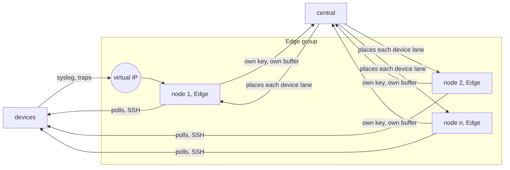

# Edge High Availability - Direction

How a site runs one to n edge nodes, keeps receiving what devices send to one
address, and keeps managing its devices when a node stops.

## Context

An Edge is one enrolled process at a site. `CONCEPTS.md` says it "is the
process", that it holds a self-generated key registered at enrollment, and
that contact (active, stale, dormant) is an axis central tracks apart from
lifecycle.

Three facts in the tree tie a site to one agent:

- The registry binds an Integration to one Edge
  (`spec/proto/flowseer/store/device/v1/registry.proto`).
- An edge that restarts loses its lanes and reports `Onboarded`, and central
  re-derives what it owes from the lane record
  (`src/services/device/README.md`).
- Each edge has its own NATS account and its own buffer stream
  (`src/modules/edgebus/README.md`).

The [verified device access record](2026-09-05-verified-device-access-direction.md)
already decides two things this record must keep:

- **Positive fencing before failover** (decision 8). A successor edge may
  write only after a device, network, session, or host fence proves the
  predecessor cannot. Lease expiry alone is not enough, because a paused
  process resumes after its time check. Until a fence exists, a deployment
  runs one edge per local-network integration.
- **Credentials per operation** (decision 9). A read credential comes from
  `AcquireReadCredential` with an `expires_at`, and a write uses a one-use
  submission grant bound to Edge, Integration, Device, and sequence. The
  agent keeps nothing standing: no cached session, no standing SNMP user, no
  lease (`src/edge/agent/README.md`, "Nothing standing").

Two kinds of traffic cross an edge, and they fail over differently.

| | Inbound: syslog, traps, informs | Outbound: polls, SSH, mutations |
| --- | --- | --- |
| Who picks the node | The device, by the one address it is configured with | Central, through the lane |
| State | None worth keeping | One order per device, which must not get two writers |
| Failover needs | The address to move | Central to fence the old node |

A device sends syslog and traps to a configured address, so the nodes of a
site need one address between them. The agent has no syslog or trap listener
yet. `src/protocol/snmp` already handles traps and informs
(`usm_trap.go`, `usm_inform.go`).

## Decision

### An edge group has one to n nodes, each its own Edge

Each node enrolls with its own key and is its own Edge, with its own NATS
account and buffer. Nothing private is shared between nodes. A group of one
is the ordinary case and needs nothing a single agent lacks.

An Integration is hosted by a group and not by one Edge. A group is in a
Site, and a Site may hold more than one.

### The group owns what devices see

The group has a virtual IP and the identity behind it: the server certificate
for syslog over TLS, and the SNMPv3 engine ID and users that receive informs.
Every node presents the same ones, so a device cannot tell which node
answered. Central delivers them to each member as it delivers device
credentials.

### The virtual IP is moved by something outside FlowSeer

The agent does not move the address. A site uses CARP or any other mechanism
that puts one address on one node at a time. Every node listens on every
address, so the node that holds the virtual IP receives. The agent reports
to central whether the group address is bound locally.

A group of one should still be given a virtual IP, so adding a node later
does not mean changing the syslog target on every device.

### Inbound follows the address, with no coordination

The node that receives a record stamps it with its own Edge as provenance
and publishes it to its own buffer. No node asks another or central first. A
failover loses the datagrams sent while the address moves, and records
buffered on a failed node arrive when it returns.

### Outbound is spread over all nodes, and only central places it

Central places each device lane on a healthy member and spreads lanes over
all of them, so n nodes add capacity as well as availability. When a member
goes stale, central moves its lanes to others. Which node holds the virtual
IP is a fact central may read and never the authority: a node central did
not place a lane on receives no dispatch for it, so a split in the address
mechanism cannot produce two writers.

Moving a lane is a restart of the lane. The new host is onboarded as a
restarted edge is today, and a late report from the old host is refused. A
returning node does not take its lanes back by itself.

### Reads move on staleness, writes move only behind a fence

A read has no effect on the device, so central moves read work to another
node as soon as the old one is stale. A write is different. Not dispatching
to the old node does not stop a command it already holds: a paused process
can resume and send it. Decision 8 of the verified device access record
therefore still binds. Central dispatches a mutation for a device to a
successor only after a fence proves the predecessor cannot write to that
device.

### The fence is the old node's own account on the device

Every node has its own account on every device its group manages: its own
SSH login and its own SNMPv3 user. To fence a stale node, central dispatches
a fence operation to the successor. The successor disables the old node's
account on the device, closes any session that account still holds, and
reads back that both took effect. Only then does central dispatch a mutation
for that device to the successor. Disabling the account alone is not a
fence, because a session opened before it can outlive it.

The successor fences with a credential of its own kind: a fence credential
central delivers for that one operation, as it delivers a submission grant.
A node's ordinary account cannot disable another node's.

A device that cannot disable an account and close its sessions has no fence.
Its writes do not move, and a lane with an open mutation stays blocked until
an operator resolves it, as today. Its reads still move.

A fenced node's account stays disabled when the node returns. Re-enabling it
is central's act, after the node reports `Onboarded`.

This is the fence decision 8 of the verified device access record waits
for, and it amends that record's sentence that a deployment runs one edge
per local-network integration.

### Device credentials are delivered per operation and never stored

Decision 9 already delivers a credential for one operation. A group keeps
that and narrows it: central answers `AcquireReadCredential` and opens a
submission only for the node it placed the lane on. A node holds a device
credential in memory for the operation that asked for it and drops it when
the operation ends or `expires_at` passes, whichever is first. It writes
none to disk and keeps none across operations.

A cache across operations is not adopted. It would save one call per read
and buy no availability, because a node that cannot reach central receives
no dispatch to use a credential for. If the call rate becomes a measured
problem, the remedy is reuse inside one dispatched batch, in memory, bounded
by `expires_at`, and dropped when the lane moves.

The group's receiver identity is the one exception to "nothing standing". A
syslog or trap arrives without a dispatch, so every node holds the TLS key
and the inform users in memory from start, fetched from central and never
written to disk.

Delivery on demand does not make a credential short-lived at the device. An
SNMPv3 user or an SSH password stays valid on the device until it is
rotated, and a node that held it once could replay it. Per-node accounts
limit that to one node's account, attribute every device session to a node,
and let central cut one node off.

### The agent runs on Linux and FreeBSD

FreeBSD is a deployment target, and CARP is the mechanism named for the
address there. The agent does not build for it today: `GOOS=freebsd go build ./src/edge/agent/cmd/agent`
fails in `src/common/service`, whose store lock is built for Linux, macOS,
and Windows only (`storelock_posix.go`, `storelock_windows.go`). Local
capture is Linux-only as well, because it uses `AF_PACKET`
(`src/modules/capture/rawsocket/local_other.go`).

## Alternatives

- **Two hosts sharing one Edge identity.** Central needs almost no change.
  Rejected because a shared key contradicts the Edge definition, and during
  a split both hosts could write one device.
- **Only the virtual IP holder does device access.** A device ACL then lists
  one source address. Rejected because n nodes would add no capacity and
  every failover would move every lane at once.
- **A host fence that powers the old node off.** The classic cluster answer.
  Rejected: it needs out-of-band access at every site, and it fences a whole
  node where one device lane is the unit that moves.
- **No automatic write failover.** Always safe and nothing to build. Kept as
  the fallback for a device with no fence, and rejected as the rule because
  an edge failure during a mutation would always need a person.
- **One device account per group.** One account to provision. Rejected: it
  gives no device fence and no attribution.
- **Agents that elect a host among themselves.** Rejected: central would
  learn the outcome late, and the lane's single order is central's to keep.
- **VRRP through keepalived as the shipped default.** It is maintained on
  Linux. Not chosen for now: the address is handled outside FlowSeer.
- **CARP built into the agent.** One binary, authenticated advertisements.
  Rejected: FlowSeer would own a protocol implementation.
- **UCarp on Linux.** Its repository was archived in April 2019 and its last
  release is from 2011, so a Linux site that wants CARP has no maintained
  daemon. This is a limit of the external choice and not a decision here.

## Consequences

- The registry and the Integration entity change shape to name a group.
- Central needs a placement rule and a rule for when to move lanes back.
- Every device carries n accounts for a group of n nodes, and adding a node
  means provisioning an account on every device. Devices with few local
  accounts or SNMPv3 users limit the group size.
- Each device family needs a fence procedure: disable an account, close its
  sessions, read both back. That is vendor-specific work per family.
- A fence credential is a new kind of credential with more privilege than a
  node's own account, so it needs the same per-operation delivery and audit
  as a submission grant.
- Device ACLs must allow every node's own address for outbound access, or a
  subnet that holds them.
- Failover of outbound access takes at least the stale threshold. A short
  partition either moves lanes or leaves devices unmanaged until it heals,
  and the threshold decides which.
- The virtual IP is active on one node at a time. More nodes add
  availability for inbound traffic and no capacity.
- A site whose nodes sit in different subnets cannot share an address this
  way and needs routing to do it.
- FlowSeer tests no address mechanism. A site's CARP configuration is its
  own.
- The agent's packaging needs an rc script for FreeBSD beside the systemd
  unit.

## Open questions

- How a device reacts when an inform receiver's engine boots and time change
  on failover while the engine ID stays the same. Unverified.
- Which device families can disable an account and close its sessions, and
  how. Unverified for every vendor, including the lab ICX7150.
- Whether an SNMPv3 user can be disabled over SNMP itself or needs the
  shell. Unverified.
- Who provisions the per-node accounts on a device: an operator, or FlowSeer
  as a typed mutation.
- Whether a node that starts while central is unreachable may receive syslog
  and traps. It has no receiver identity until it has fetched one.
- What the stale threshold is.
- How central refuses the old host's late report: by Edge, by a placement
  generation in the lane record, or both.
- What capture does on FreeBSD. `AF_PACKET` does not exist there, and BPF
  devices are the usual substitute. Unverified.
- Whether the embedded NATS leaf node and its file store behave on FreeBSD
  as on Linux. Unverified.

## Sources

- Repository: `CONCEPTS.md` (Edge, Integration), `GOALS.md` (Site),
  `spec/proto/flowseer/store/device/v1/registry.proto`,
  `src/services/device/README.md`, `src/modules/edgebus/README.md`,
  `src/edge/agent/README.md`,
  `spec/proto/flowseer/edge/attach/v1/credential.proto`,
  `src/protocol/snmp/usm_inform.go`, `src/protocol/snmp/usm_trap.go`,
  `src/common/service/storelock_posix.go`,
  `src/modules/capture/rawsocket/local_other.go`.
- CARP shares addresses between hosts on one local network and authenticates
  advertisements with a shared `pass`: <https://man.openbsd.org/carp.4>.
- UCarp, a userland CARP for Linux, archived 24 April 2019, version 1.5.2,
  needs scripts to add and remove the address:
  <https://github.com/jedisct1/UCarp>.
- Minimizing the time a secret is in memory and zeroing it after use, and
  auditing who requested a secret: OWASP Secrets Management Cheat Sheet,
  sections 2.5 and 2.6,
  <https://cheatsheetseries.owasp.org/cheatsheets/Secrets_Management_Cheat_Sheet.html>.
- A lease's expiry forces a consumer to check in, and revocation invalidates
  a secret at once:
  <https://developer.hashicorp.com/vault/docs/concepts/lease>.
- A client-side secret cache as a cost and latency measure that is "not
  security hardened" and has no invalidation:
  <https://docs.aws.amazon.com/secretsmanager/latest/userguide/retrieving-secrets_cache-go.html>.
- A worker that receives a credential at session time and authenticates on
  the user's behalf, so the user never sees it:
  <https://developer.hashicorp.com/boundary/docs/concepts/credential-management>.
- VRRP version 3 defines no authentication: RFC 9568,
  <https://www.rfc-editor.org/rfc/rfc9568.txt>.
