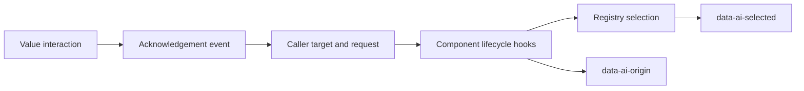

# Web AI Target Lifecycle - Direction

## Context

The accepted web component contract requires an `ai` prop, shared highlighting,
and an agent-origin marker. Its registration paragraph calls the prop the
`aiTarget()` input, while existing callers hold the resolved `AiTarget` from
`frontend/web/src/ai/target.ts`. The directive accepts that resolved object.
The registry stores selection, but the directive writes its DOM attribute.

Native sections, rows, and links remain target anchors in the views. A blanket
wrapper would change table structure or layout. TrafficSparkline renders an
SVG root, while the registry's types currently name only HTMLElement.
`UiAiLabel` already explains an originating request without its AbortSignal.
No service-backed source of value provenance exists in the web application.

## Decision

An addressable component takes `ai?: AiTarget`, with identity supplied by its
caller through `aiTarget()`. No component generates an identity from its label
or position. The existing slot and responsive-segment rules remain in
`frontend/web/src/ai/target.ts` and `registry.ts`.

Registration belongs to the component's meaningful rendered element. Plain
controls register their actual control. A select registers its trigger.
Popup wrappers register their content while it exists. Structural wrappers
and providers register nothing. A shared `useAiTarget` follows ref and prop
changes against the injected registry, with the document singleton as fallback.

Native anchors use `UiAiTarget` with the original native tag or `asChild`.
It forwards attributes, listeners, and the child element through the existing
Reka Primitive rather than adding a layout element. Reka UI 2.10.5's installed
`Primitive/Primitive.js`, `Primitive/Slot.js`, and `shared/useForwardExpose.js`
are the source for forwarding behavior. HTMLElement and SVGElement are both
valid anchors. A context event on an SVG child resolves its registered parent.

The registry owns `data-ai-selected` on the selected element and removes it
on clearing, replacement, unregistration, or visibility refresh. This covers
manual registrations as well as component registrations. One shared rule in
`frontend/web/src/theme/ai.css` uses `--ring` for both selection and origin.

An addressable component also takes `aiOrigin?: Omit<AiRequest, 'signal'>`.
This is supplied provenance, independent of whether the component has an `ai`
target. It makes no claim that a request executed a service mutation.
Its `requestId` identifies the current originating change. A new request ID
marks the value again. Re-rendering an acknowledged request does not.

A shared origin hook places `data-ai-origin="agent"` on the value's anchor.
Pointerdown, keydown, input, or change on that value acknowledges the origin.
Hover and programmatic focus do not acknowledge it. Neither do highlighting
or programmatic prop changes.
Compound controls pass DOM interactions in their portalled content to the
same acknowledgement handler. Interactions with another field acknowledge
only that field. This exposes no agent operation to set or activate a control.

Acknowledgement removes the marker and emits
`aiOriginAcknowledged(requestId)` once. The caller clears its provenance state
on that event, so acknowledgement survives remounting. Until the caller clears
it, the component remembers the acknowledged request for its mounted lifetime.
Selection remains independent and may still draw the outline.

The caller composes `UiAiLabel` beside a value and passes the same originating
request. The label's existing request display explains its targets and context.
The caller clears both the origin prop and the label on acknowledgement.
Primitives insert no label beside a void element, inside a native table row,
or into a caller's layout without an explicit composition site.

```vue
<UiField :label="t('view.devices.deviceName')">
  <UiInput
    v-model="name"
    :ai="nameTarget"
    :ai-origin="origin"
    @ai-origin-acknowledged="origin = undefined"
  />
  <UiAiLabel v-if="origin" :request="origin" />
</UiField>
```

The example's `origin` is a caller-owned originating request and `nameTarget`
is the result of `aiTarget()`. Service synchronization supplies them later.



## Alternatives

- Accept `AiTargetInput` and build an identity inside every component. This
  requires migrating the existing resolved target builders and makes the
  component responsible for pane identity it does not own.
- Keep the directive as a public adapter. No external consumer needs it, and
  the adapter retains a second registration surface after components migrate.
- Add an HTML wrapper around every target. This changes native table and SVG
  structure and can change the geometry an agent highlights.
- Use only an `agent` Boolean or string. A request identity distinguishes a
  new agent change from a re-render of an acknowledged one and already gives
  UiAiLabel the context it displays.

## Consequences

The web kit, existing view targets, Storybook registrations, and test mounts
move together. A component's public contract identifies the element it
registers, including mounted-only popup content. Injected registries remain
the test isolation boundary. Storybook retains its module-level document scope
and routes handlers by the canvas containing the registered element.

The directive is removed after callers migrate. The component contract gains
this refinement as an amendment with the code change. The generative catalog,
service integration, and mutation APIs keep their existing separate scope.
No dependency is added or upgraded.
