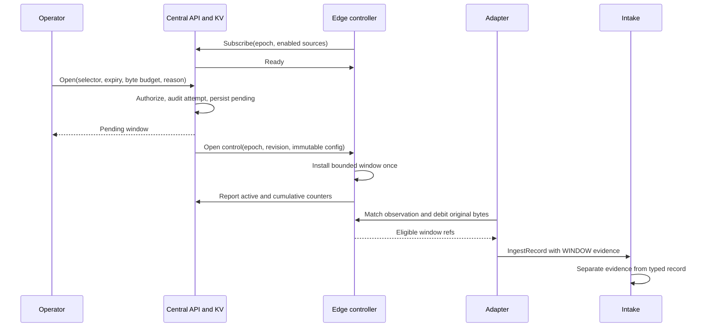

# Raw Window Control - Direction

## Context

The [ingestion direction](2026-10-02-central-ingestion-pipeline-direction.md)
allows an operator to retain original bytes for a device, integration, or
source. Its expiry is enforced at the edge. The envelope already defines
`RAW_REASON_WINDOW`, but the
[syslog source](../../src/edge/agent/internal/syslogsource/source.go) only
retains parse failures.

The device [dispatch contract](../../spec/proto/flowseer/edge/dispatch/v1/dispatch.proto)
requires a device id, while the
[index](../../src/edge/agent/internal/lanehost/index.go) resolves syslog even
when onboarding fails. The
[capture client](../../src/edge/agent/internal/capture/subscribe.go) provides
the existing example of a separate edge-opened assignment stream.

## Decision

A raw window belongs to one edge. Its typed selector chooses a device,
integration, or edge-local ingestion source key. The current source key
`syslog` names the adapter across all its listeners. Integration matching
uses the integration associated with the resolved binding. Central remains
blind to integration kinds.

The model package `model/rawwindow/v1` owns its UUID ref pair and
Config/State/Event family. An operator uses `api/ingest/v1.RawWindowService`
to open, get, and close. An edge opens
`edge/ingest/v1.RawWindowEdgeService.Subscribe` and reports state through
its unary `Report`, both authenticated by signed edge assertion. No
device lane is part of this control path.

Raw payload requires tenant membership, capture permission on the owning
edge, and an explicit active tenant full-payload grant at open time.
The [authorization direction](2026-09-30-operator-authorization-direction.md)
and [capture creation](../../src/services/device/internal/captureapi/operator_service.go)
already establish that combination. A close or get derives the edge from
stored ownership. Central stamps the admitted principal and audits open and
close through the existing operator action trail.

Each window names an explicit future expiry and positive original-byte
budget. Deployment configuration supplies a required aggregate allowance per
edge, with no implicit default or fixed product ceiling. Operators choose
budgets within that allowance. Central reserves full declared budgets until
terminal acknowledgement or expiry, including a close awaiting delivery.
Reported consumption does not replenish admission capacity. Opens fail if
configuration is absent or combined reservations would exceed the allowance.
Central admits expiry at most one hour after admission, with no implicit
duration default. The edge bounds its initial elapsed deadline to one hour.
Delivery delays and replay cannot extend the original expiry.
A whole payload that cannot fit ends that window. Parse-failure policy remains
available after the window ends, so a byte cap bounds operator-window evidence
rather than all raw evidence.

Budgets aggregate across every matching device. Every eligible matching
window pays for a record. One raw copy names the sorted window refs that
paid for it. An exhausted matching window cannot borrow another window's
budget. WINDOW takes precedence over parse-failure evidence.

One tenant/edge CAS record admits at most 16 unexpired windows, including
close tombstones, and stores desired
state and monotonic control revisions, and bounds terminal history to 24
hours and 64 rows. A 256 KiB serialized record bound evicts older expired
terminal rows first. The agent durably advances a boot generation before
connecting. Central fences older generations and a changed UUID at the
same generation, including on streams that are already open. Controls and reports carry that generation and a process
epoch. Reconnects
within that epoch preserve counters and deadlines. A duplicate start cannot
renew them, and a delayed start cannot undo a close tombstone. A new process
epoch cancels the previous epoch's windows. Collection resumes only through
a new authorized, audited open.

The edge checks wall expiry and an elapsed-time deadline fixed on first
admission. Expiry or a local byte stop acts without central connectivity.
Central distinguishes pending from edge-confirmed active. A durable close
remains owed across a lost delivery, and terminal reports dominate delayed
active reports.

## Alternatives

- Extending device dispatch would reuse its connection, but source-wide
  collection does not belong to a device lane.
- Calling an edge server would require an inbound listener that the current
  edge-opened transport does not need.
- Replaying windows into a restarted edge would recover collection, but
  would also replenish in-memory budgets. Automatic restart recovery needs
  durable budget accounting and is outside this decision.
- Copying evidence once per overlapping window would duplicate traffic and
  raw retention. Window references on one evidence record retain attribution.
- A fixed short default would simplify an API request but would not cover an
  intermittent failure an operator is waiting for.

## Consequences

The edge device listing gains an integration id. The index validates each
listing as a whole, so selector metadata and device/binding resolution change
together. The current registry can supply the id without interpreting kind
configuration.

The new packages need rows in the schema import-order table. The ingestion
envelope and operator audit event can import the model package, while the
service packages remain sinks. Generated bindings come only from buf.

Intake already removes raw evidence from typed publications and writes it to
the short-retention evidence stream
([intake README](../../src/services/device/internal/intake/README.md)).
This control adds no history store and no evidence retrieval API. Bytes
selected before expiry can still arrive after expiry through the edge buffer.

The implementation adds dated amendments to the ingestion, operator
authorization, and network model structure records with the code changes.
