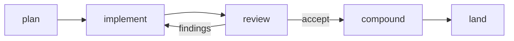

# FlowSeer Documentation and Prose Style

How to write prose that developers trust: README files, everything under
`docs/`, skills, schema comments, commit messages, PR descriptions, and the
reports agents write back. It binds human contributors and coding agents
equally, the same way [`code-style.md`](code-style.md) does for Go. That
document governs *when* a comment exists. This one governs how all our prose
reads.

The rules come from two research passes (listed under Sources): what
developers praise and abandon in real documentation, and how readers detect
machine-written text and what that detection costs.
[`check-prose.py`](../.agents/skills/prose/scripts/check-prose.py) checks the
mechanical ones, and the `prose` skill walks through the rest.

## What the evidence says

**Working examples are the currency of trust.** In "best docs ever" threads
the loudest praise goes to docs that show the thing working: Stripe's
copy-paste snippets with your own credentials inlined, Redis stating time
complexity and version on every command page. One stale example has the
opposite effect, and readers "start doubting everything else."

**Reference dumps are not documentation.** Steve Losh's line has held up for a
decade: an auto-generated API reference "lacks the coherent voice and structure
necessary for teaching." Diátaxis makes the structural version of the point.
Tutorials, how-tos, reference, and explanation serve different moments, and
mixing them weakens each.

**Honest, dense prose beats marketing tone.** PostgreSQL's docs get praised for
their "human feel", SQLite's for documenting the hard parts (locking,
multi-process access) most projects omit. Developers resent sales language in
docs. One HN commenter argues good docs should "turn away developers from your
framework as quickly as possible" when it's the wrong fit.

**A field comment earns its place by stating what the type cannot.** Google's
AIP-192 is the checklist: default when omitted, units, valid ranges with
inclusivity, what unset means, side effects, truncate-vs-error behavior.

**Machine-looking text carries a trust tax.** Maintainers describe AI-slop
contributions as "tantamount to a DDoS" (curl ended its bug bounty over it).
The NixOS ban discussion puts the reader's side plainly: generated PRs place
"the burden of understanding exclusively on the side of the reviewer."
Readers rate AI-attributed text as less trustworthy even at equal quality.
The failure underneath the tells is judgment: a model is good at producing
information and bad at deciding how much of it a reader needs.

**The top code-level tell is indiscriminate commenting.** "A codebase with a
comment above every line is almost always AI slop, as the author was not
thinking about which lines deserved explanation."

## Cite the tree, never a run

The repository documents itself. Every claim points at something a reader can
open: source code, a file present in the tree, or, as a last resort, a commit
hash. A reader has no access to an agent session, a transcript, a chat, a
worker's output, or what someone said while the work happened, so prose never
cites one.

| Instead of | Write |
| --- | --- |
| `…panics on non-comparable causes (session history).` | "…panics on non-comparable causes (`TestIsWithUncomparableCauses` in `src/common/errs/code_test.go`)." |
| `(session-settled: user-directed, chosen over X: reason.)` | "(Chosen over X: reason.)" |
| `Measured in an earlier run at 56 allocs.` | "`BenchmarkGet` reports 56 allocs." (and keep the benchmark) |
| `The review agent found the lock was held too long.` | State the defect and point at the test that now catches it. |

- A decision stands on its reason. Who made it and in which conversation adds
  nothing a reader can check. The plan or direction record that holds it is
  the authority.
- A measurement lives in a test, a benchmark, or a checked-in capture under
  `docs/research/`. If none exists, either add one or state the number with
  the command that reproduces it.
- Prefer a present file over a commit. A hash is for what the tree no longer
  holds, and it goes stale in a reader's head the moment the code moves on.
- Describing the agent tooling itself is fine. `docs/agent-steering.md` may
  say what a skill does. It cites published research or a file for why, not
  "our transcripts showed".

`check-prose.py` fails a change only on literal markers of a run, such as
the first two rows above. Softer cues like the last two also occur in
product prose, so it warns about them and the writer decides.

## Rules for docs and README files

1. **Show it working early.** A concrete, realistic example beats a paragraph
   of description. If the doc explains a mechanism, include a case the reader
   can check (the tag README's `EMEA/Berlin/DC-1` rollup is the model).
2. **Say why.** Every design-shaped statement carries its reason: not "the
   parent is a field," but what that buys (stable keys across reparenting).
   If you can't state the why, you've found a decision worth questioning.
3. **Document the hard parts.** Concurrency, failure modes, invariants the
   schema can't express, what happens on deletion. Docs that only cover the
   happy path read as advertising.
4. **No marketing register.** State capability limits plainly. A reader who
   leaves early because the tool doesn't fit was served well.
5. **Write for the rushed reader.** Front-load the point, keep paragraphs to a
   few lines, and link a concept instead of re-explaining it.
6. **Draw what is hard to say.** A flow with more than three steps, a state
   machine, a message sequence, or an ownership graph goes in a diagram. Use
   Mermaid in a fenced `mermaid` block so it renders on the forge and diffs as
   text. Keep the prose around it to what the diagram cannot show (why, and
   what goes wrong).
7. **Don't mix modes.** A package README explains shape and rationale, field
   contracts live in the schema comments, task walkthroughs live elsewhere.
   When a doc starts doing two jobs, split it.
8. **Stale is worse than missing.** Update the doc in the same change that
   invalidates it, or delete the claim.

A diagram earns its place when the prose version would make the reader hold
a sequence in their head. The workflow `AGENTS.md` describes in a paragraph
reads at a glance as:

## Rules for schema and code comments

[`code-style.md`](code-style.md) and [`code-style-proto.md`](code-style-proto.md)
govern when a comment exists and what a contract states. On top of those:

- A field comment says something the type system cannot: units, ranges and
  their inclusivity, what unset means, side effects, truncation. If nothing
  qualifies, delete the comment.
- Keep the repo's uniform contract phrasing ("Must be present.",
  "Unset means …"). Uniformity in contract sentences is a feature readers scan
  by. The human-voice rules below apply to explanatory prose.
- Never comment every line, and never narrate a diff.

## Write like a person

Readers pattern-match on machine tells and discount the text when they pile
up. `check-prose.py` flags em dashes, semicolons, signposting, wrap-ups,
negative parallelism, trailing participles, and the puffery words. The rest
(overexplaining, three-item lists, hedging, formatting, attribution, rhythm)
need a reread.

- **No em dashes.** Use a period, a comma, a colon, or parentheses. The em
  dash is the most-cited single tell, and every use of it has a plainer
  replacement.
- **No semicolons in prose.** Two sentences read better than one joined one.
  Semicolons in code, tables of literals, and quoted text are fine.
- **Don't overexplain.** Say a thing once, at the point the reader needs it.
  No restating the heading in the first sentence, no recap of the paragraph
  above, no definitions of terms `CONCEPTS.md` already holds. If a sentence
  survives deletion without the reader missing it, delete it.
- **No signposting.** `It's worth noting`, `Note that`, `Importantly`,
  `Here's how`, `Let's look at`. Say the thing.
- **No wrap-ups.** `In summary`, `In conclusion`, a closing restatement. Stop
  when the content stops.
- **Rule-of-three lists** and symmetric bullet sets where every item has the
  same length and shape. Real lists are ragged. Two items, or five, are fine.
- **Negative parallelism**: `not X, but Y`, `not only X but also Y`. Say the
  positive form.
- **Trailing participles**: `…, ensuring consistency`,
  `…, highlighting its importance`. End the sentence.
- **Puffery and inflated significance**: `delve`, `robust`, `seamless`,
  `comprehensive`, `leverage`, `pivotal`, `crucial`, `landscape`,
  `plays a vital role`, `serves as`. Use the plain verb and show the consequence.
- **Hedge once or not at all.** "This may potentially help in some cases"
  says nothing. State the condition under which it holds.
- **Formatting as decoration.** Bold lead-ins that restate the bullet, bold
  scattered through a paragraph, emoji, tables where two sentences would do,
  a heading whose only content is more headings, horizontal rules between
  sections. Headings use sentence case.
- **Vague attribution**: "experts note", "it is widely known". Cite the
  source or drop the claim.
- **Uniform sentence rhythm.** Vary length. A short sentence lands.

The positive version is simpler than the list: know what you want to say, say
it in the order the reader needs it, and cut everything you wrote while
deciding. A doc reads human when its author made choices (which example to
show, which caveat matters, what to leave out) and machine when it hedges
toward completeness.

## Agent reports and messages

Replies, handoff reports, review findings, and briefs to other agents follow
the same rules and are shorter still. Lead with the result. Give the evidence
a reader needs to trust it (the command and its verdict line, the file and
line) and nothing about the process that produced it. No preamble, no
restating the request, no closing offer. Anything with more than a few moving
parts gets a table or a diagram, not a longer paragraph.

## Sources

Developer sentiment and docs quality:

- Ask HN, best API documentation: https://news.ycombinator.com/item?id=17905919
  and https://news.ycombinator.com/item?id=34820382
- Ask HN, key to good technical documentation:
  https://news.ycombinator.com/item?id=20909783
- Steve Losh, "Teach, Don't Tell":
  https://stevelosh.com/blog/2013/09/teach-dont-tell/
- Diátaxis: https://diataxis.fr/
- Google AIP-192 (API documentation): https://google.aip.dev/192
- Google developer documentation style guide:
  https://developers.google.com/style/highlights
- PostHog on iterating docs:
  https://posthog.com/newsletter/what-nobody-tells-devs-about-docs
- Postman State of the API (docs as adoption gate):
  https://voyager.postman.com/doc/postman-state-of-the-api-report-2025.pdf

Comments and machine-writing tells:

- Stack Overflow blog, best practices for comments:
  https://stackoverflow.blog/2021/12/23/best-practices-for-writing-code-comments/
- antirez, "Writing system software: code comments":
  http://antirez.com/news/124
- Ousterhout vs. Martin on comments:
  https://github.com/johnousterhout/aposd-vs-clean-code
- Wikipedia, "Signs of AI writing" (the catalogue behind most of the list
  above, including its caveat that each sign is a symptom and humans use them
  too): https://en.wikipedia.org/wiki/Wikipedia:Signs_of_AI_writing
- Weights & Biases, what LLMs do and don't write well (padding and
  overexplaining in how-to prose):
  https://wandb.ai/wandb_fc/LLM%20Best%20Practices/reports/Editing-GPT-4-What-LLMs-Do-and-Don-t-Write-Well-and-How-To-Use-Them-for-Professional-Writing--Vmlldzo0MjYzMTgz
- curl and AI slop reports:
  https://www.theregister.com/2025/05/07/curl_ai_bug_reports/
- NixOS discussion on LLM-generated PRs:
  https://discourse.nixos.org/t/can-we-explicitly-ban-llm-generated-pr-descriptions-commits/79736
