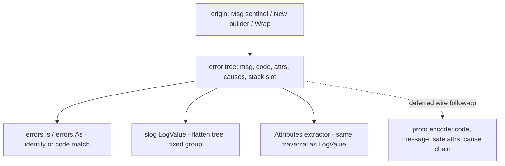

# Internal errs Package - Plan

> Implemented. The current package is `src/common/errs`. References below to
> `src/common/snmp` preserve the implementation-time layout; SNMP later moved to
> `src/protocol/snmp`, and the `ae` production dependency was removed.

## Goal Capsule

- **Scope amendment (2026-08-19, user-directed):** exit codes, user messages, hints, and the retryable/fatal flag are reinstated as R14/R15 and unit U7, after U1–U6 had landed. Error codes were never dropped — they are R4/R9's `Code`.
- **Objective:** Build `errs`, FlowSeer's own errors package at `src/common/errs`, and migrate hand-written runtime code off `go.aledante.io/ae` (excepting `src/common/snmp/cmd/mibgen`, per R10). The mibgen/generated-code migration, the wire codec/interceptor, and full removal of `ae` from the module graph are follow-ups, not active scope.
- **Product authority:** This document; conventions in `docs/code-style.md` (whose Errors section this work itself updates, per R12).
- **Open blockers:** None. Full removal of `ae` from the module graph is blocked on the follow-ups and on `go.aledante.io/as` dropping its own ae dependency (see Dependencies).
- **Authority:** this plan's Product Contract for behavior; `docs/code-style.md` and `docs/solutions/architecture-patterns/snmp-collection-library-architecture-and-fast-path-conventions.md` for conventions. `src/common/snmp/doc.go` is authoritative over its README where they disagree.
- **Stop conditions:** stop and surface — do not improvise — if migration reveals ae behavior that `errs` cannot reproduce without a design change (test assertions depending on ae internals beyond the attribute-merge semantics R5 pins), or if any change would touch `cmd/mibgen`, `generated/`, or `spec/proto/`.
- **Execution profile:** single-repo library work, no external services; test-heavy; merge gate is `golangci-lint run`, `go build ./...`, `go vet ./...`, `go test -race ./...`.
- **Product Contract preservation:** unchanged by enrichment (review-round edits landed with user confirmation before planning).

---

## Product Contract

### Summary

Replace direct hand-written use of the external `go.aledante.io/ae` dependency with an owned `errs` package at `src/common/errs`; mibgen, generated code, and module-graph removal follow later. It keeps ae's proven builder shape trimmed to a four-field core (message, code, attributes, causes), fixes ae's rough edges, and adds what a distributed FlowSeer needs: stable string codes as cross-boundary identity, client-safe attribute marking, slog integration, and origin-only lazy stacks.

### Problem Frame

FlowSeer's error handling is built on `go.aledante.io/ae`, an external module the project does not control. The repo exercises a small fraction of its surface — sentinels, wrapping, attributes, causes — while carrying fourteen struct fields and subsystems (printers, exit codes, hints, tags, trace IDs) nothing here uses. ae also has design flaws worth fixing at the source: `Wrapf` places the wrapped error between the format string and its args, the builder re-clones its maps on every wrap, and `Cause` vs `CauseUnwrap` hide two different semantics behind similar names.

Meanwhile the project is growing into a distributed system — edge/backend split, Connect RPC, message brokers — where errors will cross process boundaries. ae has no wire story, and survey of prior art (cockroachdb/errors, samber/oops, pkg/errors, gRPC/Connect practice) shows transit concerns must shape the core API (code identity, attribute safety) rather than being bolted on later.

### Key Decisions

- **Redesign freely rather than fork ae faithfully or merely trim it.** (session-settled: user-directed — chosen over faithful fork and trim-to-usage: analysis-driven cleanup beats carrying ae's flaws.) Governs R1–R9.
- **Package name `errs` at `src/common/errs`.** (session-settled: user-directed — chosen over `errors`, which shadows stdlib and forces aliases at nearly every call site, and over keeping `ae`.) Governs R10.
- **Curated builder plus slog `LogValuer`, extended for wire transit.** (session-settled: user-directed — chosen over a minimal stdlib-only surface and over a full slog-shaped variadic rewrite: call sites keep reading well and migration stays mostly mechanical.) Governs R1, R7.
- **Wire layer ships design-ready, not implemented.** (session-settled: user-directed — chosen over shipping the proto message and codec now: no consumer exists yet; codes and attribute safety land now because they shape the core API.) Governs R6, R9, R13.
- **mibgen and generated code migrate in a follow-up.** (session-settled: user-directed — chosen over one combined effort: keeps this unit bounded; `ae` stays in `go.mod` meanwhile.) Governs R11.
- **Cross-boundary identity via stable string codes, not encoded types.** (session-settled: user-approved — chosen over cockroachdb-style type registries: both ends compile the same codes, so `errors.Is` works across processes without registration machinery.) Governs R4, R9.
- **Attribute safety is marked at creation, not scrubbed at the edge.** (session-settled: user-approved — chosen over boundary-time sanitization: the future RPC boundary can then filter mechanically.) Governs R6.

### Requirements

**Package core**

- R1. `errs` provides a fluent builder — `New()` / `From(err)` with chainable attribute, cause, and code methods, terminating in `Msg` / `Msgf` — plus `errs.Msg` / `errs.Msgf` for sentinels and `Wrap(err, msg)` / `Wrapf(err, format, args...)` with the wrapped error as the first parameter.
- R2. The core error payload is message, code, attributes, and causes, plus the four fields R14/R15 add; the only additional storage is the non-serialized diagnostic stack slot R8 requires. A field earns a place only if a mechanism consumes it — the process, a retry loop, `errors.Is`, or the boundary filter — not because a reader might find it interesting.
- R3. The package is stdlib-native: errors implement `Unwrap() []error` and compose with `errors.Is`, `errors.As`, and `errors.Join`; there is no parallel matching API. Causes attached through the builder join the `Unwrap` chain and are visible to `errors.Is` / `errors.As`; there is no second, non-matching cause channel — this closes ae's `Cause` / `CauseUnwrap` split.
- R4. `Is` matches by identity and by stable code, with tests covering reflexivity, nil operands, and non-comparable causes (the samber/oops `Is` bug class).
- R5. Attributes are flat key-value pairs, nil-safe, appended without re-cloning the full attribute set on each wrap; an `errs.Attributes(err)` extractor returns the merged attributes of a chain (existing snmp tests assert top-level attributes through this extractor; chain merging is new behavior relative to ae). Merging traverses the cause tree deterministically — outermost first, joined branches left to right — and the first value encountered for a key wins.
- R6. Attributes are internal by default; a distinct method marks an attribute client-safe, so a boundary can filter mechanically. Raw secret material (keys, salts, passwords) is never attached as an attribute or interpolated into a message — attach lengths and protocol names instead, codifying existing snmp practice.
- R7. The error type implements `slog.LogValuer`: one `LogValue()` flattens the whole cause tree under a fixed group using R5's traversal order, so log output and `errs.Attributes` never disagree, and it never panics on nil or odd values. When the chain carries a stack (R8), `LogValue` exposes it under a named diagnostic field with symbolized frames — logs are the only surface stacks reach today.
- R8. Stack traces are captured lazily (program counters only) once at origin; a wrapping error skips capture when any cause branch already carries a stack, and independently created origins each keep theirs, so a joined tree may legitimately hold more than one. Stacks surface in logs; over the wire they may travel only on trusted internal transit per R13, and are never serialized toward clients.
- R9. Codes are stable strings treated as a wire contract: append-only, never renamed or reused, namespaced as `<package>/<name>`, and globally unique — a test enumerates all declared codes and asserts uniqueness so collisions fail CI rather than surfacing as false `errors.Is` matches. The package documents this discipline.

**Client-facing text, exit status, and retries** (added 2026-08-19, user-directed, after U1–U6 landed)

- R14. An error carries a client-facing message and a hint, set with `.UserMsg(msg)` and `.Hint(hint)` and read with `errs.UserMessage(err)` / `errs.Hint(err)`. Both are client-safe by definition — they name no internal host, engine ID, or call path — and both resolve outermost-first, the traversal R5 fixes, because the level closest to the caller knows what that caller was attempting. They are what R13's boundary sends in place of the internal message; an empty result means the boundary falls back to a generic string.
- R15. An error carries a process exit status and a retry disposition. `.ExitCode(n)` (positive only; zero and negative are ignored) is read with `errs.ExitCode(err)`: 0 for a nil error, the outermost value set, otherwise 1, so a `main` may exit on any error unconditionally. `.Retryable()` / `.Fatal()` are read with `errs.Retryable(err)`, resolved to the outermost error that expressed a disposition, so a wrapper that has exhausted its retry budget overrules a transient cause; a chain expressing none is not retryable. Exit status is process-local and never crosses the wire; the retry disposition does, since it maps onto a retryable RPC status.

**Migration and conventions**

- R10. All hand-written Go code migrates from `ae` to `errs` — `src/common/snmp` including its tests — except `src/common/snmp/cmd/mibgen`, which stays on `ae` until the generator follow-up.
- R11. The mibgen follow-up (generator emitter, its `ae` import constant, golden fixtures, and regeneration of `generated/go/mib`) is out of this unit; until it lands, `ae` remains in `go.mod`.
- R12. `docs/code-style.md` §Errors is rewritten to name `errs` as the norm; the package itself is documented per the `src/common/snmp` precedent (README plus authoritative `doc.go`).

**Wire readiness**

- R13. The package documents its wire design without implementing it:
  - the intended proto message shape — code, message, safe attributes, cause chain, and an optional stack populated only on trusted internal transit (service-to-service, broker) and always absent toward clients, per R8;
  - the opaque-cause decode fallback — unknown causes degrade to a generic leaf preserving message, code, and safe attributes;
  - unmapped codes surface as internal errors rather than silent unknowns;
  - message text and the cause chain are trusted-internal content: a boundary facing untrusted clients exposes only code, client-safe attributes, and a sanitized or generic message;
  - decoded errors are accepted only from authenticated, integrity-protected peers, and peer-supplied codes and attributes never drive authorization decisions.

### Acceptance Examples

- AE1. **Covers R4, R9.** **Given** a sentinel created with code `snmp/priv-decrypt` and a second error constructed independently carrying the same code but no shared identity (what a decoded peer error degrades to), **when** the handler calls `errors.Is(other, sentinel)`, **then** it matches — identity equality is not required. The same example becomes an end-to-end decode test in the wire follow-up.
- AE2. **Covers R7.** **Given** an inner error with attribute `have=4` wrapped by an outer error setting `have=8`, **when** the error is logged through slog, **then** one grouped record appears with `have=8` (outermost wins) and no duplicate keys.
- AE3. **Covers R8.** **Given** a single-origin error that captured a stack, **when** it is wrapped twice more on the way up, **then** the chain still holds exactly one stack.
- AE4. **Covers R1.** **Given** a failed dial, **when** wrapping with `errs.Wrapf(err, "dial %s", target)`, **then** the message renders with the target interpolated and `errors.Is(wrapped, err)` holds — the error-first signature replaces ae's error-in-the-middle `Wrapf`.
- AE5. **Covers R5, R7.** **Given** `errors.Join` of two errs errors that both set attribute `proto`, wrapped by an outer error, **when** attributes are extracted or the error is logged, **then** both surfaces report the same value — the first encountered in outermost-first, left-to-right traversal.

### Scope Boundaries

**Deferred for later**

- mibgen migration: the generator's emitter and fixtures, plus regeneration of `generated/go/mib` (per R11).
- The wire proto message and `Encode`/`Decode` implementation — lands with the first RPC or broker consumer.
- The Connect boundary interceptor, internal-code→RPC-code mapping table, and message sanitization.
- Broker message envelope integration.

**Outside this package's identity** (ae features dropped, no FlowSeer usage)

- Tags (subsumed by codes for identity and attributes for facts), related errors (the `Cause`/`CauseUnwrap` split R3 closes), timestamps (the log record already stamps one), trace/span IDs (OpenTelemetry propagates them through `context`; a copy on the error can only go stale), the printer suite (the slog handler and the RPC boundary render), OTel hooks, and a stdlib-`errors` drop-in sub-package.
- Severity/log level was considered alongside R14/R15 and declined: a code→level table at the handler covers it without growing the payload.

**Reinstated 2026-08-19** (user-directed, after U1–U6 landed): user-facing messages, hints, exit codes, and the recoverable/fatal flag — now R14/R15, unit U7. Each cleared R2's bar: a mechanism consumes it (the client boundary, the process, the retry loop), unlike the items above.

### Dependencies / Assumptions

- `go.aledante.io/as` v0.4.3 itself requires `ae` v0.3.0 (verified in its `go.mod`), so `ae` stays in FlowSeer's module graph even after this migration; full removal additionally needs an `as` release without ae or a vendoring decision for `as`. Outside this unit.
- Assumption: no consumer outside this repo imports FlowSeer's error values, so the `ae`→`errs` change breaks no external API.

### Sources / Research

- ae v0.3.0 source (module cache) — API surface, `Wrapf` signature (`utils.go:49`), builder cloning behavior.
- Actual ae usage: `src/common/snmp/*.go` and tests (`Msg`, `Msgf`, `New`, `Wrap`, `Wrapf`, `.Attr`, `.Cause`, `.Msg`, `Attributes` extractor); mibgen uses the `ae/errors` sub-package (`src/common/snmp/cmd/mibgen/config.go`).
- cockroachdb/errors — opaque-cause decode fallback and code/mark-based cross-wire `Is`; its registry machinery is the cautionary tale (<https://github.com/cockroachdb/errors>).
- samber/oops — validates builder+attributes+LogValuer shape; issues #95/#87/#78 (`Is` semantics), #61/#24 (duplicate stacks), #48 (nil panic), #6 (no wire story) define the test matrix (<https://github.com/samber/oops>).
- pkg/errors post-mortem and eris — capture stacks once at origin, never per wrap (<https://github.com/rotisserie/eris>).
- Connect error model — small stable set of typed error details; sanitize messages at the boundary (<https://connectrpc.com/docs/go/errors/>).
- Per-file ae inventory, test conventions (stdlib `testing`, table-driven, no `t.Parallel()`), and lint gates (`.golangci.yml`: gofumpt, goimports local-prefix, revive `error-naming`/`error-strings`) verified against the repo; snmp tests assert exact attribute keys, pinning extractor merge semantics.

---

## Planning Contract

### Key Technical Decisions

- KTD1. **The public API keeps ae's names** — `Msg`/`Msgf`, `New()`/`From(err)`, error-first `Wrap`/`Wrapf`, builder `.Attr`/`.Cause`/`.Code`/`.Msg`/`.Msgf`, extractor `Attributes(err)` — plus new `.PubAttr` for client-safe attributes and `CodeOf(err)` (the extractor cannot be named `Code`; that identifier is the type). (session-settled: user-approved — chosen over renaming the surface: migration stays a near-mechanical import rename, and the ~200 existing call sites already read well.) Governs R1, R5, R6.
- KTD2. **Codes are registered values, not bare strings.** `errs.NewCode("snmp/priv-decrypt")` returns a `Code`, registers it in a package-level registry at init, and panics on duplicates. The registry is process-local (one binary per `go test` package), so R9's CI gate is a repo-wide source-scan test in `errs` asserting `NewCode` string-literal uniqueness and format; the init-time panic is the runtime backstop for any linked binary. No cockroachdb-style encoder registries. `.Code(c)` takes the typed value; `Is` consults it per R4. (session-settled: user-approved — chosen over plain strings plus a lint script: init-time enforcement cannot be skipped.) Governs R4, R9.
- KTD3. **Stack capture is automatic at builder and wrap origins; sentinels never capture.** `New()…Msg()`, `Wrap`, and `Wrapf` capture lazy program counters when no cause branch carries a stack (per R8); `errs.Msg` sentinels do not — a stack recorded at package init is noise. (session-settled: user-approved — chosen over an opt-in `.Stack()` method that ae had and nothing used.) Governs R8.
- KTD4. **One concrete error struct; the builder is a value type cast to the error at its terminal.** ae's proven termination shape (`Msg` returns `error`, not `Builder`) is kept; the struct implements `Error()`, `Unwrap() []error`, `Is`, and `slog.LogValuer`. `Error()` reproduces ae's rendering — the error's own message, then `: ` and the cause's `Error()` for one cause, `: [c1; c2]` for multiple — because existing snmp tests assert cause text through wrappers. Governs R1, R2, R3, R7.
- KTD5. **Attributes are an append-only slice merged at extraction time.** Wrapping appends to the wrapper's own slice; no map cloning per wrap (ae's cost). `Attributes(err)` and `LogValue()` share one traversal (R5's order) so they cannot disagree, and the merge must reproduce the key/value results the existing snmp test assertions expect. Governs R5, R7.
- KTD6. **Migration is a mechanical rename with the snmp test suite as the oracle for rendering, matching, and top-level attribute extraction.** Import `go.aledante.io/ae` → `go.aledante.io/FlowSeer/src/common/errs`, identifier `ae.` → `errs.`, goimports regroups (errs joins the local-prefix group). One deliberate semantic change rides along: ae's `Attributes(err)` read only the top error's own attributes, while `errs.Attributes` merges the chain per R5 — existing assertions pass because each asserted attribute sits on the outermost error, and the merge semantics themselves are new behavior proven by U3's tests, not by the migration. Governs R10.

### High-Level Technical Design

Directional guidance, not implementation specification.

Public surface (pseudo-code):

```go
// sentinels and codes
func Msg(msg string) error
func Msgf(format string, args ...any) error
func NewCode(name string) Code          // panics on duplicate; "<package>/<name>"
func Codes() []Code                     // for the uniqueness/format test

// wrapping (error-first, fixing ae's Wrapf)
func Wrap(err error, msg string) error
func Wrapf(err error, format string, args ...any) error

// builder
func New() Builder
func From(err error) Builder            // seeds causes with err
Builder.Attr(key string, val any) Builder
Builder.PubAttr(key string, val any) Builder   // client-safe
Builder.Cause(errs ...error) Builder    // nil-safe; joins Unwrap chain
Builder.Code(c Code) Builder
Builder.Msg(msg string) error           // terminal
Builder.Msgf(format string, args ...any) error

// extraction
func Attributes(err error) map[string]any      // merged, R5 traversal
func SafeAttributes(err error) map[string]any  // client-safe subset only, same traversal
func CodeOf(err error) (Code, bool)
```

Error data flow:



---

## Implementation Units

### U1. Core type, builder, sentinels, wrapping

- **Goal:** the `errs` package compiles with its core surface: error struct, builder, `Msg`/`Msgf` sentinels, error-first `Wrap`/`Wrapf`.
- **Requirements:** R1, R2, R3. Covers AE4.
- **Dependencies:** none.
- **Files:** `src/common/errs/errs.go`, `src/common/errs/builder.go`, `src/common/errs/wrap.go`, `src/common/errs/errs_test.go`, `src/common/errs/builder_test.go`, `src/common/errs/wrap_test.go`.
- **Approach:** per KTD4 the struct owns the four-field payload plus the diagnostic stack slot (R2); builder methods are value receivers returning `Builder`; `Msg` casts to the error type. Causes attached via `From`/`.Cause` join `Unwrap() []error` (R3). Error strings follow `docs/code-style.md` (lowercase, unpunctuated).
- **Patterns to follow:** doc-comment contract and naming from `docs/code-style.md` §Doc comments and §Naming; sentinel doc style from `src/common/snmp/errors.go`.
- **Test scenarios:** (table-driven, stdlib `testing`, no `t.Parallel()`)
  - Sentinel renders its message; two sentinels with equal text are not `errors.Is`-equal.
  - Covers AE4. `Wrapf(err, "dial %s", target)` interpolates and `errors.Is(wrapped, err)` holds.
  - `Wrap`/`Wrapf` with nil error returns nil (matches `fmt.Errorf` composability expectations at call sites that guard on nil).
  - Builder chain `New().Attr(...).Cause(sentinel).Msg("x")` yields an error where `errors.Is(e, sentinel)` holds and message is `x`.
  - `.Cause(nil)` and `.Cause()` are no-ops; no panic.
  - `From(err).Msg("ctx")` preserves `errors.Is(built, err)`.
  - `errors.As` extracts the concrete type through a wrap chain.
  - A wrapped error's `Error()` surfaces the cause text after the wrapper's own message (`wrap msg: cause msg`; multi-cause as `: [c1; c2]`), matching ae's rendering per KTD4.
- **Verification:** unit tests green under `-race`; lint clean.

### U2. Codes and Is semantics

- **Goal:** registered, globally unique codes; `errors.Is` matches by identity and by code.
- **Requirements:** R4, R9. Covers AE1.
- **Dependencies:** U1.
- **Files:** `src/common/errs/code.go`, `src/common/errs/code_test.go`.
- **Approach:** per KTD2 — `NewCode` validates the `<package>/<name>` shape, registers, panics on duplicate; the error type's `Is` method compares codes when both sides carry one, identity otherwise. A test walks `Codes()` asserting uniqueness and format so collisions fail CI (R9).
- **Test scenarios:** (the samber/oops `Is` bug class, per R4)
  - Covers AE1. Two independently constructed errors sharing a code match via `errors.Is`; no shared identity required.
  - Reflexivity: `errors.Is(e, e)` for coded and uncoded errors.
  - Nil operands: `errors.Is(e, nil)` and `errors.Is(nil, e)` are false, no panic.
  - Non-comparable causes (errors carrying maps/slices) in the chain do not panic `Is`.
  - Different codes never match; a coded error does not match an uncoded sentinel it doesn't wrap.
  - `NewCode` panics on duplicate registration and on malformed names (no slash, empty segment).
  - A repo-wide source scan finds every `NewCode` string literal and asserts global uniqueness and `<package>/<name>` format (the KTD2 CI gate — the in-process registry only sees co-linked packages).
- **Verification:** unit tests green under `-race`; registry test enumerates all declared codes.

### U3. Attributes, client-safe marking, slog integration

- **Goal:** attribute attach/extract with deterministic tree traversal, `PubAttr`, and `slog.LogValuer`.
- **Requirements:** R5, R6, R7. Covers AE2, AE5.
- **Dependencies:** U1.
- **Files:** `src/common/errs/attr.go`, `src/common/errs/slog.go`, `src/common/errs/attr_test.go`, `src/common/errs/slog_test.go`.
- **Approach:** per KTD5 — append-only slice per error; one shared traversal (outermost first, joined branches left to right, first value wins) feeds both `Attributes(err)` and `LogValue()`; `LogValue` groups under a fixed key and never panics on nil/odd values (R7). `PubAttr` sets a safety bit surfaced through `SafeAttributes` (the extractor the future wire layer consumes, per R6). Traversal steps through foreign (non-errs) nodes via `Unwrap` without reading attributes from them.
- **Test scenarios:**
  - Covers AE2. Inner `have=4` wrapped by outer `have=8` → extraction and log record report `have=8`, no duplicate keys.
  - Covers AE5. `errors.Join` of two attribute-carrying errs errors under one wrapper → `Attributes` and `LogValue` agree on the winning value.
  - Nil attribute values and odd shapes do not panic `LogValue` (oops #48 class).
  - Mixed chain with a plain `fmt.Errorf`-wrapped ae or stdlib node between errs nodes: traversal continues through it.
  - `SafeAttributes` returns only `PubAttr`-marked values; `.Attr` values appear in `Attributes` but not `SafeAttributes`.
  - Existing snmp assertion shapes: keys like `got`, `max`, `index`, `type` set on one wrap level extract with the same values ae returned.
- **Verification:** unit tests green under `-race`; `Attributes`/`LogValue` parity asserted by a shared-fixture test.

### U4. Lazy origin stacks

- **Goal:** program-counter stack capture per R8's tree rule.
- **Requirements:** R8. Covers AE3.
- **Dependencies:** U1.
- **Files:** `src/common/errs/stack.go`, `src/common/errs/stack_test.go`.
- **Approach:** per KTD3 — capture `runtime.Callers` pcs (no symbolization) at builder terminals and `Wrap`/`Wrapf` when no cause branch already carries a stack; sentinels never capture. Symbolize only when rendered into a log record.
- **Test scenarios:**
  - Covers AE3. Single-origin error wrapped twice holds exactly one stack.
  - `errors.Join` of two stack-carrying origins under a wrapper: both stacks retained; the wrapper captures none.
  - Sentinel returned directly carries no stack; wrapping it captures one at the wrap site.
  - Stack pcs symbolize to frames naming the origin call site, not the errs package internals.
  - A stack-carrying error's `LogValue` includes the diagnostic stack field with symbolized origin frames (per R7).
- **Verification:** unit tests green under `-race`.

### U5. Package documentation and convention update

- **Goal:** `errs` documented per the snmp precedent; repo error conventions point at `errs`.
- **Requirements:** R12, R13.
- **Dependencies:** U1, U2, U3, U4.
- **Files:** `src/common/errs/doc.go`, `src/common/errs/README.md`, `docs/code-style.md`.
- **Approach:** `doc.go` is the authoritative contract (snmp learning: README drifts): `# Identity`, `# Surface`, `# Codes` (append-only wire-contract discipline, `<package>/<name>`, per R9), `# Attributes and safety` (internal-by-default, `PubAttr`, no raw secrets — per R6), `# Stacks` (per R8), `# Wire design` (the R13 documentation: proto shape, opaque-cause fallback, trust rules — documented, not implemented). README stays a thin surface map. Rewrite `docs/code-style.md` §Errors to name `errs` as the norm (`errs.Msg` for sentinels, error-first `Wrapf`), removing the `go.aledante.io/ae` reference (R12).
- **Test scenarios:** Test expectation: none — documentation unit; `revive` `package-comments` and doc-comment lint enforce presence.
- **Verification:** lint clean; `doc.go` covers every R13 bullet; `docs/code-style.md` no longer references ae as the norm.

### U6. Migrate hand-written code off ae

- **Goal:** zero `go.aledante.io/ae` imports in hand-written code outside `src/common/snmp/cmd/mibgen`.
- **Requirements:** R10. 
- **Dependencies:** U1, U2, U3, U4.
- **Files:** all ae-importing files under `src/common/snmp/` (heaviest: `pdu.go`, `ber.go`, `v3msg.go`, `decode.go`, `session_engine.go`, `watch.go`, `watcher.go`, `tc.go`, `usm_*.go`, `backend.go`, `oid.go`, `reactor.go`, `errors.go`, `walker.go`, `options.go`, plus tests `tc_test.go`, `watch_test.go`, `oid_test.go`, `watcher_native_test.go`), `src/common/snmp/test/integration/` and its `testenv/`, `src/common/snmp/bench/netsnmp.go` (own module; `replace` to repo root already wired).
- **Approach:** per KTD6 —
  1. Swap imports `go.aledante.io/ae` → `go.aledante.io/FlowSeer/src/common/errs` aliased or renamed `errs`; rewrite `ae.` → `errs.` (same symbol names per KTD1); fix argument order at `Wrap`'s ~73 and `Wrapf`'s ~106 in-scope call sites — ae declares both message-first (`Wrap(msg, err)`, `Wrapf(msg, err, args...)`); the error moves first in both.
  2. Migrate `ae.Attributes(err)` test call sites to `errs.Attributes(err)`. Before the sweep, audit snmp tests for exact-attribute-set or key-absence assertions — chain-merged extraction can newly surface inner keys that ae's top-level-only extractor hid (KTD6).
  3. Run goimports/gofumpt so errs lands in the local-prefix import group.
  4. During the sweep, audit attribute and message call sites in the `usm_*.go` files against R6's secrets rule (lengths and protocol names, never raw key/salt bytes) — a checked step, not prose.
  5. `cmd/mibgen/` untouched, including its `ae/errors` sub-package import; `generated/` untouched.
  6. `bench` module: migrate its single file; `go build ./...` from `src/common/snmp/bench`.
- **Execution note:** mechanical sweep; land per file cluster; no behavior changes ride along. The unchanged snmp test suite is the regression oracle — if a test needs edits beyond the mechanical rename, stop and surface it (Goal Capsule stop condition).
- **Test scenarios:**
  - Full existing snmp suite passes unchanged (beyond the mechanical rename) under `go test -race ./...`.
  - Attribute-key assertions (`got`, `max`, `index`, `type` in `tc_test.go`, `oid_test.go`, `watch_test.go`) pass against `errs.Attributes`.
  - A repo grep gate: no `go.aledante.io/ae` import outside `src/common/snmp/cmd/mibgen`, `generated/`, and module files.
- **Verification:** merge gate green at root; bench module builds; grep gate clean.

### U7. Client-facing text, exit status, and retries

- **Goal:** the payload carries a user message, a hint, an exit status, and a retry disposition, each resolved by the package's one traversal rule.
- **Requirements:** R14, R15. Amends R2, R12, R13.
- **Dependencies:** U1–U5.
- **Files:** `src/common/errs/errs.go`, `builder.go`, `usermsg.go`, `exitcode.go`, `retry.go`, `slog.go`, `doc.go`, `README.md`, `docs/code-style.md`, plus `usermsg_test.go`, `exitcode_test.go`, `retry_test.go`, `slog_test.go`.
- **Approach:** four fields on `Error`; chainable builder setters, so `.Msg`/`.Msgf` remain the only terminals. `UserMessage`, `Hint`, `ExitCode`, and `Retryable` reuse `walk`, so no surface can disagree with another. The retry field is tri-state internally — unset, yes, no — because a bool cannot distinguish "not retryable" from "expressed no view", and that distinction is what lets an undecided wrapper defer to its cause while `.Fatal()` overrules one. `LogValue` renders each field only when the chain sets it, so an unset exit code does not log as `ExitCode`'s default of 1.
- **Test scenarios:**
  - Each extractor: nil, unset, own value, inherited through a wrap, outermost-wins over a cause, traversal through a foreign node, joined branches left to right.
  - `.ExitCode(0)` and `.ExitCode(-1)` are ignored rather than stored; `ExitCode` still reports 1.
  - `.Fatal()` over a retryable cause is not retryable; `.Retryable()` over a fatal cause is; an undecided wrapper defers.
  - The internal message is unchanged by `.UserMsg` / `.Hint`.
  - `LogValue` omits all four keys when unset, renders them when set, and agrees with the extractors on which level won.
- **Verification:** merge gate green; `doc.go` and `docs/code-style.md` state when to write a user message versus an internal one, and what silence about retrying means.

---

## Verification Contract

| Gate | Command | Applies to |
|---|---|---|
| Lint & format | `golangci-lint run` | all units |
| Build | `go build ./...` and `go vet ./...` | all units |
| Tests | `go test -race ./...` (root module) | all units; U6's oracle |
| Bench module | `go build ./...` in `src/common/snmp/bench` | U6 |
| ae grep gate | no `go.aledante.io/ae` import outside `src/common/snmp/cmd/mibgen`, `generated/`, `go.mod`/`go.sum`, and the bench module files that legitimately dropped it | U6 |
| Code uniqueness | the U2 repo-wide source-scan test asserts `NewCode` literal uniqueness and `<package>/<name>` format; the `Codes()` registry test is the runtime backstop within a linked binary | U2+ |
| Integration | snmp integration tests behind `testing.Short()` guard, unchanged | U6 |

---

## Definition of Done

- U1–U7 landed; all Verification Contract gates green.
- All five acceptance examples (AE1–AE5) enforced by named tests.
- `docs/code-style.md` §Errors names `errs`; `src/common/errs/doc.go` covers the R13 wire design and the R6 secrets rule.
- No `go.aledante.io/ae` import remains in hand-written code outside `src/common/snmp/cmd/mibgen` (`ae` itself stays in `go.mod` for generated code and `as` — expected, per Dependencies).
- No abandoned or experimental code from dead-end approaches remains in the diff.
