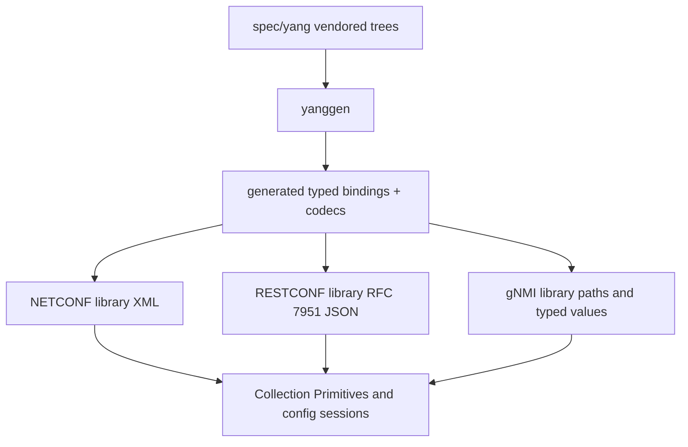
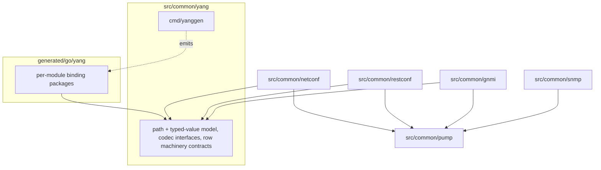
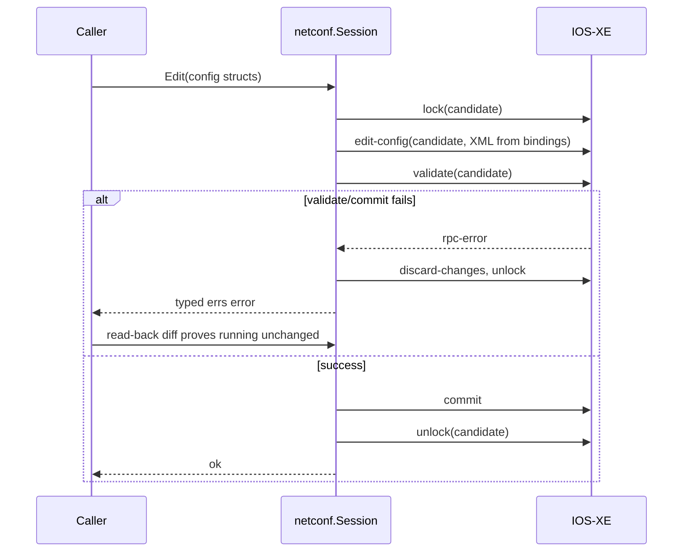
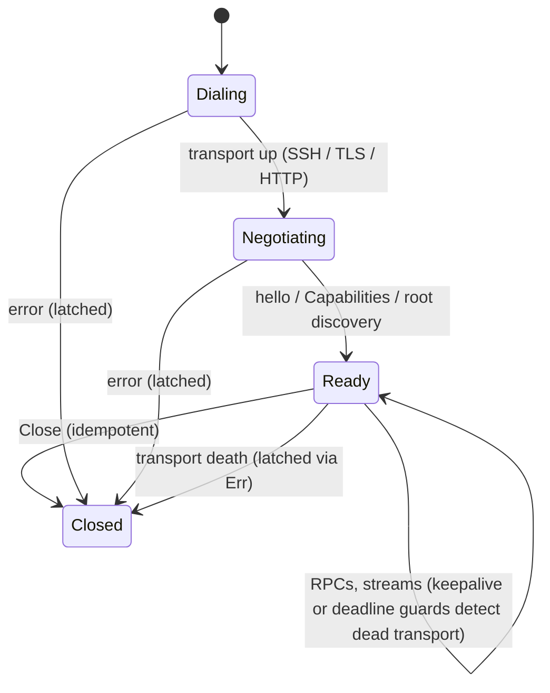

# YANG Protocol Libraries - Plan

> Code complete; live validation outstanding. The libraries described below
> landed and later moved from `src/common/{yang,netconf,restconf,gnmi}` to the
> corresponding `src/protocol/` packages. The recorded NETCONF and gNMI
> hardware-validation rows remain open, so this plan is not marked implemented.

## Goal Capsule

- **Objective:** Add NETCONF, RESTCONF, and gNMI client libraries alongside the SNMP library, sharing one generated YANG-bindings layer produced by an in-house `yanggen` covering the full vendored YANG surface of all three device families.
- **Product authority:** The Product Contract below (R1–R14) defines behavior; the Planning Contract defines mechanism. A protocol-transparent facade and any Aruba native-REST adapter are not active scope.
- **Execution profile:** Implementation proceeds in three phases (foundation → protocols → primitives and validation) per the unit dependency order. Lab-device validation (U10) is the final proof; container-backed tests gate everything before it.
- **Stop conditions:** Stop and surface (do not guess) if: the pump extraction (U1) breaks SNMP behavior in a way its tests don't isolate; goyang fails to resolve a vendored tree and the failure is not a skippable module; the R9 measurement shows full-surface output is infeasible to commit AND CI generation is also impractical; or lab hardware contradicts a protocol assumption in a way that changes product scope (route back to the user, per R14's escape hatch for Aruba writes).

---

## Product Contract

### Summary

Build a YANG-based device-access layer: three sibling protocol libraries (NETCONF, RESTCONF, gNMI) over typed Go bindings generated from the vendored YANG trees by `yanggen`, mibgen's sibling. First proving workload is reading device identity and metrics through the existing Collection Primitives contract; v1 acceptance also includes full config-write validation on lab hardware.

### Problem Frame

FlowSeer ingests from network devices over SNMP today, but the fleet's richer management surface is model-driven: Cisco IOS-XE speaks NETCONF and RESTCONF, Ruckus ICX 9.x exposes a RESTCONF/OpenConfig tree, and Aruba CX publishes gNMI-oriented OpenConfig models. The YANG models for all three are already vendored under `spec/yang/` (1,071 + 111 + 19 modules), but no client library or YANG codegen exists in `src/` or `generated/` — the specs are dead weight until something consumes them. Config management in particular has no path at all: SNMP write support cannot express modern device configuration.

### Key Decisions

- KD1. **Config-first, full protocol support** — the libraries cover the complete protocol surface (config read/write and operational state), not a monitoring-only subset. (session-settled: user-directed — chosen over state-only or config-only scope: matches how the SNMP library covers its protocol fully.) Governs R1, R2, R3.
- KD2. **All three device families from day one** — IOS-XE, ICX, and Aruba CX are all v1 coverage requirements. (session-settled: user-directed — chosen over phased vendor rollout.) Governs R11, R12.
- KD3. **gNMI is a third first-class protocol** — Aruba CX is served via gNMI rather than a native-REST adapter or deferral; gNMI is where all three vendors are heading. (session-settled: user-directed — chosen over lab-verify-then-decide, native REST adapter, and two-family v1.) Governs R3, R14.
- KD4. **Sibling protocol libraries, no unified facade** — each library is idiomatic to its protocol; NETCONF's candidate/commit model cannot be flattened into RESTCONF's immediate edits without gutting config-first. A thin facade can be added later if a real caller wants one. (session-settled: user-approved — chosen over protocol-transparent session: transaction semantics diverge and the fleet forces per-device protocol choice anyway.) Governs R4.
- KD5. **Full vendor surface codegen** — every vendored module is generated, not an allowlist or a typed-core-plus-dynamic hybrid; compile and repo weight are accepted costs, contained by per-module packages and Go's import-graph pruning. (session-settled: user-directed — chosen over allowlist-driven and hybrid generation.) Governs R5, R9. *Conflict call-out:* repo research found mibgen's byte-diff check mode and per-file SHA headers strain at 1,071 modules — workable, addressed by KTD7 and the R9 measurement gate, not a blocker.
- KD6. **In-house `yanggen` over adopting ygot** — goyang resolves the schema (groupings, augments, deviations), jennifer emits house-style Go under mibgen's conventions; ygot emits no NETCONF XML and its output style conflicts with the generated-code house rules. External research confirmed ygot fails outright on the full IOS-XE native tree (enumeration name clashes in flat-namespace codegen — openconfig/ygot issue 888). (session-settled: user-directed — chosen over ygot adoption and transport-first sequencing.) Governs R5, R6, R7, R8.
- KD7. **State reads extend the Collection Primitives contract** — Walker/Watcher analogs over YANG paths with the same lifecycle semantics, rather than one-shot read helpers. (session-settled: user-directed — chosen over one-shot reads and Walker-only.) Governs R10.
- KD8. **Full write validation in v1** — the write path is proven on lab hardware before v1 closes, including transaction error and rollback behavior, not just a happy-path change. (session-settled: user-directed — chosen over reads-only acceptance and one-write-per-family.) Governs R12, R14.
- KD9. **Lab hardware is the validation authority** — real devices for the three families back conformance capture, like the SNMP quirk corpus. (session-settled: user-directed — chosen over containers-and-fixtures-only.) Governs R12, R13.

One generated source of truth fans out to three wire protocols:

### Requirements

**Protocol libraries**

- R1. A NETCONF client library supports session establishment, get and get-config, edit-config against the candidate datastore, validate, commit, and rollback, proven against IOS-XE. Datastore writability is capability-driven per session (IOS-XE candidate mode makes `running` non-writable), and candidate edits take the lock before editing and release it after commit or discard.
- R2. A RESTCONF client library supports RFC 8040 read and edit operations in RFC 7951 JSON, proven against IOS-XE and ICX, including API-root discovery and typed decoding of `ietf-restconf:errors` payloads.
- R3. A gNMI client library supports Capabilities, Get, Set, and Subscribe, proven against Aruba CX and, where supported, IOS-XE.
- R4. The three libraries are siblings, each idiomatic to its protocol; no protocol-transparent facade ships in v1.

**Codegen**

- R5. A `yanggen` tool generates typed Go bindings for the full vendored YANG surface of all three vendors, driven by a manifest and emitting per-module packages, following mibgen's conventions.
- R6. Generated bindings encode and decode all three wire forms from the same structs: NETCONF XML, RFC 7951 JSON, and gNMI paths with typed values.
- R7. Generated code consumes only the host libraries' public API, never internal packages.
- R8. `yanggen` has a drift-check mode, and generated output records the source module revisions it was built from so `spec/yang` and `generated/` stay verifiably in sync. At runtime, a session detects when device-advertised module revisions differ from the vendored revisions it was compiled from and surfaces the mismatch (warn-and-proceed by default).
- R9. Before the commit-generated-code convention is locked in, the full-surface output's repo size and compile cost are measured; the commit-vs-generate-in-CI policy is decided from that measurement.

**State reads**

- R10. State reads surface through the Collection Primitives lifecycle contract: a Walker analog for bounded traversal of YANG subtrees, a Watcher analog diffing state between ticks, and gNMI Subscribe surfacing through the streaming-primitive shape.
- R11. The first consumer reads device identity (hostname, serial, model, OS version) and metrics from all three device families.

**Config writes and validation**

- R12. v1 acceptance includes write validation on lab hardware per family: candidate, validate, commit, and rollback exercised on NETCONF including error paths; RESTCONF edits verified on ICX; gNMI Set verified on Aruba CX subject to R14. Rollback is proven by read-back diff of the affected subtree, not by trusting the device's success response.
- R13. The conformance-corpus discipline extends to the new libraries: device and server quirks encountered during lab validation are recorded with provenance and covered by cited tests.
- R14. Aruba CX write capability over gNMI is verified on lab hardware early; if Set proves insufficient for config writes there, the Aruba write-acceptance criterion converts to a documented gap with the fallback path recorded, without blocking v1 for the other families. External research indicates AOS-CX gNMI is likely telemetry-oriented, making this escape hatch probable.

### Key Flows

- F1. Metrics collection
  - **Trigger:** A collector opens a session to a device and starts a Watcher (or gNMI Subscribe stream) over a state subtree.
  - **Steps:** Session established over the device's protocol; typed bindings decode the wire payload; the primitive emits add/modify/remove events (or streamed updates) until closed.
  - **Covers:** R3, R10, R11.
- F2. Config change
  - **Trigger:** A caller edits typed config structs and submits them.
  - **Steps:** NETCONF: lock candidate, edit-config, validate, commit, unlock, with rollback on failure. RESTCONF: edit applied with If-Match where supported, result verified by read-back. gNMI: Set, verified by Get.
  - **Covers:** R1, R2, R3, R12.

### Acceptance Examples

- AE1. **Covers R11.** Given a lab IOS-XE, ICX, and Aruba CX device, when the identity read runs against each, then hostname, serial, model, and OS version are returned as typed values on all three.
- AE2. **Covers R1, R12.** Given a config change staged to the IOS-XE candidate datastore that fails validation, when commit is attempted, then the library surfaces the device's error and a read-back diff shows the running config unchanged.
- AE3. **Covers R12, R14.** Given the Aruba CX lab device, when a small reversible config change is attempted via gNMI Set, then either the change round-trips, or the incapacity is recorded and the Aruba write criterion is converted per R14.
- AE4. **Covers R10.** Given a Watcher over an interface-state subtree, when an interface changes state between ticks, then exactly one modify event is emitted for that row and Close terminates the stream within one request round-trip.

### Scope Boundaries

- Protocol-transparent facade over the three libraries — deferred until a real caller needs one.
- Aruba CX native REST/OpenAPI adapter — superseded by the gNMI decision; no AOS-CX OpenAPI spec is vendored (none is published; one could be exported from a lab switch if ever wanted).
- SNMP is complemented, not replaced; existing SNMP collection paths are untouched.
- Config-management product features (drift detection, change workflows, templates) — this plan delivers the library layer only; the first consumer is the identity-and-metrics read.
- Cross-family transaction guarantees — a logical change spanning multiple devices or protocols is composed by the caller; the libraries give no atomicity across sessions, and partial failure reconciliation is the caller's concern (follows KD4).
- Client-side `when`/`must` evaluation — validation is device-side (`validate` / device rejection); local constraint evaluation is a non-goal.
- The NETCONF `:startup` datastore — out of scope for v1.

#### Deferred to Follow-Up Work

- Integration tiers t2 (virtualized vendor NOS via containerlab) and t3 (recorded-transcript replay) — v1 ships t1 (containerized reference servers) and t4 (opt-in live lab devices); see KTD10.
- gNMI Subscribe POLL mode — v1 covers STREAM and ONCE; see KTD5.
- A house-built NETCONF transport, if corpus data shows `nemith/netconf` falls short — the transport seam in KTD1 keeps this open.

### Dependencies / Assumptions

- Lab hardware for all three families is available for conformance capture and write validation (KD9).
- Assumption to verify (R14): Aruba CX gNMI Set supports config writes; external research could not confirm it and suggests telemetry-only is likely.
- Assumption to verify on lab hardware: ICX supports RFC 8040 `depth`/`fields` query parameters; if not, large-subtree reads prune client-side.
- New dependencies (all OSS Go libraries, consistent with the vendor-selection rule): `openconfig/goyang` (schema resolution), `nemith/netconf` (NETCONF transport), `openconfig/gnmi` + `google.golang.org/grpc` (gNMI). No YANG parser exists in `go.mod` today; gosmi is SMI-only.
- `spec/yang/aruba/cx/SOURCES.md` states 21 files while 19 are vendored — minor doc drift to correct when touched.

### Sources / Research

- `src/common/snmp/doc.go` — the primitives lifecycle contract the new libraries extend; authoritative over the drifted `src/common/snmp/README.md`.
- `src/common/snmp/cmd/mibgen/` — the manifest, emission, and drift-check conventions `yanggen` mirrors (config.go strict-YAML manifest, load.go Kahn topo-sort, emit.go jennifer pipeline, golden tests).
- `src/common/snmp/CONFORMANCE.md` and `src/common/snmp/conformance_corpus_test.go` — the corpus discipline R13 extends (append-only rows, `// Covers conformance matrix row:` markers, build-tagged completeness gate).
- `src/common/snmp/test/integration/doc.go` — the four-tier integration model (build-tag per tier, testcontainers, opt-in live devices via env var).
- `docs/solutions/architecture-patterns/snmp-collection-library-architecture-and-fast-path-conventions.md` — guarded fast paths, machine-checked pins, tiered gates.
- `docs/solutions/architecture-patterns/errs-package-architecture-and-error-conventions.md` and `docs/plans/2026-08-17-2254-refactor-internal-errs-package-plan.md` — the errs wire contract; mibgen output still emits `ae` with migration deferred.
- `spec/yang/*/SOURCES.md` — per-vendor protocol orientation (ICX: RESTCONF only, HTTPS/443, basic auth; Aruba CX: gNMI/OpenConfig telemetry-oriented, proprietary REST config plane; IOS-XE: NETCONF/RESTCONF/gNMI).
- External: nemith/netconf (BSD-2, RFC 6241/6242/5277); openconfig/goyang (active, resolved Entry tree, leafref-per-use-site subtlety, extension gaps e.g. issue 106); openconfig/ygot issue 888 (IOS-XE native tree enum clash); Cisco IOS-XE 17.x programmability guide (candidate mode disables running writes; confirmed-commit tied to candidate); Ruckus FastIron RESTCONF Programmers Guide 09.0.10.

---

## Planning Contract

**Product Contract preservation:** R1, R2, R8, R12 gained research-confirmed qualifiers (capability-driven datastore mode, lock lifecycle, root discovery, error-payload decoding, runtime revision-drift detection, read-back rollback proof); Scope Boundaries gained three exclusions and a Deferred to Follow-Up Work subsection; AE2 now requires read-back diff. All were confirmed in the planning scope synthesis; no requirement was weakened or removed.

### Key Technical Decisions

- KTD1. **Adopt `nemith/netconf` for NETCONF transport, wrapped behind a FlowSeer session type.** (session-settled: user-directed — chosen over hand-rolling SSH framing: the YANG codec layer is the hard part; the RFC 6241/6242 envelope is commodity and nemith/netconf is the community-standard OSS client.) The wrapper owns candidate/lock/commit orchestration, errs mapping, and OTel, and keeps the transport swappable. Cites R1.
- KTD2. **Extract `pump[T]` from package `snmp` into a shared package `src/common/pump`.** (session-settled: user-directed — chosen over copying the ~235-line pattern per library: three new consumers make one shared implementation worth the one-time refactor risk; snmp's tests are the safety net.) Cites R10.
- KTD3. **`yanggen` pipeline: goyang resolved Entry tree in, jennifer per-module packages out.** Layout mirrors mibgen: strict-YAML manifest with search paths resolved against the config file into `spec/yang/...`; Kahn topo-sort over module imports; pure render functions; golden tests against a fake module set. Output: one package per module under `generated/go/yang/<vendor>/<module>/`, package names derived deterministically from module names with a collision check. Instantiates KD5/KD6; cites R5, R6, R7.
- KTD4. **Watcher row semantics over YANG trees: a YANG `list` entry is a row.** Row identity is the list's key leaves; compound keys become generated composite key structs; keys that are leafrefs resolve to their target type. Nested lists flatten: each inner-list entry is its own row, identified by the full keyed instance path, and its composite key struct includes ancestor keys (inner-list keys are unique only within their parent). A non-list subtree (scalar cluster, presence container, system state) is one synthetic row whose identity is the subtree path. Change detection reuses SNMP's generated-machinery shape: per-row `decode`/`equal`/`merge` functions emitted by yanggen. A presence container appearing or disappearing is an add/remove event on its synthetic row. The tick-diff Watcher is scoped to bounded-cardinality subtrees (config trees, interface state); high-cardinality `config=false` lists (route/MAC/ARP tables) are served by gNMI Subscribe STREAM per KTD5, and tick-diffing unbounded state lists is a v1 non-goal — there is no YANG-generic analog of SNMP's change-indicator gate. Cites R10; resolves the design gap flow analysis flagged as blocking.
- KTD5. **gNMI client is built directly on `openconfig/gnmi` protos + gRPC** (no gnmic/ygnmi layers). Encoding is negotiated via Capabilities, preferring JSON_IETF with PROTO fallback. Subscribe STREAM backs the Watcher: the device owns cadence, and `sync_response` maps to the Watcher's cold-start-complete signal (initial updates emit as Added, matching the SNMP cold-start contract). Subscribe ONCE backs one-shot bounded reads; Get backs small targeted reads like R11 identity. POLL is deferred. Cites R3, R10.
- KTD6. **`yanggen` emits the `errs` package, not `ae`.** Diverges from mibgen's current output deliberately: the ae→errs generated-code migration is already planned (`docs/plans/2026-08-17-2254-refactor-internal-errs-package-plan.md` R10 deferral), so new generated code starts on `errs` to avoid re-migration. Hand-written library code uses `errs` throughout with stable `<package>/<name>` codes settled before implementation (wire contract cannot be retrofitted). Cites R5, R7.
- KTD7. **Drift-check redesigned for scale: a lockfile of per-module content hashes.** mibgen's `-check` regenerates everything into a tmpdir and byte-diffs; at 1,071 modules that is too slow for a routine gate. `yanggen` records a lockfile mapping each module to (closure hash, revision) plus one generator version for the run. The closure hash covers the module's source and every module in its dependency closure, where the graph includes import edges and reverse augment/deviation edges (a module that augments A changes A's output without appearing in A's imports) — KTD3's topo-sort already builds this graph. `-check` compares the generator version first (mismatch flags all modules for full regeneration), then re-hashes closures and byte-diff-confirms only flagged modules. Full regeneration remains available. The same recorded revisions feed R8's runtime capability-mismatch detection. Cites R8, R9.
- KTD8. **Per-library plain options structs for auth and TLS, not functional options.** Follows `docs/code-style.md` (functional options are the snmp-scale exception). Each library defines its credential surface: NETCONF (SSH password/key), RESTCONF (basic auth, TLS config), gNMI (mTLS, token metadata). Insecure/skip-verify TLS for lab devices is an explicit named opt-in, never a default. Cites R1, R2, R3.
- KTD9. **RESTCONF writes capture the ETag before editing and send If-Match where the server supports it; every write is verified by read-back diff.** Missing ETag support degrades to unconditional write plus read-back. Conflict responses surface as a typed retryable errs code. Cites R2, R12.
- KTD10. **v1 integration testing is two tiers: t1 containerized reference servers and t4 opt-in live lab devices.** t1: netopeer2/sysrepo container for NETCONF and RESTCONF-over-IETF-models smoke; a gNMI reference target for Subscribe/Get. t4: env-var-gated live devices, mirroring `SNMP_T4_TARGETS` (unset = skip 0, malformed = fail 1). t2 (containerlab NOS) and t3 (replay captures) are deferred follow-ups. Build-tag-per-tier, tests dial only through public constructors. Cites R12, R13.

### High-Level Technical Design

Package layering — who may import whom:

Generated packages import only `src/common/yang`'s public API (R7). The protocol libraries never import generated packages; callers hand them codec-satisfying values, keeping the full-surface tree out of every consumer's import graph.

NETCONF candidate write path (F2, AE2):

Session lifecycle shared by all three libraries (states, not code):

A dropped session does not silently resume a Watcher: reconnect is the caller's action, and a re-created Watcher cold-starts (emits Added for every row), never double-emits modifies.

### Assumptions

- goyang resolves all three vendored trees; individual modules that fail (extension corner cases, e.g. goyang issue 106 territory) may be skip-listed in the manifest with the skip recorded, provided no module needed by R11 identity paths is skipped.
- The `generated/go/yang` tree stays in the root Go module (matching `generated/go/mib`); the R9 measurement can overturn this in favor of a separate module or CI-side generation.
- Confirmed-commit (commit with timeout) is not required for v1 write validation; plain candidate commit with explicit discard on failure satisfies AE2. Revisit if lab work shows orphaned-lock recovery needs it.

### Sequencing

Three phases; units within a phase can proceed in parallel where dependencies allow.

1. **Foundation:** U1 (pump extraction), U2 (yang runtime package), U3 (yanggen core), U4 (yanggen emitters + full-surface generation).
2. **Protocols:** U5 (NETCONF), U6 (RESTCONF), U7 (gNMI) — all depend on U2; U5–U7 are mutually independent.
3. **Primitives and validation:** U8 (Walker/Watcher layer), U9 (conformance corpus + t1 containers), U10 (lab validation t4).

---

## Implementation Units

| U-ID | Title | Key files | Depends on |
|---|---|---|---|
| U1 | Extract pump to `src/common/pump` | `src/common/pump/`, `src/common/snmp/` | — |
| U2 | `src/common/yang` runtime package | `src/common/yang/` | — |
| U3 | yanggen core: manifest, load, drift lockfile | `src/common/yang/cmd/yanggen/` | U2 |
| U4 | yanggen emitters + full-surface generation | `src/common/yang/cmd/yanggen/`, `generated/go/yang/` | U3 |
| U5 | NETCONF library | `src/common/netconf/` | U1, U2 |
| U6 | RESTCONF library | `src/common/restconf/` | U1, U2 |
| U7 | gNMI library | `src/common/gnmi/` | U1, U2 |
| U8 | Walker/Watcher primitives over sessions | `src/common/netconf/`, `src/common/restconf/`, `src/common/gnmi/` | U4, U5, U6, U7 |
| U9 | Conformance corpus + t1 integration env | per-library corpus tests, `src/common/*/test/integration/` | U5, U6, U7 |
| U10 | Lab validation (t4) | `src/common/*/test/integration/` | U8, U9 |

### U1. Extract pump to `src/common/pump`

- **Goal:** The generic channel-pump substrate becomes an importable package so all four protocol libraries share one lifecycle engine.
- **Requirements:** Cites KTD2; enables R10.
- **Dependencies:** None.
- **Files:** `src/common/pump/pump.go`, `src/common/pump/pump_test.go`; modify `src/common/snmp/pump.go` (delete), `src/common/snmp/walker.go`, `src/common/snmp/watcher.go`, `src/common/snmp/trap.go`, `src/common/snmp/rawwalk.go` (rewire imports).
- **Approach:**
  1. Move `pump[T]` and its send/close/latch discipline verbatim into the new package, exporting the constructor and methods; keep the sendMu close-discipline documentation with it.
  2. Rewire snmp's four pump consumers (Walker, Watcher, TrapStream, RawWalker) to the new package with no behavior change.
  3. Port pump-specific tests; snmp's existing primitive and race tests stay untouched as the regression net.
- **Execution note:** Pure refactor — snmp's full test suite (including `-race`) must pass unchanged before and after; no API additions in this unit.
- **Patterns to follow:** `src/common/snmp/pump.go` header documentation style; `docs/code-style.md` concurrency-safety documentation rule.
- **Test scenarios:**
  - Existing snmp Walker/Watcher/TrapStream tests pass unchanged after rewiring.
  - Pump unit tests cover: first-error latch wins, idempotent close, drop-oldest send under full buffer, stop-signal terminates producer within one send.
  - `go test -race ./src/common/...` clean.
- **Verification:** snmp package tests green with race detector; no import of `src/common/pump` from outside `src/common/`.

### U2. `src/common/yang` runtime package

- **Goal:** The shared runtime the generated code and protocol libraries both target: YANG path and typed-value model, codec interfaces, row-machinery contracts, errs codes, OTel conventions.
- **Requirements:** R6, R7; cites KTD4, KTD6.
- **Dependencies:** None (parallel with U1).
- **Files:** `src/common/yang/doc.go`, `src/common/yang/path.go`, `src/common/yang/value.go`, `src/common/yang/codec.go`, `src/common/yang/row.go`, `src/common/yang/errors.go`, matching `_test.go` files.
- **Approach:**
  1. Define the path type (module-qualified segments with list-key predicates) convertible to NETCONF subtree filter XML, RESTCONF URI encoding, and gNMI `Path` proto.
  2. Define typed-value representations for YANG base types (including union, identityref, decimal64, binary) with the three wire encodings per KTD4/R6 — the full normative mapping lives here.
  3. Define the contracts generated bindings implement (encode/decode per wire form; row machinery per KTD4). The row contract is generic — a `RowCodec[Row, Key]`-shaped type (generic struct-of-funcs, since Go interfaces cannot carry generic methods) bundling `decode`/`equal`/`merge` plus a key-extraction function returning a `comparable` Key for the Watcher's snapshot map. A per-list descriptor value carries the list's path and its RowCodec, so a protocol library can build subtree filters/URIs/gNMI paths without schema knowledge. This package is the only API surface generated code may touch (R7).
  4. Settle the `errs` code namespace (`yang/...`) — append-only wire contract per KTD6.
  5. `doc.go` is the authoritative contract statement (README-drift precedent).
- **Patterns to follow:** `src/common/snmp/tc.go` (decode-helper shape), `src/common/errs` conventions, `src/common/snmp/instrument.go` (OTel API-only, `flowseer.<pkg>.*` namespaces).
- **Test scenarios:**
  - Path round-trips: one path with compound list keys renders correctly to subtree-filter XML, RESTCONF URI (percent-encoding of key values), and gNMI Path proto, and parses back.
  - Typed values: each YANG base type encodes/decodes symmetrically in XML and RFC 7951 JSON, including RFC 7951 quirks (uint64/int64 as strings, empty type as `[null]`, identityref module prefixing).
  - Union resolution picks the first matching member type deterministically.
  - Error codes: table test asserting every exported code is registered and stable.
- **Verification:** Package compiles standalone with no protocol-library imports; codec symmetry tests green.

### U3. yanggen core: manifest, load, drift lockfile

- **Goal:** `yanggen` loads and resolves the vendored YANG trees deterministically and knows when regeneration is needed.
- **Requirements:** R5, R8; cites KTD3, KTD7.
- **Dependencies:** U2.
- **Files:** `src/common/yang/cmd/yanggen/main.go`, `config.go`, `load.go`, `lockfile.go`, `yanggen.yaml`, matching `_test.go` files; adds `openconfig/goyang` to `go.mod`.
- **Approach:**
  1. Mirror mibgen's shape: testable `run(args, stdout, stderr) int`, exit-code contract (0/1/2), flags `-config`, `-out`, `-pkg-prefix`, `-verify`, `-check`, `-update`; strict-YAML manifest (`KnownFields`) with search paths resolved against the config file into `spec/yang/<vendor>/...`.
  2. Manifest lists vendors/module sets rather than each of 1,201 modules by hand: per-vendor include-all with an explicit skip-list (each skip carries a reason), plus per-module overrides for package naming collisions.
  3. Load via goyang into resolved Entry trees; deterministic ordering; structured errors per mibgen's `ConfigError` shape.
  4. Lockfile per KTD7: module → source hash, revision, generator version; `-check` compares lockfiles and byte-diffs only flagged modules.
- **Patterns to follow:** `src/common/snmp/cmd/mibgen/config.go`, `load.go`, `main.go`.
- **Test scenarios:**
  - Manifest validation: unknown YAML key fails; missing search path fails fast; duplicate package name fails; skip-list entry without reason fails.
  - Loading a small fixture tree (testdata modules with import, augment, deviation) produces a resolved Entry tree with the deviation applied.
  - Lockfile: unchanged sources → `-check` exits 0 without regeneration; a one-byte source change flags exactly that module.
  - All three vendored trees load end-to-end (`-verify`) with skip-list count reported.
- **Verification:** `go run ./src/common/yang/cmd/yanggen -verify` succeeds on the real `spec/yang` trees (modulo recorded skips).

### U4. yanggen emitters + full-surface generation

- **Goal:** Typed per-module binding packages for the full vendored surface, with codecs for all three wire forms and the row machinery the Watcher needs.
- **Requirements:** R5, R6, R7, R9; cites KTD3, KTD4, KTD6.
- **Dependencies:** U3.
- **Files:** `src/common/yang/cmd/yanggen/emit*.go`, `testdata/golden/`, output under `generated/go/yang/<vendor>/<module>/`.
- **Approach:**
  1. Emit per module: typed structs for containers/lists (composite key structs for compound keys — including ancestor keys for nested lists per KTD4 — and presence containers with explicit presence representation), enums and identities, the KTD4 row machinery (`decode`/`equal`/`merge` plus key extraction), and one U2-shaped descriptor value per list. Generated code never wraps protocol types (unlike mibgen's `<Table>Watcher` emission) — callers hand descriptors to the protocol libraries.
  2. Codec emission targets only `src/common/yang` interfaces (R7); header carries generator version, module name, revision, and source hash (KTD7 lockfile is the cross-module record).
  3. Name mangling with a collision detector — the ygot enum-clash failure (issue 888) is the case this must survive; collisions resolve deterministically via module-scoped prefixes.
  4. Golden tests on a fake module set covering: compound keys, leafref keys, nested lists (flattened rows with ancestor keys), presence containers, unions, identityref, augment-into-foreign-module, deviation-not-supported.
  5. Generate the full surface; record the R9 measurement (repo size, `go build ./generated/...` time, git object growth) in the plan's follow-up notes and decide commit-vs-CI policy with the user.
- **Execution note:** Build the emitter golden-first against fixtures; run full-surface generation only once fixtures pass — a full run touches ~1,200 packages.
- **Patterns to follow:** `src/common/snmp/cmd/mibgen/emit.go`, `emit_table.go`, `emit_watch.go`, `emit_test.go` (`-update-golden` flow).
- **Test scenarios:**
  - Golden outputs stable for the fixture set; `-update-golden` refresh flow works.
  - Generated fixture package compiles and its codecs round-trip XML and RFC 7951 JSON symmetrically against `src/common/yang` test vectors.
  - Covers AE4 groundwork: generated `equal` detects a single leaf change in a keyed list row; `merge` preserves unchanged fields.
  - Name-collision fixture (two enums that clash under naive mangling) generates compiling code.
  - Full-surface run: every emitted package compiles (`go build ./generated/go/yang/...`); measurement numbers captured.
- **Verification:** Full-surface generation completes; `generated/` untouched by hand (hook-enforced); R9 measurement recorded and policy decision made.

### U5. NETCONF library

- **Goal:** `src/common/netconf`: session over `nemith/netconf` with capability-aware datastore handling, candidate/lock/validate/commit/rollback orchestration, and subtree-filtered reads.
- **Requirements:** R1, R4; cites KTD1, KTD8.
- **Dependencies:** U1, U2.
- **Files:** `src/common/netconf/doc.go`, `session.go`, `options.go`, `datastore.go`, `edit.go`, `errors.go`, matching `_test.go`; adds `nemith/netconf` to `go.mod`.
- **Approach:**
  1. Wrap nemith/netconf behind a FlowSeer `Session` (transport seam per KTD1); plain options struct per KTD8 (SSH key/password, timeouts, keepalive interval).
  2. Capability handling per R1: parse hello, record candidate/writable-running/rollback capabilities, select edit target accordingly; surface unsupported operations as typed errs codes.
  3. Edit flow per the HTD sequence: lock → edit-config → validate (when supported) → commit → unlock; discard-changes + unlock on any failure; lock-held-by-other surfaces as retryable.
  4. Keepalive/deadline guard so a dead SSH transport latches an error instead of blocking (session-lifecycle state diagram).
  5. RFC 5277 notification stream deferred unless trivially exposed by the transport — not needed for v1 acceptance.
- **Patterns to follow:** `src/common/snmp/session.go` (interface shape), `options.go` cancellable-I/O guarantees documented in `doc.go`.
- **Test scenarios:**
  - Hello parsing: capability sets for candidate-mode and writable-running devices select the right edit target; neither → typed unsupported error.
  - Edit failure path: injected rpc-error on validate triggers discard + unlock and surfaces the device error (AE2 unit-level analog).
  - Lock contention: lock-denied rpc-error maps to a retryable errs code.
  - Dead transport: server that stops responding trips the keepalive guard within the configured deadline; `Err()` latches.
  - Close is idempotent mid-RPC.
- **Verification:** Unit tests green against a scripted fake transport; t1 container smoke (U9) passes get-config/edit-config against netopeer2.

### U6. RESTCONF library

- **Goal:** `src/common/restconf`: RFC 8040 client with root discovery, typed error decoding, and ETag-guarded writes.
- **Requirements:** R2, R4; cites KTD8, KTD9.
- **Dependencies:** U1, U2.
- **Files:** `src/common/restconf/doc.go`, `session.go`, `options.go`, `discovery.go`, `errors.go`, matching `_test.go`.
- **Approach:**
  1. `net/http`-based; plain options struct (base URL or host, basic auth, TLS config with explicit insecure opt-in per KTD8, timeouts).
  2. Root discovery per R2 (`/.well-known/host-meta` with `/restconf` fallback) at session establishment.
  3. Reads render `src/common/yang` paths to RESTCONF URIs; `depth`/`fields` used when advertised, client-side pruning fallback (lab assumption on ICX).
  4. Writes per KTD9: GET with ETag capture → PUT/PATCH with If-Match when supported → read-back diff; 409/412 map to retryable conflict codes.
  5. Typed decode of `ietf-restconf:errors` bodies, with malformed bodies preserved raw for the conformance corpus (ICX quirk expectation).
- **Patterns to follow:** `docs/code-style.md` (accept interfaces / return concrete, ctx first); `src/common/errs` wire codes.
- **Test scenarios:**
  - Root discovery: host-meta present, host-meta absent with `/restconf` fallback, neither → typed error.
  - Write with ETag: server honoring If-Match rejects a stale write (412 → retryable conflict); server without ETags degrades to unconditional write + read-back.
  - Error decode: conformant `ietf-restconf:errors` JSON → typed fields; malformed body → error carrying raw payload.
  - URI encoding: list key values containing `/`, `:` and spaces percent-encode correctly.
  - Basic-auth header present on every request; TLS insecure mode only when explicitly set.
- **Verification:** Unit tests green against `httptest` servers; t1 smoke against netopeer2's RESTCONF (or sysrepo equivalent) passes read + edit.

### U7. gNMI library

- **Goal:** `src/common/gnmi`: Capabilities/Get/Set/Subscribe client on `openconfig/gnmi` protos with negotiated encoding and TLS options.
- **Requirements:** R3, R4; cites KTD5, KTD8.
- **Dependencies:** U1, U2.
- **Files:** `src/common/gnmi/doc.go`, `session.go`, `options.go`, `subscribe.go`, `errors.go`, matching `_test.go`; adds `openconfig/gnmi` (+gRPC already indirect) to `go.mod`.
- **Approach:**
  1. Session dials gRPC with mTLS/server-TLS/insecure-opt-in options per KTD8; Capabilities on establish records encodings and models.
  2. Encoding negotiation per KTD5: JSON_IETF preferred, PROTO fallback; decode both into `src/common/yang` typed values.
  3. Get for targeted reads; Subscribe ONCE for bounded traversals; Subscribe STREAM feeding the pump for the Watcher path, `sync_response` → cold-start-complete.
  4. Set with update/replace/delete operations built from typed bindings; response errors map to errs codes.
- **Patterns to follow:** `src/common/pump` usage as rewired in U1; OTel `flowseer.gnmi.*`.
- **Test scenarios:**
  - Capabilities: device advertising only PROTO still round-trips a Get.
  - STREAM: updates before `sync_response` buffer as initial state; interleaved post-sync updates emit in order; server stream termination latches `Err()`.
  - Set partial failure: response with per-path error surfaces which path failed.
  - TLS: insecure mode refused unless the explicit option is set.
  - Path conversion: `src/common/yang` path with compound keys → gNMI Path proto and back.
- **Verification:** Unit tests green against an in-process fake gNMI server; t1 smoke against a reference gNMI target passes Get + Subscribe ONCE.

### U8. Walker/Watcher primitives over sessions

- **Goal:** State reads on all three libraries surface through the Collection Primitives lifecycle: Walker for bounded traversal, Watcher for tick-diffed (NETCONF/RESTCONF) or stream-fed (gNMI) change events.
- **Requirements:** R10, R11; cites KTD4, KTD5; covers F1.
- **Dependencies:** U4, U5, U6, U7.
- **Files:** `src/common/netconf/walker.go`, `watcher.go`; `src/common/restconf/walker.go`, `watcher.go`; `src/common/gnmi/walker.go`, `watcher.go`; shared row plumbing in `src/common/yang/row.go`; matching `_test.go`.
- **Approach:**
  1. Walker: bounded traversal of one subtree per session read (subtree filter / URI subtree / Subscribe ONCE), yielding decoded rows via `iter.Seq2`, pump-backed, idempotent Close, latched Err.
  2. Watcher (NETCONF/RESTCONF): tick-driven re-read + KTD4 row diff. The caller passes a generated per-list descriptor to `NewWatcher(sess, desc)`; the Watcher uses its RowCodec (decode/equal/merge/key) for the snapshot map — the protocol library never imports generated packages. Cold start emits Added per row; transient tick errors go to a `LastTickErr`-style scratch, matching snmp's Watcher contract. Bounded-cardinality subtrees only, per KTD4.
  3. Watcher (gNMI): wraps Subscribe STREAM per KTD5 — no client cadence; reconnect is caller-driven and cold-starts (HTD lifecycle rule).
  4. Identity read helper path proven here against generated bindings for the R11 modules (openconfig-platform / vendor system modules per family).
- **Patterns to follow:** `src/common/snmp/walker.go`, `watcher.go` lifecycle and naming; `src/common/snmp/doc.go` contract text.
- **Test scenarios:**
  - Covers AE4. One leaf change between ticks emits exactly one Modify for that row; Close terminates within one round-trip.
  - Cold start emits Added for every row (all three protocol variants; gNMI via pre-sync buffering).
  - Row removed between ticks emits Remove; compound-key row identity survives key-order permutation in the payload.
  - Nested list: a change in an inner-list entry emits one Modify for that flattened row (ancestor keys in identity), not a Modify on the parent row.
  - Synthetic-row subtree (non-list): a leaf change emits one Modify for the subtree row; presence container appearing emits Added.
  - Transient tick failure: one failed tick does not kill the Watcher; consecutive-failure policy latches per configured threshold.
  - Recreated Watcher after session death cold-starts, never double-emits modifies.
- **Verification:** All primitive tests green with `-race`; identity read returns typed values against t1 fixtures.

### U9. Conformance corpus + t1 integration environment

- **Goal:** The quirk-corpus discipline and containerized integration tier exist for all three libraries before lab work starts.
- **Requirements:** R13; cites KTD10.
- **Dependencies:** U5, U6, U7.
- **Files:** `src/common/netconf/conformance_corpus_test.go` (and restconf/gnmi equivalents), per-library `CONFORMANCE.md` (generated), `src/common/yang/test/integration/testenv/` (shared container helpers), per-library `integration/` with build-tag-per-tier `TestMain`s.
- **Approach:**
  1. Transcribe the snmp corpus machinery per library: append-only rows with ID/clause/provenance/adversarial-input, `// Covers conformance matrix row:` AST scan, always-on integrity test, build-tagged completeness gate, generated `CONFORMANCE.md` golden.
  2. t1 testenv: netopeer2/sysrepo container (NETCONF + RESTCONF against IETF models), reference gNMI target container; build-from-context images, log + protocol-level readiness probes, dialing only through public constructors.
  3. Seed corpus rows from RFC errata and the research-known quirks (ICX nonconformant error bodies expected; IOS-XE candidate-mode datastore behavior).
- **Patterns to follow:** `src/common/snmp/conformance_corpus_test.go`, `src/common/snmp/test/integration/doc.go`, `integration/testenv/snmpd.go`.
- **Test scenarios:**
  - Corpus integrity gate fails on: covered row without citing marker, empty adversarial input, deleted row.
  - t1 NETCONF: get-config, candidate edit + commit, validate-failure discard against netopeer2.
  - t1 RESTCONF: root discovery, read, edit with read-back against the container.
  - t1 gNMI: Capabilities, Get, Subscribe ONCE and STREAM with sync_response against the reference target.
- **Verification:** `go test ./src/common/{netconf,restconf,gnmi}/...` green without tags; t1 tag suites green locally.

### U10. Lab validation (t4)

- **Goal:** v1 acceptance proven on real hardware: identity and metrics reads on all three families, full write validation per R12, and the R14 Aruba verdict.
- **Requirements:** R11, R12, R14; covers AE1, AE2, AE3; cites KD8, KD9.
- **Dependencies:** U8, U9.
- **Files:** per-library `integration/t4_main_test.go` and t4 suites; corpus rows appended as quirks surface; `spec/yang/aruba/cx/SOURCES.md` (fix the 21-vs-19 drift while touching).
- **Approach:**
  1. t4 harness mirrors snmp: `YANG_T4_TARGETS`-style env config per protocol (host, credentials source, family), unset = skip, malformed = fail.
  2. AE1: identity read per family; AE-linked tests marked with `Covers` prefixes.
  3. Write validation per R12: IOS-XE candidate cycle including induced validate failure and read-back rollback proof; ICX RESTCONF reversible edit with read-back; Aruba gNMI Set attempt per R14 — outcome recorded either way, escape hatch conversion documented in this plan if Set is insufficient.
  4. Runtime revision-drift detection (R8) exercised: compare device hello/Capabilities module revisions against lockfile revisions; mismatch surfaces as a warning.
  5. ICX `depth`/`fields` assumption verified; corpus rows appended for every quirk found, with provenance.
- **Execution note:** Every t4 write is a small reversible change with explicit cleanup; never leave lab devices modified on test exit, including on failure paths.
- **Patterns to follow:** `src/common/snmp/test/integration/t4_main_test.go` env-var contract.
- **Test scenarios:**
  - Covers AE1. Identity read on IOS-XE (any protocol), ICX (RESTCONF), Aruba CX (gNMI) returns all four fields typed.
  - Covers AE2. IOS-XE: staged invalid change → validate fails → discard → read-back diff shows running unchanged.
  - Covers AE3. Aruba CX gNMI Set round-trips or the incapacity is recorded per R14.
  - ICX: edit with read-back verification; error-body quirks captured as corpus rows.
  - Metrics read: interface counters subtree Walker completes on each family; Watcher observes an induced interface state change (AE4 on hardware).
  - Revision drift: at least one family's advertised revisions compared against lockfile; mismatch path exercised.
- **Verification:** t4 suites green against the lab (or R14 conversion documented); all corpus rows from lab work integrated; AE1–AE4 demonstrably covered by cited tests.

---

## Verification Contract

| Gate | Command / signal | Applies to |
|---|---|---|
| Unit + race | `go test -race ./src/common/... ./generated/...` | all units |
| Lint/format | `golangci-lint run`; gofumpt+goimports (hook-enforced) | all units |
| Generated drift | `go run ./src/common/yang/cmd/yanggen -check` (lockfile mode); mibgen `-check` untouched | U3, U4 |
| Generated purity | `generated/` modified only by generators (hook `protect-generated.sh` enforces) | U4 |
| Corpus integrity | always-on integrity tests; build-tag completeness gates (`netconf_conformance_complete` etc.) at merge | U9, U10 |
| t1 integration | build-tag suites against netopeer2 + gNMI reference containers | U5–U9 |
| t4 lab | env-var-gated suites against lab devices; unset = skip | U10 |
| R9 measurement | recorded repo-size and build-time numbers plus an explicit commit-vs-CI decision | U4 |

Merge gate remains the repo standard: build + vet + lint + `go test -race ./...`.

## Definition of Done

- All ten units complete in dependency order; U-IDs above are the tracking handles.
- AE1–AE4 each covered by a cited test that has run green against lab hardware (or, for AE3, the R14 conversion is documented in this plan with the recorded incapacity).
- R9 measurement recorded and the commit-vs-CI policy decided and applied.
- Conformance corpus integrity gates green for all three libraries; every lab-discovered quirk landed as a provenance-cited row.
- `go.mod` gained only the planned dependencies (goyang, nemith/netconf, openconfig/gnmi); no ygot, no gnmic.
- New library `doc.go` files state the public contract (lifecycle, concurrency safety, error codes); no README drift introduced.
- Dead-end and experimental code from abandoned approaches removed from the diff; `generated/` contains only generator output.

### DoD status (2026-08-20)

Every clause above is **met except the lab-hardware leg of AE1–AE4
and the R14 verdict**, which are hardware-gated and cannot run in the
implementation environment (no IOS-XE / ICX / Aruba CX device is
reachable or recorded in the repo; only the SNMP tier's MikroTik
targets exist, and their community string cannot authenticate
NETCONF/RESTCONF/gNMI). Confirmed met without hardware:

- All ten units' code complete and committed in dependency order;
  U10's t4 suites and the R8 revision-drift runtime are implemented
  and compile-verified.
- R9 measured; commit-generated-output policy decided and applied
  (see Follow-Up Notes).
- Corpus integrity gates green for all three libraries; `go.mod` gained
  only goyang, nemith/netconf, openconfig/gnmi (+grpc, named alongside
  gnmi in Dependencies); no ygot/gnmic; new `doc.go` contracts in
  place; `generated/` is pure generator output; no dead-end code.
- t1 container tier green against real netopeer2, clixon, and the
  FlowSeer gNMI reference target.

**Remaining, blocked on lab access (KD9):** the lab-outcome corpus
rows are deliberately `pending` (`nc-t4-*`, `rc-t4-*`, `gn-t4-*`,
`rc-depth-fields-unverified`, `gn-aruba-set-capability`), so the
build-tagged completeness gates stay red by design until a lab pass
runs. To close: supply targets via `YANG_NETCONF_T4_TARGETS` /
`YANG_RESTCONF_T4_TARGETS` / `YANG_GNMI_T4_TARGETS`, run
`go test -tags yang_integration_t4 ./src/common/{netconf,restconf,gnmi}/test/integration/`,
then flip those rows to `covered` with the observed detail (or record
the R14 Aruba conversion here) and regenerate the CONFORMANCE.md
goldens.

### RESTCONF lab pass (2026-08-21) — AE1 + R12 + depth/fields verified on real ICX

RESTCONF is enabled on a lab **Ruckus ICX7150-24P running FastIron
10.0.10g** (172.16.0.6; upgraded from 08.0.90j via a 09.0.10k
intermediate). All three RESTCONF t4 legs now run **green against the
real device** through the public library only (dial → RFC 8040
host-meta discovery → basic auth over TLS → GET → RFC 7951 decode):

- **AE1 (identity, ICX leg):** hostname decodes as a typed value
  (`LABSW06`). It is read from `/system/config/hostname` because
  FastIron mirrors it into `config` and returns `/system/state`
  empty. **Documented FastIron surface gap** (corpus `rc-t4-identity`):
  openconfig `serial-no`/`part-no`/`software-version` are not
  populated in this device's RESTCONF surface (CLI-only), and model
  appears only under `icx-openconfig-platform-aug:switch-model`
  (`ICX7150-24-POE`) — an augmentation absent from the vendored 9.0.x
  YANG corpus (device/corpus version skew), so the typed bindings
  cannot surface it. The official ICX system deviation removes only
  `dns/server/port`, so these are unimplemented runtime state, not
  modeled deviations. The library connected, authenticated, walked,
  and decoded live data correctly — the gap is the device's, not the
  library's.
- **R12 (reversible edit, ICX leg):** proven by an interface
  **description** PATCH + revert, each confirmed by read-back, using a
  conditional If-Match write. FastIron rejects writes to
  openconfig-system config leaves (login-banner/hostname →
  `invalid internal value`), so the device's documented,
  non-disruptive writable leaf is used; the port's `enabled` state is
  captured and restored, and the device is left unmodified.
- **depth/fields:** FastIron 10.0.10g **honors `depth`** — a GET of
  `/openconfig-system:system` returned 899 B full vs 80 B at depth=2 —
  resolving the `rc-depth-fields-unverified` lab assumption.

Corpus rows `rc-t4-identity`, `rc-t4-reversible-edit`,
`rc-t4-depth-fields`, and `rc-depth-fields-unverified` are flipped to
**covered** with the observed detail and real-device provenance;
CONFORMANCE.md goldens regenerated. NETCONF (`nc-t4-*`) and gNMI
(`gn-t4-*`, `gn-aruba-set-capability`) lab legs remain hardware-gated
per the DoD status above.

---

## Follow-Up Notes

### R9 measurement (recorded 2026-08-20, U4)

Full-surface generation across all three vendors (1,051 modules, 112
reasoned skips):

- **Generation time:** ~19 s wall (`yanggen` full run, M-series laptop).
- **Generated source:** 208 MB across 1,051 packages; the IOS-XE
  `Cisco-IOS-XE-native` module alone is ~85 chunked files. Output is
  chunked at ~2 MB/file because a single-file emission of native
  (271 MB) broke the Go compiler's SSA passes ("NewBulk too big") —
  fixed by emitting descriptors as functions (empty package init) and
  chunking.
- **Compile cost:** `go build ./generated/go/yang/...` ≈ 59 s wall /
  215 CPU-s cold; incremental rebuilds are no-ops thanks to Go's build
  cache, and Go's import-graph pruning keeps unconsumed packages out
  of every binary.
- **Git object growth:** ~21.6 MiB of compressed objects for the full
  tree (zlib ~10:1 on the highly repetitive generated text).

**Decision: commit the generated output** (matching the
`generated/go/mib` convention): the repo-weight cost is ~22 MiB of
git objects, the KTD7 lockfile plus `yanggen -check` gates drift
without regeneration, and committed bindings keep `go build ./...`
hermetic for every consumer. Revisit only if the vendored surface
grows past compiler comfort again; the chunking emitter and
generator-version flag give the escape hatch.

### Architecture note (U4)

Bindings are typed structs plus one exported `yang.Schema` descriptor
per node; the three wire codecs are generic schema-driven
implementations in `src/common/yang` rather than per-field generated
code. Per-list machinery (composite keys, flat rows with ancestor
keys, descriptor functions) is generated. This keeps R6/R7 semantics
(one struct, three wire forms; generated code imports only the
runtime) at ~1/5 the emitted volume of full per-field codecs.
Synthetic-row descriptors are emitted for top-level containers;
deeper subtrees compose `yang.SubtreeDescriptor` from the exported
schema and path.

### U10 status (2026-08-20): t4 harness complete, lab runs blocked on hardware access

The full t4 tier is implemented and compile-verified for all three
libraries behind `yang_integration_t4`, mirroring the SNMP env
contract (`YANG_NETCONF_T4_TARGETS` / `YANG_RESTCONF_T4_TARGETS` /
`YANG_GNMI_T4_TARGETS`; unset = skip 0, malformed = fail 1; lab
TLS/host-key opt-ins documented). Suites cover AE1 identity reads via
the generated bindings (IOS-XE native + device-hardware oper; ICX
openconfig-system + platform components; Aruba OpenConfig paths), the
AE2 invalid-candidate rollback with read-back diff, reversible edits
per family (R12), the R14 Aruba Set verdict test with capture/restore
and explicit conversion logging, interface Walkers, the
operator-induced AE4 Watcher check (`YANG_T4_INDUCE=1`), and R8
revision-drift comparisons against the committed lockfile (runtime
surfaces: `netconf.Session.ModuleRevisions`,
`gnmi.Capabilities.ModelRevisions`, `yang.ParseLockfileRevisions` /
`yang.DiffRevisions`).

**Blocked:** executing these suites needs reachable lab devices for
the three families (KD9). The corpus rows for the lab outcomes
(`nc-t4-*`, `rc-t4-*`, `gn-t4-*`, `rc-depth-fields-unverified`,
`gn-aruba-set-capability`) are deliberately `pending`, so the
build-tagged completeness gates fail until the lab pass flips them —
by design, that is the remaining Definition-of-Done gap. Once
credentials/addresses are provided via the env contract, run:

	go test -tags yang_integration_t4 ./src/common/{netconf,restconf,gnmi}/test/integration/

then flip the rows (Covered, with the observed adversarial detail) or
record the R14 conversion here.
