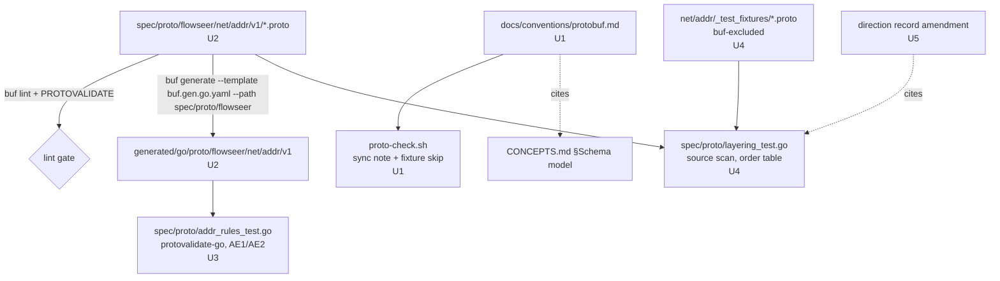

# Protobuf Base Types - Plan

> Implemented. This plan preserves the package names and assumptions used during
> implementation. Later accepted direction superseded several of them: the
> current Device schema is in `api/inventory/v1`, tenancy is ambient even though
> a keyless `TenantRef` now exists, and the package for a future Interface entity
> remains unsettled. Use the accepted architecture records, conventions, and
> current schema tree for present-day decisions.

## Goal Capsule

- **Objective:** Land the first FlowSeer-owned schema slice under `spec/proto/flowseer/`: the address primitives, the entity-foundation conventions every later package assumes (triads, ref pairs, tenancy, provenance), the import-layering test, and the amendment that removes `core/v1` from the accepted network-model direction.
- **Product authority:** `docs/architecture/2026-08-20-network-model-structure-direction.md` fixes the package tree, the primitive/entity split, and protobuf conventions 1–11; this plan adopts it and records only its deltas. `docs/code-style-proto.md` governs every `.proto` file; `docs/code-style.md` governs Go and comments. At planning time, the next slice (`net/phy`, `net/l2`, `net/l3`, `net/interface`, and the then-proposed `device/v1`) was not active scope.
- **Execution profile:** five implementation units, one worktree branch, one commit per unit is fine; generated output lands in the same commit as its schema (R13). No network services, no migrations.
- **Stop conditions:** stop and surface if `buf generate` with the repo's `buf.gen.yaml` cannot emit the owned module without also emitting the TS leg or the Ruckus module in a way `--path` scoping does not prevent; if protovalidate-go rejects any rule at compile time; or if the layering test cannot be made to fail on the AE3 fixture.
- **Tail ownership:** the implementer runs the Verification Contract gates and leaves the branch ready to merge; merging into `master` is the user's step (worktree guard).
- **Open blockers:** none.

---

## Product Contract

### Summary

Write `net/addr/v1` (`Eui48Address`, `Eui64Address`, `MacAddress`, `Oui`, `Ipv4Address`, `Ipv6Address`, `IpAddress`, `Ipv4Prefix`, `Ipv6Prefix`, `IpPrefix`) as the first owned package, fix the entity conventions the direction says must exist before any entity proto is written, add the layering test that keeps imports upward, and amend the direction so `core/v1` no longer exists — every ref lives beside its entity, tenancy is ambient, and provenance rides the response/event envelope.

### Problem Frame

`spec/proto/flowseer/` is empty. The accepted direction sequences `core/v1` plus "the entity conventions document it assumes" as item 1, but `core/v1` as specified contradicts the direction's own primitive/entity line: it holds refs, provenance, and lifecycle — all entity concerns — yet sits *below* `net/addr`, the most primitive package, under a name that says nothing about its contents. The one job it was doing was breaking a `device ↔ inventory` reference cycle, and that cycle only exists if the answering binding is stored on device State rather than carried on the response. Meanwhile `.claude/hooks/proto-check.sh` already enforces `<X>Config/State/Event` and `<X>GlobalRef/LocalRef` families that are defined nowhere in this repository, and the layering test whose fixture directories `buf.yaml` already excludes does not exist. Until these are settled, every subsequent package would invent its own answers.

### Key Decisions

- **No `core/v1`. Every ref lives in the package that owns the entity it refers to.** `net/` stays identity-free. This plan proposed putting `InterfaceRef` with an Interface entity in `device/v1`, never in `net/interface/v1`; that entity and its package have not landed, so current direction leaves the package unsettled. Governs R5, R6, R11. *(session-settled: user-directed — chosen over a shared refs package: a ref beside its triad is what Rule 1's hook checks, and a shared package would know every entity above it.)*
- **Tenancy is ambient.** Tenant comes from the request context for RPC and from the producing integration for events; a global ref carries no tenant. A keyless `TenantRef` later landed as schema vocabulary without changing ambient tenancy. Governs R7. *(session-settled: user-directed — chosen over tenant-in-every-GlobalRef: refs stay small and tenancy cannot drift between auth and payload.)*
- **Provenance rides the envelope, not Device State.** "observed_at + which binding answered" is a property of a live response or an event. This plan used the then-proposed `inventory/v1`, `integration/`, `service/`, and `event/` package names; current Device and Binding schemas are in `api/inventory/v1`, process-local runtime messages are in `service/v1`, and future boundary packages remain unsettled. Governs R8. *(session-settled: user-approved — chosen over `Observation` as a field of `<Entity>State`: rule 3 of the device-service direction describes responses, and stored State would otherwise import inventory.)*
- **`net/addr` imports nothing but protovalidate, and `IpAddress` has no `zone`.** A link-local address is scoped by the interface column of whichever table carries it. Governs R1, R3. *(session-settled: user-approved — chosen over keeping `zone`: adding a field later is cheap, removing one is a `reserved`.)*
- **Everything owned lives under one `flowseer/` superfolder.** Sources at `spec/proto/flowseer/<domain>/v1/`, packages `flowseer.<domain>.v1`, generated output under `generated/go/proto/flowseer/…` and the web tree's mirror. Governs R1, R13. *(session-settled: user-directed.)*
- **Addresses are canonical bytes in structured messages.** Inherited from the direction's convention 3, not re-decided here; the choice is one-way. Governs R2, R3.
- **Variants are typed, and the common type is a `oneof` of them.** Where a primitive has a closed set of variants with different validation — IPv4/IPv6, EUI-48/EUI-64, v4/v6 prefixes — each variant is its own message with its own rules, and the common type (`IpAddress`, `MacAddress`, `IpPrefix`) is a required `oneof` of the variants. A consumer switches on the arm instead of on a byte length, every rule is a plain field rule, and adding a variant is adding an arm. The conventions document records this as the rule for every later primitive. Governs R2, R3, R5. *(session-settled: user-directed — chosen over a single `bytes` payload validated by size: the family becomes a type, not a size check.)*
- **One ref shape for every entity: a `LocalRef`/`GlobalRef` pair.** `LocalRef` is the entity's key within its owning parent; `GlobalRef` is the parent's `GlobalRef` plus the `LocalRef`, and for a top-level entity wraps only the `LocalRef`. An entity has at most one owning parent; entities that relate several others (Binding, Placement) are top-level and carry the related `GlobalRef`s as ordinary fields. Uniform composition means a field added to a `LocalRef` reaches its `GlobalRef` with no second edit, and the hook can check the pair mechanically. Governs R6, R7.
- **The direction record is amended in the same change.** Rule 1 applies to the direction ↔ protos mirror as much as to triads. Governs R14.

### Requirements

**Package layout**

- R1. The first owned package is `spec/proto/flowseer/net/addr/v1/`, package `flowseer.net.addr.v1`, edition 2024, importing only `buf/validate/validate.proto`; one top-level message per file.
- R2. `Eui48Address` holds 6 canonical octets as `bytes` and `Eui64Address` holds 8, each with its own length rule; `MacAddress` is a required `oneof` of the two; `Oui` holds the 3-octet organizationally unique identifier as `bytes`. The payload field of each variant is `required`: the message's own presence expresses optionality, so an address message that is set but empty is invalid.
- R3. `Ipv4Address` holds 4 canonical octets as `bytes` and `Ipv6Address` holds 16, each with its own length rule and no zone; `IpAddress` is a required `oneof` of the two. `Ipv4Prefix` holds an `Ipv4Address` plus a length 0–32 and `Ipv6Prefix` an `Ipv6Address` plus a length 0–128, each bound by a field rule; `IpPrefix` is a required `oneof` of the two. `octets`, `address`, and `length` are `required` inside their messages, as in R2.
- R4. Every singular field in the slice answers "what does absent mean" in its comment, carries no `IMPLICIT` presence, and every constraint expressible in protovalidate is expressed there (`required` where presence is mandatory, because a rule without `required` is skipped on absence).

**Entity foundation conventions**

- R5. A conventions document states, for every entity family, the `<Entity>Config` / `<Entity>State` / `<Entity>Event` triad: what each member holds (intended vs observed vs change), that all three are defined together in the entity's package, and when a family may be deliberately partial. It also states the typed-variant pattern for primitives (per the Key Decision): one message per variant, a required `oneof` for the common type.
- R6. The same document states the `<Entity>LocalRef` / `<Entity>GlobalRef` pair per the ref decision — at most one owning parent per entity, relating entities top-level with related `GlobalRef`s as fields — placed in the entity's own package beside its triad, and that `net/` messages refer to peers by bare key fields (interface `name`), never by a ref.
- R7. Refs carry no tenant field; the document states that tenancy is ambient — the authenticated request context for RPC, the producing integration or binding (per-tenant broker account) for events and ingestion — and never appears inside a ref or an entity message.
- R8. The document states that observation provenance (observed time, answering binding) is one message defined beside `Binding` in `inventory/v1`, embedded by the integration, service-response, and event envelopes, and never stored on an entity's State or on a primitive.
- R9. The document states where enums live: lifecycle and status enums beside the entity or facet that owns them, never in a shared package; zero value `_UNSPECIFIED`, prefixed values, open.
- R10. The document is wired so agents and the hook find it: linked from `AGENTS.md` under Conventions, and named by the message-sync note in `.claude/hooks/proto-check.sh` as "the conventions doc".

**Layering test**

- R11. A Go test under `spec/proto/` fails when any owned package imports a package above it in the order `net/addr ← net/{phy,l2,l3} ← net/interface ← net/protocol/* ← net/wlan ← device ← inventory ← integration ← service ← event`, when any `net/*` package imports `device/` or above, or when any layer package imports a `protocol/*` package.
- R12. The test ships with negative fixtures under `_test_fixtures` directories that `buf.yaml` excludes — this slice adds the excludes for the directories it creates — and judges fixtures by the import path strings in their source, so a fixture may name a package the tree does not yet contain and a violation is proven to fail, not assumed.

**Build and mirror**

- R13. `buf lint`, `buf generate` scoped to the owned module, and `go build ./...` pass on the slice, and the regenerated `generated/` output lands in the same commit as the schema change; the owned module's lint set gains `PROTOVALIDATE` in the same change so CEL rules compile at lint time. First-time generation of `spec/proto/ruckus/` and the web-tree mirror are outside this slice.
- R14. `docs/architecture/2026-08-20-network-model-structure-direction.md` is amended in the same change: `core/v1` removed from the tree, the import order, and the sequencing list under "What this enables, in order" (item 1 becomes the conventions document alone, with `net/addr` landing beside it), refs rehomed per R6, provenance per R8 (its convention 9 reversed), `zone` dropped and the address primitives made typed variants with `oneof` common types (convention 3), and a dated note that records the change and why.

### Acceptance Examples

- AE1. **Covers R2.** Given an `Eui48Address` with 7 octets, when validated, then validation fails; with 6 it passes; an `Eui64Address` with 6 octets fails and with 8 passes; an `Eui48Address` with `octets` unset fails; a `MacAddress` with no arm set fails; a containing message whose `MacAddress` field is unset and not marked `required` fires no rule.
- AE2. **Covers R3.** Given an `Ipv4Prefix` with length 33, when validated, then validation fails; `Ipv6Prefix` with length 129 fails; length 0 on either passes (the default route); an `IpAddress` with no arm set fails; an `Ipv4Address` with 16 octets fails; an `IpPrefix` with no arm set fails.
- AE3. **Covers R11, R12.** Given a fixture file under `spec/proto/flowseer/net/addr/_test_fixtures/` whose source imports a `device/v1` path (a package this slice does not create), when the layering test runs, then it reports that file as violating; the production files under `net/addr/v1` produce no violation, and an empty fixture set fails the fixture pass so the proof cannot silently disappear.
- AE4. **Covers R5, R6.** Given an edit that adds `FooConfig` without `FooState`/`FooEvent`, or `FooLocalRef` without `FooGlobalRef`, when `proto-check.sh` runs, then its sync note names the missing members and points at the conventions document from R10.

### Scope Boundaries

- `net/phy`, `net/l2`, `net/l3`, `net/interface`, and `device/v1` protos — the next slice; this plan only makes them writable. The `vlan_id` predefined rule belongs to `net/l2` and lands there.
- `inventory/`, `integration/`, `service/`, `event/` protos and the envelope message that carries provenance — designed when the first RPC lands; R8 fixes only *where* it goes.
- Hardware ports, the host/client entity family, cross-device VLAN entities — deferred by the direction and unchanged here.
- Any change to the vendored `spec/proto/ruckus/` module.

### Deferred to Follow-Up Work

- Narrowing the hook's triad/ref-pair check to the same directory once the conventions doc fixes "beside the triad" as a rule (today it greps all of `spec/proto`).
- A "deliberately partial family" marker the hook understands, so machine-owned entities without a `Config` do not produce permanent sync notes.
- A `docs/solutions/` learning on the protovalidate presence trap and the triad/ref conventions once the first entity package exercises them.

### Dependencies / Assumptions

- `go.mod` gains a direct `google.golang.org/protobuf` requirement and `buf.build/gen/go/bufbuild/protovalidate/protocolbuffers/go` (imported by the generated Go) with U2, and `buf.build/go/protovalidate` with U3's test.
- Toolchain: buf 1.72.0 and Go 1.26.5 are installed in this checkout; protovalidate-go is fetched by `go mod tidy`. The style guide's compiler and validator claims were reproduced locally on 2026-08-20 and are relied on here.
- `buf.yaml` already excludes `spec/proto/flowseer/api/_test_fixtures` and `spec/proto/flowseer/service/_test_fixtures`; R12 adds `spec/proto/flowseer/net/addr/_test_fixtures`.
- Entity identifiers are FlowSeer-assigned and opaque to the wire model; device correlation by serial + base MAC is a service concern, not a ref field.
- `frontend/web/` does not exist in this checkout; the TS leg of `buf.gen.yaml` is not exercised by this slice (R13).

### Sources

- `docs/architecture/2026-08-20-network-model-structure-direction.md` — package tree (lines 37–59), import order (61–68), convention 3 (298–318), conventions 8–9 (358–367), sequencing (404–409), open questions (431–433).
- `docs/architecture/2026-08-20-device-service-and-inventory-direction.md` — rule 3 (freshness on every live response), rule 5 (presence semantics), sequencing item 1 (entity conventions must exist first).
- `docs/code-style-proto.md` — edition 2024 presence, symbol visibility, protovalidate `required` trap, message-level CEL with stable `id` + consumer-facing `message`, opaque Go API, toolchain floor.
- `docs/code-style.md:269-299` — test conventions (plain `testing`, table tests, `got/want`), merge gate (`golangci-lint run`, `go build`, `go vet`, `go test -race`); `:82-108`, `:304-353` — comment rules that apply to `.proto` files (why-only, no requirement IDs, no TODOs).
- `src/common/snmp/conformance_corpus_test.go:17-38,200-235` — the self-locating `runtime.Caller(0)` + `filepath.WalkDir` source-scan test this repo already uses for guard tests; `src/common/errs/code_test.go` — resolve-by-import-path precedent (identifier spelling was evaded by aliased imports once).
- `.claude/hooks/proto-check.sh` — the triad and ref-pair families it already enforces; exits 2 whenever `buf lint --path` is non-zero, which it is for any excluded or unresolvable fixture path.
- `buf.yaml`, `buf.gen.yaml` — two-module split, `_test_fixtures` excludes, `MINIMAL` lint, `breaking.use: []`, managed-mode Go prefix `go.aledante.io/FlowSeer/generated/go/proto`, `paths=source_relative`.
- `CONCEPTS.md` §Schema model — Primitive, Entity, Triad, Ref Pair, Provenance Envelope; the conventions document cites these rather than restating them.

---

## Planning Contract

**Product Contract preservation:** changed: R2, R3, AE1, AE2 — address primitives became typed variants with `oneof` common types (user-directed during planning; new Key Decision). Otherwise restructured, no scope change — the five "Deferred to Planning" questions are resolved in place as KTD1, KTD5, KTD6, KTD7, KTD2 and the Outstanding Questions section is removed; a Deferred to Follow-Up Work list is added under Scope Boundaries.

### Key Technical Decisions

- KTD1. **Conventions document home: a new `docs/conventions/protobuf.md`.** Linked from `AGENTS.md` under Conventions as a fourth bullet and named by the hook's sync note; it cites `CONCEPTS.md` §Schema model for vocabulary and `docs/code-style-proto.md` for style, adding only the entity rules (R5–R9) and a worked, non-compiled Device/Interface example. Chosen over a section in `docs/code-style-proto.md`: style and model conventions have different change cadences and the hook already names "the conventions doc" as a separate thing. Governs R5–R10. *(session-settled: user-approved — chosen over a section in `code-style-proto.md`: separate doc, separate cadence.)*
- KTD2. **Layering test is a Go source scan at `spec/proto/layering_test.go`, package `proto_test`.** It locates itself with `runtime.Caller(0)`, walks `spec/proto/flowseer/`, reads each `.proto`, strips `//` and `/* */` comments, extracts `import "…"` paths, maps both the importing file's directory and each imported path to a layer index from a table in the test, and fails on any import whose layer is higher than the importer's, any `net/*` → `device/`-or-above import, or any layer package → `protocol/*` import. Files under a `_test_fixtures` directory are expected to fail and the test asserts that each fixture produces at least one violation (the AE3 proof). The order table is the single declaration of the layering; the direction record cites it. Chosen over compiling descriptors: fixtures are buf-excluded and may import packages that do not exist yet (R12). Governs R11, R12.
- KTD3. **`proto-check.sh` skips its lint leg for any path containing `/_test_fixtures/`** (format still runs, the sync leg still runs) and its sync note names `docs/conventions/protobuf.md`. Chosen over creating fixtures only via shell: `buf lint --path` on an excluded or unresolvable fixture exits non-zero and the hook turns that into a block on every Write; the hook is already being edited for R10. Governs R10, R12. *(session-settled: user-approved — chosen over shell-only fixture creation.)*
- KTD4. **AE1/AE2 are proven by a Go test, `spec/proto/addr_rules_test.go`, against the generated code with protovalidate-go.** Table-driven cases build messages with the opaque-API builders, run `protovalidate.Validate`, and assert pass/fail plus the CEL `id` on failure; one case round-trips `MacAddress`/`IpAddress` bytes through `net.HardwareAddr` and `netip.AddrFromSlice` to exercise the bytes choice once. Chosen over lint alone: `buf lint` compiles rules but never runs them. Governs R2, R3, R4. *(session-settled: user-approved — chosen over lint-only proof.)*
- KTD5. **Entity identifiers are UUID strings.** A top-level `LocalRef` holds `string id` validated with `(buf.validate.field).string.uuid = true` and `required`; the conventions document records this now, no entity proto is written in this slice. Governs R6. *(session-settled: user-approved — chosen over an unspecified opaque id.)*
- KTD6. **`Oui` is its own message.** Discovery's OUI prefilter and vendor lookups hold OUIs without a full MAC, so a 3-byte `Oui{bytes octets}` with `bytes.len = 3` is the shared shape; a derived view of `MacAddress` would force consumers to carry three dummy bytes. Governs R2.
- KTD7. **Generation is scoped and committed.** `buf generate --template buf.gen.go.yaml --path spec/proto/flowseer` emits only the owned module's Go output; `buf.gen.go.yaml` carries the same `managed:` block as `buf.gen.yaml` and only the `protocolbuffers/go` and `connectrpc/go` plugins, because buf creates a missing `out` directory and a scoped run with the full template would otherwise write the TS leg (and the transitive `buf/validate/validate_pb.ts`) under `frontend/web/generated/proto/`, which does not exist in this checkout. `generated/go/proto/flowseer/net/addr/v1/*.pb.go` is committed with the schema. `.claude/hooks/protect-generated.sh` denies Edit/Write under `generated/`, so generation runs through the shell, never the editor tools. `buf.yaml`'s owned module gains `PROTOVALIDATE` next to `MINIMAL`. Governs R13.
- KTD8. **Amendment form for the direction record.** Edit the affected passages in place (tree, import order, convention 3's `zone`, conventions 8–9, sequencing items 1–2, the IPv6-zone open question), bump `updated:` to the amendment date, and add an `## Amendments` section at the end with one dated entry naming what changed and why, citing this plan by repo-relative path. No strikethrough, no second copy of the tree. Governs R14.
- KTD9. **Proto shapes (directional, one message per file).** Variants: `Eui48Address{bytes octets = 1}` (`required`, `bytes.len = 6`), `Eui64Address{bytes octets = 1}` (`required`, `bytes.len = 8`), `Oui{bytes octets = 1}` (`required`, `bytes.len = 3`), `Ipv4Address{bytes octets = 1}` (`required`, `bytes.len = 4`), `Ipv6Address{bytes octets = 1}` (`required`, `bytes.len = 16`), `Ipv4Prefix{Ipv4Address address = 1; uint32 length = 2}` (both `required`, `uint32.lte = 32`), `Ipv6Prefix{Ipv6Address address = 1; uint32 length = 2}` (both `required`, `uint32.lte = 128`). Common types: `MacAddress{oneof kind { Eui48Address eui48 = 1; Eui64Address eui64 = 2; } }`, `IpAddress{oneof family { Ipv4Address v4 = 1; Ipv6Address v6 = 2; } }`, `IpPrefix{oneof family { Ipv4Prefix v4 = 1; Ipv6Prefix v6 = 2; } }`, each with `(buf.validate.oneof).required = true`. No message-level CEL is needed in this package. Every field comment states units, encoding, and what absent means (R4). Governs R1–R4.

### High-Level Technical Design

The slice is four artifacts and three gates. Source-of-truth flows downward; nothing below edits anything above.

Layering order enforced by U4 (index ascending; an import may only point to an equal or lower index):

| Index | Package prefix under `flowseer/` |
|---|---|
| 0 | `net/addr` |
| 1 | `net/phy`, `net/l2`, `net/l3` |
| 2 | `net/interface` |
| 3 | `net/protocol/*` |
| 4 | `net/wlan` |
| 5 | `device` |
| 6 | `inventory` |
| 7 | `integration` |
| 8 | `service` |
| 9 | `event` |

Plus two cross-cuts: `net/*` never imports index ≥ 5; indices 0–2 never import `net/protocol/*`. Imports outside `flowseer/` (`buf/validate/…`, `google/protobuf/…`) are ignored by the test.

### Assumptions

- `buf generate --path` honours the managed-mode `go_package_prefix` override the same way an unscoped run does (verified in a scratch replica by research; re-verify on the first real run).
- buf creates a missing `out` directory, so a scoped `buf generate` with the full `buf.gen.yaml` emits the TS leg under `frontend/web/generated/proto/` (verified on buf 1.72.0 with the repo's plugin set); this slice generates with `buf.gen.go.yaml` (KTD7) and the web mirror stays out of scope (R13).
- `golangci-lint`'s revive `package-comments` rule applies to the new test-only package under `spec/proto`; the test file carries a package doc comment.

### Sequencing

U1 and U2 are independent. U3 depends on U2 (generated code). U4 depends on U1 (hook skip, so fixtures can be written with the editor tools) and benefits from U2 (the `net/addr` directory exists). U5 depends on all four conceptually (it records the final shape) and lands last.

---

## Implementation Units

### U1. Entity conventions document, AGENTS.md link, hook wiring

- **Goal:** The entity-foundation conventions exist as a document agents and the hook can find, and the hook no longer blocks fixture files.
- **Requirements:** R5, R6, R7, R8, R9, R10; AE4. Implements the product Key Decisions "No `core/v1`", "Tenancy is ambient", "Provenance rides the envelope", "One ref shape" (Governs R5–R8) and KTD1, KTD3, KTD5.
- **Dependencies:** none.
- **Files:** create `docs/conventions/protobuf.md`; modify `AGENTS.md` (Conventions list), `.claude/hooks/proto-check.sh`, `CONCEPTS.md` (one cross-reference line under §Schema model pointing at the conventions doc).
- **Approach:**
  1. Write `docs/conventions/protobuf.md` with frontmatter `name:`/`last_updated:` like `docs/code-style-proto.md`; sections: scope (cites `CONCEPTS.md` §Schema model and `docs/code-style-proto.md`), Triad (R5, including the "deliberately partial" rule: state the omission in the entity's package doc comment), Ref pair (R6 + KTD5 id format, nested-`GlobalRef` composition, relating entities top-level), Tenancy (R7), Provenance (R8), Enums (R9), Typed variants (the Key Decision: one message per variant, required `oneof` for the common type, `net/addr` as the worked instance), Field numbering (1–15 for hot fields, arms/facets in blocks, `reserved` on removal — cite the direction's convention 10), and a worked non-compiled example: `Device` with nested `Interface` showing the triad, `DeviceLocalRef`/`DeviceGlobalRef`, `InterfaceLocalRef`/`InterfaceGlobalRef` composition.
  2. Add the AGENTS.md Conventions bullet after the proto style bullet.
  3. In `proto-check.sh`: skip the `buf lint` leg when `$rel` matches `*/_test_fixtures/*` (keep format and sync legs); change the sync note text to name `docs/conventions/protobuf.md` explicitly.
- **Patterns to follow:** `docs/code-style-proto.md` (frontmatter, tone, "verified locally" claims only when actually verified); `docs/code-style.md` comment rules for the example snippets (why-only, no requirement IDs in code).
- **Test scenarios:**
  - Covers AE4. Pipe a PostToolUse JSON for a lint-clean scratch file `spec/proto/flowseer/scratch/v1/foo.proto` (`edition = "2024"; package flowseer.scratch.v1;` plus `message FooConfig {}`) into `proto-check.sh`; the `additionalContext` names `FooState`, `FooEvent` and `docs/conventions/protobuf.md`. The note is emitted only when the lint leg passes, so the scratch file must lint clean. Remove the scratch directory afterwards.
  - Same with `message FooLocalRef {}` → note names `FooGlobalRef`.
  - A path under `spec/proto/flowseer/net/addr/_test_fixtures/` exits 0 without running lint (no "no .proto files were targeted" block).
  - A non-fixture path with a lint error still exits 2.
- **Verification:** the three hook invocations behave as above; `AGENTS.md` links resolve; the conventions doc contains no implementation narration and no `TODO`.

### U2. `net/addr/v1` protos, lint rule, generation, Go module deps

- **Goal:** The ten address messages exist, lint clean with `PROTOVALIDATE`, generate to the opaque Go API, and `go build ./...` passes.
- **Requirements:** R1, R2, R3, R4, R13; KTD6, KTD7, KTD9; product Key Decisions "`net/addr` imports nothing… no `zone`", "Addresses are canonical bytes", "Variants are typed, and the common type is a `oneof` of them", "`flowseer/` superfolder" (Governs R1–R3, R13).
- **Dependencies:** none.
- **Files:** create `spec/proto/flowseer/net/addr/v1/eui48_address.proto`, `eui64_address.proto`, `mac_address.proto`, `oui.proto`, `ipv4_address.proto`, `ipv6_address.proto`, `ip_address.proto`, `ipv4_prefix.proto`, `ipv6_prefix.proto`, `ip_prefix.proto`, `buf.gen.go.yaml`; modify `buf.yaml` (owned module `lint.use` += `PROTOVALIDATE`), `go.mod`, `go.sum`; generated via shell: `generated/go/proto/flowseer/net/addr/v1/*.pb.go`.
- **Approach:**
  1. Write the ten files per KTD9: `edition = "2024"; package flowseer.net.addr.v1; import "buf/validate/validate.proto";`, one message each, no file-level feature overrides, no `local`.
  2. Every field comment: units/encoding, valid range the rule does not already say, and what absent means — for these payload fields "absent is invalid; omit the containing field instead" (R4).
  3. `buf lint` must pass with `PROTOVALIDATE` enabled (compiles the CEL).
  4. Write `buf.gen.go.yaml` (KTD7) and run `buf generate --template buf.gen.go.yaml --path spec/proto/flowseer`; then `go mod tidy` to add `google.golang.org/protobuf` (direct) and the BSR protovalidate Go module the generated code imports. `buf.build/go/protovalidate` is added in U3, where the first import of it lives.
  5. `go build ./...` and `go vet ./...` pass with the generated package present.
- **Execution note:** the proto-check hook runs `buf format -w` and `buf lint` on every save; fix lint before moving on rather than at the end.
- **Patterns to follow:** file header and comment contract in `docs/code-style-proto.md`; the direction record's convention 3 sketch for field shapes; `spec/proto/ruckus/` only as an example of edition 2024 file layout, never of conventions.
- **Test scenarios:** `Test expectation: none in this unit` — behavioural proof lives in U3 (AE1/AE2); this unit is proven by the gates below.
- **Verification:** `buf lint` exits 0 on the owned module with `PROTOVALIDATE` active; `buf generate --template buf.gen.go.yaml --path spec/proto/flowseer` writes exactly the ten `.pb.go` files under `generated/go/proto/flowseer/net/addr/v1/` with `protogen:"opaque.v1"`; `go build ./...` and `go vet ./...` pass; `git status` shows no output under `generated/go/proto/ruckus` or `frontend/`.

### U3. Address rule tests

- **Goal:** AE1 and AE2 are proven against the generated code, and the bytes shape is exercised once through Go's address types.
- **Requirements:** R2, R3, R4; AE1, AE2; KTD4.
- **Dependencies:** U2.
- **Files:** create `spec/proto/addr_rules_test.go` (package `proto_test`, package doc comment explaining why a test-only package lives under `spec/proto`).
- **Approach:**
  1. Import `buf.build/go/protovalidate` and run `go mod tidy` (adds it as a direct requirement). Build messages with `addrv1.MacAddress_builder{…}.Build()` etc. (opaque API); run `protovalidate.Validate`; table-driven cases with `got/want` assertions on pass/fail and, on failure, on the violation's rule/CEL id.
  2. The "wrapper with an unset `MacAddress` field" case has no production message to use: build a one-message file descriptor at runtime with `descriptorpb` + `protodesc.NewFile` (depending on the generated `addrv1` file descriptor) declaring one non-required `MacAddress` field, instantiate it with `dynamicpb.NewMessage`, and validate that.
  3. Round-trip cases: `Eui48Address` octets → `net.HardwareAddr` → string → back; `Ipv4Address`/`Ipv6Address` octets → `netip.AddrFrom4`/`AddrFrom16` → `As4()`/`As16()` equal; `Ipv4Prefix` → `netip.PrefixFrom` → back.
- **Execution note:** write the failing cases first (7-octet MAC, length 33 on IPv4) so the `required` + CEL rules are seen to fire before the passing cases are added.
- **Patterns to follow:** `src/common/errs/errs_test.go` table shape; `docs/code-style.md:269-279` (`t.Run`, `got/want`, `t.Helper()`).
- **Test scenarios:**
  - Covers AE1. `Eui48Address` with 7 octets → invalid (`bytes.len`); 6 → valid; `Eui64Address` with 6 → invalid, 8 → valid; `Eui48Address` built with no octets → invalid (`required`); `MacAddress` with no arm → invalid (oneof required), with either arm → valid, `WhichKind()` reports it; the runtime-built wrapper with its `MacAddress` field unset → valid.
  - `Oui` with 2 and 4 octets → invalid; 3 → valid.
  - `Ipv4Address` with 5 or 16 octets → invalid; 4 → valid. `Ipv6Address` with 4 octets → invalid; 16 → valid. `IpAddress` with no arm → invalid (oneof required); with `v4` or `v6` set → valid; `WhichFamily()` reports the arm.
  - Covers AE2. `Ipv4Prefix{length 33}` → invalid (`uint32.lte`); `Ipv6Prefix{length 129}` → invalid; length 0 on both → valid; `Ipv4Prefix{32}` and `Ipv6Prefix{128}` → valid; a prefix with `length` unset or `address` unset → invalid (`required`); `IpPrefix` with no arm → invalid.
  - Round-trip: `Eui48Address` ↔ `net.HardwareAddr`; `Ipv4Address`/`Ipv6Address` ↔ `netip.Addr` (`AddrFrom4`/`AddrFrom16`) equal after the trip, and the `IpAddress` arm matches `netip.Addr.Is4()`; `Ipv4Prefix` ↔ `netip.Prefix`.
- **Verification:** `go test -race ./spec/proto/...` passes; removing the `required` option from `octets` in `eui48_address.proto` (locally, then reverted) makes the "no octets" case fail — the test is proven to exercise the rule.

### U4. Layering test and fixtures

- **Goal:** The import-layering rule is enforced by a test that is proven to fail on a violating fixture.
- **Requirements:** R11, R12; AE3; KTD2; product Key Decision "No `core/v1`" (Governs R11).
- **Dependencies:** U1 (hook fixture skip); U2 (directory exists — soft).
- **Files:** create `spec/proto/layering_test.go`, `spec/proto/flowseer/net/addr/_test_fixtures/imports_device.proto`; modify `buf.yaml` (owned module `excludes` += `spec/proto/flowseer/net/addr/_test_fixtures`).
- **Approach:**
  1. Order table as in High-Level Technical Design, declared once in the test as a slice of `{index, prefixes}`; a helper maps a path under `spec/proto/flowseer/` to its index (longest-prefix match; unknown package → test failure naming the file, so a new package must be placed in the table before it compiles).
  2. Walk with `runtime.Caller(0)` + `filepath.WalkDir`; parse imports by stripping comments and matching `import "…";` statements (including `import option`), ignoring non-`flowseer/` imports.
  3. Two passes: production files must have zero violations; every `_test_fixtures` file must have at least one, and the failure message lists file, import, and the rule broken.
  4. Fixture `imports_device.proto`: edition 2024, package `flowseer.net.addr.v1` (matches its directory), imports `flowseer/device/v1/device.proto` and declares one message using nothing from it — the import path alone is the violation.
- **Patterns to follow:** `src/common/snmp/conformance_corpus_test.go:200-235` (self-locating walk); `src/common/errs/code_test.go` (resolve by path, not by identifier spelling).
- **Test scenarios:**
  - Covers AE3. With the fixture present the fixture pass reports it as violating and the suite passes; delete the fixture locally and the fixture pass fails with "no fixtures found" (proves the proof); restore.
  - Production pass: the ten `net/addr/v1` files produce zero violations.
  - A temporary production file under `net/addr/v1` importing `flowseer/net/l2/v1/vlan.proto` → violation (higher index); under a scratch `net/l2/v1` importing `flowseer/net/protocol/lldp/v1/x.proto` → violation (layer → protocol); under scratch `net/wlan/v1` importing `flowseer/device/v1/x.proto` → violation (`net/*` → device). Remove scratch files after.
  - A file importing only `buf/validate/validate.proto` → no violation.
  - A file in an unknown package directory → test fails naming the path.
- **Verification:** `go test -race ./spec/proto/...` passes; `buf lint` still passes (fixture excluded); the hook does not block when the fixture is saved.

### U5. Direction record amendment

- **Goal:** The accepted direction describes the shape that now exists: no `core/v1`, refs beside entities, provenance on the envelope, no `zone`, layering enforced by the test.
- **Requirements:** R14; product Key Decision "The direction record is amended in the same change"; KTD8.
- **Dependencies:** U1–U4 (records their final shape).
- **Files:** modify `docs/architecture/2026-08-20-network-model-structure-direction.md`.
- **Approach:**
  1. Tree: delete the `core/v1` lines; note `docs/conventions/protobuf.md` as the conventions home.
  2. Import order: `net/addr ← net/{phy,l2,l3} ← …` with "`net/addr` imports nothing but protovalidate"; cite `spec/proto/layering_test.go` as the enforcer.
  3. Convention 3: drop `string zone`, explain the interface-column scoping, and replace the `MacAddress{bytes octets}` / `IpAddress{bytes octets}` / `IpPrefix{address, length}` sketches (and the `size() == 6 || size() == 8` and family-bound CEL notes) with the typed-variant shapes per KTD9; convention 8: refs live in the entity's package; convention 9: provenance rides the envelope (inventory-defined message), not State.
  4. Sequencing: item 1 = conventions document (`docs/conventions/protobuf.md`) with `net/addr` landing beside it; item 2 loses `core/v1`.
  5. Open questions: remove "IPv6 zones".
  6. `updated: 2026-08-21`; append `## Amendments` with one dated entry (what changed, why, link to this plan).
- **Patterns to follow:** the record's own prose style; prior in-place amendments `fdbb768`, `ef3da65` (sections added in place, `updated:` kept current).
- **Test scenarios:** `Test expectation: none -- documentation change`; reviewed by reading.
- **Verification:** `grep -n core/v1` on the record returns only the Amendments entry; the import order, convention 3/8/9 text, and sequencing match R14; `CONCEPTS.md`, `docs/conventions/protobuf.md`, and the record agree on Triad, Ref Pair, Provenance Envelope wording.

---

## Verification Contract

| Gate | Command | Applies to | Done signal |
|---|---|---|---|
| Proto lint | `buf lint` | U2, U4 | exit 0 with `PROTOVALIDATE` active on the owned module |
| Generation | `buf generate --template buf.gen.go.yaml --path spec/proto/flowseer` | U2 | only `generated/go/proto/flowseer/net/addr/v1/*.pb.go` change; nothing under `frontend/` |
| Go build/vet | `go build ./... && go vet ./...` | U2, U3, U4 | exit 0 |
| Go tests | `go test -race ./...` | U3, U4 | pass, including `spec/proto` |
| Lint | `golangci-lint run` | U3, U4 | clean |
| Hook | `proto-check.sh` fed the AE4 JSON cases | U1 | notes and exit codes as in U1 scenarios |
| Drift | `buf generate --template buf.gen.go.yaml --path spec/proto/flowseer && git status --porcelain generated/` | U2 | empty |

---

## Definition of Done

- All five units landed on the worktree branch; every gate above green.
- `spec/proto/flowseer/net/addr/v1/` has ten files, each one message, edition 2024, protovalidate rules per KTD9, every field commented per R4.
- `docs/conventions/protobuf.md` exists, is linked from `AGENTS.md`, and is named by the hook's sync note (R10).
- `spec/proto/layering_test.go` reports the AE3 fixture as violating and passes on production files; `spec/proto/addr_rules_test.go` covers AE1/AE2.
- The direction record carries the amendment (R14) and its `updated:` date.
- `go.mod` lists `buf.build/go/protovalidate` and `google.golang.org/protobuf` as direct requirements; `generated/` contains no Ruckus or TS output from this slice.
- No scratch files, no leftover fixtures beyond `imports_device.proto`, no `TODO`s or requirement IDs in `.proto` or `.go` comments.
