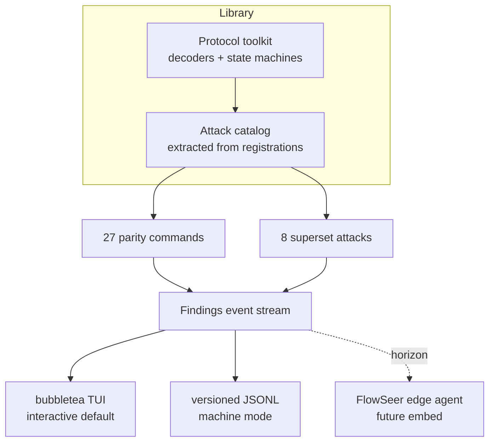
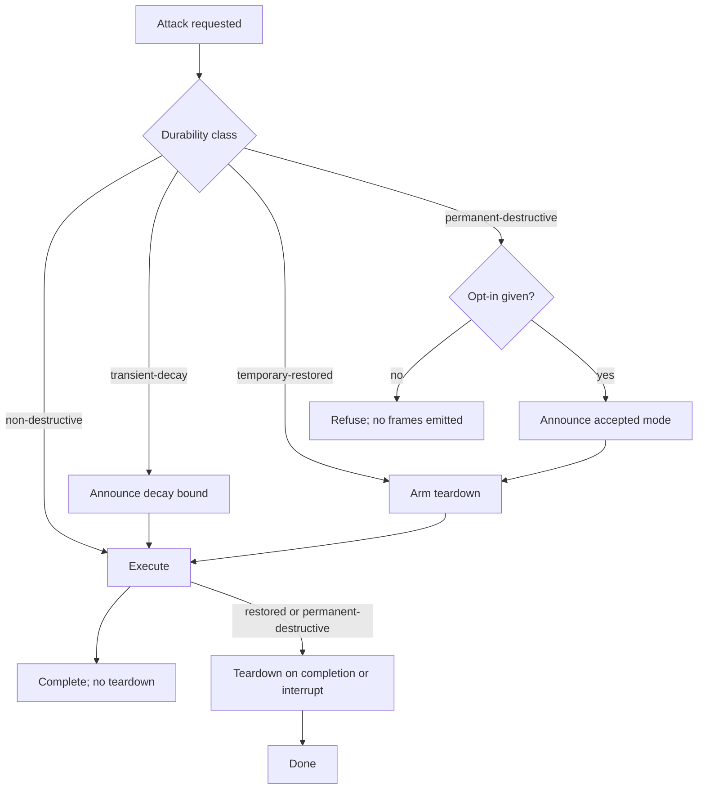
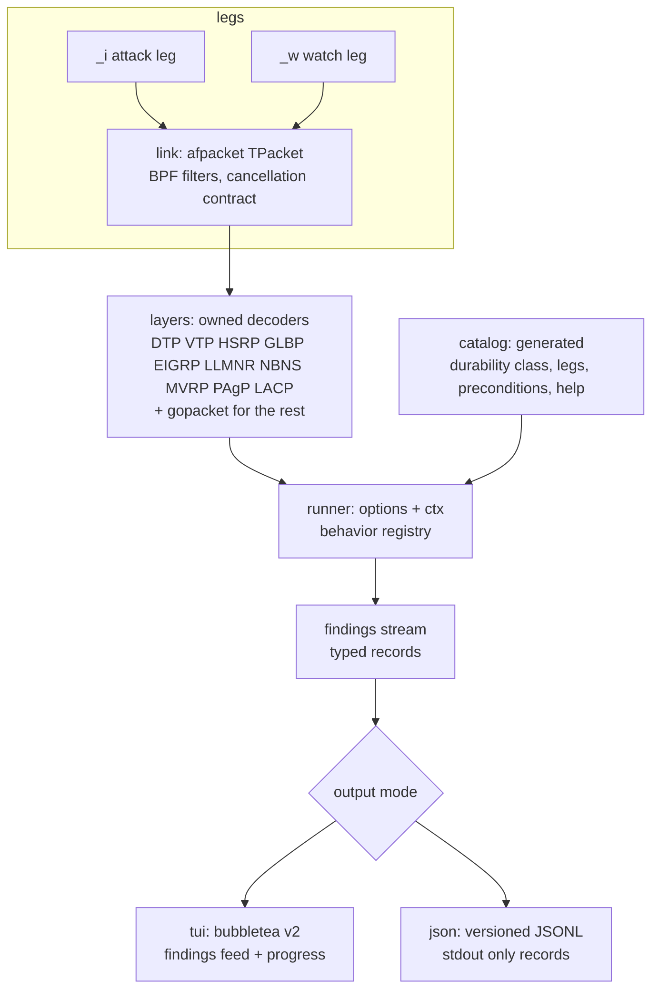
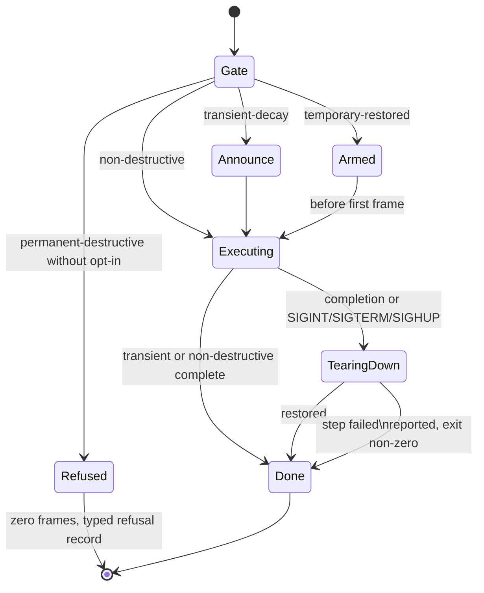
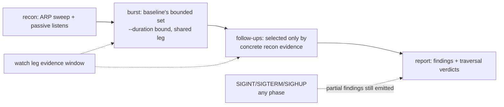

# netpen - Plan

> Implementation landed; live validation outstanding. Netpen now lives under
> `src/edge/netpen`, and dependency checks live under
> `test/conformance/dependencies`. The T1/T2 acceptance evidence remains open in
> `src/edge/netpen/test/integration/VALIDATION_MATRIX.md`, so this plan is not
> marked implemented.

## Goal Capsule

- **Objective:** Replace the Python `l2l3-audit` tool with netpen, a self-contained native Go L2/L3 security audit and attack binary built library-first: a protocol toolkit as the core, the full 27-command arsenal plus eight researched attacks as behaviors over it, a bubbletea v2 TUI, a versioned JSON machine contract, and a static-binary release with an embedded attack catalog.
- **Product authority:** Session decisions from the operator/user (Product Contract below), plus the scoping synthesis confirmed 2026-08-23: four-class durability taxonomy, parity-plus-one dtp deviation, unconditional full burst, quarantined `src/netpen` module placement.
- **Execution profile:** Deep plan, 13 implementation units in dependency order. Port fidelity is characterization-first: the Python tool is the fixture factory until parity is caught, then it retires.
- **Stop conditions:** a finding that a settled decision is infeasible (e.g. a protocol cannot be driven over pure-Go AF_PACKET), or a behavior that cannot be lab-validated and cannot be pinned by differential fixture — both route back as blockers, not guesses.
- **Open blockers:** None.
- **Product Contract preservation:** restructured, no scope change — R2 deviated (a named watch leg that does not exist fails fast for every command, where the baseline degraded silently), R3 concretized (burst = unconditional core plus recon/flag-armed workers; follow-ups exclusively recon-gated), R13/R14/R15 instantiated as a four-class durability taxonomy confirmed in the scoping synthesis. All R/A/F/AE IDs and meanings preserved.

---

## Product Contract

### Summary

netpen is a static Go security audit binary that fully replaces the scapy-based `l2l3-audit`. Its protocol layer is a reusable Go L2/L3 toolkit — decoders and state machines for the territory no Go tool covers today — with every audit command expressed as a thin behavior over it. It runs interactively with a bubbletea TUI or headlessly with a versioned JSON contract.

### Problem Frame

`l2l3-audit` (repo root, 3,281 lines, 27 subcommands) is a proven lab audit tool, but it costs its operator in four compounding ways: target lab boxes often lack Python or PyPI access, so the uv+scapy bootstrap fails exactly where air-gapped work happens; scapy's throughput and process model cap the packet rates flooding and scanning want; Python-era defects and drift ride along with every fix; and there is no release surface for cross-compiled, versioned binaries. Maintaining a Go network platform while keeping an audit tool in Python is a dual-language tax the project no longer wants. Boundedly beyond today: the audit capability may later live inside a FlowSeer edge agent, which only works if the audit engine already exists as Go library code rather than a binary.

### Key Decisions

- **Toolkit-first architecture.** The protocol layer is the core deliverable; attacks are behaviors over it. (session-settled: user-directed — chosen over a catalog-driven straight port: the embedding horizon and the correctness reset dominate speed-to-parity.) Governs R6, R7, R8.
- **Standalone in this repo.** netpen is an operator-run tool living beside FlowSeer; no findings flow to a backend. (session-settled: user-directed — chosen over born as a FlowSeer edge component: agent integration is a future horizon, not release scope.)
- **bubbletea for the TUI.** Chosen over tview and plain terminal output: it is the standard elm-architecture Go TUI for a live findings feed. The one directive challenge found no better fit. Governs R11.
- **Durability-based safety gating.** Attacks split temporary-destructive from permanent-destructive, with different duties for each; the temporary side subdivides into restored and decay classes as instantiated in the Planning Contract. (session-settled: user-directed — chosen over docs-only warnings and a global lab-envelope check: the user wants the permanent/temporary distinction enforced in the binary.) Governs R13, R14, R15.
- **Superset from day one.** Full parity plus all eight researched attacks in the same release. (session-settled: user-directed — chosen over parity-for-the-proven-subset: the port is also the behavior reset.) Governs R4, R5.
- **Embedded attack-data layer.** Attack metadata lives as data inside the binary, externalizable later. (session-settled: user-directed — chosen over flags-only binary and over external config files: keeps the self-contained contract while making the catalog treated as data, and it is extracted from behavior registrations so it cannot drift from code.) Governs R9.
- **No Python dual-language.** l2l3-audit is replaced, not coexisted with; the legacy tool may retire once netpen reaches parity. Governs R1.
- **JSON and TUI are alternative output modes.** Each run picks one; the machine contract and the interactive surface never mix on one run. Governs R11, R12.
- **Linux is the only guaranteed attack platform.** A static binary cannot link libpcap, and pure-Go AF_PACKET is Linux-only; non-Linux builds are convenience, never release gates. Governs R10, R17.
- **Machine-contract conventions are adopted, not invented.** JSONL with per-module typed schemas and an Options-struct-plus-callback library surface follow naabu and zgrab2 field conventions rather than a bespoke format. Governs R7, R12.

### Actors

- A1. **Lab operator** — runs netpen as root on an isolated segment, on a jump box that may be air-gapped. Consumes the TUI.
- A2. **Automation consumer** — pipes JSON mode into jq, CI, or lab-regression tooling; depends on the versioned schema contract.
- A3. **Future FlowSeer edge agent** (horizon only) — would embed the toolkit library; a consumer the library shape prepares for, without any integration work in this release.

### Requirements

**Parity port**

- R1. Every `l2l3-audit` subcommand exists in netpen with equivalent behavior, flags, and names: `full`, `scan`, `arpsweep`, `arpspoof`, `stproot`, `camflood`, `dhcpstarve`, `roguedhcp`, IPv6 first-hop commands (`roguedhcp6`, `roguera`, `ndpspoof`, `daddos`, `raguard`), `dtp`, `doubletag`, `vlanenum`, `vlanhop`, `voicevlan`, `portsteal`, `ghost`, `vtp`, `mvrp`, `hsrp`, `icmpredirect`, `gratarp`, `llmnr`, `vrrp` — the verified 27.
- R2. The two-leg interface model carries over verbatim: `-i` designates the attack leg (default eth0), `-w` the optional watch leg; commands that need traversal evidence (`scan`, `full`) use the watch leg when present, and `ghost` fails fast with a named reason when it is absent. A named watch leg that does not exist fails fast for every command — a silent single-leg run produces "pending" verdicts indistinguishable from "resisted".
- R3. `full` retains evidence-gated orchestration: recon first, then the baseline's bounded attack burst — an unconditional core (stproot, camflood, dhcpstarve, gratarp, dtp, rogue-RA, llmnr) that always fires, plus workers armed by recon or flags (daddos on `ra6` evidence, arpspoof on resolved MACs and no `--no-spoof`, vrrp on detected vrids) — then follow-up attacks selected only by recon evidence: no blind attack sequences in follow-up selection.
- R4. Eight attack capabilities beyond the baseline ship in the same release: OSPF injection, EIGRP injection, rogue WPAD proxy, EtherChannel attack (LACP/PAgP), MLD abuse, an RA-flood variant, generic LLDP spoofing, and GLBP hijack.
- R5. Each added attack is validated against a known-good lab target with reproducible findings, not merely implemented.

**Toolkit and library**

- R6. Protocol decoders and state machines for the attacks' full surface — CDP, DTP, STP/RSTP, 802.1Q, VTP, MVRP, LLDP, LACP/PAgP, HSRP, VRRP, GLBP, OSPFv2, EIGRP, DHCP/DHCPv6, ARP, ICMP, ND, MLD, LLMNR/NBT-NS/mDNS, WPAD — exist as library code independently usable without the CLI; every attack is a thin behavior over this layer.
- R7. The library's consumption surface is an options-struct plus an event callback delivering findings as a typed stream, so hosts (the CLI today, the edge agent horizon later) embed logic, never UI code.
- R8. The toolkit implements only protocols that at least one ported or added attack requires; nothing ships speculatively.
- R9. The attack catalog is extracted from behavior registrations and embedded in the binary as data; each entry carries protocols, preconditions, legs required, and durability class, and it is the single source for dispatch, help text, and safety gating.
- R10. Packet crafting and capture use pure-Go raw sockets (AF_PACKET on Linux); the supported build links no cgo and no libpcap.

**Outputs**

- R11. Interactive runs default to a bubbletea TUI rendering a live findings feed with per-attack progress as the suite runs.
- R12. A JSON mode replaces the TUI for the run and emits per-module typed JSONL records whose schema is versioned and stable within a major version, so automation can build on it without churn.
- R13. Every (attack, mode) pair is classified into the four durability classes — non-destructive, transient-decay, temporary-restored, permanent-destructive — and the classification lives in the catalog and gates dispatch.
- R14. Temporary-restored attacks execute only when a teardown/restore path is armed that runs on normal completion and on interrupt, leaving device and neighbor state as found; the restore is step-isolated so one failing step cannot abandon later ones, and partial failure is reported with a non-zero exit. Transient-decay attacks have no restore — instead the catalog records the decay bound, announced at run start.
- R15. Permanent-destructive (attack, mode) pairs (state that outlives the run, e.g. the VLAN-database wipe class) require an explicit per-run opt-in acknowledgment naming each permanent mode; without it the run refuses and emits nothing on the wire. `full` never dispatches a permanent mode regardless of acknowledgments.

**Distribution**

- R16. netpen ships as a single static binary with no runtime dependencies, no config files, and no Python anywhere in the workflow — install and run work on an air-gapped host with flags plus embedded data only.
- R17. Release targets are linux/amd64 and linux/arm64; a macOS build may exist for development convenience but attack-leg functionality off Linux is never a release gate.

### Key Flows

- F1. Full audit run
  - **Trigger:** operator runs `netpen full` on an attack leg, optionally with a watch leg.
  - **Actors:** A1
  - **Steps:** recon phase probes the segment; the attack burst fires with the baseline's worker composition (per R3); follow-up attacks are selected only by recon evidence; the watch leg gathers traversal evidence as attacks fire; an interrupted run still emits whatever findings completed.
  - **Outcome:** a complete audit: findings rendered live, every record durable in the chosen output mode.
  - **Covers:** R1, R2, R3, R11, R12
- F2. Destructive attack lifecycle
  - **Trigger:** operator targets a destruction-capable attack.
  - **Actors:** A1
  - **Steps:** the catalog's durability class is consulted; permanent-destructive without opt-in refuses; temporary-restored arms its teardown before the first frame and runs it on completion or interrupt; transient-decay announces its decay bound and needs no teardown.
  - **Outcome:** the network is left as found unless the operator explicitly accepted otherwise.
  - **Covers:** R13, R14, R15
- F3. Machine-mode run
  - **Trigger:** the run requests JSON output, or stdout is not a tty without a mode selected.
  - **Actors:** A2
  - **Steps:** the TUI is suppressed; each module's typed findings emit as JSONL records; the schema version accompanies every record.
  - **Outcome:** pipeline-ready output a consumer can depend on within a major version.
  - **Covers:** R12
- F4. Watch-leg traversal evidence
  - **Trigger:** `scan`, `full`, or `ghost` runs with a watch leg attached.
  - **Actors:** A1
  - **Steps:** the watch leg observes frames crossing the fabric produced by attack-leg activity; `ghost` refuses to start without it, and any named-but-absent leg fails fast.
  - **Outcome:** traversal evidence attributable to the attack leg, or a named fast failure.
  - **Covers:** R2

### Acceptance Examples

- AE1. Permanent-destructive without opt-in
  - **Covers:** R15
  - **Given** an operator invokes a permanent-destructive attack without its acknowledgment flag
  - **When** netpen starts the run
  - **Then** it refuses, naming the attack and the required opt-in, and emits zero frames; the refusal surfaces as a typed record in the run's output mode.
- AE2. Interrupt during a temporary-restored attack
  - **Covers:** R14
  - **Given** `arpspoof` is actively poisoning neighbor caches
  - **When** the operator sends Ctrl-C
  - **Then** the restore path completes before the process exits, leaving caches as found; a step that cannot complete is reported by name with a non-zero exit.
- AE3. Ghost without a watch leg
  - **Covers:** R2
  - **Given** `netpen ghost` is invoked without `-w`
  - **When** arguments are validated
  - **Then** netpen fails fast naming the watch-leg requirement before any frame is sent.
- AE4. JSON-mode output hygiene
  - **Covers:** R12
  - **Given** a run in JSON mode
  - **When** findings are produced
  - **Then** stdout holds parseable JSONL records carrying the schema version, and no TUI drawing bytes appear.
- AE5. Air-gapped drop-in
  - **Covers:** R16
  - **Given** a lab host with no Python runtime, no package manager, and no network
  - **When** the operator copies the single binary over and runs `netpen full`
  - **Then** the suite runs to completion against the default `-i eth0` attack leg.
- AE6. Validated superset attack
  - **Covers:** R5
  - **Given** the OSPF injection attack against the known-good lab target
  - **When** it runs twice
  - **Then** both runs report the same findings class against the same target.

### Success Criteria

Success is defined by the three operator-picked criteria, which R5, R12, and R16 already carry: the binary is an air-gapped drop-in replacement for the Python workflow; the eight added attacks are validated with reproducible findings; and the JSON contract stays stable within a major version. Throughput gains over scapy are welcome but are deliberately not a gate, and no performance budget is part of this release.

### Scope Boundaries

**Deferred for later**

- FlowSeer edge-agent integration. The library seam (R6, R7) exists so this can happen; the integration work itself, and any proto modeling of findings, is out.
- Externalizing the attack catalog as operator-editable files; the catalog ships embedded only (R9).
- Upstreaming protocol decoders to the community gopacket fork; worthwhile, unowned by this release.
- Non-Linux attack legs; Linux is the only guaranteed platform (R10, R17).
- Attack classes beyond the named eight (e.g. 802.1X EAP abuse, BGP) that the research surfaced but the operator did not select.
- The destructive neighbors `ghost`'s docstring excludes in the baseline: 802.3x PAUSE floods, EAPOL-Logoff deauth, priority-BPDU storms. The baseline deliberately does not implement them; netpen does not either, and this is recorded as an explicit catalog-scope boundary.

**Outside this product's identity**

- Credential-harvesting or post-exploitation behavior beyond what the ported commands already do (Responder-class tooling is its own product).
- Web/application-layer scanning; the Go ecosystem (nuclei, httpx, katana) owns that territory.
- Wireless attacks.

**Deferred to Follow-Up Work**

- Post-restore verification probes (re-resolve the gateway after arpspoof, confirm `ip_forward`) as an optional finding class — valuable, never a gate; cut from release scope.
- VRRPv3 decode support beyond the parity surface; the baseline speaks VRRPv2 and gopacket supplies VRRPv2.

### Dependencies / Assumptions

- The operator has root on the attack host, and uses are confined to isolated lab networks per the same stance the Python tool carries.
- `l2l3-audit` at the repo root is the behavioral reference: 3,281 lines, exactly 27 subcommands, two-leg model with `ghost`'s hard watch-leg requirement, `full` as a four-phase orchestrator (recon → bounded burst with signal-safe restore → recon-gated follow-ups → report), `vtp --wipe/--set` gated by `--i-know` — all verified against the source.
- The repo's Go toolchain and hook-enforced gates (`.golangci.yml`, gofumpt+goimports) will apply to netpen-owned code the same as the rest of the tree.
- Linux amd64 and arm64 are assumed as the release matrix; arm64 follows typical lab/appliance hardware. If the lab fleet differs, R17 adjusts at planning time.

### Outstanding Questions

All three are resolved during planning; see the Planning Contract for the decisions.

- OQ1 (Resolved During Planning): the JSON schema versioning scheme — a per-record `schema_version` integer plus a run-header meta record; only additive optional fields within a major version (KTD10).
- OQ2 (Resolved During Planning): placement and module shape — a quarantined nested module at `src/netpen` with the command entry inside it, following the repo's bench quarantine and mibgen CLI shape (KTD1).
- OQ3 (Resolved During Planning): exit-status semantics — Unix 0/1/2 with errs `ExitCode`; findings never move the exit code; teardown partial failure exits non-zero naming what could not be restored (KTD13).

### Sources / Research

- `l2l3-audit` (repo root) — behavioral baseline for all parity requirements.
- `docs/architecture/2026-08-20-device-service-and-inventory-direction.md` — the edge-agent direction that motivates the library seam; its owed edge-binary spike concerns NATS leaf-node embedding and has no bearing on netpen's settled standalone placement.
- Attack-gap research (source-verified): Yersinia attack catalog (L2 incumbent, C, stale), THC-IPv6 (RA/MLD flood tooling as design references), Nakibly BH-US-11 "Owning the Routing Table" (OSPF injection/fight-back evasion), ERNW Loki (routing-protocol attack state machines), Responder (WPAD + name-poisoning recipes), NDSS'17 TopoGuard (LLDP poisoning maturity).
- Go-framework survey (source-verified): bettercap (closest live Go framework; ARP/NDP/DHCPv6/DNS/mDNS spoofing, zero Cisco-L2 modules — studied, not imported), naabu (Options-struct + OnResult library mode, JSONL conventions), zgrab2 (per-module typed JSON schemas), gopacket community fork (raw-crafting foundation).

---

## Planning Contract

### Key Technical Decisions

**Placement, packaging, and gates**

- KTD1. **Quarantined nested module at `src/netpen`.** netpen is its own Go module (`go.aledante.io/FlowSeer/src/netpen`) with a `replace` to the repo root for `src/common/errs`, so the bubbletea/gopacket dependency family never enters the main module graph — the exact rationale of the existing bench quarantine (`src/common/snmp/bench/go.mod`). A guard test in the main module (`src/common/netpenguard/no_heavy_deps_test.go`) pins the boundary; its walk starts at the repo root (the `repoRoot` walk pattern from `src/common/errs/code_test.go`, larger than the per-package walk in `src/common/snmp/no_gosnmp_test.go`) with `src/netpen` as the sole exempt directory, so heavy imports cannot leak into `src/backend` or `src/edge` undetected. (session-settled: user-approved — chosen over an in-main-module library under `src/common/netpen`: the TUI and packet dependencies are out-of-policy weight for FlowSeer's server-side module, and the brainstorm's OQ2 named the quarantine as the candidate to verify.)
- KTD2. **CLI shape follows mibgen.** `src/netpen/cmd/netpen` keeps a testable `run(args, stdout, stderr) int` core behind stdlib `flag` — no Cobra, matching the repo's only CLI convention (`src/common/snmp/cmd/mibgen/main.go`). The 27+ subcommands dispatch to one `flag.FlagSet` each inside the core. Exit codes: 0 completion, 1 runtime failure, 2 usage — the mibgen contract, which also matches naabu/zgrab2.

**Packet substrate**

- KTD3. **gopacket fork import discipline.** Import `github.com/gopacket/gopacket` v1.7.x and use only `afpacket`, `layers`, and core: the fork's `pcap/` subpackage is the sole libpcap link, and never importing it keeps the binary cgo-free (R10). Verified against the fork's `layers/` listing: CDP, STP, LLDP, VRRPv2, OSPFv2/v3, DHCPv4/v6, MLD, ARP, ICMP, NDP decoders exist and are reused; mDNS rides the fork's DNS decoder family (same wire format, verified at implementation). LACP is not in the fork (only an sFlow counter reference), so netpen owns DTP, VTP, HSRP, GLBP, EIGRP, LLMNR, NBT-NS, MVRP, PAgP, and LACP.
- KTD4. **Leg abstraction over afpacket with an explicit cancellation contract.** Both legs are `afpacket.TPacket` (v3 ring RX, promiscuous, `WritePacketData` TX); filters are built programmatically with `golang.org/x/net/bpf` — the string BPF DSL is a libpcap feature and does not exist in the cgo-free path. RX loops use a short poll timeout plus a `ctx.Done()` check, and `Close()` from the signal handler unblocks the poll: AF_PACKET uses `unix.Poll`, not the Go netpoller, so there is no read deadline. The fd lifecycle is mutex-guarded against the polling goroutine (poll setup and fd close hold the same lock) so close-during-poll is an orderly EBADF exit, not a use-after-close race; the contract is verified under `go test -race`.
- KTD5. **Two-path packet craft.** Default craft is `SerializeLayers` with `ComputeChecksums`/`FixLengths` — with `SetNetworkLayerForChecksum` mandatory for anything L3+ — for decoder-backed protocols. Flood-class attacks (camflood, stproot, mvrp, dhcpstarve, RA-flood, MLD, LLMNR) use pre-serialized buffers through `sync.Pool`: the syscall bounds burst throughput, but per-packet buffer allocation is what the GC pays, and scapy's rate ceiling is one of the port's stated pains — flood parity needs the allocation-free path even without a performance budget. Decoding uses `DecodingLayerParser` with explicit layer-presence checks (the parser carries stale fields from the previous packet otherwise).

**Library surface and runtime**

- KTD6. **Options-struct-plus-Runner-plus-callbacks library surface.** `netpen.Options` (legs, attacks, rate, timeout, mode, callbacks) and `netpen.NewRunner` / `Run(ctx error` follow naabu's embeddable shape, with zgrab2's context-per-attack cancellation layered on; the CLI is one host, and A3's future embed sets a callback and a flag suppressing CLI output. (session-settled — instantiates the machine-convention Key Decision: user-directed, adopted from naabu/zgrab2. Governs R7, R12.)
- KTD7. **Decoder engineering conventions transplanted from `src/common/snmp`.** Every owned decoder is a Guarded Fast Path shape: specialized paths decline with `ok=false`, never error, and the general path holds the semantics; frames are keyed by precomputed dispatch keys built once at construction; every decoder is pinned by differential fixture tests rather than parser symmetry; malformed and adversarial frames accrete in a pcap fixture corpus with provenance, never deleted, following the Conformance Corpus rules.
- KTD8. **Generated attack catalog, keyed by (behavior, mode).** Each behavior registration declares protocols, preconditions, legs, a default durability class with its teardown, help text, and zero or more mode entries (`mode flag` → class/teardown override — e.g. portsteal's `--relay`; base pair plus each mode pair each emits its own catalog row). A `go generate` step emits the catalog as committed Go source, with a cross-check test that every registration appears and vice versa, a family-guard test (transplanted from the snmp corpus renderer's truncation guard) so an unrecognized class cannot silently vanish from listings and gates, and oracle tests pinning the authoritative classification table above against the generated rows so a misclassified permanent row fails the build. A binding test reconciles the catalog against the CLI dispatch table: every catalog entry name has a registered FlagSet handler and vice versa.

**Errors and safety**

- KTD9. **errs is the error core; netpen joins its existing production users.** netconf, yang, gnmi, restconf, and snmp already declare codes in `<package>/<name>` form, and the repo-wide AST uniqueness scan (`src/common/errs/code_test.go`) already WalkDirs the whole repo, so netpen's `netpen/<name>` literals are enforced from day one in the nested module — no new proof test needed. Sentinels via `errs.Msg/Msgf`, structured errors via the builder. Captured secret material (hashes, community strings) never enters an attribute, message, or JSON field value — only lengths and protocol names, per the secret-material rule, and U4/U8–U11 carry redaction tests so the rule is enforced, not narrated.
- KTD10. **JSONL machine contract.** Every record carries `schema_version: 1`; the first line is a run-header `meta` record (tool, version, legs, started time); record kinds are `finding` (per-module typed payload, naabu/zgrab2 field conventions), `progress`, `summary`, `error`/`refusal`, plus per-attack `resisted`/`skipped`/`pending` rollups so the machine mode loses nothing the TUI shows. Stdout carries only records — human progress and diagnostics go to stderr (AE4). Within major version 1, evolution is additive-only: optional new fields, new record kinds; no renames, removals, or type changes (OQ1). (session-settled — instantiates the machine-convention Key Decision: user-directed, adopted from naabu/zgrab2 with the version field those tools lack. Governs R7, R12.)
- KTD11. **Four-class durability taxonomy with an executor contract.** Classes per R13: non-destructive; transient-decay (no possible restore; a recorded decay bound announced at run start); temporary-restored (teardown armed before the first frame, run on completion and interrupt); permanent-destructive (opt-in per (attack, mode)). Temporary-restored teardown is step-isolated — each step in its own error scope, host-local state (e.g. `ip_forward`) restored first in its own finally — bounded at roughly ten seconds total, with partial failure reported by name and a non-zero exit. A permanent-destructive mode with opt-in emits a run-start announcement naming the accepted mode and its consequence before the first frame, in both output modes; refusal is pre-frame, and the durability gate is evaluated before the leg's TX path is enabled at all. SIGINT, SIGTERM, and SIGHUP all engage the armed teardown path (A1 works over SSH; a dropped session is SIGHUP mid-attack), and a second signal force-exits after a first best effort, reporting by name the teardown steps that were abandoned. The SIGKILL window cannot be eliminated; exposure is bounded by arming first, host-state-first, and the time bound, and the residual window is an accepted limitation. (session-settled: user-approved — chosen over the brainstorm's binary temporary/permanent split: the baseline holds ~10 decay-class attacks with no possible restore, and classifying them as restored would lie about "leaves state as found".)
- KTD12. **Parity deviation: dtp restore armed unconditionally.** The baseline's `dtp` flips a port to trunk and only restores with `--restore`, leaving a persistent trunk otherwise. Under R14, netpen classifies the vanilla run temporary-restored with the access-port restore armed by default; an explicit keep-trunk flag is the permanent-destructive opt-in that skips the restore. (session-settled: user-approved — chosen over exact parity: a trunk that persists after exit is permanent state, and shipping it ungated would violate R15.)
- KTD13. **Exit-status and output-mode seams.** Exit 0 on run completion regardless of findings, 1 on runtime failure (including named teardown partial failure), 2 on usage errors — findings never move the exit code (OQ3; naabu/zgrab2 plus mibgen converge here). Usage errors return 2 directly from `run()` on `flag.FlagSet` parse failure (the mibgen precedent at `src/common/snmp/cmd/mibgen/main.go` — `errs.ExitCode` has no path to 2); runtime failures carry `.ExitCode(1)` through errs and `main` exits `run()`'s result. Mode selection: explicit JSON flag wins; otherwise JSON when stdout is not a tty, TUI only on a tty.

**Validation and release**

- KTD14. **Characterization-first port.** The Python tool stays the fixture factory during the port: per-attack reference frames are captured to pcap and each Go behavior is pinned against them. Pins are byte-for-byte where the baseline is deterministic; where it randomizes, the pin is a field-set comparison defined up front — matched fields are the protocol structure (EtherType, IP protocol, ports, message/opcode types, option-type sets, flags) and masked fields are per-run randomness (DHCP xids, chaddr, random MAC tails, timestamps, TTLs). `l2l3-audit` retires once parity is pinned this way (Governs R1).
- KTD15. **Lab validation tiers mirror the Integration Tier pattern.** Build-tag-gated tiers under `src/edge/netpen/test/integration/` — t1 containerized FRRouting (OSPF/EIGRP/VRRP-adjacent targets) plus a netpen-against-netpen ring for Cisco-proprietary protocols that containers cannot impersonate, t2 opt-in virtual Cisco target (vIOS-class image, operator-supplied), never in the default test run. Each of the eight superset attacks ships with its teardown path and a tier-1 reproducible finding (R5).
- KTD16. **Static release via a Taskfile, not goreleaser.** `CGO_ENABLED=0 go build` for linux/amd64 and linux/arm64 with `-s -w -X` ldflags into a version package, in a `src/netpen/Taskfile.yml` release task — matches the repo's per-area Taskfile convention and avoids a new CI tool in a repo with none.

### High-Level Technical Design

The binary is five layers with one event stream down the middle:

Run lifecycle for a destruction-capable attack (KTD11):

`full` orchestration preserves the baseline's four phases with the corrected seams:

The baseline has two distinct gate surfaces, both ported verbatim as catalog precondition entries (KTD8). **Burst arming** (phase-2 workers, concurrent): `ra6` arms daddos; resolved MACs plus no `--no-spoof` arm arpspoof; detected vrids arm vrrp — the other seven workers always fire. **Follow-up selection** (phase-3, sequential): `ra6` arms roguedhcp6 and raguard; `vlans` arms vlanhop (first three); CDP voice VLAN arms voicevlan; VTP domain+revision arms vtp (SAFE mode only); MVRP presence arms mvrp; watch-leg presence arms ghost; resolved MACs arm portsteal. Empty recon still fires the burst's unconditional core (baseline parity), with daddos/arpspoof/vrrp absent, defaulting the sweep network from the attack leg's configured net with the 172.16.0.0/24 fallback.

**Durability classification of all 35 behaviors** (baseline-derived ownership of R13; modes matter; rows group behaviors sharing a class — `full` is orchestration scripting the gate and carries no (attack, mode) entry of its own):

| Behavior | Class | Teardown or bound |
|---|---|---|
| scan, arpsweep, vlanenum, ghost, raguard | non-destructive | — |
| stproot | transient-decay | engineered max_age≈6s |
| camflood | transient-decay | CAM table ages out |
| doubletag | transient-decay | one-shot injected frames; nothing persists |
| dhcpstarve | transient-decay | lease pool recovers |
| gratarp | transient-decay | neighbor cache ages |
| llmnr | transient-decay | spoofed answers expire |
| daddos | transient-decay | DAD window passes |
| ndpspoof, vrrp | transient-decay | NUD / real master resumes |
| portsteal (default), portsteal --relay | transient-decay / temporary-restored | --relay arms ip_forward restore |
| roguedhcp6, roguera | transient-decay | ~300s / ~1800s lifetimes announced |
| roguedhcp | transient-decay | client leases ~1800s |
| icmpredirect | transient-decay | victim route cache decays |
| mvrp | transient-decay | MRP timers, minutes |
| vtp (SAFE default mode) | transient-decay | revision-bump side effect recorded |
| arpspoof, vlanhop, voicevlan, hsrp, dtp | temporary-restored | active restore armed (dtp per KTD12) |
| vtp --wipe, vtp --set | permanent-destructive | opt-in per R15 |
| vlanhop --persist, voicevlan --persist | permanent-destructive | host-side persistence, flag is the opt-in |
| dtp keep-trunk mode | permanent-destructive | opt-in per KTD12 |
| OSPF / EIGRP injection | temporary-restored | goodbye/flush teardown |
| rogue WPAD | transient-decay | client proxy config residue, bound = TTL |
| EtherChannel (LACP/PAgP) | temporary-restored | port-channel release |
| MLD abuse, RA-flood, LLDP spoofing | transient-decay | bounded bursts / holdtimes |
| GLBP hijack | temporary-restored | resign teardown |

The teardown executor contract (KTD11) in pseudo-shape, directional for the runtime unit: arm records an ordered step list before the first frame; run executes each step in its own error scope in reverse-dependency order, host-local state first; interrupt and completion share one entry point; total teardown bounded; per-step failure collects into the named partial-failure record and sets the non-zero exit (KTD13).

### Assumptions

None — the scoping synthesis was confirmed interactively on 2026-08-23; all inferred bets landed in the KTDs above.

### Open Questions

Deferred to implementation or the A3 horizon; none block units from starting.

- **DTP restore efficacy on real hardware** (deferred): the KTD12 restore sends DTP access frames; whether real Cisco gear accepts that as a trunk revert or requires a port flap is provable only in the t2 tier. If insufficient, dtp lands in transient-decay with a recorded bound and the plan's KTD12 classification table row moves.
- **vtp SAFE-mode classification** (deferred): the baseline bumps the domain config revision, which persists until a higher-revision legitimate summary arrives. transient-decay is the current classification; if lab evidence shows the bump drives lasting VLAN-database adoption, the row moves to temporary-restored.
- **teatest compatibility with bubbletea v2** (deferred): still experimental, v1-style key messages. U7's model-level tests are primary; golden files enter only if compatibility verifies.
- **A3 embed horizon vs quarantine** (horizon): if the FlowSeer edge agent later embeds the toolkit, split a dependency-light library module out of `src/netpen` (TUI stays quarantined); not this release's work (R7).

### Risks & Dependencies

| Risk | Treatment |
|---|---|
| Cisco-proprietary validation is partially circular: the t1 netpen-vs-netpen ring proves wire shape, not vendor behavior, for DTP/VTP/MVRP. | Characterization fixtures harvested from the Python tool against real switch segments carry vendor truth; the t2 opt-in virtual-Cisco tier is the release-candidate check; the validation matrix (U13) records which attacks are fixture+t1 only. |
| The t2 substrate (vIOS-class images) is license-restricted and can never be committed or fetched by automation. | t2 stays operator-supplied and opt-in, never a gate; the accepted limitation — EIGRP/DTP/VTP vendor validation may land only via fixtures + t1 — is recorded here rather than hidden. |
| teatest is still experimental and its v1-style key messages are unverified against bubbletea v2. | TUI coverage is model-level (`Update` driven directly); golden-file teatest enters only if compatibility verifies at implementation time (U7). |
| gopacket fork mDNS decoding depth is unverified (DNS family exists; multicast browse behavior not yet exercised). | U3's decoder contract absorbs an owned mDNS layer without shape change if the DNS family proves insufficient. |
| SIGKILL hard-kill between poisoning and restore leaves permanent-by-accident state; SIGKILL cannot be handled. | KTD11 bounds the window (arm-first, host-state-first, time-capped); the residual window is an accepted limitation, documented. |
| The KTD1 quarantine and the A3 embed horizon pull opposite directions: the main module cannot import the quarantined toolkit without the heavy deps entering its build graph. | No integration work this release (R7 horizon). If A3 lands later, split a dependency-light library module out of `src/netpen` (toolkit only; the TUI stays quarantined) — a go.mod/go.sum-level move, recorded in Open Questions so the seam stays deliberate. |
| Byte-for-byte fixture pins are brittle where the baseline randomizes (DHCP xids, timing). | Pins are byte-for-byte only where the Python tool is deterministic; field-set comparisons elsewhere (U8–U11 approach). |
| charm.land v2 vanity import paths are young (Feb 2026). | Exact version pins (v2.0.9+) in the netpen go.mod; the quarantine guard keeps any churn out of the main module. |

---

## Implementation Units

Unit index (U-IDs are stable; bodies below are authoritative):

| U | Title | Key files | Depends on |
|---|---|---|---|
| U1 | Module scaffold, legs, CLI skeleton | src/netpen/go.mod, link/, cmd/netpen/ | — |
| U2 | Owned L2 decoders: DTP, VTP, MVRP, PAgP | layers/ | U1 |
| U3 | Owned L3/name-resolution decoders | layers/ | U1 |
| U4 | Findings, errors, generated catalog | findings/, catalog/ | U1 |
| U5 | Runner library surface | runner/ | U4 |
| U6 | Attack runtime: durability gating, teardown, signals | runner/ | U5 |
| U7 | Output modes: JSONL + TUI | output/ | U5 |
| U8 | L2 switching attacks + EtherChannel | attacks/ | U2, U6, U7 |
| U9 | First-hop/identity attacks + GLBP, LLDP, ghost | attacks/ | U3, U6, U7 |
| U10 | DHCP/IPv6 attacks + RA-flood, MLD | attacks/ | U3, U6, U7 |
| U11 | Routing injection + rogue WPAD | attacks/ | U3, U6, U7 |
| U12 | scan + full orchestration | full/ | U8–U11 |
| U13 | Lab tiers, superset validation, release | integration/, Taskfile | U12 |

### U1. Module scaffold, leg substrate, and CLI skeleton

**Goal:** A quarantined netpen module that builds and leg-opens on Linux: nested module with errs replace, main-module guard test, afpacket leg abstraction with the cancellation contract, and the mibgen-shaped run core dispatching a stub subcommand table.

- **Requirements:** R10, R16, R17 (KTD1, KTD2, KTD3, KTD4)
- **Dependencies:** none
- **Files:** `src/netpen/go.mod`, `src/netpen/link/link.go`, `src/netpen/link/bpf.go`, `src/netpen/link/link_test.go`, `src/netpen/cmd/netpen/main.go`, `src/netpen/cmd/netpen/main_test.go`, `src/netpen/Taskfile.yml`, `src/common/netpenguard/no_heavy_deps_test.go` (main module)
- **Approach:** mirror the bench quarantine (`src/common/snmp/bench/go.mod` with parent replace) and mibgen's `run(args, stdout, stderr) int` core; legs wrap `afpacket.TPacket` with poll-loop cancellation and `x/net/bpf` instruction builders.
- **Patterns to follow:** bench quarantine + `no_gosnmp_test.go` guard; `src/common/snmp/cmd/mibgen/main.go` run-core and exit codes.
- **Test scenarios:**
  - Happy path (opt-in): `Link` opens on a real Linux interface (or veth pair), sends one crafted frame, receives it back — behind a dedicated build tag, since it needs CAP_NET_RAW (and CAP_NET_ADMIN to create the veth); the default race run skips it.
  - Happy path: guard test walks the repo from its root (src/netpen exempt) and finds zero `charm.land/` or `github.com/gopacket/` imports in the main module.
  - Edge: `Link.Close()` called twice is a no-op (idempotent, Collection Primitives lifecycle), asserted on a mock leg.
  - Error: opening a nonexistent interface returns a named coded error (`netpen/leg-open`), not a panic.
  - Error: CTRL+C-shaped context cancellation while RX-blocked unblocks within one poll cycle on the mock leg, and the close-during-poll path is clean under `-race` (KTD4's mutex contract).
  - Integration: run-core dispatch — `["bogus"]` exits 2 with usage on stderr; a stub subcommand exits 0.
- **Verification:** unit tests pass; the merge-gate commands run clean inside `src/netpen` (lint/build/vet/test -race from module root); guard test passes from the main module.

### U2. Owned L2 decoders: DTP, VTP, MVRP, PAgP

**Goal:** Byte-authoring decoders and craft layers for the five L2/EtherChannel protocols no Go package decodes today, pinned against pcap fixtures harvested from the Python tool.

- **Requirements:** R6, R8 (KTD3, KTD5, KTD7)
- **Dependencies:** U1
- **Files:** `src/netpen/layers/dtp.go`, `src/netpen/layers/vtp.go`, `src/netpen/layers/mvrp.go`, `src/netpen/layers/pagp.go`, `src/netpen/layers/lacp.go`, `src/netpen/layers/layers_test.go`, `src/netpen/layers/testdata/*.pcap` (reference fixtures harvested per KTD14)
- **Approach:** one file per protocol following gopacket's layer contract (`DecodeFromBytes`/`SerializeTo`/`LayerType`); every decoder pairs a fixture-driven byte-for-byte or field-set pin (KTD14) with malformed-frame corpus rows carrying provenance; LACP is owned per KTD3's fork verification, not reused.
- **Patterns to follow:** `src/common/snmp` Guarded Fast Path decline semantics and differential pinning; gopacket `layers/dhcpv6.go` as the craft+decode shape for complex TLV families.
- **Test scenarios:**
  - Happy path: decode a harvested reference frame per protocol and round-trip `SerializeTo` back to the identical bytes.
  - Happy path: VTP revision/domain fields and DTP neighbor state surface as typed fields a behavior can gate on.
  - Edge: truncated frame mid-TLV returns a structured decode error naming the protocol and offset.
  - Edge: unknown TLV types pass through (declined to the general path) rather than failing the decode.
  - Integration: decoders through the real dispatch path (Ethernet → LLC → protocol) on the fixture set produce the same typed values as the Python parser's reference dump.
- **Verification:** fixture pins all green; each new protocol's decode+serialize round-trips; corpus rows carry provenance notes.

### U3. Owned L3/name-resolution decoders: HSRP, GLBP, EIGRP, LLMNR, NBT-NS

**Goal:** The remaining five owned protocols with the same fixture-pinned discipline as U2.

- **Requirements:** R6, R8 (KTD3, KTD5, KTD7)
- **Dependencies:** U1
- **Files:** `src/netpen/layers/hsrp.go`, `src/netpen/layers/glbp.go`, `src/netpen/layers/eigrp.go`, `src/netpen/layers/llmnr.go`, `src/netpen/layers/nbns.go`, `src/netpen/layers/l3_test.go`, `src/netpen/layers/testdata/*.pcap`
- **Approach:** as U2, with L3 checksum context handled through `SetNetworkLayerForChecksum` at the craft call sites; HSRP/GLBP (UDP 1985/3222) and EIGRP (IP proto 88) decode via the port/protocol dispatch table in `layers`.
- **Patterns to follow:** U2's decoder contract; gopacket `layers/vrrp.go` for a small fixed-header virtual-router protocol.
- **Test scenarios:**
  - Happy path: reference-frame decode + round-trip pins per protocol.
  - Happy path: HSRP reservation fields and GLBP field layout match the Python tool's typed output on the same fixture.
  - Edge: EIGRP packets with missing TLV tails decline and decode the header fields without erroring.
  - Error: malformed LLMNR/NBT-NS name compression loop is detected, bounded, and reported (hard path: compressed-pointer cycles).
  - Integration: GLBP/HSRP dispatch end-to-end through IP→UDP path on fixtures.
- **Verification:** fixture pins green; compression-loop corpus rows present with provenance.

### U4. Findings, errors, and the generated attack catalog

**Goal:** The typed findings model, error codes, and the code-generated catalog that is the single source for dispatch, help, legs, preconditions, and durability classes.

- **Requirements:** R9, R12, R13 (KTD8, KTD9, KTD10, KTD11)
- **Dependencies:** U1
- **Files:** `src/netpen/findings/findings.go`, `src/netpen/findings/findings_test.go`, `src/netpen/catalog/catalog.go`, `src/netpen/catalog/gen.go` (generator), `src/netpen/catalog/catalog_test.go`, `src/netpen/catalog/zz_generated_catalog.go` (generated)
- **Approach:** behavior registrations declare metadata; the generator emits the committed catalog; the cross-check test walks registrations and compares; the family-guard test classifies every entry against the four durability classes and all modes; findings carry `schema_version`, typed per-module payloads, and the secret-material rule (lengths/protocol names, never values).
- **Patterns to follow:** mibgen generator CLI precedent (-check drift gate); the snmp corpus family-prefix truncation guard.
- **Test scenarios:**
  - Happy path: generating from the registration set produces the committed catalog; `go generate` followed by the guard test is green.
  - Happy path: every behavior in the R1 command list resolves a catalog entry with legs and durability fields; a mode-bearing behavior (portsteal) emits one row per (behavior, mode) pair with distinct classes.
  - Oracle: the authoritative durability classification table (High-Level Technical Design) is pinned row-for-row against the generated catalog — a misclassified permanent row fails the test, not just the family guard.
  - Edge: a fabricated registration with an unrecognized durability class fails the family-guard test loudly.
  - Error: a registration missing help text or preconditions is rejected by the registration validator at init.
  - Error (secret-material): a finding carrying captured credential material emits lengths/protocol names only — asserted at the findings model level before any output writer sees it.
  - Integration: the catalog and the CLI dispatch table reconcile — every catalog entry name has a registered FlagSet handler and vice versa; bindings between catalog help text and CLI usage come from the same source.
- **Verification:** generator output is byte-stable under re-generation (drift gate); family-guard and cross-check tests green.

### U5. Runner library surface

**Goal:** The embeddable Options/Runner/callback API plus the findings stream, following Collection Primitives lifecycle.

- **Requirements:** R6, R7 (KTD6)
- **Dependencies:** U4
- **Files:** `src/netpen/runner/options.go`, `src/netpen/runner/runner.go`, `src/netpen/runner/stream.go`, `src/netpen/runner/runner_test.go`
- **Approach:** naabu-shaped Options + Runner + typed findings callback, per-attack `context.Context` from zgrab2's pattern, an output-suppression flag as the A3 embed seam, and a findings stream whose producer starts at construction, terminates within one leg poll of `Close()`, latches its terminal error once.
- **Patterns to follow:** CONCEPTS.md Collection Primitives lifecycle; `src/common/snmp` stream implementations.
- **Test scenarios:**
  - Happy path: a stub behavior registered, run to completion, delivers its findings in order through the callback.
  - Happy path: `Close()` stops the producer within one poll cycle and is idempotent on second call.
  - Edge: consumer leaves iteration early; producer exits without goroutine leak (verified via WaitGroup/goroutine count).
  - Error: a behavior that errors mid-run surfaces as a typed error record, and the run of remaining behaviors continues.
  - Integration: an in-memory consumer with no CLI wiring (the A3-shaped harness) receives the same typed stream the CLI consumes.
- **Verification:** tests green under `-race`; no goroutine leak check; stream Close latencies asserted.

### U6. Attack runtime: durability gating, teardown executor, signals

**Goal:** The dispatch gate honoring the catalog's durability classes, the armed-teardown executor, and the three-signal lifecycle.

- **Requirements:** R13, R14, R15, R2 (KTD11, KTD13; AEs 1–3)
- **Dependencies:** U5
- **Files:** `src/netpen/runner/durability.go`, `src/netpen/runner/teardown.go`, `src/netpen/runner/signals.go`, corresponding `*_test.go`
- **Approach:** dispatch consults (behavior, mode) entries; permanent modes without the ack record fail pre-frame; transient-decay announces its bound; teardown arms before the first frame and executes step-isolated, host-state first, bounded total, collecting per-step failures into a named partial record; signal handling installs SIGINT/SIGTERM/SIGHUP with second-signal force exit.
- **Patterns to follow:** the baseline's `--i-know` gate shape and arpspoof restore, hardened per KTD11/KTD12; errs `ExitCode` propagation.
- **Test scenarios:**
  - Covers AE1. Permanent mode invoked without ack: dispatch refuses, the leg's TX capability is never enabled (gate evaluated before TX enablement, not merely no write call made), typed refusal record emitted, exit non-zero, zero frames on the hooked leg.
  - Covers AE2. Interrupt mid-attack on a hooked temporary-restored behavior: teardown runs to completion before exit; one step planted to fail still lets later steps run, and the partial record names the failed step with exit 1.
  - Happy path: transient-decay behavior announces its decay bound before executing and arms nothing; an acknowledged permanent run emits the accepted-mode announcement record before its first frame.
  - Edge: second SIGINT during teardown force-exits the process and reports by name the teardown steps that were abandoned.
  - Edge: SIGHUP mid-run engages the same teardown path as SIGINT.
  - Error: `full` invoking a permanent-destructive mode is impossible — dispatch has no permanent entry under orchestration even with an ack supplied.
  - Integration: the signal layer wired through main against a stub output sink (the real TUI arrives in U7) — teardown completes before the sink's flush, and ordering is asserted.
- **Verification:** all AE-linked scenarios green; teardown completes under the bounded budget in tests; zero-frame refusals verified against the TX hook.

### U7. Output modes: versioned JSONL and the bubbletea v2 TUI

**Goal:** The exclusive output pair: a pure JSONL writer satisfying the machine contract, and the v2 TUI with live findings feed and per-attack progress.

- **Requirements:** R11, R12 (KTD9, KTD10, KTD13; AE4)
- **Dependencies:** U5
- **Files:** `src/netpen/output/json.go`, `src/netpen/output/json_test.go`, `src/netpen/output/tui.go`, `src/netpen/output/tui_test.go`, `src/netpen/output/mode.go`
- **Approach:** mode selection per KTD13 (explicit flag, else tty detection); JSONL writer owns stdout purity (records only, run-header first, diagnostics on stderr); TUI is bubbletea v2 (`charm.land/bubbletea/v2`, pinned together with lipgloss/bubbles v2), worker integration via the recursive Cmd channel-wait pattern, teardown owned outside bubbletea in main per the research-verified absence of a quit hook; TUI tests call `Update` directly (teatest is still experimental and unproven against v2 — golden files only if it proves compatible).
- **Patterns to follow:** bubbles v2 viewport/progress getter/setter APIs; lipgloss v2 explicit `isDark`.
- **Test scenarios:**
  - Covers AE4. JSON mode: feed synthetic findings through the writer; stdout decodes as JSONL with `schema_version` on every line and a leading `meta` record; zero escape sequences.
  - Happy path: non-tty stdout without a flag selects JSON; a tty without a flag selects TUI; explicit flag overrides both.
  - Happy path: TUI `Update` with findings messages appends to the feed model and updates the per-attack progress map; quitting returns the model's finished state for main's teardown.
  - Edge: empty run — meta header + summary record only; TUI shows an empty-feed state without panic.
  - Error: stdout closed mid-write (EPIPE) degrades to a named error rather than a panic; TUI on a 3-column terminal clamps instead of crashing.
  - Integration: synthetic resisted/skipped/pending rollup records injected through the stream appear as records in JSON mode and as rollup rows in the TUI model — mode parity proven with synthetic inputs, no dispatch gate needed.
- **Verification:** AE4 saturated; mode-selection truth table pinned by tests; TUI model tests green.

### U8. L2 switching attacks: dtp, doubletag, vlanenum, vlanhop, voicevlan, stproot, camflood, vtp, mvrp, portsteal + EtherChannel superset

**Goal:** The Cisco L2 cluster ported as behaviors over the toolkit, including the KTD12 dtp parity deviation, plus the EtherChannel (LACP/PAgP) superset attack.

- **Requirements:** R1, R2, R4, R14 (KTD5, KTD11, KTD12)
- **Dependencies:** U2, U6, U7
- **Files:** `src/netpen/attacks/l2/*.go` (one file per command), `src/netpen/attacks/l2/*_test.go`, `src/netpen/attacks/testdata/l2/*.pcap`
- **Approach:** each behavior is a thin orchestration of leg sends + decoder reads + findings emission; durability duties come from the catalog, not per-command code; flood-class behaviors (camflood, stproot, mvrp bursts) use the `sync.Pool` manual-craft path (KTD5); every finding the cluster emits honors the KTD9 redaction rule, tested here at the behavior level.
- **Execution note:** port each attack against its harvested pcap reference fixture first; the differential pin exists before the behavior's full logic does.
- **Test scenarios:**
  - Happy path (per attack): running the behavior against its fixture-shaped in-memory leg produces the same frame sequence the Python tool emits (byte-for-byte where deterministic; field-set where randomized).
  - Happy path: vlanenum enumerates the author's VLAN set from a fixture trunk; dtp negotiates the trunk and restores the port per KTD12.
  - Edge: vtp on a segment with no VTP domain reports the finding and declines rather than proceeding.
  - Error: `vtp --wipe` without ack — AE1 shape verified through the catalog + runtime, no frames on the leg hook.
  - Error (secret-material): a captured credential or protocol token in a cluster finding is emitted as length+protocol name only.
  - Integration: the EtherChannel behavior exercises the PAgP and LACP craft paths end-to-end against its fixture.
- **Verification:** fixture pins (byte-for-byte or field-set per KTD14) per attack green; each (behavior, mode) registered with the correct durability class; the EtherChannel superset additionally earns the AE6 reproducibility shape in U13's t1 tier before this unit is done.

### U9. First-hop and identity attacks: arpsweep, arpspoof, gratarp, hsrp, vrrp, icmpredirect, llmnr, ghost + GLBP and LLDP supersets

**Goal:** The ARP/first-hop cluster plus ghost's watch-leg evidence behavior and the GLBP-hijack and LLDP-spoof supersets.

- **Requirements:** R1, R2, R4, R14 (KTD11; AE2, AE3)
- **Dependencies:** U3, U6, U7
- **Files:** `src/netpen/attacks/fh/*.go`, `src/netpen/attacks/fh/*_test.go`, `src/netpen/attacks/testdata/fh/*.pcap`
- **Approach:** arpspoof/ghsrp-style resign/glbp resign carry the heaviest restore duties — the teardown steps come straight from the baseline's restore logic, split so host-local `ip_forward` restores ahead of neighbor-cache repairs; ghost's hard watch-leg requirement enforces at dispatch through R2's extended fail-fast.
- **Execution note:** AE2 is the anchor scenario; keep the restore-order invariant visible in the teardown steps list.
- **Test scenarios:**
  - Covers AE2: hooked arpspoof interrupted mid-poison — neighbor unicast repairs and `ip_forward` complete in order, in the teardown budget.
  - Covers AE3: ghost invoked without a watch leg fails fast naming the requirement with zero frames.
  - Happy path: hsrp and glbp resign teardown restores the virtual-router state on the fixture target.
  - Edge: arpspoof with an unreachable target after poisoning still restores forward-state and records the unreachable neighbor in the partial record.
  - Integration: ghost's traversal evidence distinguishes attack-leg-produced frames from ambient traffic on the two-leg fixture harness.
  - Error (secret-material): a captured credential in an LLMNR/identity finding is emitted as length+protocol name only.
- **Verification:** AE2/AE3 saturated; ordering invariant pinned by test; the GLBP-hijack and LLDP-spoof supersets each earn the AE6 reproducibility shape in U13's t1 tier with their fixtures before this unit is done.

### U10. DHCP/IPv6 attacks: dhcpstarve, roguedhcp, roguedhcp6, daddos, ndpspoof, raguard, roguera + RA-flood and MLD supersets

**Goal:** The DHCP and IPv6 first-hop cluster as behaviors, with transient-decay bounds announced from the catalog.

- **Requirements:** R1, R4, R13 (KTD11)
- **Dependencies:** U3, U6, U7
- **Files:** `src/netpen/attacks/ip6/*.go` (shared with dhcp behaviors per protocol family), `src/netpen/attacks/ip6/*_test.go`, `src/netpen/attacks/testdata/ip6/*.pcap`
- **Approach:** decay-class behaviors declare their bounds to the catalog (`rogue` leases ≈1800s, RA lifetime ≈1800s, roguedhcp6 ≈300s) and the runtime announces them; craft reuses gopacket DHCPv4/DHCPv6/NDP/MLD decoders with netpen's flood craft path for the burst shapes.
- **Test scenarios:**
  - Happy path: roguedhcp6 completes a solicit→advertise cycle against the fixture and emits the lease finding with its decay note.
  - Happy path: ndpspoof poison answer matches the reference fixture's fields.
  - Edge: daddos against a host that completes DAD before the attack window reports resisted rather than failed open.
  - Error: MLD/RA-flood behaviors bounded by duration exit on schedule and report frame counts.
  - Integration: raguard observes its own forged RA under attack and records traversal per the watch-leg rule.
  - Error (secret-material): a captured credential from a DHCP/rogue-server exchange is emitted as length+protocol name only.
- **Verification:** fixture pins green; decay bounds visible in catalog entries and in run-start announcements; the RA-flood and MLD-abuse supersets each earn the AE6 reproducibility shape in U13's t1 tier before this unit is done.

### U11. Routing injection + rogue WPAD supersets: OSPF injection, EIGRP injection, rogue WPAD

**Goal:** The three highest-effort superset attacks with real teardown — goodbye/flush for routing adjacencies and a TTL-bound WPAD proxy.

- **Requirements:** R4, R5, R14 (KTD11, KTD14)
- **Dependencies:** U3, U6, U7
- **Files:** `src/netpen/attacks/routing/{ospf,eigrp,wpad}.go`, tests, `src/netpen/attacks/testdata/routing/*.pcap`
- **Approach:** OSPF builds on gopacket's OSPF types with Nakibly's injection/fight-back-evasion state machine as the behavioral reference; EIGRP uses the owned EIGRP layer with a hello→adjacency→route-inject→goodbye lifecycle; WPAD combines the owned NBT-NS/LLMNR layers with a minimal embedded proxy.
- **Test scenarios:**
  - Happy path: OSPF hello→adjacency→LSA inject→flush cycle against the FRR target in the t1 tier, with the goodbye teardown verified on the wire.
  - Happy path: EIGRP adjacency formation and injected route observed on the target; goodbye restores the adjacency table.
  - Edge: target rejects adjacency mid-formation (auth mismatch) — behavior reports refused adjacency and tears down cleanly.
  - Error: WPAD proxy port collision handled with a named error rather than a crash.
  - Error (secret-material): credentials harvested by the rogue WPAD/LLMNR paths are emitted as length+protocol name only.
  - Integration (tier t1): each attack runs twice against the same lab target and reports the same findings class (AE6 shape).
- **Verification:** AE6-shaped reproducibility for all three; teardown steps pinned by wire-capture assertions in the tier.

### U12. scan and full orchestration

**Goal:** The two-orchestrator commands: passive/active `scan` with dual-segment observe, and the four-phase evidence-gated `full`.

- **Requirements:** R1, R2, R3 (KTD13; F1–F4)
- **Dependencies:** U8, U9, U10, U11
- **Files:** `src/netpen/full/scan.go`, `src/netpen/full/full.go`, `src/netpen/full/full_test.go`, `src/netpen/full/gates.go`
- **Approach:** recon emits typed evidence entries that the follow-up gate map (catalog preconditions, HTD) consumes; the burst stays unconditional bounded by `--duration`; interrupted runs in any phase emit partial findings (F1); the evidence window on the watch leg derives from actual burst end, not flag arithmetic.
- **Test scenarios:**
  - Happy path: orchestration over hooked behaviors runs recon → burst → gated follow-up → report; burst composition matches the baseline (unconditional core plus ra6/MAC/vrid-armed workers), and the report shows phase-3 follow-ups picked only evidence-armed attacks.
  - Happy path: with `ra6` in recon, daddos runs as a concurrent burst-phase worker (not a phase-3 follow-up), matching the baseline's worker placement.
  - Happy path: traversal verdicts upgrade from pending to confirmed when the watch-leg fixture records the burst frames.
  - Edge: recon returns empty — the burst's unconditional core still fires (parity) with the sweep-net fallback chain (leg-derived, then 172.16.0.0/24) recorded in the summary, and no daddos/arpspoof/vrrp worker arms.
  - Edge: `full` with a named-but-absent watch leg fails fast per R2 before recon — a deliberate deviation from the baseline's silent single-leg degradation, asserted as intentional.
  - Error: SIGINT during phase 1 emits partial findings in the active output mode rather than discarding the run.
  - Integration: gate-map entries match the baseline's two surfaces (burst arming vs follow-up selection; verbatim precondition port) — a table test walks both maps against the catalog preconditions.
- **Verification:** orchestration sequencing test green; partial-on-interrupt pinned; gate map vs baseline parity check green.

### U13. Lab validation tiers, superset validation matrix, and release

**Goal:** The build-tag-gated integration tiers and the t1 reproducibility matrix for the eight superset attacks, the perf gate on the decode hot path, and the static release pipeline with the air-gapped smoke.

- **Requirements:** R5, R16, R17 (KTD14, KTD15, KTD16; AE5, AE6)
- **Dependencies:** U12
- **Files:** `src/edge/netpen/test/integration/{t1,t2}/`, tier Taskfiles, `src/netpen/bench/` (baseline + bench script), release task in `src/netpen/Taskfile.yml`
- **Approach:** t1 containerlab with FRR targets plus a netpen-vs-netpen ring for Cisco-proprietary protocols, t2 opt-in operator-supplied Cisco image. The validation matrix labels every attack's ground-truth source: (a) Python-tool fixture (wire-shape truth), (b) vendor capture in t2 (behavioral truth), or (c) ring-only (self-consistency, no ground truth), and (c) rows carry an explicit "wire-shape-validated, behavior-unvalidated" caveat until t2 covers them. The bench suite follows the snmp bench shape (committed baseline, allocs/op and B/op measured on the decode and flood-craft loops) as an **advisory** report — Success Criteria disclaims a performance budget, so no hard fail. Release builds the two-arch matrix and AE5 is validated by run-to-completion of `full` in the t1 environment.
- **Patterns to follow:** `src/common/snmp/test/integration/` tier structure (per-tier build tag, TestMain ownership, compile error on two tags); `src/common/snmp/bench/` gate script rules.
- **Test scenarios:**
  - Covers AE5. Static binary (CGO_ENABLED=0, `--static` shape verified via `file`/ldd check) executes `netpen full` in the t1 environment with no Python, no packages, no network resolution — runs to completion.
  - Covers AE6. Each of the eight superset attacks runs twice in its tier and produces the same findings class both times (matrix recorded in the validation doc).
  - Happy path: release task produces both arch binaries with embedded version strings visible in `--version` output.
  - Edge: bench suite runs produce the tracked metrics and flag no regressions beyond its committed baseline drift tolerance (advisory, never blocking).
  - Integration: tier lifecycles stand up and tear down cleanly on repeat runs.
- **Verification:** AE5/AE6 saturated; release matrix runs from the Taskfile; the `l2l3-audit` retirement note lands only after the differential and validation matrices are complete.

---

## Verification Contract

The repo merge gate applies inside `src/netpen` (module scope) plus the main-module guard:

| Gate | Where | Command-level expectation |
|---|---|---|
| Lint | `src/netpen/` | `golangci-lint run` (repo `.golangci.yml` applies by ancestry; local import prefix still `go.aledante.io/FlowSeer`) |
| Format | every edited `.go` | gofumpt + goimports via the repo hooks / `golangci-lint fmt --diff` |
| Build | `src/netpen/` and main module | `go build ./...` in each module |
| Vet | both modules | `go vet ./...` |
| Race tests | both modules | `go test -race ./...` runs zero lab tiers by default (build-tag gating) |
| Characterization pins | `layers/`, `attacks/` | fixture round-trip and differential tests are part of the default race run |
| Lab tiers | `src/edge/netpen/test/integration/` | opt-in per tier via package build tag; t1 is the superset-validation environment |
| Perf bench (advisory) | `src/netpen/bench/` | benchstat report against committed baseline (allocs/op, B/op); informational only — Success Criteria disclaims a performance budget |
| Release | Taskfile | two-arch CGO_ENABLED=0 builds + embedded version + AE5 smoke in t1 |

No CI exists in this repo; the contract above is what the implementer runs locally per unit, with per-unit `Verification` fields scoped to the unit's own surface. Real-socket leg tests (U1's opt-in build tag and the integration tiers) need CAP_NET_RAW, and creating the veth pair needs CAP_NET_ADMIN — run them on a Linux dev host or a container granted those capabilities; the default race run requires neither.

## Definition of Done

Global:

- The plan's 13 units all landed with their verification met; the merge-gate table above is green in both modules.
- All baked AEs are satisfied: AE1/AE2/AE3 through the attack runtime, AE4 through the JSON writer, AE5/AE6 through the release/tier validation.
- The 27 parity commands produce fixture-pinned behavior; `l2l3-audit` survives only as the fixture factory during validation and is removed from the repo (or quarantined as a dev-only fixture generator — decided at U13 completion) once the parity and superset matrices are complete.
- The catalog, dispatch, durability gating, mode selection, and JSONL contract are single-sourced with guard tests proving the seams.
- Abandoned-attempt code (spike layers, unused fixtures, dead experiments) is removed before done; no strays outside `src/netpen` except the one main-module guard test and CONCEPTS.md additions already landed.

Per-unit: the unit's `Verification` field is satisfied, its test scenarios exist and pass, and it leaves the repo lint/race-clean in both modules.
