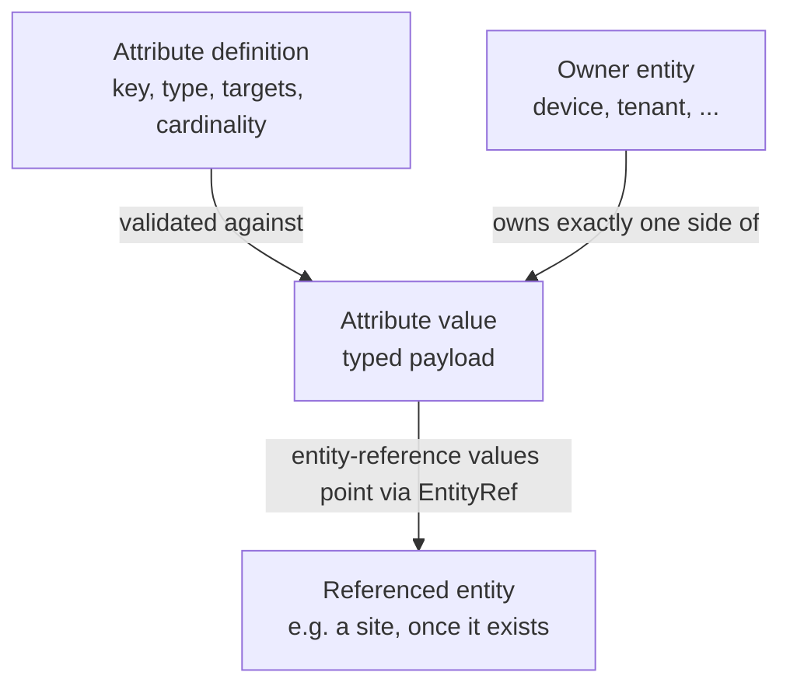
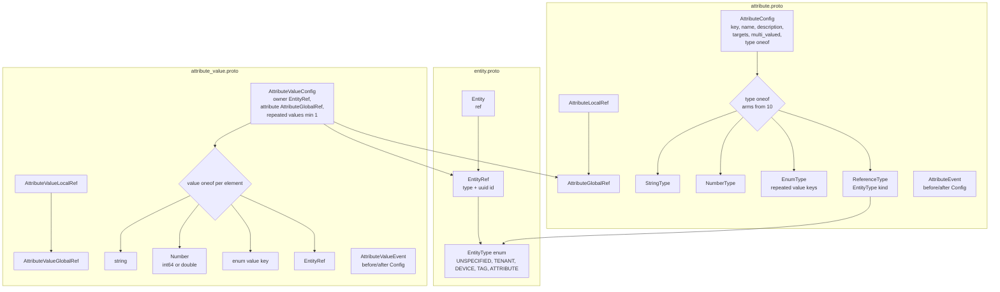

# Inventory Attributes - Plan

> Implemented. A later cleanup consolidated the planned
> `attribute_value.proto` contents into `attribute.proto`; the current package
> README and schema tree are authoritative for file layout.

## Goal Capsule

- **Objective:** Define the protobuf schema for typed, operator-defined attributes in `spec/proto/flowseer/api/inventory/v1/` across three files: `entity.proto` (new; the generic entity handle), `attribute.proto` (rewritten from the current stub; the definition family), and `attribute_value.proto` (new; the value-assignment family). The conventions doc, the package README, and regenerated `generated/` output land in the same change.
- **Product authority:** This document. Product Contract confirmed 2026-08-29; planning decisions confirmed in the same session.
- **Open blockers:** None. The one open question is deferred and non-blocking.
- **Stop conditions:** Surface a blocker instead of guessing if implementation would change a Product Contract requirement, or if `buf breaking` failures cannot be resolved without touching files outside this plan's scope.

---

## Product Contract

### Summary

An attribute definition carries a stable machine key, a configurable type (string, number, closed enum, or entity reference), the entity kinds it may attach to, and whether it holds one value or several. Values live in a separate assignment entity owned by exactly one carrier, and the server validates every value against its definition. A new `entity.proto` supplies the `EntityType` enum and the `EntityRef` that make targeting, ownership, and reference values possible across entity kinds.

### Problem Frame

Tags exist for marking: a device either carries a tag or it does not. There is no way to say *what value* something has, so anything measured or referenced (a device's site, a numeric capacity, a lifecycle stage from a fixed vocabulary) has nowhere typed to live. Backend planes such as discovery and policy are expected to key behavior off this data, which rules out a stringly-typed value bag: consumers need stable keys and values whose type the server has already enforced.

### Key Decisions

- KD1. **Value assignment is its own triad entity, not a field on each carrier.** (session-settled: user-approved — chosen over embedding values in each carrier's Config: carriers, definitions, and values evolve independently, machine consumers get value-level events, and cascade deletion stays ordinary entity deletion instead of the server rewriting operator intent.) Governs R9, R15.
- KD2. **A generic `EntityRef` joins the schema in `entity.proto`.** (session-settled: user-directed — chosen over a one-off polymorphic ref local to the attribute package: targeting, ownership, and reference values all need "some entity of a stated kind", and the next feature will too.) Governs R1, R2, R3, R4.
- KD3. **An attached attribute always carries a value.** (session-settled: user-directed — chosen over allowing valueless attribute presence: a valueless marker is what a tag is for; the value is the reason attributes exist.) Governs R10.
- KD4. **Referenced-entity deletion cascades silently.** (session-settled: user-directed — chosen over the drop-or-block gate used for type changes: deleting an entity always succeeds, and values pointing at it disappear from their owners without an operator prompt.) Governs R14.
- KD5. **Type changes are gated by an explicit drop decision.** (session-settled: user-directed — chosen over immutable types and over silent invalidation: the operator sees what would break and either drops those values or abandons the change.) Governs R12, R13.

### Requirements

**Entity foundation**

- R1. A new `entity.proto` in the inventory package defines an `EntityType` enum covering the kinds attribute targeting, ownership, and reference values may name: tenant, device, tag, attribute. Capability is excluded — it is a closed enum in `capability.proto`, not a UUID-identified entity, so an `EntityRef` cannot point at it. The assignment entity is excluded too: nothing targets or references an assignment. Tenant is included even though the tenant stub carries no id yet; the follow-up service work defines where tenant UUIDs come from. New kinds join the enum when their entity lands.
- R2. `entity.proto` defines an `EntityRef` carrying an `EntityType` and the entity's id, so a message can point at an entity whose kind is decided at runtime.
- R3. `entity.proto` defines an `Entity` message holding only its `EntityRef`. Anything richer is read from the concrete entity. No message in this change consumes `Entity`; it lands as the uniform generic handle (see KTD2).
- R4. The per-entity LocalRef/GlobalRef pairs stay the norm for statically-known targets; `EntityRef` appears only where the kind is dynamic. `docs/conventions/protobuf.md` gains this rule in the same change that introduces `entity.proto`.

**Attribute definitions**

- R5. The attribute definition is a full entity in the house style: LocalRef/GlobalRef pair, Config/State/Event triad (partial per KTD4), protovalidate rules, ambient tenancy.
- R6. A definition carries a stable machine key, unique within the tenant, never localized, and immutable after creation — updates that change it are rejected. Machine consumers address attributes by key; the display name and description remain freely editable.
- R7. A definition carries exactly one type: string, number, enum with an operator-defined closed value set stored on the definition as data, or entity reference naming the `EntityType` its values must point at.
- R8. A definition declares which entity kinds may carry its values, as a set of `EntityType` values, and whether an assignment holds a single value or a list.
- R9. An attribute value assignment is its own entity in the house style, joining one owner (an `EntityRef`), one definition (a typed attribute ref), and one or more typed values. Each assignment is owned by exactly one carrier and shares its lifecycle; a list of values is allowed only when the definition is multi-valued.

**Values**

- R10. The server accepts an assignment only when every value parses under the definition's type, the owner's kind is among the definition's declared targets, an entity-reference value points at an existing entity of the declared kind, and the value count matches the definition's cardinality. An attached attribute carries at least one valid value; there is no valueless attachment. At most one assignment exists per (owner, definition) pair, enforced by the server like tag sibling-name uniqueness.
- R11. Values are operator-written intent. Discovery, ingestion, and policy read them; no integration writes them.

**Lifecycle**

- R12. Changing a definition's type is a validated operation: the server determines which existing values would no longer parse, and the operator either drops those values (the change proceeds, surviving values kept) or declines to drop (the change is rejected). Survival is deterministic: only the enum-key-to-string conversion preserves values; every other type pair invalidates.
- R13. Every other definition edit that can invalidate existing values follows the same drop-or-block rule as R12: removing an allowed enum value, removing a target kind, switching multi-valued to single, and deleting the definition.
- R14. Deleting an entity that attribute values reference removes those values from their owners without prompting. An assignment whose last value is removed disappears entirely, since attachment implies a value per R10.
- R15. Every assignment creation, change, and removal (including R12 drops and R14 cascades) is observable as a value-level event, so machine consumers can track attribute changes without diffing whole entities.

### Acceptance Examples

- AE1. **Covers R12.** Given an enum-typed definition `lifecycle-stage` with values on twelve devices, when the operator changes its type to string and every stored enum value key parses as a string, then no value is invalidated and the change proceeds without a drop decision.
- AE2. **Covers R12, R13.** Given a number-typed definition with values on three devices, when the operator changes its type to entity reference and declines to drop the three now-invalid values, then the server rejects the change and the values are untouched.
- AE3. **Covers R10.** Given a definition targeting devices only, when a value for it is written against a tenant, then the server rejects the write.
- AE4. **Covers R14.** Given a site entity referenced by a single-valued `site` attribute on thirty devices, when the site is deleted, then the deletion succeeds and all thirty assignments are removed, each removal emitting an event per R15.
- AE5. **Covers R8, R10.** Given a multi-valued entity-reference definition, when an owner's assignment is written with one dangling reference among valid values, then the server rejects the whole write.

### Scope Boundaries

- No required-on-every-entity enforcement: a definition never forces carriers to have a value. Presence stays optional per entity; only presence-implies-value is enforced.
- No unification with tags. Tags mark, attributes measure; the tag system is untouched.
- No site entity. `site` was the motivating example for entity-reference values, but the entity itself is separate work; it joins `EntityType` when it lands.
- Server implementation, storage, and the RPC surface for managing definitions and values are follow-up work; this change delivers the schema, its regenerated output, and the paired docs.
- No UI work.
- The `device.proto` and `tenant.proto` stubs stay untouched. `EntityType` names their kinds even though their own ref pairs predate the conventions doc; bringing them to house style is separate work.

### Dependencies / Assumptions

- Assumes ambient tenancy applies unchanged: definitions and assignments are tenant-scoped with no tenant field in any ref, per `docs/conventions/protobuf.md`.
- The conventions doc and the new schema must land in the same change (R4); the repo treats mirrored-artifact sync as its top review priority.

### Open Questions

- **Deferred to implementation (non-blocking):** how machine consumers subscribe to R15 events — transport and envelope live outside this schema package.

---

## Planning Contract

**Product Contract preservation:** restructured, no scope change, confirmed in session: R1 narrowed (capability excluded from `EntityType` — not addressable by id), R9 reworded from "a typed value payload" to "one or more typed values" (KTD3), R10 gained the (owner, definition) uniqueness sentence previously implied, R14 reworded for the assignment shape. The three original deferred questions are resolved by KTD5, KTD6, and the conventions worked example; the event-transport question stays open.

### Key Technical Decisions

- KTD1. **`entity.proto` bundles `EntityType`, `EntityRef`, and `Entity` as one file.** The one-declaration-per-file default (`docs/code-style-proto.md`) yields to the "tightly coupled family designed as one contract" exception, same as `net/addr/v1/ip.proto`. The file-level comment states this.
- KTD2. **`EntityRef` addresses top-level entities only.** It is a flat `{type, id}` with no ancestry chain, so it can never point at an entity identified relative to an owning parent. The conventions-doc rule (R4) states this boundary and notes that `.agent/hooks/proto-check.sh` does not police `EntityRef` (its sync check matches only `LocalRef`/`GlobalRef` suffixes) — the doc rule is the only guard. `Entity` lands unconsumed per R3 (session-settled: user-directed — kept over cutting it as dead weight: it is the uniform handle the ref family is incomplete without). Governs R1, R2, R3, R4.
- KTD3. **One assignment entity per (owner, definition), holding a repeated list of typed values (min one).** (session-settled: user-approved — chosen over one entity per list element: AE5's all-or-nothing list write becomes a single-entity write, R14's "assignment disappears when its last value goes" stays coherent, and no ordinal keying is needed.) Cardinality enforcement (single vs multi) needs the definition and is server-side, not a field rule. Cites R8, R9, R10.
- KTD4. **Both new families are deliberately partial: Config + Event, no State.** (session-settled: user-approved — values and definitions are pure operator intent per R11; nothing is observed or derived, unlike `TagState`'s denormalized ancestry.) The documented-absence convention applies: a file-level doc comment in each family file names the missing member and why, which is also the answer to the sync hook's non-blocking missing-member report. Cites R5, R11.
- KTD5. **Number values are a typed variant: `oneof` of `int64` integer and `double` decimal.** (session-settled: user-approved — chosen over a single `double`: integer identifiers keep exact fidelity, and the shape follows the repo's typed-variant rule that arms validating differently get their own arm.) Resolves the deferred number-wire-type question. Cites R7.
- KTD6. **Enum value sets are data rows on the definition — a repeated list of stable value keys — never a protobuf `enum`.** A protobuf enum would make operator vocabulary a schema change and require closed-enum semantics the style guide forbids. An enum value payload carries its key string, which is what survives an enum-to-string retype (AE1). Cites R7, R12.
- KTD7. **The definition ref inside an assignment is the typed `AttributeGlobalRef`; only the owner uses `EntityRef`.** The definition's kind is statically known, so per R4 the typed ref applies. The assignment is a top-level relationship entity carrying related refs as ordinary fields, the shape the conventions doc sanctions for entities joining several others. Cites R4, R9.
- KTD8. **Event messages do not carry a removal cause.** Owner deletion, R14 cascade, and R12 drops all surface as the same before-without-after event; cause, provenance, and timing ride the event envelope, per the tag family. The event comments state this so consumers do not expect to distinguish the axes from the message. Cites R14, R15.

### High-Level Technical Design

Directional guidance, not field-by-field specification: exact field numbers follow the conventions-doc numbering rule (oneof beside other fields → arms from 10; 1–9 free for refs and scalars), and the prose above is authoritative where they differ.

### Implementation constraints

- Edition 2024 presence trap: protovalidate skips rules on absent fields, so every mandatory constrained field pairs its rule with `(buf.validate.field).required` (`docs/code-style-proto.md`, "a rule without `required` is a no-op on absence").
- `import option "buf/validate/validate.proto"` only in files that actually use validate rules — an unused import option breaks the buf image/breaking baseline.
- Every field comment answers "what does absent mean here?"; required fields say "Must be present.", never "Absent is invalid.".
- CEL message rules use stable snake-case ids (`<message>.<invariant>`), consumer-facing messages, and `!has(...)` absence guards, per `tag.proto`.
- Enum hygiene: `ENTITY_TYPE_UNSPECIFIED = 0`, values prefixed with the enum name, `EntityRef.type` rejects zero via the `not_in: [0]` pattern already used in `capability.proto`.
- Replacing the stub removes `AttributeRef` and the old `Attribute` message. Breaking checks are suspended pre-release (`buf.yaml` ignores `spec/proto/flowseer`), so no `reserved` entries are needed, but `verify-change` still runs `buf breaking` against local master — treat its output per the stop condition if it fails for reasons outside this scope.

---

## Implementation Units

### U1. Entity foundation in entity.proto

- **Goal:** `spec/proto/flowseer/api/inventory/v1/entity.proto` with `EntityType`, `EntityRef`, and `Entity`.
- **Requirements:** R1, R2, R3. KTD1, KTD2.
- **Dependencies:** None.
- **Files:** `spec/proto/flowseer/api/inventory/v1/entity.proto` (new).
- **Approach:**
  1. `EntityType` open enum: `ENTITY_TYPE_UNSPECIFIED = 0`, then TENANT, DEVICE, TAG, ATTRIBUTE.
  2. `EntityRef`: `type` (required, `enum.not_in: [0]`) and `id` (required, `string.uuid`).
  3. `Entity`: `ref` (required).
  4. File-level comment: one-contract bundling justification (KTD1), the top-level-only boundary (KTD2), and `Entity`'s role as the uniform handle.
- **Patterns to follow:** `spec/proto/flowseer/net/addr/v1/ip.proto` (bundled family + comment style), `spec/proto/flowseer/api/inventory/v1/tag.proto` (ref validation), `capability.proto` (`not_in: [0]`).
- **Test scenarios:** Test expectation: none — schema file; `buf lint` with the PROTOVALIDATE rule set and the proto-check hook are the executable gates (`spec/proto/` holds no tests by policy).
- **Verification:** `buf format` clean, `buf lint` passes, proto-check hook reports no issues for the file.

### U2. Attribute definition family in attribute.proto

- **Goal:** Replace the stub with the definition entity: ref pair, Config, Event.
- **Requirements:** R5, R6, R7, R8. KD5 via R12 comments. KTD4, KTD5, KTD6.
- **Dependencies:** U1.
- **Files:** `spec/proto/flowseer/api/inventory/v1/attribute.proto` (rewrite).
- **Approach:**
  1. `AttributeLocalRef` (uuid id) and `AttributeGlobalRef` (wraps LocalRef; top-level entity), mirroring the tag pair.
  2. `AttributeConfig`: ref; `key` (required, lowercase-kebab pattern, max 64, unique per tenant server-side — comment cites the tag sibling-name precedent — and immutable after creation per R6); `name` (required, 1–128, localized like `TagConfig.name`); `description` (max 2048); `targets` (repeated `EntityType`, min 1, max 16, unique, no zero values, comment: which kinds may carry values per R8); `multi_valued` bool; type oneof with arms from 10: `StringType`, `NumberType`, `EnumType` (repeated value keys, min 1, max 256, each lowercase-kebab, unique in-schema via `(buf.validate.field).repeated.unique` per the `CapabilitySet` precedent; only cross-message checks stay server-side), `ReferenceType` (`EntityType` kind, required, non-zero). Oneof required.
  3. Comments carry the lifecycle contract: every invalidating definition edit follows drop-or-block with deterministic survival (R12, R13); the enum payload key is what a retype preserves (KTD6).
  4. `AttributeEvent`: ref + before/after Config with the `has_side` CEL rule, per `TagEvent`.
  5. File-level comment documents the deliberate absence of `AttributeState` (KTD4).
- **Patterns to follow:** `tag.proto` end to end — comment voice, validation pairing, CEL style.
- **Test scenarios:** Test expectation: none — schema file; gates as in U1.
- **Verification:** `buf lint` passes; proto-check hook's family report shows only the documented State absence.

### U3. Attribute value family in attribute_value.proto

- **Goal:** The assignment entity: ref pair, Config, Event.
- **Requirements:** R9, R10 (schema-expressible parts), R11, R14, R15. KTD3, KTD4, KTD5, KTD7, KTD8.
- **Dependencies:** U1, U2.
- **Files:** `spec/proto/flowseer/api/inventory/v1/attribute_value.proto` (new).
- **Approach:**
  1. `AttributeValueLocalRef` (uuid id) and `AttributeValueGlobalRef` (wraps LocalRef; the assignment is a top-level relationship entity per KTD7).
  2. `AttributeValueConfig`: ref; `owner` (`EntityRef`, required); `attribute` (`AttributeGlobalRef`, required); `values` (repeated payload, min 1, max 128 — presence implies a value per R10). Comments state: (owner, attribute) uniqueness and cardinality-vs-definition checks are server-side (they need definition state); a list is valid only for a multi-valued definition.
  3. Payload message (`local` visibility if only file-structuring): required oneof with arms for string value, `Number` (typed variant: `int64` integer / `double` decimal with `double.finite` rejecting NaN and infinities, per KTD5), enum value key, and `EntityRef` reference. Value-side string caps mirror definition caps (string max 2048, declared on `StringType` and cited by the value arm; enum key rules match `EnumType`).
  4. `AttributeValueEvent`: ref + before/after Config, `has_side` CEL rule. Comment states removal cause is not in the message (KTD8) and that R14 cascades emit ordinary deletion events.
  5. File-level comment documents the deliberate absence of `AttributeValueState` (KTD4).
- **Patterns to follow:** `tag.proto` (triad/CEL), `ip.proto` (`IpAddress` oneof shape for `Number`).
- **Test scenarios:** Test expectation: none — schema file; gates as in U1.
- **Verification:** `buf lint` passes; family report shows only the documented State absence.

### U4. Conventions doc: the EntityRef rule

- **Goal:** `docs/conventions/protobuf.md` and `docs/code-style-proto.md` state the rules the new schema follows, so the docs and the shipped files cannot drift apart.
- **Requirements:** R4. KTD2.
- **Dependencies:** U1, U3 (the worked example is the owner field U3 ships).
- **Files:** `docs/conventions/protobuf.md`, `docs/code-style-proto.md`.
- **Approach:**
  1. Insert the `EntityRef` rule after "The ref pair": typed LocalRef/GlobalRef stay the norm; `EntityRef` only where the kind is dynamic; top-level entities only; the sync hook does not police it. Admission to `EntityType` is a contract — the kind's delete flow triggers value cascade (R14) and its store supports the existence check (R10) — and landing a new id-addressable entity includes joining the enum in the same change. A ref *to* a tenant entity is data, never request scoping; ambient tenancy is unchanged.
  2. Show the attribute owner field (U3's `EntityRef`) as the worked example.
  3. Amend both docs' one-message-per-file sentences to bless single-file entity families, matching the tag family and the two new families.
  4. Reword the absence-comment rule for families with no `State`: the comment moves to the family's file-level comment.
  5. Fix the pre-existing drift naming the hook as `.claude/hooks/proto-check.sh` — the real path is `.agent/hooks/proto-check.sh`.
- **Patterns to follow:** The doc's own section voice; `docs/doc-style.md`.
- **Test scenarios:** Test expectation: none — prose; the paired-change review (R4) is the gate.
- **Verification:** Doc reads as one rule set with no contradiction against the shipped `entity.proto`.

### U5. Inventory package README

- **Goal:** The package README describes the attribute families as the package's second and third fully-shaped entities and how attributes attach.
- **Requirements:** R5, R9 context for readers.
- **Dependencies:** U2, U3.
- **Files:** `spec/proto/flowseer/api/inventory/v1/README.md`.
- **Approach:** Update the sketch-status paragraph (attribute is no longer a stub), add an Attributes section beside Tags (marking vs measuring, the attach model via assignment entities), and note that the open "how tags attach" question is unchanged by this work.
- **Patterns to follow:** Existing README structure and tone.
- **Test scenarios:** Test expectation: none — prose.
- **Verification:** README matches the shipped schema; no stale stub claims remain.

### U6. Regenerate generated output and run the full gate

- **Goal:** `generated/` matches the new schema and the repository verifier passes.
- **Requirements:** All — this is the change's exit gate.
- **Dependencies:** U1–U5.
- **Files:** `generated/go/proto/**` (regenerated, never hand-edited; `buf.gen.yaml` targets only the Go output).
- **Approach:** Run `buf generate` from the worktree root and commit the output with the schema change; `verify-change` diffs committed output against a fresh generation, so schema and generated output must land together.
- **Execution note:** `buf generate` needs an unsandboxed run in this environment.
- **Test scenarios:** Test expectation: none — generated artifacts; the verifier's generation diff is the test.
- **Verification:** `.claude/skills/verify-change/scripts/verify-change.sh --full` passes.

---

## Verification Contract

| Gate | Command | Applies to |
|---|---|---|
| Format | `buf format -d --exit-code` (via verify-change) | U1–U3 |
| Lint | `buf lint` (MINIMAL + PROTOVALIDATE) | U1–U3 |
| Breaking baseline | `buf breaking --against '.git#branch=master'` (via verify-change) | U1–U3 |
| Generation drift | `buf generate` into tmpdir + diff against `generated/` (via verify-change) | U6 |
| Family/ref sync | `.agent/hooks/proto-check.sh` (auto-runs on edit; non-blocking family report answered by KTD4 comments) | U1–U3 |
| Full gate | `.claude/skills/verify-change/scripts/verify-change.sh --full` | change exit |

Known environment facts: `buf generate` and SNMP-touching tests need unsandboxed runs; an unused `import option` breaks the buf image baseline.

## Definition of Done

- U1–U6 complete; every gate in the Verification Contract passes, ending with `verify-change --full`.
- `entity.proto`, the two attribute family files, the conventions-doc rule, and the README land as one coherent change with regenerated `generated/` output.
- Comments carry the full lifecycle contract (drop-or-block, cascade, uniqueness, cardinality) so the future service implementation needs no undocumented behavior.
- No edits outside this plan's files: `device.proto`, `tenant.proto`, `capability.proto`, and the tag family stay byte-identical.
- No abandoned experimental messages or commented-out drafts remain in the diff.
