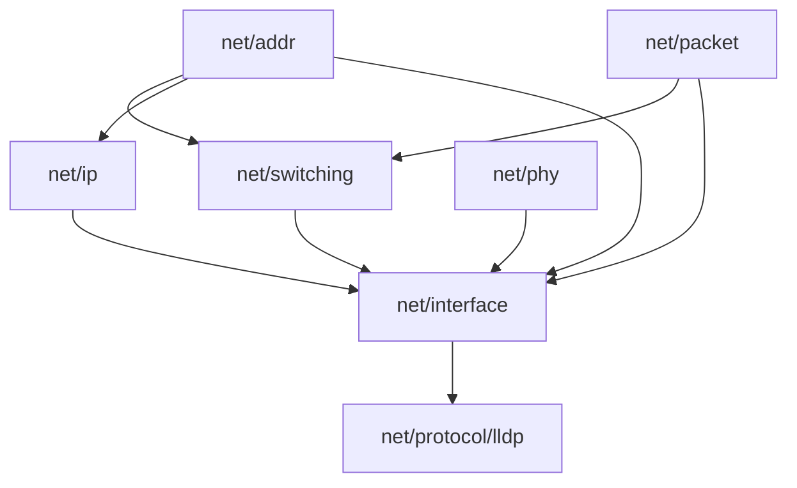
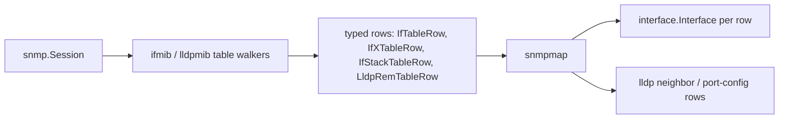

# Net Interface and LLDP Packages - Plan

> Implemented. This file remains the decision record for the LLDP primitives,
> SNMP mapper, and conformance coverage that landed from this plan. Current
> architecture records, scoped READMEs, source, and tests govern follow-up work;
> `artifact_readiness: implementation-ready` describes the plan's executable
> detail, not whether its implementation is pending.

## Goal Capsule

- **Objective:** Rename the layer packages to function names (`net/l2` → `net/switching`, `net/l3` → `net/ip`), then land the two missing building blocks the network-model direction calls for next — `net/interface/v1` and `net/protocol/lldp/v1` — each as a full slice: protos, regenerated code, conformance coverage, and an SNMP mapper with a wire-contract test. The MIB generator gains per-column presence and bit-string decoding first, because the mappers need both and the current bindings express neither.
- **Product authority:** [The network-model direction record](../architecture/2026-08-20-network-model-structure-direction.md) (amended by this work to record the rename) and [the net core package research](../architecture/2026-08-26-net-core-package-research.md) fix the message shapes and conventions; [the protobuf model conventions](../conventions/protobuf.md), [the proto style guide](../code-style-proto.md), and [the doc style guide](../doc-style.md) govern schema shape and prose. `net/protocol/{stp,lacp}`, `net/wlan`, routing, and the plan-era `device/v1` entity slice are not active scope. Device has since landed in `api/inventory/v1`; the accepted direction leaves the future Interface entity package unsettled.
- **Stop conditions:** Surface instead of guessing when a change would alter product scope (R-IDs), reopen an accepted architecture decision beyond the recorded rename, or require a policy-surface edit (`buf.yaml`, hooks, `AGENTS.md`).
- **Open blockers:** None.

---

## Product Contract

### Summary

Complete the L1–L3 half of the `net/` tree: rename `l2`/`l3` to `switching`/`ip`, add `net/interface/v1` with the oneof-kind `Interface` (all eight arms, facet composition, generic counters), and add `net/protocol/lldp/v1`. Prove both new packages against real MIB data through the repo's first production MIB-to-proto mappers.

### Key Decisions

- KD1. **Function-named layer packages: `net/l2` → `net/switching`, `net/l3` → `net/ip`.** (session-settled: user-directed — chosen over keeping the accepted `l2`/`l3` names: function-named roots are the prior-art majority, and no production code consumes the generated `l2`/`l3` packages yet, so the rename is cheap now and permanent later.) Governs R1, R2, R3, R4.
- KD2. **This slice owns `interface` + `lldp`; other missing packages stay future.** (session-settled: user-directed — chosen over interface-only or the full protocol sweep: these two are what the direction's sequencing names next and what the existing `ifmib`/`lldpmib` bindings can feed.) Governs R5, R11.
- KD3. **All eight interface kind arms land now.** (session-settled: user-directed — chosen over the sequenced five: settles the subinterface-encapsulation open question in this slice; adding arms later would have been non-breaking but leaves tunnel/management/sub rows in `other`.) Governs R6, R7, R10.
- KD4. **SVI carries a bare VLAN id; subinterface reuses the existing exact-tag types.** (session-settled: user-approved — chosen over one shared OpenConfig-style tag-match message: the SVI binding is just an id, and a match type would land in `switching` without another consumer.) Governs R7.
- KD5. **Generic interface counters land in this v1.** (session-settled: user-approved — the research doc already places generic counters in `net/interface`, and `ifmib` feeds them for free.) Governs R9.
- KD6. **Each package lands as the full slice, not schemas-only.** (session-settled: user-approved — protos, regenerated code, conformance coverage, SNMP mapper, wire-contract test, per the direction's "what this enables" unit.) Governs R13, R14, R15, R16.
- KD7. **The direction record's prior-art survey is the external-API input; no new survey.** The 2026-08-20 record already grounds every shape decision in YANG/OpenConfig/NMS/vendor-API comparisons, so this work binds to it rather than re-researching.

### Requirements

**Rename**

- R1. `net/l2/v1` becomes `net/switching/v1` and `net/l3/v1` becomes `net/ip/v1`: directories, proto package names, imports, and the predefined `vlan_id` rule extension move; no message shape changes ride along with the move.
- R2. `net/routing` stays reserved for future RIB/network-instance work; nothing in this change claims the name.
- R3. The network-model direction record is amended in the same change so its tree, import order, and prose match the renamed packages.
- R4. The unreferenced `spec/proto/flowseer/net/qos/v1` placeholder directory is deleted; the `net/switching` and `net/ip` placeholders are filled by R1.

**Interface package**

- R5. `net/interface/v1` defines `Interface` per the direction record's shape: the common fields every consumer reads, a required `oneof kind`, and an `ip` facet outside the oneof whose presence means routed.
- R6. All eight kind arms exist as top-level exported messages: physical, lag, vlan, sub, loopback, tunnel, management, other. `OtherInterface` carries the IANA ifType so an SNMP walk never drops a row.
- R7. `VlanInterface` carries the routed VLAN id as a bare `vlan_id`-validated scalar; `Subinterface` carries its parent interface name plus exact 802.1Q encapsulation reusing `switching`'s `VlanTag`/`VlanTagStack`. No new shared matcher message.
- R8. Admin and oper status are enums in the interface package following the conventions' enum rules (taxonomy per KTD5).
- R9. A generic counters message covers what IF-MIB provides (octets, unicast/multicast/broadcast packets, errors, discards, in and out), with explicit presence per counter so an unsupported counter is absent, not zero.
- R10. The tunnel and management arms carry only fields a surveyed source actually provides; thin arms are acceptable, invented fields are not.

**LLDP package**

- R11. `net/protocol/lldp/v1` holds everything LLDP owns: the global/local-system block, per-port config, and the neighbor table. PDU decode stays out until a parser needs it.
- R12. LLDP neighbor rows are device-scoped table rows referencing the local interface by name, per the facet-versus-table rule.

**Go slice**

- R13. Conformance coverage extends to the renamed and new packages: import layering, naming invariants, and the declared import order.
- R14. Go mappers translate the generated `ifmib` and `lldpmib` binding rows into the new messages — the repo's first production MIB-to-proto mapping.
- R15. Wire-contract tests exercise mapper output against representative MIB data.
- R16. `generated/` is regenerated via buf and the `verify-change` gates pass for the affected scope.
- R17. The generated MIB bindings express per-column observation and decode bit-string columns as sets, so the mappers can distinguish an unreported counter from a zero one and can represent a neighbor holding several capabilities.

The post-rename import layering the conformance checks enforce (R1, R13):

### Acceptance Examples

- AE1. **Covers R6, R14.** Given an SNMP walk row whose ifType maps to no dedicated arm, when it is mapped, then it becomes `OtherInterface` carrying the raw ifType with all common fields populated — nothing is dropped.
- AE2. **Covers R5, R7, R14.** Given an SVI routing VLAN 20, when mapped, then `kind` is the vlan arm with id 20 and `ip` is present; given a switched access port, then `kind` is the physical arm with its switchport facet and `ip` is absent.
- AE3. **Covers R7, R14.** Given a QinQ subinterface (outer TPID 0x88A8 VID 100, inner 0x8100 VID 200), when mapped, then its encapsulation is a `VlanTagStack` ordered outermost-to-innermost with both TPIDs preserved.
- AE4. **Covers R9, R14.** Given a device that does not report a counter, when mapped, then that counter field is absent — never an explicit zero.

### Scope Boundaries

- `net/protocol/{stp,lacp}` and `net/wlan` — future slices per the direction's sequencing.
- Routing (routes, RIBs, network instances) — reserved future `net/routing` package; nothing lands under the name now (R2).
- The Interface entity and its refs — not landed. Device identity has since
  landed in `api/inventory/v1`, but the accepted direction does not assign the
  future Interface entity a package. This work is scoped to `net/`; the mappers
  and tests prove primitives only.
- LLDP PDU decode, hardware-port components (ENTITY-MIB), and per-lane optics — deferred per the direction and research records.
- SNMP integration-tier coverage (t1–t4 docker/containerlab/live tests) for the mappers — wire-contract tests use in-memory fixtures (KTD2); replay-tier coverage is follow-up work.

### Dependencies / Assumptions

- The rename is source- and wire-breaking for the generated `switching`/`ip` packages; accepted because no production code consumes them yet (verified — only `test/conformance/proto/{l2,l3}_rules_test.go` import them, and those move with the rename).
- `buf.yaml` suspends breaking checks for the flowseer module (`breaking.ignore: [spec/proto/flowseer]`, "until first stable release"), so the rename needs no baseline reconciliation and no policy change.
- `buf generate` and mibgen checks require unsandboxed runs in this environment.
- U7 regenerates every MIB module, not only `ifmib` and `lldpmib`, so its diff is wide even though its behavior change is narrow.
- The vendored `spec/mib/ieee/LLDP-MIB` and `LLDP-EXT-DOT3-MIB` carry local patches commenting out constructs that crash the MIB parser. U7 must not re-sync those files from upstream; if it ever does, the patches are re-applied.

### How This Work Fits Together

This plan owns the rename plus the `interface` and `lldp` packages. The surrounding breakdown is the current understanding, not a committed roadmap:

- `net/protocol/{stp,lacp}` — depend on `net/interface` (they reference interfaces by name); can follow independently of each other.
- `net/wlan` — depends on `net/interface` and `net/switching`; waits for a feeding integration.
- `net/routing` — still to decide: needs the network-instance/VRF identity design before any schema lands.
- Interface entity slice — enabled by this work, but its package remains
  unsettled. Device already lives in `api/inventory/v1`; follow-up work will wire
  the mappers' primitive output into the entity model and its refs.

### Sources

- [Network model direction record](../architecture/2026-08-20-network-model-structure-direction.md) — the binding shape spec, including the `Interface` sketch and the prior-art survey.
- [Net core package research](../architecture/2026-08-26-net-core-package-research.md) — per-package implement-now/defer boundaries; assigns generic counters to `net/interface`.
- [Protobuf model conventions](../conventions/protobuf.md) and [proto style guide](../code-style-proto.md) — ref/triad/enum/field-number rules the new packages must follow.
- `spec/proto/flowseer/net/l2/v1/` and `spec/proto/flowseer/net/addr/v1/ip.proto` — the concrete file-per-message, predefined-rule, and comment patterns to match.
- `generated/go/mib/` — the sixteen generated MIB binding packages; `ifmib` and `lldpmib` feed this slice's mappers.
- [SNMP collection library architecture](../solutions/architecture-patterns/snmp-collection-library-architecture-and-fast-path-conventions.md) — mapper-side conventions: public generated API only, decline-not-error semantics, the vendored LLDP-MIB's local gosmi patches.
- [Intentional schema deviations convention](../solutions/conventions/document-intentional-schema-deviations-with-comment-and-test.md) — contract comment plus pinned `protoconformance` test for any rule that deviates from the package norm.
- [errs package conventions](../solutions/architecture-patterns/errs-package-architecture-and-error-conventions.md) — error handling for the new mapper code.

---

## Planning Contract

### Key Technical Decisions

- KTD1. **Mappers live in a new `src/common/snmpmap/` package in the root module.** (session-settled: user-approved — chosen over a per-domain `src/common/mapper/` tree or waiting for `src/backend/`: no mapper precedent exists, `src/backend/` does not exist yet, and `src/common/` is where protocol-adjacent Go lives.) The package consumes only the generated MIB bindings' public API and the generated flowseer protos; errors follow `src/common/errs`. Instantiates KD6; governs R14.
- KTD2. **Wire-contract tests are plain unit tests against an in-memory fake `snmp.Session` fed varbind fixtures.** (session-settled: user-approved — chosen over the build-tag-gated t1–t4 integration tiers: the `snmp.Session` interface is small, real table walkers run against a fake unchanged, and tests stay in the default `go test -race` gate. Precedent: the fixture-driven fake in `src/common/snmp/test/integration/assertions_test.go`, which is test-local and must be re-implemented in `snmpmap`.) Governs R15.
- KTD3. **The import-layering test lands in `test/conformance/proto/`, not `spec/proto/`.** (session-settled: user-approved — the base-types plan placed it at `spec/proto/layering_test.go`, which the repo's hard boundary forbids; the test was never landed and the layer order exists only in the direction doc's prose today.) It encodes the post-rename order from the Requirements diagram and fails on any upward or protocol-into-layer import. Governs R13.
- KTD4. **Counters are single `uint64` fields, mapped HC-first.** (session-settled: user-approved — one field per counter, the mapper choosing the source column; chosen over parallel 32/64-bit field pairs: the schema stays flat and consumers never reconcile two widths.) Fallback is per counter family: octets, unicast packets, errors, and discards fall back from the `IfXTable` HC columns to the `IfTable` 32-bit columns; multicast and broadcast exist only as 32-bit `IfXTable` columns, so they stay absent on a device with no `IfXTable` and are never derived from `ifInNUcastPkts`/`ifOutNUcastPkts`. Governs R9.
- KTD5. **`AdminStatus`/`OperStatus` are FlowSeer-normalized open enums.** `<ENUM>_UNSPECIFIED = 0`, values covering IF-MIB's sets (up, down, testing; plus unknown, dormant, not-present, lower-layer-down for oper). Device-reported, so no `defined_only` rule — the deviation from the enum norm carries a contract comment and a pinned conformance test per the deviations convention. Governs R8.
- KTD6. **LLDP chassis and port identifiers stay subtype + octets.** A subtype enum (registry pass-through, IEEE 802.1AB values preserved) beside a required `bytes` value, per message — never collapsed to a display string. Formatting is a library concern, matching the address-bytes decision in the direction record.
- KTD7. **Tunnel and management arms start as marker messages.** Empty arm messages reserve the kind; fields arrive when a source provides them (R10). `other` still carries ifType for rows the mapper cannot classify.
- KTD9. **The MIB generator gains per-column presence and bit-string decoding, as a prerequisite unit.** (session-settled: user-directed — chosen over tracking presence in the mapper from raw varbinds, and over storing LLDP capabilities as opaque octets: both mappers need what the generated bindings cannot currently express, and fixing it once in the generator serves every future mapper instead of pushing the workaround into each one.) Governs R17.
- KTD8. **The direction record is amended in place plus a dated `## Amendments` entry.** Following the record's own 2026-08-21 amendment pattern: tree, import order, and prose edited to the new names, with the amendment entry recording why; the stale claim that an import-layering test exists is corrected to point at the new conformance test (KTD3).

### High-Level Technical Design

Mapper data flow (U5/U6):

Classification in the ifmib mapper dispatches on `ianaiftype.IANAifType`: `ethernetCsmacd(6)` → physical, `ieee8023adLag(161)` → lag, `l2vlan(135)` → vlan, `softwareLoopback(24)` → loopback, `tunnel(131)` → tunnel, plus `IfStackTable` for sub/parent relationships; everything else → other. The exact mapping table is unit-local detail (U5).

### Assumptions

- The `vlan_id` predefined-rule extension keeps its number (50000) through the package move; its full name changes with the package, which is harmless while breaking checks are suspended.
- U7's presence mechanism is an addition to the generated row API rather than a replacement, so existing `ifmib`/`lldpmib` consumers in the SNMP library's own tests keep compiling. If that turns out false, U7 absorbs the call-site updates.

---

## Implementation Units

Units run in dependency order, which is not U-ID order: U7 is a prerequisite for the two mapper units and lands before them.

### U7. MIB generator: per-column presence and bit-string decoding

- **Goal:** Generated MIB bindings express what the mappers need — which requested columns actually landed on a row, and bit-string columns as sets rather than single integers.
- **Requirements:** R17, serving R9, R11, R14 (KTD9).
- **Dependencies:** None. Precedes U5 and U6.
- **Files:** `src/common/snmp/cmd/mibgen/` (emitter and its golden fixtures); regenerated `generated/go/mib/**` for every affected module.
- **Approach:**
  1. Extend the row emitter so a walked row reports per-column observation, distinguishing a column that returned a value from one that was requested and never landed. Keep the existing decline-not-error semantics for raw decode failures.
  2. Emit `BITS`-syntax columns as a decoded set of bit positions, preserving positions the generator does not have names for. `lldpRemSysCapSupported` and `lldpRemSysCapEnabled` are the driving cases.
  3. Refresh emitter goldens (`-update-golden`) and regenerate all MIB modules; the drift check is `go run ./src/common/snmp/cmd/mibgen -check`.
- **Execution note:** Regeneration touches every module under `generated/go/mib/`, so land the emitter change and the full regeneration in one commit.
- **Patterns to follow:** the existing emitter and golden-fixture layout under `src/common/snmp/cmd/mibgen/`.
- **Test scenarios:**
  - A row where a requested column never landed reports that column unobserved; a row where it returned zero reports it observed.
  - A row assembled from an index that carried only unrequested columns reports every requested column unobserved.
  - A two-octet bit-string value decodes to the set of its set bit positions, including positions with no generated name.
  - An empty bit-string value decodes to the empty set, not to zero-as-a-member.
  - A short or malformed bit-string value declines rather than panicking.
  - `mibgen -check` reports no drift after regeneration.
- **Verification:** `go test -race ./src/common/snmp/...` green; `mibgen -check` clean; regenerated bindings committed.

### U1. Rename l2 to switching and l3 to ip

- **Goal:** The layer packages carry their function names end to end, with the direction record amended in the same change.
- **Requirements:** R1, R2, R3, R4 (KD1, KTD8).
- **Dependencies:** None.
- **Files:** `spec/proto/flowseer/net/l2/v1/` → `spec/proto/flowseer/net/switching/v1/` (13 protos + README); `spec/proto/flowseer/net/l3/v1/` → `spec/proto/flowseer/net/ip/v1/` (9 protos + README); `spec/proto/flowseer/README.md`; `spec/proto/flowseer/net/qos/v1/` (delete); `docs/architecture/2026-08-20-network-model-structure-direction.md`; `test/conformance/proto/l2_rules_test.go` → `switching_rules_test.go`; `test/conformance/proto/l3_rules_test.go` → `ip_rules_test.go`; `generated/go/proto/flowseer/net/{l2,l3}/v1/` (delete stale dirs); regenerated `generated/go/proto/flowseer/net/{switching,ip}/v1/`.
- **Approach:**
  1. `git mv` the two package directories into the existing placeholder paths (drop the `.gitkeep`s); update `package` statements and every intra-package `import` / `import option` path.
  2. Update the two prose mentions in `spec/proto/flowseer/README.md` and delete `net/qos/v1`.
  3. Amend the direction record per KTD8.
  4. Delete the stale generated l2/l3 dirs (buf generate does not remove them), regenerate, and repoint the two conformance test files' imports.
- **Patterns to follow:** The direction record's existing `## Amendments` section for the amendment entry shape.
- **Test scenarios:**
  - Existing switching/ip validation cases in the renamed conformance test files pass unchanged (shapes did not move, only names).
  - `Covers R1.` A grep over `spec/proto/`, `src/`, and `docs/architecture/` for `net.l2`, `net.l3`, `net/l2`, `net/l3` finds only historical plans and the amendment entry's own prose.
- **Verification:** `verify-change` proto + Go gates pass; `buf generate` diff is clean after committing regenerated output.

### U2. net/interface/v1 schemas

- **Goal:** The `Interface` message, its eight arms, status enums, and counters exist as lint-clean edition-2024 protos.
- **Requirements:** R5, R6, R7, R8, R9, R10 (KD3, KD4, KD5, KTD4, KTD5, KTD7).
- **Dependencies:** U1.
- **Files:** `spec/proto/flowseer/net/interface/v1/` — one file per declaration per the style guide: `interface.proto`, `admin_status.proto`, `oper_status.proto`, `interface_counters.proto`, and one file per arm message (`physical_interface.proto`, `lag_interface.proto`, `vlan_interface.proto`, `subinterface.proto`, `loopback_interface.proto`, `tunnel_interface.proto`, `management_interface.proto`, `other_interface.proto`), plus `README.md`; regenerated `generated/go/proto/flowseer/net/interface/v1/`.
- **Approach:**
  1. Write `Interface` per the direction record's sketch: common fields 1–7, `oneof kind` arms from 10 with `(buf.validate.oneof).required`, `ip` facet at 20.
  2. Arms embed facets by value: physical → `phy.EthernetFacet` + `switching.SwitchportFacet` + lag-parent name; lag → `switching.AggregationFacet` + `SwitchportFacet`; vlan → `vlan_id`-validated scalar; sub → parent name + `switching.VlanTagStack` (per R7); loopback/tunnel/management per KTD7; other → ifType.
  3. Enums per KTD5; counters per KTD4 and R9.
  4. Every field comment states the contract including absence meaning, per the style guide.
- **Patterns to follow:** `spec/proto/flowseer/net/switching/v1/switchport_facet.proto` (header, `import option`, predefined-rule use, comment idiom); `spec/proto/flowseer/net/addr/v1/ip.proto` (required-oneof shape).
- **Test scenarios (in `test/conformance/proto/interface_rules_test.go`):**
  - An `Interface` with no kind arm set fails validation; with exactly one arm it passes.
  - `Covers AE2.` A vlan-arm interface with `ip` set validates; a physical-arm interface without `ip` validates.
  - `name` empty or absent fails (`required` + `min_len`); `mtu = 0` set explicitly round-trips with presence.
  - `VlanInterface` with id 0 or 4095 fails the `vlan_id` rule; 1 and 4094 pass.
  - Unknown nonzero `OperStatus` value remains valid (pinned deviation test per KTD5, named per the deviations convention).
  - Unknown nonzero `AdminStatus` value remains valid (the second pinned deviation test KTD5 requires).
  - `Covers AE3.` A `Subinterface` carrying a two-tag `VlanTagStack` validates with order preserved.
- **Verification:** `buf lint` clean; conformance tests pass under `go test -race`; regenerated output committed.

### U3. net/protocol/lldp/v1 schemas

- **Goal:** The LLDP package holds the global block, per-port config, and neighbor table as lint-clean protos.
- **Requirements:** R11, R12 (KD2, KTD6, KTD9).
- **Dependencies:** U2, U7.
- **Files:** `spec/proto/flowseer/net/protocol/lldp/v1/` — global/local-system message, per-port config message, neighbor row message, chassis-id and port-id messages with their subtype enums, management-address row, capability set; `README.md`; regenerated `generated/go/proto/flowseer/net/protocol/lldp/v1/`; conformance file `test/conformance/proto/lldp_rules_test.go`.
- **Approach:**
  1. Model what `lldpmib` exposes: local system block (chassis id, sys name/desc, capabilities), per-port config (admin status, TLV enablement), neighbor rows keyed by local interface name + remote index carrying chassis/port ids, sys name/desc, capabilities, and management addresses (as `addr.IpAddress`).
  2. Chassis/port identifiers per KTD6; capability bits as a repeated open enum, not a bitmask integer — fed by U7's bit-string decoding.
  3. Neighbor rows are table rows per R12 — local interface by bare name, no refs.
- **Patterns to follow:** `spec/proto/flowseer/net/switching/v1/fdb_entry.proto` (table-row shape); U2's files for header/comment idiom.
- **Test scenarios:**
  - A neighbor row without its required chassis-id/port-id fails; a complete row passes.
  - A chassis id whose subtype is an unknown nonzero registry value remains valid (pinned deviation test).
  - A management address carries the typed `IpAddress` variant; an empty-payload address message fails.
- **Verification:** `buf lint` clean; conformance tests pass; regenerated output committed.

### U4. Import-layering conformance test

- **Goal:** The declared import order is executable, not prose.
- **Requirements:** R13 (KTD3).
- **Dependencies:** U1, U2, U3.
- **Files:** `test/conformance/proto/layering_test.go`.
- **Approach:** Walk `spec/proto/flowseer/`, parse each file's `import` statements, and assert the order from the Requirements diagram: leaves (`addr`, `packet`, `phy`) import nothing FlowSeer-owned; `switching`/`ip` import only leaves; `interface` imports leaves + `switching`/`ip`; `protocol/*` import anything below; layers never import `protocol/*`. Encode the order as one table so the next package addition is a one-line change. The completeness check considers only directories holding at least one `.proto` file, so the empty `net/wlan/v1`, `net/protocol/stp/v1`, and `net/protocol/lacp/v1` placeholders are skipped until they carry schemas.
- **Patterns to follow:** `test/conformance/proto/layout_test.go` (spec-tree walking).
- **Test scenarios:**
  - The current tree passes.
  - The table covers every schema-bearing package under `spec/proto/flowseer/net/` — such a package missing from the table fails the test, so new packages must declare their layer.
  - An empty placeholder directory does not fail the completeness check.
- **Verification:** `go test -race ./test/conformance/proto/`.

### U5. ifmib mapper and wire-contract tests

- **Goal:** `ifmib` rows become `Interface` messages — the first production MIB-to-proto mapping.
- **Requirements:** R14, R15 (KTD1, KTD2, KTD4, KTD9; AE1, AE2, AE4).
- **Dependencies:** U2, U7.
- **Files:** `src/common/snmpmap/` — package with the ifmib mapper, an in-package fake `snmp.Session` test helper, and `ifmib_test.go`.
- **Approach:**
  1. Input: walked `IfTableRow` + `IfXTableRow` (merged by index) + `IfStackTable` relationships. Output: one `Interface` per row.
  2. Kind dispatch on `ianaiftype.IANAifType` per the HTD table; `IfStackTable` resolves sub/parent and lag membership names.
  3. Counters HC-first per KTD4; a counter field is set only when U7's per-column observation says that column landed, so an unobserved counter stays absent per R9.
  4. Errors via `src/common/errs`; unmappable rows are never dropped (AE1), and per-row decode declines follow the SNMP library's decline-not-error semantics.
- **Execution note:** Write the wire-contract test first from fixture varbinds, then make the mapper satisfy it.
- **Patterns to follow:** fixture-driven fake session in `src/common/snmp/test/integration/assertions_test.go` (re-implemented locally per KTD2); `generated/go/mib/ifmib/mib.go` walker API.
- **Test scenarios:**
  - `Covers AE1.` A row with ifType `ieee80211(71)` maps to `OtherInterface` with ifType preserved and common fields populated.
  - An `ethernetCsmacd` row maps to the physical arm; an `ieee8023adLag` row to lag; `l2vlan` to vlan; `softwareLoopback` to loopback; `tunnel` to tunnel.
  - `Covers AE4.` A device without `IfXTable` support yields 32-bit-sourced counters; a missing counter column leaves the field absent.
  - HC and 32-bit counters both present: HC wins.
  - `ifPhysAddress` of 6 octets maps to the EUI-48 variant; empty stays absent.
  - An `IfStackTable` pair maps a subinterface's parent name.
- **Verification:** `go test -race ./src/common/snmpmap/` green; golangci-lint clean.

### U6. lldpmib mapper and wire-contract tests

- **Goal:** `lldpmib` rows become LLDP package messages.
- **Requirements:** R14, R15 (KTD1, KTD2, KTD6, KTD9).
- **Dependencies:** U3, U5, U7.
- **Files:** `src/common/snmpmap/lldp.go`, `lldp_test.go` (reusing U5's fake-session helper).
- **Approach:**
  1. Decode each walked row's `Index` OID suffix, because the values the neighbor rows key on are index arcs rather than columns: `(lldpRemTimeMark, lldpRemLocalPortNum, lldpRemIndex)` for `LldpRemTableRow`, and additionally the address subtype plus length-prefixed address octets for `LldpRemManAddrTableRow`. `snmp.DecodeIndexArcs` is the helper.
  2. Map `LldpLocPortTableRow`/`LldpPortConfigTableRow` to per-port config, `LldpRemTableRow` + `LldpRemManAddrTableRow` to neighbor rows (subtype + octets preserved per KTD6), and the local-system scalars to the global block.
  3. Local port numbers resolve to interface names via the caller-supplied ifmib name mapping — the schema's one-identity rule keeps port-number resolution in the mapper.
- **Test scenarios:**
  - A remote row with chassis-id subtype macAddress maps subtype and octets verbatim.
  - A neighbor's management address maps to the typed `IpAddress` variant decoded from the index arcs.
  - A capability bitmap maps to the repeated enum with unknown bits preserved as unknown values.
  - A remote row whose local port number has no ifmib name resolution is preserved with its port number, not dropped.
  - A row whose index suffix is malformed or short declines rather than panicking.
- **Verification:** `go test -race ./src/common/snmpmap/` green; golangci-lint clean.

---

## Verification Contract

| Gate | Command | Applies to |
|---|---|---|
| Diff-aware repo gates | `.claude/skills/verify-change/scripts/verify-change.sh` | every unit |
| Full sweep before completion | `.claude/skills/verify-change/scripts/verify-change.sh --full` | after U6 |
| Proto lint/format | `buf format -d --exit-code && buf lint` (run by verify-change) | U1–U3 |
| Generated-output drift | `buf generate` to tmpdir + diff (run by verify-change) | U1–U3 |
| MIB binding drift | `go run ./src/common/snmp/cmd/mibgen -check` (run by verify-change) | U7 |
| Race tests | `go test -race ./test/conformance/proto/ ./src/common/snmpmap/ ./src/common/snmp/...` | U1–U7 |

`buf generate` and mibgen checks need unsandboxed runs in this environment. Never hand-edit `generated/` or `buf.lock`; never point golangci-lint at `generated/`.

---

## Definition of Done

- All seven units landed with regenerated output committed alongside the change that causes it — `generated/go/proto/` for the schema units, `generated/go/mib/` for U7.
- `verify-change --full` passes.
- The direction record's tree, import order, and prose match the actual `spec/proto/flowseer/net/` tree (R3), and no reference to `net/l2`/`net/l3` remains outside historical plans and the amendment entry.
- Every deviation from the enum norm carries its contract comment and pinned conformance test.
- No dead-end or experimental code remains in the diff.

Product Contract preservation: unchanged in meaning. The brainstorm's Outstanding Questions were resolved into KTD4–KTD7 and removed, R8 now cites KTD5 instead of deferring the taxonomy, and R17 was added for the generated-binding capabilities the mappers depend on — an addition, not a change to any decision the brainstorm settled.
