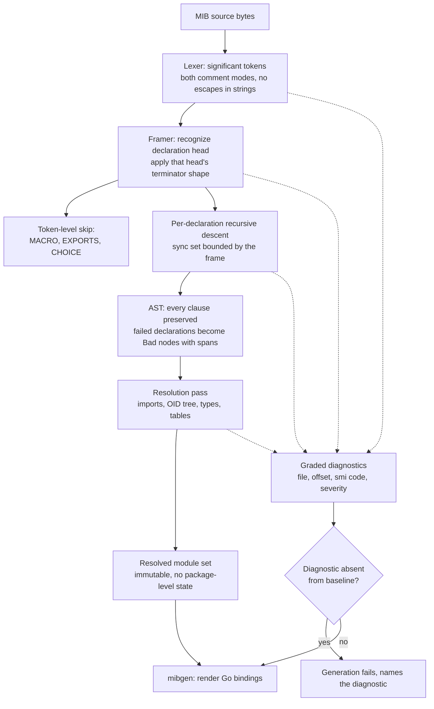
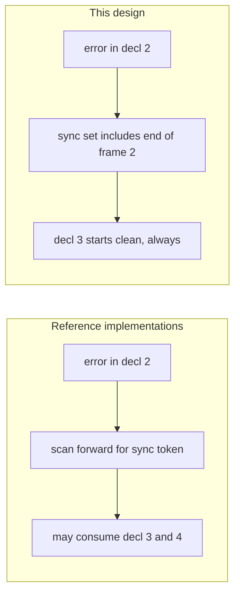
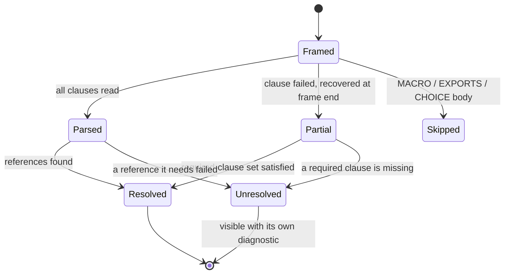

# MIB Parser - Plan

> Implemented. The parser and SNMP packages later moved from
> `src/common/{smi,snmp}` to `src/protocol/{smi,snmp}`. Commands and paths below
> preserve the implementation-time layout. The index-resolution exclusion (KTD9
> and the scope line below) was later reversed once a consumer existed; see
> `docs/plans/2026-09-05-0055-feat-mibgen-key-resolution-and-identity-plan.md`.

## Goal Capsule

- **Objective:** Own the SMIv1/SMIv2 parsing and resolution layer under `src/common/smi`, replacing `gosmi`, with leniency toward malformed vendor MIBs as a first-class property rather than an afterthought.
- **Product authority:** This plan owns the parser, its object model, its diagnostics, and the build-time renderer (`mibgen`). It does not own the `snmp` runtime decode API or the shape of generated bindings, which stay as they are.
- **Execution profile:** Build the parser bottom-up behind a corpus harness, then cut `mibgen` over in a single reviewed step that must produce byte-identical output. Retire `gosmi` only after the differential test has served its purpose.
- **Stop conditions:** Stop and ask if U12 produces any diff in `generated/go/mib`, or if U15 produces any diff beyond the single `Source SHA-256` line named in its Done criterion. Stop and ask before editing `.claude/skills/verify-change/scripts/verify-change.sh` beyond the two edits U14 describes: the MIB-gate path case and the `--full` full-corpus invocation.
- **Tail ownership:** Standalone `ce-work` owns branch, verification, and commits. This plan does not prescribe PR shape.

**Product Contract preservation:** changed — R1 (framer boundary signal corrected against RFC grammar, and the `OBJECT IDENTIFIER` value-assignment head added), R4 (import cycle demoted from fatal; concrete limits fixed), R7 (macro skipping specified as token-level), R17 (second renderer deferred), R21 (intra-file parallelism removed on measurement), R43 (split; the emitted-import half deferred as R44). R20, R28, R33, R34, R36 and R37 moved to Deferred to Follow-Up Work with their IDs retained. R41, R42, R45, R46, R47 and R48 added. All other requirements carry forward unchanged.

---

## Product Contract

### Summary

A hand-owned SMIv1/SMIv2 parser and object model under `src/common/smi`, built so that a malformed vendor MIB costs one declaration rather than the file. It produces one canonical resolved module set that `mibgen` renders to Go bindings at build time. The model carries no renderer-specific state, so a runtime loader can be added later without reshaping it.

### Problem Frame

`mibgen` reads MIBs through `gosmi`, and three separate costs have accumulated from that.

The first is silent wrongness. `gosmi` parses a `BITS` member's declared number and then discards it during conversion, so every member arrives as zero. `mibgen` compensates by detecting the all-zero shape and assigning positions from declaration order. That is correct for every `BITS` type generated today because all of them number consecutively from zero, and it is wrong for the first MIB that leaves a gap. A device reporting bit 5 would decode as whichever member happens to sit fifth in the file, with nothing in the pipeline flagging the mismatch. The loss happens in `smi/internal/type.go`, inside an internal package of an external module, so there is no override seam short of a fork.

The second is fragility under real input. `gosmi` v0.4.4 panics rather than returning an error on `DEFVAL { { } }`, aborting `go generate` with a stack trace. That construct is spelled out in RFC 2578 §7.9 as the way to say no bits are set, so the panic fires on valid input. It is also common: 29 files in `spec/mib/` carry it. Two vendored IEEE MIBs carry `-- FlowSeer local patch:` comments that disable the offending clause, and those edits must be re-applied after every upstream re-sync. Upstream, the same brittleness shows as a tab character killing `CISCO-AAA-SERVER-MIB` and a dozen Cisco MIBs remaining unparseable. The underlying cause is architectural: `gosmi` is a participle grammar with no error recovery, so the first syntax error ends the file.

The third is reach. `spec/mib/` holds 1,695 MIB files across twelve vendor authorities, of which 16 modules are configured for generation. The rest is unexplored, and every vendor MIB adopted from it is a coin flip on whether the toolchain survives it. That corpus is a leniency stress bar, not an adoption target. Its job is to exercise the deviation space at a scale no hand-written fixture suite reaches.

A parser whose defining behavior is what it does *after* the first error is a different kind of component from one that either succeeds or fails. libsmi ships 355 graded diagnostics of which only five are fatal; net-snmp resyncs and continues; pysmi ships tiered relaxation plus a give-up fallback. None of that is reachable by patching around the current dependency.

Two pieces of repository guidance point the other way, and both deserve an answer rather than a silent override.

`docs/code-style.md` states plainly: do not re-implement what the stdlib or an existing dependency already provides. This work is an exception to that rule, and the exception is narrow. `gosmi` provides parsing and resolution; it does not provide error recovery, and error recovery is the property being bought. A dependency that aborts a file on its first syntax error does not "already provide" a parser that survives one.

`docs/solutions/architecture-patterns/gosmi-drops-bits-member-numbers.md` reaches the opposite conclusion outright: writing a replacement parser is the wrong move regardless, because the grammar is only about 700 declarative lines while the bulk of the library is import resolution, type resolution and OID assembly that would be rebuilt for no benefit. That reasoning holds against a like-for-like replacement, and this is not one. The learning weighs the `BITS` defect alone. It does not weigh error recovery, which no amount of resolution code supplies and which participle structurally cannot provide. Its own text concedes that a fork would also buy the `DEFVAL` panic fix and the removal of both vendored patches, so its position is "fork or patch", not "keep as-is". This plan argues a third option the learning scored but did not weigh against a leniency requirement.

That learning currently lives on branch `worktree-net-l13-brainstorm` rather than in this checkout, so the two artifacts will meet at merge. The written response is owed early rather than at cutover; U18 owns it.

The alternative that most nearly competes is a fork. A fork would deliver the `BITS` number, the `DEFVAL` panic fix, and the removal of both local patches. It would not deliver declaration-level error recovery, a graded diagnostic catalogue, or a loader free of package-level state, because none of those is a patch to `gosmi`'s existing design. Against that, the replacement's cost is permanent: a framer, lexer, per-declaration parser, resolver, diagnostic catalogue and renderer to carry indefinitely. This plan takes that cost deliberately, in exchange for the properties the fork cannot reach.

### Key Decisions

- **Hand-written two-tier parser rather than participle.** participle has no error recovery and is not getting it. The maintainer's own proposal has been open since 2020, a second since 2023, and a PR closed unmerged in August 2026. Governs R1, R4. (session-settled: user-directed — chosen over pure participle and over a participle-per-declaration hybrid: recovery is the product, and the hybrid still leaves the framer, lexer, diagnostics, and resolver hand-written.)
- **The full RFC object model, not parity with what `mibgen` reads today.** `mibgen` currently touches roughly eleven fields and reads no DEFVAL, ranges, DISPLAY-HINT, STATUS, INDEX, or IMPORTS at all. Governs R9, R11. (session-settled: user-directed — chosen over a defect-corrected `gosmi`-surface replacement: control and later runtime ingestion both need clauses nothing consumes today.)
- **One resolved model, renderer-agnostic.** The model holds no renderer-specific state, so a second renderer can be added without reshaping it. Governs R17. (session-settled: user-directed — chosen over separate build-time and runtime models. Deferring the runtime loader removes the differential oracle this decision originally bought, so correctness now rests wholly on R39.)
- **The parser grades diagnostics; the caller sets policy.** A numeric severity threshold has no honest value here. Too strict blocks the build on vendor breakage nobody can fix; too loose disables the gate. Governs R15, R19. (session-settled: user-approved — chosen over a configured severity threshold: the threshold worth having is "today's corpus and not one more", which is a baseline.)
- **The diagnostic catalogue is the specification of feature-completeness.** Grading what a MIB gets wrong requires modeling what it should have said, so the catalogue subsumes RFC clause coverage and is directly checkable against an external reference. Governs R14, R16, R26, R40.
- **Loading carries no package-level state.** The current `Init` / `AppendPath` / `LoadModule` / `Exit` global lifecycle is what makes concurrent and runtime loading impossible. Governs R13.
- **Runtime MIB ingestion is deferred, and the constraint that keeps it reachable is not.** No consumer is waiting, so the loader is a forward bet rather than a served workflow. R13 stays binding so deferral costs no rework. Governs R13, R17. (session-settled: user-directed — chosen over keeping the loader in scope: the parity oracle it would have supplied is replaced by mandatory semantic fixtures.)
- **The `gosmi` corpus failure rate stays unmeasured during planning.** Governs R25, and the resolution-rate entry in Success Criteria. (session-settled: user-directed — chosen over measuring it before planning: the differential test produces the number as a by-product at cutover, so a separate probe would be measured twice and believed once.)

### Requirements

**Parsing and leniency**

- R1. A framer pass cuts each source into declarations before any grammar runs, so a declaration that fails to parse costs that declaration and nothing else. The framer recognizes declaration *heads* and the terminator shape each head implies, because no single terminator covers the grammar: macro invocations end at `::= { ... }`, `TRAP-TYPE` ends at `::= <INTEGER>` with no braces, `<ident> OBJECT IDENTIFIER ::= { parent n }` value assignments lead with an identifier followed by a type rather than a macro keyword, and textual conventions, type assignments and `SEQUENCE` row types carry `::=` at the front with no terminator at all. Brace depth, string state and comment state are tracked well enough to know when a terminator is real rather than nested inside an enum, a `SIZE` clause or a `DEFVAL`.
- R2. The lexer accepts byte-level deviations without diagnostics: CRLF, tabs, form feeds, vertical tabs, stray control bytes outside strings, and a UTF-8 BOM at file start.
- R3. Non-ASCII bytes inside quoted text are preserved as bytes and decoded lossily, never rejected.
- R4. Only these conditions abort a file: no `DEFINITIONS ::= BEGIN` header, an unterminated quoted string running to EOF, an unterminated comment running to EOF, and a declared resource limit being exceeded. The limits are a 16 MiB source, a 2 MiB single declaration, 65,536 declarations per file, 65,536 members in one enumeration or `BITS` type, nesting depth 64 in any recursive construct, and 10,000 diagnostics per file. Every other condition, including an IMPORTS cycle, yields a partial module plus diagnostics.
- R5. Comment termination is detected per file rather than configured. A file is parsed with end-of-line termination; if that yields a syntax error that paired-`--` termination resolves, it is reparsed in that mode and carries a diagnostic recording which mode produced the result. The reparse happens at most once per file, decided for the whole file rather than per module. A separator line of `4n+1` hyphens is recognized and diagnosed rather than left to produce a stray minus token.
- R6. Several modules in one file parse as a sequence; content after `END` is diagnosed rather than treated as fatal.
- R7. `MACRO ... END`, `EXPORTS ... ;` and `CHOICE { ... }` bodies are skipped without producing declarations. Skipping runs the full lexical state machine, so an `END` or a brace inside a comment or a quoted string within a skipped body does not end the skip early.
- R8. Both SMIv1 and SMIv2 dialects parse, and the module records which dialect it was read as.
- R42. SMIv1 declarations resolve into the same OID tree as SMIv2 ones. A `TRAP-TYPE` gets the notification OID `<enterprise>.0.<trap-number>`, `ACCESS` and `MAX-ACCESS` are modeled as distinct fields because their semantics are inverted, and the SMIv1-only `STATUS` and access values are accepted in SMIv1 modules and diagnosed in SMIv2 ones.

**Object model and resolution**

- R9. The AST preserves every clause present in the source, including clauses no consumer reads today.
- R10. Resolution runs as a separate pass over the AST, so forward references and cross-module references resolve lazily rather than at parse time.
- R11. The model covers the full SMIv1/SMIv2 declaration surface: `OBJECT-TYPE`, `OBJECT-IDENTITY`, `MODULE-IDENTITY`, `TEXTUAL-CONVENTION`, `NOTIFICATION-TYPE`, `TRAP-TYPE`, `OBJECT-GROUP`, `NOTIFICATION-GROUP`, `MODULE-COMPLIANCE` and `AGENT-CAPABILITIES`, plus plain `OBJECT IDENTIFIER ::= { parent n }` value assignments and non-textual-convention type assignments, each with its full clause set including `DEFVAL`, range and `SIZE` constraints, `DISPLAY-HINT`, `UNITS`, `STATUS`, `REFERENCE`, and `INDEX` / `AUGMENTS` / `IMPLIED`.
- R12. A `BITS` member carries the number declared in the MIB, not its position in declaration order.
- R13. The resolved model is immutable once built and safe for concurrent readers, and loading holds no package-level state.
- R35. A declaration that fails to parse leaves its dependents represented explicitly: each declaration that cannot resolve because of the failure carries its own diagnostic and is visible to consumers as unresolved rather than silently absent. A declaration reaches resolved status only when every clause its kind requires is present, so a declaration that kept its OID but lost a required clause cannot render as if it were whole.
- R45. The model's in-memory shape is fixed before any performance baseline is captured. Tokens and nodes carry byte offsets rather than pointers or strings; line and column are derived from a per-file line table when a diagnostic is built rather than stored on nodes; trivia is implied by the gap between significant tokens rather than stored; identifiers are interned per file with no global table beyond the fixed keyword set; nodes live in per-kind slabs addressed by index and pre-sized from the framer's declaration count; and quoted-string content is materialized on access rather than at parse time.

**Diagnostics**

- R14. Every diagnostic carries the file, line, column, a stable code, and a severity. Message text is formatted when a diagnostic is rendered, not when it is raised.
- R15. The parser assigns severity and makes no policy decision. It has no configurable abort threshold and never stops early on severity, apart from R4's diagnostic-count limit.
- R16. Diagnostic codes form a documented catalogue whose codes are stable across releases.
- R47. Severity has a consumer: the per-vendor corpus snapshot is grouped by severity, and a baseline entry for a diagnostic graded fatal or error requires an explicit recorded reason.

**Consumers**

- R17. `mibgen` renders from the resolved model. The model carries no renderer-specific state, so a second renderer can consume it without reshaping it.
- R18. Generated output for the 16 configured modules is byte-identical to today's. Any diff must be justified as a named `gosmi` defect or a named source change before it lands.
- R19. `mibgen` fails generation on any diagnostic absent from a committed per-module baseline, and never on a diagnostic the baseline already records. A baseline entry is keyed on the diagnostic code and the name of the declaration it attaches to, deliberately excluding file, line and column so an upstream MIB re-sync does not invalidate the baseline. The renderer refuses a configured module carrying an unresolved or bad declaration unless every one of them is baselined.
- R31. All MIB-derived text is escaped when rendered to Go source: string content is emitted only through Go-literal quoting, and identifiers are restricted to a validated character set, with a diagnostic when a source name falls outside it.
- R43. `mibgen`'s hand-written error handling uses `src/common/errs` rather than `go.aledante.io/ae`.
- R48. `src/common/smi` imports nothing from `src/common/snmp`. The model defines its own OID and base-type representations, so a later model-driven decode path can depend on the parser without creating a cycle.

**Performance**

- R21. Corpus parsing is parallel across files, dispatched longest-file-first through a bounded worker pool. Parallelism within a file is not used.
- R22. The parse and resolve paths carry a benchstat gate, matching the convention the `snmp` module already uses. The baseline is captured only after R45's shape has landed.
- R38. Parallel work never affects output. Modules and diagnostics are merged in canonical source order before any renderer, baseline or snapshot consumes them.
- R46. The corpus harness folds each file's diagnostics into counters and releases that file's source and model before reading the next, so peak memory is bounded by the largest file rather than by the corpus.

**Testing and acceptance**

- R23. Every one of the MIB files in `spec/mib/` parses without panic or hang, producing either a resolved module or a diagnostic list.
- R24. A committed per-vendor snapshot of diagnostic counts and codes serves as a golden fixture, so leniency changes surface as a reviewable diff.
- R25. A differential test compares the resolved model against `gosmi` for every module `gosmi` can load, over a named projection of the fields `gosmi` can supply, with the known `gosmi` defects recorded as expected divergences. Fields outside that projection are excluded from the comparison and validated by R39 instead. A divergence outside the expected set is adjudicated against the RFC clause text and recorded as either a new `gosmi` defect or a parser bug; neither implementation is authoritative by default. The run reports, per vendor, how many corpus files `gosmi` loads, fails to load, and panics on. Those are the before-numbers the resolution-rate criterion is read against.
- R39. A committed semantic golden-fixture suite asserts expected resolved OIDs, types, `BITS` positions, constraints and table metadata for representative modules, including modules `gosmi` cannot load, and every clause family outside R25's projection. With the runtime loader deferred, this suite is the sole correctness oracle and is mandatory.
- R40. A committed coverage matrix maps every construct the catalogue grades to its diagnostic code and to the malformed fixture that exercises it.
- R26. A cross-check against libsmi or net-snmp validates the diagnostics themselves, opt-in and skipped when the reference toolchain is absent.
- R27. A curated fixture suite of deliberately malformed MIBs covers the deviation catalogue, including at least one `BITS` type with a deliberate numbering gap.
- R32. The framer, lexer and declaration parser carry Go fuzz targets seeded from the corpus and the R27 fixtures, asserting no panic, no hang, and no unbounded allocation on arbitrary input. Discovered crashers are committed as regression fixtures.

**Cutover**

- R29. `gosmi` is removed from the main module's `go.mod`.
- R30. The `-- FlowSeer local patch:` edits in `spec/mib/ieee/LLDP-MIB` and `spec/mib/ieee/LLDP-EXT-DOT3-MIB` are reverted.
- R41. The repository verifier runs the `mibgen` drift gate when parser sources change, not only when `mibgen.yaml`, `spec/mib/` or `src/common/snmp/cmd/mibgen/` change.

### Key Flows

- F1. Build-time generation
  - **Trigger:** `go generate` invokes `mibgen` against `mibgen.yaml`.
  - **Steps:** Each configured module is framed, parsed, and resolved; diagnostics are collected across all modules; the collected set is compared against the committed baseline; on a clean comparison the resolved model is rendered to Go source.
  - **Outcome:** Generated bindings, or a failure naming the new diagnostics and the file positions that produced them.
  - **Covers R17, R18, R19.**

- F3. Recovery from a malformed declaration
  - **Trigger:** A declaration fails to parse.
  - **Steps:** The failure unwinds to the declaration boundary the framer established; a diagnostic is recorded with the position and code; parsing resumes at the next framed declaration.
  - **Outcome:** A module missing exactly the failed declaration, with the rest intact.
  - **Covers R1, R4, R35.**

### Acceptance Examples

- AE1. **Covers R12, R27.** Given a MIB whose `BITS` type declares `alpha(0), gamma(4), delta(7)`, when the module is resolved, then the members carry positions 0, 4 and 7, not 0, 1 and 2.
- AE2. **Covers R4.** Given a file whose third `OBJECT-TYPE` omits its `SYNTAX` clause, when the file is parsed, then the module contains every declaration except that one, and a diagnostic names its line and column.
- AE3. **Covers R4.** Given a file with no `DEFINITIONS ::= BEGIN` header, when the file is parsed, then no module is produced and the diagnostic says the file is not a MIB.
- AE4. **Covers R19.** Given a vendor MIB whose baseline already records four diagnostics, when generation runs and the same four are produced, then generation succeeds; when a fifth appears, then generation fails and names it.
- AE5. **Covers R6.** Given a file containing two `DEFINITIONS ::= BEGIN ... END` blocks, when the file is parsed, then two modules are produced.
- AE8. **Covers R1, R7.** Given a module that pastes the RFC 2578 `OBJECT-TYPE` macro definition before its own declarations, when the file is framed, then the `::=` and `END` tokens inside the macro body do not cut a frame, and the declarations after the macro are framed correctly.
- AE9. **Covers R1.** Given a module containing `linkDown TRAP-TYPE ENTERPRISE snmp ... ::= 2` followed by another declaration, when the file is framed, then the trap is one complete frame and the following declaration is a separate one.
- AE10. **Covers R30.** Given `spec/mib/ieee/LLDP-MIB` with its `DEFVAL { { } }` clause restored, when the module is parsed, then it resolves without panic and the clause is represented as an empty bit set.
- AE11. **Covers R35, R19.** Given a configured module whose `OBJECT-TYPE` lost its `SYNTAX` clause, when generation runs, then the declaration is unresolved rather than rendered with a defaulted type, and generation fails naming it unless the baseline records it.

### Success Criteria

- Adopting a new vendor MIB never requires editing that MIB, except where the file hits one of R4's fatal conditions. The two existing local patches are gone and no mechanism exists to add a third.
- A diagnostic tells someone where to look without opening the parser: file, line, column and a code that means something in the catalogue.
- Where the reference cross-check runs, the diagnostics agree with libsmi or net-snmp on which construct is wrong, not merely that something is wrong.
- The parser resolves strictly more of the corpus to a usable module than `gosmi` does. The margin is measured at cutover from R25's run rather than asserted now.
- The corpus parse fits inside the developer loop. The measured floor for framing and lexing all 175.7 MB is 20 ms across 12 workers and 184 ms under `-race`, so the budget is real; the risk is retaining what is parsed, not CPU.

### Scope Boundaries

- Forking `gosmi`. Considered and rejected; the fork is a standing maintenance commitment for a subset of what this work delivers.
- Changing the shape of generated bindings, or changing the existing `snmp` decode helpers. Both stay as they are; R18 pins the generated output.
- Serializing a resolved model back to SMI text. Reading only.
- Expanding `mibgen.yaml` beyond its 16 configured modules. The corpus is a parse-and-diagnose bar, not a code-generation bar.
- SNMP agent-side use of the model.
- Resolving index semantics. `INDEX`, `AUGMENTS` and `IMPLIED` are parsed and preserved per R11, but the resolver does not compute index structure: `mibgen` never reads it and index decoding is already generic at runtime.
- Moving `mibgen` under `src/common/smi/cmd/`. The symmetry with `yang/cmd/yanggen` is real, but the move churns the verifier, `generate.go`, and every doc reference for no functional gain, and `mibgen` legitimately imports `snmp`.

#### Deferred to Follow-Up Work

Runtime MIB ingestion, with the original requirement IDs retained so they are traceable and never reused:

- R20. The runtime loader accepts operator-supplied MIB bytes, applies its own severity threshold, and returns the diagnostics to its caller.
- R33. A model-driven decode entry point taking a resolved module and a wire varbind. When it lands it belongs in `snmp` or a third package, depending on `smi`, never the reverse.
- R34. A loader result distinguishing a usable module from a rejected one.
- R36. An explicit import source, with unavailable imports diagnosed rather than fatal.
- R37. Runtime modules never overriding build-time definitions.
- R28. The equivalence test decoding through both generated bindings and the runtime loader.

R13 and R48 are **not** deferred. They stay binding so that adding the loader later costs no rework.

Also deferred, as its own change after U15:

- R44. `mibgen`'s emitted `ae` import migrates to `errs`, and the 10 generated packages carrying it are regenerated. This is a deliberate generated-output diff and must not sit inside a unit whose acceptance criterion is byte-identity.

### Dependencies and Assumptions

- The `gosmi` corpus failure rate is unknown at plan time. R25 produces it at cutover. If that number turns out to be small enough that the reach argument collapses, the leniency and recovery arguments still stand on the `DEFVAL` panic and the two vendored patches, which are artifacts in the repo rather than projections.
- Removing `ae` from `mibgen` does not remove it from `go.mod`. `go.aledante.io/as v0.4.3` requires `go.aledante.io/ae v0.3.0`, so R43 and R44 buy convention consistency, not a smaller dependency graph.
- `gosmi` lives in the differential test's own module from the moment U11 exists, so R29 is gated only on `mibgen` no longer importing it, not on the differential test finishing its useful life.
- The reference cross-check depends on libsmi or net-snmp, which is a C toolchain. It is scoped as an opt-in developer-loop test that skips when the reference is absent, and never becomes a CI or build gate.
- libsmi's `lib/error.c` is assumed to remain a usable reference for catalogue design. It is not a runtime dependency, so drift costs nothing beyond a stale reference.
- `docs/solutions/architecture-patterns/gosmi-drops-bits-member-numbers.md` is on branch `worktree-net-l13-brainstorm` and not in this checkout. Whichever branch merges second must reconcile it.
- Today's 16 configured modules contain no `BITS` type with a numbering gap, so correcting R12 does not move generated output. U11's differential run confirms this before U12 relies on it.
- `gosmi`'s global unqualified `GetType(name)` lookup, used for cross-module enum qualification, is first-match-wins across all loaded modules. The replacement reproduces that resolution order at the renderer boundary; changing it would move generated output and belongs to a later change if it is worth making.
- Measured corpus shape, which the limits in R4 and the fixtures in U16 are derived from: 1,695 files totalling 175.7 MB; median file 23.5 KB, largest 6,534,563 B; 462,656 declarations, median 292 B, largest 932,829 B; largest enumeration about 5,965 members in `spec/mib/huawei/HUAWEI-TC-MIB`. The 16 files in `spec/mib/lancom/lcos/` are 49% of the corpus by bytes and are versioned near-duplicates of one generator's output.

### Outstanding Questions

All deferred; none block implementation.

- What the benchstat gate's thresholds should be. U16 produces the first baseline. The design budget to aim at, derived from the corpus measurement, is at most 8 allocations and 300 bytes per declaration for frame plus parse.
- Whether chunked intra-file parallelism above a size threshold is worth adding later. On today's corpus it would touch 17 files and buy a few percent of makespan, so it is measured-and-rejected rather than ruled out forever.
- Whether the diagnostic severity scale should be caller-overridable per code, as libsmi's is. No consumer needs it while the runtime loader is deferred.

### Sources and Research

- `docs/solutions/architecture-patterns/gosmi-drops-bits-member-numbers.md` (branch `worktree-net-l13-brainstorm`) — where the `BITS` value is lost, why the seam is unreachable, and two misleading readings that cost time. Records that `FAKE-MIB.mib` structurally cannot catch the bug, which is why R27 requires a numbering-gap fixture. Note its reference to `emit_bits.go` is stale; the fallback lives in `emit_enum.go`.
- `docs/solutions/architecture-patterns/snmp-collection-library-architecture-and-fast-path-conventions.md` — the `-check` drift gate, the golden-fixture convention, the `DEFVAL { { } }` panic entry, and the conformance-corpus discipline U13 copies.
- `docs/solutions/architecture-patterns/errs-package-architecture-and-error-conventions.md` — the owned-replacement precedent, the rule that a call-site inventory sizes a migration but never designs the replacement, and the scoping of the `mibgen` follow-up that R43 and R44 split.
- `docs/solutions/conventions/document-intentional-schema-deviations-with-comment-and-test.md` — deliberate looseness reads as a missed rule and gets "fixed"; a comment at the site plus a pinning test is what survives.
- `src/common/errs/doc.go` — `errs.NewCode` semantics, the append-only rule, and the repo-wide uniqueness scan that requires literal arguments.
- `src/common/yang/doc.go` — the precedent this package's placement follows: a top-level model package with the external schema parser confined to its generator, and the no-cycle contract stated in the package doc.
- `src/common/internal/conformance/conformance.go` and `src/common/snmp/conformance_corpus_test.go` — the two-tier gate: an always-on integrity check tolerating `pending`, and a build-tagged completeness check forbidding it.
- `src/common/snmp/bench/` — an isolated Go module keeping a retired dependency alive as a comparand, with `bench-gate.sh` hard-failing only on `allocs/op` and `B/op`. Its `impl=flowseer` output filter is specific to a two-arm comparison and must not be copied verbatim.
- `src/common/snmp/no_gosnmp_test.go` — the identifier-leak guard U15 copies.
- `src/common/snmp/cmd/mibgen/` — the 13 files importing `gosmi`, and the three libsmi compensations KTD7 covers, in `emit_enum.go`, `emit_tc.go` and `emit_tier.go`.
- RFC 2578 §3.4 (comment termination), §3.7 (83 reserved keywords), §7.9 (the `DEFVAL` table including `{ { } }`), §11.1 (subtyping grammar and range rules); RFC 2579 §3.1 (DISPLAY-HINT); RFC 2580 (conformance macros); RFC 1155/1212/1215 (SMIv1); RFC 3584 §2.1.1–2.1.2 (the SMIv1-to-SMIv2 mapping R42 implements).
- libsmi `lib/error.c` — 355 diagnostics on a 0–6 scale as a `(level, id, tag, fmt, description)` tuple, with five fatal and 204 at "error but recoverable". `lib/scanner-smi.l` — the byte-level macro skip R7 deliberately does not copy.
- net-snmp `snmplib/parse.c` — `parse_macro()` skipping at token level, and the runtime comment-termination toggle.
- Go `go/parser/parser.go` and `go/scanner/errors.go` — one diagnostic per line, bail-out after N, `advance(syncSet)` with a same-position progress guard, `Bad*` nodes carrying source spans, and `maxNestLev`.
- Go fuzzing documentation — the one-second per-input execution budget, and that the engine catches panics and hangs but not excessive allocation, so R32's allocation assertion must be written by hand.

---

## Planning Contract

### Key Technical Decisions

- KTD1. **Head-anchored framing with per-head terminator shapes.** The framer recognizes a declaration head (`<ident> <MACRO-KEYWORD>`, `<ident> OBJECT IDENTIFIER`, `<Ident> ::=`, `IMPORTS`, `EXPORTS`, `<Name> DEFINITIONS`) and then applies the terminator rule that head implies. Syncing on `::= { ... }` alone mis-frames every `TRAP-TYPE`, every `TEXTUAL-CONVENTION` and every type assignment, because the first has no braces and the rest carry `::=` at the front. The `OBJECT IDENTIFIER` value assignment needs its own head form because its second token is a type rather than a macro keyword and its `::=` is not adjacent to the identifier, so neither of the two general forms matches it; it is also the most common declaration in the corpus, appearing 29,970 times across 1,368 of the 1,695 files. Distinguishing it from the `Foo ::= OBJECT IDENTIFIER` type assignment, which shares a prefix, is part of the head test. Implements R1.
- KTD2. **Recovery is bounded by the frame.** A declaration parser's ultimate sync set is the end of its own frame, so no declaration's error can corrupt the next one. This is the structural advantage framing buys over libsmi, net-snmp and `go/parser`, none of which have an outer bound. Within a frame, adopt `go/parser`'s discipline: contextual sync sets built from the clause-keyword set, at most one diagnostic per source line, a typed bail-out panic that is recovered at the frame boundary and re-panicked if it is not the bail-out sentinel, a same-position sync counter that force-consumes after ten attempts, and a nesting cap. Governs R1, R4, R35.
- KTD3. **Skipping runs at token level, not byte level.** libsmi skips `MACRO`, `EXPORTS` and `CHOICE` bodies by matching raw characters, so a quoted `"END"` or a commented `--` inside a macro body ends the skip early. Skip by consuming tokens instead, which keeps string and comment lexing active. Implements R7.
- KTD4. **Diagnostic identity is an `errs.Code`; severity, position and message are not.** `errs` already supplies a stable, append-only, literal-declared code namespace with a repo-wide uniqueness scan, so a parallel code space would duplicate that machinery and lose the gate. `errs` has no severity concept and no position type, so the diagnostic is a dedicated value type carrying file, offset, an `errs.Code`, a severity, and the arguments its catalogue row's format string needs. Line, column and message text are computed at render time, which keeps the raise path allocation-free and removes the most likely fuzz timeout. A diagnostic is not an `error` and does not implement `error`. Codes are namespaced `smi/...`, fixed now because the namespace is an append-only contract. Implements R14, R16.
- KTD5. **The catalogue is a generated table, not scattered literals.** Follow libsmi's shape: one table of `(severity, code, tag, format, description)` entries as the single source of truth, with the code constants generated from it. That makes R40's coverage matrix mechanically checkable and keeps the description text next to the grading. Implements R16, R40.
- KTD6. **The diagnostic baseline copies the conformance-corpus two-tier gate.** An always-on integrity gate tolerating `pending` rows keeps the development branch green; a build-tagged completeness gate forbids `pending` at merge; `accepted-risk` needs a reason and an allowlist entry so waivers are a reviewable diff; a baseline entry naming a code that does not exist fails loudly rather than passing silently. Implements R19.
- KTD7. **Four `gosmi` behaviors must be reproduced deliberately or R18 breaks.** `mibgen` keys inline `INTEGER {…}` enums by declaring node because libsmi hands them the synthetic type name `Enumeration` with an empty node type name (`emit_enum.go`). It recovers application types from the type-name string because libsmi normalizes them to integer bases (`emit_tc.go`). `classifyTier` reads the same empty-`Type.Name` artifact for its indicator-name-suffix rule, so honest type naming would silently move tier classification and the emitted `ColumnTiers` maps (`emit_tier.go`). And `gosmi`'s module-name-to-file search decides which file a configured module resolves to, which the generated header pins as `Source path` and `Source SHA-256`; the corpus contains sibling candidates such as `LLDP-MIB` and dated revisions of it. Reproduce all four at the renderer boundary. The `BITS` sequential-position fallback needs no compensation: every configured module numbers consecutively from zero, so real positions equal inferred ones. Implements R18.
- KTD8. **`gosmi` survives only as a differential comparand in an isolated module.** Copy `src/common/snmp/bench/`: a separate `go.mod` so the dependency cannot re-enter the main graph. Because the isolation is immediate, `gosmi` leaves the main graph when `mibgen` stops importing it, not when the differential test retires. Implements R25, R29.
- KTD9. **Index clauses are parsed and preserved, not resolved.** `mibgen` never calls `Table.Index`, `GetIndex()` or `GetAugment()`; index columns are dropped by their not-accessible access and index decoding is generic at runtime through `snmp.DecodeIndexArcs`. The resolver therefore needs no index semantics, which removes the largest speculative piece of R11's surface from the critical path. Implements R11 as a model requirement only.
- KTD10. **The package is `src/common/smi`, and it sets its own conventions.** `smi` names the grammar the package implements and matches the vocabulary of libsmi, gosmi and the RFCs; `mib` is already taken by `generated/go/mib/*`, so a `mib.Module` would read ambiguously against `mib/ifmib`. Placement mirrors `src/common/yang`, where the model is a top-level package and the external schema parser lives only in the generator. No lexer, scanner or parser exists anywhere in the Go tree, so naming, file layout and error shape are new precedent rather than a pattern to mirror; U2 fixes them and later units follow. The diagnostic types live in package `smi` itself rather than a `diag` subpackage, so a caller needs one import for one call.
- KTD11. **`mibgen`'s `ae` migration splits, and the hand-written half lands first.** Three files import `ae` directly; a fourth path emits it into 10 generated packages through the `aeImport` constant used at `emit_scalar.go`. Migrating the hand-written three touches no generated output and can land before the parser exists, which answers the merge-conflict concern by sequencing rather than by bundling. Migrating the emitted one is a deliberate generated-output diff and cannot sit inside U12, whose only acceptance criterion is that generated output does not move. Neither half shrinks `go.mod`, because `as v0.4.3` requires `ae`. Implements R43; defers R44.
- KTD12. **The fuzz targets assert more than absence of panic.** The Go engine catches panics and hangs but not allocation growth, and its one-second per-input budget is the real hang bound. Assert bounded allocation explicitly against `len(data)` at a deliberately loose ceiling, plus position totality and parse idempotence. Position totality is free under R45: with trivia implied by inter-token gaps, tiling holds by construction rather than by storing spans to check. Implements R32.
- KTD13. **The perf gate hard-fails only on deterministic metrics.** `allocs/op` and `B/op` fail the gate; `ns/op` stays advisory. The existing gate's own rule is that a gate which false-trips gets switched off. Implements R22.
- KTD14. **Extending the verifier's MIB gate is a separate, separately-reviewed unit.** `verify-change.sh` currently sets its MIB gate only for `mibgen.yaml`, `spec/mib/*` and `src/common/snmp/cmd/mibgen/*`, so a parser living elsewhere under `src/common/` would change generated output without tripping the drift gate. The script is a policy surface under the repository's guardrail rules, so the change is its own unit. Implements R41.
- KTD15. **Parallelism is across files only.** The largest corpus file is 6.53 MB against a 14.6 MB per-worker share at 12 workers, so longest-first dispatch reaches within a few percent of the ideal makespan without splitting any file. Against that, the median declaration is 292 bytes, which is dispatch-bound rather than compute-bound work; intra-file parallelism would also force a framing barrier before any parsing, turn R38's ordering guarantee into a per-frame merge on the hottest path, and make per-file interning shared mutable state. Implements R21, and simplifies R38.

### High-Level Technical Design

Pipeline shape, and where diagnostics come from:

Why framing before parsing changes the recovery problem. Every reference implementation recovers by scanning forward from the error to a synchronizing token, so a bad declaration can swallow the next one when the sync token appears late or not at all. Framing first converts that open-ended scan into a bounded one:

The declaration lifecycle. The gate on the `Partial` path is the invariant that keeps a half-read declaration from rendering as if it were whole:

### Assumptions

Recorded under Dependencies and Assumptions above, so the implementer finds them beside the constraints they qualify.

### Sequencing

Six phases. Each is independently reviewable, and the cutover does not begin until the oracle exists.

1. **Ground clearing** (U18): the doc response and the hand-written `ae` migration. No parser dependency.
2. **Foundations** (U1–U3): diagnostics, lexer, framer. First contact with the real corpus happens here, at U3, not at U8.
3. **Grammar** (U4–U7): declarations, dialects, values, resolution.
4. **Proof** (U8–U11): corpus harness, parser fuzzing, fixtures, differential.
5. **Cutover** (U12–U15): renderer swap, baseline gate, verifier gate, dependency retirement.
6. **Hardening** (U16–U17): perf gate, reference cross-check.

---

## Implementation Units

### Unit Index

Ordered by execution, not by ID.

| U-ID | Title | Key paths | Depends on |
|---|---|---|---|
| U18 | Ground clearing: doc response and `ae` migration | `docs/solutions/`, `src/common/snmp/cmd/mibgen/` | — |
| U1 | Diagnostic core and catalogue | `src/common/smi/` | — |
| U2 | Lexer | `src/common/smi/internal/lex/` | U1 |
| U3 | Framer and framer-only corpus sweep | `src/common/smi/internal/frame/` | U1, U2 |
| U4 | AST and SMIv2 declaration parser | `src/common/smi/internal/parse/` | U1, U3 |
| U5 | SMIv1 dialect and RFC 3584 mapping | `src/common/smi/internal/parse/` | U4 |
| U6 | Values, subtyping, DISPLAY-HINT | `src/common/smi/internal/parse/` | U4 |
| U7 | Resolution pass and resolved model | `src/common/smi/` | U4, U5, U6 |
| U8 | Corpus harness and per-vendor snapshot | `src/common/smi/corpus_test.go` | U7 |
| U9 | Parser fuzz target | `src/common/smi/internal/parse/` | U4 |
| U10 | Semantic and malformed fixtures, coverage matrix | `src/common/smi/testdata/` | U7 |
| U11 | Differential harness against gosmi | `src/common/smi/differential/` | U7, U10 |
| U12 | mibgen cutover | `src/common/snmp/cmd/mibgen/` | U7, U10, U11, U18 |
| U13 | Diagnostic baseline gate | `src/common/snmp/cmd/mibgen/` | U12 |
| U14 | Verifier MIB-gate extension | `.claude/skills/verify-change/scripts/verify-change.sh` | U12 |
| U15 | Retire gosmi and revert patches | `go.mod`, `spec/mib/ieee/`, `docs/solutions/` | U11, U12, U13 |
| U16 | Benchstat gate | `src/common/smi/bench/` | U7, U8 |
| U17 | Reference cross-check | `src/common/smi/reference_test.go` | U7, U10 |

### U18. Ground clearing: doc response and `ae` migration

- **Goal:** Settle the standing contradiction in the learnings store, and land the half of the `ae` migration that has no parser dependency, before the parser exists.
- **Requirements:** R43.
- **Dependencies:** none.
- **Files:** `docs/solutions/architecture-patterns/gosmi-drops-bits-member-numbers.md`, `src/common/snmp/cmd/mibgen/config.go`, `load.go`, `emit.go`.
- **Approach:**
  1. Write the response to the `BITS` learning's "wrong move regardless" verdict now, while the argument is fresh, rather than at U15. If the file is not present on this branch, write the response into this plan's Problem Frame (already done) and open the doc edit on whichever branch carries the file, so its author can review it while the parser is being built.
  2. Migrate `config.go`, `load.go` and `emit.go` from `go.aledante.io/ae` to `src/common/errs`. Leave the `aeImport` constant and `emit_scalar.go` alone; those are R44.
  3. Confirm no generated output moves.
- **Execution note:** These are two unrelated changes sharing one goal, and they should land as two commits.
- **Patterns to follow:** `docs/solutions/architecture-patterns/errs-package-architecture-and-error-conventions.md` for the migration's conventions and the `XxxError` struct shape already used by `ConfigError` and `CycleError`.
- **Test scenarios:**
  - `mibgen` exits with the documented codes for a config error and a load cycle after the migration.
  - `ConfigError` and `CycleError` still unwrap to their causes and remain matchable.
  - A config error's message text is unchanged, or the change is asserted in a test rather than discovered by a reader.
  - `git diff --exit-code generated/go/mib` is clean.
  - No `go.aledante.io/ae` import remains in `config.go`, `load.go` or `emit.go`.
- **Verification:** `go test -race ./src/common/snmp/...` passes; `go run ./src/common/snmp/cmd/mibgen -check` reports 16 modules matching.

### U1. Diagnostic core and catalogue

- **Goal:** A diagnostic value type and a generated catalogue that every later unit reports through.
- **Requirements:** R14, R15, R16, R40, R47.
- **Dependencies:** none.
- **Files:** `src/common/smi/diagnostic.go`, `src/common/smi/severity.go`, `src/common/smi/internal/catalog/catalog.go`, `src/common/smi/internal/catalog/gen/main.go`, plus their tests.
- **Approach:**
  1. Define `Position` (file, offset) and `Diagnostic` (position, `errs.Code`, severity, format arguments) in package `smi` itself per KTD10. `Diagnostic` does not implement `error`.
  2. Compute line, column and message text at render time from a per-file line table, per KTD4. Nothing on the raise path formats a string.
  3. Define the severity scale with libsmi's 0–6 semantics and document what each level means for a caller. Give it the consumers R47 names, so the scale is not dead public API.
  4. Author the catalogue as one table of `(severity, code, tag, format, description)` rows, and generate the code constants from it so `errs.NewCode` receives literals and stays inside the repo-wide uniqueness scan. Namespace every code `smi/...`.
  5. Seed the catalogue with the codes U2 and U3 need; later units append rows rather than opening a second table.
- **Patterns to follow:** `src/common/errs/doc.go` for code declaration and the literal-argument requirement; `src/common/internal/conformance` for the shape of a machine-checked table.
- **Test scenarios:**
  - Every catalogue row's code parses as `smi/<name>` and is accepted by `errs.NewCode`.
  - Two rows sharing a code fail the catalogue test.
  - A row whose severity falls outside 0–6 fails the catalogue test.
  - A row whose format string's argument count disagrees with its declared arity fails.
  - Generated constants match the table exactly; a hand-edited constant fails.
  - Raising a diagnostic allocates no string; rendering one produces the expected message, line and column.
  - Rendering a diagnostic whose offset is at a line boundary reports the correct line and column.
- **Verification:** `go test ./src/common/smi/...` passes, and the repo-wide code-uniqueness scan still passes.

### U2. Lexer

- **Goal:** Tokens from arbitrary bytes, tolerant of every byte-level deviation R2 and R3 name.
- **Requirements:** R2, R3, R5, R45.
- **Dependencies:** U1.
- **Files:** `src/common/smi/internal/lex/lex.go`, `token.go`, `keyword.go`, `intern.go`, `lex_test.go`, `lex_fuzz_test.go`.
- **Approach:**
  1. One state machine covering ordinary tokens, quoted strings, comments, and the single-quoted hex and binary string forms. SMI strings have no escape mechanism, so the first `"` ends a string, and comments cannot occur inside strings or the reverse.
  2. Emit significant tokens only, each carrying the end offset of the preceding token so trivia is implied by the gap. This is R45's largest single saving and makes position totality hold by construction.
  3. A token is kind plus offset plus length. No strings, no pointers, no file references.
  4. Implement both comment-termination modes behind one lexer option. Default to end-of-line; U3 drives the single paired-mode reparse per R5.
  5. Recognize a `4n+1` hyphen separator line and emit its diagnostic rather than leaving a stray minus token.
  6. Disambiguate `..`, `.` in a qualified `module.descriptor` reference, and `.` inside an OID.
  7. Accept `\n`, `\r`, `\r\n` and `\n\r` as line terminators, since comment termination depends on getting this right.
  8. Carry the RFC 2578 §3.7 reserved-keyword table as a fixed read-only set, and intern identifiers per file against a table that starts from it.
  9. Build the per-file line-start table the diagnostic renderer needs.
- **Execution note:** This unit fixes the package layout, naming and allocation conventions the rest of the parser follows, per KTD10 and R45. Settle them here. The lexer fuzz target belongs in this unit, not deferred.
- **Patterns to follow:** `docs/code-style.md` naming and doc-comment rules; `src/common/snmp/ber_fuzz_test.go` for stating the tolerance invariant in the package doc comment.
- **Test scenarios:**
  - A file opening with a UTF-8 BOM lexes identically to the same file without one, with no diagnostic.
  - Tabs, form feeds, vertical tabs and stray control bytes outside strings produce no diagnostic.
  - Non-ASCII bytes inside a quoted string are preserved byte-for-byte and produce a lossy decode, not a rejection.
  - `-- comment -- trailing` yields a trailing token in paired mode and no token in end-of-line mode.
  - A line of nine hyphens produces the separator diagnostic rather than a bare minus token.
  - `'0F0F'H` and `'1010'B` lex as hex and binary strings; `'0F0'H` produces the odd-length diagnostic.
  - `1..4` lexes as number, range, number; `sysDescr.0` lexes as a qualified reference; both are distinguishable from an OID arc list.
  - An unterminated string running to EOF produces the fatal diagnostic named in R4.
  - An identifier ending in a hyphen produces its diagnostic; `foo--bar` lexes as `foo` followed by a comment.
  - Each of the four line-terminator forms terminates an end-of-line comment.
  - Interning: a file repeating one identifier 1,000 times allocates that identifier's text once.
  - Token offsets plus the implied gaps tile the input exactly, with no gaps or overlaps.
  - Fuzz: arbitrary bytes produce tokens and diagnostics with no panic, no hang, and allocation bounded by input length.
- **Verification:** `go test ./src/common/smi/internal/lex/...` passes.

### U3. Framer and framer-only corpus sweep

- **Goal:** Cut a source into declaration frames so a later parse failure is contained to one frame, and prove the head taxonomy against the real corpus before any grammar is built on it.
- **Requirements:** R1, R4, R5, R6, R7, R21.
- **Dependencies:** U1, U2.
- **Files:** `src/common/smi/internal/frame/frame.go`, `head.go`, `frame_test.go`, `frame_fuzz_test.go`, `sweep_test.go`, `testdata/heads/<vendor>.histogram`.
- **Approach:**
  1. Recognize declaration heads: `<ident> <MACRO-KEYWORD>`, `<ident> OBJECT IDENTIFIER`, `<Ident> ::=`, `IMPORTS`, `EXPORTS`, and `<Name> DEFINITIONS`.
  2. Map each head to its terminator shape per KTD1: brace-group assignment, bare-integer assignment for `TRAP-TYPE`, `;` for `IMPORTS`, and next-head for the front-`::=` forms that have no terminator.
  3. Track brace depth with string and comment state so a `}` inside a `DEFVAL { { … } }`, a `SIZE` clause or a description string does not close a frame early.
  4. Skip `MACRO ... END`, `EXPORTS ... ;` and `CHOICE { ... }` at token level per KTD3.
  5. Recognize `END` only at a delimiter boundary, so `ENDPOINT` and `endOfMibView` do not terminate a module.
  6. Frame several modules in one file as a sequence, and diagnose content after a final `END`.
  7. Enforce R4's source, frame-length, declaration-count and depth limits, and drive R5's single paired-mode reparse.
  8. Sweep the whole corpus with the framer alone, which needs no grammar. Commit a per-vendor histogram of head kinds and unrecognized-head counts. That histogram is the evidence that the five head forms are exhaustive, a claim the plan otherwise only asserts. Measure the corpus's true maximum nesting depth here and assert R4's cap is at least eight times it.
- **Execution note:** Write the mis-framing cases as failing tests first. Every one is a case a terminator-only rule gets wrong, and they are the reason this unit exists. The sweep is the point of the unit as much as the framer is: discovering an unhandled head form here costs a day, and discovering it after U7 costs the grammar.
- **Patterns to follow:** net-snmp's `parse_macro()` token-level discard; `go/scanner`'s position bookkeeping.
- **Test scenarios:**
  - Covers AE9. `linkDown TRAP-TYPE ENTERPRISE snmp VARIABLES { ifIndex } ::= 2` followed by another declaration yields two frames.
  - `org OBJECT IDENTIFIER ::= { iso 3 }` followed by another value assignment yields two frames, and a `Foo ::= OBJECT IDENTIFIER` type assignment in the same file frames separately from both.
  - `DisplayString ::= OCTET STRING (SIZE (0..255))` yields one frame ending before the next head.
  - `FooEntry ::= SEQUENCE { a INTEGER, b OCTET STRING }` yields one frame; the inner braces do not split it.
  - A `TEXTUAL-CONVENTION` followed immediately by an `OBJECT-TYPE` yields two frames.
  - Covers AE8. A module pasting the RFC 2578 `OBJECT-TYPE` macro frames the macro as skipped and frames the following declarations correctly, despite the `::=` and `END` tokens inside it.
  - A macro body containing `"END"` in a quoted string does not end the skip early.
  - A macro body containing `-- END` in a comment does not end the skip early.
  - `DEFVAL { { primary, secondary } }` stays inside one frame.
  - A description string containing an unbalanced `{` does not shift frame boundaries.
  - Covers AE5. Two `DEFINITIONS ::= BEGIN ... END` blocks in one file yield two module frames.
  - Content after the final `END` produces a diagnostic and no additional frame.
  - `ENDPOINT` as an identifier does not terminate the module.
  - Covers AE3. A file with no `DEFINITIONS ::= BEGIN` header yields no module and the not-a-MIB diagnostic.
  - A source beyond 16 MiB, a declaration beyond 2 MiB, and a file beyond 65,536 declarations each produce their fatal diagnostic.
  - A file that frames only under paired comment mode is reparsed once and carries the mode diagnostic; a file needing two reparses does not get them.
  - Sweep: every corpus file frames without panic; frame spans tile each source; the unrecognized-head count matches the committed histogram.
  - Sweep: the corpus's maximum observed nesting depth is at most an eighth of R4's cap.
  - Fuzz: arbitrary bytes frame with no panic, no hang, and bounded allocation.
- **Verification:** `go test ./src/common/smi/internal/frame/...` passes; the committed head histogram is unchanged or its diff is reviewed.

### U4. AST and SMIv2 declaration parser

- **Goal:** Parse each SMIv2 declaration into an AST that preserves every clause, recovering at the frame boundary on failure.
- **Requirements:** R9, R11, R35, R45.
- **Dependencies:** U1, U3.
- **Files:** `src/common/smi/internal/parse/ast.go`, `parse.go`, `clause.go`, `recover.go`, `slab.go`, plus their tests.
- **Approach:**
  1. Define AST nodes for the SMIv2 macros in R11, each carrying its full clause set and a source span as offsets.
  2. Store nodes in per-kind slabs addressed by `int32` index, pre-sized from the framer's declaration count per R45.
  3. Define a bad-declaration node carrying the span it covers and the clauses that did parse, so R35's dependents can be reported. A bad declaration is never representable as simply absent.
  4. Implement recursive descent per macro, following the RFC's fixed clause order, and diagnose an out-of-order clause rather than failing the declaration.
  5. Declare the required-clause set per declaration kind, which U7's resolution gate reads.
  6. Implement KTD2's recovery: contextual sync sets from the clause-keyword set, one diagnostic per source line, a typed bail-out recovered at the frame boundary and re-panicked when the recovered value is not the sentinel, a same-position counter that force-consumes after ten attempts, and a nesting cap.
  7. Preserve `INDEX`, `AUGMENTS` and `IMPLIED` as parsed clauses without resolving them, per KTD9.
- **Execution note:** The recovery machinery is the product here. Write the partial-parse tests before the happy-path clause tests.
- **Patterns to follow:** `go/parser`'s `advance`, `bailout` and `Bad*` node handling.
- **Test scenarios:**
  - Each macro in R11 parses with its full clause set and exact source spans.
  - Covers AE2. An `OBJECT-TYPE` missing `SYNTAX` yields a bad-declaration node with a diagnostic naming its line and column, and the surrounding declarations parse intact.
  - A bad declaration is present in the slab and distinguishable from a declaration that was never in the source.
  - A declaration with clauses in the wrong order parses and carries the out-of-order diagnostic.
  - An optional clause that is absent produces no diagnostic; a required clause that is absent produces one and marks the required-clause set unsatisfied.
  - Twenty consecutive malformed declarations produce at most one diagnostic per source line, and the twenty-first well-formed declaration parses.
  - A declaration whose error offers no sync token consumes no more than its own frame.
  - Nesting beyond the cap produces the fatal depth diagnostic rather than a stack overflow.
  - A file producing more than 10,000 diagnostics stops with the limit diagnostic.
  - A `MODULE-COMPLIANCE` with several `MODULE` groups and both `GROUP` and `OBJECT` refinements round-trips every clause.
  - An `AGENT-CAPABILITIES` with both object and notification variations round-trips every clause.
  - `INDEX`, `AUGMENTS` and `IMPLIED` are present on the node and carry no resolved structure.
  - Slabs are pre-sized from the frame count: parsing a file of N declarations grows no slab more than once.
- **Verification:** `go test ./src/common/smi/internal/parse/...` passes; no test input produces a panic that escapes the frame boundary.

### U5. SMIv1 dialect and RFC 3584 mapping

- **Goal:** Parse SMIv1 modules into the same AST and place them in the same OID tree.
- **Requirements:** R8, R42.
- **Dependencies:** U4.
- **Files:** `src/common/smi/internal/parse/smiv1.go`, `dialect.go`, `smiv1_test.go`.
- **Approach:**
  1. Detect the dialect from the imported symbols and the clause forms present, and record it on the module per R8.
  2. Parse SMIv1 `OBJECT-TYPE` with `ACCESS`, the SMIv1 `STATUS` value set, optional `DESCRIPTION`, and the SMIv1 `INDEX` form that admits a bare type.
  3. Parse `TRAP-TYPE` with `ENTERPRISE` and `VARIABLES`, and synthesize its notification OID as `<enterprise>.0.<trap-number>` per RFC 3584 §2.1.2.
  4. Model `ACCESS` and `MAX-ACCESS` as distinct fields, because SMIv1 states a minimum required access and SMIv2 states a maximum allowed one.
  5. Map `Counter`, `Gauge` and `NetworkAddress` to their SMIv2 equivalents at resolution, keeping the source spelling on the node.
  6. Diagnose SMIv1-only values appearing in an SMIv2 module and the reverse.
- **Patterns to follow:** RFC 3584 §2.1.1 and §2.1.2 as a numbered checklist.
- **Test scenarios:**
  - An SMIv1 module importing from `RFC1155-SMI` records dialect v1; an SMIv2 module importing from `SNMPv2-SMI` records v2.
  - A `TRAP-TYPE` numbered 2 under enterprise `1.3.6.1.4.1.9` resolves to `1.3.6.1.4.1.9.0.2`.
  - An SMIv1 `OBJECT-TYPE` with `ACCESS write-only` parses; the same value in an SMIv2 module produces a diagnostic.
  - `STATUS mandatory` parses in SMIv1 and produces a diagnostic in SMIv2; `STATUS current` produces the inverse.
  - An SMIv1 `OBJECT-TYPE` with no `DESCRIPTION` parses without diagnostic; an SMIv2 one produces the missing-clause diagnostic.
  - `Counter` and `Gauge` resolve to `Counter32` and `Gauge32` with the source spelling retained.
  - An SMIv1 `INDEX` naming a bare type parses.
  - A file mixing SMIv1 and SMIv2 modules records the dialect per module.
- **Verification:** `go test ./src/common/smi/internal/parse/...` passes.

### U6. Values, subtyping, and DISPLAY-HINT

- **Goal:** Parse the value grammar the clause parsers depend on.
- **Requirements:** R11, R12.
- **Dependencies:** U4.
- **Files:** `src/common/smi/internal/parse/value.go`, `subtype.go`, `displayhint.go`, plus their tests.
- **Approach:**
  1. Implement `DEFVAL` per RFC 2578 §7.9, covering every type in its table, and share the parser with RFC 2580's `VARIATION` clause, which uses an identical production.
  2. Support both `BITS` `DEFVAL` forms, including the empty `{ { } }` that the RFC spells out and that panics the current dependency.
  3. Parse `BITS` member lists carrying the declared number per R12, up to R4's member limit.
  4. Implement the RFC 2578 §11.1 subtyping grammar for ranges and `SIZE`, and diagnose the four semantic rules it states: non-negative sizes, ascending bounds, non-overlapping but touching-allowed ranges, and containment within the base type.
  5. Implement the RFC 2579 §3.1 `DISPLAY-HINT` grammar in both its integer and octet-string forms, including repeat indicators, separators and repeat terminators.
  6. Accept the non-conforming OID `DEFVAL` written as a sub-identifier list and diagnose it rather than failing.
- **Test scenarios:**
  - Covers AE1. `BITS { alpha(0), gamma(4), delta(7) }` yields members numbered 0, 4 and 7.
  - Covers AE10. `DEFVAL { { } }` parses as an empty bit set with no panic.
  - `DEFVAL { { primary, secondary } }` parses as a two-member bit set.
  - Each row of the RFC 2578 §7.9 table parses to the expected value shape.
  - `DEFVAL { 'ffffffffffff'H }` parses; an odd-digit hex default produces a diagnostic.
  - A binary-string default whose length is not a multiple of eight produces a diagnostic.
  - A `DEFVAL` on a `Counter32` produces the not-permitted diagnostic.
  - `DEFVAL { { 1 3 6 1 4 1 } }` parses and carries the non-conforming-form diagnostic.
  - `(1..4 | 4..9)` produces the overlapping-range diagnostic; `(1..4 | 5..9)` does not.
  - `(SIZE (-1..4))` produces the negative-size diagnostic; a range outside the base type's produces the containment diagnostic.
  - `"255a"`, `"1x:"`, `"d-2"` and `"2d-1d-1d,1d:1d:1d.1d,1a1d:1d"` each parse to their specified spec sequences.
  - A `DISPLAY-HINT` on an enumerated or `Counter32` syntax produces the not-permitted diagnostic.
  - A separator character that is a decimal digit or `*` produces a diagnostic.
  - An enumeration of 5,965 members parses, matching the corpus maximum; one beyond the limit produces the fatal diagnostic.
- **Verification:** `go test ./src/common/smi/internal/parse/...` passes.

### U7. Resolution pass and resolved model

- **Goal:** Turn parsed modules into one immutable resolved module set.
- **Requirements:** R10, R11, R13, R17, R21, R35, R38, R48.
- **Dependencies:** U4, U5, U6.
- **Files:** `src/common/smi/smi.go`, `resolve.go`, `model.go`, `load.go`, `doc.go`, plus their tests.
- **Approach:**
  1. Define the resolved model: modules, nodes, types, tables, and the OID tree. Expose base types and textual-convention names separately, because the renderer's tier classification reads both. Define the package's own OID and base-type representations; import nothing from `src/common/snmp` per R48, and state that contract in `doc.go` following `src/common/yang/doc.go`'s precedent.
  2. Resolve imports across a caller-supplied search-path list. Diagnose an import cycle and break it at the back edge rather than failing, and diagnose a well-known symbol used without an import rather than failing.
  3. Build the OID tree, resolving forward and cross-module references lazily per R10.
  4. Gate resolution on the required-clause set U4 declares: a declaration missing a clause any renderer reads stays unresolved, so it can never render with a defaulted value.
  5. Resolve types and textual conventions, including a module-unqualified lookup that reproduces the current first-match-wins order.
  6. Assemble tables from row types and column access, without computing index structure per KTD9.
  7. Mark declarations unresolved with their own diagnostic when a reference they need failed, per R35, rather than emitting one unresolved-reference diagnostic per dependent site.
  8. Return an immutable model. The loader entry point takes its configuration as arguments and holds no package-level state per R13. Where it loads several files, it fans out across files through a bounded, longest-first worker pool per R21, kept unexported in the load path.
  9. Merge modules and diagnostics in canonical source order per R38.
- **Execution note:** R13 and R48 are the requirements most easily lost by accident. Add the concurrent-reader test and the import-direction test in this unit rather than deferring them.
- **Test scenarios:**
  - A module importing a symbol defined in a later-loaded module resolves.
  - A two-module import cycle is diagnosed, broken at the back edge, and everything reachable still resolves.
  - A well-known type used without an import resolves and carries the missing-import diagnostic.
  - Covers AE11. A declaration missing a required clause stays unresolved and carries its diagnostic, rather than resolving with a defaulted type.
  - A declaration referencing a name that failed to parse is present, marked unresolved, and carries one diagnostic; twenty dependents produce twenty declaration-level diagnostics and no cascade of reference errors.
  - A table's columns and row node resolve; index columns are present with their not-accessible access and no computed index structure.
  - Two goroutines reading the same resolved model concurrently produce identical results under `-race`.
  - Loading the same module set twice from two independent calls yields equal models, with no cross-call state.
  - The same module set loaded with files supplied in different orders, and with pool sizes 1 and `NumCPU`, produces byte-identical diagnostic ordering.
  - A textual convention and a base type sharing a name resolve to the documented first-match order.
  - No package under `src/common/smi` imports `src/common/snmp`, asserted by a test.
  - `src/common/smi` declares its own OID sub-identifier bound as a literal with a site comment naming `snmp`'s cap as its source, and a pinning test in package `snmp` asserts that cap still equals it, so the deliberate duplication cannot silently diverge. The assertion lives on the `snmp` side because the cap is unexported there, and reading it from `smi` would need either the import R48 forbids or a public-API change this plan disclaims authority over.
- **Verification:** `go test -race ./src/common/smi/...` passes.

### U8. Corpus harness and per-vendor snapshot

- **Goal:** Prove the leniency claim across the vendored corpus and make regressions reviewable, without making the default test run expensive.
- **Requirements:** R23, R24, R38, R46, R47.
- **Dependencies:** U7.
- **Files:** `src/common/smi/corpus_test.go`, `corpus_full_test.go`, `src/common/smi/testdata/corpus/<vendor>.snapshot`.
- **Approach:**
  1. Walk `spec/mib/`, parse every file, and assert no panic and no hang.
  2. Read each file inside the worker that parses it, fold its diagnostics into per-vendor counters grouped by severity, and release the source and the model before the next file per R46. Never accumulate models in a map.
  3. Emit a per-vendor snapshot of diagnostic counts by code and severity, sorted canonically per R38, and commit it. Provide a refresh flag following the existing golden-fixture convention, writing a `.got` file beside the snapshot on mismatch.
  4. Gate in three tiers, mirroring the two-tier conformance discipline. The default run uses the deduplicated corpus: the `spec/mib/lancom/lcos/` family collapses to its newest member, which drops 46% of corpus bytes for 15 of 1,695 files. Verify rather than assume the family is near-duplicate by comparing diagnostic *code sets* across it, and keep any version whose code set differs. The full corpus sits behind the build tag `smi_corpus_full`, wired into the verifier's `--full` path by U14. Short mode runs one file per vendor.
- **Patterns to follow:** `src/common/snmp/cmd/mibgen/emit_test.go` for the update flag and `.got` file; `conformance_corpus_test.go` and `conformance_complete_test.go` for the build-tagged second tier.
- **Test scenarios:**
  - Every file under `spec/mib/` yields either a resolved module or a diagnostic list, with no panic and no hang.
  - The per-vendor snapshot matches the committed fixture; an injected new diagnostic makes it fail and names the vendor and severity.
  - The refresh flag rewrites the snapshot and produces a reviewable diff.
  - Pool size 1 and pool size `NumCPU` produce byte-identical snapshots, with the input file order shuffled between runs.
  - Peak memory during a full-corpus run is bounded by the largest file rather than growing with file count.
  - The deduplication check confirms the dropped `lancom/lcos` versions share a diagnostic code set with the retained one, and fails if one diverges.
  - Short mode covers one file per vendor and skips the rest.
  - The build-tagged full run covers every file.
- **Verification:** `go test ./src/common/smi/ -run TestCorpus` completes inside the developer loop; `go test -tags=smi_corpus_full -run TestCorpus ./src/common/smi/` passes. A build-tagged file does not compile without its `-tags` flag, so the tagged command is the only one that runs the full tier until U14 wires it into `--full`.

### U9. Parser fuzz target

- **Goal:** Assert the tolerance invariant for the declaration parser against arbitrary input. The lexer and framer targets already live in U2 and U3.
- **Requirements:** R32.
- **Dependencies:** U4.
- **Files:** `src/common/smi/internal/parse/parse_fuzz_test.go`, `src/common/smi/internal/parse/testdata/fuzz/`.
- **Approach:**
  1. State the invariant in the target's doc comment: any input yields an AST plus diagnostics, never a panic, a hang, or unbounded allocation.
  2. Seed with hand-written literals covering each fatal condition and each recovery path, plus a small selection from U10's fixtures. Cap committed seeds at 8 KiB each and roughly 60 across all three targets, with a test that fails an oversized seed, because seeds replay on every `go test`.
  3. Assert allocation bounded by `alloc <= 64*len(data) + 64 KiB`. The ceiling is deliberately loose; its job is catching quadratic blowup, not tightness, which belongs to R22.
  4. Assert parse idempotence, and that every diagnostic's offset falls within the input with a severity in range and a code in the catalogue.
  5. Commit each discovered crasher as a regression fixture.
- **Test scenarios:**
  - Each seed input parses without panic and within the allocation bound.
  - A deeply nested `SIZE` expression hits the depth cap and produces the fatal diagnostic rather than exhausting the stack.
  - A pathological brace-nesting input completes well inside one second.
  - An input engineered to emit one diagnostic per line completes inside the budget, which the render-time line computation is what makes possible.
  - Parsing the same input twice yields identical models and identical diagnostics.
  - An oversized committed seed fails the seed-size test.
- **Verification:** `go test ./src/common/smi/...` passes with the committed seeds; a timed `go test -fuzz` run over each target finds no new crasher.

### U10. Semantic and malformed fixtures, coverage matrix

- **Goal:** Build the correctness oracle. With the runtime loader deferred, this unit is the only thing that proves the model is right rather than merely self-consistent.
- **Requirements:** R27, R39, R40.
- **Dependencies:** U7.
- **Files:** `src/common/smi/testdata/semantic/`, `testdata/malformed/`, `semantic_test.go`, `malformed_test.go`, `COVERAGE.md`.
- **Approach:**
  1. Author semantic fixtures asserting expected resolved OIDs, types, `BITS` positions, constraints and table metadata, hand-derived from the RFC text rather than from either implementation's output.
  2. Cover representative modules, including ones `gosmi` cannot load, and every clause family outside U11's projection.
  3. Author malformed fixtures covering the deviation catalogue, one per graded construct, including a `BITS` type with a deliberate numbering gap.
  4. Generate `COVERAGE.md` mapping each catalogue code to its fixture and its asserting test, and fail the build when a code has no fixture or a fixture asserts no code.
  5. Add a site comment plus a named pinning test for each deliberate tolerance, so a later reviewer does not tighten it back.
- **Execution note:** Derive every expected value from the RFC clause text. A fixture whose expectations were read off the implementation proves nothing, and with the equivalence test deferred there is no second opinion to catch it.
- **Patterns to follow:** `conformance_corpus_test.go` for the generated-document gate and the never-hand-edit rule; the intentional-deviation convention for comment-plus-pinning-test.
- **Test scenarios:**
  - Covers AE1. The numbering-gap fixture resolves to positions 0, 4 and 7.
  - Each semantic fixture's resolved OIDs, base types, textual-convention names, constraints and table metadata match the committed expectations.
  - A module `gosmi` cannot load resolves and matches its expectations.
  - Each malformed fixture produces exactly the expected diagnostic codes, no more and no fewer.
  - A catalogue code with no fixture fails the coverage gate.
  - A fixture asserting a code absent from the catalogue fails the coverage gate.
  - `COVERAGE.md` regenerates identically; a hand edit fails the gate.
  - Each deliberate tolerance has a pinning test that fails if the tolerance is removed.
- **Verification:** `go test ./src/common/smi/ -run 'TestSemantic|TestMalformed|TestCoverage'` passes.

### U11. Differential harness against gosmi

- **Goal:** Compare the resolved model against `gosmi` over the fields `gosmi` can supply, and produce the corpus outcome numbers.
- **Requirements:** R25.
- **Dependencies:** U7, U10.
- **Files:** `src/common/smi/differential/go.mod`, `differential_test.go`, `expected_divergences.go`, `outcome.go`, `testdata/`.
- **Approach:**
  1. Create a separate Go module so `gosmi` cannot re-enter the main dependency graph, copying the isolated-module pattern per KTD8.
  2. Run `gosmi` under per-module panic recovery. 29 corpus files carry `DEFVAL { { } }`, the construct that panics it, and an unrecovered panic terminates the test binary rather than failing one module. Record three outcome classes: loaded, failed to load, and panicked. If any panic escapes a goroutine `gosmi` spawns, fall back to a subprocess per module.
  3. Define the projection explicitly: the field set `gosmi` can supply, which excludes everything KTD9 and the object-model decision put outside it.
  4. Record the known `gosmi` defects as expected divergences with a named reason each.
  5. Report the three outcome counts per vendor. Those are the before-numbers the resolution-rate criterion is read against, and the panic count is the strongest single number the plan produces.
  6. Adjudicate an unexpected divergence against the RFC clause text, and record the outcome as either a new expected divergence with its citation or a parser bug.
- **Execution note:** Run the outcome census before the field comparison. It is the cheaper half, it produces the number the Success Criteria depend on, and it will tell you immediately whether panic recovery is working.
- **Test scenarios:**
  - Every module `gosmi` loads compares equal over the projection, apart from the recorded expected divergences.
  - An injected model change outside the expected set fails the comparison and names the module and field.
  - An expected divergence that no longer occurs fails, so the list cannot rot.
  - A module that panics `gosmi` is recorded as panicked, the run continues, and the harness does not abort.
  - The run reports loaded, failed and panicked counts per vendor.
  - No `BITS` type in the 16 configured modules has a numbering gap, confirming R18 holds before U12 relies on it.
  - The main module's package graph does not reach `gosmi`.
- **Verification:** `go test ./...` inside `src/common/smi/differential` passes; `go list -deps ./...` in the main module returns no `gosmi` package.

### U12. mibgen cutover

- **Goal:** Render from the resolved model, producing byte-identical output.
- **Requirements:** R17, R18, R31.
- **Dependencies:** U7, U10, U11, U18.
- **Files:** `src/common/snmp/cmd/mibgen/load.go`, `config.go`, `emit.go`, `emit_tc.go`, `emit_enum.go`, `emit_table.go`, `emit_scalar.go`, `emit_tier.go`, `emit_indicator.go`, `emit_discovery.go`, `emit_test.go`, `emit_tier_test.go`, `load_test.go`.
- **Approach:**
  1. Pin today's module resolution first: record the `(module name, absolute file path, SHA-256)` map `gosmi` produces for the 16 configured modules as a committed fixture, and make the new loader reproduce it exactly. This converts the most likely first diff into a pre-answered question.
  2. Replace the `gosmi` load path with the resolved model. The global lifecycle disappears; search paths and module names become arguments.
  3. Reproduce KTD7's three renderer compensations: inline-enum keying by declaring node, application-type recovery by type name, and `classifyTier`'s dependence on the empty type name.
  4. Provide the module-unqualified type lookup the cross-module enum qualifier needs, matching today's resolution order.
  5. Refuse to render a configured module carrying an unresolved or bad declaration. The refusal is unconditional here; U13 introduces the baseline that records exceptions to it.
  6. Escape all MIB-derived text per R31: emit string content only through Go-literal quoting, validate identifier characters, and diagnose a source name outside the set.
  7. Correct the `emit_enum.go` comment that misattributes the `BITS` cause to libsmi, which is not in the dependency tree.
- **Execution note:** Land this as an internal seam first if the diff is not clean on the first attempt: keep `gosmi` loading, insert the resolved model behind the renderer as an adapter, confirm `-check` is clean, then swap the producer. That isolates a renderer-boundary bug from a parser bug. The `ae` work is not in this unit by design; U18 took the half that can land, and R44 holds the half that would move generated bytes.
- **Patterns to follow:** the existing `-check` drift gate; generated code consuming only the host library's public API.
- **Test scenarios:**
  - `mibgen -check` reports all 16 modules matching committed output.
  - The `FAKE-MIB` golden test passes unchanged.
  - Each configured module resolves to the same file path and SHA as the committed resolution fixture.
  - A module with an inline `INTEGER {…}` enum emits the same type name and keying as today.
  - `Counter32`, `Gauge32`, `TimeTicks`, `IpAddress` and `Opaque` emit the same wire kinds as today.
  - A raw-`TimeTicks` column classifies into the same tier as today.
  - A cross-module enum reference qualifies to the same module as today.
  - A description containing a double quote, a backslash and a newline emits as a valid Go literal.
  - A source name containing a character outside the identifier set produces a diagnostic and does not emit an invalid identifier.
  - Covers AE11. A configured module with an unresolved declaration fails generation rather than emitting a partial package.
  - The generated header still carries the source path and SHA-256 for each module.
- **Verification:** `go run ./src/common/snmp/cmd/mibgen -check` exits zero; `go test -race ./src/common/snmp/...` passes; `git diff --exit-code generated/go/mib` is clean.

### U13. Diagnostic baseline gate

- **Goal:** Fail generation on a new diagnostic and never on a recorded one.
- **Requirements:** R19, R47.
- **Dependencies:** U12.
- **Files:** `src/common/snmp/cmd/mibgen/baseline.go`, `testdata/baseline/`, `baseline_test.go`, `baseline_complete_test.go`.
- **Approach:**
  1. Key each baseline entry on the diagnostic code plus the declaring name, excluding file, line and column so an upstream re-sync does not invalidate it.
  2. Copy the conformance corpus's two-tier gate per KTD6: an always-on integrity gate tolerating `pending`, a completeness gate behind the build tag `mibgen_baseline_complete` forbidding it, and an `accepted-risk` path needing a reason and an allowlist entry.
  3. Relax U12's unconditional refusal: a configured module carrying an unresolved or bad declaration renders only when the baseline records that declaration. U12 refuses outright, because the baseline does not exist until this unit.
  4. Require an explicit recorded reason for any entry whose diagnostic is graded fatal or error, per R47.
  5. Fail loudly when a baseline entry names a code absent from the catalogue, so a renamed code cannot silently disable a row.
  6. Provide a refresh flag that regenerates the baseline, and never rewrite it from the gate itself.
- **Test scenarios:**
  - Covers AE4. A module whose baseline records four diagnostics generates cleanly when the same four appear, and fails naming the fifth when one is added.
  - A diagnostic that moves line or column without changing code or declaring name does not fail the gate.
  - A diagnostic that moves to a different declaration does fail.
  - A baseline entry naming an unknown code fails the gate.
  - An entry for a fatal- or error-graded diagnostic without a recorded reason fails.
  - A `pending` row passes the always-on gate and fails the completeness gate.
  - An `accepted-risk` row without a reason or without an allowlist entry fails.
  - The refresh flag regenerates the baseline and produces a reviewable diff.
- **Verification:** `go test ./src/common/snmp/cmd/mibgen/...` passes, and `go test -tags=mibgen_baseline_complete -run TestBaselineComplete ./src/common/snmp/cmd/mibgen/` passes. The untagged command does not compile the completeness gate, so both are required.

### U14. Verifier MIB-gate extension

- **Goal:** Make the drift gate fire when parser sources change.
- **Requirements:** R41.
- **Dependencies:** U12.
- **Files:** `.claude/skills/verify-change/scripts/verify-change.sh`, `.claude/hooks/tests/`.
- **Approach:** Two named edits, and nothing else in the script. First, add `src/common/smi/*` to the existing `mib=true` path case. Second, add a `--full`-only invocation of `go test -tags=smi_corpus_full -run TestCorpus ./src/common/smi/`; the script invokes no tagged test today, so this is a new guarded block rather than a pattern extension.
- **Execution note:** This file is a policy surface under the repository's guardrail rules. Request the guardrail review at U12 time, in parallel, rather than after: the diff is one added `case` pattern plus one guarded `go test -tags=` invocation in the `--full` branch, reviewable in isolation, and the reviewer's obvious question has a one-sentence answer once U12 has landed. If the change is declined, the fallback is a `mibgen -check` invocation inside the `smi` package's own tests, which is a source-tree change rather than a policy change and recovers most of the coverage. Do not add any exclusion or suppression to make other work pass.
- **Test scenarios:**
  - A change limited to `src/common/smi/` triggers the MIB gate.
  - A change limited to `mibgen.yaml`, `spec/mib/` or `src/common/snmp/cmd/mibgen/` still triggers it.
  - A change touching none of those does not trigger it.
  - The `--full` path runs the build-tagged full-corpus test.
  - The existing hook test suite passes unchanged.
- **Verification:** `.claude/hooks/tests/run.sh` passes; `shellcheck` on the script passes; a scratch edit under `src/common/smi/` runs the gate.

### U15. Retire gosmi and revert patches

- **Goal:** Remove the dependency, revert the vendored patches, and leave no contradictory guidance behind.
- **Requirements:** R29, R30.
- **Dependencies:** U11, U12, U13.
- **Files:** `go.mod`, `go.sum`, `src/common/snmp/no_gosmi_test.go`, `src/common/smi/no_gosmi_test.go`, `spec/mib/ieee/LLDP-MIB`, `spec/mib/ieee/LLDP-EXT-DOT3-MIB`, `docs/solutions/architecture-patterns/snmp-collection-library-architecture-and-fast-path-conventions.md`, `CONCEPTS.md`.
- **Approach:**
  1. Remove `gosmi` from the main module and add identifier-leak assertions following the `no_gosnmp_test.go` precedent. Two guards are needed, or one root-level scan: one covering `src/common/snmp/`, one covering `src/common/smi/` with `differential/` exempted, or `gosmi` can re-enter the parser unnoticed.
  2. Revert both `-- FlowSeer local patch:` blocks, restoring the `DEFVAL { { } }` clauses. `LLDP-MIB` is configured, so its revert changes the `Source SHA-256` line in `generated/go/mib/lldpmib/mib.go`. That is one line, and it is the only generated change this unit may produce. `LLDP-EXT-DOT3-MIB` is not configured, so its revert changes nothing generated.
  3. Delete the `DEFVAL` panic workaround paragraph from the collection-library learning, since the change invalidates it.
  4. Apply the already-agreed verdict to the `BITS` learning, which U18 wrote. If that file is absent from this branch, fail loudly rather than skipping silently, and carry the edit on whichever branch holds it.
  5. Add the parser's vocabulary to `CONCEPTS.md`, which currently has no MIB, module, OID or declaration entries. Avoid overloading `Capability` and `Provenance`, which already carry inventory meanings.
- **Test scenarios:**
  - Covers AE10. Both reverted IEEE MIBs parse and resolve, with their `DEFVAL { { } }` clauses represented as empty bit sets.
  - No identifier from `gosmi` appears under `src/common/snmp/` or under `src/common/smi/` outside `differential/`.
  - `go mod tidy` leaves `gosmi` out of the main module's graph.
  - `mibgen -check` reports 16 modules matching after the reverts, with the single expected SHA line updated.
  - The markdown link checker passes on every edited doc.
- **Verification:** `.claude/skills/verify-change/scripts/verify-change.sh --full` passes; `grep -r 'FlowSeer local patch' spec/mib/` returns nothing; `git diff --numstat generated/go/mib` reports exactly one changed line in `lldpmib/mib.go`.

### U16. Benchstat gate

- **Goal:** Pin parse and resolve cost against a committed baseline.
- **Requirements:** R22.
- **Dependencies:** U7, U8.
- **Files:** `src/common/smi/bench/go.mod`, `bench_test.go`, `bench-gate.sh`, `testdata/baseline-micro.txt`, `Taskfile.yml`.
- **Approach:**
  1. Copy `src/common/snmp/bench/`, but drop its `impl=flowseer` output filter. That filter keeps one arm of a two-arm comparison; these benchmarks have one arm, so a verbatim copy would hand benchstat a file with only a preamble and the gate would pass while comparing nothing. Add a gate self-test asserting the filtered file contains at least one benchmark row.
  2. Benchmark the stages separately and composed, so a regression names its stage: lexing, framing, single-declaration parsing by macro kind, whole-file parse, resolution, and the recovery path. The recovery path is the product per KTD2 and nothing else exercises it, so benchmark roughly a thousand consecutive malformed declarations from U10's fixtures.
  3. Add an end-to-end benchmark over the 16 configured modules, which is the number that gates `go generate` latency.
  4. Pin fixtures to real corpus files by path and SHA-256, so a MIB re-sync that moves the baseline is visible rather than silent. Cover the two shapes that pull in opposite directions: a file of many small declarations, and a file of very few enormous ones. `spec/mib/lancom/lcos/LC-UNIFIED-LCOS-10-94-REL-OIDS.mib` is the first at 18,621 declarations averaging 350 B; `spec/mib/huawei/HUAWEI-TC-MIB` is the second at 24 declarations, one of them 601,796 B. A median fixture catches neither.
  5. Use `b.SetBytes` so throughput reads directly.
  6. Hard-fail on `allocs/op` and `B/op` only, leaving `ns/op` advisory behind an opt-in flag per KTD13. Never rewrite the baseline from the gate.
- **Execution note:** Capture the baseline only after R45's allocation shape has landed. A baseline taken earlier freezes the wasteful shape, and every later improvement then reads as a diff needing a re-baseline, which is how a gate gets switched off.
- **Test scenarios:**
  - The gate passes against the committed baseline.
  - An injected allocation regression fails the gate and names the benchmark.
  - A wall-time regression alone does not fail the gate unless the opt-in flag is set.
  - The gate does not rewrite the baseline on failure.
  - The gate self-test fails when the filtered benchmark output contains no benchmark rows.
  - Each pinned fixture's SHA matches, and a mismatch fails with a message naming the re-sync.
- **Verification:** `src/common/smi/bench/bench-gate.sh` exits zero.

### U17. Reference cross-check

- **Goal:** Validate the diagnostics against an external reference, opt-in.
- **Requirements:** R26.
- **Dependencies:** U7, U10.
- **Files:** `src/common/smi/reference_test.go`, `testdata/reference/`.
- **Approach:** Detect libsmi's `smilint` or net-snmp's parser on `PATH` and skip cleanly when neither is present. Map this catalogue's codes to the reference's tags for the constructs both grade, and compare which construct each flags rather than only whether something was flagged. Keep this off the CI and build paths.
- **Test scenarios:**
  - With no reference toolchain present, the test skips and does not fail.
  - With a reference present, each malformed fixture is flagged on the same construct by both.
  - A mapped code with no counterpart in the reference is reported rather than silently passing.
  - The test is absent from the verifier's default path.
- **Verification:** `go test ./src/common/smi/ -run TestReference` skips without the toolchain and passes with it.

---

## Verification Contract

| Gate | Command | Applies to |
|---|---|---|
| Format | `gofumpt -d` and `goimports -d` clean | every Go unit |
| Build and vet | `go build ./...`, `go vet ./...` | every Go unit |
| Race tests | `go test -race ./...` | every Go unit |
| Lint | `golangci-lint run --config .golangci.yml` over `go list -f '{{.Dir}}' ./...` filtered through `grep -vE '/generated(/|$)'` | every Go unit |
| Generated drift | `go run ./src/common/snmp/cmd/mibgen -check` reports 16 modules matching | U18, U12–U15 |
| Renderer golden | `go test ./src/common/snmp/cmd/mibgen -run TestEmit_FakeMIB_Golden` | U12, U13 |
| Corpus, default tier | `go test ./src/common/smi/ -run TestCorpus` | U8 and later |
| Corpus, full tier | `go test -tags=smi_corpus_full -run TestCorpus ./src/common/smi/`, and via `verify-change --full` once U14 wires it in | U8 and later |
| Coverage matrix | `go test ./src/common/smi/ -run TestCoverage` | U10 and later |
| Baseline completeness | `go test -tags=mibgen_baseline_complete -run TestBaselineComplete ./src/common/snmp/cmd/mibgen/` forbids `pending` | U13 |
| Fuzz seeds | `go test ./src/common/smi/...` runs committed seeds | U2 and later |
| Perf | `src/common/smi/bench/bench-gate.sh` | U16 |
| Hooks and config | `.claude/hooks/tests/run.sh`, `shellcheck` | U14 |
| Full gate | `.claude/skills/verify-change/scripts/verify-change.sh --full` | end of each phase, and U15 |

Run verification unsandboxed. The `snmp` tests bind loopback UDP and `buf generate` needs network access, both of which fail under a sandboxed shell.

`TestWatcher_StuckZeroFallbackOnCounterMovement` in `src/common/snmp` is timing-flaky under full-suite load and passes in isolation. Rerun it alone before treating a failure as a regression.

Never point `golangci-lint` at `./...` directly, and never add an exclusion, ignore or suppression to make this work pass. If a gate blocks legitimately, request the policy change separately.

## Definition of Done

Global:

- Every requirement in the Product Contract is implemented, explicitly deferred in Scope Boundaries, or recorded as an open question.
- `.claude/skills/verify-change/scripts/verify-change.sh --full` passes unsandboxed.
- `generated/go/mib` moved by exactly one line across the whole plan: `lldpmib`'s `Source SHA-256`, changed by U15's patch revert. Every other generated byte is unchanged.
- `gosmi` is absent from the main module's package graph, from `src/common/snmp/`, and from `src/common/smi/` outside `differential/`.
- No `-- FlowSeer local patch:` marker remains under `spec/mib/`.
- Both affected learnings are reconciled, and no doc contradicts the shipped design.
- Every catalogue code has a fixture and an asserting test; every fixture asserts a code in the catalogue.
- Every deliberate tolerance carries a site comment and a named pinning test.
- `src/common/smi` imports nothing from `src/common/snmp`.
- Dead-end and experimental code from approaches that did not pan out is removed. A long build accumulates abandoned scaffolding, and it does not ship.
- No planning identifiers (`R4`, `U5`, `KTD1`) appear in code or comments.

Per unit:

| U-ID | Done when |
|---|---|
| U18 | The doc response is written and reviewable; the three hand-written files use `errs`; generated output is untouched |
| U1 | Catalogue table is the single source of truth; generated constants match; raising a diagnostic allocates no string |
| U2 | Every byte-level deviation in R2 and R3 lexes without diagnostic; tokens and implied gaps tile the input; lexer fuzz target green |
| U3 | Every mis-framing case frames correctly; the corpus sweep reports zero unrecognized heads or a reviewed histogram diff; framer fuzz target green |
| U4 | A malformed declaration costs exactly one declaration; recovery never escapes its frame; bad declarations are distinguishable from absent ones |
| U5 | Both dialects parse into one OID tree; trap OIDs synthesize per RFC 3584 |
| U6 | Every row of the RFC 2578 §7.9 table parses, including `{ { } }`; `BITS` carry declared numbers |
| U7 | Model is immutable and race-clean; unresolved dependents visible with their own diagnostics; no import of `src/common/snmp` |
| U8 | Whole corpus parses without panic or hang; snapshot committed; peak memory bounded by the largest file |
| U9 | Parser fuzz target asserts no panic, bounded allocation and idempotence; committed seeds stay within the size budget |
| U10 | Semantic expectations derived from RFC text, not implementation output; coverage matrix gate passes |
| U11 | Differential passes over the projection; loaded, failed and panicked counts reported per vendor; `gosmi` isolated to its own module |
| U12 | `mibgen -check` clean and `git diff --exit-code generated/go/mib` clean; module resolution matches the pinned fixture |
| U13 | New diagnostic fails generation and names it; recorded diagnostic does not; fatal and error grades need a reason |
| U14 | Gate fires on parser-source changes; hook tests pass; landed as its own reviewed commit, or the documented fallback is in place |
| U15 | Patches reverted, dependency gone, docs reconciled, `CONCEPTS.md` seeded, exactly one generated line changed |
| U16 | Baseline captured after the allocation shape landed; allocation regressions fail the gate; the gate self-test proves it is comparing rows |
| U17 | Skips cleanly without the reference toolchain; agrees on construct with it |
