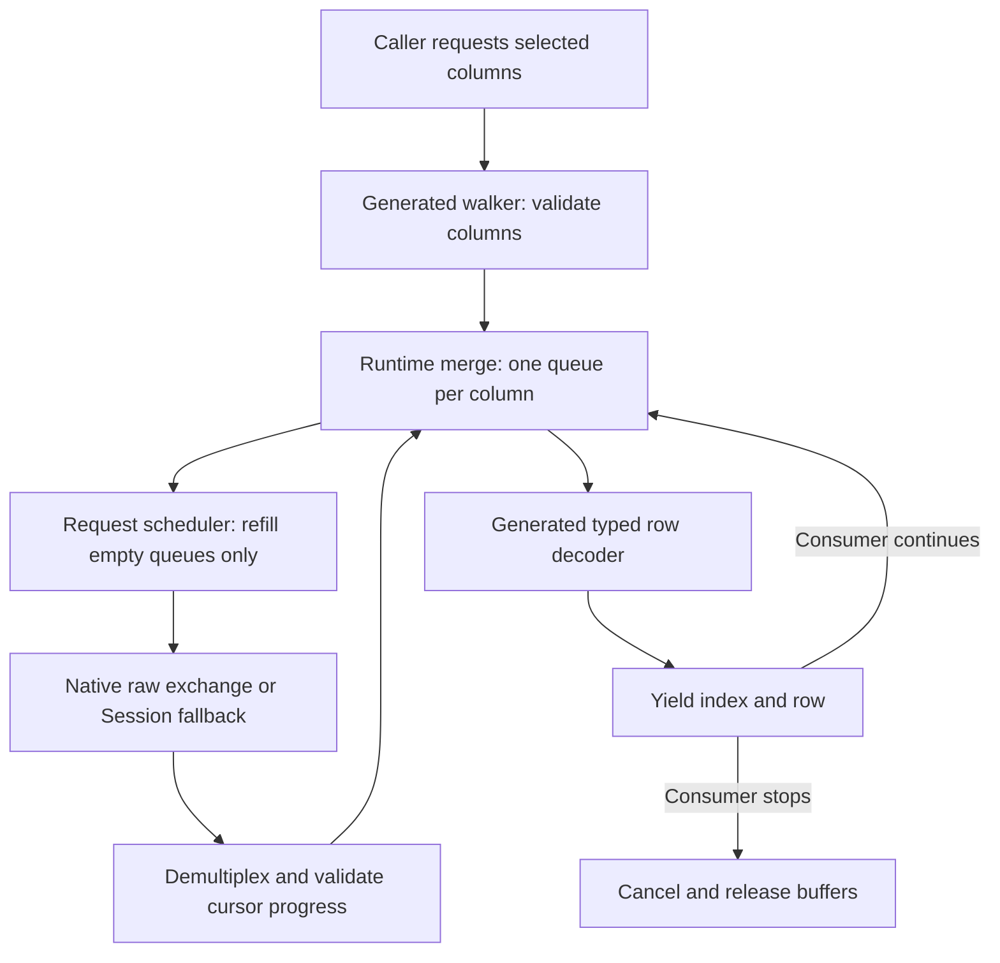
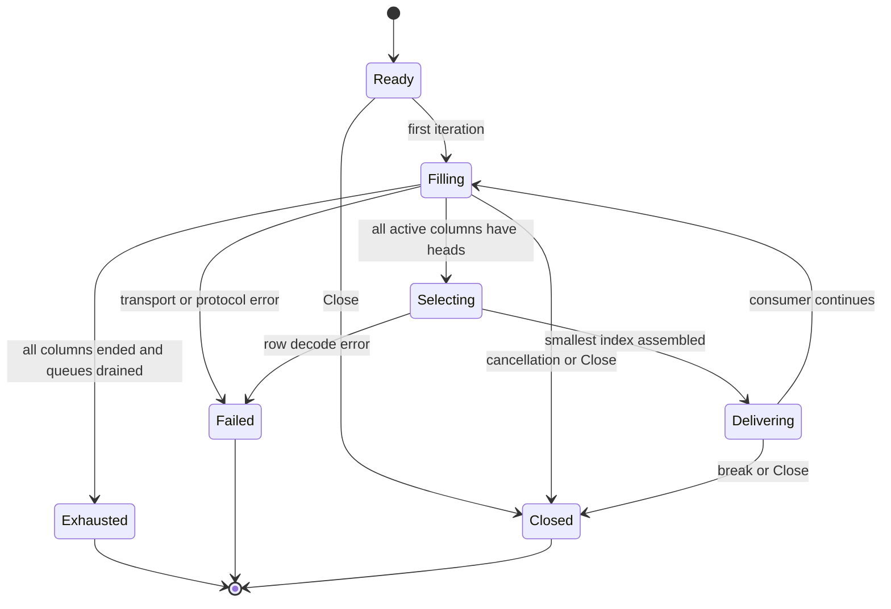

# Streaming MIB Table Walks - Plan

## Goal Capsule

- Objective: Callers can process and stop large device-table reads promptly without paying for every row and unrequested column first.
- Means: Selected-column GETBULK cursors with a bounded merge by row index (KTD1–KTD3).
- Authority: Repository conventions govern implementation; requirements below govern observable behavior; technical decisions govern the mechanism.
- Execution profile: Establish protocol and sparse-table regression coverage before replacing the generator's assembler.
- Stop conditions: A change that cannot preserve correct sparse-row output within the stated memory bound requires revising this plan, not quietly falling back to a full-table buffer.
- Tail ownership: Implementation includes regeneration, benchmark evidence, documentation, and the repository verification gate. This document authorizes planning only; implementation begins on user direction.

---

## Product Contract

### Summary

Replace generated MIB table walks with incremental retrieval of selected columns.
Rows become available as soon as their requested cells are known, and stopping iteration stops further retrieval.
Make the observable changes to row membership, ordering, and partial errors explicit.

### Problem Frame

Generated walkers currently consume `Session.BulkWalkRaw` for the table root into an index-keyed map before yielding anything.
Selecting columns affects decoding but does not reduce the walked subtree.
Large controller tables therefore incur full-walk traffic, allocations, and first-row latency even when a caller stops early.

The original buffer fixed duplicate row assembly over column-major responses.
Its replacement must join sparse columns correctly without assuming that corresponding response positions share a row index.
The existing 50-row benchmark cannot establish behavior at controller-scale cardinalities.

### Requirements

**Retrieval and delivery**

- R1. Generated `Walk` requests only explicitly selected column roots and their continuation cursors; it never intentionally continues into an unselected column.
- R2. Emit each discovered row once, in ascending OID arc order of its index suffix, when every selected column has supplied that index, passed it, or ended.
- R3. Bound internal retained data by selected-column count and batch size, independently of total table rows; consumer-retained results are outside that bound.
- R4. Breaking iteration, closing the walker, or canceling its context stops scheduling requests and releases internal buffers.

**Data and compatibility**

- R5. Returned indexes equal `Row.Index`; preserve typed values, tolerant decoding, and `Observed` distinctions between absent and reported-zero cells.
- R6. Preserve fused raw decoding for native sessions and equivalent decoded behavior for alternate `Session` implementations and SNMPv3 responses.
- R7. Preserve terminal error identity, walk budgets, timeout/retry controls, and tooBig degradation; never report an incomplete failed scan as successful exhaustion.
- R8. Keep existing generated `Walk(ctx, sess, cols...)` call sites source-compatible and keep the existing `Session` interface unchanged.
- R9. Document every intentional behavioral change and leave the independent watcher algorithm unchanged in this work.

### Assumed API behavior for this plan

These are proposed defaults inferred from the agreed selective-streaming direction, rather than choices explicitly made by the user.
They are the implementation baseline unless the user revises this plan.

- Rows are the union of indexes having real values in selected columns. A row visible only in an unrequested column disappears from this result set. No hidden discovery column or table-root scan is added.
- Selecting no columns returns an empty, successful iterator without network requests. Duplicate selections are deduplicated. Foreign or unknown column descriptors are rejected before I/O.
- Existing `Walk` uses bounded defaults. An additive options-bearing generated entry point exposes repetition count, columns per request, and existing per-call controls for callers that need tuning. Final exported names are implementation details.
- SNMPv1 retains the current generated-walk `ErrBulkUnsupported` behavior. GETNEXT degradation is for v2c/v3 tooBig handling, not a new v1 feature.

### Acceptance Examples

- AE1. Covers R1–R3, R5: `name` has indexes 1, 3, 7; `status` has 1, 2, 7. The result is 1, 2, 3, 7. Row 2 has no observed name; row 3 has no observed status. Index 1 can be delivered before either column ends.
- AE2. Covers R1, R3, R4: A 100,000-row fixture has 20 columns; a caller selects two and stops after the first row. Requests contain only those two column cursors and remain within the initial-batch request bound in KTD3.
- AE3. Covers R2, R5, R7: A typed decode fails at row 3. Previously delivered rows remain valid, row 3 and later rows are not delivered, and `Err` exposes the decode error.
- AE4. Covers R3, R7: One column ends immediately while another contains 100,000 rows. The ended column does not block row delivery or cause retained data to grow with table size.

### Scope Boundaries

This plan covers the common SNMP request/merge machinery needed by generated `Walk`, generator output, its consumers' regression tests, and walk benchmarks.
It introduces no new SNMP library dependency or vendor-specific fast path.

#### Deferred to Follow-Up Work

`Watcher.coldStart`, `collectTableWalk`, and `fullWalkAndDiff` independently buffer table data and stage events in `src/common/snmp/watcher.go`.
They do not call generated `Walk`.
Moving them to selective streaming needs separate decisions about indicator-only discovery, failed-scan events, and removal reconciliation.
Their snapshot is inherently proportional to known rows; this plan makes no constant-memory claim for `Watch`.
Index-only discovery and a full-table collection convenience API are also deferred.

---

## Planning Contract

### Grounding and prerequisites

The baseline is the current test layout under `src/common/snmp/test/integration/`.
Before implementation, integrate the earlier binding fixes from commit `7453bda` if equivalent changes are absent: initialized row indexes, presence-aware watcher equality, and named application wire kinds.
That commit used the older integration-test location, so preserve the current layout when reconciling it.

Use these existing mechanisms:

- `src/common/snmp/session_engine.go`: `exchange`, `rawItemsOf`, `nextBulkReps`, and the existing walk error/guard semantics.
- `src/common/snmp/rawwalk.go`: raw-value fallback and canonical OID helpers. Compare indexes with `OID.Compare` or the tested arc-aware comparator; neither dotted strings nor plain BER-byte lexicographic comparison is correct for arbitrary arcs.
- `src/common/snmp/cmd/mibgen/emit_table.go`: column validation, generated observation bits, fused/generic decode arms, and emitted lifecycle methods.
- `docs/solutions/architecture-patterns/snmp-collection-library-architecture-and-fast-path-conventions.md`: raw and generic paths must agree; generated packages use exported runtime APIs.
- `docs/solutions/architecture-patterns/decode-failure-blast-radius-in-generated-walks.md`: partial errors affect downstream fact collection. Keep that visibility explicit under the changed delivery order.

### Key Technical Decisions

- KTD1. Use multiple selected-column cursors in GETBULK requests. This implements R1 and R2. (session-settled: user-approved — chosen over whole-table buffering: reduce memory and unnecessary retrieval for large controller tables.) RFC 3416 section 4.2.3 defines independent successor streams for repeaters; the implementation follows that response layout.
- KTD2. Put protocol scheduling and row assembly in a shared exported runtime helper consumed by generated bindings. Keep `Session` unchanged under R8. A package-private optional raw-request capability on the native session preserves R6; other sessions use their public `GetBulk`/`GetNext` operations and wrap decoded values as `RawVarBind.VB`. The generator remains responsible for typed decoding and observation bits.
- KTD3. Retain at most one batch per column and refill only empty queues. Hold no map of all rows and start no per-column background pumps. Use defaults of 50 repetitions and at most 10 column cursors per request, honoring a smaller native session/call `MaxOIDs` limit. Options can lower or raise these bounded values within validated protocol/configuration limits. One request is outstanding per table walker. These are conservative starting settings, not a measured WLC optimum.
- KTD4. Demultiplex each response using the request's frozen cursor list and repetition stride, before removing completed columns. This implements R2 and R7 when responses end partway through a repetition or individual columns leave their subtree.
- KTD5. Decode typed rows only when they are selected for delivery, then discard their consumed queue entries. This preserves the decode-error prefix in AE3 and prevents an ahead-of-time typed decode in a later batch row from hiding earlier deliverable rows.
- KTD6. Use pull-driven iteration for the new helper. Construction validates inputs; requests start when iteration starts. Add an idempotent generated `Close`, retain `Err`, and make early `yield(false)` close the request context. Consumer stop/Close alone leaves `Err` nil; parent-context cancellation remains a terminal context error.
Final APIs must state single-consumer iteration and concurrent-close behavior.
Never hold a session lock across consumer code; the caller may issue a Get on the same session while processing a row.
- KTD7. Treat column selection as retrieval scope, as specified in the assumed API behavior. Preserving rows found only through unselected columns would require extra discovery traffic and would defeat R1. Callers needing a stable row census must explicitly select a suitable readable column.

### High-Level Technical Design



The merge performs a sorted union with lookahead, not a positional zip.
For every active column, first obtain either a queue head or proof of exhaustion.
Choose the smallest head index, consume matching heads from all columns, and mark other columns absent for that row.
A greater head proves that the column has already passed the chosen index.
A column with an empty queue and no terminal marker must be refilled before choosing the next index.
The helper must recover effective native session defaults for request width and total walk budget through the internal capability in KTD2.
For alternate sessions, expose helper-level defaults and explicit call overrides; do not claim access to private configuration inside someone else's session implementation.
The existing `RowBuffer` pump hint does not expand this pull iterator's prefetch window.

Directional scheduling sketch:

```text
while some column remains active or has queued values:
    obtain heads for empty, active column queues in bounded request groups
    if retrieval failed: stop with the terminal error
    choose the smallest index among queue heads
    assemble the cells whose heads have that index
    yield that row; stop immediately if the consumer declines
```

With C selected columns and M repetitions, queues hold at most C × M cells.
There is one row under assembly, O(C) cursor state, and one in-flight response.
For a dense first batch, the first yield needs at most ceil(C / effective-columns-per-request) successful data requests, independent of row count.
Retries and size degradation add requests; sparse columns may need more lookahead, but not more retained batches.

Raw slices can pin entire response buffers even after most cells are consumed.
Release queue backing arrays and frame references as they drain, and account for pinned frames in memory measurements.
Returned row values must remain valid after the next iteration and after close.
The memory claim is independent of row count, not of payload size, column count, or results retained by the caller.



### Protocol and failure decisions

These specify R7 for the new multi-column engine.

| Condition | Required action |
| --- | --- |
| Response shorter than requested, including a partial repetition | Accept valid returned cells. Advance only the cursors represented in that response. A missing slot is not an absent table cell or proof of exhaustion. Rotate omitted empty cursors ahead of serviced ones on the next request. |
| Response longer than the legal repetition/request bound | Reject as a protocol error before growing per-column queues beyond their bound. |
| Value names a selected column without an index suffix | Reject as malformed table data; do not construct an empty-index row. |
| Cursor leaves its selected column or receives EndOfMibView / NoSuchObject | End that column only. Discard spillover values; never reassign them to another requested column. |
| Forward NoSuchInstance | Omit the cell, advance that cursor, and charge the walk budget. No real value means no row solely from this exception. |
| Repeated or decreasing OID | Validate against that column's request cursor and last accepted OID, not the globally interleaved response. Preserve duplicate rejection and configured skip behavior for decreasing OIDs. |
| Empty response or response with no usable forward progress | Isolate/retry the affected cursor once with GETNEXT; if it still cannot progress or prove exhaustion, terminate with a distinguishable progress error. Never loop indefinitely or call it a complete scan. |
| tooBig | Retry identical cursors with fewer repetitions. At one repetition, split the cursor group; a single cursor still failing bulk falls back to GETNEXT. GETNEXT failure is terminal. |
| Timeout or exhausted retries | Return the error, preserving already delivered rows. Do not flush rows whose completeness is unknown. |
| Varbind budget exceeded | Apply one budget across the whole selected-column walk, including skipped in-scope exceptions. Return `ErrMaxWalkVars`; it is not an independent budget per cursor. |
| Context cancellation | Surface the original context error through `Err`; stop scheduling and cancel the in-flight exchange. |

A transport or raw-PDU validation failure may prevent delivery of additional buffered rows; the contract guarantees the already-delivered prefix, not recovery from an unreadable response.
A typed cell decode error follows KTD5 and AE3.
SNMP tables can change between requests; neither buffering nor streaming creates an atomic device snapshot.
Rows inserted behind an advanced cursor may be missed until the next walk.

### Compatibility and rollout

| Surface | Result |
| --- | --- |
| Existing generated `Walk` signature | Preserved; default behavior becomes selective streaming. |
| `Session` implementers | No added interface methods; the fallback now needs functional `GetBulk`/`GetNext`. Test fakes that only implement `BulkWalk` behavior must change. |
| Zero selected columns | Empty result with no I/O, replacing index-only discovery. |
| Row ordering | OID arc order across the selected-column union, replacing first appearance across the table-root walk. This changes some sparse-table results even for conforming agents. |
| Raw rows and observation bits | Preserve R5 and R6; no mutation or reuse of previously yielded row payloads. |
| Generated lifecycle | Lazy start and additive `Close`; early break prevents the next refill. Consumer stop is distinct from parent-context cancellation under KTD6. |
| Broken-agent progress | An empty/no-progress response gets one bounded GETNEXT recovery attempt and then an error, replacing the old walk engine's successful early exit in that case. |
| `Watch` | Retains its own full-walk and snapshot semantics under R9. |

Update misleading index-order examples in the emitter: numeric OID arcs put `192.168.0.2` before `192.168.0.10`.
Audit in-repository generated-walk callers, especially `src/common/snmpmap/`, for ordering, zero-column, and row-census assumptions.
Consumers that already select a required identity column retain their intended discovery scope.
Document these changes with the generator update; do not leave an undocumented compatibility fallback that fetches the table root.

### Risks and evidence limits

The sources establish protocol behavior, not WLC-specific safe request sizes or performance.
Large payloads may require lower repetitions; tooBig adaptation and a configurable request width address this without a vendor branch.
Repeatedly short responses need fair cursor scheduling to prevent starvation.
A fallback session can internally allocate or buffer beyond the helper's control; prove the stated end-to-end bounds for native sessions and use the fallback contract only for its own retained data.

---

## Implementation Units

### U1. Add bounded multi-column request support

**Goal:** Supply raw or decoded response batches for selected cursor groups without changing `Session`.
**Requirements:** R1, R6–R8; KTD1–KTD4.
**Dependencies:** Earlier binding fixes integrated or verified equivalent.
**Files:** New `src/common/snmp/column_request.go` and `column_request_test.go`; modify `session_engine.go`, `options.go`, and `rawwalk_test.go` only where shared controls or parity coverage require it.
**Approach:** Add the native optional request capability and the public-operation fallback. Keep request-shape validation, error-index interpretation, tooBig retries, and raw ownership at this boundary. Reuse the existing exchange/authentication path and instrumentation rather than creating another transport.
**Patterns:** `rawItemsOf`, `nextBulkReps`, `TestBulkWalkRaw_DifferentialWithBulkWalk`.
**Execution note:** Start with scripted request/response cases that expose multi-cursor layout and truncation.

**Test scenarios:**

1. Interleaved two-column responses map to the original cursor slots, including a response ending after only the first slot of the final repetition.
2. One cursor ends mid-response while another continues; remaining slots keep their original mapping.
3. tooBig reduces repetitions, then request width, then uses singleton GETNEXT without skipping or repeating delivered data.
4. Raw native, decoded fallback, and v3 fixture paths produce equivalent cells and errors.
5. Native call/session limits and instrumentation apply to every request; cancellation and retry exhaustion preserve error identity.
6. Invalid options and overlong response batches fail before unbounded allocation; v1 keeps its unsupported-bulk result.

**Verification:** Request traces show the intended cursor groups, bounds, and fallback sequence; raw/decoded differential cases agree.

### U2. Implement the bounded sparse-row merge

**Goal:** Deliver complete selected-column rows with structural memory bounds and pull-driven backpressure.
**Requirements:** R2–R4, R7; KTD3–KTD6; AE1, AE2, AE4.
**Dependencies:** U1.
**Files:** New `src/common/snmp/column_walk.go`, `column_walk_test.go`, and `column_walk_external_test.go`; reuse `oid.go` and `rawwalk.go` helpers without unrelated refactors.
**Approach:** Implement the queue/head algorithm and lifecycle in the shared helper. Track progress and walk budgets across cursor groups. Keep metrics used only by tests internal rather than adding a public observability subsystem.

**Test scenarios:**

1. Covers AE1: Sparse indexes merge to 1, 2, 3, 7 with cells attached to their actual indexes.
2. Covers AE4: An empty or early-ended column does not delay rows from a long column.
3. Highly skewed, disjoint columns never retain more than the batch bound; an advanced queue remains paused until consumed.
4. Composite indexes, prefix-related suffixes, and arcs at 127/128 and 16383/16384 boundaries sort by OID arc order.
5. Short responses that repeatedly omit later slots are scheduled fairly; an empty or no-progress singleton eventually errors rather than looping or silently succeeding.
6. Covers AE2: Break after the first dense row schedules no further refill. Close before iteration sends nothing; cancellation during a request stops it; repeated Close is safe. Stop/Close leave `Err` nil while parent cancellation reports its original error.
7. Global varbind budget exhaustion and duplicate/decreasing OID cases retain the already-delivered prefix and report the expected terminal error.
8. Holding a yielded row while continuing or closing the iterator does not mutate its payload; drained queues release their frame references.
9. A consumer can complete a Get on the same session between yielded rows without deadlock. Empty index suffixes are rejected.

**Verification:** Deterministic tests prove the queue cap, cancellation behavior, and request-count bound independently of timing benchmarks.

### U3. Generate streaming table walkers and migrate consumers

**Goal:** Route every generated table `Walk` through the shared merge while preserving typed decoding.
**Requirements:** R1–R9; KTD1, KTD2, KTD5–KTD7; AE1–AE3.
**Dependencies:** U2.
**Files:** `src/common/snmp/cmd/mibgen/emit_table.go`, `src/common/snmp/cmd/mibgen/emit_test.go`, and `src/common/snmp/cmd/mibgen/testdata/golden/fakemib/mib.go`; `src/common/snmp/test/integration/assertions_test.go`, `presence_test.go`, and new `streaming_walk_test.go`; affected `src/common/snmpmap/` tests; regenerated modules under `generated/go/mib/`.
**Approach:** Replace emitted table maps/order arrays with iteration over runtime rows. Preserve fused/generic decode arms, `Row.Index`, and observation bits. Generate option and Close forwarding. Validate membership against the actual known column set, not merely the entry prefix. Update fakes to answer lexicographic GetBulk/GetNext requests and migrate affected call-site assumptions.
**Patterns:** Existing presence and foreign-column tests; generated raw-path conformance; the earlier binding-fix regression coverage.

**Test scenarios:**

1. Covers AE1 and AE3: Generated IF-MIB and composite-index LLDP rows agree with the merge and preserve the typed-error prefix.
2. An unselected-only row is absent; zero selections do no I/O; duplicate selections produce no duplicate request streams; foreign and unknown columns fail before I/O.
3. Wire requests contain only selected roots/cursors. Values from spillover columns never set fields or create rows.
4. Reported zero versus absent cells, BITS, named TimeTicks, and generic fallback decode retain their existing results.
5. Covers AE2: Generated early break and Close prevent further retrieval; retained row values remain stable.
6. Existing mapping behavior remains correct with selected identity columns; watcher presence/equality and full-walk tests remain unchanged in behavior.

**Verification:** All configured MIB outputs regenerate cleanly and the freshness check passes. Generated integration tests exercise real request semantics rather than handing the assembler preordered rows.

### U4. Establish scale evidence and document the contract

**Goal:** Prove reduced first-row cost and bounded retained memory, and publish the API migration facts.
**Requirements:** R1, R3, R4, R9; AE2.
**Dependencies:** U3.
**Files:** `src/common/snmp/bench/tablewalk_test.go`, `micro_test.go`, `responder_test.go`, `doc.go`; `src/common/snmp/doc.go`; the two SNMP architecture/decode learnings cited above where claims become stale; a dated benchmark report under `docs/benchmarks/`.
**Approach:** Parameterize the local responder for dense/sparse tables and multi-cursor GETBULK. Retain GoSNMP collection measurements but add a callback-streaming comparison. Measure generated row assembly separately from raw-value client comparisons. Record fixture construction outside measured work and avoid retaining all results in the benchmark consumer.

**Test and benchmark scenarios:**

1. 50, 1,000, 10,000, and 100,000 rows, with 2 selected columns out of 20 and a wider selected set.
2. Dense, disjoint sparse, missing-first-cell, and entirely absent columns; short/truncated response batches and variable payload sizes.
3. Full completion, first-row latency, and early termination after 1 and 100 rows; report requests, bytes, allocations, peak retained heap, and queue high-water marks.
4. Compare the parent implementation and new implementation on the same fixtures. Compare raw FlowSeer, GoSNMP callback, GoSNMP collection, and Net-SNMP traversal only at matching semantic layers.
5. Keep C allocations out of Go-only heap comparisons; Net-SNMP's current cgo wrapper counts values and does not assemble typed rows.

**Verification:** The measurable gates below pass. The report distinguishes synthetic evidence from any later live-device validation and explains any throughput tradeoff introduced by selective cursors.

---

## Verification Contract

Planning itself does not run implementation tests.
During implementation, use deterministic protocol tests for correctness and local responder benchmarks for cost.
No production controller is required for completion.

| Evidence | Required outcome |
| --- | --- |
| Sparse merge and lifecycle tests | Every scenario in U1–U3 passes under the race detector. |
| Bound proof | Retained queued cells never exceed C × M; no table-sized map or accumulated result/event slice exists in the new walk path. Include response-frame retention in the audit. |
| Early-stop request count | On a dense fixture without retries/tooBig, first-row delivery and break need at most ceil(C / effective-columns-per-request) requests for every tested row count. |
| Traffic selection | Request OIDs never intentionally traverse unselected columns. A final GETBULK response may spill beyond a column boundary; discard it rather than asserting impossible zero spillover. |
| Heap scaling | With fixed C, M, and payload size, isolated walk-owned peak retained heap at 100,000 rows is no more than twice its 1,000-row value after excluding fixture/consumer storage. Record the measurement method and raw results. |
| Throughput | Report complete-walk time and allocation deltas; investigate regressions greater than 20% on the dense 50-row control before acceptance. This threshold is a proposed engineering gate, not a measured result. |
| Generation | `go run ./src/common/snmp/cmd/mibgen -check` passes after supported regeneration and golden refresh. Never hand-edit generated files. |
| Repository gates | `.claude/skills/verify-change/scripts/verify-change.sh --full` passes for the completed cross-module change, including build, vet, race tests, formatting, and lint. |

Use the owning benchmark module for benchmarks; root module test runs do not cover it.
Live Net-SNMP or snmpsim checks are useful supplemental evidence when their fixtures are available.
Do not describe synthetic results as Cisco WLC validation.

---

## Definition of Done

All implementation units meet their verification outcomes and all requirements are traced to passing tests or recorded measurements.
Generated rows stream before whole-table completion, selected-column request traces match the contract, and early termination saves retrieval work.
The report includes memory scaling and a fair GoSNMP callback comparison.
Documentation explains membership/order/error changes and the separate watcher limitation.
Remove experimental implementations and abandoned compatibility paths from the final diff.

---

## Sources

- [RFC 3416 section 4.2.3](https://www.rfc-editor.org/rfc/rfc3416.html#section-4.2.3): Independent repeaters and response truncation govern KTD1 and KTD4.
- [Net-SNMP snmpbulkwalk source](https://github.com/net-snmp/net-snmp/blob/master/apps/snmpbulkwalk.c): Incremental value traversal, used for the raw-client comparison.
- [Net-SNMP snmptable source](https://github.com/net-snmp/net-snmp/blob/master/apps/snmptable.c): Its default bulk path accumulates table cells for formatted output; it is not a bounded-row reference implementation.
- [GoSNMP v1.43.2 walk source](https://github.com/gosnmp/gosnmp/blob/v1.43.2/walk.go): Callback versus collecting API distinction used in U4.
- [SNMP4J TableUtils](https://agentpp.com/doc/snmp4j/org.snmp4j/org/snmp4j/util/TableUtils.html): Selected-column retrieval and row callbacks support the chosen API shape.
- [SNMP4J maintainer discussion of row-cache growth](https://forum.snmp.app/t/tableutils-tablelistener-next-and-rowcache/923): Sparse rows can prevent release even with callbacks; KTD3 prevents ahead-of-cursor accumulation.

External sources were inspected on 2026-09-03. Mutable upstream source links establish approach and pitfalls, not a dependency pin or measured performance guarantee.
