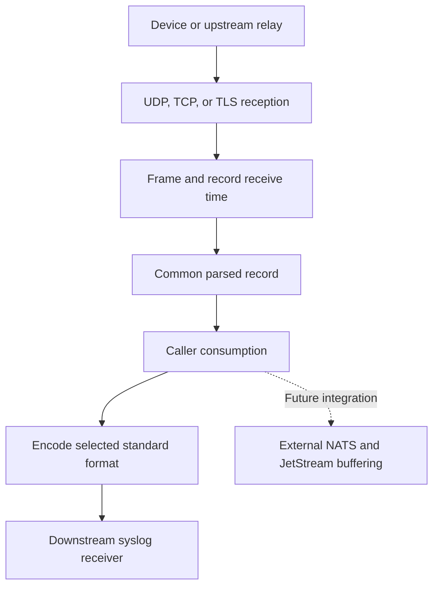
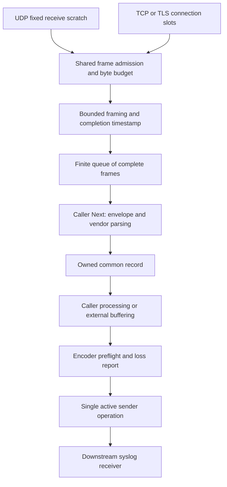
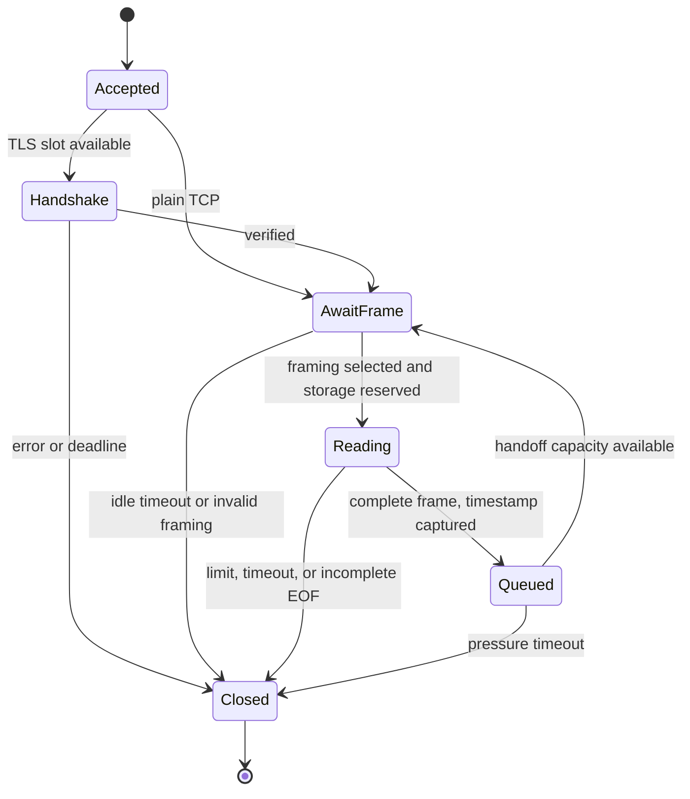
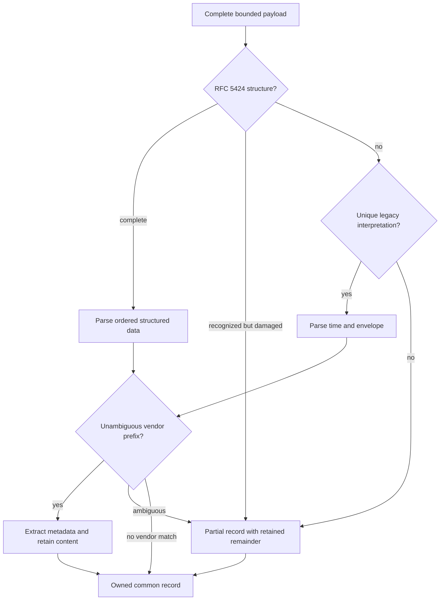

# Shared Syslog Library - Plan

> Implemented. The library later moved from `src/common/syslog` to
> `src/protocol/syslog`; use the current package and benchmark report for landed
> behavior, and treat paths below as implementation history.

## Goal Capsule

- **Objective:** Future edge agents and core services can receive and forward logs from heterogeneous network devices through one parsed message model, including when device clocks or message formats are unreliable.
- **Means:** A shared Go syslog library under `src/common/syslog` (KTD1).
- **Product authority:** The Product Contract below records the confirmed scope; the accepted device-service and inventory direction supplies the surrounding ingestion context.
- **Execution profile:** Implement the corpus before optimizing; prove compatibility and resource limits through the Verification Contract.
- **Stop conditions:** Revisit the design if a resource bound cannot be enforced or a change would weaken a confirmed requirement.
- **Tail ownership:** This plan ends with a locally verified library and documentation. Service integration and broker delivery remain separate work.

---

## Product Contract

### Summary

Provide reusable syslog reception, parsing, and sending over UDP, TCP, and TLS.
Expose one common message model with receive time, device time, parsed vendor metadata, and optional original bytes.
Keep durable buffering with the caller and enforce finite bounds on library-owned resources.

### Problem Frame

Network devices do not share one practical log grammar.
A vendor can ship several operating systems, and configuration can change timestamps, header fields, or the entire envelope.
A strict parser can discard useful messages, while an overconfident parser can assign body text to the wrong field.
Incorrect device clocks also make event time insufficient for establishing when an event reached FlowSeer.

The future edge agent is intended to buffer through embedded NATS with local JetStream.
Adding another persistent queue to the protocol library would duplicate delivery policy, but relying on downstream buffering alone would leave socket, parser, and connection memory uncontrolled.

### Key Decisions

- **One common parsed record.** Callers consume a stable representation across input dialects. Governs R4, R5, R8. (session-settled: user-directed — chosen over original-payload-first forwarding: the user wants parsed messages as the common format, with optional `_raw`.)
- **Receive time has its own meaning.** Incorrect device clocks must not overwrite the evidence of reception. Governs R6, R7. (session-settled: user-approved — chosen over a single timestamp: record receive time independently and preserve device-time uncertainty.)
- **External buffering and caller-controlled pressure.** The future edge agent supplies delivery policy through its embedded broker. Governs R16, R17, R18. (session-settled: user-directed — chosen over a library-owned relay queue: the enclosing NATS/JetStream layer will handle buffering.)
- **All three transports in the initial scope.** This covers legacy senders and encrypted connections. Governs R2, R3. (session-settled: user-directed — chosen over UDP-only or UDP/TCP-only delivery: include UDP, TCP, and TLS in both directions.)
- **Raw capture is opt-in; standard wire output is selectable.** These defaults keep retained data optional and permit legacy receivers. Governs R8, R12, R13. (session-settled: user-approved — chosen over always retaining raw data or always emitting RFC 5424: the confirmed scope permits raw capture and either standard output format.)

<!-- ce-section: work-relationships -->
### How This Work Fits Together

This plan owns the protocol library.
The current surrounding direction is described in [Device Service, Integrations, and Inventory](../architecture/2026-08-20-device-service-and-inventory-direction.md), especially its Edge attachment and enrollment section.
These relationships orient future work without committing a delivery schedule:

- Future edge-agent ingestion depends on this library for syslog reception and can pass common records into its local JetStream stream.
- Future core services can consume or forward records through the same library independently of an edge deployment.
- Embedding the broker, defining NATS subjects and message serialization, and preserving edge-receive metadata across that fabric belong to the enclosing integration work.

### Actors

- A1. A network device or upstream relay sends messages in a supported or unfamiliar format.
- A2. A Go caller in an edge agent, core service, or test harness configures the library and consumes common records.
- A3. A downstream syslog receiver accepts messages emitted by the library.

### Requirements

**Library and transports**

- R1. The shared library provides standalone parsing and embeddable server/sender capabilities without a runtime dependency on an edge agent, core service, or NATS.
- R2. Receiving and sending support UDP, TCP, and TLS with caller-supplied transport and TLS configuration.
- R3. Stream framing supports octet-counted and delimiter-based messages independently of payload parsing, including messages split across reads or coalesced in one read.

**Common message and time**

- R4. Every accepted input produces the same common message representation, including partial records for unfamiliar or malformed payloads.
- R5. The representation carries available syslog header fields, structured data, message content, vendor metadata, parse diagnostics, and observed transport-source information without conflating reported and observed identities.
- R6. Network reception records the receiver's wall-clock time when a complete message becomes available to the library, before parsing or caller handoff; later parsing and sending do not replace that timestamp.
- R7. Device time remains separate from receive time and retains its original representation plus any missing components, inferred components, or clock-quality indicators.
- R8. Caller-enabled raw capture carries the exact received syslog payload in an optional `_raw` field, excluding transport framing; raw capture is disabled by default.
- R9. Library-owned record data has a documented lifetime, and callers have an explicit way to retain it beyond reception without accidental mutation or use after buffer reuse.

**Compatibility and interpretation**

- R10. Parsing covers RFC 5424, tolerant legacy/BSD-style envelopes, and the documented vendor families in the compatibility matrix below, with compatibility taking priority over strict rejection.
- R11. Vendor interpretation extracts metadata such as module, event code, sequence, and vendor severity while preserving message content and keeping vendor fields distinct from outer syslog fields.
- R12. Outbound sending encodes the common record into caller-selected RFC 5424 or legacy RFC 3164 wire messages.
- R13. Sending reports data that cannot be represented in the selected wire format and does not silently substitute receive time for device time or fabricate absent identity information.
- R14. Unknown or ambiguous fields remain unparsed with diagnostics instead of being confidently misclassified, and unfamiliar structured-data elements or byte sequences are not silently discarded.
- R15. Resource-limit rejection or transport truncation is distinguishable from successful complete reception, and one malformed payload cannot cause unbounded recovery work or corrupt an independently framed following message.

**Memory, pressure, and lifecycle**

- R16. Library-owned resources have finite validated limits and safe defaults that bound aggregate memory across active connections, in-flight messages, partial frames, parser expansion, and retained internal state.
- R17. Slow consumers propagate pressure through the caller interface and TCP/TLS reception, while outbound work respects caller cancellation and deadlines without an unbounded pending queue.
- R18. UDP overload drops new arrivals when the available receive/handoff capacity is exhausted, with observable library drops and an explicit distinction from losses outside the library's visibility.
- R19. Connections, incomplete frames, TLS handshakes, and blocked library operations have bounded occupancy and a shutdown path that releases library-owned resources.
- R20. Diagnostics and operational counters remain usable under malformed-input floods without creating unbounded per-message history or per-source cardinality.

**Evidence and performance**

- R21. A committed compatibility corpus records each example's family, relevant firmware/configuration, provenance, and expected extracted fields, distinguishing packet captures from manual examples and receiver-rendered logs.
- R22. Fuzzing and regression cases exercise parser/framer failures and resource bounds, including oversized input, incomplete streams, malformed lengths, and raw-enabled retention.
- R23. Reproducible benchmarks measure throughput and allocations on a mixed vendor corpus, and sustained overload tests demonstrate a library-owned memory plateau under the R16 limits.
- R24. Optimizations preserve corpus behavior and cannot narrow compatibility to the benchmark's simplest message shape.

### Compatibility Matrix and Research

The matrix is the initial coverage target for R10 and R21, not a claim of tested interoperability.
Research used vendor documentation on 2026-09-03; firmware age and configuration are part of the evidence.
A proprietary body does not by itself make the outer syslog envelope invalid.
Exact stream terminators, byte encodings, and wire-only quirks still need sourced fixtures or captures.

| Vendor / family | Evidence relevant to parsing | Fixture focus |
| --- | --- | --- |
| NETGEAR M4300 | The manual identifies remote syslog with a BSD-like timestamp, host or IP/stack token, component/thread, source location, and sequence before `%%`. [Manual, p. 911](https://www.downloads.netgear.com/files/GDC/M4300/M4300_M4300-96X_UM_EN.pdf#page=911). | Stack identifiers, component/thread boundary, source location, and sequence extraction. |
| D-Link DWS-3000 and DGS-1100 | DWS examples include whitespace after PRI, uppercase month names, hexadecimal thread IDs, and source/sequence information; DGS documents event bodies such as `POE:` and `ZONEDEFENSE:`. [DWS guide, p. 185](https://ftp.dlink.de/dws/dws-3024/documentation/DWS-3000_Series_Config_Guide_v3.x.pdf), [DGS reference](https://support.dlink.com/resource/products/DGS-1100-24PV2/REVA/DGS-1100-V2-SERIES_REVA_WEB_UI_REFERENCE_GUIDE_v2.00_WW.pdf). | Variations in whitespace and identifiers; body-only references are not proof of the complete wire envelope. |
| Cisco IOS / IOS-XE | Optional sequence and configurable timestamp precede `%FACILITY-SEVERITY-MNEMONIC:`; clock synchronization markers and uptime timestamps exist. [Cisco guide](https://www.cisco.com/c/en/us/td/docs/ios-xml/ios/esm/configuration/xe-2/esm-xe-2-book.pdf). | Sequence numbers, clock markers, fractional seconds, timezone variants, uptime, and module/severity/mnemonic. |
| Cisco NX-OS | Message prefixes can include slot or standby information; the manual separately illustrates resident-switch output and remote-server-rendered output. [NX-OS reference](https://www.cisco.com/c/en/us/td/docs/switches/datacenter/nexus5500/sw/system_messages/reference/sl_nxos_book/sl_intro.html). | Slot/standby metadata; do not mistake receiver-added timestamps for bytes emitted by the switch. |
| Cisco ASA | `%ASA-severity-messageID:` is distinct from IOS mnemonics, and a documented ISO-timestamp example does not have a complete RFC 5424 header. [ASA reference](https://www.cisco.com/c/en/us/td/docs/security/asa/syslog/asa-syslog/about.html). | Numeric event IDs and ISO timestamps in legacy envelopes; timestamp syntax alone cannot select RFC 5424. |
| Huawei VRP / CloudEngine | Detailed prefixes include `%%01MODULE/severity/BRIEF(flags):`; configurable brief output can omit the module, severity, and summary. [CloudEngine reference](https://info.support.huawei.com/enterprise/en/doc/EDOC1100439389/39d8e202/information-management-configuration-commands). | Detailed and reduced records, prefix flags, missing fields, and configured timestamp shapes. |
| RUCKUS ICX / FastIron | The monitoring guide documents default RFC 3164 and configurable RFC 5424 output with richer headers and structured data. [FastIron guide](https://support.ruckuswireless.com/documents/4702-fastiron-10-0-20-ga-monitoring-configuration-guide). | Both envelope families; local `show logging` examples need wire validation before they serve as reception fixtures. |
| HP/HPE Comware | Remote prefixes use `%%10MODULE/level/MNEMONIC:`; year-bearing dates, ISO forms, and absent time information differ from console formatting. [Comware guide, pp. 52-53](https://arubanetworking.hpe.com/techdocs/comware/12900E_R5210/HPEFlexFabric12900ESystmMgmntCG_R5210.pdf). | Slash-delimited metadata, year position, missing timezone/time, and console-versus-log-host distinctions. |
| HP ProCurve / ArubaOS-Switch | Messages carry numeric event IDs followed by subsystem text; origin identification can use host name, address, or be omitted. [AOS-S documentation](https://arubanetworking.hpe.com/techdocs/AOS-S/16.11/MCG/YC/content/common%20files/log-ori-id_1.htm). | Optional origin, numeric event IDs, and subsystem boundaries. |
| HPE Aruba AOS-CX | A documented syslog example contains a process tag and pipe-separated `Event` body with an event ID, log level, and empty positions. [Developer example](https://developer.arubanetworks.com/aoscx/v10.04/docs/stackstorm-with-ansible-and-syslog). | Preserve empty metadata positions and the remaining description. |
| Extreme ExtremeXOS / Switch Engine | Per-target configuration changes dates, timestamp precision, optional identity/priority, tags, and event/source information. [Command reference](https://documentation.extremenetworks.com/exos_commands_31.6/GUID-5AD413EE-EEB4-400B-81E2-824C87ECFE76.shtml). | Configured omissions and date shapes; ambiguous numeric dates require explicit interpretation context. |
| Extreme SLX-OS / VOSS | SLX has legacy and RFC 5424 output with vendor structured-data elements; VOSS can retain an older format through saved configurations. [SLX reference](https://documentation.extremenetworks.com/slxos/sw/20xx/20.5.3/messages/downloads/slx-20.5.3-messageref.pdf), [VOSS release notes](https://documentation.extremenetworks.com/release_notes/VOSS/ReleaseNoteVOSS_8.2_RN.pdf). | Structural envelope detection, unknown structured data, and retained legacy configurations. |

The standards anchors are [RFC 5424](https://www.rfc-editor.org/rfc/rfc5424.html) for structured messages, [RFC 3164](https://www.rfc-editor.org/rfc/rfc3164.html) for historical BSD behavior, [RFC 6587](https://www.rfc-editor.org/rfc/rfc6587.html) for TCP framing, [RFC 5425](https://www.rfc-editor.org/rfc/rfc5425.html) for TLS transport, and [RFC 5426](https://www.rfc-editor.org/rfc/rfc5426.html) for UDP transport.
Compatibility extensions do not make a malformed input standards-conformant; R14 preserves that distinction in the parsed result.

### Key Flows

- F1. **Receive and consume.** A1 sends a message; the server frames it, records reception, parses it, and hands the common record to A2. A2 decides downstream delivery. Covers R2-R11, R14-R18.
- F2. **Forward a common record.** A2 chooses the destination, transport, and wire format; the sender validates representability, encodes, and reports the outcome to A2. Covers R2, R6, R12, R13, R17.
- F3. **Survive a stalled consumer.** A2 stops accepting records; stream reads slow, UDP overload follows its drop policy, finite resource occupancy holds, and shutdown remains available. Covers R16-R20.



The server/record path belongs to this plan; the dotted path is caller-owned context per Scope Boundaries.

### Acceptance Examples

The examples are behavioral contracts under the cited requirements, not additional wire-format specifications.

| Example | Input or condition | Observable outcome | Covers |
| --- | --- | --- | --- |
| AE1. Unsynchronized Cisco device | Illustrative payload `<187>42: *Sep 3 10:00:00.000: %LINK-3-UPDOWN: Interface Gi1/0/1, changed state to down` arrives at receiver time `2026-09-03T08:15:12Z`. | The record retains that receive time, the clock marker and partial device-time text, and extracted Cisco metadata; it does not claim the two clocks agree. | R4-R7, R10, R11 |
| AE2. Wrong device year | A complete timestamp reports 2005 while reception occurs in 2026. | Both times remain available independently through parsing and sending; any representational loss on encoding is reported. | R6, R7, R13 |
| AE3. Raw capture selection | The same message is parsed with raw capture off and on. | Parsed fields match; only the enabled result carries `_raw`, with payload bytes preserved exactly and transport framing excluded. | R8, R9 |
| AE4. Unknown message | A complete in-limit message does not match a known envelope. | The caller gets a partial common record with unparsed content and diagnostics; any separate copy retained for `_raw` follows the selected capture setting. | R4, R8, R14 |
| AE5. Ambiguous legacy time or header | An input omits timezone/hostname or uses an ambiguous numeric date. | Missing or ambiguous fields remain distinguishable from known fields, and any caller-assisted inference is marked. | R5, R7, R14 |
| AE6. Segmented stream | Octet-counted messages arrive one byte at a time, and multiple delimiter-framed messages arrive in one read. | Message boundaries are preserved within the selected framing rules, and each complete message receives its own reception observation. | R3, R6, R15 |
| AE7. Hostile frame | A peer advertises an excessive length, withholds a delimiter, or never completes a TLS handshake. | The input cannot grow library-owned memory or occupancy beyond the configured limits, and the limit outcome is observable. | R15, R16, R19, R20 |
| AE8. Consumer stall | The caller stops consuming during sustained traffic. | The configured resource bound holds; stream pressure propagates and observable UDP overload drops new arrivals. | R16-R20, R23 |
| AE9. Output mismatch | The chosen output format cannot represent metadata or required fields are unavailable. | The sender reports the mismatch without silently inventing hostname/device time or losing unsupported information. | R12, R13 |
| AE10. Shutdown under pressure | The caller cancels while reads, handoff, or writes are blocked. | Library operations terminate and release their owned resources without spawning replacement work. | R17, R19 |
| AE11. Mixed corpus after optimization | An optimized parser is run against known, malformed, and partial examples from every matrix family. | The expected fields, diagnostics, and raw behavior remain unchanged; benchmark evidence covers the mixed workload. | R21-R24 |
| AE12. Retained record | The caller retains a received message using the documented retention operation while reception buffers are reused. | The retained message and optional raw bytes remain stable, with ownership and memory responsibility explicit. | R8, R9, R16 |
| AE13. Independent following frame | A malformed payload is followed by a valid message in a stream with known independent frame boundaries. | The malformed payload gets its own result/diagnostics and the valid message parses correctly. | R3, R4, R14, R15 |

### Scope Boundaries

This work excludes NATS embedding, broker subjects/serialization, durable queues, routing rules, retry scheduling, service wiring, and device logging configuration.
Those are responsibilities of the enclosing application rather than hidden behavior behind the protocol API.

Vendor event descriptions remain content: mapping them into FlowSeer domain events, correlating events, deduplication, and inferring clock corrections are outside this library's initial scope.
The named matrix families are coverage requirements; they do not imply certification of every firmware release or all product lines sold under each vendor name.

### Dependencies and Assumptions

- The accepted ingestion direction is architectural intent; this library does not require the broker integration to exist first.
- Existing `src/common/snmp/trap.go` is an adjacent reception/lifecycle example, but its drop-oldest policy does not satisfy R18 and must not be inherited unchanged.
- Manual examples are enough to discover grammar families, not to prove exact wire interoperability. R21 keeps that evidence distinction visible.
- Receive time is an application observation after a complete frame is available, not a hardware packet-arrival timestamp or proof that the receiver's own clock is accurate.
- The R16 guarantee covers library-owned resources; caller-retained messages, broker buffers, operating-system socket memory, and runtime overhead must be identified separately when reporting whole-process memory.
- No deployment-specific throughput target or fixed memory budget was supplied. R23 requires measurements; numerical baselines and default limits must be established during planning without weakening R16 or R24.

### Planning Question Resolution

The common record and retention contract are resolved in KTD2; time handling in KTD3; framing in KTD5; resource limits in KTD6 and KTD8; caller pressure and cancellation in KTD7 and KTD10; encoding in KTD9; and parser reuse and measurement in KTD1 and KTD11.
Execution-dependent measurements are identified under Deferred Implementation Evidence.

---

## Planning Contract

**Product Contract preservation:** Product Contract unchanged. The former planning-question list now points to its technical decisions; R1-R24, A1-A3, F1-F3, and AE1-AE13 retain their meaning and IDs.

### Key Technical Decisions

- KTD1. **Own the common model, parser, framing, receiver, and sender in one Go package.** Use standard-library networking and TLS plus `src/common/errs`; add no production syslog dependency. This serves R1, R10, R14, and R16 without adapting away field presence, ordered structured data, or byte ownership. The maintained [leodido/go-syslog](https://github.com/leodido/go-syslog) is the external comparison candidate. Its [message model](https://github.com/leodido/go-syslog/blob/3fd54b1cd30355a667471a294fa4eb981c4eaea1/rfc5424/syslog_message.go) uses nested maps for structured data; its [Cisco options](https://github.com/leodido/go-syslog/blob/3fd54b1cd30355a667471a294fa4eb981c4eaea1/rfc3164/options.go) require matching device configuration for ambiguous prefixes. These are useful reference behaviors, not a substitute for this contract. The [InfluxData predecessor](https://github.com/influxdata/go-syslog) is archived and points to that continuation. Own parsing costs more compatibility work; U1-U3 make that work explicit before optimization.

- KTD2. **Return caller-owned records with byte-preserving fields and explicit presence.** Parsing and receiver handoff return the same `Record` concept under R4-R9. Every returned record remains valid after another parse, receive, or shutdown; no release protocol or unsafe string alias is exposed. A deep `Clone` supports independent mutation and checks record size/count limits before copying. Ordinary value copies share their slices and must not be mutated concurrently. Build records in compact owned storage and reuse only internal scratch, never storage already handed to a caller. This spends bounded copy/allocation work to make asynchronous broker handoff safe. The model table below owns the field choices. `_raw` uses an optional byte-slice pointer with that JSON name; nil means capture disabled and a present empty slice preserves a captured empty payload; `encoding/json` represents byte fields as base64, so non-UTF-8 input survives. No broker schema or custom JSON codec is introduced.

- KTD3. **Keep partial calendar components and original time text alongside any resolved instant.** Under R6-R7, a network frame gets `ReceivedAt` at completion, before it waits in a queue. Timestamp each socket read immediately on return and attribute completion to the read containing the final payload/framing byte. This preserves observation time for coalesced frames whose boundary is processed after a queue wait. Standalone parsing accepts reception metadata from its caller and leaves receive time absent if none is supplied. Resolve a device instant only when its year and offset are known or supplied by explicit parse context. Never consult the current year, local machine timezone, or receive time implicitly. Context can supply a year, timezone, numeric-date order, or a bounded map of timezone abbreviations; inferred fields are flagged. Invalid dates, unresolved abbreviations, and DST folds/gaps stay unresolved. Preserve uptime as uptime, and Cisco clock markers as quality evidence, without converting them to wall time. A syntactically valid old or future timestamp is preserved without declaring the device synchronized.

- KTD4. **Use bounded recognizers that decline ambiguity.** Under R10-R11 and R14-R15, first recognize the envelope, then interpret vendor prefixes within the remaining message. Prefer a complete RFC 5424 structural match; an ISO timestamp or bracket alone is insufficient. A committed RFC 5424 header with damaged structured data returns a partial RFC 5424 result instead of reinterpreting its tokens as legacy fields. No vendor match leaves a valid envelope complete; only disputed or damaged fields make it partial. Legacy candidates use a fixed set of linear scans for the matrix grammars. If multiple interpretations disagree, keep the disputed range unparsed. Keep the complete post-envelope content even when vendor fields are extracted. A caller may supply a family/profile hint, including Cisco prefix-component order, for otherwise indistinguishable configurations. Hints are interpretation context, not verified device identity. Do not add a plugin registry, dynamically compiled regexes, per-source caches, or domain-event classification.

- KTD5. **Configure stream framing independently of payload grammar.** TCP defaults to a bounded compatibility detector: at each boundary, `<` selects the configured delimiter and a valid nonzero decimal length plus space selects octet counting. Other starts or contradictory evidence close the connection with a framing diagnostic; priorityless or digit-leading delimiter messages require explicit delimiter mode. Explicit octet mode and explicit delimiter mode never switch. Delimiters are LF, CRLF, or NUL, selected per listener; LF does not silently strip CR. TCP compatibility detection permits the per-frame switches documented by [RFC 6587](https://www.rfc-editor.org/rfc/rfc6587.html), but cannot disambiguate arbitrary digit-leading text. TLS defaults to octet counting per [RFC 5425](https://www.rfc-editor.org/rfc/rfc5425.html); delimiter mode is an explicit compatibility extension. Count bytes, exclude only the selected framing bytes from `_raw`, and never split a UDP datagram on embedded newlines. An invalid length, oversized frame, or EOF inside a frame closes that stream without scanning for a guessed new boundary. A malformed payload inside a valid frame remains recoverable per R15.

- KTD6. **Bound counts and allocated capacities, including idle scratch.** R16-R20 use the limit table and accounting rule below. One `Receiver` owns all its configured listeners and shares their admission budget. Reserve a frame slot and its byte capacity before growing storage; queued frames and partially read frames count toward the same totals. Idle streams hold only their small read scratch until a frame starts. UDP uses fixed full-datagram scratch and drops new arrivals if admission fails. Parser metadata and output arena capacities are charged before allocation; exceeding an interpretation cap yields a bounded partial result with the unparsed range preserved. Use fixed-capacity free lists, or discard scratch, rather than relying on `sync.Pool` as a memory limit. Configuration is immutable after start; zero selects defaults, negatives and arithmetic overflow are errors, and no value means unlimited. Distinct receiver/parser/sender instances have additive bounds, which the embedding caller must budget.

- KTD7. **Expose a pull receiver with no caller callbacks on its goroutines.** A single active `Next` waits for a complete queued frame, parses it, and returns an owned record under F1/F3 and R17-R20. Concurrent `Next` calls fail with a busy error; callers needing parallel processing can dispatch returned records using their own bounded workers. Network goroutines capture frame completion times even while the caller is stalled. Stream admission and queue insertion block within the pressure timeout; UDP insertion never blocks. Per-connection order is preserved, and there is no total ordering promise across sockets. Canceling `Next` does not close the receiver. Cancellation before claiming a frame leaves the queue unchanged; if cancellation races with a claimed frame, return that completed record rather than consuming it and returning only a cancellation error. Receiver-context cancellation or idempotent `Close` stops admission, closes sockets, wakes waiters, and releases internal queues. Already returned records survive. Per-peer failures update fixed counters; listener failure is terminal and closes the receiver, with the first terminal cause available to callers. Close discards remaining internal frames with an observable count; applications that need a graceful drain must arrange it before closing.

- KTD8. **Use standard TLS verification and include TLS state in resource evidence.** R2 and R19 use cloned caller TLS configuration, TLS 1.2 minimum by default, hostname verification for outbound connections, and optional verified client certificates inbound. Never enable insecure verification or plaintext downgrade automatically. Renegotiation is disabled; caller callbacks must honor handshake context and their own bounded-memory contract. Snapshot only transport/security facts needed by records, not whole certificate chains. Session caching is off by default; any caller-provided cache must have an explicit finite capacity. [Go 1.27 TLS source](https://github.com/golang/go/blob/go1.27.0/src/crypto/tls/common.go) caps ordinary handshake messages at 64 KiB and certificate messages at 256 KiB, but those are wire limits, not heap limits. Account for TLS record buffers, parsed certificates, verification scratch, and bounded goroutine stacks in the resource worksheet; U6 must inspect and measure the pinned toolchain before asserting a numerical TLS heap allowance. Deadlines cap handshake and partial-frame occupancy independently of idle traffic. Trusted caller callbacks and configured certificate material remain caller-owned inputs, not remotely extensible library caches.

- KTD9. **Preflight encoding before any write and report representational loss.** R12-R13 use an encoder result containing the selected wire payload and a bounded report of omitted, normalized, supplied, or unrepresentable fields. RFC 5424 emits version 1 and uses NILVALUE only where the standard permits; missing PRI is an error. RFC 3164 requires a usable device calendar timestamp and reported or explicitly supplied hostname. Caller-supplied output overrides affect a temporary projection and appear in the report, leaving the source record unchanged. Unsupported structured data, lost year/offset/precision, unresolved device-time text, and discarded unparsed ranges block sending unless the caller authorizes those specific loss categories. Receive/source metadata, diagnostics, and `_raw` are record-only fields: their omission is always reported as informational. Extracted vendor metadata already present in retained content does not require a second wire encoding. Validate output field lengths, structured-data escaping, and message byte encoding against [RFC 5424](https://www.rfc-editor.org/rfc/rfc5424.html); reject invalid structured data rather than silently repairing it. RFC 3164 output is capped at 1,024 bytes by default, with a named larger legacy compatibility setting; never truncate implicitly. Reject delimiter collisions in the encoded payload. Inspect input sizes/counts and calculate expanded output size with checked arithmetic before allocating or writing.

- KTD10. **Use one destination and one active send per sender.** Under F2 and R17/R19, a `Sender` owns at most one connection, one encoder workspace, and no pending queue. A concurrent call returns busy before copying the record; the caller decides whether to retry. Send uses the earlier of the caller deadline and the configured operation timeout. It lazily dials, reuses a healthy connection, and closes it after a canceled or partial stream write. Never replay a failed message automatically. The result distinguishes not sent, locally written, and unknown delivery after partial/failed I/O; a successful write is not a receiver acknowledgment. TCP/TLS output defaults to octet counting; UDP emits one datagram. A later caller-initiated send may reconnect after failure. Close interrupts active I/O and prevents future admission. A simple context-aware gate is preferred to a mutex with unbounded waiters.

- KTD11. **Use corpus behavior as the optimization oracle.** R21-R24 start with manual and synthetic fixtures, clearly labeled, then add exact captures when available. The supported-standard comparison uses `leodido/go-syslog/v4` at commit `3fd54b1cd30355a667471a294fa4eb981c4eaea1`, isolated in a benchmark module as in `src/common/snmp/bench/go.mod`. Pin its resolved module version/checksum during implementation. Compare only inputs both parsers support and normalize their outputs before interpreting speed results; benchmark the full mixed corpus separately. Never describe documentation examples as verified firmware interoperability. Measure before optimizing, retain the straightforward parser as the first baseline, and require the performance gates below without weakening corpus expectations.

### Common Record Model

This is a type design, not an exact API signature specification (KTD2-KTD3).
Keep finite enums for known classifications and ordered slices for wire-derived collections.

| Area | Representation | Presence and preservation |
| --- | --- | --- |
| Reception | Optional `ReceivedAt` instant; transport enum; observed `netip.AddrPort`; local endpoint identifier | Standalone parsing may lack reception data; reported hostname remains separate. No reverse DNS. |
| Envelope | Format enum; optional PRI/version; hostname, application, process ID, message ID, legacy tag | Presence flags distinguish zero, NILVALUE, absent, and malformed/unresolved. Facility and severity derive only from valid PRI. |
| Device time | Original bytes; calendar components; optional resolved `time.Time`; offset/zone text; presence and inference masks; quality flags; optional uptime | Preserve supplied evidence even when no instant can be resolved. Output uses KTD9. |
| Structured data | Ordered elements and ordered parameters, decoded values plus original SD bytes | Preserve unknown IDs, order, duplicates, and malformed remainder; duplicates carry diagnostics rather than disappearing into a map. |
| Content | Exact post-envelope bytes; unparsed header/SD ranges with offsets | Vendor extraction does not strip the vendor prefix or description. Non-UTF-8 data remains bytes. |
| Vendor metadata | Grammar/family classification plus optional module, mnemonic, event ID, severity, sequence, message counter, thread, source location, slot, flags | Numeric-looking identifiers retain original text, including leading zeros. Ambiguous Cisco counters remain ordered unresolved components unless context resolves them. |
| Parse outcome | Complete/partial/unknown status; bounded diagnostic codes, offsets, and total suppressed count | No formatted copy of the entire input in each error. Resource outcomes remain distinguishable. |
| Original payload | Optional `Raw` byte-slice pointer exposed as `_raw` | Captures payload only under R8. Internal parsing scratch is never exposed through this field. |

For AE1, the expected record retains `ReceivedAt=2026-09-03T08:15:12Z`, the original device-time text and unsynchronized marker, and Cisco `module=LINK`, `severity=3`, `mnemonic=UPDOWN`.
Without additional context, the leading `42` need not be declared a service sequence rather than a message counter; the unresolved component survives with a diagnostic.
The absent year and timezone leave the resolved device instant unset.

### Default Limits and Memory Accounting

These are planning defaults, chosen to accept common large device messages while keeping an idle or overloaded embedded receiver finite (KTD6).
They are not deployment sizing recommendations or measured throughput claims.

| Limit | Default | Enforcement point |
| --- | --- | --- |
| Payload size `P` | 64 KiB | Before frame allocation; standalone input and outbound expanded payload also checked |
| Receiver listeners `L` | 8 | Construction; explicit bind addresses required |
| Active stream connections `C` | 64 total across TCP/TLS | Before starting a connection goroutine; one accept-loop socket per listener may exist transiently and is immediately closed on rejection |
| Concurrent TLS handshakes `H` | 8, within `C` | Nonblocking handshake admission, before TLS work |
| Admitted frames `F` | 256 including partial and queued | Shared frame-slot budget; no per-connection queue in addition |
| Protocol storage budget `B` | 32 MiB per receiver | Allocated capacities for frames, queues, read scratch, parser scratch, record construction, and idle free lists |
| Stream read scratch `R` | 4 KiB per active stream | Fixed-size bounded reads; no unbounded scanner growth |
| Parser concurrency | 1 per receiver or standalone parser | `Next`/parse admission before scratch use; busy result on overlap |
| Structured-data expansion | 64 elements, 256 total parameters, 32 KiB metadata workspace | Before adding nodes; original bounded SD bytes retained if interpretation stops |
| Diagnostics and vendor extensions | 16 diagnostics, 32 extension entries per record | Saturating/suppressed count after limit; no per-peer history |
| Frame-length prefix | 10 decimal digits, additionally bounded by `P` | Checked accumulation before accepting advertised size |
| TLS handshake timeout | 5 seconds | Absolute deadline; no extension from trickled bytes |
| Partial-frame timeout | 10 seconds from first frame byte | Absolute completion deadline, distinct from idle |
| Idle stream timeout | 120 seconds | Between frames |
| Capacity/handoff timeout | 30 seconds | Close blocked stream and count abandonment on expiry |
| Sender operation timeout | 5 seconds including dial, handshake, encode, write | Earlier caller deadline wins |
| Library shutdown target | 1 second with standard sockets | Close/cancel all library I/O; arbitrary caller callback termination is outside Go's control |

The 32 MiB protocol budget is a hard bound on charged live capacities, not a process RSS promise.
The accounting worksheet must enumerate headers and queue entries, not only payload lengths.
With the defaults, the largest raw frame reservation is `F * P = 16 MiB`; read scratch adds `C * R = 256 KiB`, and eight full UDP scratch buffers add about `512 KiB`.
Parser work must fit its expansion limit; record construction reserves at most `3 * P + 2 * E + header`, where `E` covers bounded metadata and collections.
This accounts for decoded fields, original structured-data/unparsed ranges, and an optional raw copy without multiplying copies per parsed field.
The allocator rejects admission before the sum would exceed `B`, regardless of the individual count limits.
Reserve the single parser's maximum scratch and record-construction allowance from `B` at receiver startup, before admitting frames.
Frames cannot consume this allowance; otherwise a full receive budget could prevent the parser from freeing the queue.
Construction rejects a configuration that cannot fit fixed scratch, parser/output headroom, and at least one maximum-size frame.

The total resource expression is `B + C_tls * T_live + H * T_handshake + G * S + K`.
`T_live` and `T_handshake` cover standard-library TLS/X.509 retained state and temporary expansion under KTD8; `G * S` covers bounded library goroutines and their stacks; `K` covers fixed receiver objects and immutable configuration references.
Count handshakes conservatively in both TLS terms.
U6 must provide a pinned-toolchain allocation inventory and adversarial measurements for these terms; a wire certificate limit alone does not discharge this obligation.
Sender and standalone-parser bounds use their single active operation and the same payload/expansion rules; multiple instances add rather than sharing an invisible global budget.

Returned records become caller-owned at handoff, and `Clone` results are caller-owned immediately.
The library must drop all references to them.
Accumulating these records, retaining caller callbacks/caches, operating-system socket buffers, allocator slack, and GC scheduling are reported separately from library-owned live memory.
Overload evidence must measure both owned capacity and whole-process live heap so a leak cannot hide behind that distinction.
Run both a stopped-consumer workload and a slow-consumer workload that continues parsing escaped structured data and handing off raw-enabled records.
The first saturates transport storage; the second exercises parser/output allocation and release.

### High-Level Technical Design

The component/data-flow diagram shows KTD4-KTD7 and KTD10:



The admission edge for UDP occurs after its fixed scratch read; for streams it precedes partial-frame growth.
The protocol/lifecycle sketch shows stream behavior under KTD5-KTD8:



Receiver cancellation can close a connection from any state.
Socket ownership must include the underlying connection so forced shutdown can interrupt TLS alert writes as well as application I/O.
Attempt normal TLS closure within the shared shutdown deadline, then close the underlying socket; do not stack one blocking close timeout per peer.
The parsing decision sketch makes the ambiguity rule visible (KTD4):



The public operation and mode tables describe the API design without fixing exact signatures:

| Operation | Input and result | Concurrency/lifetime |
| --- | --- | --- |
| Construct parser | Validated parse options and limits | One parse at a time; no network or global cache |
| Parse | Payload plus optional receive/profile context to `Record` | Result owns its data; input reusable after return |
| Start receiver | Context, listener specs, shared limits | Starts bounded socket work; explicit close ownership |
| Next | Context to record or terminal/cancellation error | One active call; KTD7 defines cancellation and ordering |
| Encode | Record, wire format, explicit overrides/loss permissions to payload and report | Bounded operation; does not mutate record |
| Send | Context and common record to send report/error | One operation per sender; KTD10 owns delivery semantics |
| Close / Stats / Clone | Lifecycle, fixed counters, independent record copy | Close idempotent; stats safe concurrently; clone requires a stable source |

| Transport/mode | Framing selection | Ambiguity policy |
| --- | --- | --- |
| UDP | One datagram | All payload bytes retained, including LF/NUL |
| TCP compatibility default | Detect at each frame boundary | KTD5 restricted detector; no arbitrary text guessing |
| TCP/TLS explicit octet | Byte-length prefix | No fallback after malformed length |
| TCP/TLS explicit delimiter | Configured LF, CRLF, or NUL | Delimiter is framing; embedded delimiter is not representable on send |
| TLS default | Octet counting | Delimiter use must be selected as a compatibility mode |

### Repository Patterns and Impact

Use `src/common/snmp/trap.go` and `src/common/snmp/trap_listen.go` for adjacent endpoint/lifecycle conventions.
Do not reuse `src/common/pump/pump.go` for UDP: its `TrySendDropOldest` contradicts R18, and a shared-pump refactor would widen this change.
Use `src/common/errs/doc.go` for wrapped operational failures and stable error identities; frequent malformed-message diagnostics are fixed codes in records, not stack-bearing errors per token.
The [SNMP architecture learning](../solutions/architecture-patterns/snmp-collection-library-architecture-and-fast-path-conventions.md) supports guarded fast paths and isolated comparative benchmarks.
The [test layout](../conventions/testing.md) places integration tests inside this package's existing root Go module.

The exported API is new, so no caller migration is needed.
It becomes a shared ingestion boundary for future A2 callers; docs must distinguish reported identity, observed transport identity, and authenticated TLS peers.
UDP source addresses and message hostnames are evidence, not tenant assignment or authorization.
No schema, device configuration, broker deployment, or existing protocol behavior changes are part of these units.

### Assumptions and Deferred Implementation Evidence

The defaults and performance gates are engineering choices for this plan, not user-supplied production capacity targets.
The initial owned-record API is preferred for safe retention; borrowed public views remain deferred unless measurements justify a separately reviewed API.

The following evidence depends on implementation and does not block starting U1:

- U6 quantifies TLS/X.509 and goroutine memory for the pinned Go 1.27 toolchain and validates the total expression, including certificate-heavy peers. Failure requires changing resource admission or defaults before completion, not omitting TLS from the guarantee.
- U8 records measured throughput, allocations, retained capacities, and heap/RSS on named hardware. No measured values are claimed by this plan.
- Exact wire captures remain unavailable for some matrix configurations. U1 labels fixture provenance, and U3 publishes tested grammar coverage separately from device interoperability.
- Exact exported names and file splits may follow Go conventions during implementation, while preserving KTD contracts and U-ID ownership.

### Sequencing

U1 establishes the record/corpus contract; U2 and U3 implement standards and vendor parsing.
U4 adds deterministic output, and U5 supplies transport framing and resource primitives.
U6 and U7 attach receiver and sender lifecycles.
U8 measures and hardens the integrated library.
Behavioral fixtures precede fast-path optimization; no unit requires a running edge agent or NATS server.

---

## Output Structure

The proposed package layout groups behavior rather than creating parser interfaces for every vendor.
Unit file lists are authoritative; this tree is orientation.

```text
src/common/syslog/
  doc.go, record.go, options.go, errors.go
  parser.go, timestamp.go, rfc5424.go, legacy.go, vendor.go
  encode.go, framing.go, limits.go
  receiver.go, receiver_udp.go, receiver_stream.go, tls.go, stats.go
  sender.go
  *_test.go
  testdata/corpus/
  test/integration/
  bench/go.mod, bench/go.sum, bench/compare_test.go
  README.md
docs/benchmarks/syslog.md
```

---

## Implementation Units

### U1. Define owned records and the compatibility corpus

**Goal:** Establish the shared representation and evidence that all later work must preserve.

**Requirements:** R4-R9, R14, R21; A1/A2, AE3, AE12.

**Dependencies:** None.

**Files:** `src/common/syslog/record.go`, `src/common/syslog/options.go`, `src/common/syslog/errors.go`, `src/common/syslog/record_test.go`, `src/common/syslog/corpus_test.go`, `src/common/syslog/testdata/corpus/manifest.json`, and fixture payload/expectation files under `src/common/syslog/testdata/corpus/`.

**Approach:** Implement the KTD2 model and clone contract, then establish fixture loading with byte-safe expectations and provenance fields. Include each compatibility-matrix family, standard messages, and ambiguity/malformed cases. Cite manual pages and configurations; label synthetic envelope additions separately from quoted device output.

**Patterns to follow:** Package-local conformance tests and plain `testing` per `docs/code-style.md`; error conventions in `src/common/errs/doc.go`.

**Test scenarios:**

- Covers AE3. Raw enabled/disabled preserves identical parsed fields; only enabled records expose exact payload bytes.
- Covers AE12. Mutate input and clone storage independently, then parse again and close the receiver later; returned records retain their bytes.
- Zero PRI/severity, empty value, absent field, and RFC NILVALUE remain distinguishable.
- Non-UTF-8 bytes, embedded NUL, and an empty captured payload survive record copying and standard JSON byte-field encoding; disabled capture omits `_raw`.
- Corpus loading rejects missing provenance or duplicate fixture IDs, so unreviewed samples cannot silently claim device support.

**Verification:** Public ownership/presence contracts are testable without network code, and every matrix family has traceable evidence.

### U2. Parse standard and legacy envelopes without inventing time

**Goal:** Produce complete or partial common records from bounded payloads.

**Requirements:** R4-R8, R10, R14-R16; F1, AE2, AE4, AE5.

**Dependencies:** U1.

**Files:** `src/common/syslog/parser.go`, `src/common/syslog/timestamp.go`, `src/common/syslog/rfc5424.go`, `src/common/syslog/legacy.go`, `src/common/syslog/parser_test.go`, `src/common/syslog/timestamp_test.go`, `src/common/syslog/parser_fuzz_test.go`.

**Approach:** Implement KTD3-KTD4 with explicit caps from KTD6. Preserve raw SD and ordered elements before adding fast paths. Distinguish payload diagnostics from fatal configuration/size errors. Reserve scratch before growth; stop semantic expansion while retaining bounded unresolved bytes.

**Patterns to follow:** Guarded parsing from the SNMP learning; package-local corpus tests from U1.

**Test scenarios:**

- RFC 5424 NILVALUE, multiple unknown SD elements, escaped quotes/brackets/backslashes, BOM, and an empty body preserve the expected fields.
- Duplicated SD IDs/parameter names and malformed escapes remain diagnosable without dropping their original bytes.
- Covers AE2/AE5. Wrong year, missing year/offset, explicit interpretation context, DST ambiguity, fractional precision, and invalid dates preserve evidence without implicit current-time defaults.
- Covers AE4. Unknown prefixes and malformed PRI return partial/unknown records; a strict-header candidate with damaged SD is not reclassified as a different format.
- Inputs at `P`, above `P`, and at each metadata limit enforce KTD6 before allocation growth.
- Raw-enabled structured data with escaped values stays within the record-construction allowance, including both original and decoded SD storage.
- Arbitrary payload fuzzing never panics, loops without progress, or yields references to mutable caller input.

**Verification:** Standards and legacy fixtures pass in both raw modes with stable diagnostics and bounded metadata expansion.

### U3. Add vendor grammar recognition

**Goal:** Extract the documented vendor metadata while retaining descriptions and uncertainty.

**Requirements:** R5, R7, R10-R11, R14, R21, R24; F1, AE1, AE5, AE11.

**Dependencies:** U2.

**Files:** `src/common/syslog/vendor.go`, `src/common/syslog/vendor_cisco.go`, `src/common/syslog/vendor_test.go`, and additional U1 corpus fixtures.

**Approach:** Group recognition by prefix grammar under KTD4: Cisco percent prefixes, Huawei/Comware slash prefixes, NETGEAR/D-Link component/source prefixes, numeric subsystem events, and Extreme/vendor structured data. Separate a detected grammar from an asserted product family. Add profile hints only for documented ambiguity.

**Execution note:** Add expected-field fixtures for each grammar/configuration before its recognizer, including negative near-matches.

**Patterns to follow:** U2's guarded recognizers; the Product Contract's compatibility matrix is the scope boundary.

**Test scenarios:**

- Covers AE1. Cisco unsynchronized calendar time, uptime, optional hostname, independent counters, ASA numeric IDs, and NX-OS slot/standby prefixes preserve distinct fields.
- NETGEAR/D-Link whitespace, uppercase dates, hex thread IDs, source paths, and sequence tokens do not consume body text as hostname.
- Huawei brief/detailed and Comware remote year/no-time variants preserve omissions and slash-delimited metadata.
- RUCKUS legacy/5424, ProCurve numeric subsystem events, and AOS-CX empty pipe positions parse with the expected envelope distinction.
- Extreme configurable dates and SLX/VOSS legacy/5424 examples preserve unknown SD and ambiguous date components.
- Covers AE5/AE11. Prefix-like text inside an ordinary description does not trigger vendor classification; ambiguous Cisco counters remain unresolved without a matching profile.

**Verification:** Every matrix row has positive and negative/omission coverage; the documented support table states which cases are synthetic, manual-derived, or captured.

### U4. Encode standard wire output with loss reports

**Goal:** Make forwarding deterministic and reviewable before network I/O.

**Requirements:** R6, R12-R13, R14, R16; F2, AE2, AE9.

**Dependencies:** U2, U3.

**Files:** `src/common/syslog/encode.go`, `src/common/syslog/encode_test.go`, `src/common/syslog/encode_fuzz_test.go`.

**Approach:** Implement KTD9 with a bounded two-pass size/validation and emission path. Keep encoding independent of sender state so a caller can inspect representability before connecting.

**Patterns to follow:** U1's presence model and bounded reports; `src/common/errs` for operation errors.

**Test scenarios:**

- Valid RFC 5424 records with escaped SD and binary non-BOM message bytes round-trip on fields the standard represents.
- Covers AE2/AE9. Missing PRI/hostname/time, year/offset loss to RFC 3164, excess fractional precision, and unsupported structured data produce exact report categories before any bytes are emitted.
- Explicit per-category loss permission or caller override permits only the requested projection and leaves the original record and receive time unchanged.
- Header-space/newline injection, invalid SD names, invalid BOM-declared UTF-8, oversized fields, and expansion overflow fail safely.
- Boundary payload sizes and LF/CRLF/NUL delimiter collisions reject truncation or ambiguous output.

**Verification:** Both output formats have golden bytes and report expectations, and encoder fuzzing respects output capacity limits.

### U5. Implement bounded framing and admission

**Goal:** Isolate message boundaries and resource accounting from payload interpretation.

**Requirements:** R3, R6, R15-R16, R19-R20, R22; F1/F3, AE6, AE7, AE13.

**Dependencies:** U1.

**Files:** `src/common/syslog/framing.go`, `src/common/syslog/limits.go`, `src/common/syslog/framing_test.go`, `src/common/syslog/limits_test.go`, `src/common/syslog/framing_fuzz_test.go`.

**Approach:** Implement KTD5-KTD6 with checked length accumulation, absolute frame deadlines, and reservations released on all exits. Keep frame completion observation adjacent to boundary detection. Queue entries include their reservation and completion metadata.

**Patterns to follow:** Explicit ownership in `src/common/snmp/trap_listen.go`; do not extend shared pump policy.

**Test scenarios:**

- Covers AE6. Byte-at-a-time octet and CRLF prefixes, coalesced frames, and multibyte UTF-8 lengths produce exact payload boundaries.
- Compatibility mode switches on known `<`/length starts; explicit modes reject contradictory framing and preserve digit-leading payloads when delimiter mode is chosen.
- Covers AE7. Huge/overflowed/zero lengths, missing delimiters, and slow trickles hit limits or absolute deadlines without growing buffers.
- Covers AE13. A malformed payload followed by an independently framed valid one retains both boundaries; malformed framing closes rather than guessing recovery.
- Budget arithmetic overflow, invalid defaults, exhausted slots, and cancellation at each reservation transition leave counters balanced.
- Exhausted frame capacity cannot borrow parser/output headroom; `Next` still drains a fully occupied queue.

**Verification:** Frame fuzzing checks forward progress and capacity invariants; completion timestamps are captured before queue waits.

### U6. Receive UDP, TCP, and TLS with bounded lifecycle

**Goal:** Deliver records through the pull API while enforcing pressure and memory limits.

**Requirements:** R1-R3, R5-R10, R15-R20; A1/A2, F1/F3, AE6-AE8, AE10, AE12-AE13.

**Dependencies:** U2, U3, U5.

**Files:** `src/common/syslog/receiver.go`, `src/common/syslog/receiver_udp.go`, `src/common/syslog/receiver_stream.go`, `src/common/syslog/tls.go`, `src/common/syslog/stats.go`, `src/common/syslog/receiver_test.go`, `src/common/syslog/stats_test.go`, `src/common/syslog/test/integration/receiver_test.go`, `src/common/syslog/test/integration/tls_test.go`, and `src/common/syslog/test/integration/pressure_test.go`.

**Approach:** Bind listeners atomically at startup, closing earlier sockets if a later bind fails. Connect the KTD5 framer to KTD7 handoff using KTD6 admission. Use full UDP datagram scratch or platform truncation flags so an oversized datagram cannot masquerade as a complete accepted payload; discard the entire offending datagram. Add fixed counters for observed input, accepted records, partial results, drops/rejections by finite reason, active slots, reserved capacity, and shutdown discards. Implement KTD8 TLS with bounded handshakes and no peer-certificate copies in records. Never include message payloads or certificate secrets in operational diagnostics by default.

**Patterns to follow:** Standard `net`/`crypto/tls`, SNMP listener cancellation, and owning-package integration-test layout.

**Test scenarios:**

- A failed listener bind closes all sockets already opened in the same startup attempt.
- Real loopback UDP/TCP/TLS peers deliver the same payload and distinct observed/claimed identities through `Next`.
- Covers AE6/AE13. Split/coalesced framing, receive-time capture under backlog, and malformed payload followed by valid frame work across real sockets.
- Covers AE7/AE8. Exhaust connections, handshakes, partial-frame slots, and queue capacity; newest UDP datagrams drop while existing queued frames remain intact.
- UDP oversize/truncation and embedded LF/NUL do not produce successful truncated or extra records.
- Covers AE10/AE12. Cancel waiting `Next`, close during blocked reads/handoff/handshake, repeat Close, and retain old records; no caller data changes or goroutines remain.
- Invalid/expired/untrusted certificates and hostname mismatch fail; configured verified client certificates succeed; no plaintext retry occurs.
- Certificate-heavy TLS input and stalled peers exercise the total memory worksheet, with default and small-limit profiles.

**Verification:** Loopback integration and race checks pass; protocol reservations stay within `B`, and TLS/goroutine terms have a pinned-toolchain inventory and measured worst-case workloads.

### U7. Send records with bounded cancellation and delivery semantics

**Goal:** Provide outbound transport without hidden retry or queue ownership.

**Requirements:** R1-R3, R6, R12-R13, R16-R17, R19; A2/A3, F2, AE9-AE10.

**Dependencies:** U4, U5, U6's TLS configuration helper.

**Files:** `src/common/syslog/sender.go`, `src/common/syslog/sender_test.go`, `src/common/syslog/test/integration/sender_test.go`.

**Approach:** Implement KTD10 on top of U4 preflight and the common framing primitives. Report encoding failure separately from transport delivery state. Reuse only a known healthy destination connection; release internal buffers at send completion.

**Patterns to follow:** Receiver TLS helper and lifecycle/error conventions from U6.

**Test scenarios:**

- Loopback UDP/TCP/TLS receivers observe golden RFC 5424/3164 payloads and the selected framing.
- Covers AE9. Unrepresentable input opens no socket and writes nothing; explicitly authorized projection carries its loss report.
- A stalled destination hits deadline, cancellation interrupts a partial write, and the next caller-initiated attempt uses a fresh connection without replaying the old record.
- Concurrent sends return busy without copying or queuing; Close during dial/handshake/write terminates owned work.
- Covers AE10. Zero-progress/short writes and abrupt peer closure produce not-sent or unknown-delivery outcomes as appropriate, with no goroutine leak.
- Sending an old device timestamp leaves the original record's reception metadata and byte fields unchanged.

**Verification:** Real transport tests and injected short-write cases prove bounded operation occupancy and documented delivery reports.

### U8. Prove compatibility, resource bounds, and performance

**Goal:** Establish measured evidence and usable embedding documentation.

**Requirements:** R9, R16, R18-R24; F1-F3, AE8, AE10-AE12.

**Dependencies:** U1-U7.

**Files:** `src/common/syslog/parser_bench_test.go`, `src/common/syslog/encode_bench_test.go`, `src/common/syslog/test/integration/overload_test.go`, `src/common/syslog/example_test.go`, `src/common/syslog/doc.go`, `src/common/syslog/README.md`, `src/common/syslog/bench/go.mod`, `src/common/syslog/bench/go.sum`, `src/common/syslog/bench/compare_test.go`; `docs/benchmarks/syslog.md`.

**Approach:** Apply KTD11 and the Verification Contract. Establish the uncomplicated owned-parser baseline before optimizing hot paths. Keep comparison dependencies in the nested benchmark module. Document the fixture coverage, resource worksheet, raw/time semantics, counters, and send outcomes alongside compiling examples for standalone parsing and a receive-to-caller/send loop.

**Execution note:** Use profiles to choose optimizations; preserve fixture expectations instead of accepting faster but less complete output.

**Patterns to follow:** `src/common/snmp/bench/` isolation and `docs/doc-style.md` explanation/example conventions.

**Test scenarios:**

- Covers AE11. Every fixture runs through baseline/optimized behavior with raw off/on, with no expected-field or diagnostic regression.
- Covers AE8. Sustained mixed traffic with a stopped consumer and rejecting downstream reaches bounded occupancy and a stable live-heap plateau.
- Covers AE10/AE12. Repeated start/stop cycles and caller-retained records separate intentional caller memory from residual library retention.
- Mixed standard/vendor, malformed, large SD, encode, and end-to-end workloads publish throughput and allocations separately.
- Examples compile and demonstrate receive/device time, `_raw`, loss-report handling, and external pressure without adding a broker dependency.

**Verification:** Numeric gates below pass, documentation accurately reports evidence limits, and no abandoned optimization or benchmark dependency enters production code.

---

## Verification Contract

These gates apply during implementation; this document does not claim that code or benchmarks already exist.

| Scope | Check | Completion evidence |
| --- | --- | --- |
| Package behavior | `go test -race ./src/common/syslog/...` | Corpus, ownership, lifecycle, encoding, and loopback transport tests pass |
| Formatting/lint | `golangci-lint fmt --diff` and `golangci-lint run ./src/common/syslog/...` | No new exclusions or suppressions |
| Build/static checks | `go build ./...` and `go vet ./...` | Root-module compatibility with Go 1.27 |
| Repo regression gate | `go test -race ./...` | Existing protocol and policy invariants remain intact |
| Focused fuzzing | `go test ./src/common/syslog -run '^$' -fuzz FuzzParse -fuzztime 60s`; repeat for `FuzzFrame` and `FuzzEncode` | No crash, unbounded progress, capacity violation, or retained-input alias; new failures become fixtures |
| Performance | `go test ./src/common/syslog -run '^$' -bench . -benchmem -count 10` | KTD11 baseline and numeric gates below; comparison module run separately |
| Overload | `go test ./src/common/syslog/test/integration -run TestOverload -count 1` | Ten-minute mixed UDP/TCP/TLS stall with raw off/on, capacity/heap evidence and shutdown checks |
| Diff-aware repository gate | `.claude/skills/verify-change/scripts/verify-change.sh` against the affected scope | Required module checks and Markdown link validation pass |

**Performance gates.** On the same recorded hardware/toolchain, each optimization must preserve 100% of corpus expectations, add no allocations per operation for unchanged benchmark cases, and avoid a statistically supported regression greater than 10% in any mixed-corpus or per-family median time.
Use ten benchmark samples and compare against the committed pre-optimization baseline; investigate unstable samples before accepting a change.
An optimization is retained only if it improves its targeted measured workload by at least 10% or removes at least one allocation, while satisfying the other gates.
Report throughput in messages/second and bytes/second; do not invent a hardware-independent minimum ingestion rate.
The initial package can satisfy R23 by supplying reproducible measurements, and R24 by demonstrating that any retained optimization meets these gates.

**Memory gates.** Charge actual allocated capacities, including free-list capacity, and assert `reserved <= B` throughout overload.
Exercise default limits and a small profile that quickly exhausts every admission dimension.
For the ten-minute test, warm up for one minute, sample post-GC live heap at fixed intervals, and require the final three one-minute medians to remain within `max(10% of the first steady-state median, 2 MiB)` of that first steady-state median.
Separately inspect RSS and allocation rate; forced GC is a measurement aid, never a production pressure mechanism.
Document the Go TLS/X.509 inventory and workloads required by KTD8; passing only the protocol-budget assertion is insufficient.
After Close, reservations must return to zero and library goroutine count must return to baseline within the shutdown target, allowing already-returned caller records to remain valid.
Repeat start/stop for 100 cycles to expose retained references, while excluding unrelated runtime background goroutines from attribution.

**Acceptance coverage.** U1/U6 prove AE3/AE12; U2/U3 prove AE1/AE2/AE4/AE5; U5/U6 prove AE6/AE7/AE13; U6/U8 prove AE8/AE10; U4/U7 prove AE9; U3/U8 prove AE11.
Requirement trace is carried by each unit's Requirements field, with finer scenarios under Test scenarios.

---

## Definition of Done

- U1-U8 meet their Verification outcomes and every R1-R24 has passing behavioral or documented resource evidence.
- The common record, receive/device-time distinction, optional `_raw`, ownership, pressure, shutdown, and delivery semantics are documented on the exported API with working examples.
- Each matrix family has labeled corpus evidence; documentation distinguishes implemented grammar support from packet-capture/device interoperability.
- Protocol memory accounting and TLS/goroutine evidence satisfy the Verification Contract under overload, malformed input, and cancellation.
- Benchmarks publish reproducible baselines and explain retained optimizations without changing compatibility expectations.
- Repository gates pass for the affected modules; no generated files, policy exceptions, service integration, or production comparison-library dependency enters the change.
- Remove abandoned implementations, unused options, experimental helpers, and dead benchmark paths before considering the library complete.
