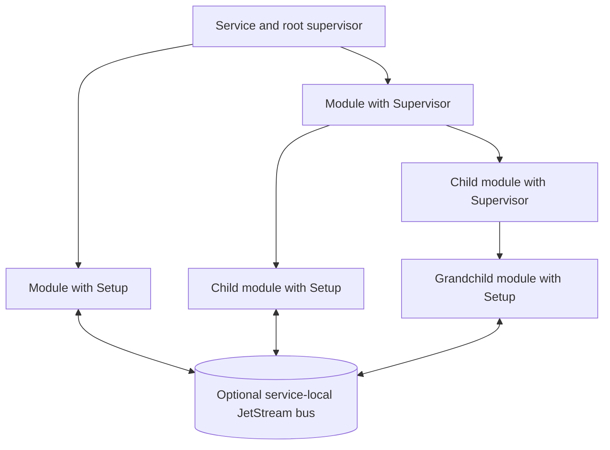
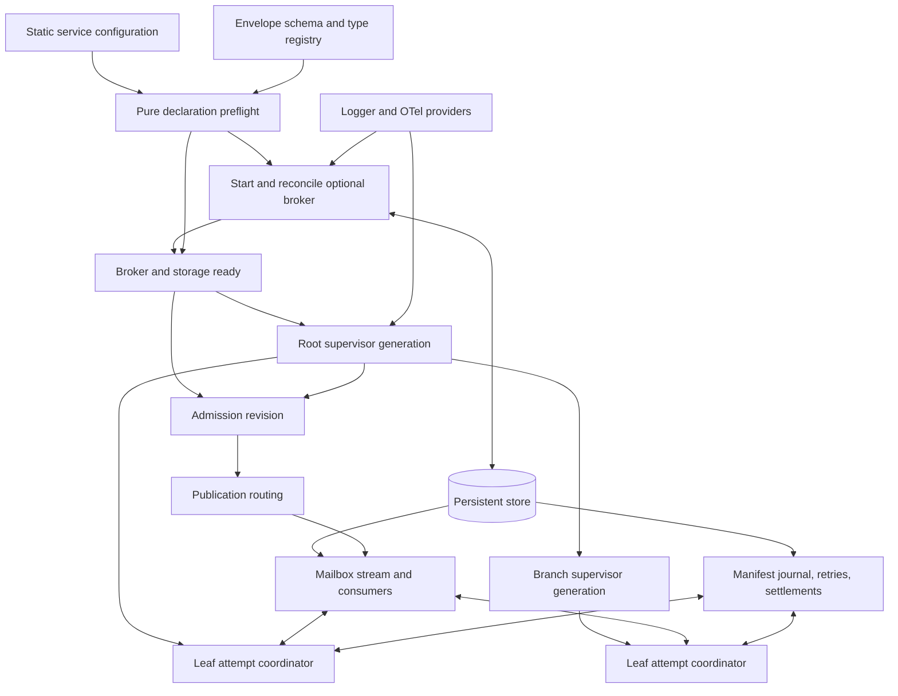
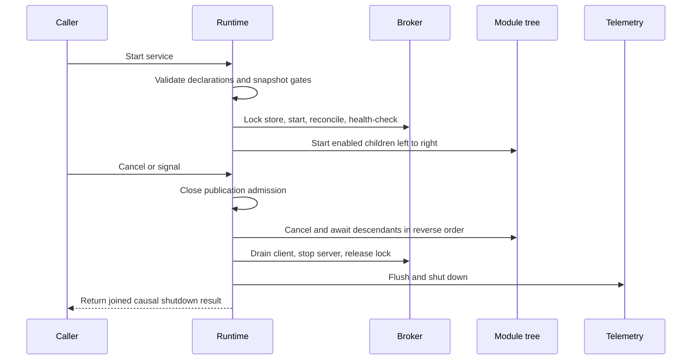
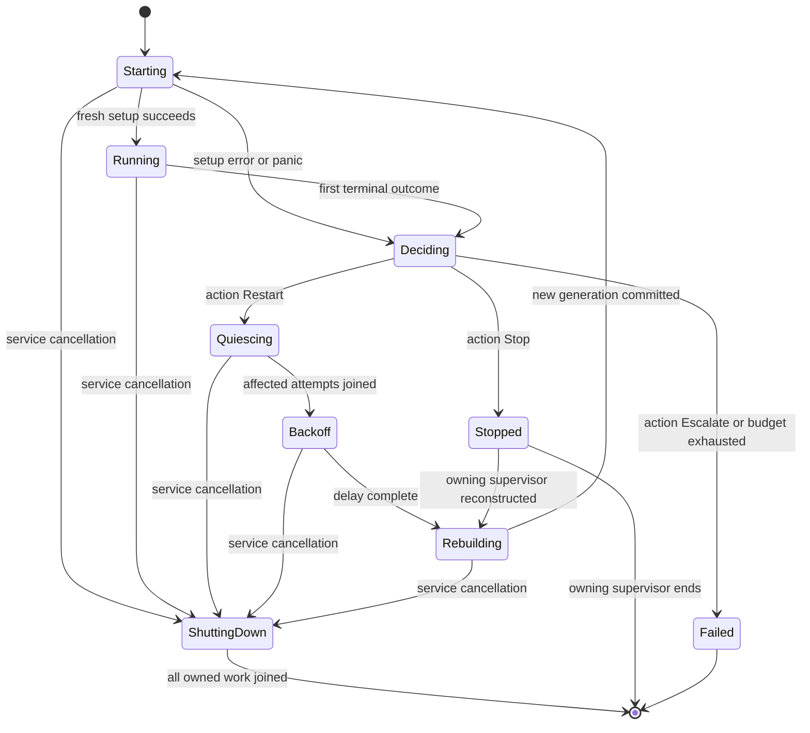
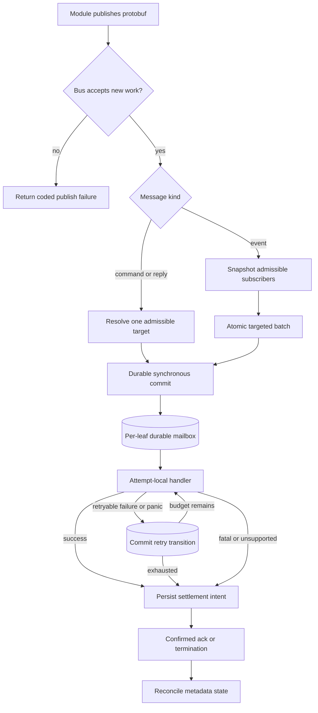

# Service Runtime and Modules - Plan

## Goal Capsule

- **Objective:** FlowSeer services, beginning with the edge agent, can run independently supervised capabilities and resume local inter-module work after a crash, reboot, or software upgrade.
- **Means:** Replace `go.aledante.io/as` with a shared Go service runtime built around gated module trees and an optional durable local bus.
- **Product authority:** This plan owns the reusable service runtime contract; concrete edge-agent modules and their central integration contract remain separate work.
- **Open blockers:** None.

---

## Product Contract

Product Contract unchanged.

### Summary

Add a Go `service` package that runs every service as a non-empty tree of `service.Module` values.
The runtime owns service identity, module gating, nested supervision, shutdown, observability, and optional crash-resumable inter-module messaging.
The implementation includes the shared runtime, its durable protobuf envelope, the existing SNMP contextual-logging migration, and deterministic, race, and embedded-broker durability tests; concrete edge modules and central NATS integration remain separate work.

### Problem Frame

The planned edge agent combines long-running syslog, SNMP, API, uplink, and future capabilities in one process.
Those capabilities need independent failure handling and a way to exchange work without losing queued messages when the process stops.

FlowSeer already depends on `go.aledante.io/as` for contextual logging, but its service lifecycle reuses one service value and its group runner cancels every peer when one exits.
It has no nested module model or durable local messaging.
The accepted device-service direction already places an embedded NATS leaf node and local JetStream at the edge, so the reusable runtime should align with that direction without making a central broker connection mandatory for every service.

### Actors

- A1. **Service author:** Declares service identity, the top-level module tree, and whether the service needs a local bus.
- A2. **Module author:** Supplies leaf setup, gates, subscriptions, and outcome policies while keeping attempt-local state restartable.
- A3. **Operator:** Enables or disables modules through generated environment settings and diagnoses behavior through logs, metrics, and traces.

### Key Decisions

- **Use `service.Module` for the runtime concept.** (session-settled: user-directed — chosen over `Process` or `Component`: SMI modules are a specification detail and the package qualifier keeps the meanings distinct.) Governs R5, R6.
- **A module is a leaf or a branch.** (session-settled: user-approved — chosen over combining business work and child supervision: the split makes failure ownership unambiguous.) Governs R3, R4.
- **Reconstruct leaf attempts.** (session-settled: user-approved — chosen over rerunning one mutable Go value: fresh construction clears module-owned state after failure.) Governs R7, R21.
- **Include nested supervision.** (session-settled: user-directed — chosen over a flat module list: the edge agent needs failure boundaries below the service root.) Governs R8, R9, R13, R17-R24.
- **Keep the durable bus local and optional.** (session-settled: user-approved — chosen over a mandatory central connection or an always-running broker: services without messaging avoid broker and disk cost.) Governs R25-R29.
- **Persist protobuf messages.** (session-settled: user-directed — chosen over `gob`: queued messages must survive edge-agent software upgrades.) Governs R30, R31.
- **Discard exhausted messages.** (session-settled: user-directed — chosen over dead-letter retention or module failure: retry count is the only exhaustion policy and telemetry makes the loss visible.) Governs R35-R37.
- **Replace `as` rather than wrapping it.** (session-settled: user-directed — chosen over an adapter layer: the new lifecycle improves on `as` instead of preserving its constraints.) Governs R1, R2, R42.

### Module and Supervisor Model



The service is the root supervisor and the bus, when requested, belongs to the service rather than any subtree.
Branch modules add failure boundaries without introducing a second messaging namespace.

### Requirements

**Service primitives**

- R1. The package replaces `as` service identity, contextual environment access, structured logging, OpenTelemetry access, signal cancellation, panic containment, restart handling, and graceful shutdown.
- R2. The runtime preserves a service name, namespace, version, environment prefix, logger, tracer, and meter throughout module execution and telemetry.
- R3. Every service declaration contains at least one module, either explicitly or through the implicit single-module form in R4.
- R4. A service with no explicit module list is represented as exactly one leaf module whose name is the service name.
- R5. Every explicit module has a non-empty name that is unique among its siblings.
- R6. A module contains exactly one of a leaf setup function or a supervisor containing one or more child modules.
- R7. A leaf setup function is invoked for every start or restart and returns a fresh runner whose lifetime is bound to the supplied context.
- R8. The service acts as the root supervisor and a branch module acts as the supervisor of its declared children.
- R9. The complete module path is stable identity for environment gates, durable addressing, metrics, and traces.

**Gating**

- R10. Every module has one declarative gate whose decision is either fixed or derived by probing its environment, and an omitted gate means fixed enabled.
- R11. The runtime provides an environment override for every module using the service prefix and full module path followed by `ENABLED`, such as `FLOWSEER_EDGE_INGEST_SYSLOG_ENABLED`.
- R12. An explicit generated environment override takes precedence over either form of module-declared gate.
- R13. Disabling a branch disables its entire subtree without evaluating or starting descendants.
- R14. Gates are evaluated during service startup and when their owning supervisor restarts, with live environment reload outside this release.
- R15. A gate error fails the owning supervisor rather than treating the module as disabled.
- R16. Startup fails before any leaf starts when the effective gated tree contains no enabled leaf module.

**Supervision and lifecycle**

- R17. A supervisor starts its enabled children as concurrent runners rather than serial work stages.
- R18. A supervisor supports `one-for-one`, `one-for-all`, and `rest-for-one` restart strategies, with declaration order defining `rest-for-one` and `one-for-one` as the default.
- R19. Every module declares separate actions for normal return, returned error, and recovered panic from the set `Stop`, `Restart`, and `Escalate`.
- R20. `Stop` leaves the module and its subtree inactive, `Restart` invokes its owning supervisor's strategy, and `Escalate` fails that supervisor immediately.
- R21. The default module actions stop after normal return and reconstruct the module or subtree after either an error or panic.
- R22. Service-context cancellation always means shutdown and never triggers restart policy.
- R23. Normal-return, error, and panic restart policies carry independent declarative budgets and backoff behavior.
- R24. Exhausting a restart budget fails the owning supervisor with the causal outcome, and failure at the root fails the service.

**Local module bus**

- R25. A service opts into its local bus explicitly, and a service that does not opt in starts no broker or message storage.
- R26. The opted-in bus uses local file-backed JetStream and starts before any enabled leaf module.
- R27. The bus resumes stored work after module failure, process restart, edge-device reboot, and compatible software upgrade.
- R28. The bus is service-local and does not require central NATS credentials, connectivity, or subject access.
- R29. A service-specific uplink may bridge selected messages to another NATS account, but that bridge is an ordinary module rather than a bus primitive.
- R30. Every persisted message is a protobuf message with stable type identity and follows the repository's protobuf evolution rules.
- R31. Module paths and persisted message type identities cannot change while queued data exists without an explicit migration or compatibility path.
- R32. Addressed commands have one stable target module, while event publication snapshots every subscribing module for independent durable delivery.
- R33. Disabling a module preserves work already accepted for it until the module is re-enabled.
- R34. Publishing a new addressed command to a disabled module fails, while an event snapshot excludes disabled subscribers.
- R35. Delivery is at least once and a message is acknowledged only after its handler succeeds.
- R36. A subscription declares a retry count, after which a valid but repeatedly failing message is discarded.
- R37. A malformed or unsupported persisted message is discarded without handler delivery and records its disposition through metrics and tracing.
- R38. A mailbox processes one message at a time in stream order by default.
- R39. A module may declare bounded parallel delivery, which gives up completion ordering beyond the declared bound.
- R40. Request completion uses ordinary durable correlated reply messages rather than synchronous futures.
- R41. The bus has bounded disk use and reports capacity exhaustion to the publisher without silently accepting an unstored message.

**Compatibility and verification**

- R42. Migrating existing callers removes the FlowSeer dependency on `go.aledante.io/as` without losing its currently used contextual logging behavior.
- R43. Module and bus behavior emits structured lifecycle logs plus bounded-cardinality OpenTelemetry metrics and traces for starts, stops, restarts, publication, delivery, redelivery, acknowledgement, failure, and discard.
- R44. Message trace context propagates from publication through delivery, redelivery, acknowledgement, failure, and discard.
- R45. Verification covers every valid permutation of gate source and override, module shape, nesting depth used by fixtures, supervisor strategy, exit class, outcome action, restart exhaustion, bus delivery mode, and message disposition.
- R46. Every runtime path owns and waits for its goroutines, and the full verification matrix passes under the race detector.

### Key Flows

- F1. Service startup
  - **Actors:** A1, A2, A3
  - **Steps:** Validate the declaration; evaluate branch and leaf gates; reject an empty effective tree; start the optional bus; start enabled modules under the root supervisor.
  - **Outcome:** The service becomes active only after its required runtime resources and enabled module tree are valid.
  - **Covered by:** R2-R16, R25, R26.
- F2. Module failure and recovery
  - **Actors:** A2, A3
  - **Steps:** Classify the attempt as normal return, error, or panic; apply its declared action; enforce the matching budget; reconstruct affected modules according to the parent strategy or escalate.
  - **Outcome:** The declared failure boundary recovers or stops with its causal error and leaves an observable record.
  - **Covered by:** R17-R24, R43, R44.
- F3. Durable command or event delivery
  - **Actors:** A2
  - **Steps:** Persist the protobuf message; deliver it to one addressed mailbox or each event subscriber; propagate trace context; acknowledge success or retry failure; discard after the applicable limit.
  - **Outcome:** Work survives supported interruptions with at-least-once semantics and a visible final disposition.
  - **Covered by:** R27, R30-R40, R43-R45.
- F4. Service shutdown
  - **Actors:** A3
  - **Steps:** Cancel the root context; stop descendants in supervision order; wait for every owned goroutine; stop the local bus; return shutdown failures without restarting cancelled modules.
  - **Outcome:** The process exits without intentionally orphaned module work or runtime goroutines.
  - **Covered by:** R22, R26, R46.

### Acceptance Examples

- AE1. **Covers R3-R8, R16.** Given empty, duplicate, leaf-and-branch, empty-branch, explicit singleton, and implicit singleton declarations, validation accepts only the valid forms and starts no leaf after any validation failure.
- AE2. **Covers R10-R16.** Given fixed and environment-probing gates at branch and leaf levels, every unset, true-override, false-override, probe-error, disabled-parent, and all-disabled permutation produces the specified effective tree or startup failure.
- AE3. **Covers R11, R13.** Given two same-named leaves under different branches, generated keys use their full paths; disabling one branch leaves the other branch independently addressable.
- AE4. **Covers R17-R24.** Given each exit class and each available action, the runtime stops, reconstructs, or escalates exactly as declared; context cancellation never enters the matrix as a failure.
- AE5. **Covers R18, R24.** Given three siblings and a failing middle child, `one-for-one`, `one-for-all`, and `rest-for-one` restart exactly their defined sets and propagate an exhausted subtree to its parent.
- AE6. **Covers R7, R21, R23.** Given repeated normal returns, errors, and panics, every restart observes a distinct runner instance and consumes only its matching budget and backoff state.
- AE7. **Covers R25-R29.** Given equivalent services with the bus disabled and enabled, the first starts no NATS server or storage while the second resumes local traffic without any central connection.
- AE8. **Covers R27, R30-R32, R35, R38.** Given an unacknowledged command when a module or process crashes, restart redelivers the protobuf message to a fresh runner before the next sequential mailbox item can complete.
- AE9. **Covers R27, R30-R32, R35.** Given queued messages across an edge reboot and a compatible binary upgrade, durable consumers resume at their stored positions and decode every supported message type.
- AE10. **Covers R32-R35.** Given one command and one event with enabled and disabled subscribers, exactly one enabled target mailbox receives the command, a disabled target is rejected, retained work resumes after re-enable, and every enabled event subscriber receives its own at-least-once delivery.
- AE11. **Covers R36, R37, R43, R44.** Given a valid message that exhausts retries and a malformed message, both are discarded at the specified point and each disposition appears in linked metrics and traces.
- AE12. **Covers R38, R39.** Given the same message sequence at concurrency one and at a higher declared bound, the first completes in order while the second never exceeds its bound and makes no completion-order promise.
- AE13. **Covers R41, R43.** Given exhausted bus capacity, publication returns a visible failure and telemetry records the rejection without claiming the message was stored.
- AE14. **Covers R45, R46.** Given the full valid cross-product of the declared dimensions, the matrix runs deterministically under the race detector and reports which dimension tuple failed.

### Success Criteria

- Per R3-R9, a service author can express both a simple single-module service and the edge agent's nested syslog, SNMP, API, and uplink shape without writing lifecycle or supervision plumbing.
- The verification matrix covers every valid behavior permutation required by R45 rather than substituting one representative integration test.
- Tests demonstrate the durable resumption required by R27 without claiming exactly-once delivery.
- Module lifecycle and message outcomes remain diagnosable through the telemetry required by R43 and R44.
- The repository no longer needs `go.aledante.io/as` after the migration required by R42.

### Scope Boundaries

- Concrete syslog, SNMP, API, and uplink module implementations are not part of this package change; they are the first consumers.
- Central NATS enrollment, credentials, subject permissions, and integration contracts remain owned by edge-agent integration work.
- Live environment reload and dynamic module-tree mutation are deferred.
- Synchronous request futures and dead-letter queues are excluded from the v1 bus.
- Recovery from edge-device loss, disk loss, or disk corruption is not guaranteed.
- The package does not implement remote actor identities, remote spawning, or a general distributed actor system.

### Dependencies and Assumptions

- The runtime can embed NATS with file-backed JetStream on every platform supported by services that opt into the bus.
- The disabled-module delivery behavior in R33 and R34 can be implemented without losing previously accepted JetStream work.
- Module authors keep mutable attempt state inside the fresh runner, honor context cancellation, and do not leak child goroutines or shared locks across attempts.
- Message handlers are duplicate-safe because at-least-once delivery can repeat work after an acknowledgement race.
- Protobuf messages stored across releases remain readable under `docs/code-style-proto.md`; compatibility does not cover a release that intentionally removes the queued message type without migration.

### Planning Resolutions

- The exported API and package boundary are resolved by KTD1-KTD4.
- Restart budgets and backoff defaults are resolved by KTD6.
- JetStream storage and capacity defaults are resolved by KTD9.

### Sources and Research

- `go.mod` and the current [`go.aledante.io/as` v0.4.3 API](https://pkg.go.dev/go.aledante.io/as) establish the lifecycle, environment, logging, tracing, and restart primitives being replaced.
- `docs/architecture/2026-08-20-device-service-and-inventory-direction.md` establishes NATS as the integration fabric and local JetStream at the edge.
- `docs/code-style.md` governs context ownership, goroutine shutdown, interfaces, errors, and race verification.
- `docs/code-style-proto.md` governs durable protobuf schema evolution.
- `CONCEPTS.md` defines MIB Module in the SMI domain; `service.Module` is a separate runtime term introduced by this plan.
- [Erlang supervision principles](https://www.erlang.org/doc/system/sup_princ.html) ground the nested restart strategies and escalation model.
- [NATS JetStream consumers](https://github.com/nats-io/nats.docs/blob/master/nats-concepts/jetstream/consumers.md) ground durable consumers, explicit acknowledgement, redelivery, and bounded in-flight delivery.
- [NATS account isolation](https://github.com/nats-io/nats.docs/blob/master/running-a-nats-service/configuration/securing_nats/accounts.md) supports keeping a local module bus distinct from an optional uplink account.
- [Proto.Actor Go](https://github.com/asynkron/protoactor-go) and [Watermill](https://github.com/ThreeDotsLabs/watermill) show the split between addressed messages and event publication in established Go systems.
- [Suture](https://github.com/thejerf/suture) and [Capataz](https://pkg.go.dev/github.com/capatazlib/go-capataz/cap) show context-bound runners and declarative supervision factories in Go.
- The official [`encoding/gob` documentation](https://pkg.go.dev/encoding/gob) explains the Go-type coupling that makes it unsuitable for the upgrade-stable persisted contract in R30.

---

## Planning Contract

### Key Technical Decisions

- KTD1. **Keep one public `src/common/service` package with a narrow runtime-owned API.** Service configuration declares identity, modules, optional bus settings, and telemetry providers. Module authors receive attempt-scoped context, environment, logger, tracer, meter, bus, and safe task-launching capabilities. NATS client and server interfaces remain private so dependency interface growth cannot break FlowSeer callers. Implements R1-R9, R25, R28, R29, R42.
- KTD2. **Separate static declarations from attempt-local execution.** A leaf statically declares its gate and subscriptions, while each `Setup` call constructs fresh handlers and a runner that exactly match that declaration. A branch declares only a supervisor and children. This lets preflight validate routing before side effects and lets mailboxes survive runner replacement. Implements R3-R10, R17, R27, R32.
- KTD3. **Use a canonical logical module path plus validated derived identities.** Each segment is lower snake case, the service name is the root segment, and slash-separated segments form the durable logical path. The runtime rejects duplicate canonical paths, generated environment-key collisions, overlong derived NATS identities, and reserved names before starting leaves. Subjects encode the complete path and protobuf full name as single collision-free tokens rather than flattening separators. Implements R5, R9, R11, R30, R31.
- KTD4. **Make startup a complete preflight followed by supervised setup.** Declaration validation, gate snapshots, subscription/type registration, persisted-schema reconciliation, broker readiness, and writable-storage checks finish before any leaf setup. `Setup` error or panic is then a module outcome governed by R19-R24; it does not roll startup back into a partially initialized state. The service is ready after preflight and bus readiness, while failing leaves report degraded module health. Implements R7, R15, R16, R21, R24-R27.
- KTD5. **Serialize each supervisor through generation-fenced transitions.** The first non-administrative outcome observed in a generation chooses the strategy. Affected children enter quiescing, are cancelled and awaited in reverse declaration order, pass through backoff, and are reconstructed left to right. Results, timers, handler settlements, and acknowledgements from stale generations cannot mutate replacements. Strategy and shutdown cancellation consume no outcome budget. Implements R17-R24, R46.
- KTD6. **Seed explicit restart defaults and keep policy state above attempts.** Normal return defaults to `Stop`; error and panic default to `Restart`. Each outcome starts with three restarts per rolling minute, full-jitter exponential backoff from one to thirty seconds, and reset after one healthy minute. Every supervisor also enforces an aggregate rolling budget of five strategy applications per five minutes, reduced to three per five minutes at the root. Clocks and jitter are injectable for deterministic tests. Implements R19-R24.
- KTD7. **Give one attempt coordinator every runtime-owned execution boundary.** The coordinator owns setup, the runner, mailbox pulls, handlers, and safe-launched tasks under one cancellation context. Runner or launched-task error/panic selects the module outcome; a launched task's nil return is nonterminal. Handler errors and panics stay on the delivery path. After any terminal module outcome, the coordinator stops pulls, cancels the shared context, joins all owned work, and only then reports to the supervisor. Runtime invariant and policy panics remain service failures, and unmanaged module goroutines remain a contract violation. Implements R1, R19, R23, R36, R46.
- KTD8. **Persist an owned versioned protobuf envelope.** Add `flowseer.service.v1.Message` with message kind, stable message/correlation/causation identifiers, source and target logical paths, protobuf fully qualified type name, binary payload, and W3C trace context. This follows the existing `type_name` plus `bytes value` pattern rather than `google.protobuf.Any`, uses an explicit allowlisted resolver, and preserves unknown fields through binary protobuf operations. The schema, stable field numbers, logical path, and full message name are persistence contracts. Implements R27, R30, R31, R37, R40, R44.
- KTD9. **Embed a pinned, listener-free JetStream server with hardened local storage.** Pin `nats-server/v2` v2.14.6 and `nats.go` v1.53.1, start with `DontListen`, `NoSigs`, a service-specific domain, and `nats.InProcessServer`, and use the modern `jetstream` API. The default store lives in the platform's private per-user state directory under the namespace and service path. It uses an application file lock, `SyncAlways`, a 1 GiB logical server limit, a 768 MiB mailbox-stream limit, a 64 MiB metadata-stream limit, reject-new retention, and 192 MiB logical reserve for atomic batches and broker state. Overrides remain configurable. A deployment that needs an absolute physical ceiling must place the directory on a quota or bounded volume because JetStream limits do not include every metadata, temporary, and allocation byte. Implements R25-R29, R41.
- KTD10. **Materialize an atomic event snapshot as one targeted record per enabled subscriber.** Commands and replies publish one targeted record. Events compute the currently admissible subscriber set and commit all targeted records with JetStream atomic batch publication; zero subscribers is a successful no-op and any failed commit leaves no logical event accepted. Target copies use deterministic deduplication identifiers. The configured duplicate window defaults to 24 hours; retries inside it cannot add records, while a retry after it may create a duplicate complete snapshot under the declared at-least-once contract. Implements R30-R35, R40, R41.
- KTD11. **Use one durable pull consumer plus a bus-owned metadata stream for retry and settlement state.** The consumer covers all statically declared message types for one target path, uses explicit acknowledgement, file-backed state, unlimited broker deliveries, and `MaxAckPending` equal to declared concurrency. A fixed worker pool owns the same bound. At concurrency one, a failed record stays in the worker with progress acknowledgements during backoff so later work cannot overtake it. After a retryable handler result, the runtime synchronously records an idempotent failure transition keyed by target and logical message ID before another call. Only committed transitions consume the retry budget, so a crash after handler return but before that commit may cause an additional call. Lifecycle cancellation and ambiguous broker acknowledgements consume no transition. Implements R27, R33-R39.
- KTD12. **Use `errs` disposition and a durable settlement state machine.** Configured retry count means committed retries after the initial handler call. An `errs.Retryable` failure or recovered handler panic may retry to that cap; fatal or unclassified errors are terminal. Before confirmed acknowledgement or termination, the metadata stream records settlement intent and a stable disposition ID. Redelivery resumes the same settlement until the broker confirms it; later reconciliation removes orphaned retry state. Telemetry is at least once and carries the disposition ID for deduplication rather than promising exactly one exported signal. Invalid trace context starts an unparented trace and does not make the message malformed. Implements R35-R37, R43, R44.
- KTD13. **Publish immutable admission revisions from the root coordinator.** Static subscription identity never changes during a service run, while gate and lifecycle transitions atomically publish a new admission revision. A command resolution or event snapshot linearizes against one revision; a later revision cannot revoke a publication already validated against the earlier one. Gate-disabled and policy-stopped modules reject new commands/replies and leave event snapshots. Setup-failing, restarting, or backoff modules remain routable. Shutdown closes admission before cancellation. Gates are resampled only when their owning supervisor gets a new generation, and stopped children remain stopped until that supervisor is reconstructed. Implements R14, R20, R27, R32-R34, R40.
- KTD14. **Reconcile persisted identities through a recoverable journal.** The metadata stream holds checksummed previous and desired manifests plus an idempotent phase journal for service identity, module paths, subscription full names, subject encoding, envelope version, NATS server provenance, stream, domain, and consumers. Startup resumes an interrupted compatible reconciliation before publication. Compatible additions advance the journal; queued removals and renames stop with a migration-required manifest diff and preserve the prior binary/store recovery path. Subscription aliases keep old protobuf full names decodable. A future NATS pin change is an on-disk migration that requires a copied backup and previous-pin store fixture before first open. Implements R27, R30, R31, R37.
- KTD15. **Keep observability bounded and shut it down last.** Runtime configuration accepts API providers, propagator, and an optional provider shutdown owner without setting globals. Metrics use only declared service/module paths, registered protobuf names, strategies, outcomes, actions, error codes, and dispositions. Exact message IDs, correlation IDs, raw errors, and panic stacks stay in spans or structured logs; payload and trace-header contents are never logged. Publication injects `traceparent` and `tracestate`, each delivery attempt links to the persisted publish context, and replies continue the handler trace. Implements R1, R2, R43, R44.
- KTD16. **Linearize shutdown at the service root.** Signal, caller cancellation, or required broker failure first closes publication admission, then cancels the root module tree. Each attempt coordinator stops pulls, cancels its shared context, and joins its runner, handlers, and launched tasks before reporting completion. The root waits recursively in reverse declaration order, drains the in-process client when healthy, shuts down and joins the server, releases the store lock, and finally flushes telemetry. Broker failure bypasses module restart budgets and remains the service's causal error. Implements R22, R26, R35, R43, R44, R46.
- KTD17. **Remove `as` only after contextual logging is characterized.** The repository has no current `as` lifecycle caller; the migration replaces six `as.Logger(ctx)` uses in the SNMP package, proves that a service logger reaches background SNMP paths, tidies both the root and nested SNMP benchmark modules, and adds a regression guard against reintroducing the module. Implements R42.

### High-Level Technical Design

The diagrams define ownership and ordering. They are design guidance rather than exact Go declarations.

#### Declaration and ownership topology



The persistent store outlives service processes. Broker, client, supervisor tree, and admission revisions belong to one service run. Runners, pull workers, handlers, and safe-launched tasks belong to one leaf attempt coordinator.

#### Startup and shutdown lifecycle



An unexpected broker exit or unrecoverable store failure enters the same shutdown sequence at admission closure, skips client drain when unsafe, and returns the broker cause without consuming module restart budgets.

#### Supervisor generation state



The owning supervisor serializes these transitions. Only the first real outcome in a generation can enter `Deciding`; administrative and stale outcomes are diagnostic only.

#### Publication and delivery flow



#### Admission modes

| Module state | New command or reply | Event snapshot | Existing mailbox work |
|---|---|---|---|
| Enabled and running | Accept | Include | Deliver |
| Setup failure, restart, or backoff | Accept | Include | Retain for the next handler |
| Gate-disabled | Reject | Exclude | Retain without pulling |
| Policy-stopped | Reject | Exclude | Retain until the owning supervisor is reconstructed |
| Service preflight or shutdown | Reject | Reject publication | Retain on disk |

### Implementation Constraints

- The runtime lives under `src/common/service`; no production service binary exists yet to migrate.
- `spec/proto/` receives only the new package README and `.proto` source. Generated Go is produced through `buf generate`, never edited by hand.
- The root module and `src/common/snmp/bench` are separate Go modules. Dependency removal and `go mod tidy` must run in both.
- No policy surfaces named in `AGENTS.md` change as part of this work.
- The full behavior matrix uses deterministic fakes and `testing/synctest`; crash, lock, storage, and broker-health claims use subprocess-backed embedded NATS tests.
- Physical-capacity tests use an isolated bounded volume or deterministic filestore fault injection. They must never fill the developer or CI host filesystem.
- Module authors must return cooperatively on context cancellation. A timeout can diagnose a violation but cannot make overlapping attempts safe.

### System-Wide Impact

- **Service authors:** gain one shared lifecycle and messaging contract. They must declare stable module paths, subscriptions, retry policies, and duplicate-safe handlers.
- **Operators:** gain generated gate keys, bounded local storage, module health, and correlated lifecycle telemetry. Store-path moves and identity changes become explicit migrations.
- **Protocol compatibility:** the new protobuf envelope and manifest become on-disk compatibility surfaces even though the bus is process-local.
- **Dependency graph:** embedded NATS adds large direct dependencies to the root module. Services that do not opt into the bus avoid runtime broker and storage cost, but not compile-time dependency weight.

### Risks and Mitigations

| Risk | Consequence | Mitigation |
|---|---|---|
| Atomic batch behavior or headers change across NATS releases | Partial event fan-out or failed upgrades | Pin client/server versions, wrap the protocol, and keep broker contract tests against the exact pins. |
| Acknowledgement loss or expiry of the deduplication window creates an unknown outcome | Duplicate execution or a duplicate complete event snapshot | Reuse stable message IDs within the configured window, keep handlers duplicate-safe, and never report exactly-once semantics. |
| Disk exhaustion or filestore I/O failure blocks mailbox or metadata writes | Accepted work stops progressing or cannot settle | Reserve logical capacity for metadata, require a bounded volume for a hard physical ceiling, fail the root on frozen storage, and test recovery after capacity returns. |
| A module ignores cancellation | Restart generations overlap or shutdown hangs | Require cooperative runners, expose a safe launcher, diagnose with bounded waits, and never start a replacement before the old attempt returns. |
| Persisted path or type changes strand work | Upgrade cannot resume queued messages | Compare a durable manifest, support explicit aliases, and stop for migration instead of deleting orphaned data. |
| Process death interrupts manifest reconciliation | The store and manifest describe different generations | Journal previous and desired manifests, make each reconcile step idempotent, and resume or restore from the preserved prior store. |
| Cross-product verification becomes slow or flaky | Regressions escape or the suite is ignored | Keep the exhaustive matrix deterministic and in-memory; reserve subprocess and real-disk tests for the smaller durability boundary set. |
| Hardened sync reduces publish throughput | Edge ingestion backpressure | Benchmark the pinned configuration and retain the durability guarantee; any relaxation requires a separate product decision. |

### Alternatives Considered

- **Wrap `go.aledante.io/as`:** rejected by the Product Contract because its mutable service lifecycle and flat group cancellation do not provide the required supervision model.
- **Use a central NATS account for module traffic:** rejected because startup and recovery must not depend on enrollment or connectivity.
- **Use one event record with broker interest retention:** rejected because disabling a consumer cannot both preserve old work and exclude it from new events.
- **Publish event targets independently:** rejected because a capacity failure could expose a partially committed subscriber snapshot.
- **Use `google.protobuf.Any`:** rejected in favor of the repository's existing full-name-plus-bytes pattern and an explicit supported-type registry.
- **Use broker delivery count as the retry budget:** rejected because process crashes and administrative cancellation would consume application retry allowance.

### Planning Research

- `src/common/pump/pump.go` provides the repository's closest cancellation, goroutine ownership, and wait pattern.
- `src/common/snmp/options.go` and `src/common/snmp/instrument.go` show provider injection with no-op defaults and SDK construction confined to assembly or tests.
- `src/common/errs/retry.go` and `src/common/errs/slog.go` define retry disposition and structured error logging conventions.
- `spec/proto/flowseer/api/inventory/v1/integration.proto` establishes the full protobuf name plus binary payload pattern.
- `docs/solutions/architecture-patterns/errs-package-architecture-and-error-conventions.md` requires brokers to honor `errs.Retryable` and keep stable error codes.
- `docs/solutions/conventions/document-intentional-schema-deviations-with-comment-and-test.md` requires an intentional wire-contract exception to have both rationale and executable protection.
- [NATS server v2.14.6](https://github.com/nats-io/nats-server/releases/tag/v2.14.6) and [nats.go v1.53.1](https://github.com/nats-io/nats.go/releases/tag/v1.53.1) are the pinned implementation baseline.
- [NATS JetStream stream configuration](https://docs.nats.io/nats-concepts/jetstream/streams) and [consumer configuration](https://docs.nats.io/nats-concepts/jetstream/consumers) define file retention, explicit acknowledgements, work queues, and delivery limits.
- [NATS atomic batch headers](https://docs.nats.io/nats-concepts/jetstream/headers) define the all-or-nothing event commit used by KTD10.
- [Erlang supervisor principles](https://www.erlang.org/doc/system/sup_princ.html) establish declaration-order startup, reverse-order shutdown, and the affected child sets for the three strategies.
- [AWS backoff and jitter guidance](https://aws.amazon.com/blogs/architecture/exponential-backoff-and-jitter/) grounds capped full-jitter restart delays.
- [OpenTelemetry messaging spans](https://opentelemetry.io/docs/specs/semconv/messaging/messaging-spans/) grounds publish, process, settle, and linked fan-out spans; the runtime keeps the development semantic-convention mapping private.

---

## Output Structure

```text
spec/proto/flowseer/service/v1/
  README.md
  message.proto
generated/go/proto/flowseer/service/v1/
  message.pb.go
src/common/service/
  README.md
  bus.go
  config.go
  context.go
  delivery.go
  doc.go
  gate.go
  identity.go
  message.go
  module.go
  policy.go
  service.go
  storelock_posix.go
  storelock_windows.go
  supervisor.go
  telemetry.go
  test/integration/
    broker_test.go
    durability_test.go
    helper_test.go
    testdata/
test/conformance/proto/
  service_message_rules_test.go
test/conformance/dependencies/
  no_as_test.go
```

Test files beside their owners and compatibility fixtures under `src/common/service/testdata/` are omitted from this overview for readability.

---

## Implementation Units

### U1. Define the durable service message contract

- **Goal:** Create the versioned protobuf envelope and executable compatibility guard that every mailbox record uses.
- **Requirements:** R27, R30, R31, R37, R40, R44; F3; AE9, AE11.
- **Dependencies:** None.
- **Files:** `spec/proto/flowseer/service/v1/README.md`, `spec/proto/flowseer/service/v1/message.proto`, `generated/go/proto/flowseer/service/v1/message.pb.go`, `test/conformance/proto/service_message_rules_test.go`, `src/common/service/message_compat_test.go`, `src/common/service/testdata/message_v1.bin`.
- **Approach:**
  1. Define the envelope owned by KTD8 with edition 2024 syntax, opaque Go API, validation constraints, and comments that explain its persisted compatibility role.
  2. Keep transport and supervision enums scoped to the envelope package; do not introduce the Config/State/Event triad because this message is a durable transport record rather than entity state.
  3. Generate the Go output through the repository's Buf workflow and commit source and generated output together.
  4. Add conformance coverage for required stable identities and a checked-in initial wire fixture that detects field-number, enum-number, unknown-field, and full-name drift.
- **Execution note:** Establish the golden wire fixture and failing compatibility checks before runtime code depends on the envelope.
- **Patterns to follow:** `spec/proto/flowseer/api/inventory/v1/integration.proto`, `spec/proto/flowseer/api/inventory/v1/README.md`, `test/conformance/proto/`, `docs/code-style-proto.md`, `docs/conventions/protobuf.md`.
- **Test scenarios:**
  - Covers AE9. Decode the checked-in v1 envelope and payload bytes, resolve the protobuf full name, and preserve unknown fields after binary round-trip.
  - Covers AE11. Reject missing message ID, target path, payload full name, or payload bytes before persistence.
  - Reject an unknown envelope kind and malformed stable identifiers without invoking a handler.
  - Prove that renumbering a persisted field or enum value makes the golden compatibility test fail.
- **Verification:** Buf format, lint, breaking analysis, scoped generation drift, protobuf conformance tests, and the wire fixture all pass without hand-edits under `generated/`.

### U2. Establish service identity, context, and observability

- **Goal:** Provide the process-level service shell and attempt-scoped capabilities that replace the currently used `as` context behavior.
- **Requirements:** R1-R4, R7, R22, R42-R44, R46; F1, F4.
- **Dependencies:** None.
- **Files:** `src/common/service/README.md`, `src/common/service/doc.go`, `src/common/service/service.go`, `src/common/service/config.go`, `src/common/service/context.go`, `src/common/service/identity.go`, `src/common/service/telemetry.go`, `src/common/service/service_test.go`, `src/common/service/config_test.go`, `src/common/service/context_test.go`, `src/common/service/telemetry_test.go`.
- **Approach:**
  1. Define the public configuration boundary from KTD1, including the implicit single-module form, service identity, environment prefix, logger, OTel providers, propagator, and shutdown ownership.
  2. Normalize and validate service identity without depending on process-global logger or OTel state.
  3. Attach immutable service and module identity to attempt contexts and expose safe accessors with no-op defaults.
  4. Make `service.go` own the context-driven engine, readiness transition, signal wrapper, and KTD16 teardown order.
  5. Create bounded lifecycle instruments and attributes from KTD15 before supervision and bus units emit them.
- **Patterns to follow:** `src/common/snmp/options.go`, `src/common/snmp/instrument.go`, `src/common/errs/slog.go`, `docs/code-style.md`.
- **Test scenarios:**
  - Covers AE1. Accept an implicit singleton and reject a service with neither implicit setup nor explicit modules.
  - Preserve name, namespace, version, environment prefix, logger, tracer, meter, and propagator across nested attempt contexts.
  - Use nil providers and logger safely through no-op defaults without setting global OTel state.
  - Cancel through caller context and simulated process signal, returning shutdown rather than a restart-classified error.
  - Enumerate the declared lifecycle attribute sets and prove identifiers, raw errors, and unregistered values cannot create metric labels.
- **Verification:** The public package documentation explains identity and ownership; context and telemetry tests pass under the race detector with global providers unchanged.

### U3. Validate module trees, gates, and static routing

- **Goal:** Turn service declarations into one collision-free, gated execution plan before any leaf or broker side effect starts.
- **Requirements:** R3-R16, R30-R34, R40; F1; AE1-AE3, AE10.
- **Dependencies:** U1, U2.
- **Files:** `src/common/service/module.go`, `src/common/service/gate.go`, `src/common/service/message.go`, `src/common/service/module_test.go`, `src/common/service/gate_test.go`, `src/common/service/message_test.go`.
- **Approach:**
  1. Model leaves, branches, static subscriptions, aliases, delivery concurrency, and retry policy according to KTD2.
  2. Validate the whole ungated declaration first, including leaf-versus-branch exclusivity, sibling names, canonical paths, derived-key collisions, supported protobuf types, and handler declarations.
  3. Snapshot gates top down. Skip descendant probes under a disabled branch but retain their validated static identities for persisted compatibility.
  4. Build immutable registries for module admission, command targets, event subscribers, reply targets, and payload resolvers.
  5. Reject an empty effective tree before constructing a broker or calling setup.
- **Execution note:** Use table-driven tests to prove validation has no setup, storage, or goroutine side effects.
- **Patterns to follow:** `src/common/snmp/options.go`, `src/common/errs`, `docs/code-style.md`.
- **Test scenarios:**
  - Covers AE1. Exercise empty, duplicate, leaf-and-branch, empty-branch, explicit-singleton, and implicit-singleton declarations and prove no setup runs on failure.
  - Covers AE2. Exercise fixed, probed, and overridden gates across unset, true, false, invalid, error, disabled-parent, and all-disabled combinations.
  - Covers AE3. Accept same-named leaves under distinct branches while rejecting any canonical-path, environment-key, subject-token, or durable-name collision.
  - Reject unregistered payload types, conflicting subscription aliases, invalid retry/concurrency bounds, and a fresh attempt whose handlers do not match its static declaration.
  - Apply KTD13 to enabled, stopped, restarting, disabled, preflight, and shutting-down registry states.
- **Verification:** The declaration and gate suite covers every valid source/override combination, reports path-specific coded errors, and proves failure occurs before side effects.

### U4. Implement generation-fenced nested supervision

- **Goal:** Run fresh leaf attempts under deterministic nested restart strategies with bounded recovery and complete goroutine ownership.
- **Requirements:** R1, R7-R9, R14, R17-R24, R43, R45, R46; F2, F4; AE4-AE6, AE14.
- **Dependencies:** U2, U3.
- **Files:** `src/common/service/policy.go`, `src/common/service/supervisor.go`, `src/common/service/policy_test.go`, `src/common/service/supervisor_test.go`.
- **Approach:**
  1. Implement each supervisor as a serialized generation state machine owned by KTD5, with attempt-local cancellation causes and stale-result fencing.
  2. Wrap setup, runner, and safe-launcher tasks with the panic boundaries in KTD7 and retain panic values, types, and stacks only in diagnostic records.
  3. Apply one-for-one, one-for-all, and rest-for-one affected sets with reverse stop/wait and left-to-right reconstruction.
  4. Maintain independent outcome budgets, aggregate supervisor intensity, backoff, and healthy-run reset outside runner values according to KTD6.
  5. Re-snapshot gates only when their owning supervisor is reconstructed; a leaf restart within a live supervisor reuses its generation snapshot.
- **Execution note:** Implement the generation and backoff state machine test-first with fake clocks and `testing/synctest` before adding real goroutines.
- **Patterns to follow:** `src/common/pump/pump.go`, `src/edge/netpen/runner/durability_test.go`, `docs/code-style.md`.
- **Test scenarios:**
  - Covers AE4. Cross every exit class with Stop, Restart, and Escalate and prove administrative cancellation never enters the policy matrix.
  - Covers AE5. Fail the middle of three siblings and assert exact cancel, wait, setup, and start order for all strategies and nested escalation.
  - Covers AE6. Observe distinct runner identities, independent outcome budgets, aggregate intensity, full-jitter bounds, cap behavior, cancellation during backoff, and healthy-run reset.
  - Deliver simultaneous sibling failures and prove the first serialized outcome chooses one transition while secondary results consume no budget.
  - Panic in setup, runner, safe-launched task, handler, and unmanaged goroutine fixtures and prove only the runtime-owned boundaries are contained and correctly classified.
  - Stop a child, restart a sibling, and prove the stopped child remains inactive until the owning supervisor is reconstructed.
  - Cancel a nested tree while runners and backoff timers are active and prove reverse-order completion with no overlapping or leaked attempt.
- **Verification:** Deterministic supervision tests assert exact event sequences and causal errors; the package passes repeated race runs without sleeps or leaked goroutines.

### U5. Own the embedded JetStream lifecycle and store

- **Goal:** Start, reconcile, monitor, and stop a private durable broker only for services that opt into messaging.
- **Requirements:** R25-R31, R41, R43, R46; F1, F4; AE7, AE9, AE13.
- **Dependencies:** U1-U4.
- **Files:** `src/common/service/service.go`, `src/common/service/bus.go`, `src/common/service/storelock_posix.go`, `src/common/service/storelock_windows.go`, `src/common/service/bus_test.go`, `src/common/service/test/integration/broker_test.go`, `src/common/service/test/integration/helper_test.go`, `go.mod`, `go.sum`.
- **Approach:**
  1. Add the exact NATS pins and a private adapter around server, stream, consumer, health, and atomic-publish operations.
  2. Resolve the stable store directory and defaults from KTD9, create it privately, and acquire one process-wide lock. Use explicit build constraints for Linux, Darwin, and Windows locking implementations and never use a temporary default.
  3. Start the listener-free server, wait for readiness, connect in process, recover or advance the manifest journal, and verify writable mailbox and metadata streams before modules start.
  4. Configure file-backed work-queue retention, reject-new capacity, synchronous durability, and the combined logical budget for mailboxes, retry/settlement state, manifests, and atomic-batch reserve.
  5. Treat unexpected server exit, frozen streams, I/O errors, and corrupt manifest state as root failures. Treat ordinary capacity rejection as a coded publish result.
  6. On partial startup failure or shutdown, preserve the store while closing client, server, health monitors, and lock in KTD16 order.
- **Patterns to follow:** `src/edge/netpen/runner/durability_test.go`, `src/common/pump/pump.go`, `docs/conventions/testing.md`.
- **Test scenarios:**
  - Covers AE7. Start identical services with the bus disabled and enabled; assert the first creates no server, listener, directory, lock, or bus goroutine and the second uses no central connection.
  - Covers AE9. Stop and reopen the same stable store and assert streams, manifest journal, consumers, retry/settlement state, and accepted records survive.
  - Covers AE13. Fill the logical stream limit, reject a new record, preserve older work, and report capacity telemetry without a false persistence acknowledgement.
  - Prove no TCP listener exists and a second process cannot acquire or open the same service store.
  - Kill after each manifest, stream, and consumer reconcile step; assert startup idempotently resumes the desired generation or restores the preserved previous state.
  - Inject readiness failure, manifest mismatch, metadata exhaustion, file-store I/O failure, and unexpected server exit; assert complete cleanup and the specified root failure.
  - Start with a compatible additive manifest and an incompatible queued path/type removal; reconcile the first and return migration-required with a usable prior-binary recovery path for the second.
- **Verification:** Unit tests cover options and cleanup; subprocess integration tests prove listener isolation, exclusive locking, persistent restart, reject-new behavior, journal recovery, and broker-failure propagation. Non-host builds cover Linux, Darwin, and Windows lock files.

### U6. Deliver durable commands, events, and replies

- **Goal:** Implement atomic publication, durable per-leaf mailboxes, bounded handlers, retry/discard behavior, and trace propagation.
- **Requirements:** R27, R30-R46; F3; AE8-AE13.
- **Dependencies:** U1, U3, U5.
- **Files:** `src/common/service/message.go`, `src/common/service/delivery.go`, `src/common/service/telemetry.go`, `src/common/service/message_test.go`, `src/common/service/delivery_test.go`, `src/common/service/telemetry_test.go`, `src/common/service/test/integration/durability_test.go`.
- **Approach:**
  1. Encode private subjects from KTD3 and publish only after envelope, type registry, target admission, size, and correlation validation.
  2. Use synchronous persistence and deterministic deduplication IDs for commands and replies; use one atomic targeted batch for the event snapshot in KTD10.
  3. Attach the durable consumer to each fresh attempt's handler set and run exactly the fixed worker bound from KTD11.
  4. Keep sequential failures in place during backoff with progress acknowledgements, and commit application retry transitions to the metadata stream separately from broker delivery count.
  5. Apply `errs` retryability, malformed/unsupported handling, and the recoverable settlement state machine from KTD12.
  6. Inject and extract trace context with a case-insensitive NATS header carrier, link delivery attempts to publication, and keep propagation metadata out of logs and metric labels.
- **Execution note:** Begin with broker-backed failure-window tests around publish acknowledgement, handler completion, and terminal settlement; mocks cannot prove these boundaries.
- **Patterns to follow:** `src/common/errs/retry.go`, `src/common/errs/slog.go`, `src/common/snmp/instrument.go`, `spec/proto/flowseer/api/inventory/v1/integration.proto`.
- **Test scenarios:**
  - Covers AE8. Kill a process after delivery but before acknowledgement, reopen the store, and prove the command reaches a fresh handler before the next sequential record completes.
  - Covers AE9. Copy an old-version store fixture into a new run and decode pending command, event, and reply envelopes with unchanged names and declared aliases.
  - Covers AE10. Reject a disabled or stopped command target, retain its older work, exclude it from new events, and include transiently restarting subscribers.
  - Publish an event to multiple enabled subscribers at the capacity boundary; prove all target records commit or none do, retries inside the deduplication window add no records, and a retry after the window may add only a duplicate complete snapshot.
  - Covers AE11. Count only committed retryable-handler and handler-panic transitions, resume the durable count after restart, and allow an additional call after a crash in the pre-commit ambiguity window.
  - Crash after failure but before retry commit, after retry commit but before backoff, before settlement intent, after settlement intent, and across ambiguous broker confirmation; assert recovery never loses accepted work and telemetry repeats only with the same disposition ID.
  - Covers AE11. Discard malformed envelope, malformed payload, unknown type, and incompatible subscription without handler delivery; process an envelope with invalid trace context as a new trace.
  - Covers AE12. Complete sequential messages in order and prove bounded-parallel delivery never exceeds its configured workers while making no completion-order assertion.
  - Publish a durable correlated reply to an enabled requester, preserve duplicate replies as valid at-least-once traffic, and reject a disabled or stopped reply target.
  - Preserve sampled and unsampled `traceparent`, `tracestate`, correlation, and causation across fan-out, redelivery, process restart, and reply without creating unbounded metrics.
- **Verification:** Broker-backed tests prove persistence and settlement at each crash window; delivery tests pass under the race detector with exact worker bounds and no payload or propagation-header leakage.

### U7. Prove the complete behavior matrix and operational boundaries

- **Goal:** Turn the Product Contract's cross-product and durability claims into one deterministic matrix plus focused real-process evidence.
- **Requirements:** R27, R31, R41, R43-R46; F1-F4; AE1-AE14.
- **Dependencies:** U1-U6.
- **Files:** `src/common/service/service_test.go`, `src/common/service/matrix_test.go`, `src/common/service/test/integration/broker_test.go`, `src/common/service/test/integration/durability_test.go`, `src/common/service/test/integration/helper_test.go`, `src/common/service/test/integration/testdata/`.
- **Approach:**
  1. Generate the valid Cartesian product of gate source and override, leaf/branch shape, fixture depth, strategy, exit class, action, restart exhaustion, delivery mode, and disposition; name every subtest with its full tuple.
  2. Use deterministic runners, broker adapters, clocks, jitter, telemetry exporters, and generation barriers for the full matrix.
  3. Keep a smaller subprocess suite for abrupt process death, lock contention, persisted upgrades, logical and physical capacity failures, and real embedded NATS health.
  4. Record integration fixtures for compatible additive upgrade, alias-based type migration, orphaned mailbox, interrupted journal phase, prior NATS pin, corrupted envelope, and unsupported downgrade.
  5. Add benchmarks for `SyncAlways` command and fan-out publication so future durability changes have a measured baseline rather than an assumed cost.
- **Execution note:** Make the exhaustive matrix a default race-tested suite; use `testing.Short` only to skip subprocess durability cases, never the contract matrix.
- **Patterns to follow:** `docs/conventions/testing.md`, `src/edge/netpen/runner/durability_test.go`, existing table-driven tests under `src/common/errs`.
- **Test scenarios:**
  - Covers AE14. Execute every valid tuple, reject invalid tuples during fixture generation, and include the full tuple in failures.
  - Covers AE1-AE7. Prove validation, gates, lifecycle, strategy, budgets, and bus opt-in across their combined boundary cases.
  - Covers AE8-AE13. Prove crash resumption, upgrade decoding, snapshot fan-out, retry/discard, delivery bounds, and capacity behavior across compatible combinations.
  - Crash during setup, backoff, handler execution, retry commit, acknowledgement, event batch commit, settlement, manifest reconciliation, and telemetry flush; assert the next process has one documented at-least-once outcome.
  - Exhaust an isolated bounded volume or deterministic filestore fault fixture and assert publication never reports success, accepted records remain settleable, broker health fails, modules stop, and restart succeeds after capacity is restored.
  - Run the matrix repeatedly under the race detector and assert every runtime-created goroutine is joined.
- **Verification:** The default deterministic suite reports complete dimension coverage; subprocess evidence covers every persistence boundary; benchmarks record pinned-server durability costs; repeated race runs are clean.

### U8. Migrate contextual logging and remove `as`

- **Goal:** Move the existing SNMP logger lookups to the service context and remove obsolete lifecycle dependencies without changing SNMP behavior.
- **Requirements:** R1, R2, R42, R46; AE14.
- **Dependencies:** U2, U7.
- **Files:** `src/common/snmp/reactor.go`, `src/common/snmp/trap_listen.go`, `src/common/snmp/usm_priv.go`, `src/common/snmp/context_test.go`, `test/conformance/dependencies/no_as_test.go`, `src/common/snmp/bench/go.mod`, `src/common/snmp/bench/go.sum`, `go.mod`, `go.sum`, `docs/architecture/2026-08-20-device-service-and-inventory-direction.md`.
- **Approach:**
  1. Add characterization coverage that supplies a service logger through context and observes it in reactor, trap-listener, and privacy-protocol background paths.
  2. Replace the six `as.Logger` call sites with the service accessor while preserving existing fields, levels, and amplification behavior.
  3. Remove `go.aledante.io/as` and now-unused `go.aledante.io/ae` requirements, then tidy both the root and nested benchmark modules.
  4. Add a dedicated repository-wide dependency conformance test that rejects production imports and root or benchmark module-graph references to `as` and obsolete `ae`; leave the netpen heavy-dependency guard unchanged.
  5. Update the accepted device-service direction with the implemented runtime boundary, local durability limits, and migration constraints.
- **Execution note:** Keep the existing SNMP test suite unchanged as the migration oracle after the new characterization test passes.
- **Patterns to follow:** `docs/solutions/architecture-patterns/snmp-collection-library-architecture-and-fast-path-conventions.md`, `src/common/netpenguard/no_heavy_deps_test.go` for repository walking only, `docs/conventions/testing.md`, `docs/doc-style.md`.
- **Test scenarios:**
  - Inject a distinct structured logger through service context and observe its marker from each migrated SNMP background path.
  - Cancel each background path and prove the migration does not add log amplification, goroutine leaks, or shutdown delay.
  - Scan production Go sources and both module graphs and fail if `go.aledante.io/as` remains.
  - Run the unchanged SNMP suite under the race detector and compare behavior before and after the mechanical migration.
- **Verification:** Both modules are tidy, no source or module graph references `as`, SNMP behavior remains green under the race detector, and the architecture record describes the delivered boundary without overstating central integration.

---

## Verification Contract

| Gate | Command | Proves |
|---|---|---|
| Protobuf source | `buf format -d --exit-code && buf lint` | U1 schema format, edition, validation, and package rules |
| Protobuf compatibility | `buf breaking --against '.git#branch=master'` | U1 does not break the current local baseline |
| Generated drift | `buf generate` through `verify-change` | U1 generated Go matches schema and no generated file was hand-edited |
| Focused runtime race suite | `go test -race ./src/common/service/...` | U2-U7 identity, gating, supervision, delivery, durability, telemetry, and ownership |
| Protobuf conformance | `go test -race ./test/conformance/proto/...` | U1 persisted envelope invariants |
| SNMP migration oracle | `go test -race ./src/common/snmp/...` | U8 contextual logging behavior and no lifecycle regression |
| Nested module integrity | `go -C src/common/snmp/bench mod tidy` and `go -C src/common/snmp/bench test -race ./...` | U8 removes transitive `as`/`ae` drift from the independent module |
| Root module quality | `go mod tidy`, `go build ./...`, `go vet ./...`, `golangci-lint run`, `go test -race ./...` | All units compile, lint, and pass the repository race gate |
| Cross-platform compile | `GOOS=linux go build ./src/common/service`, `GOOS=darwin go build ./src/common/service`, and `GOOS=windows go build ./src/common/service` | U5 selects valid lock and broker code for the supported service platforms |
| Dependency regression | `go test -race ./test/conformance/dependencies/...` | U8 leaves no production import or root/benchmark module-graph reference to `go.aledante.io/as` or obsolete `ae` |
| Durable publish benchmarks | `go test -run '^$' -bench 'Benchmark(Command|EventFanout)Publish' ./src/common/service` | U7 records synchronous command and atomic fan-out cost with the exact NATS pins and storage settings |
| Branch-aware repository gate | `.claude/skills/verify-change/scripts/verify-change.sh --base master` | All affected Markdown, protobuf, generation, Go, module, and policy checks across the branch pass |
| Full repository gate | `.claude/skills/verify-change/scripts/verify-change.sh --full` | Final cross-repository completion evidence after U8 |

The implementation must preserve the exact NATS pins during verification. Subprocess durability tests may skip under `testing.Short`, but the deterministic contract matrix remains in the default race suite. No test may require a central NATS service or external credentials.

---

## Definition of Done

- U1-U8 meet their goals and every cited R/F/AE is enforced by a unit, test scenario, or explicit scope boundary.
- The exported package supports implicit and nested services without exposing NATS implementation interfaces.
- Preflight starts no leaf on invalid declarations, gates, routing, persisted identities, or broker state.
- Supervision reconstructs fresh attempts in deterministic order, respects independent and aggregate budgets, and never overlaps generations.
- Successful publication is synchronously durable; each event fan-out commit is atomic; capacity failure never evicts or falsely accepts older work.
- Commands, events, and replies resume after process death and compatible upgrade with documented at-least-once duplicate behavior.
- Disabled and stopped module admission, admission-revision linearization, committed retry accounting, recoverable settlement, request/reply, and trace propagation match KTD10-KTD15.
- Metrics remain bounded, logs exclude payload and trace-header contents, and final lifecycle telemetry flushes before provider shutdown.
- `go.aledante.io/as` and obsolete `ae` dependencies are absent from production source and both module graphs; existing SNMP behavior remains intact.
- Generated code comes only from Buf, `spec/proto/` contains only allowed source files, and no policy surface changes.
- Every Verification Contract gate passes, ending with the full `verify-change` run.
- The final diff contains no abandoned experiments, duplicate abstractions, temporary fixtures, stale compatibility aliases, or unrelated cleanup.
