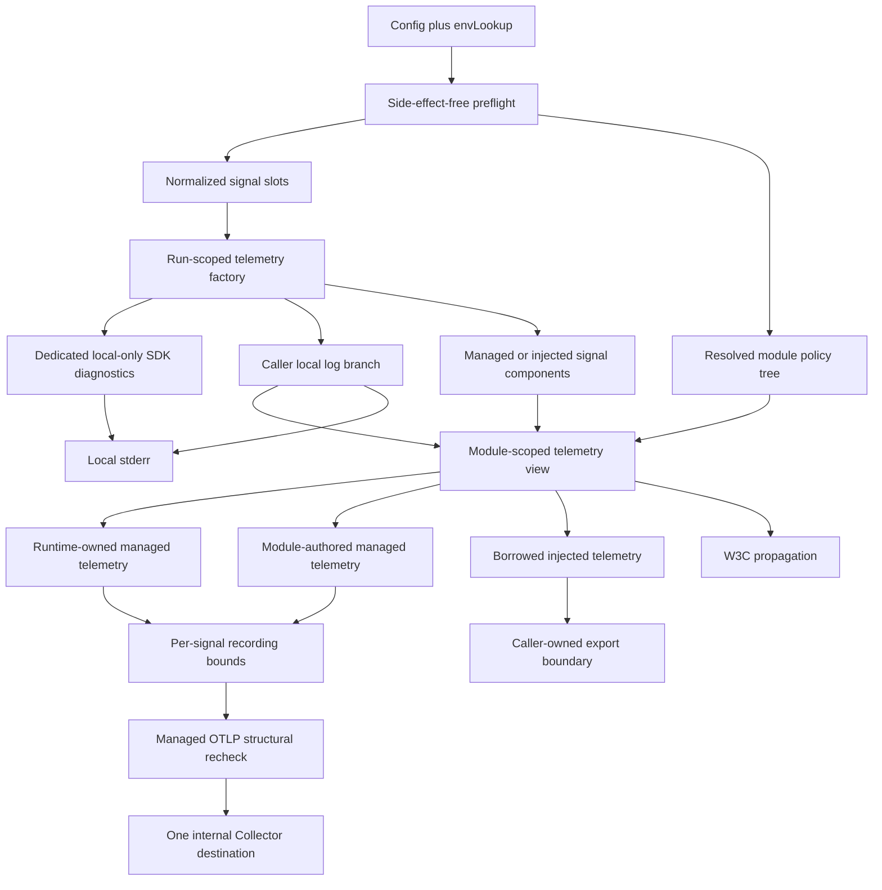
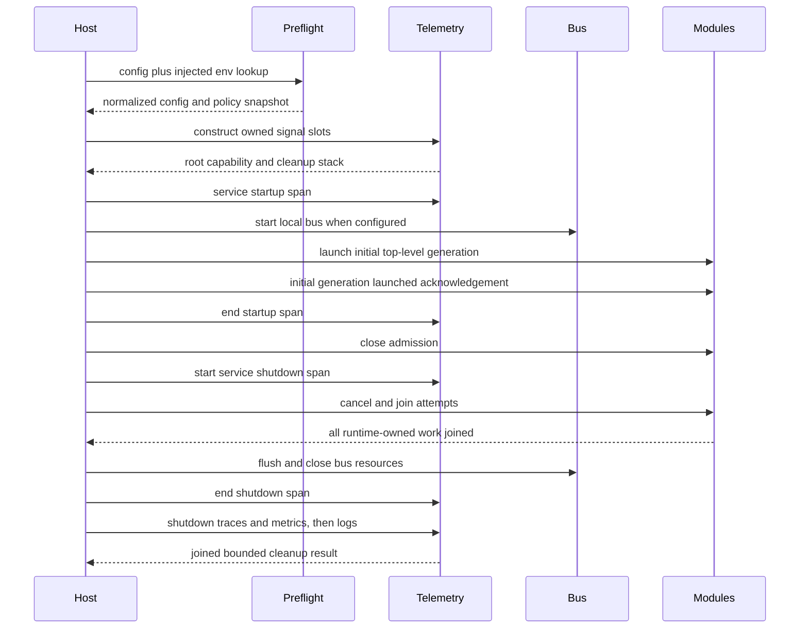
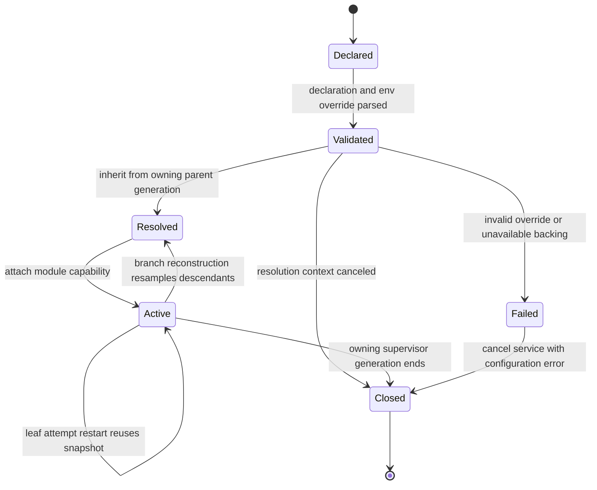
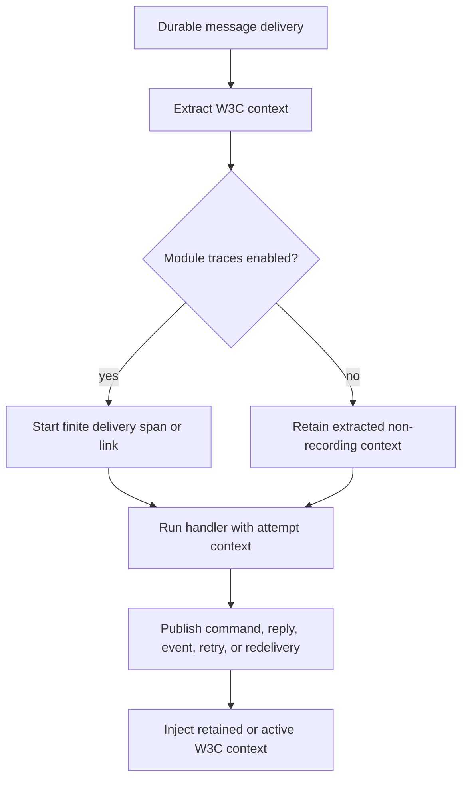

# Service-Managed OpenTelemetry - Plan

> Implemented. The telemetry code lives in `src/common/service` (`telemetry_*.go`);
> the pinned Collector suite runs through the verifier tier described in
> `.claude/skills/verify-change/scripts/verify-change.sh`.

## Goal Capsule

- **Objective:** Operators can rely on every FlowSeer service to emit correctly correlated internal logs, metrics, and traces under every supported telemetry configuration without making service availability depend on the monitoring system.
- **Means:** Extend the shared service runtime with run-scoped managed OpenTelemetry, one internal OTLP destination, and inherited per-module signal controls. See KTD1-KTD9.
- **Product authority:** This plan owns telemetry initialization, module policy, context propagation, export behavior, and end-to-end proof in `src/common/service`; the broader service runtime remains governed by `docs/plans/2026-09-03-2044-feat-service-runtime-modules-plan.md`.
- **Execution profile:** Implement U1-U8 in dependency order. Preserve keyed-literal source compatibility for existing service callers and use test-first proof for policy resolution, propagation, ownership, and shutdown behavior.
- **Stop conditions:** Stop for a required breaking API change, a conflict with the service-runtime plan, or evidence that one shared OTLP destination cannot satisfy an enabled signal. Do not weaken R1-R24 or bypass a repository guardrail.
- **Tail ownership:** The implementation includes focused tests, the Collector-backed suite, documentation, dependency updates, and the separately reviewed verification-gate change. It does not include a release or deployment.
- **Open blockers:** None.

---

## Product Contract

The planning enrichment leaves the confirmed product scope and stable R, F, and AE identifiers unchanged.

### Summary

Extend the existing service configuration, context, telemetry, message, and supervisor patterns with a private managed OpenTelemetry layer.
Cover the full brainstorm scope with exhaustive policy tests, all eight effective signal combinations against a real Collector, and repository verification wiring for the Collector tier.

### Problem Frame

The service runtime already attaches identity, logging, tracing, metrics, and propagation capabilities to module attempt contexts.
It currently depends on callers to construct every provider and exporter, uses no-op or discard defaults, and has no endpoint configuration or per-module signal policy.

Some runtime lifecycle records also originate from `context.Background()`.
Those records lose the cancellation and trace relationships carried by the service run and module attempt, which weakens the correlation contract the package is meant to provide.

### Actors

- A1. **Service author:** Declares service identity and module structure and may inject caller-owned telemetry for tests or an embedded host.
- A2. **Module author:** Uses the attempt context for logging, instruments, spans, and message propagation without constructing a separate service-wide pipeline.
- A3. **Operator:** Configures one internal collector destination and enables or disables each signal at service or module boundaries.
- A4. **Monitoring system:** Receives internal OTLP data without becoming part of the FlowSeer product data plane.

### Key Decisions

- **Resolve signal policy at the module context boundary.** (session-settled: user-directed — chosen over collector-side filtering or a pipeline per module: disablement remains truthful without multiplying exporters.) Governs R7-R13.
- **Inherit each signal through the module tree with child overrides.** (session-settled: user-directed — chosen over leaf-only or independent settings: nested configuration stays concise while exceptions remain possible.) Governs R7-R9.
- **Keep caller injection as an explicit advanced mode.** (session-settled: user-directed — chosen over managed-only or injection-only ownership: production setup and testability both remain supported.) Governs R3.
- **Keep local logging when OTLP log export is disabled.** (session-settled: user-directed — chosen over discarding or level-filtering local records: startup and incident evidence remains available.) Governs R10.
- **Reject bad configuration but tolerate collector outages.** (session-settled: user-directed — chosen over always-fatal or always-nonfatal failures: operator mistakes stay visible without coupling runtime availability to monitoring availability.) Governs R17-R20.
- **Trace finite lifecycle work.** (session-settled: user-directed — chosen over a process-lifetime root span or module-authored spans only: traces describe bounded service and module operations.) Governs R14-R16.
- **Use the shared standard OTLP environment contract.** (session-settled: user-directed — chosen over Go-only configuration or signal-specific destinations: deployments get familiar controls while one endpoint remains enforceable.) Governs R4-R6.
- **Propagate trace context through trace-disabled modules.** (session-settled: user-directed — chosen over stripping or reply-only propagation: enabled downstream modules retain end-to-end continuity.) Governs R13, R16.
- **Prove the contract with a real Collector through local verification.** (session-settled: user-directed — chosen over SDK-only, deployment-only, or external-CI validation: the repository's local gate owns exporter compatibility and negative signal assertions.) Governs R21-R24.

### How This Work Fits Together

This plan owns the focused observability extension to the existing service runtime.
The surrounding breakdown is current context rather than a committed roadmap.

- **Depends on:** The module tree, attempt contexts, lifecycle telemetry, and shutdown order established by `docs/plans/2026-09-03-2044-feat-service-runtime-modules-plan.md`.
- **Enables:** Future service binaries to obtain consistent internal telemetry without repeating SDK initialization or changing process globals.
- **Can proceed independently of:** FlowSeer product ingestion, customer telemetry, dashboards, alert definitions, and monitoring-system storage design.

### Requirements

**Ownership and isolation**

- R1. Managed mode initializes run-scoped logging, metric, trace, resource, and propagation capabilities before any module setup or runtime telemetry occurs.
- R2. A service run must not mutate process-global `slog` or OpenTelemetry state, and concurrent service runs must remain isolated.
- R3. A caller may inject a logger, provider, propagator, or shutdown owner for a signal, but managed and caller-owned lifecycles must never overlap for the same component.

**Endpoint and exporter configuration**

- R4. Managed mode reads `OTEL_EXPORTER_OTLP_ENDPOINT` and the other non-signal-specific standard `OTEL_EXPORTER_OTLP_*` connection settings and provides equivalent Go configuration for hosts that do not use environment variables.
- R5. Managed mode accepts exactly one common OTLP endpoint and rejects every signal-specific endpoint or configuration that would route a signal to another destination.
- R6. When no endpoint is configured, managed OTLP export defaults off for all three signals and starts no exporter work.

**Module policy**

- R7. Logs, metrics, and traces each have an independent inherit, enabled, or disabled declaration at the service root and every module, with service-prefixed environment overrides derived from the stable module path.
- R8. A module inherits each unset signal from its parent and may override any signal for its full subtree; a descendant may override it again.
- R9. Module telemetry settings are resolved at service startup and when their owning supervisor generation is reconstructed, with live reload outside this work.
- R10. Disabling logs suppresses OTLP export for the module while its contextual logger continues through the configured local sink or a service-owned stderr default.
- R11. Disabling metrics records no runtime or module-authored measurements for the module.
- R12. Disabling traces creates and exports no runtime or module-authored spans for the module.
- R13. A trace-disabled module still extracts, retains, injects, and forwards valid W3C trace context through durable messages.

**Contexts and correlation**

- R14. Service and module telemetry derives from the active run or attempt context so cancellation, deadlines, identity, and current trace relationships survive every runtime-owned boundary.
- R15. The runtime emits finite spans for service startup and shutdown and for each module attempt rather than one span covering the process lifetime.
- R16. Logs, metrics, traces, and durable-message propagation use the same stable service and module identity and preserve valid trace and span correlation where a recording span exists.

**Failure, privacy, and shutdown**

- R17. Invalid, conflicting, or unsupported telemetry configuration fails preflight before module or exporter side effects begin.
- R18. Collector unavailability after valid initialization does not fail or restart a service or module; exporters retry with bounded resource use and report the condition through the local log sink.
- R19. Managed telemetry stops after all runtime-owned work, performs a bounded final flush, and joins any telemetry shutdown error with the service result.
- R20. Runtime-owned exported data excludes message payloads, raw trace carriers, credentials, and unbounded identifiers and is never routed through FlowSeer product services; managed pipelines structurally bound module-authored data, while module authors remain responsible for secrets hidden under otherwise permitted names.

**End-to-end proof**

- R21. The repository's local verification gate starts a real OpenTelemetry Collector and asserts both the presence of enabled signals and the absence of disabled signals at the receiver.
- R22. The Collector suite covers every effective logs, metrics, and traces combination for a service root and nested module overrides, plus managed, injected, endpoint-absent, invalid, and unreachable-collector configurations.
- R23. The test matrix proves local logging during OTLP log disablement, context propagation through trace-disabled modules, finite lifecycle correlation, process-global isolation, bounded outage behavior, and final flush ordering.
- R24. Pure configuration tests exhaust every inheritance and precedence state so the slower Collector suite can validate externally distinct outcomes without relying on untested resolution branches.

### Key Flows

- F1. Managed startup
  - **Trigger:** A service starts with a common OTLP endpoint.
  - **Actors:** A1, A3, A4
  - **Steps:** Preflight validates the common configuration and module policy; the runtime creates its run-scoped capabilities; enabled module attempts receive their resolved contexts; the service begins supervision.
  - **Outcome:** Every first lifecycle record uses the configured service identity and a valid active context.
  - **Covered by:** R1-R9, R14-R17

- F2. Module telemetry
  - **Trigger:** A module attempt logs, records a measurement, starts a span, or publishes a durable message.
  - **Actors:** A2, A4
  - **Steps:** The attempt context applies the resolved policy; enabled data reaches the shared pipeline; local logs remain available; trace context continues through messages.
  - **Outcome:** The monitoring system receives only enabled signals with consistent service and module correlation.
  - **Covered by:** R7-R16, R20

- F3. Monitoring outage and shutdown
  - **Trigger:** The Collector becomes unavailable or the service begins shutdown.
  - **Actors:** A3, A4
  - **Steps:** Exporters retry within fixed bounds while service work continues; shutdown stops modules first; the runtime performs a bounded final flush and closes managed telemetry.
  - **Outcome:** Monitoring failure cannot exhaust or terminate the service, and shutdown reports any final telemetry failure without losing the service's causal result.
  - **Covered by:** R18, R19

### Acceptance Examples

- AE1. **Covers R4-R6, R10-R12, R21.** Given a service with no endpoint and no injected providers, when it runs a module that logs, measures, and traces, then local logs are present, no OTLP connection is attempted, and no managed metric or trace data is produced.
- AE2. **Covers R1, R4, R15, R16, R21.** Given a valid common endpoint and default module policy, when the service and one module complete finite work, then the Collector receives correlated lifecycle logs, metrics, and spans with the same service and module identity.
- AE3. **Covers R7-R12, R22, R24.** Given every effective on/off combination of the three signals across a root, branch, and leaf override, when each module emits all signal types, then the Collector receives exactly the enabled types for each resolved module path.
- AE4. **Covers R10, R21-R23.** Given OTLP logs disabled for a subtree, when a descendant logs inside a recording span, then the record reaches the local sink and no log record from that subtree reaches the Collector.
- AE5. **Covers R13, R16, R23.** Given a trace-disabled module between two trace-enabled modules, when it handles and republishes a traced durable message, then it emits no span and the downstream module continues from the propagated W3C context.
- AE6. **Covers R5, R17.** Given a common endpoint plus any signal-specific endpoint, when preflight runs, then startup fails before exporters, modules, or the local bus start.
- AE7. **Covers R3, R22.** Given caller-owned telemetry for one or more signals, when the service runs, then the injected components receive the same module policy and context identity without being shut down twice or combined with a managed component for the same signal.
- AE8. **Covers R14-R16, R23.** Given a caller context with cancellation and an active trace, when lifecycle transitions occur, then their telemetry derives from the run or attempt context rather than a background context and preserves the expected relationships.
- AE9. **Covers R18, R22, R23.** Given valid configuration and an unreachable Collector, when buffers and retry windows are exercised, then service work continues, resource use remains within its bound, and a local warning exposes the export failure.
- AE10. **Covers R19, R23.** Given buffered telemetry at shutdown, when all module work stops, then the runtime flushes and closes managed telemetry within its shutdown bound and returns both service and telemetry errors when both exist.
- AE11. **Covers R2, R23.** Given two concurrent services with different identities and policies, when both emit telemetry, then their contexts and exports remain distinct and the process-global logger, providers, and propagator remain unchanged.

### Scope Boundaries

- The work provides internal service telemetry only; it does not add FlowSeer product ingestion, customer-visible observability, dashboards, alerts, retention, or monitoring-system administration.
- Managed mode supports one OTLP destination, not per-signal routing, multiple exporters, or direct vendor-specific backends.
- Telemetry policy is configuration sampled with supervisor generations; dynamic remote configuration and live environment reload are excluded.
- Local logging remains a service diagnostic channel and is not disabled by module OTLP policy.

#### Deferred to Follow-Up Work

- Replace raw OpenTelemetry provider access with constrained module instrumentation APIs only if export-boundary controls and the module authoring contract prove insufficient for R20.
- Add monitoring-system dashboards, alerts, retention policies, and deployment-specific Collector configuration after service telemetry is available.

### Dependencies and Assumptions

- The existing service-runtime plan remains authoritative for module identity, supervision, durable-message propagation, bounded attributes, and shutdown ordering.
- The OpenTelemetry Go trace and metric APIs are stable at the repository's current dependency level; the logs API and bridge stay private to the runtime.
- The standard common OTLP endpoint derives per-signal routes for HTTP transports and a shared destination for gRPC transports; the service adds no signal-specific destination behavior.
- The repository verification environment can run a pinned local OpenTelemetry Collector without external credentials or network services beyond fetching the pinned image.

### Sources and Research

- `docs/plans/2026-09-03-2044-feat-service-runtime-modules-plan.md` establishes the service runtime's observability, module identity, context, propagation, and shutdown contracts.
- `docs/conventions/testing.md` requires package integration tests to use the public API and puts live container tiers behind an explicit build tag.
- `docs/solutions/architecture-patterns/errs-package-architecture-and-error-conventions.md` explains that trusted local logging includes private error attributes, so the OTLP branch needs a separate sanitization boundary.
- `docs/solutions/architecture-patterns/snmp-collection-library-architecture-and-fast-path-conventions.md` supports exhaustive deterministic matrices plus focused real-system integration proof.
- `src/common/service/config.go`, `src/common/service/context.go`, `src/common/service/telemetry.go`, and `src/common/service/supervisor.go` establish the current injected-provider boundary and lifecycle-context gap.
- [OpenTelemetry Go](https://opentelemetry.io/docs/languages/go/) records the current signal maturity and SDK setup model.
- [OpenTelemetry Go exporters](https://opentelemetry.io/docs/languages/go/exporters/) documents direct OTLP exporters for logs, metrics, and traces.
- [OTLP exporter specification](https://opentelemetry.io/docs/specs/otel/protocol/exporter/) defines common endpoint behavior and per-signal HTTP path derivation.

---

## Planning Contract

### Key Technical Decisions

- KTD1. **Normalize all telemetry configuration during preflight.** Parse supported environment values through the existing injected `envLookup`, then overlay explicit Go configuration. Validate the endpoint, protocol, headers, compression, timeout, TLS material, module declarations, and ownership combinations before constructing an exporter. Errors name only the setting and a stable failure category; they never echo endpoint user information, header values, PEM contents, private-key material, or raw carriers. Direct exporter constructors receive only normalized options and never resolve process environment themselves. Supports R1, R4-R6, R17, R20 and F1.
- KTD2. **Separate run-scoped backing availability from module-scoped emission policy.** A backing is unavailable, managed, or injected; a module view is enabled or disabled. A common endpoint creates all three managed backings even when the initial tree disables a signal, so a descendant or later supervisor generation can enable it. Existing trace and metric providers and the new log-export handler are borrowed injected backings. The existing aggregate `TelemetryShutdown` remains the single caller owner and runs at most once. Supports R2, R3, R6-R9, R19 and AE7.
- KTD3. **Use tri-state declarations and immutable generation snapshots.** Add inherit, enabled, and disabled signal declarations at the service root and on `Module`. Service-prefixed environment overrides take precedence over declarations. Store both declarations and resolved values in `plannedModule`. A reconstructed branch re-parses descendants against its already-resolved parent, while a leaf restart reuses the owning generation snapshot. Validate overrides even below a gate-disabled ancestor. An invalid or newly unbacked reconstructed policy is a fatal service configuration error, not a restartable module outcome. Supports R7-R9, R17, R24 and AE3.
- KTD4. **Attach one borrowing module-scoped telemetry view to every active context.** The run telemetry object exclusively owns pipelines. Each immutable module view selects local or OTLP log branches, enabled or no-op instruments, identity attributes, and propagation. Managed provider accessors return non-owning façades that do not expose SDK shutdown methods through type assertions; injected providers remain direct borrowed values. Runtime lifecycle, message, delivery, retry, and disposition telemetry use the same view as module-authored calls. Supports R7-R16 and F2.
- KTD5. **Keep propagation independent from span creation.** Always extract valid W3C Trace Context before applying module trace policy. An enabled module starts its consumer or producer span. A disabled module retains the extracted non-recording span context and injects it on commands, replies, events, retries, and redeliveries without creating a span or link event. Preserve native W3C trace state but do not add baggage. Supports R12, R13, R16, R20 and AE5.
- KTD6. **Split trusted local logging, managed recording boundaries, and OTLP export.** A nil local logger selects a structured stderr sink. The local branch retains trusted `errs` detail and trace correlation. Managed logs sanitize bodies and attributes before batching; managed traces apply SDK limits to names, attributes, events, and links; managed metrics cap attributes and cardinality before aggregation. Export adapters recheck structural limits. Native trace identifiers, flags, and trace state may use OTLP protocol fields, but raw `traceparent`, `tracestate`, baggage, and carrier maps never become log bodies or telemetry attributes. Signal disablement removes only the OTLP branch. Supports R2, R10, R16, R20 and AE4.
- KTD7. **Use direct OTLP exporters with one normalized connection contract.** Default to `http/protobuf`; also support `grpc`. For HTTP, append `/v1/logs`, `/v1/metrics`, or `/v1/traces` to the common endpoint path with URL-path semantics. Reject signal-specific OTLP variables, unsupported protocols such as `http/json`, URL user information, query strings, fragments, malformed headers, and incomplete TLS key pairs. Use one resource per run with authoritative FlowSeer service identity and SDK metadata. Do not import arbitrary `OTEL_RESOURCE_ATTRIBUTES`; any later deployment attributes require an explicit bounded allowlist. Supports R4-R6, R16-R17, R20 and AE6.
- KTD8. **Bound asynchronous telemetry and isolate diagnostics.** Configure non-blocking trace and log queues of 2,048 records with batches of at most 512 and a one-second schedule. Use a 30-second metric interval, a five-second default and 30-second maximum export request timeout, and exporter retry capped at 30 seconds elapsed time. A dedicated structured stderr handler, independent from `Config.Logger` and the OTLP branch, emits at most one warning per signal per minute with only signal, stable failure category, count, suppressed count, and timing. Routine asynchronous export failures are swallowed after local reporting so they cannot restart or fail the service; final-drain and provider-shutdown failures are returned. Do not add another retry layer or mutate the global error handler. A single 10-second telemetry shutdown deadline bounds all owned providers. Supports R2, R18-R19 and AE9-AE10.
- KTD9. **Prove resolution exhaustively and wire compatibility selectively.** Pure tests enumerate declaration and environment precedence across root, branch, leaf, gate-disabled, and reconstruction cases. The Collector tier runs all eight effective signal combinations and focused ownership, endpoint, outage, propagation, isolation, and shutdown cases. Pin the Collector image by version and digest, poll readiness and file-exporter output with deadlines, and parse newline-delimited OTLP JSON instead of using sleeps. Supports R21-R24 and AE1-AE11.

### High-Level Technical Design

The diagrams and matrices describe required boundaries and sequencing. Exact private type and helper names remain implementation choices.

#### Component and data flow

#### Startup and shutdown sequence

One root teardown coordinator owns both bus and no-bus runs. Startup, module-attempt, and shutdown spans are siblings derived from the caller context. Supervisor decisions that occur after an attempt ends retain only the immutable module view and a span context or link, never the ended attempt context.

#### Backing-source matrix

| Endpoint | Injected component | Run-scoped backing |
|---|---|---|
| absent | absent | unavailable |
| configured | absent | managed |
| absent | present | injected |
| configured | present | injected; no managed backing for that signal |

#### Module-view matrix

| Backing | Effective module policy | Module view |
|---|---|---|
| managed or injected | enabled | enabled borrowing view |
| managed or injected | disabled | no-op emission view; backing remains available to other modules and generations |
| unavailable | disabled | no-op emission view |
| unavailable | enabled | configuration error before the generation starts |

#### Policy snapshot lifecycle

#### Context and propagation decision

### Resolved Planning Questions

- The default transport is `http/protobuf`; `grpc` is the only alternative managed transport. KTD7 owns endpoint and connection validation.
- KTD8 owns queue, retry, warning, and shutdown bounds. The common request timeout remains configurable within its validated maximum; the other bounds are private runtime constants in the first implementation.
- KTD2 preserves the existing injection fields through an explicit compatibility mapping and adds only the missing injected log-export seam while retaining one aggregate injected shutdown owner.

### Implementation Constraints

- Keep OpenTelemetry SDK, exporter, bridge, and log API types private except where an existing public provider interface or the new caller-owned `slog.Handler` seam requires exposure.
- Keep all stable OpenTelemetry modules on `v1.46.0`, log modules on `v0.22.0`, and `go.opentelemetry.io/contrib/bridges/otelslog` on `v0.20.1` unless dependency resolution shows an incompatible published set. Update semantic conventions with the selected SDK line.
- Do not use `autoexport`; it reads process environment independently, permits signal-specific configuration, and defaults to export without the service preflight contract.
- Do not call `slog.SetDefault`, `otel.SetTracerProvider`, `otel.SetMeterProvider`, `otel.SetTextMapPropagator`, or `otel.SetErrorHandler`.
- Register every managed component on a reverse cleanup stack immediately after construction. On partial initialization or later startup failure, attempt all cleanup steps and preserve the causal error first with `errors.Join`.
- Shutdown uses provider `Shutdown` operations under the shared deadline. Do not call a separate `ForceFlush` immediately before `Shutdown`.
- Runtime-owned telemetry uses an allowlisted bounded field set. Managed recording and export boundaries apply structural limits and prohibited-key filtering to module-authored data. Injected providers remain caller-owned trust boundaries. Documentation must state that module authors must not place payloads, credentials, headers, or secrets in names, bodies, descriptions, events, or innocuous attribute keys.
- Treat `OTEL_SERVICE_NAME` disagreement with `Config.Identity.Name` as a preflight error. FlowSeer identity remains authoritative for all three signals.
- A valid but unreachable endpoint is a runtime outage, not a preflight error. Invalid URLs, certificates, ownership combinations, and unsupported settings are preflight errors.
- Validation errors and local SDK diagnostics never include endpoint credentials, header values, certificate or key contents, raw carriers, exported batches, or unsanitized exporter errors.
- The Collector suite clears inherited `OTEL_*` values, uses generated synthetic telemetry only, and scrubs a bounded sentinel corpus before retaining failure artifacts. Successful runs delete all artifacts; a scrub failure prevents artifact retention.

### System-Wide Impact

- **Service authors:** Existing injected trace, metric, propagation, local logging, and shutdown fields remain source compatible for keyed literals. The extensible configuration structs do not support unkeyed literals. Managed mode removes repeated SDK initialization from new services.
- **Module authors:** The same context accessors remain the instrumentation surface. Their results now reflect effective module signal policy.
- **Operations:** One common endpoint and standard common OTLP settings become the deployment contract. Signal-specific OTLP variables become startup errors.
- **Reliability:** Collector failure consumes fixed memory and time, reports locally, and cannot enter module restart policy.
- **Privacy:** Local trusted diagnostics and remotely exported telemetry become separate trust boundaries.
- **Verification:** Changes to the telemetry-sensitive service paths activate a Docker-backed Collector tier. The verifier edit is a policy-surface change and requires explicit guardrail review.

### Risks and Mitigations

| Risk | Consequence | Mitigation |
|---|---|---|
| The OpenTelemetry logs API or bridge changes independently from stable trace and metric modules. | Dependency updates can break the private managed log pipeline. | Keep log types private, pin a compatible version set, and prove the bridge through the Collector suite. |
| Stock SDK processors report some internal failures through the unchanged global error handler. | A process-level handler may observe SDK diagnostics even though the service does not mutate global state. | Route export failures through local-only adapters, assert global identities remain unchanged, and document this upstream SDK limitation. |
| Arbitrary module telemetry can hide sensitive values under innocent names or keys. | Managed structural controls and injected-provider boundaries cannot infer all semantic secrets. | Make R20's enforcement boundary explicit, test every managed signal surface with sentinels, and treat constrained instrumentation APIs as separate follow-up scope. |
| A caller logger or global SDK error handler can re-enter a failed OTLP log path. | Export failure reporting can recurse or leak configuration details. | Use a dedicated stderr diagnostic handler with a fixed field set, swallow routine async export errors after reporting, and test a re-entrant caller logger. |
| File-exporter output changes across Collector releases. | Integration parsing can fail without a service regression. | Pin both image version and digest, keep the fixture test-only, and decode the OTLP request shape instead of snapshotting formatting. |
| Collector-backed verification adds Docker and image-startup cost. | Local verification can become slower or unavailable. | Keep pure exhaustive tests in the default suite, gate the live tier by tag, reuse the local Docker image cache, and emit container logs on failure. |
| Mixed injected and managed components complicate ownership. | Components can leak or a shared caller SDK can be shut down twice. | Normalize every backing before construction, retain one aggregate injected owner, and use a cleanup-stack test matrix. |

### Alternatives Considered

- **Use OpenTelemetry `autoexport`.** Rejected because it resolves environment configuration outside service preflight, defaults to OTLP without the endpoint rule, and permits per-signal settings that violate R5.
- **Create one provider pipeline per module.** Rejected because it multiplies exporters and shutdown work. A shared provider with module-scoped context policy satisfies the confirmed boundary.
- **Filter disabled modules in the Collector.** Rejected because disabled instrumentation would still allocate, queue, and fail locally. It would also make the runtime contract depend on external configuration.
- **Drop trace context when spans are disabled.** Rejected because it breaks the confirmed enabled-to-disabled-to-enabled relay behavior.
- **Replace raw providers with new constrained instrumentation APIs now.** Deferred because it would expand the public API change and migration scope before export-boundary controls have evidence of insufficiency.

---

## Implementation Units

### U1. Add the normalized telemetry configuration contract

- **Goal:** Define keyed-literal-compatible managed configuration, signal ownership, strict environment parsing, and side-effect-free preflight normalization.
- **Requirements:** R1-R9, R17; F1; AE1, AE6, AE7.
- **Dependencies:** None.
- **Files:**
  - Modify `src/common/service/config.go`.
  - Modify `src/common/service/module.go`.
  - Create `src/common/service/telemetry_config.go`.
  - Create `src/common/service/telemetry_config_test.go`.
  - Modify `src/common/service/config_test.go`.
  - Modify `src/common/service/module_test.go`.
- **Approach:**
  1. Add the common managed OTLP connection settings, root policy, module declarations, and injected log-export ownership seam described by KTD1-KTD3.
  2. Preserve existing fields and map them into explicit normalized signal slots. Preserve current zero-value behavior when no endpoint exists, except that a nil logger intentionally resolves to the service-owned stderr sink required by R10.
  3. Parse common OTLP variables and module overrides only through `envLookup`. Reject all signal-specific OTLP configuration that can diverge from the common contract.
  4. Validate endpoint, transport, headers, compression, TLS files, service identity conflicts, and aggregate injected ownership before returning `runtimeConfig`.
  5. Keep the parser and normalized values free of exporter or goroutine side effects.
- **Patterns to follow:** `normalizeEnvPrefix`, `validateDeclaration`, `snapshotGates`, strict `true` or `false` environment parsing in `gate.go`, and structured `errs` diagnostics.
- **Test scenarios:**
  - Covers AE1. No endpoint and no injected components normalize all OTLP slots to disabled while retaining a local logger.
  - A common endpoint prepares logs, metrics, and traces as managed backings even when the root disables one and a descendant later enables it.
  - Covers AE7. Mixed injected and managed signals share one aggregate injected owner, which runs once even when providers share SDK resources.
  - Covers AE6. Any nonempty signal-specific endpoint or connection variable fails during side-effect-free normalization.
  - Explicit Go settings override common environment settings; module environment booleans override their declarations.
  - Invalid URL parts, headers, durations, compression, protocol, certificates, key pairs, and service-name conflicts return bounded structured errors.
  - An explicitly enabled signal without an endpoint or injected component fails preflight.
  - Invalid overrides below a gate-disabled ancestor still fail preflight.
- **Verification:** The public declarations remain reusable and source compatible for keyed literals, normalization is deterministic under an injected environment map, and no invalid case reaches an exporter seam.

### U2. Build and own run-scoped telemetry pipelines

- **Goal:** Construct managed or injected signal components from normalized configuration and close owned resources safely on every exit path.
- **Requirements:** R1-R6, R16-R20; F1, F3; AE2, AE7, AE9, AE10, AE11.
- **Dependencies:** U1.
- **Files:**
  - Modify `src/common/service/telemetry.go`.
  - Create `src/common/service/telemetry_sdk.go`.
  - Create `src/common/service/telemetry_sdk_test.go`.
  - Modify `src/common/service/service.go`.
  - Modify `src/common/service/telemetry_test.go`.
  - Modify `go.mod`.
  - Modify `go.sum`.
- **Approach:**
  1. Add private direct OTLP log, metric, and trace factories for the normalized HTTP or gRPC contract in KTD7.
  2. Build one immutable resource per run and pass it to each managed provider.
  3. Implement the queue, retry, request, diagnostic, and shutdown bounds from KTD8 without process-global setters.
  4. Split the local and OTLP log branches, add trace correlation, and apply export sanitization before the explicit OpenTelemetry `slog` bridge.
  5. Register owned components immediately on a reverse cleanup stack. Unwind partial startup, pre-canceled execution, bus startup failure, and normal shutdown without skipping later cleanup steps.
  6. End service shutdown telemetry before closing providers. Close trace and metric providers before the log provider so final diagnostics retain a local and remote log path where possible.
- **Execution note:** Start with failing constructor-order and shutdown-order tests using private factory seams and blocking exporters.
- **Patterns to follow:** Existing `newTelemetry` isolation assertions, `runWithOptions` error joining, and bus cleanup ordering in `service.go`.
- **Test scenarios:**
  - Covers AE2. Managed construction produces three run-scoped providers with one resource and no global state mutation.
  - HTTP endpoints preserve a base path and derive the three standard signal paths; gRPC uses one authority.
  - A preflight configuration error prevents every private telemetry factory from being called.
  - A failure after creating one or two providers unwinds every created component in reverse order and retains the constructor error first.
  - Covers AE7. Injected components are never closed without the aggregate owner, and the shared owner is invoked exactly once when supplied.
  - Covers AE9. A blocking or failing exporter cannot exceed configured queue, retry, warning-rate, or request-time bounds and does not fail service work.
  - Covers AE10. Shutdown attempts trace, metric, and log cleanup after one failure, observes the shared deadline, and joins telemetry and service errors.
  - Covers AE11. Concurrent runs with different resources and endpoints do not cross-export and leave every captured process global unchanged.
  - Managed recording and export boundaries remove private `errs` attributes, stack data, prohibited payload and header fields, credential key families, and over-limit values while local logs retain trusted diagnostics.
  - Sentinel credentials in log bodies, span names and events, metric descriptors, attributes, resource input, validation errors, and diagnostics are rejected or removed according to R20 without echoing their values.
  - A caller logger that re-enters OTLP on error receives no SDK diagnostic; one exporter failure produces only the bounded dedicated stderr record.
- **Verification:** Managed providers export through direct constructors, every owned resource has one cleanup path, outage bounds are proven with deterministic fakes, and the process globals are byte-for-byte the same objects before and after concurrent runs.

### U3. Resolve module policy into generation-scoped capabilities

- **Goal:** Apply independent inherited signal policy to every module attempt and all runtime telemetry attributed to that module.
- **Requirements:** R7-R12, R14, R16-R17, R24; F1-F2; AE3, AE4, AE8.
- **Dependencies:** U1, U2.
- **Files:**
  - Create `src/common/service/telemetry_policy.go`.
  - Create `src/common/service/telemetry_policy_test.go`.
  - Modify `src/common/service/context.go`.
  - Modify `src/common/service/context_test.go`.
  - Modify `src/common/service/module.go`.
  - Modify `src/common/service/gate.go`.
  - Modify `src/common/service/supervisor.go`.
  - Modify `src/common/service/supervisor_test.go`.
- **Approach:**
  1. Resolve the tri-state tree and environment overrides into immutable `plannedModule` snapshots per KTD3.
  2. Reuse a leaf's policy for every retry in one supervisor generation. Re-resolve a reconstructed branch's descendants against its retained parent policy.
  3. Produce the borrowing module-scoped view in KTD4 with local-only logging and non-owning no-op meter or tracer façades for disabled signals.
  4. Replace runtime paths that select service-wide telemetry directly with the module capability.
  5. Preserve context cancellation, deadlines, identity, attributes, and propagator access regardless of signal policy.
- **Patterns to follow:** Gate declaration validation and snapshot reconstruction in `gate.go` and `supervisor.go`; no-op defaults and typed context values in `context.go`.
- **Test scenarios:**
  - Covers AE3. Exhaust every root, branch, and leaf inherit, enabled, and disabled declaration for each signal and compare the effective policy with the expected tree.
  - Root defaults are enabled when their slot is managed or injected and disabled when no component exists.
  - A disabled root does not destroy a backing needed by an enabled descendant or a later reconstructed generation.
  - A child disables one signal for its subtree while a grandchild re-enables it without changing sibling policy.
  - A leaf restart reuses the prior environment snapshot; branch reconstruction reads new descendant overrides and retains the parent snapshot.
  - Covers AE4. Log-disabled descendants write to the local sink but never invoke the OTLP handler.
  - Metric-disabled runtime and module code produce no observations; trace-disabled runtime and module code produce no spans.
  - Covers AE8. Context accessors retain cancellation, deadline, identity, and trace relationship through setup, runner, handler, and launched-task contexts.
- **Verification:** A matrix completeness guard fails when a declaration state, signal, depth, precedence source, or reconstruction transition is omitted, and every telemetry path observes the same effective module policy.

### U4. Add finite lifecycle spans and active runtime contexts

- **Goal:** Replace background lifecycle telemetry with bounded service and module-attempt spans tied to the work they describe.
- **Requirements:** R14-R16, R19, R23; F1-F3; AE2, AE8, AE10.
- **Dependencies:** U2, U3.
- **Files:**
  - Modify `src/common/service/service.go`.
  - Modify `src/common/service/supervisor.go`.
  - Modify `src/common/service/telemetry.go`.
  - Modify `src/common/service/service_test.go`.
  - Modify `src/common/service/supervisor_test.go`.
  - Modify `src/common/service/telemetry_test.go`.
- **Approach:**
  1. Start the service-startup span after managed telemetry exists and end it after an explicit acknowledgement that the initial top-level generation launched.
  2. Start one module-attempt span before `Setup`, install it in the attempt context, and end it after the runner, handlers, delivery workers, and launched tasks join.
  3. Start the service-shutdown span when admission closes. End it after modules and bus resources stop but before providers shut down.
  4. Carry active contexts into lifecycle records and remove `context.Background()` from runtime telemetry paths.
  5. Derive startup, attempt, and shutdown spans as siblings from the caller context. Retain only a span context or link after an attempt ends.
  6. Use one root teardown coordinator for bus and no-bus runs, and keep span outcomes and attributes bounded and consistent with existing lifecycle enums.
- **Execution note:** Add characterization coverage for current supervisor and shutdown ordering before moving lifecycle records onto active contexts.
- **Patterns to follow:** Existing lifecycle action and outcome normalization, attempt join behavior, admission phases, and cancellation-cause handling.
- **Test scenarios:**
  - Covers AE2. Startup, one module attempt, and shutdown appear as three finite spans with stable service and module identity.
  - Covers AE8. A caller parent span remains the expected ancestor or link source and caller cancellation reaches every lifecycle context.
  - The startup acknowledgement gives the startup span the same deterministic endpoint in bus and no-bus runs.
  - Setup error, panic, normal return, policy restart, and cancellation end the attempt span once with the correct bounded outcome.
  - The attempt span stays active until launched tasks and delivery workers join, not merely until `Setup` returns.
  - Covers AE10. The shutdown span ends before provider shutdown and buffered lifecycle telemetry is exported by `Shutdown`.
  - A trace-disabled root or module emits no lifecycle spans while retaining lifecycle logs and enabled metrics.
- **Verification:** No runtime lifecycle telemetry originates from a background context, every lifecycle span has one finite owner, and shutdown ordering preserves its final records.

### U5. Preserve trace propagation across disabled message hops

- **Goal:** Make message publication and delivery obey module trace policy without breaking end-to-end W3C context continuity.
- **Requirements:** R12-R14, R16, R20, R23; F2; AE5.
- **Dependencies:** U3, U4.
- **Files:**
  - Modify `src/common/service/message.go`.
  - Modify `src/common/service/delivery.go`.
  - Modify `src/common/service/message_test.go`.
  - Modify `src/common/service/delivery_test.go`.
  - Modify `src/common/service/message_compat_test.go`.
- **Approach:**
  1. Apply KTD5 to delivery before any span or link decision.
  2. Use the module capability for publication spans, lifecycle metrics, logs, dispositions, retries, and redeliveries.
  3. Preserve the active or extracted propagation context for every outbound message kind while keeping persisted trace-header content out of logs and attributes.
  4. Retain existing enabled-span link semantics where durable delivery intentionally breaks the local parent relationship.
- **Execution note:** Implement the enabled-to-disabled-to-enabled relay cases before changing the delivery helper because the current trace clearing is easy to regress.
- **Patterns to follow:** Existing persisted carrier compatibility tests, publication tracing, delivery link behavior, and message-type validation.
- **Test scenarios:**
  - Covers AE5. A sampled command crosses a trace-disabled handler and the next trace-enabled consumer continues from the original W3C context without an intermediate span.
  - Unsampled valid context is retained and forwarded without being upgraded to a recording span.
  - Replies, fan-out events, retries, and redeliveries preserve context through a disabled hop.
  - Invalid or unsupported trace headers are ignored without creating a span or copying raw header data into telemetry.
  - Native trace identifiers, flags, and trace state propagate through a disabled hop, while raw `traceparent`, raw `tracestate`, baggage, and carrier maps never appear in telemetry fields or diagnostics.
  - Trace-enabled delivery retains its existing consumer-span and link behavior.
  - Message logs, span events, and metric attributes contain bounded type and action fields but no payload, raw carrier, or disposition identifier.
- **Verification:** All durable message kinds pass the relay matrix, disabled modules create zero spans, and downstream enabled modules receive valid propagated context.

### U6. Complete the deterministic service telemetry matrix

- **Goal:** Prove every configuration and policy branch without a Collector so the live suite tests wire behavior rather than resolver coverage.
- **Requirements:** R1-R20, R23-R24; F1-F3; AE1, AE3-AE11.
- **Dependencies:** U1-U5.
- **Files:**
  - Create `src/common/service/telemetry_matrix_test.go`.
  - Modify `src/common/service/instrumentation_test.go`.
  - Modify `src/common/service/telemetry_test.go`.
  - Modify `src/common/service/service_test.go`.
  - Modify `src/common/service/supervisor_test.go`.
- **Approach:**
  1. Add separate completeness inventories for policy resolution, backing ownership, and environment precedence. Do not multiply the existing runtime Cartesian matrix.
  2. Use recording providers, fake exporters, fake clocks where supported, and constructor seams to prove side effects, bounds, ordering, and negative emission.
  3. Assert the global `slog` and OpenTelemetry identities before and after sequential and concurrent runs.
  4. Keep the matrix deterministic and in the default `go test -race ./...` suite.
- **Patterns to follow:** Existing `matrix_test.go` completeness checks, `instrumentation_test.go` recording helpers, and isolation coverage in `telemetry_test.go`.
- **Test scenarios:**
  - Covers AE3. Every effective on or off signal combination is represented at root, inherited branch, and overriding leaf levels.
  - Covers AE6. Every rejected environment and Go configuration fails before telemetry or bus side effects.
  - Covers AE7. Every managed, injected, disabled, and mixed ownership combination has exactly one lifecycle owner.
  - Covers AE9. Queue overflow, exporter timeout, retry exhaustion, warning suppression, and continued module work remain within KTD8 bounds.
  - Covers AE10. Partial startup and normal shutdown attempt all cleanup steps and preserve causal error matching through `errors.Is` and `errors.As`.
  - Covers AE11. Concurrent identities, policies, and destinations remain isolated under the race detector.
  - Synthetic secrets in every managed signal surface, resource input, returned error, and diagnostic remain absent from exported or retained data; injected providers are asserted as caller-owned trust boundaries.
  - A completeness assertion fails if a new signal mode or policy state lacks an expected result.
- **Verification:** The default race-enabled package suite covers every resolver branch and catches missing matrix rows independently from Docker or network timing.

### U7. Add real Collector interoperability coverage

- **Goal:** Prove enabled and disabled signal behavior, endpoint derivation, propagation, outage handling, and final flush against a pinned OpenTelemetry Collector.
- **Requirements:** R21-R24; F1-F3; AE1-AE11.
- **Dependencies:** U1-U6.
- **Files:**
  - Create `src/common/service/test/integration/otel_test.go`.
  - Create `src/common/service/test/integration/otel_helper_test.go`.
  - Create `src/common/service/test/integration/testdata/otel-collector.yaml`.
  - Create `src/common/service/test/integration/README.md`.
  - Modify `go.mod`.
  - Modify `go.sum`.
- **Approach:**
  1. Start `otel/opentelemetry-collector-contrib:0.160.0` by immutable digest with `testcontainers-go` and expose both OTLP/gRPC and OTLP/HTTP receivers.
  2. Configure separate file exporters for logs, metrics, and traces. Decode each newline-delimited OTLP export request into protocol types.
  3. Give every case a unique run and module identity. Poll health and sink output with deadlines, and include Collector logs on failure.
  4. Run all eight effective signal combinations through one nested service fixture and assert exact positive and negative signal sets after bounded shutdown.
  5. Add focused cases for HTTP base-path derivation, gRPC, endpoint absent, mixed injection, invalid configuration with no sink activity, unreachable endpoint, local-only logs, disabled trace relay, concurrent isolation, and shutdown flush. Constructor seams in U1 and U6 own the stronger no-connection assertion.
  6. Clear inherited `OTEL_*` variables, use generated synthetic records, and scan the sentinel corpus before exposing a bounded failure artifact directory supplied by the test wrapper.
  7. Keep Docker-dependent cases under the `service_otel_integration` build tag as required by `docs/conventions/testing.md`.
- **Execution note:** Prove one three-signal HTTP smoke case before expanding the matrix, then add negative assertions only after explicit service shutdown and sink stabilization.
- **Patterns to follow:** Public-API integration placement in `docs/conventions/testing.md`, the existing service integration package, and `testcontainers-go` usage already pinned in `go.mod`.
- **Test scenarios:**
  - Covers AE1. No endpoint starts no export connection and retains local stderr output.
  - Covers AE2. The default managed case exports correlated logs, metrics, startup and shutdown spans, and one module-attempt span.
  - Covers AE3. All eight signal combinations export exactly their enabled signal files for root and nested override identities.
  - Covers AE4. A log-disabled subtree is present in local capture and absent from Collector log records.
  - Covers AE5. The Collector sees upstream and downstream spans joined by propagated context with no disabled-hop span.
  - Covers AE6. Signal-specific configuration produces a preflight error and no Collector sink activity.
  - Covers AE7. Mixed injected and managed slots export once; managed components shut down once and the aggregate injected owner runs once.
  - Covers AE9. An unreachable Collector emits a bounded local warning while module work finishes normally.
  - Covers AE10. Records buffered immediately before cancellation arrive after bounded provider shutdown.
  - Covers AE11. Concurrent services export distinct resources and leave process globals unchanged.
- **Verification:** The tagged suite passes repeatedly without fixed sleeps, captures diagnostic artifacts on timeout, and proves both presence and absence for every effective signal combination.

### U8. Document the contract and add guardrail-reviewed verification wiring

- **Goal:** Make managed telemetry usable by service authors and ensure the local repository gate invokes the Collector tier for telemetry-sensitive changes.
- **Requirements:** R3-R7, R9-R10, R17-R24; A1-A3.
- **Dependencies:** U7.
- **Files:**
  - Modify `src/common/service/README.md`.
  - Modify `src/common/service/example_test.go`.
  - Modify `docs/conventions/testing.md`.
  - Create `tools/test/service-otel-integration.sh`.
  - Modify `.claude/skills/verify-change/SKILL.md`.
  - Modify `.claude/skills/verify-change/scripts/verify-change.sh`.
  - Modify `tools/hooks/tests/run.sh`.
- **Approach:**
  1. Document managed defaults, the single-endpoint contract, supported common OTLP settings, module inheritance and environment naming, injected ownership, local-only diagnostics, privacy duties, and shutdown behavior.
  2. Add a runnable example that uses one common endpoint and a nested module override without exposing private SDK types.
  3. Add a canonical tagged test wrapper that validates Docker availability and runs the Collector package with the race detector. Pass a wrapper-owned artifact directory to the Go helper, delete it on success, and retain and print it only after a successful sentinel scrub on failure.
  4. Add a side-effect-free verifier selection mode that exits before tool checks, Docker, receipts, or hook tests. Use it to test full, telemetry-sensitive, and unrelated path selection without recursive verifier execution.
  5. Extend the verifier skill contract and script to invoke the wrapper for full verification and telemetry-sensitive service paths.
  6. Submit the verifier, its skill contract, and hook tests as an explicit guardrail-review surface. Do not add an exclusion or suppression if the live tier is unavailable.
- **Execution note:** Keep the guardrail edit separate for review even if the implementation is delivered in one branch.
- **Patterns to follow:** Existing service README examples, the integration commands in `docs/conventions/testing.md`, and path classification helpers in `verify-change.sh`.
- **Test scenarios:**
  - The documented endpoint, protocol, TLS, headers, compression, timeout, and module override examples match parser behavior.
  - The example proves an inherited default plus a descendant signal override and remains executable as a Go example test.
  - The integration wrapper fails clearly when Docker is unavailable and preserves Collector diagnostics after a test failure.
  - The verifier invokes the live tier for `--full` and each telemetry-sensitive path category but skips it for an unrelated documentation or Go change.
  - The selector fixture cannot run Docker, write a receipt, or recursively execute hook-tooling tests.
  - The local full and telemetry-sensitive verification paths start the pinned Collector and execute every tagged case from a scrubbed environment.
  - Paths containing spaces and an empty changed-path set remain safe in the verifier fixture.
- **Verification:** A new service author can configure managed or injected telemetry from the documentation, and the repository verifier deterministically selects the Collector tier under the documented conditions.

---

## Verification Contract

| Gate | Applies to | Proves |
|---|---|---|
| `go test -race ./src/common/service/...` | U1-U6 and U8 examples | Public compatibility, exhaustive policy resolution, runtime behavior, ownership, propagation, lifecycle, privacy, and race isolation. |
| `go test -race -tags=service_otel_integration ./src/common/service/test/integration/...` | U7 | Real OTLP HTTP and gRPC interoperability, all eight signal combinations, negative signal assertions, outage behavior, and final flush. |
| `go vet -tags=service_otel_integration ./src/common/service/test/integration/...` and tag-aware `golangci-lint` | U7 | Static analysis for Docker-tagged helpers and direct OTLP protocol decoding that the default package scan does not load. |
| `tools/test/service-otel-integration.sh` | U7-U8 | The canonical Docker prerequisite check and tagged Collector invocation used by verification. |
| `tools/hooks/tests/run.sh` | U8 | Diff-aware gate selection and existing hook-policy invariants. |
| `shellcheck tools/test/service-otel-integration.sh .claude/skills/verify-change/scripts/verify-change.sh tools/hooks/tests/run.sh` | U8 | Shell portability and quoting for the policy-surface change. |
| `golangci-lint run --config .golangci.yml ./src/common/service/...` | U1-U7 | Repository lint, formatting, and static-analysis rules for changed service code. |
| `.claude/skills/verify-change/scripts/verify-change.sh -- <changed paths>` | All units | The required diff-aware repository gate and its fresh verification receipt. |
| `go test -race ./...` | Final handoff | Repository-wide regression and concurrency coverage. |

The Collector gate must run with the image reference pinned by tag and digest in the test helper.
A failure report must include the failing matrix case, expected and observed signal sets, local diagnostic capture, and Collector logs. Include sink artifacts only after the sentinel scrub succeeds; if the scrub fails, report that failure and omit the unsafe artifacts.

---

## Definition of Done

- R1-R24 are implemented without changing their confirmed meaning or the surrounding service-runtime contract.
- Every implementation unit meets its verification outcome and every linked acceptance example has an automated assertion.
- All eight effective signal combinations pass through a real pinned Collector with positive and negative assertions.
- Managed, injected, endpoint-absent, invalid, and unreachable configurations have deterministic proof.
- Local logging, trace-disabled propagation, finite lifecycle spans, shutdown flushing, privacy filters, and process-global isolation pass under the race detector.
- The default non-Docker suite remains exhaustive for policy resolution and ownership, while the tagged Collector suite proves wire behavior.
- The verifier change has explicit guardrail review and selects the Collector tier only for its documented path set or full verification.
- The local diff-aware verifier invokes the canonical Collector wrapper and preserves its failure evidence contract.
- Documentation and examples match the final public API and environment contract.
- All changed paths pass the Verification Contract and the repository-required diff-aware verifier.
- Experimental constructors, unused compatibility shims, stale fixtures, and abandoned implementation attempts are removed from the final diff.
- Residual risks are limited to the documented upstream log API churn, unavoidable semantic-secret authoring contract, and unchanged SDK-global diagnostic behavior.
