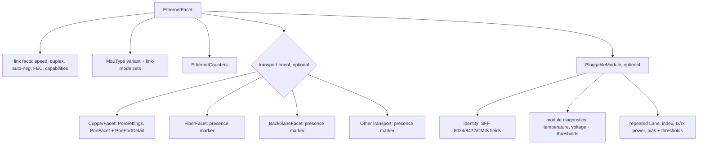
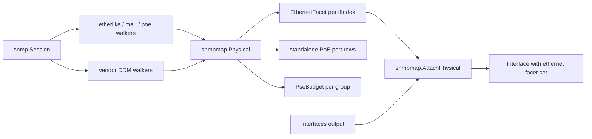

# PHY Transport Split and Deferred Physical-Layer Values - Plan

## Goal Capsule

- **Objective:** Land the physical-layer values the net core research deferred out of `flowseer.net.phy.v1`, reshaping `EthernetFacet` around a transport oneof (copper, fiber, backplane, other) and a pluggable-module message, so that per-transport facts such as PoE live only where they can exist and module facts exist only when a module does. The slice ships as the full layer pattern: schemas, conformance rules, generated bindings for the named MIBs, a phy mapper, and fixture-replay tests.
- **Product authority:** [The net core package research](../architecture/2026-08-26-net-core-package-research.md) and [the network-model direction record](../architecture/2026-08-20-network-model-structure-direction.md) fix the package's role and are amended by this work where they place lane-level optics outside phy. [The protobuf model conventions](../conventions/protobuf.md), [the proto style guide](../code-style-proto.md), [the Go style guide](../code-style.md), and [the doc style guide](../doc-style.md) govern shape and prose. The other deferred slices (switching bridge domains, packet matchers, routing) and the hardware component entity are not active scope.
- **Execution profile:** Seven units in dependency order, each landing with its regenerated output in one commit. Schema units first, generator config next, mappers last.
- **Stop conditions:** Surface instead of guessing when a change would alter product scope (R-IDs), reopen an accepted architecture decision beyond the recorded amendment, require a policy-surface edit (`buf.yaml`, hooks, `AGENTS.md`), or need a live-device write. Read-only lab walks to record fixtures are in scope.
- **Open blockers:** None.

---

## Product Contract

### Summary

Give `EthernetFacet` a transport oneof and a pluggable-module message, and fill them with the values the research record deferred: exact MAU types, advertised link modes, per-port PoE detail, transceiver identity, and typed per-lane optics with thresholds. Add Ethernet-specific error counters and a group-keyed PoE budget value, and prove every in-scope MIB field through generated bindings, a phy mapper, and replayed fixtures.

### Problem Frame

The phy package landed shallow on purpose. The research record deferred optics, MAU types, PoE budgets, and Ethernet counters to later hardware-component or capability work, and the README says lane-level optics belong to a future component model. That component model has no schema, no plan, and no consumer, while the lab fleet and the vendored MIBs already expose the deferred facts. Every field that waits for it is a walk value dropped today.

The landed facet is also flat. A medium enum sits beside PoE and transceiver messages, and CEL rules stop PoE from being delivered where support is false. Each deferred field added to that shape needs another guard to keep optics off copper ports and PoE off fiber ports, and the guards only reject the combinations after a producer has already built them.

### Key Decisions

- **Transport is a oneof of facets, not a medium enum with guards.** Copper, fiber, backplane, and other each become an arm carrying only the facts that transport can have, per the typed-variant convention. The oneof is optional on the facet because plain IF-MIB sources report no transport at all; a present arm carries its required payload and may omit fields whose own MIB source is unavailable. Chosen over sibling sub-facets tied to the medium by CEL, which would keep invalid combinations expressible. Governs R1, R2, R3.
- **Module identity and diagnostics hang off module presence, not off the medium.** A direct-attach cable or a copper SFP module carries full SFF-8472 identity while its medium is copper, so identity and per-lane diagnostics live on a pluggable-module message beside the transport oneof, present exactly when the source reports a cage. Chosen over placing them on the fiber arm, which would drop module inventory on the uplinks where direct attach is most common. Governs R2, R3, R6, R7.
- **Optics values live in phy as ref-free primitives; embedding elsewhere is decided later.** A future component entity embeds the same module, lane, and threshold messages. Chosen over keeping phy shallow until the component model exists, because that model has no schema or consumer and the values are ref-free either way. The direction record and phy README are amended in the same change. Governs R6, R7, R14.
- **The transceiver shape carries the enumerated SFF-8024, SFF-8472, and CMIS fields R6 and R7 name; further fields are added when a source populates them.** Fields no vendored MIB reaches are proven by presence and range rules with the specification cited inline, so a gNMI or REST source can fill them later. Chosen over an open-ended "complete per specification" bound, which gives planning no finish line and claims a conformance the rules cannot prove. Governs R6, R7, R12.
- **PoE budgets and per-port PoE rows are keyed by the PSE group.** POWER-ETHERNET-MIB keys both by PSE group, never by ifIndex, so the group index is the only identity that tells stacked units apart and joins a port's draw to its budget. The group index is a source-local key, not a ref. Chosen over placing the budget on `DeviceState` now, which would push a phy concern into the entity layer. Governs R5, R9.
- **Evidence is fixture replay, not the live lab.** Recorded walks replay through the existing fake session, as the interface and LLDP mappers are tested today. Lab access is needed once to record, never in CI. Governs R12, R13.
- **The landed phy shape breaks.** Moving medium, PoE, and transceiver fields into arms and the module message changes the wire shape of a package only its conformance tests consume today. The break is a fact of the change, per the repository's pre-stability rule, not a review condition. Governs R1.

### Requirements

**Transport split**

- R1. `EthernetFacet` keeps the transport-independent link facts (active speed, active duplex, applied auto-negotiation, FEC mode, capabilities, the exact MAU type, and the advertised and received auto-negotiation link modes from MAU-MIB with the IANA-MAU-MIB registry as the cited authority) and carries the transport as an optional oneof whose arms are copper, fiber, backplane, and other. An absent oneof means the source did not report a transport. The raw MAU registry value is retained losslessly and unknown values stay valid; any normalized taxonomy is additive to it, never a substitute.
- R2. Each transport arm is its own message holding only the facts that transport can have, so PoE on a fiber arm cannot be expressed. Module identity and diagnostics live only on the pluggable-module message of R3, so they cannot be expressed without a module. Backplane and other are presence-only arms in this slice and carry no fields.
- R3. `EthernetFacet` carries an optional pluggable-module message beside the transport oneof. An absent message means the source reported no cage; a present message with presence false is an explicitly empty cage and carries no identity or measurements; a present message with presence true carries the identity and diagnostics of R6 and R7. The transport arm is chosen from the strongest evidence the source gives (MAU type, then module media), and a present arm may omit fields whose MIB source is unavailable.

**Copper**

- R4. The copper arm carries the copper-specific facts only: PoE settings and PoE detail. MAU type and link modes are transport-independent and live on the facet per R1.
- R5. The copper arm carries the per-port PoE detail POWER-ETHERNET-MIB defines beyond what `PoeFacet` and `PoeSettings` hold today: the PSE group and port index as the row's source-local key, and the invalid-signature, power-denied, overload, short, and MPS-absent counters. Detection status stays on the existing PoE status enum, and admin state and priority stay on the settings message as intent. The mapper attaches a PoE row to an interface only through a fixture-tested join to ifIndex; until a source supplies that join, PoE port rows are returned standalone beside the interface results.

**Module identity and optics**

- R6. The pluggable-module message carries transceiver identity per SFF-8024 and SFF-8472, and CMIS module identity where a module implements it: form factor, connector type, vendor, part, revision, serial, date code, encoding, nominal bit rate, supported media and application codes, and per-lane nominal wavelength. Absent means not reported; a present value must not be empty.
- R7. The pluggable-module message carries typed digital-diagnostic measurements: module temperature and supply voltage, and per lane the transmit power, receive power, and laser bias current. Each measured metric carries its own high and low alarm and warning thresholds. Units and ranges are validated per metric.
- R8. Lane measurements are ordered by lane index, lane indexes are unique within a module, and a module with no lane measurements is valid.

**PoE budget**

- R9. A group-level PoE budget value carries the PSE group index as its scoping key and the group's nominal power, consumed power, usage threshold, and operational status per POWER-ETHERNET-MIB, with no device, component, or interface reference on it.

**Counters and capabilities**

- R10. Ethernet-specific error counters from EtherLike-MIB (alignment errors, FCS errors, single, multiple, late, and excessive collisions, deferred transmissions, carrier sense errors, frame-too-long, internal MAC transmit and receive errors, symbol errors) land in phy. Generic packet and octet counters stay in `net/interface`.
- R11. Values carried today by `EthernetCapabilities`, `EthernetSettings`, and `AutoNegotiationFacet` keep their meaning; the split moves fields, it does not redefine them.

**Evidence and delivery**

- R12. The in-scope MIB set is EtherLike-MIB, MAU-MIB, IANA-MAU-MIB, POWER-ETHERNET-MIB, and the vendored per-interface DDM MIBs (D-Link DDM and SFP info, HP ProCurve transceiver, H3C transceiver info). Every field one of these MIBs can populate is mapped by a phy mapper in `snmpmap` and proven by a replayed fixture; fields beyond that set are proven by presence and range rules and cite their specification inline. ENTITY-SENSOR-MIB diagnostics and the generic counters of R10 are outside this rule.
- R13. The generator config gains EtherLike-MIB, MAU-MIB, IANA-MAU-MIB, and POWER-ETHERNET-MIB, and the regenerated bindings land in the same change as the schemas and mapper.
- R14. The phy README, the net core research record, and the network-model direction record are amended in the same change to state the transport split, the module message, and phy's ownership of ref-free optics values, replacing the sentences that place lane-level optics outside phy.
- R15. Schema comments state only the contract with the primary source cited inline, and every new file follows one top-level declaration per file with `lower_snake_case.proto` names.

### Acceptance Examples

- AE1. **Covers R2.** Given a facet with the copper arm set, when a producer attaches PoE detail, then it validates; when a producer attaches a PoE row to the fiber arm, then there is no field to hold it and the message shape rejects the attempt at build time rather than through a validation rule.
- AE2. **Covers R1, R3.** Given an ifTable-only source that reports speed and duplex but no transport or cage, when the mapper builds the facet, then the transport oneof and the module message are both absent and the facet validates.
- AE3. **Covers R3, R6.** Given a module message with presence false, when it also carries a vendor name or a lane measurement, then validation fails; when it carries neither, it passes. Given a direct-attach cable in a cage on a copper arm, when the module message carries its vendor and serial, then it validates.
- AE4. **Covers R7, R8.** Given a four-lane module, when two lane entries share lane index 2, then validation fails; when lanes 1 through 4 each appear once with in-range power values, it passes.
- AE5. **Covers R1.** Given a MAU type value the IANA registry added after this schema shipped, when it is set on the facet, then validation passes, the raw value round-trips unchanged, and the mapper keeps the row.
- AE6. **Covers R9.** Given two PSE group rows from POWER-ETHERNET-MIB on a stacked switch, when the mapper maps them, then two budget values with distinct group indexes and no reference field are returned alongside the interface results rather than embedded in any interface.
- AE7. **Covers R12, R13.** Given a recorded walk from a lab switch that implements EtherLike-MIB but not MAU-MIB, when the mapper runs against the replayed fixture, then the error counters are populated, the MAU fields are absent, and no error is returned.
- AE8. **Covers R5.** Given a PSE port row for group 1 port 3 and no join rule for the device, when the mapper runs, then a standalone PoE row keyed by group and port is returned with its counters present and no copper arm claims it; given a fixture-tested join for that device, the same row lands on the matching copper arm.
- AE9. **Covers R2.** Given a facet whose transport arm is backplane or other, when a producer attaches any transport-specific field, then there is no field to hold it; a bare arm validates.

### Scope Boundaries

- Bridge domains and FID scoping, packet matchers, routing and network instances, and the other deferred slices stay in their own plans.
- The hardware component entity and its ENTITY-MIB mapping remain future work. This slice defines the values it will embed and does not define the entity, its refs, or the entity-to-interface alias join.
- Digital diagnostics reached only through ENTITY-SENSOR-MIB, keyed by physical entity, are not mapped in this slice. Per-interface vendor DDM MIBs are the only DOM sources mapped.
- Coherent-optics and CMIS fields land only as identity and per-lane diagnostics; CMIS application-selection, firmware, and control fields are out.
- No consumer of the PoE budget value is built; it returns as standalone group rows keyed by PSE group.

#### Deferred to Follow-Up Work

- A per-device PoE port-to-ifIndex join rule for the lab vendors. This slice returns PoE rows standalone (R5); the first vendor join lands when its fixture is recorded.
- Copper cable diagnostics (MDI pair status, length, distance to fault) that HP-ICF-TRANSCEIVER-MIB exposes. They belong on the copper arm but no requirement names them.
- The `ifMauStatus`, jabber, and false-carrier operational facts of MAU-MIB. Only the type and link-mode columns are in R1.

### Dependencies / Assumptions

- The vendored `spec/mib/ietf/` set carries EtherLike-MIB, MAU-MIB, IANA-MAU-MIB, and POWER-ETHERNET-MIB, and the D-Link, HP ProCurve, and H3C transceiver MIBs are vendored for per-interface DOM.
- SFF-8472 is a SNIA member document and CMIS is published by the OIF; inline citations point at the publisher's document page for each, and the schema does not reproduce their tables.
- The lab switches expose at least one of the IETF MIBs each, so their fixtures are recorded from real walks. No lab switch implements a vendored DDM MIB, so every optics fixture is authored from the MIB's own conformance statements, marked as authored, and cites the units and scaling it encodes so the mapper's conversions are reviewable.
- The D-Link and HP ProCurve DDM MIBs report one channel per interface; the H3C module also has a per-channel table keyed by ifIndex and channel index, which is the only multi-lane source in this slice.
- No Go code outside phy's conformance tests consumes the landed phy shape; the interface schema embeds the facet by value and follows the reshape in the same change.

### Outstanding Questions

**Deferred to Planning**

- Which lab switches answer MAU-MIB and POWER-ETHERNET-MIB walks. Resolved during U5 by recording; a MIB with no lab source gets an authored fixture per the Dependencies.

### Sources

- `docs/architecture/2026-08-26-net-core-package-research.md` PHY section for the implement-now and defer lists this slice pulls forward.
- `docs/architecture/2026-08-20-network-model-structure-direction.md` "Hardware ports are a later, separate object" and the 2026-09-04 amendment, both amended by R14.
- `spec/proto/flowseer/net/phy/v1/` for the landed shape and `test/conformance/proto/phy_rules_test.go` for the rules it enforces.
- `src/common/snmpmap/` for the mapper and fake-session fixture pattern the phy mapper follows, and `mibgen.yaml` for the module list R13 extends.
- `docs/research/network-domain-atlas/entities/02-interface.md` for the PoE port-numbering note that R5's join rule answers.
- `docs/plans/2026-08-30-1420-feat-net-interface-lldp-plan.md` for the landed layer pattern this plan repeats (schema units with conformance tests, generator entries, mapper with fake-session fixtures, dated amendment).
- IEEE 802.3 for PHY types and auto-negotiation; RFC 3635 (EtherLike-MIB), RFC 4836 (MAU-MIB), RFC 3621 (POWER-ETHERNET-MIB); SNIA SFF-8024 and SFF-8472, and OIF CMIS for transceiver identity and diagnostics.

Product Contract preservation: unchanged in meaning. The review-era Outstanding Questions on MAU representation and DDM fixture order were resolved into KTD2 and U6 and removed. Three items the units surfaced as adjacent work were added under Deferred to Follow-Up Work, and one Dependencies bullet was corrected because research found H3C carries a per-channel table.

---

## Planning Contract

### Key Technical Decisions

- KTD1. **The slice lands as the full layer pattern in one plan.** (session-settled: user-directed — chosen over schema-only or schema-plus-bindings delivery: every landed net layer shipped schemas, conformance rules, bindings, a mapper, and fixtures together, and a field with no mapper is a field with no evidence.) Governs R12, R13.
- KTD2. **MAU type is a typed variant: the IANA registry number or the raw OID.** `ifMauType` is an `AutonomousType` OID; IANA-MAU-MIB registers standard types as `dot3MauType.N`. The message holds a required oneof of the registry number `N` (a registry pass-through, no `defined_only`) or the raw OID string for a non-registry or unknown value, so nothing is lost and AE5 holds. Any normalized taxonomy is a later additive field. Instantiates R1.
- KTD3. **Link modes are a repeated registry pass-through enum whose values are the IANA-MAU-MIB bit positions.** `ifMauAutoNegCapAdvertisedBits` and `ifMauAutoNegCapReceivedBits` decode to bit sets; the schema enum numbers each mode by its `IANAifMauAutoNegCapBits` position, unknown positions stay valid, and the mapper needs no hand-coded table because the generated bindings name the positions. Same shape as the LLDP capability set. Instantiates R1.
- KTD4. **Optics measurements use linear integer units on the wire.** Transmit and receive power in nanowatts, bias current in microamperes, supply voltage in microvolts, temperature in millidegrees Celsius, thresholds in the same unit as their metric. SFF-8472 reports linear values in 0.1 µW, 2 µA, 100 µV, and 1/256 °C steps, and D-Link reports tenths of a microwatt, so these units carry them without loss; HP (thousandths of dBm) and H3C (hundredths of dBm) are converted by the mapper and lose only sub-nanowatt precision. Zero optical power is a plain zero, with no sentinel. Consumers derive dBm. Chosen over dBm on the wire, which has no representation for zero power and forces every producer through a logarithm. Governs R7.
- KTD5. **Lane diagnostics are a repeated lane message keyed by a 1-based lane index; module-level temperature and voltage sit beside it.** The H3C channel table supplies real multi-lane rows; single-channel sources emit lane 1. Mirrors OpenConfig physical-channels. Governs R7, R8.
- KTD6. **The phy mapper is a separate collection that attaches to interfaces by ifIndex.** `snmpmap.Physical` walks the phy MIBs and returns facets keyed by ifIndex plus standalone PoE port rows and PSE budgets; `snmpmap.AttachPhysical` sets the facet on each physical-arm interface the existing mapper returned. Chosen over folding the walks into `Interfaces`, which would make every interface collection pay for six extra tables and would have no home for rows that attach to nothing. Governs R5, R9, R12.
- KTD7. **Ethernet error counters are single `uint64` fields mapped HC-first from `dot3HCStatsTable` and falling back to `dot3StatsTable` per counter.** Same rule as the interface counters (KTD4 of the interface plan). `dot3StatsIndex` equals ifIndex per RFC 3635, so the join is direct. Governs R10.
- KTD8. **PoE rows keep their MIB keys as plain fields.** The copper arm's PoE detail and the PSE budget value carry `pse_group` and, for ports, `pse_port` as `uint32` source-local keys. The mapper's join to ifIndex is a per-device rule table that starts empty; a row with no rule is returned standalone (R5). Governs R5, R9.
- KTD9. **Vendor DDM bindings are generated in this slice.** `mibgen.yaml` gains the D-Link, HP ProCurve, and H3C transceiver modules and the three vendor search paths. Their import chains (`DLINK-ID-REC-MIB`, `HP-ICF-OID`, `HH3C-OID-MIB`, `SNMP-FRAMEWORK-MIB`) are vendored, so no generator change is expected. Governs R12.
- KTD10. **Field moves are plain moves.** Landed fields keep their names and meanings inside the arm or module message they move to; removed numbers on `EthernetFacet` are `reserved` with their names per the proto style guide's evolution rule, and the conformance tests are rewritten against the new shape. Instantiates the "landed phy shape breaks" Key Decision.
- KTD11. **The direction record and research record are amended in place plus a dated entry.** Following the direction record's `## Amendments` pattern: the "Hardware ports are a later, separate object" section and the README sentence move lane-level optics into phy as ref-free values, and a `### 2026-09-05` entry records why. Governs R14.

### High-Level Technical Design

Facet shape after the split (directional, not a schema listing):

Mapper data flow (U5, U6):

Arm selection order (R3): MAU type decides copper versus fiber when present; otherwise a module message with media decides; otherwise the arm stays absent. `ifType` alone never selects an arm because `ethernetCsmacd` says nothing about the medium.

### Assumptions

- The `verify-change` proto gate regenerates into a temp dir and diffs, so the field moves and reserved numbers are checked mechanically; no buf breaking baseline change is needed while the module-wide ignore stands.
- The H3C per-channel table's units match its per-interface table (hundredths of dBm); the mapper converts both through the same helper.
- The fake session's fixture helpers cover integer, string, counter, and stack values. BITS columns travel as octets and replay through the existing string helper; only an OID-valued helper is new, which U5 adds beside the existing ones.

---

## Implementation Units

Units run in dependency order. U1 and U2 are schema units, U3 the documentation amendment, U4 the generator config, U5 and U6 the mappers. U4 has no dependency on the schema units and may land in parallel with them.

### U1. Reshape EthernetFacet: transport oneof, MAU, counters, PoE detail, PSE budget

- **Goal:** `EthernetFacet` carries link facts, the MAU variant and link modes, Ethernet error counters, the optional transport oneof with its four arms, and the copper arm's PoE detail; a PSE budget value exists as a standalone message.
- **Requirements:** R1, R2, R4, R5, R9, R10, R11 (KTD2, KTD3, KTD7, KTD8, KTD10; AE1, AE2, AE5, AE6, AE9).
- **Dependencies:** None.
- **Files:** `spec/proto/flowseer/net/phy/v1/ethernet_facet.proto` (modify); new files `copper_facet.proto`, `fiber_facet.proto`, `backplane_facet.proto`, `other_transport.proto`, `mau_type.proto`, `mau_link_mode.proto`, `ethernet_counters.proto`, `poe_port_detail.proto`, `pse_budget.proto`; delete `ethernet_medium.proto`; `spec/proto/flowseer/net/phy/v1/README.md`; `test/conformance/proto/phy_rules_test.go`; regenerated `generated/go/proto/flowseer/net/phy/v1/`.
- **Approach:**
  1. Keep fields 4 through 8 of `EthernetFacet` in place; `reserved` 1 (`medium`), 2 (`poe`), and 3 (`transceiver`) with their names. Number the new scalars explicitly: `MauType mau_type = 9`; block 10 through 19 is the transport oneof; block 20 through 29 is reserved for embedded messages (the module lands at 20 in U2); repeated `MauLinkMode advertised_link_modes = 30`, `received_link_modes = 31`, and `EthernetCounters counters = 32`, with a comment that 30 and up is the post-block scalar range per the conventions doc.
  2. Add `oneof transport` with arms from 10: `CopperFacet copper = 10`, `FiberFacet fiber = 11`, `BackplaneFacet backplane = 12`, `OtherTransport other = 13`. No `(buf.validate.oneof).required`; absence means unreported.
  3. `CopperFacet` holds `PoeSettings settings`, `PoeFacet poe`, and `PoePortDetail detail`. `PoePortDetail` carries `pse_group`, `pse_port`, and the five RFC 3621 counters as `uint64`. The existing delivery-requires-support CEL rule moves with `PoeFacet` untouched.
  4. `FiberFacet`, `BackplaneFacet`, and `OtherTransport` are empty presence markers with a file comment stating what each will carry.
  5. `MauType` is a required oneof of `uint32 iana` (registry number, `gt: 0`) and `string oid` (dotted OID, pattern-validated). `MauLinkMode` is an open enum numbered by `IANAifMauAutoNegCapBits` position with `_UNSPECIFIED = 0` reserved for bit 0 `bOther`; document the deviation from the enum norm per the deviations convention.
  6. `EthernetCounters` holds one `uint64` per RFC 3635 counter named in R10. `PseBudget` holds `pse_group`, nominal power, consumption, and usage threshold in milliwatts and percent, and an open `PseOperStatus` enum.
  7. Rewrite the README's package paragraph for the new shape; every field comment states absence meaning and cites its source column.
- **Patterns to follow:** `spec/proto/flowseer/net/interface/v1/interface.proto` for a oneof beside other fields with arms from 10; `spec/proto/flowseer/net/addr/v1/ip.proto` for the required-oneof variant; `spec/proto/flowseer/net/interface/v1/interface_counters.proto` for counter naming; `docs/solutions/conventions/document-intentional-schema-deviations-with-comment-and-test.md` for the open-enum comment and pinned test.
- **Test scenarios (in `test/conformance/proto/phy_rules_test.go`):**
  - `Covers AE2.` An `EthernetFacet` with no transport arm validates (the module half of AE2 lands in U2).
  - `Covers AE1.` A copper arm with PoE detail validates; the fiber, backplane, and other arms have no PoE field (compile-time shape, asserted by building each arm bare).
  - `Covers AE9.` A bare backplane arm and a bare other arm validate.
  - `Covers AE5.` `MauType` with `iana = 200` validates; `MauType` with `oid = "1.3.6.1.4.1.9.99"` validates; an empty `MauType` fails the required oneof.
  - A `MauLinkMode` value with no defined name remains valid in the repeated field (pinned deviation test); duplicates fail.
  - `PoePortDetail` with `pse_group = 0` fails; with group and port set and counters absent validates.
  - `Covers AE6.` Two `PseBudget` values with distinct groups validate; usage threshold above 100 percent fails.
  - The existing auto-negotiation and PoE delivery rules still hold at their new locations.
- **Verification:** `buf lint` clean; `go test -race ./test/conformance/proto/` green; regenerated output committed; `layering_test.go` unchanged and green (phy still imports nothing FlowSeer-owned).

### U2. Pluggable module, lane diagnostics, and thresholds

- **Goal:** `EthernetFacet` carries an optional `PluggableModule` with SFF and CMIS identity, module-level diagnostics, and repeated lane diagnostics, each metric with its own thresholds.
- **Requirements:** R3, R6, R7, R8, R11 (KTD4, KTD5; AE3, AE4).
- **Dependencies:** U1.
- **Files:** `spec/proto/flowseer/net/phy/v1/ethernet_facet.proto` (add field 20); new files `pluggable_module.proto`, `module_form_factor.proto`, `module_connector.proto`, `module_diagnostics.proto`, `module_lane.proto`, `optical_power.proto`, `bias_current.proto`, `module_temperature.proto`, `supply_voltage.proto`; delete `transceiver_facet.proto`; `test/conformance/proto/phy_rules_test.go`; regenerated `generated/go/proto/flowseer/net/phy/v1/`.
- **Approach:**
  1. `PluggableModule` carries `bool present` (required), the identity fields of R6 (strings with `min_len = 1`, form factor and connector as open registry enums numbered by SFF-8024 identifier and connector codes), `uint32 nominal_bit_rate_mbps`, repeated media and application codes as `uint32`, `ModuleDiagnostics diagnostics`, and repeated `ModuleLane lanes`.
  2. One CEL rule on `PluggableModule`: presence false forbids every identity field, diagnostics, and lanes. Replaces the landed empty-cage rule.
  3. Each metric is its own message with `value`, `high_alarm`, `high_warning`, `low_warning`, `low_alarm` in the KTD4 unit, and a CEL rule ordering the thresholds when all four are present. `ModuleLane` has `uint32 index` (`gt: 0`), `tx_power`, `rx_power`, `bias`, and a per-lane `wavelength_nanometers`.
  4. `lanes` validates `unique` on index through a CEL rule (`this.lanes.map(l, l.index).unique()`, the idiom `switchport_facet.proto` already uses). Ascending order is a producer obligation stated in the `lanes` field comment, not a CEL rule, because the repo's protovalidate build registers no list extension that can compare neighbouring elements; the mapper sorts lanes by index before emitting.
  5. Field comments cite SFF-8024 (form factor, connector), SFF-8472 (identity bytes, diagnostics), and OIF CMIS (application codes) by document page, per R15.
- **Patterns to follow:** U1's files; `spec/proto/flowseer/net/phy/v1/poe_facet.proto` for milliwatt-style integer units and the presence comment idiom.
- **Test scenarios (in `test/conformance/proto/phy_rules_test.go`):**
  - `Covers AE3.` A module with presence false and a vendor name fails; with presence false and nothing else passes; with presence true and vendor plus serial passes.
  - `Covers AE4.` Four lanes with indexes 1 through 4 and in-range powers pass; two lanes sharing index 2 fail.
  - `Covers AE2.` An `EthernetFacet` with no transport arm and no module message validates.
  - A metric whose high alarm is below its high warning fails; thresholds with only two of four set pass.
  - An empty vendor string fails `min_len`; an absent vendor passes.
  - A form-factor value with no defined name stays valid (pinned deviation test).
  - A module with presence true and no lanes validates.
- **Verification:** `buf lint` clean; conformance tests green; regenerated output committed.

### U3. Amend the direction record, the research record, and the phy README

- **Goal:** The accepted records state that phy owns the transport variants and the ref-free module values, replacing the sentences that placed lane-level optics outside phy.
- **Requirements:** R14 (KTD11).
- **Dependencies:** U1, U2 (so the amendment describes the landed shape).
- **Files:** `docs/architecture/2026-08-20-network-model-structure-direction.md`; `docs/architecture/2026-08-26-net-core-package-research.md`; `spec/proto/flowseer/net/phy/v1/README.md`; `spec/proto/flowseer/README.md`.
- **Approach:**
  1. In the direction record, rewrite "Hardware ports are a later, separate object" so the component tree is still future work but the module and lane values it will embed live in phy now, and add a `### 2026-09-05` amendment entry recording the transport split, the module message, and why.
  2. In the research record's PHY section, move the optics, MAU, PoE budget, and Ethernet-counter items from Defer to Implement now with one sentence each, leaving the component-entity items deferred.
  3. Rewrite the phy README's transceiver sentence and add MAU-MIB, POWER-ETHERNET-MIB counters, SFF-8472, and OIF CMIS to Sources; update the one-line phy entry in the packages README.
- **Patterns to follow:** The direction record's existing `## Amendments` entries (2026-08-30, 2026-09-04) for shape and register.
- **Test scenarios:** Test expectation: none -- documentation only; `verify-change` runs the markdown link check.
- **Verification:** `verify-change` passes on the four files; no sentence in the three records still places lane-level optics outside phy (grep for "component model" in the phy README returns only the future-embedding sentence).

### U4. Generator config: IETF phy modules and vendor DDM modules

- **Goal:** Generated bindings exist for EtherLike-MIB, MAU-MIB, IANA-MAU-MIB, POWER-ETHERNET-MIB, DLINKSW-DDM-MIB, DLINKSW-SFPINFO-MIB, HP-ICF-TRANSCEIVER-MIB, and HH3C-TRANSCEIVER-INFO-MIB.
- **Requirements:** R12, R13 (KTD3, KTD9).
- **Dependencies:** None.
- **Files:** `mibgen.yaml`; `mibgen-baseline.yaml`; regenerated `generated/go/mib/{etherlikemib,maumib,ianamaumib,powerethernetmib,dlinkswddmmib,dlinkswsfpinfomib,hpicftransceivermib,hh3ctransceiverinfomib}/`; `src/protocol/snmp/cmd/mibgen/testdata/module-resolution.txt`, regenerated with `go test ./src/protocol/snmp/cmd/mibgen -run TestModuleResolution -update-resolution`.
- **Approach:**
  1. Add the four IETF modules as plain entries. IANA-MAU-MIB precedes MAU-MIB in the list so the typed `IANAifJackType` and the bit-position constants are emitted (a scratch run confirmed the difference).
  2. Add `spec/mib/dlink`, `spec/mib/hp/procurve`, and `spec/mib/hp/hh3c` to `search_paths` and the four vendor modules as entries. Their imports resolve to vendored `DLINK-ID-REC-MIB`, `HP-ICF-OID`, `HH3C-OID-MIB`, and the IETF base modules.
  3. Run `go run ./src/protocol/snmp/cmd/mibgen -refresh-baseline`. For each new `pending` group in `mibgen-baseline.yaml`, either fix the vendored source of truth or set the group to `recorded` with a reason, never the generated output; then run the `-check` drift gate.
- **Execution note:** Land the config change and the full regeneration in one commit; run `go run ./src/protocol/snmp/cmd/mibgen -check` unsandboxed.
- **Patterns to follow:** The existing `mibgen.yaml` entries and the MIKROTIK-MIB comment on cross-path imports.
- **Test scenarios:**
  - `mibgen -check` reports no drift after regeneration.
  - The generated `maumib` package exposes `IfMauType` as an OID column and `IfMauAutoNegCapAdvertisedBits` as a bit set; `ianamaumib` exposes named bit positions.
  - The generated `powerethernetmib` package exposes both `PethPsePortTable` and `PethMainPseTable` rows with two-arc and one-arc indexes.
  - `TestModuleResolution` passes with the eight new lines in its fixture, and `TestBaselineComplete` passes with the new modules.
- **Verification:** `verify-change` MIB gates pass (`mibgen -check`, baseline-complete test); `go build ./...` green.

### U5. Physical-layer mapper for the IETF MIBs

- **Goal:** `snmpmap.Physical` maps EtherLike-MIB, MAU-MIB, and POWER-ETHERNET-MIB rows into facets keyed by ifIndex, standalone PoE port rows, and PSE budgets, and `snmpmap.AttachPhysical` sets facets on physical interfaces.
- **Requirements:** R1, R3, R5, R9, R10, R12 (KTD2, KTD3, KTD6, KTD7, KTD8; AE2, AE5, AE6, AE7, AE8).
- **Dependencies:** U1, U4.
- **Files:** `src/common/snmpmap/phy.go`, `src/common/snmpmap/phy_test.go`; `src/common/snmpmap/fake_session_test.go` (add an OID-valued fixture helper); fixture files under `src/common/snmpmap/testdata/phy/` for recorded walks.
- **Approach:**
  1. `Physical(ctx, sess)` walks `dot3StatsTable`, `dot3HCStatsTable`, `ifMauTable`, `ifMauAutoNegTable`, `pethPsePortTable`, and `pethMainPseTable`, keeping partial results with their error as `Interfaces` does. Result type holds `Facets map[uint32]*phyv1.EthernetFacet`, `PoePorts []PoePortRow`, and `Budgets []*phyv1.PseBudget`. `PoePortRow` is a mapper-side struct holding `Group`, `Port`, and the three proto messages a copper arm carries (`PoeSettings`, `PoeFacet`, `PoePortDetail`), mirroring the struct-beside-message shape of the LLDP mapper.
  2. Counters HC-first per KTD7; a counter is set only when the row's `Observed` says the column landed.
  3. MAU: take the row with the lowest `ifMauIndex` per ifIndex; map `ifMauType` through the KTD2 variant (registry number when the OID is under `dot3MauType`, raw OID otherwise, absent for `zeroDotZero`); decode the two link-mode bit sets into the KTD3 enum. Select the copper or fiber arm from the MAU type's medium class; when the type is unknown, select from the module's media per R3 (U6 supplies it); leave the arm absent when neither is known.
  4. PoE port rows map admin state and priority into `PoeSettings`, detection status and class into `PoeFacet`, and the group, port, and five counters into `PoePortDetail`, all on one `PoePortRow`. `AttachPhysical(ifaces, result, joins)` takes a per-device join map and moves the three messages onto the matching copper arm; rows with no join stay in `PoePorts`.
  5. Record one walk each from the Cisco SG220 and the LANCOM GS unit for EtherLike-MIB, and for MAU-MIB and POWER-ETHERNET-MIB where a device answers, as varbind fixture files; author a fixture from the MIB conformance statements for any table no device answers and mark it authored in the file header. Keep LANCOM walks under its GetBulk size limit by using small repetitions when recording.
- **Execution note:** Write the fixture-replay tests first from the recorded or authored fixtures, then make the mapper satisfy them. Recording is read-only SNMP against the lab; no device write is needed.
- **Patterns to follow:** `src/common/snmpmap/ifmib.go` (row types, `Observed` presence, `errs` codes, decline-not-error); `src/common/snmpmap/lldp.go` for index-arc decoding of two-arc keys; `src/common/snmpmap/fake_session_test.go` fixture helpers.
- **Test scenarios:**
  - `Covers AE7.` A replayed SG220 walk with EtherLike rows and no MAU rows yields facets with counters set and no MAU fields, and no error.
  - `Covers AE5.` An `ifMauType` OID outside the IANA registry maps to the `oid` variant unchanged; `dot3MauType.30` maps to `iana = 30`; `zeroDotZero` leaves the field absent.
  - A `1000BaseTFD` MAU type selects the copper arm; a `1000BaseSXFD` type selects the fiber arm; an unknown OID selects no arm.
  - Advertised link modes with an unnamed bit position map to an enum value with that number.
  - HC and 32-bit counters both present: HC wins; only 32-bit present: it is used; neither: the field is absent.
  - `Covers AE8.` A PoE port row for group 1 port 3 with no join stays in `PoePorts`; with a join entry mapping to ifIndex 3 it lands on that interface's copper arm and leaves `PoePorts`.
  - `Covers AE6.` Two PSE group rows yield two budgets with distinct group keys.
  - `Covers AE2.` An interface with no phy rows keeps an absent facet after `AttachPhysical`.
  - A failed MAU walk keeps the EtherLike and PoE results and returns the walk error.
  - A short or malformed two-arc index declines the row rather than panicking.
- **Verification:** `go test -race ./src/common/snmpmap/` green; golangci-lint clean; fixture files carry a header naming the device or "authored" and the MIB units they encode.

### U6. Physical-layer mapper for the vendor DDM MIBs

- **Goal:** `snmpmap.Physical` also maps the D-Link, HP ProCurve, and H3C transceiver tables into `PluggableModule` messages with identity, module diagnostics, and lanes, converting each vendor's units to the KTD4 wire units.
- **Requirements:** R3, R6, R7, R8, R12 (KTD4, KTD5, KTD6, KTD9; AE3, AE4).
- **Dependencies:** U2, U4, U5.
- **Files:** `src/common/snmpmap/phy_ddm.go`, `src/common/snmpmap/phy_ddm_test.go`; authored fixture files under `src/common/snmpmap/testdata/phy/`.
- **Approach:**
  1. Walk each vendor's per-interface table only when its root answers; a device implements at most one, and a missing subtree is a decline, not an error.
  2. Identity: D-Link SFP info supplies form factor, connector, encoding, vendor, part, revision, serial, date code, bit rate, and wavelength; HP supplies model, serial, connector, wavelength; H3C supplies type, vendor, serial, wavelength. Unmapped identity fields stay absent.
  3. Diagnostics: convert D-Link tenths of a microwatt to nanowatts, HP thousandths of dBm and H3C hundredths of dBm to nanowatts through one helper, temperatures to millidegrees, voltages to microvolts, bias to microamperes; thresholds through the same conversions. HP's zero-power sentinel maps to zero.
  4. Lanes: D-Link and HP emit lane 1; H3C emits one lane per channel-table row keyed by channel index.
  5. Presence: a table row present for the interface means presence true; a vendor column that reports "no module" maps to presence false; no row means the module message is absent.
- **Execution note:** Fixtures are authored from the MIBs' conformance statements because no lab switch implements these modules; each fixture header cites the MIB units it encodes so the conversions are reviewable.
- **Patterns to follow:** U5's mapper and fixtures; `docs/solutions/architecture-patterns/decode-failure-blast-radius-in-generated-walks.md` for the cost of a decline inside a generated walk.
- **Test scenarios:**
  - `Covers AE3.` A D-Link row for an empty cage maps to presence false with no identity; a DAC row on a copper-arm interface maps vendor and serial with presence true.
  - `Covers AE4.` An H3C module with four channel rows maps four lanes in ascending index order; channel rows delivered as 2, 1, 4, 3 still map to lanes 1 through 4 in order.
  - HP `-5840` thousandths of dBm maps to the nanowatt value within one nanowatt of the analytic result; HP's `-99999999` sentinel maps to zero.
  - D-Link `1234` tenths of a microwatt maps to 123400 nanowatts exactly.
  - A threshold set maps in the same units as its metric and passes the ordering rule.
  - An interface with no vendor DDM row keeps an absent module message.
  - A vendor subtree that is entirely absent yields no error and no modules.
- **Verification:** `go test -race ./src/common/snmpmap/` green; golangci-lint clean.

### U7. Interface package follow-through

- **Goal:** The interface package and its conformance tests compile and pass against the reshaped facet, and the packages README describes the new phy contents.
- **Requirements:** R11 (KTD10).
- **Dependencies:** U1, U2.
- **Files:** `spec/proto/flowseer/net/interface/v1/physical_interface.proto` (comment only, if its facet comment names the medium); `test/conformance/proto/interface_rules_test.go` (only if it builds phy messages); regenerated `generated/go/proto/flowseer/net/interface/v1/`.
- **Approach:** Regenerate, run the full conformance package, and fix any test that constructed the removed fields. Research found no such test, so this unit is expected to be a verification pass. The packages README line is owned by U3.
- **Test scenarios:** Test expectation: none -- no behavior change; existing interface conformance cases must stay green.
- **Verification:** `go test -race ./test/conformance/proto/` green after U1 and U2 regenerate.

---

## Verification Contract

| Gate | Command | Applies to |
|---|---|---|
| Diff-aware repo gates | `.claude/skills/verify-change/scripts/verify-change.sh -- <changed paths>` | every unit |
| Full sweep before completion | `.claude/skills/verify-change/scripts/verify-change.sh --full` (unsandboxed) | after U6 |
| Proto lint and format | `buf format -d --exit-code && buf lint` (run by verify-change) | U1, U2, U7 |
| Generated-output drift | `buf generate` to a temp dir plus diff (run by verify-change) | U1, U2, U7 |
| MIB binding drift | `go run ./src/protocol/snmp/cmd/mibgen -check` (run by verify-change, unsandboxed) | U4 |
| Race tests | `go test -race ./test/conformance/proto/ ./src/common/snmpmap/ ./src/protocol/snmp/...` | U1, U2, U4, U5, U6, U7 |
| Lint | `golangci-lint run` on touched packages, never on `generated/` | U5, U6 |

`buf generate`, `mibgen -check`, and the network-bound protocol tests need unsandboxed runs in this environment. Never hand-edit `generated/` or `buf.lock`.

---

## Definition of Done

- All seven units landed with regenerated output committed alongside the change that causes it: `generated/go/proto/flowseer/net/phy/v1/` for U1 and U2, `generated/go/proto/flowseer/net/interface/v1/` for U7, `generated/go/mib/` for U4.
- `verify-change --full` passes.
- Every acceptance example AE1 through AE9 is covered by a named conformance or mapper test.
- Every fixture file under `src/common/snmpmap/testdata/phy/` names its device or is marked authored and cites the MIB units it encodes.
- The three records in R14 contain no sentence placing lane-level optics outside phy, and the direction record carries the dated amendment.
- Every open enum that accepts undefined values carries its contract comment and a pinned conformance test.
- No dead-end or experimental code remains in the diff.

## Deferred / Open Questions

### From 2026-09-05 review

- **Deferred values lack a user outcome** — Product Contract objective and Problem Frame (P1, cross-model product-lens peer, confidence 75)

  The slice can satisfy every schema, mapper, and fixture check while producing no user-visible improvement. It expands the package contract and preserves more walk data, but names no operator or developer workflow, consuming surface, baseline pain, or success signal. Without that link the team cannot tell whether pulling optics and PoE forward is more valuable than starting the component model or a narrower diagnostic capability.

### From 2026-09-05 code review

- **Vendor transceiver walks are unconditional.** `walkModules` walks all five
  vendor tables on every device; a device that implements none of them pays
  about thirteen padded GetBulk round trips per `Physical` call, and the lab
  LANCOM turns a padded response into a timeout. The fix is a table probe or a
  sysObjectID gate at the walker level, not in the mapper. Left for the
  follow-up that adds vendor gating across every optional walk.
