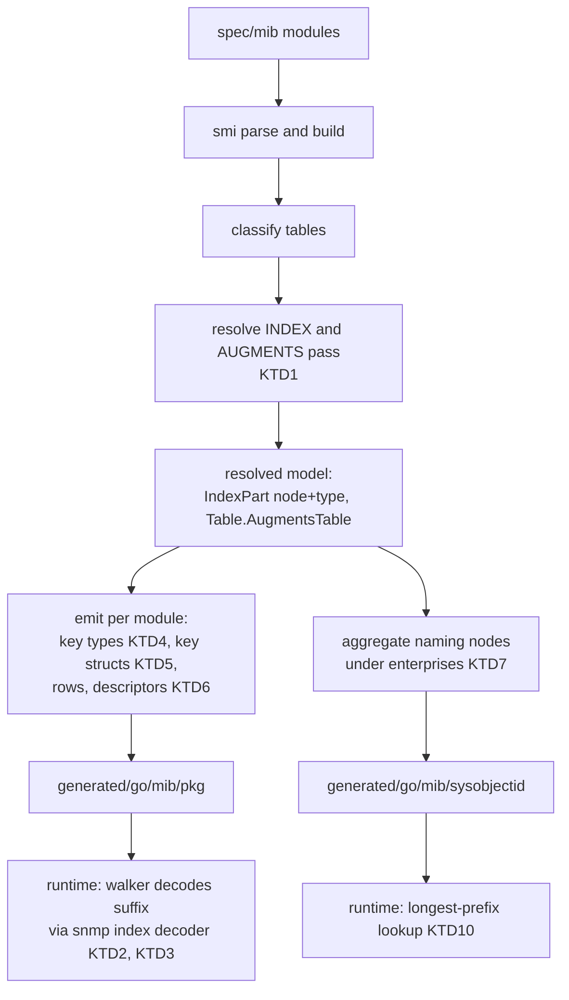
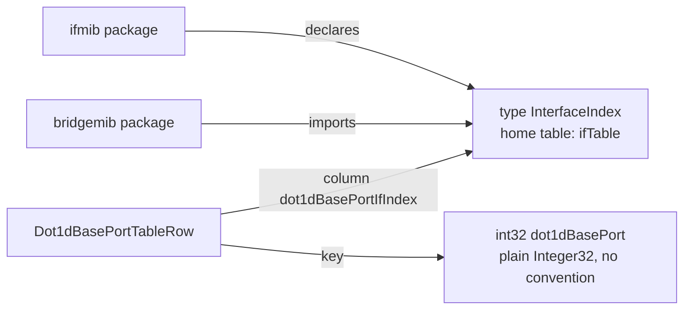

# mibgen Key Resolution and Device Identity - Plan

## Goal Capsule

- **Objective:** Generated MIB bindings carry what the MIBs already declare about row keys, cross-table references, table identity, and vendor product identity, so a mapper layer can join tables and recognise devices without hand-written index decoding or a curated device table.
- **Product authority:** This plan owns the `smi` model resolution and the `mibgen` emitter additions. The mapper layer that consumes them, including a collector, per-mapper detection, and the move of `src/common/snmpmap` out of `src/common`, is a separate follow-up and not active scope here.
- **Authority hierarchy:** Repository conventions govern implementation. Requirements govern observable behaviour of the model, the generator, and the generated code. Key Technical Decisions govern the mechanism within those constraints.
- **Execution profile:** Land the model resolution first with its diagnostics and fixtures, then the runtime decoder, then the emitter changes, then regeneration and the mapper rewrite. Every emitter change regenerates the golden fixture and the committed bindings in the same commit.
- **Stop conditions:** A change that cannot deliver a row with a malformed index suffix without failing the walk requires revising KTD3, not silently failing rows. A new diagnostic that fires on a configured module without a baseline entry stops generation by design and is resolved by a deliberate baseline or snapshot update, never by suppressing the diagnostic.
- **Tail ownership:** Implementation includes regeneration of `generated/go/mib`, the golden fixture, corpus snapshots, the diagnostic coverage matrix, documentation in the changed packages, and the repository verification gate.
- **Open blockers:** None.

---

## Product Contract

Product Contract restructured, no scope change: session-settled annotations added to four existing Key Decisions; no R-ID changed.

### Summary

Resolve `INDEX`, `AUGMENTS`, and keyed textual conventions in the `smi` model, and have `mibgen` emit typed row keys, one Go key type per keyed textual convention, a per-table descriptor, and a sysObjectID identity table built from every naming node under the enterprises subtree of the configured modules.

### Problem Frame

Generated rows carry their key only as a raw OID suffix, and every mapper decodes it by hand. The `smi` model keeps `INDEX` and `AUGMENTS` clauses as unresolved names on the grounds that no consumer read index structure. Joins between tables, such as bridge port to interface, are therefore written per mapper even though the MIBs declare them through shared textual conventions like `InterfaceIndex`. Nothing generated says which table a walker covers, what its change indicator is, or what key type it produces, so a collector cannot deduplicate walks or declare dependencies from generated data. Vendor product subtrees, thousands of named OID assignments across the vendored MIBs, are parsed and then discarded, so a sysObjectID resolves to nothing.

The follow-up mapper layer needs all four facts from generated code. Without them it would restate them by hand, which is the drift this plan removes.

### Key Decisions

- **Keys and references are resolved from the MIBs, never declared by hand.** `INDEX`, `AUGMENTS`, and textual conventions are the source of truth. (session-settled: user-directed — chosen over hand-written join code in mappers: the MIBs already declare these relationships, and only joins the MIB cannot express stay in mapper code.) Governs R1, R2, R3, R5, R6.
- **Device identity is derived from MIB naming nodes.** No family declaration file. (session-settled: user-directed — chosen over a hand-curated family file feeding the generator: the vendor subtrees already encode identity, and a declaration would only restate them and drift.) Governs R10, R11.
- **No curated family-to-mapper table is generated.** Which mappers apply to a device is decided by per-mapper detection in the follow-up layer, so this plan emits identity and descriptors only. (session-settled: user-directed — chosen over a generated family table with mapper sets: probing the device answers the same question and stays correct for firmware a table predates.) Governs R8, R9.
- **The identity table is generated output, not part of `snmpmap`.** (session-settled: user-directed — chosen over placing it in `src/common/snmpmap`: generated artifacts live under `generated/`, and the mappers must consume identity, not own it.) Governs R11.
- **Compiled code only; no runtime profile layer.** (session-settled: user-approved — chosen over data-driven vendor profiles pushed at runtime: the hot-update benefit needs a deployed fleet that does not exist, and the projects that went data-driven still kept a code path for hard vendors.)
- **Resolution lives in `smi`, on the model.** The `IndexPart` comment that calls non-resolution settled is superseded: there is now a consumer. (session-settled: user-approved — chosen over resolution private to the generator: any consumer benefits, and mibgen stays an emitter.) Governs R1, R2, R3.
- **Named key types per textual convention, mirroring MIB imports.** A keyed textual convention becomes a Go type in the package of the module that declares it; index fields and referencing columns share it. Package dependencies follow MIB `IMPORTS` clauses, using the existing cross-module type resolution and its fallback. (session-settled: user-approved — chosen over descriptor-only metadata with plain-typed keys, which checks joins only at runtime, and over per-table key structs, which couple packages by table instead of by import.) Governs R4, R5, R6, R7.
- **The reference rule is general, not interface-specific.** Any textual convention that keys a table marks a reference wherever a column uses it. (session-settled: user-approved — chosen over marking only `InterfaceIndex`: ENTITY-MIB, sensors, and vendor MIBs reuse standard keyed conventions.) Governs R6.
- **Naming nodes under the enterprises subtree are collected automatically.** No per-module opt-in root. (session-settled: user-approved — chosen over configured roots per module, which need a config line and a human to find the root per vendor.) Governs R10.
- **Vendor product MIBs are ordinary configured modules with full packages.** No identity-only flag. Measured parse cost across all 1680 vendored files is about one second, and the Foundry and Comware product MIBs are names-only, so their packages are tiny. The LANCOM release MIB is the exception: it carries full tables, so listing it produces a large package and baseline entries. (session-settled: user-approved — chosen over an identity-only flag nobody needs yet and over scanning the whole search path, which would need its own diagnostic tolerance rule.) Governs R12, R13.
- **Landed row shapes may break.** The raw OID index field on rows is replaced by typed keys rather than kept alongside them; existing mappers are updated in the same change. (session-settled: user-directed — chosen over keeping the raw field for compatibility: the project is pre-stability and breaking landed shapes that improve the design is expected.) Governs R4, R14.

### Requirements

**Model resolution (`smi`)**

- R1. Each `INDEX` part resolves to the node it names and that node's effective type, including whether the type is a textual convention and whether the part is `IMPLIED`.
- R2. A table whose row uses `AUGMENTS` resolves to the augmented table and inherits its resolved key.
- R3. An index part that cannot be resolved, because its node is in a module that is not loaded or its type is unknown, is recorded as unresolved with a diagnostic; the table stays in the model with a raw key.

**Generated keys and references (`mibgen`)**

- R4. Every generated row type carries one typed field per index part, in `INDEX` order, in place of the raw OID index field.
- R5. A textual convention that keys at least one table in the loaded set is emitted as a named Go key type in the package of its declaring module, and every index part or column using that convention is emitted with that type.
- R6. A column whose type is a keyed textual convention is a reference to the table that convention keys; the generated column carries that reference so a consumer can join without knowing the MIB.
- R7. When a key type's declaring module is not configured, the field degrades to the base Go type through the existing cross-module fallback, and generation reports which references degraded.

**Table descriptor**

- R8. Every generated table exports one descriptor value holding its root OID, its change indicator when one exists, and its key type.
- R9. The descriptor is usable at runtime to probe for the table's presence on an agent and to declare the table as a dependency, without importing the table's row or walker types.

**Device identity**

- R10. Every naming node below the enterprises subtree in a configured module, from either a plain OID assignment or an `OBJECT-IDENTITY`, is emitted with its OID, its name, and its description when present.
- R11. The naming nodes of all configured modules are aggregated into one generated package that imports no per-module package and supports longest-prefix lookup of a sysObjectID, returning the deepest known node.

**Configuration and gating**

- R12. Adding a vendor product MIB requires only listing the module in `mibgen.yaml`; identity for that vendor appears on regeneration.
- R13. The diagnostic baseline, the `-check` drift mode, and the golden emitter fixture gate the new shapes exactly as they gate existing ones.

**Compatibility**

- R14. Mappers in `src/common/snmpmap` compile against the new row shapes with their own index decoding removed, and their tests pass unchanged in behaviour.

### Acceptance Examples

- AE1. **Covers R1, R4, R5.** Given IF-MIB is configured, when `ifTable` is generated, then its row carries an `ifIndex` field of the `InterfaceIndex` key type declared in the IF-MIB package, and no raw OID index field.
- AE2. **Covers R2.** Given `ifXTable` augments `ifEntry`, when generated, then its row carries the same typed key as `ifTable` without its own `INDEX` clause.
- AE3. **Covers R5, R6.** Given BRIDGE-MIB imports `InterfaceIndex` from IF-MIB and both are configured, when `dot1dBasePortTable` is generated, then its key struct carries `dot1dBasePort` as a plain `int32` field, since its syntax is an inline `Integer32 (1..65535)` and not a convention, its `dot1dBasePortIfIndex` column carries the IF-MIB `InterfaceIndex` type, and that column is marked as a reference to `ifTable`.
- AE4. **Covers R3, R7.** Given a module whose index part names a type from an unconfigured module, when generated, then the field is emitted in its base Go type, generation succeeds, and the degraded reference is reported.
- AE5. **Covers R8, R9.** Given ENTITY-MIB with its configured shared indicator, when generated, then each covered table's descriptor names `entLastChangeTime` as its indicator and `PhysicalIndex` as its key type.
- AE6. **Covers R10, R11, R12.** Given FOUNDRY-SN-ROOT-MIB is added to `mibgen.yaml`, when regenerated, then a lookup of an ICX 6610 stack sysObjectID returns the `snFastIronStackICX6610` node, and a lookup of an unknown child under `snFastIronStackFamily` returns the family node.
- AE7. **Covers R11.** Given a sysObjectID under an enterprise number no configured module declares, when looked up, then the result is not found rather than a wrong vendor.
- AE8. **Covers R13.** Given an emitter change to key or descriptor output, when `-check` runs against committed bindings, then drift fails the run.

### Scope Boundaries

- The mapper layer: collector, per-mapper detection, dependency declaration at runtime, and moving `src/common/snmpmap` into the local-network adapter. Follow-up brainstorm.
- Vendor names for enterprise numbers. No MIB carries them; they are hand-written where identity is consumed.
- Joins the MIB does not declare, such as LLDP local port to interface through `lldpLocPortId` and its subtype. These stay mapper code.
- Runtime-loaded profiles, an identity-only module flag, and scanning unconfigured MIBs on the search path.
- `sysORTable` as a detection source. That is a runtime concern of the mapper layer.
- References for plain-typed index columns. An index declared with an inline `Integer32` or `Unsigned32` syntax, such as `dot1dBasePort`, `hrDeviceIndex`, or `entLogicalIndex`, produces no key type and no reference under this plan; joins on those stay mapper code.

#### Deferred to Follow-Up Work

- Configuring the LANCOM release MIB. Its product OIDs sit in a module with full tables, so it is added when a mapper needs those tables, per KTD8.
- A generic collector-side join helper over key types. It belongs to the mapper layer.

<!-- ce-section: work-relationships -->
### How This Work Fits Together

This plan owns the generator and model side. The breakdown below is the current understanding, not a committed roadmap.

- Mapper layer (collector, detect, dependency declaration, package move and rename)
  - Depends on R4 through R11 of this plan for typed keys, references, descriptors, and identity.
  - Still to decide: the package home under the local-network adapter, and whether central hosts the same adapter.
- Local-network integration kind (edge agent adapter)
  - Depends on the mapper layer.
  - Shares the per-integration quirk configuration where family defaults such as GetBulk caps live.
- Unknown-sysObjectID reporting to central
  - Can proceed independently of this plan once R11 exists; it consumes the not-found result.

### Dependencies / Assumptions

- The existing cross-module type resolution in the emitter, with its fallback when the home module is unconfigured, is the mechanism for R5 and R7.
- `smi.ModuleSet.Type` resolves a type name across loaded modules and is sufficient for R1.
- Parsing the whole vendored corpus costs about one second, so generation time is not a constraint on how many modules are configured.
- The LANCOM release MIB defines tables as well as product OIDs, so configuring it costs a full package and baseline entries; that cost is accepted when it is configured.
- Breaking landed generated shapes is acceptable at this stage of the project.

### Outstanding Questions

**Deferred to Implementation**

- KTD4's lowest-OID tiebreak picks `lldpPortConfigTable` as the home table for `LldpPortNumber`, while a consumer following that key needs `lldpLocPortTable`. Four LLDP tables are solely indexed by that convention. The reviewer proposed preferring the table whose index column is the convention's canonical column, falling back to the widest table. Decide the rule in U3 with the LLDP case as the test, and record it on KTD4.

### Sources

- `src/protocol/smi/model.go` — `IndexPart`, `Table.Augments`, and the comment this plan supersedes.
- `src/protocol/snmp/cmd/mibgen/emit_tc.go` — cross-module type resolution and its fallback.
- `src/protocol/snmp/cmd/mibgen/emit_table.go`, `emit_watch.go` — current row and watcher emission, including the only `TableRoot` accessor.
- `src/protocol/snmp/cmd/mibgen/baseline.go`, `mibgen-baseline.yaml` — the diagnostic gate.
- `src/common/snmpmap/ifmib.go` — hand index decoding this plan removes.
- `spec/mib/ietf/BRIDGE-MIB` — `dot1dBasePortIfIndex` with `SYNTAX InterfaceIndex`, indexed by `dot1dBasePort`.
- `src/protocol/smi/testdata/corpus/*.snapshot` — per-vendor diagnostic counts; LANCOM carries most of the corpus errors.
- `docs/plans/2026-08-30-1606-feat-mib-parser-plan.md` — the earlier decision not to resolve index semantics.
- `docs/architecture/2026-08-20-device-service-and-inventory-direction.md` — integration kinds and the rejection of untyped runtime adapters.
- `docs/solutions/architecture-patterns/decode-failure-blast-radius-in-generated-walks.md` — a decode error inside a generated walk stops the table; the rule behind KTD3.

---

## Planning Contract

### Key Technical Decisions

- KTD1. **A resolver pass after classification resolves index structure.** `INDEX` parts and `AUGMENTS` targets are resolved in one pass that runs after every module's tables are built, using the own-module, then imports, then lenient-scan precedence the resolver already uses for declarations. `IndexPart` gains the resolved node, its effective type, and an unresolved flag; `Table` gains the augmented table. Cross-module `AUGMENTS` needs every table to exist first, which rules out resolving inside per-module table building. Governs R1, R2, R3. Cites the "Resolution lives in `smi`" Key Decision.
- KTD2. **A generic index-suffix decoder lives in the SNMP library.** One function decodes an OID suffix against an ordered list of part shapes: integer, fixed-length octets, length-prefixed octets, `IMPLIED` octets, fixed and length-prefixed and `IMPLIED` OIDs, and IPv4 address. Generated code calls it with a shape list derived from the resolved `INDEX`. The three hand-rolled decoders in `snmpmap` cover exactly these shapes and are the conformance reference. Governs R4.
- KTD3. **A malformed index suffix never fails the walk.** When the suffix does not match the declared shape, the typed key is zero, a per-row key-valid flag reports it, and the row is still delivered. The raw suffix stays reachable as the iterator's key. A decode error inside a generated walk stops the whole table and discards later rows, so an index decode must coerce, not decline. Governs R4.
- KTD4. **Key types are named integer or string types with a home table.** A textual convention is keyed only when its declaring module also declares at least one table whose sole index part is that convention; conventions handled by the well-known branch (`MacAddress`, `PhysAddress`, `DisplayString`, `DateAndTime`, `TruthValue`, `RowStatus`) and enumerated conventions are never keyed, and a table indexed solely by an excluded convention gets a plain base-typed key with no reference. A keyed convention is emitted in its declaring module's package as a named type over its base type, with the same decode bundle the enum path emits. The type carries a method that returns its home table's descriptor, where the home table is the table in the declaring module whose sole index part is that convention; the tiebreak when several qualify is an open question, see Outstanding Questions. A column references a table by carrying that key type, so no per-column metadata is needed. Governs R5, R6. Cites the "Named key types per textual convention" Key Decision.
- KTD5. **Rows carry a composite key struct, and augmenting rows reuse the augmented table's.** Each table with a fully resolved index gets a comparable key struct with one typed field per part, and the row's key field is that struct. An augmenting table's row uses the augmented table's key struct, cross-package when the augmented table lives in another configured module. A table with an unresolved part keeps a raw OID key field, which is the R3 fallback. Octet-string parts are emitted as `string`, IPv4-address parts as `netip.Addr`, and OID parts as their dotted-decimal `string`, so every key struct stays comparable and usable as a map key; the column of the same object keeps its existing `net.IP` or `snmp.OID` type. Governs R2, R3, R4.
- KTD6. **The table descriptor is a value type defined in the SNMP library and populated by the generator.** The existing per-table descriptor singleton gains a method that returns a library-defined descriptor value holding the root OID, the change indicator when one exists, and the key type name. A consumer holds descriptors generically, so a collector can probe and declare dependencies over a slice of descriptors without generics over row types. Governs R8, R9.
- KTD7. **Identity is aggregated by a generator-level pass into one package.** After all modules are emitted, the generator collects every naming node under the enterprises subtree across configured modules, sorts by OID, deduplicates identical OIDs by module name order, and writes one package holding a sorted table plus a longest-prefix lookup that uses the library's prefix search. Descriptions are kept to the first paragraph, capped at 240 characters, to bound package size. This is the first cross-module emitter in the generator; every existing emitter is per module. Governs R10, R11. Cites the "Device identity is derived from MIB naming nodes" Key Decision.
- KTD8. **Foundry and Comware product MIBs are configured now; LANCOM waits.** The two names-only MIBs prove the identity path at near-zero package cost. The LANCOM release MIB is configured when a mapper needs its tables. Governs R12.
- KTD9. **New diagnostics get fixtures, baseline entries, and deliberate snapshot updates in the same change.** Each new code gets a catalog entry, a malformed fixture, and a regenerated coverage matrix. Where a new code fires on a vendored MIB, the affected corpus snapshot and the mibgen baseline are updated in the same commit with the reason in the commit message. Governs R3, R13.
- KTD10. **The longest-prefix search is a small sorted-slice type in the SNMP library.** Lookups happen once per device, so a sorted slice with binary search on the OID ordering is enough. No trie. Governs R11.

### High-Level Technical Design

Directional guidance, not implementation specification.

Cross-module key typing, the BRIDGE-MIB case:

Runtime key decode outcome per row:

| Suffix vs declared shape | Typed key | Key-valid flag | Row delivered | Iterator key |
|---|---|---|---|---|
| Matches | populated | true | yes | raw suffix |
| Malformed or short | zero | false | yes | raw suffix |
| Table has unresolved part | raw OID field | n/a | yes | raw suffix |

### Assumptions

- The walker's iterator already yields the raw suffix as the sequence key, so KTD3 needs no new surface for the raw value.
- No existing `mibgen.yaml` override targets an index column or a keyed textual convention, so the integer-only override path is untouched. Verified at implementation by grepping overrides against the resolved key set.
- The cross-module qualifier's fallback to the base type is the correct behaviour for R7; the addition is a report of which references degraded, not a change in fallback.

### Sequencing

U1 first, since every emitter unit reads the resolved model. U2 is independent of U1 and may run in parallel. U3 needs U1 for the resolved model and U2 for the index decoder and the descriptor value type. U4 and U5 need U3 only for the shared emitter context, and may run in parallel with each other. U6 needs U3, U4, and U5, since it regenerates everything. U7 needs U6. U8 runs alongside each unit and is checked at the end.

---

## Implementation Units

### U1. Resolve INDEX and AUGMENTS in the smi model

- **Goal:** The model exposes resolved index structure and augmented-table links, with diagnostics for what could not be resolved.
- **Requirements:** R1, R2, R3. KTD1, KTD9.
- **Dependencies:** None.
- **Files:** `src/protocol/smi/model.go`, `src/protocol/smi/resolve.go`, `src/protocol/smi/internal/catalog/catalog.go`, `src/protocol/smi/zz_generated_codes.go` (regenerated), `src/protocol/smi/COVERAGE.md` (regenerated), `src/protocol/smi/testdata/malformed/unresolved-index-part/`, `src/protocol/smi/testdata/malformed/unresolved-augments/`, `src/protocol/smi/testdata/corpus/*.snapshot` (updated where affected), `src/protocol/smi/resolve_test.go`, `src/protocol/smi/semantic_test.go`, `src/protocol/smi/doc.go`.
- **Approach:**
  1. Extend `IndexPart` with the resolved node, its effective type, a keyed-convention flag, and an unresolved flag. Rewrite the comment that calls non-resolution settled.
  2. Add an augmented-table pointer on `Table`.
  3. Add a resolver pass after the classification loop that resolves each part's name with the declaration precedence per KTD1, and each `AUGMENTS` target to a row node and its table.
  4. Add two diagnostic codes, one per unresolved shape, raised with the part or target name.
  5. Regenerate the code catalog and coverage matrix; add one malformed fixture per code with its expected code set.
  6. Run the corpus snapshot tests; update snapshots where the new codes fire on vendored MIBs, listing which modules in the commit message.
- **Patterns to follow:** `resolver.lookupDecl` precedence in `resolve.go`; `Type.Unresolved` and `Node.Unresolved` for the unresolved shape; existing fixtures under `testdata/malformed/`.
- **Test scenarios:**
  - Covers AE1. IF-MIB's `ifTable` resolves one part, `ifIndex`, typed `InterfaceIndex`, flagged as a keyed convention.
  - Covers AE2. `ifXTable` resolves its augmented table to `ifTable` and carries no parts of its own.
  - Multi-part index, `dot1qTpFdbTable`, resolves both parts in declared order with the `IMPLIED` flag false.
  - An `IMPLIED` string part resolves with the flag true.
  - A part naming a column of another loaded module resolves through the imports precedence.
  - A part naming an unknown column raises the unresolved-index-part code; the table remains in the model with the part flagged.
  - An `AUGMENTS` target in an unloaded module raises the unresolved-augments code; the table remains with no augmented link.
  - Loading the full corpus with the new pass changes no snapshot except those updated in this unit.
- **Verification:** Package tests pass under race; the coverage matrix test passes with the new codes; corpus snapshot tests pass.

### U2. Index-suffix decoder and prefix search in the SNMP library

- **Goal:** Runtime helpers exist for decoding an OID suffix into typed parts and for longest-prefix lookup over sorted OIDs.
- **Requirements:** R4, R11. KTD2, KTD3, KTD10.
- **Dependencies:** None.
- **Files:** `src/protocol/snmp/index.go`, `src/protocol/snmp/index_test.go`, `src/protocol/snmp/oidset.go`, `src/protocol/snmp/oidset_test.go`, `src/protocol/snmp/table.go`, `src/protocol/snmp/table_test.go`, `src/protocol/snmp/doc.go`, `src/protocol/snmp/README.md`.
- **Approach:**
  1. Define a part-shape enum and a decoder that consumes a suffix against a shape list, returning typed values and a boolean for a clean match; never an error for a malformed suffix, per KTD3.
  2. Port the three hand-rolled shapes from `snmpmap` as the reference behaviour: single integer, fixed three-arc composite, variable-length address with family and length.
  3. Add a sorted OID set with insert-sorted construction and a longest-prefix lookup by binary search on `OID.Compare`.
  4. Define the table descriptor value type per KTD6: root OID, optional change indicator, key type name, and a presence probe that issues one GetNext under the root and reports whether the reply stays inside it. U3's home-table accessor and U4's generator method both return this type.
- **Patterns to follow:** `OID.At`, `OID.Len`, `OID.HasPrefix`, `OID.Compare` in `oid.go`; decline-not-error guidance in the blast-radius solution doc.
- **Test scenarios:**
  - A single integer suffix decodes to one value with a clean match.
  - A fixed three-arc suffix decodes three values in order.
  - A length-prefixed octet string decodes to the bytes; a length exceeding the remaining arcs yields a non-clean match with zero value.
  - An `IMPLIED` octet string consumes all remaining arcs.
  - A length-prefixed OID part decodes to an OID value.
  - An IPv4 address part decodes four arcs; fewer arcs yield a non-clean match.
  - A suffix with trailing extra arcs after all parts yields a non-clean match but populated parts.
  - Longest-prefix lookup returns the deepest matching entry, the exact entry when present, and not-found for an OID under an unknown root.
  - Lookup on an empty set returns not-found.
  - The presence probe against a fake session returns true when the first reply is under the root and false when it is outside or an end-of-MIB.
  - Descriptors collected into one slice can be probed in a loop without referencing any row type.
- **Verification:** Package tests pass under race; fuzz-style test on random suffixes never panics.

### U3. Emit key types, key structs, and typed row keys

- **Goal:** Generated packages carry named key types per keyed convention, a key struct per table, and rows keyed by those structs instead of a raw OID field.
- **Requirements:** R4, R5, R6, R7. KTD3, KTD4, KTD5.
- **Dependencies:** U1, U2.
- **Files:** `src/protocol/snmp/cmd/mibgen/emit_tc.go`, `src/protocol/snmp/cmd/mibgen/emit_table.go`, `src/protocol/snmp/cmd/mibgen/emit_key.go` (new), `src/protocol/snmp/cmd/mibgen/emit_test.go`, `src/protocol/snmp/cmd/mibgen/testdata/golden/fakemib/mib.go` (regenerated), `src/protocol/snmp/cmd/mibgen/testdata/mibs/FAKE-MIB.mib` (extended), `src/protocol/snmp/cmd/mibgen/testdata/mibs/FAKE-KEYS-MIB.mib` (new, declares the keyed convention and its home table), `src/protocol/snmp/cmd/mibgen/testdata/golden/fakekeysmib/mib.go` (new golden), `src/protocol/snmp/cmd/mibgen/doc.go`.
- **Approach:**
  1. Compute the keyed-convention set per loaded module set per KTD4: every textual convention that is the type of a sole index part of some table in its own declaring module, excluding well-known and enumerated conventions.
  2. Add a resolution branch beside the well-known and enum branches that emits a named Go type for a keyed convention in its declaring module's package, with decode bundle and a home-table accessor per KTD4. Cross-module references go through the existing qualifier; on fallback, record the degraded reference and print it in the generation report.
  3. Emit a key struct per fully resolved table; augmenting tables reference the augmented table's struct. Unresolved tables keep a raw OID key field.
  4. In the row struct, replace the raw index field with the key field and add the key-valid flag.
  5. In the walker's row assembly, decode the iterator's suffix with the U2 decoder against the table's shape list, per KTD3.
  6. Extend the fake MIB with a multi-part table, an `IMPLIED` string index, and an augmenting table; add a second fake module declaring a keyed convention and its home table, and reference that convention from the first. The golden test renders both modules with a config naming both packages; the degraded scenario re-renders the first module with the second removed from the config. Regenerate both golden outputs.
- **Patterns to follow:** `enumResolved` bundle shape and `crossModuleQual` in `emit_tc.go`; row struct literal and `Observed` bit emission in `emit_table.go`.
- **Test scenarios:**
  - Covers AE1. Golden output for the fake IF-MIB analogue shows a named key type and a row keyed by it, with no raw index field.
  - Covers AE2. The augmenting table's row uses the augmented table's key struct.
  - Covers AE3. A column typed by a keyed convention from another configured module is emitted with the qualified type, and the type's home-table accessor points at the keyed table; the referencing table's own plain `Integer32` index stays an `int32` field with no key type.
  - `dot1dTpFdbTable`, indexed solely by `MacAddress`, yields no `MacAddress` key type and no reference on any `MacAddress` column.
  - `ipSystemStatsTable`, indexed solely by `InetVersion`, yields no reference on any `InetVersion` column.
  - Covers AE4. With the declaring module removed from the test config, the column falls back to the base type and the report lists the degraded reference.
  - A multi-part key struct has fields in `INDEX` order with octet parts as `string`.
  - A key struct for a table with an IpAddress index part and one with an OID index part both compile as map keys.
  - Walking a fake session whose suffix is shorter than declared delivers the row with a zero key and a false key-valid flag, and the walk continues.
  - A convention keying several tables in its module resolves its home table per the rule settled for the open question, with `LldpPortNumber` resolving to `lldpLocPortTable`.
- **Verification:** Golden test passes after regeneration; generator package tests pass under race; a `-check` run against the committed bindings reports drift until U6 regenerates them.

### U4. Emit the per-table descriptor

- **Goal:** Each generated table exports a descriptor value with root OID, change indicator, and key type, usable without the row types.
- **Requirements:** R8, R9. KTD6.
- **Dependencies:** U3.
- **Files:** `src/protocol/snmp/cmd/mibgen/emit_table.go`, `src/protocol/snmp/cmd/mibgen/emit_indicator.go`, `src/protocol/snmp/cmd/mibgen/testdata/golden/fakemib/mib.go` (regenerated).
- **Approach:**
  1. Extend the existing table singleton with a method returning the U2 descriptor value, referencing the already-emitted indicator variable when the table has one.
  2. Regenerate the golden fixture.
- **Patterns to follow:** `tableIndicatorsByOID` lookup in the emitter context; the `TableRoot` accessor on watchers in `emit_watch.go`.
- **Test scenarios:**
  - Covers AE5. Golden output for a table under a shared scalar indicator names that indicator and its key type in the descriptor.
  - A table with no indicator yields a descriptor whose indicator is absent.
  - Descriptors collected from several generated packages into one slice can be probed in a loop without referencing any row type.
- **Verification:** Generator package tests pass under race; golden test passes.

### U5. Emit the sysObjectID identity package

- **Goal:** One generated package resolves a sysObjectID to the deepest known naming node across configured modules.
- **Requirements:** R10, R11. KTD7, KTD10.
- **Dependencies:** U2, U3.
- **Files:** `src/protocol/snmp/cmd/mibgen/emit_identity.go` (new), `src/protocol/snmp/cmd/mibgen/main.go`, `src/protocol/snmp/cmd/mibgen/emit_test.go`, `src/protocol/snmp/cmd/mibgen/testdata/golden/sysobjectid/mib.go` (new golden), `src/protocol/snmp/cmd/mibgen/doc.go`.
- **Approach:**
  1. After the per-module emission loop, walk every configured module's nodes and select naming nodes whose OID lies under the enterprises subtree.
  2. Sort by OID; deduplicate identical OIDs by module name order; trim descriptions per KTD7.
  3. Emit one package with the sorted entry table and a lookup function backed by the U2 prefix search. The package imports only the SNMP library.
  4. Add a golden fixture for the identity package built from two fake vendor modules.
- **Patterns to follow:** the per-package dispatch map emission in `emit_dispatch.go` for table-shaped output; the generation report for counts.
- **Test scenarios:**
  - Covers AE6. Two fake modules with nested product nodes produce a table where lookup of a leaf returns the leaf and lookup of an unknown child returns its parent.
  - Covers AE7. Lookup under an enterprise number no module declares returns not-found.
  - A node declared in two modules at the same OID appears once, attributed to the module first in name order.
  - A description longer than the cap is cut to the first paragraph and the cap.
  - Nodes outside the enterprises subtree are absent from the table.
  - The generated package's import list contains only the SNMP library.
- **Verification:** Golden test passes; generator package tests pass under race.

### U6. Configure product MIBs and regenerate bindings

- **Goal:** Committed bindings reflect the new shapes, and Foundry and Comware identities resolve.
- **Requirements:** R12, R13. KTD8, KTD9.
- **Dependencies:** U3, U4, U5.
- **Files:** `mibgen.yaml`, `mibgen-baseline.yaml`, `generate.go`, `generated/go/mib/**` (regenerated via `go generate`), `src/protocol/snmp/cmd/mibgen/baseline_test.go`, `src/protocol/snmp/cmd/mibgen/testdata/module-resolution.txt` (regenerated with `-update-resolution`).
- **Approach:**
  1. Add `spec/mib/ruckus/icx` and `spec/mib/hp/hh3c` to the search paths and list FOUNDRY-SN-ROOT-MIB, HH3C-OID-MIB, and HH3C-PRODUCT-ID-MIB as modules. HH3C-OID-MIB carries the Comware enterprise and product-family roots that the product MIB imports; without it those parents are absent from the identity table.
  2. Refresh the module-resolution pin with `go test ./src/protocol/snmp/cmd/mibgen -run TestModuleResolution -update-resolution` and review the two new lines.
  3. Regenerate through the repository generate directive; never edit generated output by hand.
  4. Refresh the baseline for new diagnostics on the configured modules, reviewing each new entry against KTD9.
  5. Run `-check` to confirm the committed output matches.
- **Patterns to follow:** existing module entries in `mibgen.yaml`; the baseline two-tier gate in `baseline.go`.
- **Test scenarios:**
  - Covers AE6. An integration-style test in the generator package loads the real config and resolves the ICX 6610 stack OID to its node.
  - A sysObjectID under the Comware product subtree with an unlisted final arc resolves to the `hh3cProductId` node rather than not-found.
  - Covers AE8. A deliberate emitter tweak in a temp copy makes `-check` fail; reverting makes it pass.
  - `-verify` loads all configured modules without error.
- **Verification:** `go generate .` at the root is idempotent; `-check` passes; the full repository build compiles against the regenerated packages.

### U7. Rewrite mappers against typed keys

- **Goal:** Mappers use generated keys and references and no longer decode index suffixes.
- **Requirements:** R14.
- **Dependencies:** U6.
- **Files:** `src/common/snmpmap/ifmib.go`, `src/common/snmpmap/lldp.go`, `src/common/snmpmap/ifmib_test.go`, `src/common/snmpmap/lldp_test.go`, `src/common/snmpmap/fake_session_test.go`, `src/common/snmpmap/doc.go`.
- **Approach:**
  1. Remove `singleIndex`, `remIndex`, and the management-address suffix parser; read the typed key from each row.
  2. Keep the LLDP local-port to interface resolution as mapper logic, since the MIB does not declare it.
  3. Rows with a false key-valid flag are treated as declines per the package's existing rules.
- **Execution note:** Keep the existing tests as characterization coverage and change only their row construction, so behaviour differences surface as failures.
- **Patterns to follow:** decline semantics in the package doc; `InterfacesFromRows` as the pure-rows shape.
- **Test scenarios:**
  - Covers AE1. Interfaces map from rows keyed by the generated `InterfaceIndex` type with identical output to the current fixtures.
  - Covers AE2. ifXTable enrichment joins on the shared key struct rather than a decoded integer.
  - LLDP remote entries with a three-part key map identically to the current fixtures.
  - A row with a false key-valid flag is reported through the joined error and does not stop mapping of the other rows.
  - The management-address path still decodes its address payload from the column, not from the index.
- **Verification:** Package tests pass under race with unchanged expected outputs.

### U8. Documentation and conventions

- **Goal:** Package docs, the conformance notes, and the solution index describe the new shapes.
- **Requirements:** R13.
- **Dependencies:** U1 through U7.
- **Files:** `src/protocol/smi/doc.go`, `src/protocol/snmp/doc.go`, `src/protocol/snmp/README.md`, `src/protocol/snmp/cmd/mibgen/doc.go`, `docs/plans/2026-08-30-1606-feat-mib-parser-plan.md` (one-line note that index resolution landed), `CONCEPTS.md`.
- **Approach:**
  1. Document the resolved index model, the key-valid flag semantics, the descriptor, and the identity package where each lives.
  2. Confirm the Naming Node and Key Convention entries in `CONCEPTS.md` still match what shipped.
- **Test expectation:** none — documentation only; the markdown link check in the verifier covers it.
- **Verification:** Verifier passes on the changed docs.

---

## Verification Contract

| Gate | Command | Applies to | Done signal |
|---|---|---|---|
| Diff-aware verifier | `.claude/skills/verify-change/scripts/verify-change.sh -- <changed paths>` | every unit | passes |
| Full verifier before handoff | `.claude/skills/verify-change/scripts/verify-change.sh --full` (needs an unsandboxed run for socket-binding tests) | U6, U7, final | passes |
| smi package | `go test -race ./src/protocol/smi/...` | U1 | passes, coverage matrix current |
| Full corpus | `go test -tags=smi_corpus_full -run TestCorpus ./src/protocol/smi/` | U1 | snapshots match |
| SNMP library | `go test -race ./src/protocol/snmp/...` | U2, U4 | passes |
| Generator golden | `go test ./src/protocol/snmp/cmd/mibgen -run TestEmit_FakeMIB_Golden` | U3, U4, U5 | passes after `-update-golden` |
| Bindings drift | `go run ./src/protocol/snmp/cmd/mibgen -check` | U6 | no drift |
| Mappers | `go test -race ./src/common/snmpmap/...` | U7 | passes with unchanged outputs |
| Lint | `golangci-lint run` via the verifier | all | clean, generated excluded |

---

## Definition of Done

- Every requirement R1 through R14 is satisfied and every acceptance example AE1 through AE8 has a passing test named in its unit.
- All gates in the Verification Contract pass, including the full verifier run outside the sandbox.
- Committed bindings, the golden fixtures, the coverage matrix, the baseline, and the corpus snapshots are regenerated, and `-check` passes.
- No generated file was edited by hand.
- Abandoned attempts and experimental code are removed from the diff.
- Documentation in U8 is updated in the same change that invalidated it.
- The verifier receipt is fresh for the final changed set.
