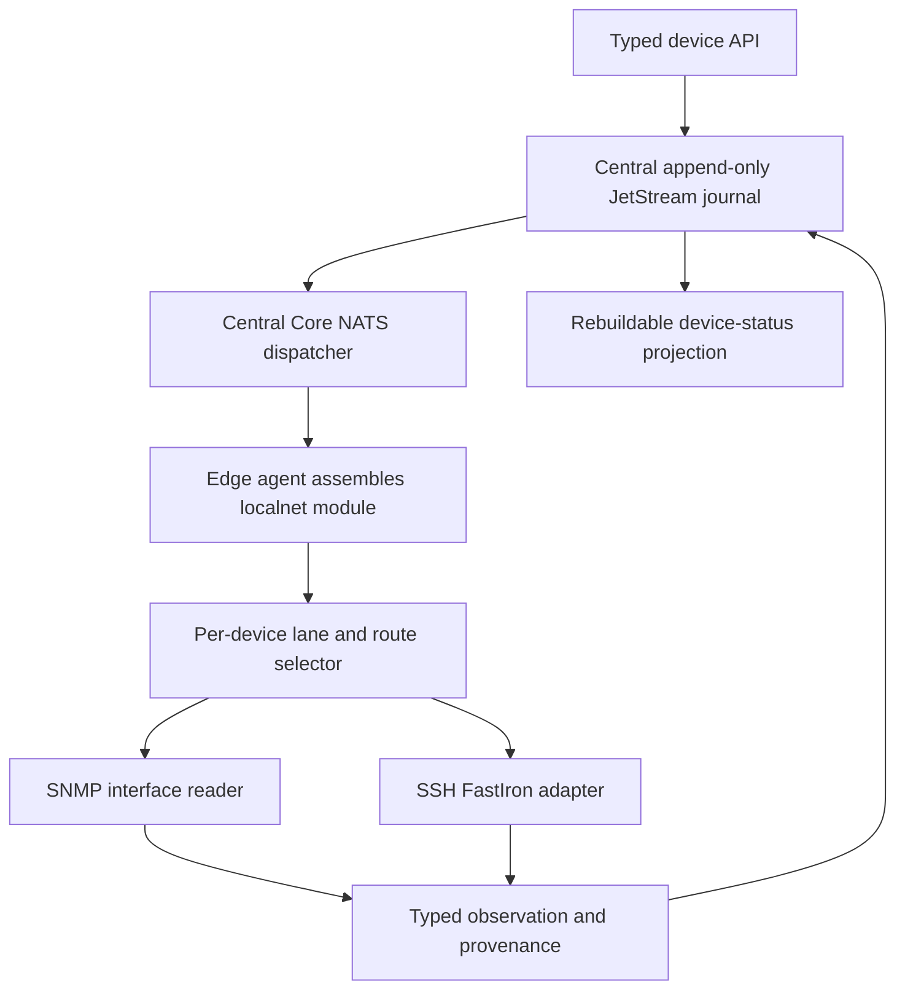
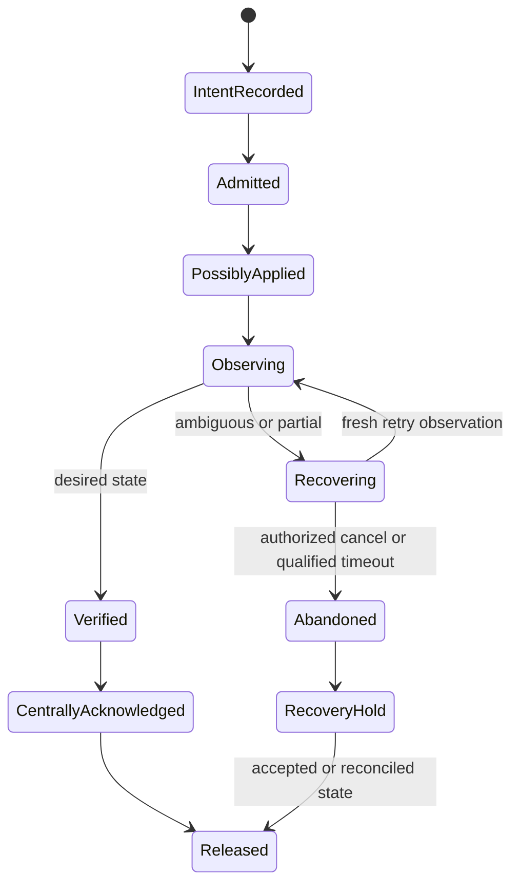

# Verified Local Device Access - Plan

## Goal

Operators can read and change one FastIron device interface through the fastest trustworthy local route, while each mutation stays ordered and blocked until semantic verification is durably acknowledged.
Slice 1 builds the vertical path with one edge member, a central operation journal, SNMP and SSH reads, and an SSH interface-description mutation against FastIron 10.0.10g.
Stop if the device cannot expose a complete independent read of the changed interface state, or if the central journal cannot durably checkpoint `POSSIBLY_APPLIED` before command submission.

## Decisions

- This plan implements Slice 1 only. (session-settled: user-directed — chosen over planning all delivery slices now: the first verified path should settle the abstractions before failover work.) Governs active requirements and defers R27-R30 and R50.
- Route to the local-network integration before selecting a protocol. (session-settled: user-directed — chosen over central protocol routing: useful fallback depends on live local evidence.) Governs R5-R10.
- Learn access behavior for one device and exact firmware. (session-settled: user-directed — chosen over vendor-wide learning: protocol quality changes at firmware granularity.) Governs R11-R12.
- Choose the lowest-cost trustworthy route, with SNMP as the cold-start prior and tie-breaker. Why: completeness and recent failure cost can outweigh session setup cost. Governs R8-R10 and R47.
- Require semantic verification for every write capability. (session-settled: user-directed — chosen over idempotency markers alone: a marker cannot prove what the device applied.) Governs R17-R22.
- Keep an ambiguous mutation indeterminate until recovery establishes state. (session-settled: user-directed — chosen over terminal failure: connection failure does not reveal whether the device changed.) Governs R19-R24.
- Order active device I/O per device at the edge. (session-settled: user-directed — chosen over global ordering or central-only deduplication: device effects share one local fault boundary.) Governs R13-R16 and R25-R31.
- Use central acknowledgement as the mutation barrier. (session-settled: user-approved — chosen over asynchronous result telemetry: later mutations require a durable terminal disposition.) Governs R1-R4, R15, R23-R24, and R53.
- Support `OPERATOR_MANAGED` and `AUTHORITATIVE` modes. (session-settled: user-directed — chosen over one drift policy: manual and centrally managed devices require different resolution.) Governs R3-R4, R32-R34, R51, and R53.
- Require positive fencing before a successor may mutate. (session-settled: user-approved — chosen over lease-expiry fencing: a paused process can resume after its time check.) Governs R27-R30 and R50. See [Pacemaker fencing guidance](https://clusterlabs.org/projects/pacemaker/doc/3.0/Clusters_from_Scratch/html/cluster-setup.html).
- Permit cancellation or timeout to abandon recovery without claiming success. (session-settled: user-directed — chosen over indefinite recovery: unreachable devices need an explicit terminal disposition.) Governs R23-R24.
- Keep transport packages domain-free and capability mappings above them. Why: routing and device policy must not leak into protocol libraries. Governs R35-R40.
- Fail closed when identity, read authority, journal continuity, or execution authority is uncertain. Why: availability cannot justify an unsafe retry. Governs R12, R19-R24, R27-R28, R47-R50, and R59.
- Keep legacy management protocols disabled by default. Why: Telnet and weak SNMP require an explicit per-device exception, never learned fallback. Governs R38, R43-R46, and R55.
- Prove one typed shell adapter before designing a shell DSL. Why: a second firmware implementation must demonstrate the reusable variation. Governs R35-R37 and R56.
- KTD1. Amend both accepted device-service direction records before schemas land. Preserve the landed Edge entity, `IntegrationConfig.edge` pointer, Connect enrollment, heartbeat, administration, and authenticated NATS handoff; amend only the protocol-neutral binding, device package boundaries, credential delivery, liveness authority, and future positive fencing. Why: the records still route through a protocol-bearing binding and leave device-access details open.
- KTD2. Put shared operation values in `spec/proto/flowseer/device/access/v1/`; keep `api/device/v1`, `integration/device/v1`, and `event/device/v1` as sibling consumers that never import one another; put the shared error payload in `errs/v1`. The shared values import the entity model, while each boundary imports only the shared values and errors. Why: `flowseer.service.v1` stays private to the process-local bus.
- KTD3. Connect the device service to the accepted external three-server central NATS cluster and create two file-backed R3 authorities with `SyncAlways`: a no-TTL, compare-and-set safety-state KV that always retains each device's high-watermark and unresolved barrier, and an immutable audit stream with configured `MaxAge` and `MaxBytes`, `DiscardNew`, deletion and purge denial, no rollups, and no per-message TTL. Missing or corrupt safety state blocks admission, including after audit expiry; startup rejects missing audit bounds or capacity, warns at 80% and 90%, and blocks admission when full. Why: retention may age history but must never erase execution safety. See [stream configuration](https://docs.nats.io/nats-concepts/jetstream/streams).
- KTD4. Every per-device phase change uses a transactional outbox in one safety-state KV CAS: store the new phase, event ID and payload, and `audit_pending`; publish that immutable event with deduplication; then CAS-clear the marker and erase its event ID and payload, retaining only the high-watermark and current safety fields. Restart repairs a pending event by comparing the audit tail, republishing the same ID when absent, and clearing only after acknowledgement. Intent dispatch, `POSSIBLY_APPLIED` acknowledgement, terminal acknowledgement, and barrier release each wait for a clear marker, so every inter-store crash leaves a repairable blocked state without bypassing evidence retention.
- KTD5. Keep materialized device status as a rebuildable projection, and require a terminal result acknowledgement plus authoritative status query after reconnect. Why: a Core NATS reply alone cannot close the durable mutation barrier.
- KTD6. Add `DeviceConfig.access_policy_handle` as `flowseer.device.policy.v1.AccessPolicyHandle`, an explicitly non-entity opaque key plus version from a dependency-leaf package. Slice 1 scopes every policy, credential, and trust handle to one deployment-configured tenant root; payloads carry no tenant selector. The policy binds versioned per-route device credential and SSH host-trust handles, never `IntegrationConfig.credential_ref`. `AcquireReadCredential` supplies read/preflight material; after `POSSIBLY_APPLIED`, `OpenDeviceSubmission` delivers the secret once and emits authority pulses checked immediately before each command. Unavailable pinned versions keep work indeterminate until restoration or R23 abandonment. Why: secrets and write authority must stay off NATS, journals, and transcripts. See [Go SSH client configuration](https://pkg.go.dev/golang.org/x/crypto/ssh#ClientConfig).
- KTD7. Implement the first mutation as FastIron `port-name` against running configuration only. Do not issue `write memory`. Why: saving all running configuration is broader than the typed interface-description intent.
- KTD8. Require an explicit route-evidence lifetime and measure delayed-apply and recovery bounds on the real fixture before enabling writes. An absent value blocks mutation. Why: guessed timing values cannot establish safe recovery.
- KTD9. Separate durable `DeviceOperationEvent` audit records from OpenTelemetry signals. Named events answer why a route or lane changed, spans connect API, Core NATS, device I/O, and durable replay through propagation or links, and bounded metrics cover operation duration, route attempts, lane depth, and journal capacity without device or operation IDs. Why: audit delivery is correctness state while telemetry failure must never block work.
- KTD10. Implement the landed `EdgeService` and `EdgeAdminService` against a distinct R3 edge-registry stream; add authenticated `AttachBus` to `EdgeService` and read/submission credential RPCs to the device API; extend assertions to sign the Connect procedure and SHA-256 digest of the uncompressed request bytes. Connect heartbeat remains Edge contact authority: a configured stale deadline blocks dispatch, while `OpenDeviceSubmission` pulses enforce a shorter monotonic deadline from checkpoint through each command and a blackholed stream expires authority. NATS announces only Integration availability, capabilities, and health. Why: bus access must use the existing Edge identity without cross-RPC replay, a parallel member model, or an import cycle.
- The requirements-only version supplied R1-R59, F1-F7, and AE1-AE20. Their identifiers and meanings remain stable, except R27, R50, AE5, AE10, and AE18 now require positive fencing and reject expiry-only takeover.

## Requirements

`S1` is implemented by this plan. `Later` is preserved under follow-up work. Each `S1+` row states its Slice 1 clause first and its deferred extension second.

| ID | Slice | Contract | Acceptance reference |
|---|---|---|---|
| R1 | S1 | Durably record each typed mutation intent before side effects and assign a monotonic per-`DeviceRef` sequence. | AE6 |
| R2 | S1+ | Slice 1 records desired state, idempotency identity, actor, target, firmware epoch, and policy for one field; later multi-field intents retain one sequence and disposition without claiming device atomicity. | AE3; later AE16 |
| R3 | S1 | Store `OPERATOR_MANAGED` or `AUTHORITATIVE` mode, with central expected configuration in both. | AE8, AE14 |
| R4 | S1 | Acknowledge one durable terminal disposition before closing a sequence; abandonment enters the R53 hold. | AE6, AE9 |
| R5 | S1 | Route centrally to the responsible local-network integration, not a concrete protocol. | AE1, AE2 |
| R6 | S1 | Expose typed capabilities and operations, never raw protocol paths or generic getters and setters. | AE16, AE17 |
| R7 | S1 | Select a route per operation because protocol completeness differs by capability. | AE1, AE2 |
| R8 | S1 | Choose the eligible route with the lowest measured end-to-end cost; SNMP is the cold-start prior and tie-breaker. | AE1, AE2 |
| R9 | S1 | Fall through from valid but incomplete SNMP to a complete eligible route and return one authoritative result. | AE2 |
| R10 | S1 | Use partial and failed attempts for learning and observability, never merged authority. | AE2, AE11 |
| R11 | S1 | Key expiring route evidence by device, exact firmware fingerprint, operation, operation class, and route. | AE1, AE7 |
| R12 | S1 | Confirm firmware through independent probes before mutation; a changed or unknown epoch blocks writes and forces complete discovery. | AE7, AE14 |
| R13 | S1 | Assign every active device interaction an ordered lane position distinct from durable mutation sequence. | AE1, AE6 |
| R14 | S1 | Keep passive traps, syslog, and inbound telemetry outside the device I/O lane. | A passive event does not wait for or receive a lane position. |
| R15 | S1 | Allow priority at admission but no overtaking after sequence assignment. | AE6 |
| R16 | S1 | Treat recovery as the original sequence; timeout or cancellation transfers the lane to abandonment hold. | AE9, AE13 |
| R17 | S1 | Each advertised write defines an independent semantic verification operation. | AE3 |
| R18 | S1+ | Slice 1 runs plan, execute, observe, compare, and result for one field with pre-state and desired state; later multi-field plans also declare attributable intermediate states. | AE3; later AE4, AE16 |
| R19 | S1 | Observe the device before retrying or replacing a write after ambiguous execution. | AE3, AE12 |
| R20 | S1+ | Slice 1 reports success on intended state and retries only under R48; later multi-field recovery may re-plan only declared intermediate effects, while unexplained divergence always follows R32-R34. | AE3, AE19; later AE4 |
| R21 | S1+ | Slice 1 keeps unavailable authoritative observation `INDETERMINATE` for its authorized member; later slices allow an authorized successor to recover it. | AE3, AE12; later AE10 |
| R22 | S1 | Do not advertise writes whose effects cannot be observed and safely recovered. | AE11 |
| R23 | S1 | Permit an authorized cancellation or qualified timeout to close unrecoverable work as centrally acknowledged `INDETERMINATE_ABANDONED`. | AE9 |
| R24 | S1 | Never resume abandoned work; block later mutations until full authoritative refresh produces R53 recovery state. | AE9 |
| R25 | S1+ | Slice 1 routes to `IntegrationGlobalRef` and authenticates its singular `IntegrationConfig.edge` as `EdgeGlobalRef`; later slices add an accepted multi-member attachment model while keeping the executing Edge as provenance. | AE13; later AE10 |
| R26 | S1+ | Slice 1 owns sequence, phase, evidence, acknowledgement, and deduplication state and reconstructs it from R52 after restart; later slices add cluster-member failover and any recoverable edge cache. | AE13; later AE10 |
| R27 | Later | A two-member executor holds live central authority through every side effect; a successor may write only after positive device, network, session, or host fencing proves the predecessor cannot write. Lease expiry alone is insufficient, and absent proof the lane remains blocked for manual recovery. | AE5, AE10 |
| R28 | Later | Authority loss prevents new side effects; an unproven submitted effect enters recovery and reads cannot authorize another write. | AE5, AE10 |
| R29 | Later | CARP may provide a stable endpoint but is not a journal, quorum, or fencing authority. | AE5 |
| R30 | Later | A three-member cluster preserves the per-device contract while tolerating one member failure through majority state and R50 fencing. | AE18 |
| R31 | S1 | Loss of the sole agent pauses work until that agent or its central durable state returns; the deployment promises no member failover. | The restarted member reconstructs the unresolved sequence before accepting work. |
| R32 | S1 | Compare every authoritative observation with central baseline and declared intent effects; surface unexplained managed-field changes as desynchronization. | AE8, AE19 |
| R33 | S1 | In `OPERATOR_MANAGED`, block the lane and require an authorized accept, restore, or replacement-intent decision after terminally disposing interrupted work. | AE8, AE19 |
| R34 | S1 | In `AUTHORITATIVE`, terminally dispose interrupted work and create an ordinary sequenced reconciliation intent. | AE8, AE19 |
| R35 | S1+ | Slice 1 gives SSH domain-free authentication, prompt and privilege transitions, pagination, timeouts, command boundaries, and transcript evidence; later Telnet support must provide the same contract. | AE17; later AE15 |
| R36 | S1 | Firmware-specific adapters declare support, reads, command plans, device-error detection, and semantic verification. | AE17 |
| R37 | S1 | Adapters expose typed observations and bounded evidence; raw terminal output never crosses the device-service boundary. | AE17 |
| R38 | S1 | Exclude credentials from transcripts and journals; minimize, redact, encrypt, restrict, and expire persisted evidence. | AE17 |
| R39 | S1 | Keep SNMP mapping as protocol-to-domain translation invoked by the capability handler, without routing or recovery policy. | AE2 |
| R40 | S1 | Keep interface SNMP and shell mappings inside the shared local-network module beside the capability handler while keeping `src/protocol` domain-free. | AE1, AE17 |
| R41 | S1+ | Slice 1 emits central events for route, discovery, firmware, recovery, drift, freeze, block, and release; later slices add takeover and lease events, all with correlation and bounded attributes. | AE2, AE7, AE11; later AE18 |
| R42 | S1 | Let central history advise route preference while hard policy and final live selection remain local. | AE2 |
| R43 | S1 | Honor only explicit route pins and report a failed pin without policy-violating fallback. | AE15, AE20 |
| R44 | S1 | Deny by default and require a control-plane authorization bound to the actor for every trusted-state or safety-posture change. | AE8, AE9, AE15 |
| R45 | S1+ | Slice 1 uses Edge assertions, one deployment-configured tenant root and broker account, scoped NKey/JWT credentials, TLS, and non-replayable authority bound to Edge, Integration, Device, and sequence; later tenant-identity work adds per-tenant accounts and later slices add membership and successor grants. | AE13; later AE18 |
| R46 | S1 | Validate and safely encode typed command parameters; bound output and reject unsafe control data or undeclared session transitions. | AE17 |
| R47 | S1 | Declare completeness, semantic-validity, and freshness predicates per read route; unresolved conflicts yield no authority and block dependent mutations. | AE11 |
| R48 | S1 | Treat state as unchanged only after a device-native fence or repeated fresh observations span the declared stale-read and delayed-apply horizon. | AE12 |
| R49 | S1 | Stale or missing Edge heartbeat blocks dispatch; after checkpoint acknowledgement, a detected disconnect or expired monotonic submission pulse cancels device I/O and blocks barrier release. Ordered reads may continue only with unresolved-sequence provenance and no authority effect. | AE13 |
| R50 | Later | Majority ownership and a monotonic fencing epoch are necessary but not sufficient for a three-member successor write; positive device, network, session, or host fencing must prevent the predecessor, otherwise the lane remains blocked for manual recovery even after lease expiry. | AE18 |
| R51 | S1 | Record onboarding observations as candidates; operator-managed baselines need acceptance and authoritative devices need pre-existing expected state before reconciliation. | AE14 |
| R52 | S1+ | Slice 1 uses the central journal as authority and checkpoints `POSSIBLY_APPLIED` before submission; later slices may add an edge journal only as a recoverable cache. | AE13; later AE10 |
| R53 | S1 | Treat post-abandonment refresh as observed recovery state, compare it with committed expected state, and release only through R33 or R34 resolution. | AE9 |
| R54 | S1+ | Slice 1 makes the capability and provenance contracts protocol-neutral; later transports must implement them and may strengthen but never replace semantic verification. | The Slice 1 API contains no protocol-specific operation. |
| R55 | S1+ | Slice 1 requires governed SSH host keys and SNMPv3 `authPriv`; later weak-protocol support stays disabled without an auditable, time-bounded per-device exception. | AE20; later AE15 |
| R56 | S1 | Build the first shell capability as a typed Go adapter with transcript fixtures and defer a shared DSL until a second firmware proves the variation. | AE17 |
| R57 | S1 | Expose materialized device status with sequence, phase, block reason and start time, responsible integration or member, and clearing action. | AE6, AE9, AE13 |
| R58 | S1 | Store intent, authority, checkpoints, verification, decisions, and release as append-only audit history separate from diagnostic write access. | AE6, AE9 |
| R59 | S1 | Use bounded route-independent read-only probes for firmware identity; unknown or unstable identity blocks typed mutations for operator investigation. | AE7, AE14 |

### Key flows

- F1. A complete interface read enters the lane, chooses the lowest-cost eligible route, qualifies completeness and freshness, and returns one typed observation. Covers R5-R15, R35-R47, and R54-R59.
- F2. A verified interface mutation records intent, confirms identity, checkpoints possible application, executes, observes the full affected state, and waits for central acknowledgement before release. Covers R1-R4, R12-R24, R31-R59 except deferred requirements.
- F3. An ambiguous SSH result keeps its sequence, observes before retry, waits through the delayed-effect horizon, and ends verified or indeterminate. Covers R16-R24, R41, R44-R49, R52, and R57-R58.
- F4. An unexplained managed-field change records desynchronization and follows the configured management mode. Covers R3-R4, R32-R34, R41, R44, R51, and R57-R58.
- F5. Cancellation or timeout records abandonment, later performs a full refresh, and keeps the lane blocked until acceptance or reconciliation. Covers R23-R24, R32-R34, R41, R44, R53, and R57-R58.
- F6. Control-plane interruption freezes side effects, preserves the acknowledgement barrier, and reconstructs state from the central journal after reconnect. Covers R4, R16, R21, R26, R31, R41, R45, R49, R52, and R57-R58.
- F7. Onboarding establishes stable identity, records candidate state, and requires acceptance or reconciliation before mutation. Covers R3, R11-R12, R32-R34, R41-R47, R51, and R55-R59.

### Acceptance examples

| ID | Scenario and expected result | ID | Scenario and expected result |
|---|---|---|---|
| AE1 | Complete SNMP state returns with SNMP provenance and no SSH session. | AE11 | Conflicting complete reads yield no authority and block dependent mutation. |
| AE2 | Incomplete SNMP falls through to authoritative SSH and updates evidence. | AE12 | A delayed effect prevents retry until the declared horizon proves unchanged state. |
| AE3 | A disconnect after an applied command recovers by observation without replay. | AE13 | A control-plane outage preserves the barrier and marks monitoring as unresolved. |
| AE4 | Later: partial application replans only declared remaining effects from typed state. | AE14 | Onboarding records candidate state and never silently adopts it. |
| AE5 | Later: a two-member successor stays blocked until a positive fence disables its predecessor. | AE15 | Later: Telnet without an active exception stays ineligible after SSH failure. |
| AE6 | A verified but centrally unacknowledged result blocks the next mutation. | AE16 | Later: a multi-field interface intent has one sequence and full-state verification. |
| AE7 | Firmware change retires evidence, forces discovery, and preserves sequence. | AE17 | Pagination and errors yield typed evidence; unsafe controls yield bounded failure. |
| AE8 | Drift asks an operator in `OPERATOR_MANAGED` and reconciles in `AUTHORITATIVE`. | AE18 | Later: a partition cannot create two writers; absent positive fencing, both stay blocked. |
| AE9 | Timed-out recovery never resumes and refresh needs explicit resolution. | AE19 | An undeclared recovery difference becomes desynchronization, not replanning. |
| AE10 | Later: a positively fenced successor observes before writing and never repeats an applied command. | AE20 | SNMPv3 `authNoPriv` without an exception remains ineligible even when faster. |

## Out of scope

### Deferred to follow-up work

- Slice 2 implements R27-R29 and the multi-member extensions of R21, R25-R26, R41, R45, and R52. It must first replace the singular `IntegrationConfig.edge` pointer with an accepted membership model, then add two Edge hosts, positive fencing, central authority renewal, takeover recovery, CARP-compatible endpoint behavior, and AE5/AE10 fault tests. Lease timing comes from measured authority latency and scheduler uncertainty; expiry never substitutes for fencing.
- Slice 3 implements R30, R50, and the same multi-member extensions. It must select and qualify a majority local journal under crash, partition, delayed acknowledgement, replay, and one-member-loss tests, then prove AE18 with an enforced positive fence; if it selects JetStream, it repeats the pinned-version qualification for the edge cluster.
- A capability-breadth follow-up implements the multi-field clauses of R2, R18, and R20 and proves AE4/AE16 on a safe typed mutation before multi-field support is advertised.
- A tenant-identity follow-up replaces Slice 1's configured root and broker account with authenticated ambient tenant keys and per-tenant accounts; payload data never chooses scope.
- Telnet remains absent until a named deployment requires it and can satisfy R38, R43-R46, and R55.
- A shell DSL waits for a second firmware adapter. Additional vendors and NETCONF, RESTCONF, or gNMI routes wait for demand.

### Outside this change
- Cross-device transactions, global ordering, raw protocol diagnostics, and cloud/controller routing changes are not part of the local device-access capability.
- Slice 1 does not promise reboot-persistent interface configuration, member failover, or operation while the central authority is unavailable.
- The work does not introduce SQL, a new consensus library, or use the private `src/common/service` bus as an integration authority.

## Design



```mermaid
sequenceDiagram
  participant C as Control plane
  participant S as Safety state
  participant J as Audit stream
  participant E as Edge member
  participant D as Device
  C->>S: CAS intent and pending audit event
  C->>J: Publish event; repair same ID after crash
  C->>S: Clear pending marker after audit acknowledgement
  C->>E: Execute sequence
  E->>C: Request checkpoint after preflight read
  C->>S: CAS POSSIBLY_APPLIED, publish audit, clear pending
  C-->>E: Open submission stream with credential and pulses
  E->>D: Submit typed command plan
  E->>D: Read full affected state
  E->>C: Core NATS result
  C->>S: CAS terminal, publish audit, clear pending
  C-->>E: Terminal acknowledgement
```



## Units

Execute U1 first. U2 and U3 may then run in parallel; U4-U9 follow in order.

### U1. Amend accepted device-access direction

Requirements: R5-R7, R25, R40, R45, R49, R52, and KTD1-KTD2, KTD6, KTD10.
Files: `docs/architecture/2026-08-20-device-service-and-inventory-direction.md`, `docs/architecture/2026-08-20-network-model-structure-direction.md`.
Change: Preserve the Edge entity and Connect control plane while accepting the protocol-neutral binding, KTD2 import DAG, credential delivery, error envelope, central journal authority, Core NATS execution, terminal result acknowledgement, Edge heartbeat versus Integration announcement authority, reconnect query, and positive-fencing prerequisite for future failover.
Tests: No executable behavior; review both records for one consistent route and authority model.
Verify: `.claude/skills/verify-change/scripts/verify-change.sh -- docs/architecture/2026-08-20-device-service-and-inventory-direction.md docs/architecture/2026-08-20-network-model-structure-direction.md`

### U2. Define device and integration schemas

Requirements: R1-R7, R11-R13, R17-R18, R21, R25, R31-R34, R41, R43-R45, R49, R51-R53, R57-R59, and KTD6, KTD10.
Files: `spec/proto/flowseer/api/inventory/v1/{binding,device}.proto`, `spec/proto/flowseer/device/policy/v1/{ref,policy}.proto`, `spec/proto/flowseer/device/access/v1/{operation,interface}.proto`, `spec/proto/flowseer/api/device/v1/device_service.proto`, `spec/proto/flowseer/api/edge/v1/{assertion,edge_service}.proto`, `spec/proto/flowseer/integration/device/v1/execution.proto`, `spec/proto/flowseer/event/device/v1/operation_event.proto`, `spec/proto/flowseer/errs/v1/error.proto`, their READMEs, `src/common/errs/{wire.go,wire_test.go}`, and `test/conformance/proto/{device_access,boundary_import,error_wire}_rules_test.go`.
Change: Keep Edge and AccessPolicy out of `EntityType`; define `AccessPolicyHandle`, `CredentialHandle`, and `HostTrustHandle` as non-entity opaque-key-and-version messages in dependency-leaf `device/policy/v1`, which inventory and access operations both import; expose no tenant selector; make bindings protocol-neutral; add typed read-credential and streaming submission RPCs, `AttachBus`, method/body-bound assertions, Core NATS envelopes, one-use grants bound to Edge, Integration, Device, and sequence, a sibling audit event, total `errs` encoding/decoding, status, authorization evidence, and secret-free provenance.
Tests: Enforce an acyclic KTD2 import DAG and Config/State/Event shapes; round-trip each phase, handle, grant, unknown error code, opaque cause, and typed outcome; reject tenant selectors, separators, traversal, missing identity epoch, idempotency key, sequence, policy, or trust version and assertion substitution; prove secrets appear only in authenticated credential responses, never an operation API, event, journal, transcript, or test log.
Verify: `buf format -d --exit-code`, `buf lint`, `buf generate`, `go test ./test/conformance/proto`, then the diff-aware verifier for the schema and conformance paths.

### U3. Add the domain-free SSH interactive session

Requirements: R35, R37-R38, R46, R55, and R56.
Files: `src/protocol/ssh/{doc,client,session,terminal,evidence}.go`, matching tests, `fuzz_test.go`, `testdata/`, and `README.md`.
Change: Build context-aware dialing with pinned host-key verification, one shell per session, concurrent stdout and stderr draining, prompt and privilege transitions, pagination, bounded buffers, command boundaries, redacted evidence, and explicit close-on-cancel behavior.
Tests: Cover fixed and known-host keys, mismatch refusal, dial and command deadlines, split prompts, echoed input, pagination, stderr saturation, unsafe control data, output limits, cancellation, and connection loss after submission; no test may use insecure host-key acceptance.
Verify: `go test -race ./src/protocol/ssh/...` and the diff-aware verifier for `src/protocol/ssh/`.

### U4. Build the FastIron interface capability

Requirements: R6-R12, R17-R22, R35-R40, R46-R48, R55-R56, and AE1-AE3, AE11-AE12, AE17.
Files: `src/modules/localnet/access/internal/capability/interfaces/{adapter,snmp,completeness}.go`, `fastiron/{adapter,commands,parser}.go`, tests and `testdata/`; extend `src/modules/localnet/collect/` and existing interface mappings in `src/modules/localnet/snmpmap/{ifmib,phy,phy_ddm}.go`.
Change: Extend the shared collector so identity is read once and shared tables are walked once; give the physical mapper a `collect.Spec`; map complete interface state from SNMPv3 and FastIron SSH; validate the description parameter; plan `configure terminal`, interface selection, and `port-name`; verify the affected description through a fresh independent read; expose completeness, freshness, and delayed-effect rules.
Tests: Use FastIron 10.0.10g transcripts for prompt, privilege, pagination, error, ambiguous submission, and unsafe output; test SNMP incomplete fallback, conflicting reads, command encoding, delayed effects, and running-only configuration.
Verify: `go test -race ./src/modules/localnet/...`, then the diff-aware verifier for `src/modules/localnet/`.

### U5. Implement one-member routing, lane, and recovery

Requirements: R7-R24, R31-R34, R41-R49, and R51-R59.
Files: `src/modules/localnet/access/{module,config,status,telemetry}.go`, `src/modules/localnet/access/internal/{route/selector.go,lane/lane.go,execution/machine.go,identity/probe.go}`, `src/modules/localnet/README.md`, and matching tests.
Change: Add bounded admission, poll coalescing, lane positions, firmware epochs, route evidence, read qualification, mutation recovery, abandonment hold, and drift resolution. Durable `DeviceOperationEvent` carries audit truth; named OTel events use `flowseer.device.{route.selected,route.fallback,discovery.completed,firmware.epoch_changed,recovery.started,drift.detected,lane.frozen,lane.blocked,lane.released}`, spans use `flowseer.device.operation` and `flowseer.device.route`, durable replay starts a linked trace, and metrics use at most two allowlisted attributes from operation class, outcome, route kind, reason, and `error.type`.
Tests: Prove ordering, overload, no dropped mutation, identity invalidation, fallback, failed explicit pin without fallback, ambiguous recovery, delayed effect, conflict block, control-plane freeze, cancellation around the checkpoint, abandonment, onboarding, and both management modes; assert metric cardinality tables in the README, trace propagation/linking, event schema, disabled signals, exporter failure isolation, and bounded shutdown.
Verify: `go test -race ./src/modules/localnet/access/...` and the diff-aware verifier for `src/modules/localnet/`.

### U6. Implement central admission and journal authority

Requirements: R1-R4, R13-R16, R23-R26, R31-R34, R41-R45, R49, R51-R53, and R57-R58.
Files: `src/services/device/internal/{journal/stream.go,journal/fold.go,journal/config.go,safety/store.go,store/inventory.go,store/policy.go,route/selector.go,admission/admission.go,dispatch/core_nats.go,status/projector.go,auth/authorizer.go,api/connect.go,credential/{provider,file}.go}`, concrete JetStream KV stores, READMEs, and matching tests.
Change: Make R3 KV the authoritative CAS store for Device, Binding, Integration, expected state, policy, and safety records inside one configured Slice 1 tenant namespace. Wire a mounted-file provider under `device_secret_dir/<opaque handle>/<version>`; validate segments, hold the configured root descriptor, open relative with no-follow semantics, validate metadata after open, reject group/world access, and refuse startup when enabled without it. Resolve Device through Binding, Integration, and Edge; drive every safety phase through KTD4's outbox; issue one-use grants and fail closed on missing, full, corrupt, or gapped authority. Retained audit is history, not authoritative KV's rebuild source.
Tests: Cover R3 one-node loss, durable inventory/policy reload, missing/unsafe provider refusal, payload attempts to select or override tenant scope, absolute/traversal/separator handles, symlink and replacement races, wrong integration credential use, unavailable pinned versions, duplicate/conflicting payloads, stale sequence, wrongly bound grants, and every crash gap before/after safety CAS, audit publish, pending clear, checkpoint acknowledgement, terminal acknowledgement, and release. Also cover audit expiry with unresolved work, corrupt state, authorization denial, reconnect query, and monotonic evidence.
Verify: focused `go test -race` for `src/services/device/`, the service OpenTelemetry integration check when instrumentation changes, and the diff-aware verifier for `src/services/device/`.

### U7. Wire the central and edge hosts

Requirements: R5, R25-R26, R31, R38, R41, R45, R49, R52, R55, R57-R58, and KTD6, KTD10.
Files: `src/services/device/cmd/device/main.go`, `src/services/device/internal/transport/nats.go`, `src/services/device/internal/edge/{service,admin,store,verifier}.go`, `src/services/device/internal/credential/delivery.go`, `src/edge/agent/cmd/flowseer-edge/main.go`, `src/edge/agent/internal/{provisioning,identity,leaf}/`, host READMEs, and `test/integration/deviceaccess/{main,nats_cluster,crash}_test.go`.
Change: Implement the Edge services against a distinct R3 registry, including enrollment, rekey, heartbeat, bound-assertion replay protection, bus attachment, read credentials, and pulse-backed submission authority; keep bus and device credential rotation/revocation separate. Wire the mounted-file provider, one configured tenant root/account, and heartbeat/pulse deadlines into host config. Connect central to three routed servers with encrypted stores, TLS, scoped NKey/JWT users, allowlists, and R3 device authorities. Have Edge persist its key, pin central SPKI, rotate bus credentials, embed a distinct-domain leaf, assemble localnet access, and announce only Integration availability and health over NATS.
Tests: Cover enrollment, rekey, assertion substitution, bus attachment, read/preflight credentials, separate credential rotations, retirement and Integration reassignment, stale heartbeat, detected disconnect, and a blackholed submission stream held past its monotonic deadline after checkpoint but before command, with no device side effect. Prove payloads cannot choose the configured root/account; verify allowlists, distinct domains, one-server loss, `SyncAlways`, Core NATS execution, JetStream authorities, and crashes around every checkpoint without duplication or barrier release.
Verify: host integration tests with `-race`, `tools/test/service-otel-integration.sh` when applicable, and the diff-aware verifier for both host trees.

### U8. Calibrate the real fixture and configure safety bounds

Requirements: R8, R11-R12, R38, R46-R48, R55, R59, and KTD8.
Files: `src/modules/localnet/test/integration/{t4_main,t4_calibration}_test.go`, `docs/benchmarks/2026-09-05-fastiron-device-access.md`, and the existing RESTCONF t4 manual verification harness.
Change: Provision SNMPv3 `authPriv`, pin the ICX7150-24P SSH key, record negotiated algorithms, and measure read freshness and route cost. Under the approval gate, invoke the exact FastIron SSH `port-name` adapter through a calibration-only entry point, use independent reads to measure delayed application and recovery, and reserve RESTCONF only as a restoration oracle. Before the first write, state the blast radius as one running description on `ethernet 1/1/1`, its captured pre-state and restoration path; configure validated conservative bounds before ordinary typed SSH mutation is enabled.
Tests: Run repeated exact-path SSH apply, independently observe, and SSH restore cycles; reject unstable identity or bounds shorter than any observed convergence delay; use RESTCONF only to confirm cleanup after injected failures, and record evidence without secrets.
Verify: run only the approved tagged calibration test, confirm the original description is restored, and run the diff-aware verifier for the calibration and benchmark paths.

### U9. Prove the enabled Slice 1 path

Requirements: every Slice 1 clause in `S1` and `S1+`, F1-F7, AE1-AE3, AE6-AE9, AE11-AE14, AE17, and AE19-AE20.
Files: `src/modules/localnet/test/integration/{t4_read,t4_mutation,t4_recovery,t4_onboarding}_test.go`, `src/modules/localnet/README.md`, and the Edge agent README.
Change: Exercise the typed path with the U8 bounds. Before mutation, restate the same live-device blast radius and wait for explicit approval; capture the pre-state, mutate the running description, verify through a fresh route, restore through the same verified path, and verify cleanup.
Tests: Cover SNMP and SSH reads, fallback, verified mutation, disconnect recovery, central interruption, onboarding candidate acceptance, authoritative onboarding reconciliation, drift in both modes, abandonment refresh, weak-route rejection, and cleanup after every failure injection.
Verify: run the approved tagged t4 suite with secrets supplied out of band, confirm pre-state restoration, then run the diff-aware verifier for the integration and operations paths.

## Verification

- Run `buf format -d --exit-code`, `buf lint`, and `buf generate`; inspect generated changes without editing `generated/` or `buf.lock` by hand.
- Run `go test -race ./src/protocol/ssh/... ./src/modules/localnet/... ./src/edge/agent/... ./src/services/device/... ./test/integration/deviceaccess/...`.
- Run `go test ./test/conformance/proto` and `golangci-lint run`.
- Run `tools/test/service-otel-integration.sh` when service instrumentation changes.
- Run the tagged t4 suite only with the named ICX7150 fixture reserved; it must restore `ethernet 1/1/1` to its captured pre-state on success and failure.
- Run `.claude/skills/verify-change/scripts/verify-change.sh -- PATH...` with every changed path before handoff.
- Review events and metrics against `docs/conventions/observability.md`: metrics use bounded enums, while high-cardinality identifiers stay in correlated events and traces; credentials, raw transcripts, and device output are absent.

## Definition of done

- Every Slice 1 clause of each `S1` and `S1+` R-ID is proven by its named unit and acceptance scenario; every later clause remains absent from Slice 1 code.
- Non-expiring central safety state preserves each high-watermark and unresolved barrier across audit expiry; status rebuild rejects admission after missing state, a gap, corruption, capacity failure, or unresolved sequence.
- Crash and reconnect tests prove that no command is duplicated and no later mutation passes an unacknowledged or abandoned barrier.
- The FastIron fixture separately proves calibration, configured safety bounds, complete reads, verified running-configuration mutation, onboarding, recovery, drift handling, and pre-state restoration with SNMPv3 `authPriv` and pinned SSH trust.
- Both architecture records, package READMEs, schema comments, and operational fixture notes describe the same authority, Edge enrollment, bus handoff, credential revocation, liveness, and routing model.
- The diff-aware verifier is green for every changed path, and the final diff contains no abandoned experiment, policy exemption, hand-edited generated file, secret, or transcript.
- The implementer does not copy plan-only R, F, AE, KTD, or U identifiers into code, comments, commit messages, or runtime data.
- After implementation, add `> Implemented.` directly below this plan's title as required by `docs/README.md`.

## Open questions

None block Slice 1. U8 supplies the delayed-apply and recovery bounds; route-evidence lifetime and journal retention are mandatory operator configuration with startup validation. Slice 2 owns lease timing and positive-fencing selection, while Slice 3 also selects and qualifies its local majority journal.
