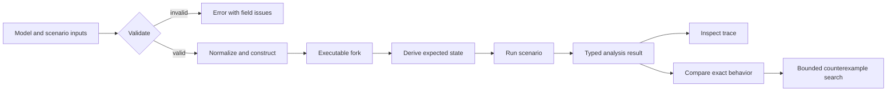
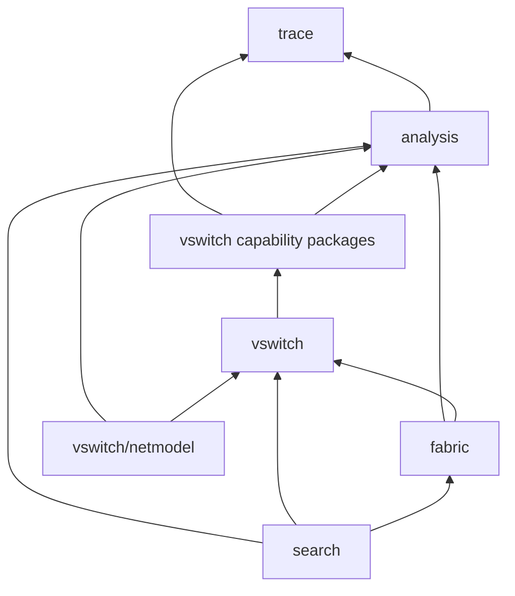
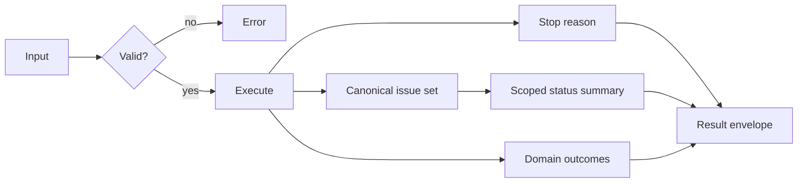
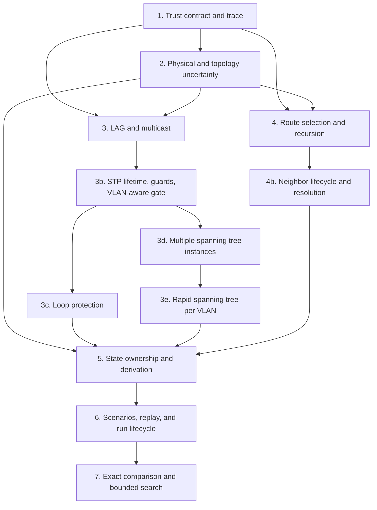

# Network simulation analysis completeness - Plan

## Goal

Make `src/common/netsim` a trustworthy planning, topology-shadowing, and
troubleshooting library. A caller must be able to tell whether an answer is
complete, incomplete, exhausted, unstable, unsupported, or invalid; reproduce
the inputs that produced it; and inspect a structured causal trace.

The target is analysis simulation, not network virtualization or a complete
device emulator. Open vSwitch supplies useful precedent for rule-level trace,
Packet Tracer for reusable scenarios and event inspection, and Batfish for
bounded differential counterexamples. None of them defines the product
boundary: netsim remains a deterministic in-process Go library with explicit
inputs and no live control plane.

### Current gaps

| Area | Finding | Evidence |
| --- | --- | --- |
| Completion | `fabric.Run` returns only a processed count, so callers cannot distinguish convergence, quiescence, exhaustion, or oscillation. | `src/common/netsim/fabric/run.go:903` |
| Fabric comparison | Comparison ignores budget exhaustion, requires unused journey buffers, and reduces results to deliveries plus sets of drop reasons. | `src/common/netsim/fabric/compare.go:20`, `src/common/netsim/fabric/compare.go:58` |
| Switch comparison | Equality omits rewritten frame fields, selected LAG member, PCP, mirror copies, and trace. | `src/common/netsim/vswitch/compare.go:19`, `src/common/netsim/vswitch/bridge/result.go:47` |
| Trace | Steps use free-form detail strings, string subjects, and `any` values, so callers cannot compare or query causal facts safely. | `src/common/netsim/trace/trace.go:39`, `src/common/netsim/trace/trace.go:78` |
| Port state | A port forwards unless it is explicitly down, which makes unreported and zero-value state permissive. | `src/common/netsim/vswitch/port/port.go:67` |
| Model readiness | `netmodel.Report` lists capabilities, sources, skips, and defaults without an overall status, evidence quality, or affected scope. | `src/common/netsim/vswitch/netmodel/report.go:8` |
| Topology | Fabric validation is all-or-error, while an omitted cable becomes known down; unresolved adjacency cannot survive as localized uncertainty. | `src/common/netsim/fabric/config.go:271`, `src/common/netsim/fabric/fabric.go:200` |
| Physical layer | Unknown media reach can collapse to zero; unknown negotiation becomes 1 Gb/s full duplex; PoE cannot distinguish no PD from unknown demand; PHY diff omits behavior inputs. | `src/common/netsim/fabric/medium.go:41`, `src/common/netsim/vswitch/phy/negotiate.go:25`, `src/common/netsim/vswitch/phy/poe.go:47`, `src/common/netsim/vswitch/phy/diff.go:8` |
| STP | One instance covers the switch, common guard states are absent, and stale or aged BPDU behavior can retain the wrong root state. | `src/common/netsim/vswitch/stp/config.go:52`, `src/common/netsim/vswitch/stp/layer.go:851` |
| Multicast | Membership is group-and-port only; source records collapse to group state and non-fast leave lacks last-member processing. | `src/common/netsim/vswitch/mcast/layer.go:30`, `src/common/netsim/vswitch/mcast/layer.go:308` |
| Routing and neighbors | One route wins per prefix, recursive and equal-cost candidates are absent, and a missing neighbor becomes a terminal drop. | `src/common/netsim/vswitch/routing/config.go:218`, `src/common/netsim/vswitch/routing/layer.go:218` |
| Derivation | STP and LAG retention checks only local config; static FDB entries are discarded even when their configuration remains valid. | `src/common/netsim/vswitch/derive.go:43`, `src/common/netsim/vswitch/derive.go:101` |
| Scenarios and journeys | Replay is assembled ad hoc in tests, and journeys have no explicit delivered, rejected, dropped, looped, pending, truncated, or incomplete terminal state. | `src/common/netsim/fabric/replay_test.go:1`, `src/common/netsim/fabric/journey.go:14` |
| Validation | Several enum domains and cross-capability references are not checked before construction. | `src/common/netsim/vswitch/config.go:88`, `src/common/netsim/vswitch/port/port.go:228`, `src/common/netsim/vswitch/bridge/config.go:220` |

### Prior-art boundary

| Project | Adopt | Decline |
| --- | --- | --- |
| [Open vSwitch](https://www.openvswitch.org/support/dist-docs/ovs-vswitchd.8.html) | Stable rule and table identifiers, explicit inputs, and stepwise `ofproto/trace`-style explanation for one packet. | OVS datapath execution, OpenFlow/OVSDB parity, namespaces, and treating OVS behavior as a claim about another vendor's switch. |
| [Cisco Packet Tracer](https://tutorials.ptnetacad.net/help/default/mode_simulation.htm) | Logical time, an ordered event list, reusable inputs, and per-layer PDU operations that an operator can inspect. | A GUI-owned model, Cisco IOS emulation, proprietary device breadth, and hidden simulator state. |
| [Batfish](https://batfish.readthedocs.io/en/stable/notebooks/differentialQuestions.html) | Current/reference results, side-by-side traces, explicit dispositions, and finite differential counterexamples. | Vendor-configuration parsing as the netsim input, JVM service operation, and claims beyond netsim's supported L2/L3 behavior. |
| [ns-3](https://www.nsnam.org/docs/tutorial/html/conceptual-overview.html) and [INET](https://inet.omnetpp.org/docs/users-guide/ch-ethernet.html) | Deterministic discrete events, logical clocks, typed protocol components, and link-level delay or faults. | General network research frameworks, wall-clock integration, and protocol breadth unrelated to planning or troubleshooting. |

The detailed comparison and source list remain in
`docs/architecture/2026-09-10-network-simulation-prior-art-research.md`.

### Golden analysis workflows

A versioned in-repo corpus tests the product outcome across phases. Each case
names the operator question, construction evidence, timed inputs, expected trust
status, network outcome, trace invariants, and comparison disposition. Phase 1
creates the corpus and its current-behavior baseline; later phases must preserve
or deliberately update it.

| Workflow | Caller question | Required result | First complete phase |
| --- | --- | --- | --- |
| Planning | Does a proposed topology or configuration change alter supported behavior? | `Equivalent`, `Different` with a replayable counterexample, or `Inconclusive` with exact missing scope and search remainder. | Phase 7 |
| Topology shadowing | What remains knowable when one observed adjacency or physical fact is unresolved? | Known paths keep definite outcomes; only dependent paths carry incomplete issues and evidence. | Phase 2 |
| Troubleshooting | Why did this frame fail, diverge, or reach the wrong endpoint? | One journey result state, analysis status, and causal semantic trace identifying the first decisive rule. | Phase 6 |

Before phases 3 or 4 add protocol depth, their re-plan must extend this table with
the concrete question, current false answer, minimum semantics, unsupported
boundary, and golden case for each protocol addition.

| Protocol addition | Question | Current false answer | Minimum semantics | Unsupported boundary | Golden case |
| --- | --- | --- | --- | --- | --- |
| LAG buckets (phase 3) | Which flows move when a member fails? | Every flow remaps (`enabled[hash%len]`). | OVS 3.3 bucket table, sticky active member, balance-tcp needs LACP. | Load-based rebalancing, reported as `lag-rebalance-unmodeled`. | `planning/lag-member-fault-keeps-surviving-flows`, `troubleshooting/active-backup-no-failback` |
| Source-specific multicast (phase 3) | Does source S reach a receiver that joined `(S1,G)`? | Any source reaches a group member. | RFC 3376 §6.2-§6.5 router state per port. | Querier election and query emission. | `troubleshooting/ssm-rejects-unjoined-source` |
| Last-member query (phase 3) | When does forwarding stop after a leave? | Only at membership expiry, or never while reports refresh. | Timers lowered to LMQT by an observed specific query. | A leave with a router port and no observed query, reported as `mcast-query-unobserved`. | `troubleshooting/leave-last-member-query` |
| MSTP (phase 3d) | Which link does each VLAN block, within and across regions? | One tree for every VLAN. | 802.1Q clause 13 CIST and MSTIs, region digest, boundary roles, hop aging. | SPT/SPB, L2GP, PVST simulation (`stp-pvst-boundary`). | `planning/mstp-vlan-instances-diverge`, `topology-shadowing/mst-region-boundary` |
| RSTP per VLAN (phase 3e) | Which root and blocked trunk does each VLAN have? | One root for every VLAN. | One RSTP tree per listed VLAN in SSTP encapsulation. | 802.1D STP per VLAN, PVST simulation. | `planning/pvst-per-vlan-root` |
| Message age and guards (phase 3b) | Does stale information or a guard keep a port blocked or open? | A vanished root holds a port blocked; a guarded edge port keeps forwarding; a port whose BPDUs stop opens a loop. | `MessageAge + 1 <= MaxAge` with information valid for `3 x HelloTime`, BPDU guard, restricted role and TCN, netsim's loop guard. | Automatic BPDU-guard recovery, BPDU filter; `remainingHops` is phase 3d and the PVID check phase 3e. | `troubleshooting/stale-root-ages-out`, `troubleshooting/bpdu-guard-disables-edge`, `troubleshooting/loop-guard-unidirectional-link` |
| Loop protection (phase 3c) | Does an accidental loop between access ports get contained without STP? | The broadcast loops without bound. | Own probe frames; a returned probe blocks, stops learning on, or disables the sending port; recovery timers. | Vendor probe formats, traps. | `troubleshooting/loop-protect-contains-access-loop` |
| Route selection (phase 4) | Which next hop carries this flow, and what would carry it if that next hop went away? | One route wins on an invented `kind`-then-interface tie-break and the alternatives are invisible. | Order by prefix length, then preference (0 reserved for connected), then metric; the ties form a candidate set of at most 64 that an FNV-1a layer-3 hash reduced by RFC 2992 hash-threshold picks from; the fact names every member. | Weighted ECMP, per-packet spreading, resilient hashing, and a configurable hash input (Cisco `ip cef load-sharing full`, Linux `fib_multipath_hash_policy`). | `planning/ecmp-candidates-recorded` |
| Recursive next hops (phase 4) | Why is this static route not carrying anything? | An off-link next hop fails construction, so the configuration real gear accepts cannot be expressed at all. | Resolve each static route against its own VRF's table when the table is built, to depth 8; install with the on-link pair reached; withdraw a route that self-recurses, exceeds the depth, resolves to nothing, or resolves only through a default route, and report it through `WithdrawnRoutes` with its reason and chain. | `resolve-via-default` as a field, FRR's selected-route and recursion-enabled gates, and re-resolution outside a `Derive` rebuild. | `troubleshooting/recursive-route-not-installed` |

## Decisions

- Limit this plan to the Go library under `src/common/netsim`, narrowly required
  packet codecs under `src/common/net`, package documentation, architecture
  records, and library tests. Backend services, RPC APIs, persistence, telemetry
  export, UI, and packet collection are out of scope. User-directed on
  2026-09-12.
- Prefer coherent breaking changes over compatibility shims. There are no
  external consumers and FlowSeer has not declared a stable release.
  User-directed on 2026-09-12.
- Model standards-based behavior only to the depth needed to answer planning
  and troubleshooting questions. A missing behavior is `Unsupported` or
  `Incomplete`; it never silently becomes a plausible answer.
- Separate four axes: input validity, analysis trust, execution stop reason, and
  domain outcome. Invalid input returns an error. Issues record every trust loss.
  Status is a conservative summary for the evaluated scope, with precedence
  `Unsupported > Unstable > Exhausted > Incomplete > Complete`; aggregation
  retains every lower-ranked cause. Run stop reasons and frame or journey
  outcomes remain independent.
- Keep `trace` as an import-leaf with domain-neutral semantic trace atoms and
  opaque evidence references. Add `src/common/netsim/analysis` for shared status,
  issue, scope, evidence-catalog, and result-metadata contracts. `analysis` may
  import `trace`; neither package imports a capability, `vswitch`, `fabric`,
  `netmodel`, or generated code. Capability packages own rule and issue IDs and
  domain payloads. `vswitch` and `fabric` own and compose their result envelopes.
- Reject domain result structs in `trace`, duplicated status enums in capability
  packages, centrally enumerated capability rule IDs, and `any` or JSON-like
  semantic facts. Those shapes either invert dependencies or prevent canonical
  equality.
- Carry unknown state explicitly at the layer that owns the value. Status is
  relative to the operation's declared scope, so an unknown fact downgrades only
  results that depend on it. Preserve unrelated determined facts.
- Distinguish simulator evidence from transport provenance. Construction and
  scenario inputs carry a domain-neutral evidence catalog with stable references.
  `netmodel` accepts caller-supplied source context and maps it into evidence; core
  packages do not import inventory provenance or generated messages. Do not add
  provenance fields to simulated entities.
- Include an immutable replay specification in every run, comparison, and
  counterexample result. It contains normalized construction inputs, scenario
  actions, logical start, seed, limits, simulator contract version, and rule-set
  identity. A digest alone cannot reproduce an answer, and an incompatible
  contract is reported before replay.
- Replace prose-only trace steps with stable typed operations, producer-owned
  rule IDs, subjects, input/output facts, and evidence references. Human-readable
  text is a renderer over that semantic trace.
- Define one exact behavioral equivalence contract. Comparison returns
  `Equivalent`, `Different`, or `Inconclusive`; incomplete evaluation never
  becomes a difference or a counterexample.
- Keep semantic traces and evidence beside behavioral comparison as diagnostic
  alignment, not equality inputs. Simulator conformance tests may require exact
  trace equality, but a harmless diagnostic step cannot create a network
  behavior difference.
- Separate state owner, origin, and lifetime. The owning package defines
  dependencies and retention. Origin is configured, observed, derived, or
  assumed. Lifetime is static, learned/runtime, timer, queue, or scenario-owned.
  No axis is inferred from a zero value or another axis.
- Make package-owned construction specifications contain normalized config and
  non-config inputs such as static or observed seeds. Derivation reconstructs or
  matches static state against that specification; it never copies a static
  runtime entry whose source is absent.
- Keep `Snapshot` observational. Add a separate executable `Fork` that deeply
  copies mutable state. Comparison runs forks, does not consume caller state, and
  does not depend on an empty journey queue.
- Keep differential search finite and explicit. Callers provide the domain and
  limits; netsim enumerates it deterministically and reports the unsearched
  remainder. A symbolic solver is not part of this plan.
- Keep switch and fabric comparison in their owning packages. Put cross-domain
  enumeration in a higher-level `src/common/netsim/search` package that imports
  shared analysis contracts, `vswitch`, and `fabric`. Lower packages never import
  `search`; search does not consume `netmodel` or generated messages.
- Extend STP, LAG, multicast, static routing, and neighbor resolution only far
  enough to remove false confidence in supported scenarios. Vendor protocols,
  routing daemons, full host stacks, and unbounded protocol emulation remain out
  of scope. Exceptions, user-directed on 2026-09-14:
  - Spanning tree supports MSTP across multiple regions and RSTP per VLAN
    (PVST in its per-VLAN RSTP sense, with SSTP encapsulation).
  - LAG balance modes follow the Open vSwitch 3.3 bucket semantics that the
    `lag` package already names as its source.
  - Switches support primitive loop protection outside spanning tree. It is
    netsim's own probe mechanism, modeled on H3C, Aruba, and Huawei loop
    detection, and parses no vendor frame format.
- Admit protocol depth through the versioned analysis corpus. Each addition must
  name the planning or troubleshooting question, today's false answer, the
  minimum needed semantics, the unsupported boundary, and an end-to-end case.
- Supersede the current trace, constructor, run, and comparison shapes directly
  when the relevant phase lands. Do not add adapters or dual APIs.
- Treat only phase 1 as executable now. The parent fixes sequence and scope;
  phases 2-7 remain `needs-decisions` until each is re-planned against the APIs
  and state shapes that earlier phases landed.

External precedent is recorded in
`docs/architecture/2026-09-10-network-simulation-prior-art-research.md` and was
rechecked for this plan against the official Open vSwitch tracing documentation,
Cisco Packet Tracer documentation, and Batfish differential-analysis
documentation.

## Technical design

The public lifecycle has one trust boundary and one result vocabulary.



Arrows below mean "imports." Shared packages never import a capability or
composition package.



Validity, trust, stop reason, and domain outcome compose without erasing one
another. A delivered frame can belong to an incomplete run, and a run can stop
at its budget after also encountering unsupported behavior.



`port` owns the up, down, or unknown value and forwarding predicate. A standalone
switch consumes resolved operational state from its caller. During topology
composition, `fabric` alone derives effective state from topology and PHY facts.

| Fabric topology fact | Effective port state | Evidence behavior |
| --- | --- | --- |
| Resolved cable | Negotiated up or known down | Link and endpoint evidence is retained. |
| Explicitly uncabled | Down | Known absence is a definite planning fact. |
| Unresolved adjacency | Unknown | Only dependent paths become incomplete. |
| Device observation conflicts with topology | Topology-derived value | Preserve the observation and emit a scoped conflict issue. |

Capability layers consume effective port state and never infer adjacency.
`netmodel` may translate caller-supplied discovery facts but does not own the
topology model.

The phases deliberately establish truth semantics before adding protocol depth
or search features.



## Requirements

### Result integrity and evidence

1. **R1:** Every operation that can produce a partial answer declares its
   evaluated scope and returns the shared status summary plus the lossless issue
   set. Execution stop reason and domain outcomes are separate. Invalid input
   remains an error. **Acceptance example:** a result with both unsupported and
   exhausted scoped issues retains both and summarizes as `Unsupported`, while a
   domain-owned budget stop reason remains separate.
2. **R2:** An incomplete fact is localized and does not erase unrelated facts.
   **Acceptance example:** one unresolved cable endpoint marks only affected
   paths incomplete while known-disconnected paths remain definite drops.
3. **R3:** Link and port operational state distinguish up, down, and unknown.
   Unknown never forwards by default. **Acceptance example:** a zero-value or
   unreported port cannot pass a frame and returns an incomplete issue naming
   that port.
4. **R4:** Every exported constructor that accepts configuration validates enum
   domains, cross-references, and semantic invariants before building executable
   state. Trusted construction helpers are unexported. **Acceptance example:** a
   bridge access VLAN absent from allowed membership is rejected with a field
   path, and `vswitch.New` returns an error.
5. **R5:** Normalize once, then use normalized constructed values for
   derivation, diffing, fingerprints, and comparison. **Acceptance example:** an
   omitted standard default and the same explicit value produce the same
   normalized fingerprint while preserving different evidence.
6. **R6:** Trace steps have stable typed layer, operation, producer-owned rule ID,
   subject, semantic inputs and outputs, and opaque evidence references.
   **Acceptance example:** VLAN ingress rejection identifies the admission rule
   and offending VLAN without parsing a free-form string or comparing `any`.
7. **R7:** Model loading accepts caller-supplied source context and reports
   readiness, evidence kind, and affected scope for skipped, defaulted, or
   conflicting facts. **Acceptance example:** a defaulted speed is executable but
   appears as an assumption affecting one link; no core entity imports transport
   provenance.
8. **R8:** Topology input distinguishes known absence from unresolved adjacency.
   **Acceptance example:** a deliberately uncabled port is a definite down path;
   a missing discovery result is incomplete and lists the unresolved endpoint.
9. **R9:** Every behavior-bearing field participates in package-owned validation,
   normalization, cloning, and `Diff`; every later phase must extend the same
   field matrix. **Acceptance example:** PHY supported speeds, duplex, PSE budget,
   and PD class changes all validate, normalize, clone, and appear in `phy.Diff`.

### Physical and endpoint behavior

10. **R10:** Media reach distinguishes known within range, known exceeded, and
    unknown. **Acceptance example:** an unsupported medium does not report a
    reach of zero and masquerade as a distance failure.
11. **R11:** Negotiation represents unknown capabilities and detects forced/auto
    duplex mismatches without inventing 1 Gb/s full duplex. **Acceptance
    example:** two unreported endpoints produce an incomplete negotiation, not
    an operational gigabit link.
12. **R12:** PoE distinguishes no powered device, attached device with unknown
    demand, known denial, and known delivery. **Acceptance example:** a missing
    PD class on an attached endpoint yields incomplete power state rather than
    "no device."
13. **R13:** Host delivery separates physical arrival from host acceptance.
    **Acceptance example:** an unicast frame to another MAC reaches the host
    port but is terminally rejected unless promiscuous acceptance is configured.

### Protocol behavior

14. **R14:** STP state is scoped by tree: one RSTP tree, MSTP's CIST and MSTIs
    across one or more regions, or one RSTP tree per VLAN. **Acceptance
    example:** VLAN 10 and VLAN 20 select different forwarding links under
    MSTP and under RSTP per VLAN, without Cisco PVST simulation.
    - **R14a:** MST BPDU encoding and decoding, the region configuration
      digest, and CIST and MSTI priority vectors. Phase 3d.
    - **R14b:** Boundary roles and hop-count aging across a region boundary.
      Phase 3d.
    - **R14c:** One rapid spanning tree per VLAN in the SSTP encapsulation,
      each electing its own root and blocking its own trunk. Phase 3e.
    - **R14d:** The PVID consistency check and the unsupported PVST boundary.
      Phase 3e.
    - **R14e:** Per-tree topology change and per-instance flushing, which the
      one-tree layer does not distinguish. Phase 3d.
15. **R15:** STP handles message age, stale superior information, and configured
    edge, BPDU guard, root guard, and loop guard outcomes. **Acceptance example:**
    expired superior information cannot keep a port blocked indefinitely.
    - **R15a:** Information whose message age has reached the max age its own
      BPDU carries is discarded rather than stored. Phase 3b.
    - **R15b:** Each of the four guards produces its port outcome. Phase 3b.
    - **R15c:** The two contradictory guard combinations are refused at
      construction. Phase 3b.
    - **R15d:** Loop guard is inactive on an operationally edge port and on a
      port that is not point-to-point. Phase 3b.
    - **R15e:** The blocking reason reaches the trace. Phase 3b.
16. **R16:** LAG selection and operational state expose dependency and convergence
    evidence. **Acceptance example:** a member link change invalidates only the
    affected aggregation state and yields the same selection after replay.
17. **R17:** Multicast membership represents `(*,G)` and `(S,G)` intent and
    applies source filtering. **Acceptance example:** a source-specific join for
    source A does not admit source B.
18. **R18:** Non-fast multicast leave performs deterministic last-member query
    and timer behavior. **Acceptance example:** forwarding persists through the
    query window and stops only after the configured response interval expires.
19. **R19:** Static route selection supports preference, metric, equal-cost
    candidates, and bounded recursive next-hop resolution. **Acceptance
    example:** two equal candidates select deterministically per configured ECMP
    policy; a recursion cycle is invalid or incomplete, never silently chosen.
20. **R20:** Neighbor state distinguishes unobserved, resolving, reachable,
    stale, and failed entries. **Acceptance example:** an absent entry does not
    become an immediate terminal "neighbor unresolved" drop unless resolution
    is disabled or has failed.
21. **R21:** Neighbor resolution accepts explicit logical-time transitions and
    decoded ARP or IPv6 Neighbor Discovery records without running an autonomous
    host stack. **Acceptance example:** a queued routed frame proceeds after an
    injected ARP reply; an absent reply remains pending until an explicit timeout.
22. **R22:** Route and neighbor validation rejects incompatible address families
    and unusable egress references. **Acceptance example:** an IPv4 prefix with
    an IPv6 next hop and no explicit supported transition is rejected.

### State ownership and repeatability

23. **R23:** Every retained state record separates owning package or layer,
    origin (`configured`, `observed`, `derived`, or `assumed`), and lifetime
    (`static`, learned/runtime, timer, queue, or scenario-owned). **Acceptance
    example:** a configured static FDB entry and an observed learned entry have
    distinct origins, lifetimes, dependencies, and retention rules.
24. **R24:** Derivation preserves runtime state only when its owner and complete
    dependency fingerprint match. **Acceptance example:** changing a switch base
    MAC invalidates dependent STP identity even when the STP config is unchanged.
25. **R25:** Static state is reconstructed from or matched against the target's
    construction specification, including non-config seed inputs. **Acceptance
    example:** `vswitch.Derive` retains a static FDB entry across an unrelated
    port update but removes it when its target construction input is absent.
26. **R26:** A snapshot is an immutable observational value. A fork deeply copies
    all mutable executable protocol, timer, queue, journey, and trace state.
    **Acceptance example:** running a candidate fork cannot change a current
    snapshot or alter a later current-state result.

### Scenarios and run lifecycle

27. **R27:** A named immutable scenario describes initial facts, typed timed
    injections, link or device faults, and a deterministic seed. **Acceptance
    example:** a link flap and frame injection replay to the same event ordering
    and trace; callers evaluate the typed result in Go.
28. **R28:** Replay accepts decoded records or bytes through a library interface
    and preserves timestamp, source, truncation, and decode evidence. **Acceptance
    example:** a truncated capture record is represented as incomplete input;
    the library does not read pcap files itself.
29. **R29:** Run returns a typed stop reason, processed-event count, logical time,
    pending-work summary, scoped status, issues, trace, and immutable replay
    specification. **Acceptance example:** a periodic protocol wake does not make
    budget exhaustion look like quiescence, and the exact run inputs remain
    available for replay.
30. **R30:** Convergence uses normalized state fingerprints across relevant
    protocol refresh boundaries and detects oscillation. **Acceptance example:**
    no-op periodic events permit `Converged`; alternating STP states yield
    `Unstable` with the repeated fingerprints.
31. **R31:** Each journey has one result state. `Pending` is nonterminal;
    delivered, rejected, dropped, looped, truncated, and incomplete states are
    terminal at the run boundary. **Acceptance example:** a frame that reaches a
    host port but fails host acceptance is `Rejected`, not `Delivered`, and no
    pending work remains attached to it.

### Comparison and counterexamples

32. **R32:** Switch comparison covers the full normalized observable result,
    including frame bytes and headers, selected member, PCP, mirrors, drop
    location, and externally relevant state changes. Semantic trace differences
    are diagnostic. **Acceptance example:** a destination-MAC rewrite differs
    even when egress ports match, while an added no-op trace step does not.
33. **R33:** Fabric comparison covers path, timing, multiplicity, drop location,
    terminal state, final normalized state, status, and issues without consuming
    either input fabric. **Acceptance example:** comparison works with active
    periodic protocols and leaves both fabrics unchanged.
34. **R34:** Comparison returns `Equivalent`, `Different`, or `Inconclusive`.
    `Equivalent` requires complete exact behavioral equivalence; `Different`
    requires a proven behavioral mismatch; incomplete evaluation is
    `Inconclusive`. **Acceptance example:** two identically incomplete runs are
    inconclusive, not equivalent or different.
35. **R35:** Differential search requires a finite traffic and event domain plus
    explicit limits, and reports `Complete`, `Exhausted`, `Incomplete`, or
    `Unsupported`. **Acceptance example:** an L2 domain over specified VLANs,
    MACs, EtherTypes, ports, and fault times reports how many combinations remain
    when its limit is reached.
36. **R36:** A mismatch returns a replayable counterexample containing the
    immutable replay specification, current and candidate results, aligned causal
    traces, and minimality status. **Acceptance example:** a VLAN regression
    identifies the smallest tested ingress/VLAN/destination tuple and first
    divergent rule, or reports that minimization exhausted its limit.
37. **R37:** Cross-package conformance fixtures cover deterministic ordering,
    clone isolation, derive invalidation, trace stability, and status propagation.
    **Acceptance example:** randomized map insertion order produces byte-for-byte
    identical semantic results and rendered traces.
38. **R38:** The library has no runtime dependency on Open vSwitch, Packet
    Tracer, Batfish, a live device, a daemon, or a backend service. **Acceptance
    example:** all scenarios and comparisons run in `go test` with in-memory
    inputs and a logical clock.
39. **R39:** A versioned analysis corpus covers planning, topology-shadowing, and
    troubleshooting questions and gates protocol depth. **Acceptance example:**
    each phase preserves existing corpus cases and adds a case that names its
    current false answer, expected status, outcome, and trace invariants.
40. **R40:** Forking, replay, and search have a declared representative scale and
    resource contract before phase 5 implementation. **Acceptance example:**
    benchmarks at the chosen topology, event, and search sizes enforce allocation
    and runtime budgets; discarded search candidates do not retain full traces.
41. **R41:** A switch with loop protection detects a loop that no spanning
    tree breaks by hearing its own probe return. It applies the configured
    port action and recovers on a timer. **Acceptance example:** two access
    ports joined through a switch without loop protection block one port
    after one probe interval, and a later broadcast is delivered once.

## Out of scope

- Backend services, service assembly, databases, durable scenario storage, RPC
  or HTTP APIs, event ingestion, telemetry exporters, dashboards, and UI.
- Network namespaces, TAP/TUN devices, kernel datapaths, containers, VMs, or
  production traffic forwarding.
- OpenFlow/OVSDB parity, vendor CLI emulation, or running vendor images.
  Spanning-tree dialects beyond RSTP per VLAN, such as PVST simulation and
  802.1D STP per VLAN, are also out of scope.
- Dynamic routing protocols, a complete ARP/ND host stack, SLAAC, DAD, full IPv6
  NUD, DHCP, NAT, ACL/firewall policy, QoS scheduling, or wireless simulation.
- Packet-capture file readers and live packet collection. The library accepts
  decoded records or byte records supplied by its caller.
- Symbolic packet verification or an unbounded reachability solver.

## Units

### U1: Establish the analysis trust contract and semantic trace

- **Files:**
  `docs/plans/2026-09-12-1339-feat-netsim-analysis-completeness-phase1-plan.md`
- **After:** none
- **Landed:** `601e6e03..7cdc35dd`
- **Change:** Introduce the shared status, issue, evidence, readiness, and
  semantic trace contracts; add switch-owned forwarding metadata; make
  constructors strict; localize unknown port facts; complete current behavioral
  field matrices; establish the analysis corpus.
- **Tests:** Focused package tests for result status, validation, trace stability,
  readiness, unknown propagation, and diff coverage.
- **Verify:** Follow the phase plan, then run the diff-aware verifier on every
  changed path.

### U2: Represent physical and topology uncertainty without invented facts

- **Files:**
  `docs/plans/2026-09-12-1339-feat-netsim-analysis-completeness-phase2-plan.md`
- **After:** U1
- **Landed:** `8d2624be..01da6561`
- **Change:** Correct media reach, negotiation, PoE, host attachment, and topology
  uncertainty semantics, including parent R8.
- **Tests:** Physical, host, and topology truth-table tests plus cross-package
  incomplete-status propagation.
- **Verify:** Re-plan the phase against the landed tree before implementation.

### U3: Close supported LAG and multicast correctness gaps

- **Files:**
  `docs/plans/2026-09-12-1339-feat-netsim-analysis-completeness-phase3-plan.md`
- **After:** U1, U2
- **Landed:** `96ec9fb1..b27d2799`
- **Change:** OVS bucket-table LAG selection with a sticky active member,
  source-filtered multicast, and last-member query timing.
- **Tests:** Bucket, failover, and RFC 3376 state-table tests, plus corpus
  cases.
- **Verify:** Follow the phase plan.

### U3b: Age spanning-tree information out, apply guards, make the gate VLAN-aware

- **Files:**
  `docs/plans/2026-09-12-1339-feat-netsim-analysis-completeness-phase3b-plan.md`
- **After:** U3
- **Landed:**
- **Change:** Message-age aging, the BPDU, root, TCN, and loop guards, a
  layer whose state is keyed by tree with one tree in it, a gate that takes a
  VLAN. A version 3 BPDU keeps decoding as its RST prefix until phase 3d.
- **Tests:** Aging rings, each guard and what clears it, the gate signature
  across bridge and switch, and corpus cases.
- **Verify:** Follow the phase plan.

### U3d: Add multiple spanning tree instances

- **Files:**
  `docs/plans/2026-09-12-1339-feat-netsim-analysis-completeness-phase3d-plan.md`
- **After:** U3b
- **Landed:**
- **Change:** MST codec and region digest, CIST and MSTI vectors, boundary
  roles, hop-count aging, and per-tree topology change and flushing.
- **Tests:** Digest vectors, codec round-trip, multi-instance and
  cross-region fabrics, and corpus cases.
- **Verify:** Re-plan the phase against the landed tree before implementation.

### U3e: Add rapid spanning tree per VLAN

- **Files:**
  `docs/plans/2026-09-12-1339-feat-netsim-analysis-completeness-phase3e-plan.md`
- **After:** U3d
- **Landed:**
- **Change:** SSTP encapsulation and tagged emission, one tree per VLAN, the
  PVID check, and the unsupported PVST boundary.
- **Tests:** SSTP codec vectors, per-VLAN root fabrics, the PVID check, and a
  corpus case.
- **Verify:** Re-plan the phase against the landed tree before implementation.

### U3c: Add loop protection outside spanning tree

- **Files:**
  `docs/plans/2026-09-12-1339-feat-netsim-analysis-completeness-phase3c-plan.md`
- **After:** U3b
- **Landed:**
- **Change:** Probe-based loop detection with block, no-learning, and
  disable actions and recovery timers.
- **Tests:** Codec, timer, fabric containment, and STP interaction tests,
  plus a corpus case.
- **Verify:** Follow the phase plan.

### U4: Make route selection planning-safe

- **Files:**
  `docs/plans/2026-09-12-1339-feat-netsim-analysis-completeness-phase4-plan.md`
- **After:** U1, U2
- **Landed:** `847b503a..0dd267d7`
- **Change:** Order routes by prefix length, preference, and metric; keep the
  equal-cost candidate set; pick one by flow hash; resolve recursion when the
  table is built and withdraw a route that cannot resolve; reject a
  cross-family next hop.
- **Tests:** Ordering, candidate set, hash stability, recursion and withdrawal,
  family validation, plus corpus cases.
- **Verify:** Follow the phase plan.

### U4b: Make neighbor resolution planning-safe

- **Files:**
  `docs/plans/2026-09-12-1339-feat-netsim-analysis-completeness-phase4b-plan.md`
- **After:** U4
- **Landed:**
- **Change:** Add an explicit neighbor lifecycle, ARP and Neighbor Discovery
  codecs, and injected logical-time transitions with held frames.
- **Tests:** Codec vectors, state transitions, held-frame release and timeout,
  and a corpus case.
- **Verify:** Re-plan the phase against the landed tree before implementation.

### U5: Define state ownership, derivation invalidation, and fork isolation

- **Files:**
  `docs/plans/2026-09-12-1339-feat-netsim-analysis-completeness-phase5-plan.md`
- **After:** U2, U3c, U3e, U4, U4b
- **Landed:**
- **Change:** Separate state ownership, key retained runtime state by complete
  dependencies, reconstruct static state from construction inputs, and make
  executable forks deeply independent while snapshots remain observational.
  Define the representative scale and resource contract before implementation.
- **Tests:** Dependency mutation matrices, static-state retention and removal,
  fork isolation, snapshot stability, and deterministic fingerprint tests.
- **Verify:** Re-plan the phase against the landed tree before implementation.

### U6: Add reusable scenarios, replay, and honest run completion

- **Files:**
  `docs/plans/2026-09-12-1339-feat-netsim-analysis-completeness-phase6-plan.md`
- **After:** U5
- **Landed:**
- **Change:** Add immutable scenarios, typed timed actions, record replay, journey
  result states, convergence, oscillation detection, typed run results, and
  versioned replay identity.
- **Tests:** Scenario replay, periodic protocol, exhaustion, convergence,
  oscillation, host rejection, and clone-isolation tests.
- **Verify:** Re-plan the phase against the landed tree before implementation.

### U7: Replace shallow equality with exact comparison and bounded search

- **Files:**
  `docs/plans/2026-09-12-1339-feat-netsim-analysis-completeness-phase7-plan.md`
- **After:** U6
- **Landed:**
- **Change:** Compare complete switch and fabric observables on forks, return
  explicit dispositions, enumerate finite domains, minimize
  counterexamples, and align causal traces without using trace text as behavior.
- **Tests:** Omitted-field regressions, non-consuming active-protocol comparison,
  search coverage accounting, minimization, and conformance fixtures.
- **Verify:** Re-plan the phase against the landed tree before implementation.

## Verification

For each phase:

```bash
go test -race ./src/common/net/... ./src/common/netsim/...
go vet ./src/common/net/... ./src/common/netsim/...
.claude/skills/verify-change/scripts/verify-change.sh -- <changed paths>
```

Add focused tests before the repository-wide netsim run. Compare deterministic
results using semantic structures or canonical encodings, not free-form rendered
text. Run `buf lint` and protobuf generation only if a later re-plan explicitly
adds schema work; this parent plan does not require it.

The plan is wrong and must be amended if a required answer depends on a vendor
runtime, unbounded emulation, or a new backend, RPC, service, or persistence wire
contract. Those needs require a separate decision and plan rather than an
expansion of this library scope; narrowly required packet codecs remain allowed.

## Definition of done

- [ ] Every parent requirement is claimed by one re-planned phase and verified
      against the landed tree.
- [ ] Supported analyses never report exact sameness or convergence after
      exhaustion, instability, unsupported behavior, or unresolved required
      facts.
- [ ] Unknown physical, topology, and protocol facts remain localized and
      visible in structured issues and traces.
- [ ] Scenarios replay deterministically, executable forks remain isolated,
      snapshots stay observational, and comparison does not consume caller state.
- [ ] Protocol extensions cover the stated planning cases without implying
      virtualization, vendor parity, or a complete host/control plane.
- [ ] Counterexamples are finite, replayable, minimized, and explain the first
      causal divergence.
- [ ] Comparison reports incomplete evaluation as `Inconclusive`; only proven
      behavioral mismatches produce counterexamples.
- [ ] The versioned analysis corpus covers all three golden workflows and gates
      every added protocol behavior.
- [ ] Fork, replay, and search benchmarks pass the resource contract chosen
      before phase 5 implementation.
- [ ] Package documentation and the amended architecture record describe the
      public contracts, working examples, supported depth, and explicit limits.
- [ ] Focused checks, race tests and vet for affected `src/common/net` and
      `src/common/netsim` packages, and the diff-aware verifier pass for every
      phase.
