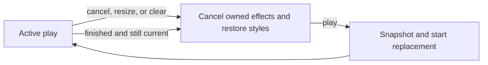

# Web Component Contract Migration, Phase 2 - motion-v Replaces motion/mini - Plan

> Implemented. Four units completed and verified on 2026-10-01.

## Goal

Rebuild `useMotionFeedback` on motion-v's `animateMini` so cancellation,
replacement, and completion restore the inline styles each play owns.
Cancel or resize followed by play before the next frame leaves no discarded
transform. Native-effect tests and browser measurements prove cleanup.

Stop condition: Mini cannot meet this cleanup contract alongside layout.
Report the failing case before changing dependencies or the layout mechanism.

## Decisions

- This is rework of the same unaccepted phase. Phase 1's `102193b1` is an
  ancestor of HEAD. Phase 2's `Landed:` is empty on `main`. Both
  [phase re-plan checks](../../.agents/skills/plan/references/replan-phase.md)
  pass. `status: planned` makes `.claude/skills/drive/scripts/plan-state.py` select
  `implement`. `review: rework` retains the existing code's verdict.
- **motion-v is imported only under `src/ui/motion/`.** Its `index.ts`
  exports motion-v's `Motion` as `UiMotion`, its `MotionConfig` as
  `UiMotionConfig`, and the moved `useMotionFeedback`. The parent's
  requirement 2 greps for `from '(reka-ui|motion)` outside `src/ui/`, which
  matches `motion-v` and today prints `src/motion/useMotionFeedback.ts`. A
  `UiMotion.vue` wrapper would re-declare `Motion`'s props and need a story
  (`src/ui/a11y.test.ts`). The contract names the old path, so U4 amends it.
  The amendment is accepted. (decided by the user, 2026-10-01)
- **`useMotionFeedback` is rebuilt on `animateMini`.** The review ended in
  `rework`: three fix rounds each left an ordering defect in how the
  composable restores inline styles around motion-v's own writes. The
  per-element value store behind `animate` is the cause, and `animateMini`
  keeps none. This replaces U1's "play runs motion-v's `animate`" and the
  tests that read an inline `transform` mid-flight. (decided by the user,
  2026-10-01)
- The ownership amendment above is already present in
  `docs/architecture/2026-09-28-web-component-contract-direction.md`,
  section `2026-10-01`. Its paths and reduced-motion rules remain binding.
  The dated decision names migration input. `src/motion/` is absent.
  U4 updates guidance without another direction change.
- Keep the versions in `frontend/web/pnpm-lock.yaml`: motion-v 2.5.1,
  framer-motion and motion-dom 13.4.5, motion-utils 13.3.0, @vueuse/core
  14.4.0, and happy-dom 20.14.5. No package is added, removed, or upgraded.
- Keep the typed `opacity | x | y | rotate | scale` numeric pairs on
  `play(element, keyframes, duration = 0.14)`. Compile movement to one
  `transform` pair in the order translateX, translateY, rotate, scale.
  Include only supplied keys, with px for translation and deg for rotation.
  This keeps reduced-motion filtering explicit and prevents omitted keys
  inheriting another play's values. Source: Mini's CSS-property path below.
- Pass `[element]` to `animateMini`. Single-element resolution uses
  `instanceof EventTarget`, while an array bypasses that check
  (motion-dom `dist/es/utils/resolve-elements.mjs:5`). happy-dom's
  `lib/window/WindowContextClassExtender.js:135` subclasses its global
  EventTarget separately from the base inherited by `lib/nodes/node/Node.js:14`.
  The array works with these locked versions without a prototype stub.
- Each play owns only its supplied CSS properties and native animations.
  Cancel the previous play and restore its owned styles synchronously
  before taking the next snapshot. Mini's `cancel` removes its effect,
  while `stop` can commit the sampled style. Mini commits final styles
  on completion, so an identity-guarded `finished` handler restores them.
  Why: the lifecycle sources below define different cancel and finish paths.
- Keep `useMotionConfig` and `useReducedMotion` as the source of
  `reduced`. Mini's native path has no config lookup or reduced-motion
  branch. The composable filters movement itself, clears active plays on
  every preference or config change, and keeps fades. Source:
  `motion-v/dist/es/animation/hooks/use-reduced-motion.mjs` and Mini below.
- Keep FleetView's layout sidebar, highlight, and position-only children,
  the inferred `UiMotion` prop type, and the app-root config. Keep
  `UiMotionConfig` out of `src/ui/index.ts`. Their existing tests remain
  acceptance checks. Phase 3 stays held until phase 2's review accepts this
  rework, because its U1 edits `UiAppRoot.vue` and all five motion test files.
- **Every preference or config change clears active plays**, including a
  change that leaves effective reduced motion as it was. The watcher on the
  raw config and preference pair stays, and the test rows that assert it
  stay. Why: a play never keeps running under a stale configuration.
  (decided by the user, 2026-10-02)
- **The review gets one more fix round** past its three-round limit,
  resumed from `parked/wcc-p2-review` (`d7995d3d`). It covers the skipped
  reduced-motion row for the `both` owned set, the two rows weaker than
  their titles, the `settleFrames` timer citation, and the stale line
  citation in the happy-dom solution. Why: the source has no open defect
  and the remaining correctness item is one skipped case with a known fix.
  (decided by the user, 2026-10-02)



### External sources

Installed by `pnpm install --frozen-lockfile` in `frontend/web`.
Paths below are under `frontend/web/node_modules/`.
`framer-motion/` abbreviates
`.pnpm/framer-motion@13.4.5_react-dom@19.3.0_react@19.3.0__react@19.3.0/node_modules/framer-motion/`.
`motion-dom/` abbreviates `.pnpm/motion-dom@13.4.5/node_modules/motion-dom/`.

| Source | Behavior used |
| --- | --- |
| `motion-v/dist/es/index.mjs:41`, `motion-v/dist/es/index.d.ts:1`, `framer-motion/dist/es/dom.mjs:5`, `framer-motion/dist/dom.d.ts:129` | Runtime and type exports expose `animateMini` through motion-v. |
| `framer-motion/dist/es/animation/animators/waapi/animate-style.mjs`, `framer-motion/dist/es/animation/animators/waapi/animate-elements.mjs:42-106` | Mini creates native animations for the supplied CSS properties synchronously. It keeps a registry of animation controls, without hybrid transform MotionValues. |
| `motion-dom/dist/es/animation/utils/active-animations.mjs` | The registry is a per-element map of controls. The value-store decision above does not mean there is no animation registry. |
| `motion-dom/dist/es/animation/NativeAnimation.mjs:36-111`, `motion-dom/dist/es/animation/utils/WithPromise.mjs`, `motion-dom/dist/es/animation/GroupAnimation.mjs` | Finish writes final inline values, cancels native effects, then resolves the Motion promise. Cancel does not resolve that promise. Stop can commit styles. |
| `motion-dom/dist/es/animation/waapi/start-waapi-animation.mjs` | Mini passes real CSS keyframes to `Element.animate`, with seconds converted to milliseconds and `fill: "both"`. |
| `happy-dom/lib/nodes/element/Element.js:1083`, `happy-dom/lib/animation/Animation.js:139-165`, `happy-dom/lib/animation/KeyframeEffect.js:47-81` | Native controls and keyframes are observable. Playback does not interpolate inline styles. Finish dispatches an event, cancel rejects the native finished promise, and computed effect progress remains null. |

Motion's [WAAPI example](https://motion.dev/docs/improvements-to-the-web-animations-api-dx),
section `Independent transforms`, shows the full CSS transform Mini needs:

```js
element.animate({ transform: "translateX(50px) scaleX(2)" })
```

The composable produces `transform: ['translateY(-4px)', 'translateY(0px)']`
for `y: [-4, 0]`. A browser proves interpolation.

## Requirements

1. Movement compiles to complete ordered CSS transform endpoints. Example:
   `{ x: [17, 0], y: [-4, 0], rotate: [0, 45], scale: [1, 0.65] }`
   gives `translateX(17px) translateY(-4px) rotate(0deg) scale(1)` and
   `translateX(0px) translateY(0px) rotate(45deg) scale(0.65)`.
2. Terminal paths restore owned inline values, including absence.
   Example: start with opacity `0.93` and transform
   `translateX(17px) scale(0.72) rotate(13deg)`, play both properties,
   then complete, cancel, resize, change preference, or unmount. Those
   values return with no owned native animation running.
3. Cancellation and replacement are safe within one turn. Example:
   play `y: [-40, -20]`, cancel or dispatch resize, then play
   `opacity: [0.6, 1]` before a frame. The original transform is present
   immediately and after completion, and the new fade runs. A completion
   queued before replacement cannot cancel or restore over the new play.
4. Replacement uses its own keys from the first observable frame. Example:
   rotate/scale/opacity replaced by y/opacity has the new pairs, without
   prior rotation, scale, or a baseline reset while it runs.
5. Reduced motion keeps opacity and removes movement. Example: under
   `"user"` with the query matching, or `"always"` without it,
   y/opacity creates one running opacity animation. A movement-only play
   cancels earlier feedback, restores its styles, and creates no animation.
6. Cleanup preserves unrelated properties and animations. Example: change
   a layout transform during an opacity-only play, then cancel. The changed
   transform and an unrelated native animation survive. Repeated cancel is harmless.
7. Below desktop width, expansion fades the nav from 0.6 to 1 over 100 ms
   and returns its original inline opacity. Collapse creates no fade.
   Existing layout, highlight, reduced-layout, tooltip, and prop-type
   checks keep passing. No `motion` or `motion/mini` import returns.

## Out of scope

- Dependency changes, a new motion wrapper, layout redesign, overlays,
  strings, and the phase 3 i18n work.
- Simultaneous owners of the same CSS property on one element. The nav's
  layout transform and feedback opacity remain separate.
- Tests of interpolated browser values through happy-dom's inline styles.

## Units

### U1. Native feedback lifecycle and deterministic invariants

Files: `frontend/web/src/ui/motion/useMotionFeedback.ts`, `frontend/web/src/ui/motion/useMotionFeedback.test.ts`, `frontend/web/src/components/ThemeSwitcher.test.ts`
After: none
Change:
- `play` compiles the typed pairs and calls `animateMini([element], …)`
  with ease `[0.2, 0, 0, 1]` and the requested duration. Empty keyframes,
  undefined elements, and reduced movement-only plays create no animation.
  A play with no effective keys still cancels prior feedback on that element.
- Snapshot `element.getAnimations()` before Mini, then record only new
  identities after it returns in the same turn. Mini creates effects
  synchronously (source above). This uses public DOM APIs without a cast
  into group internals. The active entry holds these natives, group controls,
  and owned inline values. Handle native cancellation rejections on creation.
- Cancellation deletes the entry, cancels only its group, and restores
  its owned styles immediately. Completion checks entry identity before
  cleanup. Resize, effective preference/config changes, and scope disposal
  clear active entries. Disposal removes the resize listener.
- `frame.render`, `frame.postRender`, transform filling, and seed writes
  leave this composable.

Tests: mount under `UiAppRoot` with real motion-v and Vue. Replace inline
sampling, the style-proxy no-write assertion, and the frame override with
native assertions. Adapt ThemeSwitcher's existing transform assertion here.
- Assert running state before pausing. Narrow `effect` to `KeyframeEffect`.
  Inspect `getKeyframes()` endpoints/computed offsets and `getTiming()`
  duration/easing for opacity, x/y, rotate/scale, and the all-key example.
- Retain the terminal-path and replacement matrices for empty and nonempty
  inline styles. Finish through native `Animation.finish()` and await
  cleanup. Cancel/resize followed by play has assertions in the same turn,
  after microtasks, at the next frame, and after completion.
- Cover same/different keys, opacity-to-transform and back, three plays in
  one turn, sequential plays, and replacements ended by each terminal path.
- Queue the old group's completion by finishing all its native controls,
  replace before draining microtasks, then assert running replacement
  effects and its baseline.
- Cover reduced modes, preference/config changes, no-opacity replacement,
  empty/undefined plays, repeated cancel, two elements, unrelated animation
  survival, and resize after disposal.
- Assert positive native keyframes from the call onward. No helper slices
  past a first active frame or accepts too few samples as a pass.
  Watch failures when transform compilation, synchronous restoration,
  identity guarding, owned cancellation, or reduced filtering is removed.
  Quote new tests' failing lines in the implementation commit body.

Verify: `.claude/skills/verify-change/scripts/verify-change.sh -- frontend/web/src/ui/motion/useMotionFeedback.ts frontend/web/src/ui/motion/useMotionFeedback.test.ts frontend/web/src/components/ThemeSwitcher.test.ts`

### U2. FleetView fade direction and cleanup

Files: `frontend/web/src/FleetView.vue`, `frontend/web/src/FleetView.motion.test.ts`
After: U1
Change: the mobile expand keeps `opacity: [0.6, 1]` over 0.1 s.
Delete the comment accepting persistent inline opacity at `toggleSidebar`.
Keep the layout nodes, shared dependency counter, scope fade, and imports.

Tests: `FleetView.motion.test.ts` retains its layout and highlight cases.
The below-desktop case pins ordered opacity endpoints, 100 ms duration,
running state, no fade on collapse, and original inline opacity after
completion. Repeat collapse/expand within one turn and resize during a
fade, then verify restoration and replay.
Reversing the pair to `[1, 0.6]` must fail. Leaving inline `opacity: 1`
after completion must fail. Record both mutation failures.

Verify: `.claude/skills/verify-change/scripts/verify-change.sh -- frontend/web/src/FleetView.vue frontend/web/src/FleetView.motion.test.ts`

### U3. ThemeSwitcher native animation assertions

Files: `frontend/web/src/components/ThemeSwitcher.test.ts`
After: U1
Change: extend U1's adapted native assertions to both directions and rapid
toggles. The component stays as written.

Tests: pin each icon's opacity and rotate/scale endpoints in both directions,
160 ms duration, and running state before deterministic finishing. Reduced
motion has one running opacity animation per icon and no transform.
Rapid toggles leave the latest effects, then empty inline styles after
finish, resize, and unmount. A missing transform pair or retained final
opacity fails a named case. Record those mutation failures.

Verify: `.claude/skills/verify-change/scripts/verify-change.sh -- frontend/web/src/components/ThemeSwitcher.test.ts`

### U4. Document native feedback and its test limits

Files: `frontend/web/README.md`, `.agents/skills/web-component/references/overlays-and-motion.md`, `docs/solutions/conventions/mount-tests-under-happy-dom-must-stub-reduced-motion.md`
After: U1 U2 U3
Change: the README explains typed pairs compiled to native effects and owned
style cleanup. The motion reference and solution cite the new tests and
describe native assertions and browser measurements. Keep the accepted amendment
and matchMedia/geometry rules. `applies_when` and the index row stay accurate.

Tests: run `check-prose.py` on these files and check every cited path and
named test. No runtime test is added for prose.

Verify: `.claude/skills/verify-change/scripts/verify-change.sh -- frontend/web/README.md .agents/skills/web-component/references/overlays-and-motion.md docs/solutions/conventions/mount-tests-under-happy-dom-must-stub-reduced-motion.md`

Waves: U1 | U2 U3 | U4

## Verification

- Run each unit's verifier, then the verifier over their union and this
  plan file. Use explicit paths, without `--full`.
- From `frontend/web`, run `pnpm test`. Repeat
  `./node_modules/.bin/vitest run src/ui/motion` six times, all green.
  Run `./node_modules/.bin/vitest run src/ui/motion src/FleetView.motion.test.ts src/components/ThemeSwitcher.test.ts` after U2 and U3.
- Check the parent's requirement 2 import boundary. `UiMotionConfig`
  remains absent from the UI barrel, and the package files are unchanged.
- Against `pnpm dev`, use agent-browser to measure 1280 × 800 and
  390 × 844 in both themes. Read the four screenshots. During collapse,
  expand, navigation, and rapid theme toggles, record every requestAnimationFrame
  sample from the action onward: computed transform/opacity, native
  effects, and inline styles. Keep the first sample. Check active values
  against the latest effect's endpoints and assert restoration after
  completion, resize, and cancel/replay on a mounted composable harness.
- At desktop width, sidebar content stays unstretched, position-only
  children do not scale, the toggle stays centred, and the highlight moves
  to the selected link. On mobile, layout does not move and nav opacity
  increases from 0.6 to 1, then its inline opacity returns to baseline.
  With reduced motion emulated, computed sidebar width is final at the
  first post-click frame and theme icons crossfade without movement.
  Missing browser tooling or a failed measurement leaves review unaccepted.
  Record measurements and mutations in implementation commit bodies.
  Screenshots and the temporary harness stay under the implementer's `$TMPDIR`.

## Definition of done

- [ ] Requirements 1 to 7 pass, including the immediate cancel/resize replay
      regression and the stale-completion mutation.
- [ ] The verifier is green for every changed path. All five motion test
      files and full web suite pass, with six green motion-suite repeats.
- [ ] The browser measurement ran and its first-frame evidence is recorded.
      The existing layout/config/prop contracts and corrected docs hold.
- [ ] This plan reads `implemented` with its new outcome note. The parent
      records the rework range through the implementation workflow. Review
      runs afresh before phase 3 starts. No plan labels enter source code.

## Open questions

None.
