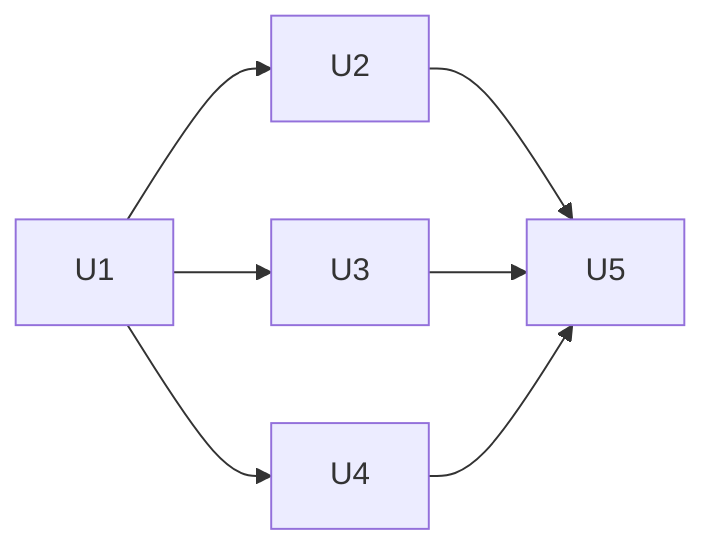

# Web Component Contract Migration, Phase 3 - i18n Foundation and Ui Strings - Plan

> Implemented. 5 units, 2026-10-02T20:19Z to 2026-10-02T21:18Z.

## Goal

Install vue-i18n 11.4.12 in Composition mode with English and German
catalogs. Switching Storybook to `de` changes component defaults,
announcements, and number formatting, including `UiPagination` labels.
`UiAppRoot` passes the active Composer locale to Reka.
Stop condition: vue-i18n cannot run in Composition mode alongside
Storybook's `setProjectAnnotations` in the happy-dom audit.

## Decisions

- The accepted [component contract](../architecture/2026-09-28-web-component-contract-direction.md),
  including its 2026-09-28 amendment, and the parent's Decisions govern.
  Add only `vue-i18n@11.4.12` as a direct dependency. Its mandatory
  transitives include `@vue/devtools-api@^6.5.0`, resolved to 6.6.4 in
  the compatibility installation, beside the existing 8.2.1.
  Why: the approved package's manifest defines this graph.
- This tree holds phase 1 through `102193b1`, and phase 3's `Landed:`
  remains empty on `main`. Recheck both with the
  [phase re-plan checks](../../.agents/skills/plan/references/replan-phase.md)
  before implementation.
- Implementation starts from a tree that holds
  [phase 2](2026-09-28-1844-refactor-web-component-contract-migration-phase2-plan.md),
  up to the last commit of the parent's U2 `Landed:` line. Phase 2's
  dependency changes and its `UiMotionConfig` in `UiAppRoot` stay as merged.
  Why: phase 2's units edit `package.json`, `pnpm-lock.yaml`,
  `UiAppRoot.vue`, `src/ui/index.ts`, `FleetView.test.ts`, and the README,
  which U1 and U5 edit too. Phase 2 also adds five test files that mount
  `UiAppRoot`, and `useI18n` throws `NOT_INSTALLED` in an app without the
  plugin, so U1 installs it in them. The parent's `After:` names only
  phase 1, so this order is recorded here. This tree holds phase 2 through
  `0a89dc0e`, and the five test files and the `UiAppRoot` shape below match
  it.
- Pin the added package exactly. Existing resolved versions in
  `frontend/web/pnpm-lock.yaml` are Vue 3.5.43, Reka UI 2.10.5,
  Storybook 10.6.0, happy-dom 20.14.5, Vitest 5.0.2, and Tailwind 4.3.3.
  pnpm is 11.25.0. Why: these are the versions the compatibility check uses.
- A fresh `createWebI18n(locale)` belongs to each Vue app, with global
  Composer scope inside that app. Never share a plugin between canvases
  or tests. Why: vue-i18n's `install` replaces `app.unmount` with a
  wrapper that calls `i18n.dispose()` (package source below).
- Install the plugin before mount in `main.ts`, Storybook's `setup`
  callback, and each standalone test app. `setProjectAnnotations`
  registers annotations. `composeStories` plus a manual `createApp`
  does not call Storybook's `runSetupFunctions`.
  Why: that call belongs to `renderToCanvas`, while the audit mounts
  the composed component itself.
- Keep locale state in the Composer. `UiAppRoot` reads it instead of
  carrying a second locale prop. The Storybook decorator watches
  `reactive(context.globals).locale` and updates that app's Composer.
  Globals take precedence over the plugin's initial locale.
  The browser renderer supplies reactive globals. Portable stories supply
  a plain object, so their tests mutate `reactive(Story.globals).locale`.
  Compose each audit case with `initialGlobals: { locale }` matching the
  requested locale.
  Why: translated text and Reka's locale must change together.
- Optional text props resolve with `props.text ?? t(key)` in computed
  state or the template. Keep structural defaults in `withDefaults`.
  Why: Vue's `checkInvalidScopeReference` rejects setup-local `t`
  in a hoisted prop default, and a one-time translation freezes the locale.
- Create every message in the catalog in the foundation unit.
  English defaults keep today's literal values verbatim.
  The fixed German acceptance values are `ui.statusBadge.healthy: Gesund`,
  `ui.pagination.previousText: Zurück`, `nextText: Weiter`,
  `firstLabel: Erste Seite`, `pageLabel: Seite {page}`, and
  `ui.tooltip.control: Strg`. U1 chooses the other German translations.
  Later units consume those values without editing the catalog.
  Why: independent component units must not share locale files.
- Translate full sentences with named interpolation. Preserve the Ask
  heading's strong target through `I18nT scope="global"`, with a
  plain-string heading override. Value/unit messages use named slots to
  retain their separately styled spans. Counts and units use `n()`,
  complete messages, and the active
  locale's `Intl.ListFormat`. Why: the contract prohibits fragment-built
  sentences and requires a non-breaking space between values and units.
- Status and shortcut identifiers remain data. Translate their generated
  display text in the owning component. Caller strings, slots, identifiers,
  handler answers, and explicit error messages remain supplied content.
  Default glyphs also come from messages with caller overrides.
  Why: the inventory includes words synthesized outside a template and
  visible punctuation, not only English template text.
- LongText stories supply long content and keep locale unset in story
  globals. The audit renders them in both locales, and the browser check
  selects German with the toolbar. Why: a story-level locale overrides
  the audit's requested locale.
- Phase 3 runs before the AI actions plan. The units below stand, and the
  `UiAiActionLayer` messages they add go when that plan replaces the
  layer. Why: new AI surfaces then start on the i18n foundation, and the
  inventory taken from this tree stays valid. (decided by the user,
  2026-10-01)
- **The review gets one more fix round** past its three-round limit,
  resumed from `parked/wcc-p3-review` (`b51c97f9`). It covers the catalog
  isolation test that passes against a shallow copy, the shared
  `numberFormats` object, the casts and non-null assertions in the two new
  tests, the decorator solution that disagrees with the code, and the
  colliding state names in the label property test. Why: each open finding
  names its fix. (decided by the user, 2026-10-03)
- **The coordinator closes the fourth round's three remaining findings
  directly**, without a fifth review round: the German halves of both
  plugin isolation tests, a redundant assertion, and a trailing participle.
  Each isolation case must fail when its catalog or formats are left
  uncloned. (decided by the user, 2026-10-03)
- **Phase 3 fixes the 320 px overflow its LongText stories exposed.** At a
  320 px viewport, `UiTooltip` cuts off a long label on one line, a long
  `UiButton` label wraps outside the button outline (alert dialog and toast
  action LongText), and the page scrolls horizontally in the pagination
  with-edges and LongText stories, the command default story, and the
  status badge, breadcrumb, and table LongText and table sortable stories.
  None of these may overflow at 320 px in either locale or theme. Why:
  long German text is what this phase adds, so its stories must hold at the
  narrowest supported width. (decided by the user, 2026-10-03)

The parent stop condition does not hold with the resolved versions above.
A Composition-mode probe using the current preview, `setProjectAnnotations`,
`composeStories`, and explicit `app.use` passes translation and axe checks
in both locales. The existing `src/ui/a11y.test.ts` also passes its 128
checks with the plugin and locale decorator, including a German Composer
feeding `UiAppRoot`. The implementation keeps the probe as
`.storybook/i18nDecorator.test.ts` first and stops before component work
if it fails. Live switching is also checked through
`reactive(Story.globals).locale`, including Reka's injected locale.

### External sources

Fetched versioned package files are the behavioral authority. Context7's
Composition example also shows `createI18n`, `useI18n`, and `app.use`,
but its current index includes v12 material, so v11 claims use these files.

| Source | Behavior used |
| --- | --- |
| [vue-i18n 11.4.12 registry metadata](https://registry.npmjs.org/vue-i18n/11.4.12) | Exact package exists, MIT, Vue peer `^3.0.0`. |
| [vue-i18n 11.4.12 distribution](https://unpkg.com/vue-i18n@11.4.12/dist/vue-i18n.mjs) | `createI18n`, `install`, `useI18n`, reactive Composer locale, `Translation`. `useI18n` throws `NOT_INSTALLED` when the app lacks the plugin. |
| [Vue compiler-sfc 3.5.43](https://unpkg.com/@vue/compiler-sfc@3.5.43/dist/compiler-sfc.cjs.js) | `checkInvalidScopeReference` checks `propsRuntimeDefaults`. |
| [Storybook Vue 10.6.0 portable stories](https://unpkg.com/@storybook/vue3@10.6.0/dist/index.js) | `setProjectAnnotations` registers annotations. `composeStories` returns renderable components. |
| [Storybook Vue 10.6.0 renderer](https://unpkg.com/@storybook/vue3@10.6.0/dist/_browser-chunks/chunk-X42PMG4S.js) | `setup` registers callbacks, `renderToCanvas` runs them. |
| [Reka 2.10.5 ConfigProvider](https://unpkg.com/reka-ui@2.10.5/dist/ConfigProvider/ConfigProvider.js) | Reactive locale and dir refs are provided to descendants. |
| [Reka pagination item](https://unpkg.com/reka-ui@2.10.5/dist/Pagination/PaginationListItem.js) | Default accessible name is `Page ${value}`, which the wrapper must override. |
| [Reka toast provider](https://unpkg.com/reka-ui@2.10.5/dist/Toast/ToastProvider.js), [viewport](https://unpkg.com/reka-ui@2.10.5/dist/Toast/ToastViewport.js), [action](https://unpkg.com/reka-ui@2.10.5/dist/Toast/ToastAction.js) | English label defaults and function viewport labels. Empty action alt text and whitespace-only provider labels throw. |
| [Reka progress](https://unpkg.com/reka-ui@2.10.5/dist/Progress/ProgressRoot.js) | `getValueText` supplies `aria-valuetext`, alongside numeric ARIA attributes. |
| [Vue I18n component interpolation](https://vue-i18n.intlify.dev/guide/advanced/component) | Named slots interpolate markup into one message. |
| [Intl.ListFormat](https://developer.mozilla.org/en-US/docs/Web/JavaScript/Reference/Global_Objects/Intl/ListFormat) | Locale-specific list joining, with `type` and `style` options. |

The joined text is locale data that page does not list. Node 22.14.0
(ICU 76.1) prints `A, B, C` and `A, B und C` for the command below. The
default `conjunction` type prints `A, B, and C` in `en`.

```bash
node -e "for (const l of ['en', 'de']) console.log(new Intl.ListFormat(l, { type: 'unit', style: 'short' }).format(['A', 'B', 'C']))"
```

### String inventory

There are 59 `Ui*.vue` files, counted with:

```bash
rg --files frontend/web/src/ui | rg '/Ui[^/]*\.vue$' | wc -l
```

Sixteen hold word literals. Six more hold symbols or synthesized labels.
`UiMetricCard` needs localized numeric output, and `UiToastProvider`
needs explicit Reka labels. These 24 text or formatting owners are below.
Paths in the first column are relative to `frontend/web/src/ui/`.
Message suffixes are under `ui.<owner>.`. Each listed default has an
override prop, including defaults currently overridable only through slots.

| Component file | Owner | Message suffixes and output |
| --- | --- | --- |
| `alert-dialog/UiAlertDialog.vue` | `alertDialog` | `confirmText`, `cancelText` |
| `breadcrumb/UiBreadcrumb.vue` | `breadcrumb` | `ariaLabel` |
| `breadcrumb/UiBreadcrumbEllipsis.vue` | `breadcrumbEllipsis` | `toggleLabel` |
| `breadcrumb/UiBreadcrumbSeparator.vue` | `breadcrumbSeparator` | `separator` (`/`) |
| `combobox/UiCombobox.vue` | `combobox` | `placeholder`, `emptyText` |
| `command/UiCommandDialog.vue` | `commandDialog` | `title`, `description` |
| `command/UiCommandEmpty.vue` | `commandEmpty` | `text` |
| `command/UiCommandInput.vue` | `commandInput` | `placeholder`, `label` |
| `command/UiCommandList.vue` | `commandList` | `label` |
| `dialog/UiDialog.vue` | `dialog` | `fallbackTitle`, `fallbackDescription`, `closeLabel` |
| `form/UiSelect.vue` | `select` | `placeholder` |
| `progress/UiProgress.vue` | `progress` | `ariaLabel`, localized percent value text |
| `toast/UiToast.vue` | `toast` | `actionAltText`, `closeLabel` |
| `toast/UiToastProvider.vue` | `toastProvider` | `announcementLabel`, `viewportLabel` with `{hotkey}` |
| `badge/UiStatusBadge.vue` | `statusBadge` | `healthy`, `degraded`, `offline` |
| `card/UiMetricCard.vue` | `metricCard` | `valueWithUnit` with `{value}` and `{unit}` |
| `form/UiField.vue` | `field` | `requiredMark` (`*`) |
| `meter/UiMeter.vue` | `meter` | `unit`, `detailSeparator`, `valueWithUnit` |
| `meter/UiSegmentedMeter.vue` | `segmentedMeter` | `healthy`, `degraded`, `offline`, `segmentText` with `{count}` and `{label}`. Empty summary is `n(0)`. |
| `pagination/UiPagination.vue` | `pagination` | `firstLabel`, `previousLabel`, `nextLabel`, `lastLabel`, `previousText`, `nextText`, `pageLabel` with `{page}`, `firstMark`, `previousMark`, `nextMark`, `lastMark`, `ellipsis` |
| `table/UiTableHead.vue` | `tableHead` | `ascendingMark`, `descendingMark` |
| `tooltip/UiTooltip.vue` | `tooltip` | `control`, `alt`, `shift`, `escape`, `optionMark`, `shiftMark`, `commandMark`, `backslashMark`, `leftMark`, `rightMark`, `upMark`, `downMark`, `enterMark` from `keysOf` |
| `ai/UiAiActionLayer.vue` | `aiActionLayer` | `askAbout`, `heading` with `{label}`, `ai`, `questionLabel`, `questionPlaceholder`, `cancel`, `ask`, `asking`, `unavailable`, `error` |
| `ai/UiAiSummary.vue` | `aiSummary` | `summaryLabel` with `{label}`, `generate`, `generating`, `unavailable`, `retry`, `error` |

`UiAppRoot` changes provider wiring only. The other 34 component files
render caller content or no text: `UiBadge`, `UiButton`, `UiCard`,
`UiBreadcrumbItem`, `UiBreadcrumbLink`, `UiBreadcrumbList`,
`UiBreadcrumbPage`, `UiCommand`, `UiCommandGroup`, `UiCommandItem`,
`UiCommandSeparator`, `UiCommandShortcut`, `UiDropdownMenu`,
`UiDropdownMenuItem`, `UiDropdownMenuSeparator`, `UiEmptyState`,
`UiCheckbox`, `UiInput`, `UiRadioGroup`, `UiSwitch`, `UiTextarea`,
`UiKbd`, `UiPopover`, `UiScrollArea`, `UiSeparator`, `UiSkeleton`,
`UiSpinner`, `UiTable`, `UiTableBody`, `UiTableCell`, `UiTableEmpty`,
`UiTableHeader`, `UiTableRow`, and `UiTabs`.
Review all 59 against requirement 3, including wrappers left unchanged.

## Requirements

1. A key present in one locale file and missing from the other fails a
   test.
2. Every story renders in `de` with no missing-key warning. Example:
   `UiPagination` in `de` shows German labels.
3. No `Ui*` template holds a user-visible literal. The phase's review
   checks this by reading, since there is no lint rule for it.

## Out of scope

- View-owned messages and view-level number/date formatting belong to
  phase 4. Installing the plugin in existing view test harnesses belongs
  here because their children acquire a plugin dependency.
- AI registration and the generative catalog belong to phases 5 and 6.
- Locale persistence, lazy loading, extra locales, and an i18n lint package.
- Navigation key matching and external handler output. `UiTooltip`
  localizes the display produced by `keysOf` without changing its source.

## Units

### U1. Locale catalog and app installation

Files: `frontend/web/package.json`, `frontend/web/pnpm-lock.yaml`, `docs/dependencies/statements/npm/vue-i18n.md`, `frontend/web/src/i18n/index.ts`, `frontend/web/src/i18n/locales/en.json`, `frontend/web/src/i18n/locales/de.json`, `frontend/web/src/i18n/i18n.test.ts`, `frontend/web/src/main.ts`, `frontend/web/src/ui/app/UiAppRoot.vue`, `frontend/web/src/ui/app/UiAppRoot.test.ts`, `frontend/web/.storybook/preview.ts`, `frontend/web/.storybook/i18nDecorator.ts`, `frontend/web/.storybook/i18nDecorator.test.ts`, `frontend/web/.storybook/aiDecorator.test.ts`, `frontend/web/src/ui/a11y.test.ts`, `frontend/web/src/FleetView.test.ts`, `frontend/web/src/DeviceView.test.ts`, `frontend/web/src/components/GlobalSearch.test.ts`, `frontend/web/src/components/TenantSwitcher.test.ts`, `frontend/web/src/components/topology/TopologySemantics.test.ts`, `frontend/web/src/ui/motion/useMotionFeedback.test.ts`, `frontend/web/src/ui/motion/UiMotion.test.ts`, `frontend/web/src/ui/motion/UiMotion.reduced.test.ts`, `frontend/web/src/FleetView.motion.test.ts`, `frontend/web/src/components/ThemeSwitcher.test.ts`
After: none
Change: Add the approved exact dependency with pnpm, then restore lockfile formatting with the workspace Prettier. Create the catalog and fixed values in the String inventory in both locales. Export WebLocale, supportedLocales, and createWebI18n(locale = 'en') from src/i18n/index.ts. It returns a fresh legacy: false plugin with fallbackLocale: 'en', both message catalogs, decimal and integer number formats, and a percent format. main.ts installs one instance before mount. UiAppRoot reads the global Composer locale for ConfigProvider and removes its unused locale prop, retaining dir and scrollBody. Phase 2's merged UiAppRoot.vue puts UiMotionConfig inside TooltipProvider. U1 edits the script block and ConfigProvider's locale binding and leaves that element and its props as merged. Storybook setup installs a fresh instance per app. withLocale watches reactive(context.globals).locale, with globals taking precedence over the initial plugin locale, and wraps stories in UiAppRoot, except when context.component === UiAppRoot, whose story already renders it. The locale toolbar offers en and de beside the existing theme toolbar. Direct createApp and createSSRApp mounts in the listed harnesses install a fresh instance explicitly. The last five listed files are phase 2's tests under src/ui/motion/, src/FleetView.motion.test.ts, and src/components/ThemeSwitcher.test.ts. `rg -l UiAppRoot frontend/web/src frontend/web/.storybook -g '*.test.ts'` lists them with FleetView.test.ts and UiAppRoot.test.ts, all named above. U1 also writes docs/dependencies/statements/npm/vue-i18n.md in the shape of motion-v.md, with `approved:` left empty for a person's ruling, since `go test ./test/conformance/dependencies` fails a direct dependency without a statement.
Tests: src/i18n/i18n.test.ts recursively compares sorted message leaf paths in both directions, rejects empty or non-string leaves, and proves deleting ui.pagination.nextText from either cloned catalog yields that missing path. Test Composition mode, German interpolation, plural selection for 0/1/2 through a test-local test.items message (No items | One item | {count} items, and Keine Einträge | Ein Eintrag | {count} Einträge), and en/de number formats. src/ui/app/UiAppRoot.test.ts observes Reka's injected locale changing en to de after a Composer update while retaining tooltip behavior. .storybook/i18nDecorator.test.ts uses setProjectAnnotations and composeStories to mount a translated probe in both locales, composes each locale with matching initialGlobals, changes reactive(Story.globals).locale without remounting, mounts en/de canvases together, and proves unmounting either leaves the other's translations usable. Existing AI document-scope and view/SSR tests retain their assertions with the real plugin, as do phase 2's five. Its UiMotion.reduced.test.ts fails when the UiAppRoot edit drops UiMotionConfig.
Verify: `.claude/skills/verify-change/scripts/verify-change.sh -- frontend/web/package.json frontend/web/pnpm-lock.yaml docs/dependencies/statements/npm/vue-i18n.md frontend/web/src/i18n/index.ts frontend/web/src/i18n/locales/en.json frontend/web/src/i18n/locales/de.json frontend/web/src/i18n/i18n.test.ts frontend/web/src/main.ts frontend/web/src/ui/app/UiAppRoot.vue frontend/web/src/ui/app/UiAppRoot.test.ts frontend/web/.storybook/preview.ts frontend/web/.storybook/i18nDecorator.ts frontend/web/.storybook/i18nDecorator.test.ts frontend/web/.storybook/aiDecorator.test.ts frontend/web/src/ui/a11y.test.ts frontend/web/src/FleetView.test.ts frontend/web/src/DeviceView.test.ts frontend/web/src/components/GlobalSearch.test.ts frontend/web/src/components/TenantSwitcher.test.ts frontend/web/src/components/topology/TopologySemantics.test.ts frontend/web/src/ui/motion/useMotionFeedback.test.ts frontend/web/src/ui/motion/UiMotion.test.ts frontend/web/src/ui/motion/UiMotion.reduced.test.ts frontend/web/src/FleetView.motion.test.ts frontend/web/src/components/ThemeSwitcher.test.ts`

### U2. Control defaults and accessible labels

Files: `frontend/web/src/ui/alert-dialog/UiAlertDialog.vue`, `frontend/web/src/ui/alert-dialog/UiAlertDialog.test.ts`, `frontend/web/src/ui/alert-dialog/UiAlertDialog.stories.ts`, `frontend/web/src/ui/breadcrumb/UiBreadcrumb.vue`, `frontend/web/src/ui/breadcrumb/UiBreadcrumbEllipsis.vue`, `frontend/web/src/ui/breadcrumb/UiBreadcrumbSeparator.vue`, `frontend/web/src/ui/breadcrumb/UiBreadcrumb.test.ts`, `frontend/web/src/ui/breadcrumb/UiBreadcrumb.stories.ts`, `frontend/web/src/ui/combobox/UiCombobox.vue`, `frontend/web/src/ui/combobox/UiCombobox.test.ts`, `frontend/web/src/ui/combobox/UiCombobox.stories.ts`, `frontend/web/src/ui/command/UiCommandDialog.vue`, `frontend/web/src/ui/command/UiCommandEmpty.vue`, `frontend/web/src/ui/command/UiCommandInput.vue`, `frontend/web/src/ui/command/UiCommandList.vue`, `frontend/web/src/ui/command/UiCommand.test.ts`, `frontend/web/src/ui/command/UiCommand.stories.ts`, `frontend/web/src/ui/dialog/UiDialog.vue`, `frontend/web/src/ui/dialog/UiDialog.test.ts`, `frontend/web/src/ui/dialog/UiDialog.stories.ts`, `frontend/web/src/ui/form/UiSelect.vue`, `frontend/web/src/ui/form/UiSelect.test.ts`, `frontend/web/src/ui/form/UiSelect.stories.ts`, `frontend/web/src/ui/form/formReset.test.ts`, `frontend/web/src/ui/progress/UiProgress.vue`, `frontend/web/src/ui/progress/UiProgress.test.ts`, `frontend/web/src/ui/progress/UiProgress.stories.ts`, `frontend/web/src/ui/toast/UiToast.vue`, `frontend/web/src/ui/toast/UiToastProvider.vue`, `frontend/web/src/ui/toast/UiToast.test.ts`, `frontend/web/src/ui/toast/UiToast.stories.ts`
After: U1
Change: Resolve each default through the owning catalog key at render time. Preserve existing override props and slots. Add ariaLabel to UiBreadcrumb, toggleLabel to UiBreadcrumbEllipsis, separator to UiBreadcrumbSeparator, emptyText to UiCombobox, text to UiCommandEmpty, title and description to UiCommandDialog, fallbackTitle/fallbackDescription/closeLabel to UiDialog, and closeLabel to UiToast. UiToastProvider exposes announcementLabel and viewportLabel and supplies both Reka labels, using a function label for ToastViewport so its hotkey is interpolated by vue-i18n. UiProgress supplies localized ariaLabel and an overridable valueText formatter to Reka getValueText using the percent number format. All listed component tests install the plugin in their own mount helpers, including the UiSelect form-reset apps. UiCommandEmptyProps is exported from its component, with the barrel export in U5. Stories exercise defaults as well as custom text, with LongText scenarios for visible controls.
Tests: The listed tests retain interaction, focus-return, reset, and toast-removal cases. Add en/de default and explicit-override checks for every migrated text surface, including hidden dialog titles/descriptions, empty slots, slash, progress aria-valuetext, toast announcement prefix, and viewport hotkey label. UiToast.test.ts and UiBreadcrumb.test.ts assert German accessible names through the DOM. Assert overrides remain after changing locale, and empty optional placeholders/text/marks stay verbatim. Assert Reka rejects actionAltText: '' for an action and a whitespace-only announcementLabel. UiAlertDialog.stories.ts adds a default-label open story because all current stories override its buttons. UiToast.stories.ts localizes its direct Reka provider and ToastViewportSurface so their English labels do not escape the wrapper tests.
Verify: `.claude/skills/verify-change/scripts/verify-change.sh -- frontend/web/src/ui/alert-dialog/UiAlertDialog.vue frontend/web/src/ui/alert-dialog/UiAlertDialog.test.ts frontend/web/src/ui/alert-dialog/UiAlertDialog.stories.ts frontend/web/src/ui/breadcrumb/UiBreadcrumb.vue frontend/web/src/ui/breadcrumb/UiBreadcrumbEllipsis.vue frontend/web/src/ui/breadcrumb/UiBreadcrumbSeparator.vue frontend/web/src/ui/breadcrumb/UiBreadcrumb.test.ts frontend/web/src/ui/breadcrumb/UiBreadcrumb.stories.ts frontend/web/src/ui/combobox/UiCombobox.vue frontend/web/src/ui/combobox/UiCombobox.test.ts frontend/web/src/ui/combobox/UiCombobox.stories.ts frontend/web/src/ui/command/UiCommandDialog.vue frontend/web/src/ui/command/UiCommandEmpty.vue frontend/web/src/ui/command/UiCommandInput.vue frontend/web/src/ui/command/UiCommandList.vue frontend/web/src/ui/command/UiCommand.test.ts frontend/web/src/ui/command/UiCommand.stories.ts frontend/web/src/ui/dialog/UiDialog.vue frontend/web/src/ui/dialog/UiDialog.test.ts frontend/web/src/ui/dialog/UiDialog.stories.ts frontend/web/src/ui/form/UiSelect.vue frontend/web/src/ui/form/UiSelect.test.ts frontend/web/src/ui/form/UiSelect.stories.ts frontend/web/src/ui/form/formReset.test.ts frontend/web/src/ui/progress/UiProgress.vue frontend/web/src/ui/progress/UiProgress.test.ts frontend/web/src/ui/progress/UiProgress.stories.ts frontend/web/src/ui/toast/UiToast.vue frontend/web/src/ui/toast/UiToastProvider.vue frontend/web/src/ui/toast/UiToast.test.ts frontend/web/src/ui/toast/UiToast.stories.ts`

### U3. Values, status labels, and visible glyphs

Files: `frontend/web/src/ui/badge/UiStatusBadge.vue`, `frontend/web/src/ui/badge/UiBadge.test.ts`, `frontend/web/src/ui/badge/UiStatusBadge.stories.ts`, `frontend/web/src/ui/card/UiMetricCard.vue`, `frontend/web/src/ui/card/UiMetricCard.test.ts`, `frontend/web/src/ui/card/UiMetricCard.stories.ts`, `frontend/web/src/ui/form/UiField.vue`, `frontend/web/src/ui/form/UiField.test.ts`, `frontend/web/src/ui/form/UiField.stories.ts`, `frontend/web/src/ui/meter/UiMeter.vue`, `frontend/web/src/ui/meter/UiSegmentedMeter.vue`, `frontend/web/src/ui/meter/UiMeter.test.ts`, `frontend/web/src/ui/meter/UiMeter.stories.ts`, `frontend/web/src/ui/pagination/UiPagination.vue`, `frontend/web/src/ui/pagination/UiPagination.test.ts`, `frontend/web/src/ui/pagination/UiPagination.stories.ts`, `frontend/web/src/ui/table/UiTableHead.vue`, `frontend/web/src/ui/table/UiTable.test.ts`, `frontend/web/src/ui/table/UiTable.stories.ts`, `frontend/web/src/ui/tooltip/UiTooltip.vue`, `frontend/web/src/ui/tooltip/UiTooltip.test.ts`, `frontend/web/src/ui/tooltip/UiTooltip.stories.ts`
After: U1
Change: UiStatusBadge maps its existing status identifiers to messages and adds a label override while preserving its slot. UiSegmentedMeter retains the counts identifiers, translates their default labels through a labels override map, formats counts, and resolves each whole count/label phrase through segmentText(count, label), an optional formatter prop. Its summary joins the phrases with new Intl.ListFormat(locale, { type: 'unit', style: 'short' }), which keeps today's English comma list, and preserves the existing label override. UiMetricCard and UiMeter format numbers and join units with a non-breaking space through I18nT scope="global" and named value/unit slots, preserving the existing styled spans and .metric-value selector. An optional valueText(value, unit) formatter replaces the complete display with caller text. UiMeter's unit and detailSeparator defaults come from messages. UiField adds requiredMark. UiTableHead adds ascendingMark/descendingMark. UiPagination exposes firstLabel/previousLabel/nextLabel/lastLabel, previousText/nextText, pageLabel(page), and firstMark/previousMark/nextMark/lastMark/ellipsis. It overrides Reka's per-page English label and formats page text. UiTooltip translates the known keysOf labels and glyphs for Shortcut objects through a keyLabel(key) formatter prop, while explicit string[] shortcuts remain caller text. Remove per-story TooltipProvider wrappers because the locale decorator owns UiAppRoot. Listed tests install real plugin instances.
Tests: UiBadge.test.ts checks Healthy renders Gesund in de without changing status-dependent classes or label and slot overrides. UiMetricCard.test.ts and UiMeter.test.ts check 1234.5 becomes 1.234,5 in de, a non-breaking space before units, German count labels and list joining, zero counts, explicit segments, and formatter overrides. The English summary stays 10 Healthy, 2 Degraded, 1 Offline, and the German one joins its last phrase with und. UiPagination.test.ts checks Zurück/Weiter, Erste Seite, Seite 2, every glyph override, and unchanged update:page behavior. UiField.test.ts and UiTable.test.ts check required/sort marks and overrides. UiTooltip.test.ts checks Ctrl becomes Strg for a non-Mac Shortcut, Mac glyphs, explicit string arrays, an explicit keyLabel override, and a locale switch while open. Stories include German LongText, formatted values, and default label cases.
Verify: `.claude/skills/verify-change/scripts/verify-change.sh -- frontend/web/src/ui/badge/UiStatusBadge.vue frontend/web/src/ui/badge/UiBadge.test.ts frontend/web/src/ui/badge/UiStatusBadge.stories.ts frontend/web/src/ui/card/UiMetricCard.vue frontend/web/src/ui/card/UiMetricCard.test.ts frontend/web/src/ui/card/UiMetricCard.stories.ts frontend/web/src/ui/form/UiField.vue frontend/web/src/ui/form/UiField.test.ts frontend/web/src/ui/form/UiField.stories.ts frontend/web/src/ui/meter/UiMeter.vue frontend/web/src/ui/meter/UiSegmentedMeter.vue frontend/web/src/ui/meter/UiMeter.test.ts frontend/web/src/ui/meter/UiMeter.stories.ts frontend/web/src/ui/pagination/UiPagination.vue frontend/web/src/ui/pagination/UiPagination.test.ts frontend/web/src/ui/pagination/UiPagination.stories.ts frontend/web/src/ui/table/UiTableHead.vue frontend/web/src/ui/table/UiTable.test.ts frontend/web/src/ui/table/UiTable.stories.ts frontend/web/src/ui/tooltip/UiTooltip.vue frontend/web/src/ui/tooltip/UiTooltip.test.ts frontend/web/src/ui/tooltip/UiTooltip.stories.ts`

### U4. AI surface messages

Files: `frontend/web/src/ui/ai/UiAiActionLayer.vue`, `frontend/web/src/ui/ai/UiAiActionLayer.test.ts`, `frontend/web/src/ui/ai/UiAiActionLayer.stories.ts`, `frontend/web/src/ui/ai/UiAiSummary.vue`, `frontend/web/src/ui/ai/UiAiSummary.test.ts`, `frontend/web/src/ui/ai/UiAiSummary.stories.ts`
After: U1
Change: Add exported UiAiActionLayerProps and UiAiSummaryProps, each with an optional typed labels object covering the keys in the String inventory. Their barrel exports land in U5. Resolve labels with labels[key] ?? t(ownerKey), passing target labels as named interpolation. The Ask heading uses one message and I18nT scope="global" with a named strong-label slot. A heading override renders the complete caller string. Keep handler answers and Error.message as supplied data. Store non-Error failures as the generic-error state and resolve its default message during render so changing locale also updates an active error. Preserve request tokens, stale-target handling, timers, portals, and focus behavior. Tests install the real plugin.
Tests: UiAiSummary.test.ts covers idle/loading/result/error/unavailable/retry in en and de, target-label interpolation, every labels override, and a locale switch during a pending request and a generic-error state. UiAiActionLayer.test.ts covers translated trigger name, heading, textarea label/placeholder, cancel/submit, pending/unavailable/generic error, every labels override, and target changes while open. Assert named-slot interpolation preserves the strong element and escapes a label containing markup. Retain late-answer and focus-return assertions. Both story files add LongText and override cases without forcing a single locale.
Verify: `.claude/skills/verify-change/scripts/verify-change.sh -- frontend/web/src/ui/ai/UiAiActionLayer.vue frontend/web/src/ui/ai/UiAiActionLayer.test.ts frontend/web/src/ui/ai/UiAiActionLayer.stories.ts frontend/web/src/ui/ai/UiAiSummary.vue frontend/web/src/ui/ai/UiAiSummary.test.ts frontend/web/src/ui/ai/UiAiSummary.stories.ts`

### U5. Every-story locale audit and migration documentation

Files: `frontend/web/src/ui/a11y.test.ts`, `frontend/web/README.md`, `.agents/skills/web-component/references/i18n-and-ai.md`, `frontend/web/src/ui/index.ts`
After: U2 U3 U4
Change: The existing story discovery and component coverage remain intact. Compose and mount every discovered story in en and de with a fresh plugin, including foundations currently skipped by the axe loop. Fail on any vue-i18n missing-key or fallback warning after mount and after opening interactive surfaces. Also fail on [intlify] Not found parent scope, with no warning suppression. Retain the existing axe, AI-target, and portalled-root assertions for their current story set, now in both locales. Add a German pagination DOM assertion so a toolbar value alone cannot satisfy the audit. ui/index.ts exports UiCommandEmptyProps, UiAiActionLayerProps, and UiAiSummaryProps after their components exist. The README describes installation, locale switching, override props, and message ownership with a working example. The skill reference removes the interim string-collection rule and describes reactive computed defaults, retaining the interim AI-registration rule. Its LongText rule uses both locales in the audit and the German toolbar in browser checks, with no story-level locale override.
Tests: src/ui/a11y.test.ts enumerates the entire stories glob with both locale values and diagnoses the story path, locale, and missing key on failure. It asserts no missing/fallback warning for foundations as well as Ui and composite stories, and checks an open overlay on its root body child. German pagination renders Zurück/Weiter. Existing target registration, Ask interaction, and unlabelled-input negative control remain. Browser checks inspect all changed story families in light/dark and en/de at 320 px and 1280 px, including LongText, open overlays, toast announcements, and AI states. Browser results do not stand in for the automated missing-key test.
Verify: `.claude/skills/verify-change/scripts/verify-change.sh -- frontend/web/src/ui/a11y.test.ts frontend/web/README.md .agents/skills/web-component/references/i18n-and-ai.md frontend/web/src/ui/index.ts`

Waves: U1 | U2 U3 U4 | U5



Only U1 edits the catalogs. U2, U3, and U4 have disjoint Files sets.
U1 and U5 both edit `a11y.test.ts`, with that wave between them.
U5 follows them because its every-story audit tests their translated
defaults and its documentation describes their APIs.

## Verification

From `frontend/web/`:

```bash
pnpm install --frozen-lockfile
./node_modules/.bin/vitest run src/i18n/i18n.test.ts .storybook/i18nDecorator.test.ts .storybook/aiDecorator.test.ts src/ui/a11y.test.ts
pnpm build-storybook
```

Each unit runs its listed focused tests and verifier over its complete
Files set. The web gate includes typecheck, build, lint, formatting, and
the full Vitest suite. Keep the
[reduced-motion mount stub](../solutions/conventions/mount-tests-under-happy-dom-must-stub-reduced-motion.md)
in tests that exercise JavaScript motion. Never mock the animation or
i18n packages.

Inspect open overlays with the
[portalled-root audit](../solutions/conventions/audit-an-open-portalled-overlay-on-its-root-body-child.md).
The locale decorator must preserve
[document-scoped AI ownership](../solutions/architecture-patterns/storybook-decorator-owns-document-scoped-state-until-the-last-unmount.md).
Mount tests, including SSR hosts, catch
[setup-order failures](../solutions/conventions/mount-tests-catch-script-setup-order-crashes.md).
Complete the real-browser loop in
`.agents/skills/web-component/references/review.md` for the changed stories.

Re-plan validation checks only this plan's Markdown and source evidence.
It does not mark the component migration implemented.

## Definition of done

- [x] All three unchanged requirements pass, including a read of every
      `Ui*` template for visible literals.
- [x] Every changed path passes the diff-aware verifier.
- [x] Storybook's locale toolbar, German LongText, both themes, and open
      overlays pass the browser checks.
- [x] The README and i18n skill reference describe the implemented behavior.
- [x] This plan reads `status: implemented` with an outcome note.
- [x] Requirement and unit labels appear only in the plan.

## Open questions

None.
