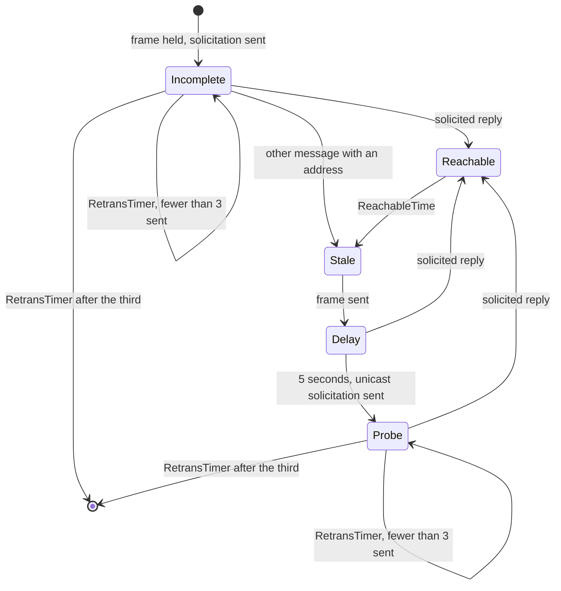

# Routing, Neighbor Resolution, and Filtering - Plan

## Goal

`layer/routing` forwards only what its EtherType says is IP, resolves a next
hop by soliciting it as RFC 826 and RFC 4861 specify, answers a solicitation
for its own address, and hands a held frame back with a token and its ingress
interface. `layer/filter` gives a frame it could not decode its set's default
and reads two spellings of one rule as equal. The means is five units in a
chain: the filter, then for routing its configuration and classification,
the result and held-frame shape, the sending half of the neighbor machine,
and the receiving half. Stop condition: if a frame the layer originates
cannot leave through the egress a released frame takes
(`V/switch.go:3178-3244`) on a VLAN interface, a routed port, and a
sub-interface alike, the transmit work of U4 and U5 moves to phase 9 and
this phase keeps the states and timers.

## Decisions

`R` is `src/common/sim/layer/routing`, `F` is `src/common/sim/layer/filter`,
`V` is `src/common/sim/device/vswitch`, `Fb` is `src/common/sim/fabric`, and
`N` is `src/common/sim/netmodel`. Source labels are defined under Inventory,
Sources.

- The parent's Decisions apply.
- The neighbor table runs the states of `R4861` 7.3.2 for both families, and
  `NeighborFailed` goes. Why: 7.3.3 says an entry whose resolution failed
  "SHOULD be deleted, so that subsequent traffic to that neighbor invokes
  the next-hop determination procedure again". ARP has no state machine.
  `R826` defines the packet and its reception, and `R1122` 2.3.2.1 asks for
  at most one request a second per destination and names a unicast poll
  that deletes the entry. Running ARP on the 4861 states is the layer's
  reading, and the README says so.
- The layer is the source of its protocol frames. `Route` and `Originate`
  return the first solicitation on their result, and `Advance` and
  `Receive` return theirs as `layer.Effects`, as `stp.Receive` does
  (`src/common/sim/layer/stp/layer.go:2062`). Why: the stop condition is
  not met. `releaseHeldFrame` sends a frame of the layer's on all three
  interface kinds, and the emission queue has a `Protocol` mark
  (`V/switch.go:3090`).
- The layer takes an ARP or Neighbor Discovery frame only when its
  interface receives it: the Ethernet destination is the interface's MAC,
  the broadcast address for ARP, or the `R2464` section 7 address of the
  all-nodes group or of the solicited-node group of one of its addresses
  (`R4861` 7.2.1). `Receive` replaces `Observe`, and the ARP flag mapping
  moves in from the switch (`V/switch.go:1464-1515`). Why: `R826` runs its
  reception on a packet the station receives, and `R4861` 7.3.1 says an
  unsolicited message "MUST NOT be treated as a reachability confirmation".
  The switch hands over every such frame on the segment today
  (`:1181-1202`).
- The layer returns no ICMP error, and the README states it as a Limit.
  Why: `R4861` 7.2.2 requires an Address Unreachable error for each frame a
  failed resolution held, and the layer's other drops owe one as well. Each
  is a datagram of a protocol the tree only decodes
  (`src/common/net/icmp/icmp.go:27`), under a rate limit `R4443` 2.4 (f)
  makes mandatory. The local network record has `reject` generate nothing
  (`docs/architecture/2026-09-16-local-network-analysis-direction.md:60-61`)
  and keeps error generation among the remaining gaps (`:121-124`).
- The layer mints the hold token: a counter per layer that `Clone` copies,
  starting at 1, with zero meaning not held. Why: the token reaches the
  switch on the result and again on the exit, so no entry point accepts
  one, and a fork mints the same token for the same frame.
- `NeighborPolicy.RetransTimer` replaces `ResolutionTimeout` and defaults
  to 1 second. Three solicitations of either kind and the 5 second delay
  before the first probe are constants. Why: `R4861` 6.3.2 makes
  `RetransTimer` and `ReachableTime` variables, and section 10 lists the
  rest as constants.
- `Validate` gains three refusals. `routing` refuses two routes that agree
  on prefix, next hop, and interface (entry 2), and one subnet on two
  interfaces of a VRF (entry 9), link-local prefixes apart, since `R4291`
  2.1 requires one on every interface. `filter` refuses an IPv4-mapped
  prefix (entry 11), as `routing` does (`R/config.go:368-375`). `N` builds
  no route (`N/routing_test.go:1241-1247`), so the other two get a guard
  there in their unit, as
  `docs/solutions/conventions/a-degrade-contract-is-tested-against-the-refusing-side.md`
  requires.
- A filter binding names a routed interface, and the layer does not
  require routing. Why: the local network record attaches "a set to a
  routed interface" (`:28-33`), and the layer knows an interface by its
  name alone. This is the layer's half of the question phase 9 shares. A
  port or VLAN binding is not modelled.
- An originated datagram takes its source from the egress interface, and
  its route is selected by hashing the family's unspecified address with
  the destination. Why: `R1122` 3.3.4.3 (b) and (c) choose "a local IP
  address corresponding to that interface" once a route is known, and
  `R6724` section 5 Rule 5 prefers the address "assigned to the interface
  that will be used to send to D". The source is unknown until the egress
  is, so it cannot be a hash input.
- The units form a chain. U1 and U2 both edit `N/netmodel.go`, and U2 to U5
  share `R`.
- These shapes break: `routing.Observe`, `Advertisement`, `NeighborFailed`,
  and `NeighborPolicy.ResolutionTimeout` go, and `filter`'s decision fact
  and a positional rule's `Diff` key change.
- Every entry below was re-read at `c0c23e68`. None was run.

## Requirements

R1. Every Correctness entry has a test that fails before its fix, or is
struck with its reason.

R2. An unresolved next hop is solicited, and resolution ends as `R4861`
7.2.2 and Appendix C describe. Example: `sw1` routes a frame toward next
hop `10.0.99.2`, an address of `sw2` on their shared routed link, with no
neighbor entry. `sw1` holds the frame and emits an ARP request, `sw2`
answers it, `sw1` reads the next hop as `reachable`, and the held frame
leaves for `sw2`'s MAC. With `sw2` absent, `sw1` emits three requests one
second apart, the held frame exits `timed-out` at three seconds, and
`Neighbors()` holds no entry for the next hop.

R3. An entry in use is verified. Example: with a 30 second `ReachableTime`,
an entry is confirmed at `t0`. A frame routed at `t0` plus 31 seconds leaves
on the cached MAC and the entry reads `delay`. `Advance` at plus 36 emits a
unicast request to that MAC and the entry reads `probe`. Unanswered, two
more follow at plus 37 and plus 38, and at plus 39 the entry is gone. A
reply before then returns it to `reachable`.

R4. A held frame names itself. Example: frame 1 held for `10.0.99.2` and
frame 2 for `10.0.99.6` return tokens 1 and 2 on their results. A reply
from `10.0.99.6` makes `DrainExits` report one frame, with token 2, cause
`released`, and ingress `vlan10`, and frame 1 stays queued.

R5. A stateful set defers only a decoded IP packet. Example: a frame with
EtherType `0x0800` and a four-octet payload meets a stateful inbound set
with `Default: Drop`. Its counterpart set is stateful and holds an accept
rule with no criteria. `EvaluateIngress` returns `drop` under
`filter.default` and defers nothing.

R6. Order, an unmasked prefix, and a repeat do not distinguish two filter
rules. Example: two configurations whose one rule lists `Src` as
`10.0.2.0/24, 10.0.1.5/24, 10.0.2.0/24` and as `10.0.1.0/24, 10.0.2.0/24`
have an empty `Diff` and equal retention keys.

## Out of scope

- ICMP errors of every kind (Decisions), and the Neighbor Discovery
  messages and roles under Inventory, Limits.
- A host answering a solicitation. Fabric hosts carry a `NeighborDisabled`
  stack (`Fb/config.go:329-332`) and are delivered no ARP or Neighbor
  Discovery frame. U10 owns the host.
- The switch's use of the token and the ingress interface: the filter on a
  released frame (phase 9, R3) and the journey of a release (phase 10, R4).
- `Receive` reads frames that simulated devices emit and frames injected
  from captures. That input is untrusted for shape: a frame that fails
  `arp.Decode`, `ndp.Decode`, or the checks of `R4861` 7.1 is ignored and
  never panics. `filter` evaluates the same input under the same rule.

## Inventory

Line numbers hold at `c0c23e68`. Phases 3, 4, and 5 edit `V/switch.go` as
well, so a unit finds its site in `V` by the function named. Each entry
names its unit and its test. Routing tests go in `R/layer_test.go`,
`R/neighbor_test.go`, and `R/config_test.go`, and filter tests in
`F/filter_test.go` and `F/config_test.go`, unless the entry names another
file.

### Sources

- `R826`: RFC 826, https://www.rfc-editor.org/rfc/rfc826.txt.
- `R4861`: RFC 4861, https://www.rfc-editor.org/rfc/rfc4861.txt.
- `R1122`: RFC 1122, https://www.rfc-editor.org/rfc/rfc1122.txt.
- `R4291`: RFC 4291, https://www.rfc-editor.org/rfc/rfc4291.txt. Section
  2.7.1 gives the solicited-node address and the example that
  `4037::01:800:200E:8C6C` maps to `FF02::1:FF0E:8C6C`.
- `R2464`: RFC 2464, https://www.rfc-editor.org/rfc/rfc2464.txt. Section 7
  maps an IPv6 multicast destination to `33:33` and its last four octets.
- `R6724`: RFC 6724, https://www.rfc-editor.org/rfc/rfc6724.txt.
- `R5227`: RFC 5227, https://www.rfc-editor.org/rfc/rfc5227.txt. Section
  2.1.1 sets a probe's sender address to zero "to avoid polluting ARP
  caches".
- `R4443`: RFC 4443, https://www.rfc-editor.org/rfc/rfc4443.txt.
- No RFC text is vendored under `spec/`. The codecs are
  `src/common/net/arp` and `src/common/net/ndp`, which this phase does not
  change.

The fixtures are five frames between a router `00:00:5e:00:53:01` with
`192.0.2.1/24` and `2001:db8::1/64`, and a peer `00:00:5e:00:53:07` with
`192.0.2.7/24` and `2001:db8::1:800:200e:8c6c/64`. The octets were
assembled from the RFC layouts. U4 writes them once, in this order, into
the classic pcap `R/testdata/neighbor.pcap`, which the tests read through
`src/common/net/pcap`. `tcpdump -n -e -vv -r` on that file (tcpdump
4.99.1) prints the reading given with each frame, and `icmp6 sum ok` on
the last three.

```
arp-request, 42 octets: Request who-has 192.0.2.7 tell 192.0.2.1
ff ff ff ff ff ff 00 00 5e 00 53 01 08 06 00 01
08 00 06 04 00 01 00 00 5e 00 53 01 c0 00 02 01
00 00 00 00 00 00 c0 00 02 07

arp-reply, 42 octets: Reply 192.0.2.7 is-at 00:00:5e:00:53:07
00 00 5e 00 53 01 00 00 5e 00 53 07 08 06 00 01
08 00 06 04 00 02 00 00 5e 00 53 07 c0 00 02 07
00 00 5e 00 53 01 c0 00 02 01

solicitation, 86 octets: 2001:db8::1 > ff02::1:ff0e:8c6c, hlim 255,
neighbor solicitation, who has 2001:db8::1:800:200e:8c6c, source
link-address option 00:00:5e:00:53:01
33 33 ff 0e 8c 6c 00 00 5e 00 53 01 86 dd 60 00
00 00 00 20 3a ff 20 01 0d b8 00 00 00 00 00 00
00 00 00 00 00 01 ff 02 00 00 00 00 00 00 00 00
00 01 ff 0e 8c 6c 87 00 2c 34 00 00 00 00 20 01
0d b8 00 00 00 00 00 01 08 00 20 0e 8c 6c 01 01
00 00 5e 00 53 01

advertisement, 86 octets: 2001:db8::1:800:200e:8c6c > 2001:db8::1,
hlim 255, neighbor advertisement, Flags [router, solicited, override],
destination link-address option 00:00:5e:00:53:07
00 00 5e 00 53 01 00 00 5e 00 53 07 86 dd 60 00
00 00 00 20 3a ff 20 01 0d b8 00 00 00 00 00 01
08 00 20 0e 8c 6c 20 01 0d b8 00 00 00 00 00 00
00 00 00 00 00 01 88 00 f2 77 e0 00 00 00 20 01
0d b8 00 00 00 00 00 01 08 00 20 0e 8c 6c 02 01
00 00 5e 00 53 07

advertisement-all-nodes, 86 octets: 2001:db8::1:800:200e:8c6c > ff02::1,
hlim 255, neighbor advertisement, Flags [router, override], destination
link-address option 00:00:5e:00:53:07
33 33 00 00 00 01 00 00 5e 00 53 07 86 dd 60 00
00 00 00 20 3a ff 20 01 0d b8 00 00 00 00 00 01
08 00 20 0e 8c 6c ff 02 00 00 00 00 00 00 00 00
00 00 00 00 00 01 88 00 61 2e a0 00 00 00 20 01
0d b8 00 00 00 00 00 01 08 00 20 0e 8c 6c 02 01
00 00 5e 00 53 07
```

### Correctness

1. High, U2. `Route` compares the IP version with the EtherType for IPv4
   only (`R/layer.go:779`). A frame with EtherType `0x88b5` whose payload
   decodes as IPv6 is routed and keeps its EtherType (`:951`). The switch
   sends none, since `Owns` admits the two IP EtherTypes (`:716-725`).
   Test: `TestRouteRefusesEtherTypeFamilyMismatch` gains that frame and
   reads `bad-header`.
2. High, U2. `Validate` treats two routes as duplicates only when all five
   fields agree (`R/config.go:379,396-407`), and `Diff` keys a route by
   three (`R/diff.go:222-230`), so of two routes that differ by metric
   alone it keeps one (`:358-365`). The pair forwards identically, so the
   worse route is never selected. Test: a `TestValidate` row refuses the
   pair at field `vrfs.<vrf>.routes.<prefix>`.
3. High, U1. `extractPacket` ignores the EtherType and returns a zero tuple
   when decoding fails (`F/filter.go:500-504`). A stateful set defers it
   (`:264-271`), `ResolveDeferred` matches the zero tuple against a
   counterpart rule with no criteria (`:320-349`), and the frame is
   accepted where the set's default drops. `EvaluateEgress` does the same
   when the ingress interface's outbound set is stateful (`:432-471`).
   Test: R5's example, and its egress twin with both sets stateful.
4. Struck. `neighborEntry.clone` copies the held slice and shares the
   frames in it (`R/neighbor.go:124-129`). The virtual-device record
   (`:249-256`) has a fork share immutable frames.
5. Medium, U1. `indexRules` keys an unnamed rule by its index
   (`F/diff.go:385-391`), so a rule named `1` at index 0 and an unnamed
   rule at index 1 share a key and `Diff` drops one. The decision fact
   uses the same fallback (`F/filter.go:233-236,330-333`) and names the
   default `default` and the stateful accept `state` (`:275,335`), which a
   rule may also be named. Tests: sets `[{Name: "1", accept}, {drop}]` and
   `[{Name: "1", drop}, {drop}]` differ by one change. A rule named
   `default` that matches and the set's default produce different facts.
6. Medium, U1. `Normalize` copies `Match.Protocol` by pointer
   (`F/config.go:146`). Test: writing through the source's pointer after
   `Normalize`, and after `New`, leaves the copy and the layer's decision
   unchanged.
7. Medium, U2. `Originate` picks its source before the route lookup: the
   VRF address whose prefix holds the destination, else the first address
   by interface name (`R/layer.go:981-1010,1023`). Test: with `a0` at
   `10.0.1.1/24`, `b0` at `10.0.2.1/24`, and `192.0.2.0/24` via
   `10.0.2.254`, a datagram to `192.0.2.5` leaves `b0` from `10.0.2.1`.
   Today it carries `10.0.1.1`.
8. Medium, U4. A non-override advertisement for a failed entry returns
   without recovering it (`R/neighbor.go:256-264`), and a lookup of a
   failed entry is a miss for good (`:197-198`). `R4861` has no failed
   entry. Test: after R2's failure, the next frame for the next hop is held
   and solicited again.
9. Medium, U2. `Validate` accepts one subnet on two interfaces of one VRF
   (`R/config.go:360-376`). `newLayer` installs two connected routes that
   tie (`R/layer.go:354-361`), so the flow hash picks the interface a
   neighbor is sought on. Tests: a `TestValidate` row refuses `a0` and
   `b0` both at `10.0.1.0/24` at field
   `vrfs.<vrf>.interfaces.b0.prefixes`, and accepts both at `fe80::1/64`.
   In `N/routing_test.go`, a report with that pair loads with
   `netmodel.routing.address_conflict` (`N/netmodel.go:101`) and `b0`
   without the prefix.
10. Medium, U1. `Normalize` leaves `Src`, `Dst`, `SrcPorts`, and `DstPorts`
    in the caller's order (`F/config.go:147-150`) against its comment
    (`:126-128`), and `Match.equal` compares in order (`:346-351`). Test:
    R6's example, and the same for port ranges.
11. Low, U1. `Validate` accepts an unmasked and an IPv4-mapped prefix
    (`F/config.go:220-235`). No decoded IPv4 address matches a mapped
    prefix, so a `drop` rule on one never fires. Tests: a
    `TestConfigValidation` row refuses `::ffff:10.0.0.0/104`. In
    `N/netmodel_test.go`, a report whose rule holds that prefix loads
    without the set and with the issue of `N/netmodel.go:1921-1924`.
    Phase 11's entry 2 then has a passing test. R6 covers the unmasked
    half.
12. Low, U1. `matchFact` prints `invalid IP` for an undecoded frame
    (`F/filter.go:57-63,229`), the string `netip.Addr.String` documents
    for the zero address. Test: the fact of R5's frame has empty `src` and
    `dst`.
13. Medium, U2. `RetentionKey` omits the node identity the layer stores
    and builds its scopes from (`R/layer.go:278,636,1151-1190`). Test: two
    environments that differ in `NodeID` give different keys. Phase 9's
    entry 8 then has a passing test.
14. Medium, U4. A lookup reads an entry's state without the time
    (`R/neighbor.go:194-196`), so a Reachable entry past its time forwards
    as Reachable until an `Advance` runs (`:292-295`). Test: R3's example
    calls no `Advance` before plus 31.
15. Medium, U5. `Observe` discards a message about an address with no
    entry, whatever the message (`R/neighbor.go:231-234`). `R826` adds the
    sender when the receiver is the target, and `R4861` 7.2.3 creates a
    Stale entry for a solicitation's source. Test: the `arp-request`
    fixture reaches the peer's layer, which then reads `192.0.2.1` as
    `stale` and routes to it without a hold.
16. Medium, U5. The switch passes the layer a unicast ARP reply addressed
    to another station (`V/switch.go:1181-1186`), and the reply confirms
    the entry (`:1470`). Test in `V/switch_test.go`: a Stale entry stays
    Stale after such a reply crosses the VLAN.
17. High, U5. Nothing answers a solicitation. No ARP reply or Neighbor
    Advertisement is built under `src/common/sim` outside
    `internal/simtest/cases.go:2287-2296`. Test: R2's example.

### Completeness

- U4. No solicitation is sent and no entry reaches Delay or Probe
  (`R/neighbor.go:16-20,40-43`, `R/README.md:315-319,381-387`). The
  virtual-device record lists both as a remaining gap (`:932-936`).
- Struck. `Originate` has a caller, the host injection at `Fb/run.go:250`.
- U1. `F/README.md` does not say what a set does with a frame that is not
  IP, or where the default ranks against the stateful match.
- U3. `NextWake` reports an entry's timer after a derive that keeps the
  layer, since `Derive` keeps it by `Clone` (`V/derive.go:208-212`) and a
  clone copies each entry's time (`R/neighbor.go:124-129`). U3 pins it.
  That `Fb` starts no wake for a routing-only switch
  (`Fb/fabric.go:844-846`) stays phase 10's entry 5.

### Design

- Struck. Static neighbors stay on the VRF and name their interface
  (`R/config.go:44-51,106`). `CONCEPTS.md` defines a Table as rows that
  "reference interfaces by name" and "hang off the device, never under an
  interface", and names the neighbor cache. `N` reads the rows that way
  (`N/netmodel.go:1885`).
- Struck. Filter bindings stay a list in `filter.Config`
  (`F/config.go:113-124`). The local network record puts "rule sets and
  bindings" in the package (`:28-30`), and the binding it puts on the
  interface is the schema's `FilterFacet` (`:50-56`). The check against
  routing interfaces stays in the switch (`V/config.go:383-402`).
- U3. `routing.Result` has no `Status` or `Outcome` where `filter.Result`
  has both (`F/filter.go:125-140`), and the switch maps the reason itself
  (`V/switch.go:1970-1982`).
- U3. The switch recovers the pending address by parsing a trace subject
  (`V/switch.go:994-1005`) and the VRF by walking its configuration
  (`:955-967`).
- U4. `discardHeld` is called from tests alone
  (`R/neighbor.go:466`, `R/neighbor_internal_test.go:293,363`).

### Tests

- Struck. `TestFactTypeIDsUnique` holds the four decision facts
  (`R/diff_internal_test.go:29-32`).
- U1 and U2. No test routes a non-IP EtherType with an IPv6 payload,
  validates routes that differ by metric alone, or evaluates a stateful set
  on an undecodable frame.
- U4. `TestFailedEntryResolvesAgainOnLaterObservation`
  (`R/neighbor_test.go:478`), `TestStaleEntryForwardsWithoutChangingState`
  (`:455`), `TestWakeFailsAnIncompleteEntryAfterResolutionTimeout`
  (`:420`), and `TestDiscardHeldThenWakePastDeadlineFailsTheEntry`
  (`R/neighbor_internal_test.go:363`) pin what U4 replaces.
- U5. `Observe` is called throughout `R/neighbor_test.go:148-822`, at
  `R/neighbor_internal_test.go:285`, and at
  `V/derive_internal_test.go:843,1163,1252`.
  `TestNeighborDisabledDoesNotObserve` (`V/switch_test.go:3882`) and
  `TestNDPSolicitationResolvesItsOwnSourceNotTheTarget` (`:9148`) pin the
  switch's mapping.

### Machine

What U4 builds from `R4861` 7.3.3 and Appendix C. The diagram shows what
the layer sends and its timers. A message moves an entry as 7.2.5 says,
which `Observe` implements today: a solicited override reply makes any
entry Reachable, and a changed address makes it Stale.



### Limits

`R/README.md` states each with its section.

- No ICMP error leaves the layer (`R4861` 7.2.2, Decisions).
- No Router Solicitation or Advertisement, Redirect, Duplicate Address
  Detection, or proxy or anycast advertisement, and no IsRouter flag on an
  entry.
- The layer joins no group by MLD, which `R4861` 7.2.1 asks of a node. It
  hears a solicitation because the switch hands it the frames its
  interface receives. A snooping VLAN that does not flood unregistered
  groups relays the layer's own solicitation to listeners and router ports
  only (`V/switch.go:1764-1775`).
- `ReachableTime` is the configured value. `R4861` 6.3.2 has a node draw it
  between 0.5 and 1.5 times the base, and a run must repeat.
- A router has no upper-layer reachability hint (`R4861` 7.3.1), so a
  solicited reply is the only confirmation.
- ARP runs on the `R4861` states, with `R1122` 2.3.2.1 for its rate. Every
  ARP reply counts as solicited, as today (`V/switch.go:1470`). What
  `R826` intends for a reply the station did not ask for is unverified.
- A unicast solicitation with no source link-layer option from an address
  with no entry gets no advertisement. `R4861` 7.2.4 would resolve the
  address first.
- An entry no traffic uses is never removed.

## Units

### U1. Filter classification and configuration identity
Files: src/common/sim/layer/filter/, src/common/sim/internal/simtest/filter_cases.go, src/common/sim/netmodel/netmodel.go, src/common/sim/netmodel/netmodel_test.go
After: none
Change: a frame is decoded only when its EtherType is `0x0800` with an
IPv4 header or `0x86dd` with an IPv6 header. An undecoded frame matches a
rule with no criteria and no other, as today, and under a stateful set it
takes the set's default in both directions, with no deferral and no
reverse match. Its match fact has empty `src` and `dst`. A decision fact
names a rule by `rule`, its name or empty, and by `index` after it: the
rule's position for a matched rule, and `-1` for the default and the
stateful accept, which keep `default` and `state` as `rule`. A rule's
`Diff` key is `trace.CompositeKey(set, name)` when its name is set and
unique in the set, and `trace.CompositeKey(set, "", index)` otherwise, on
the added and removed set paths too (`F/diff.go:174-178,198-202`).
`Normalize` masks each prefix, sorts the four lists, drops exact repeats,
and copies `Protocol` by value. A prefix inside another and overlapping port
ranges stay as written. `Validate` refuses an IPv4-mapped prefix, and `N`
leaves a set that holds one out whole. `README.md` gains what a set does
with a frame that is not IP, the order of a stateful set (its own rules,
then the reverse match, then its default), what `Normalize` canonicalizes,
and that a binding names a routed interface.
Tests: entries 3, 5, 6, 10, 11, and 12, and R5 and R6. Entry 3's frame is
one only the new rule refuses: its counterpart rule accepts the zero
tuple, so the test fails with the deferral restored
(`docs/solutions/conventions/a-refusal-test-needs-an-input-only-the-refusal-rejects.md`).
A frame with EtherType `0x0806` whose payload decodes as IPv4 is
undecoded. `TestDiffRuleSubjectKeysAreInjectiveAcrossSets` gains the pair
of entry 5. The `N` row of entry 11 fails with the guard removed, by
reaching `Validate`. The five `filter.rule_decision` expectations in
`simtest/filter_cases.go` (`:145,254,256,411,413`) take the index.
Verify: `.claude/skills/verify-change/scripts/verify-change.sh -- src/common/sim/layer/filter src/common/sim/internal/simtest src/common/sim/netmodel`

### U2. Routing classification and configuration identity
Files: src/common/sim/layer/routing/, src/common/sim/netmodel/netmodel.go, src/common/sim/netmodel/routing_test.go, src/common/sim/device/vswitch/, src/common/sim/fabric/, src/common/sim/internal/simtest/
After: U1
Change: `Route` refuses with `bad-header` a frame whose EtherType is not
`0x0800` over an IPv4 header or `0x86dd` over an IPv6 header. `Validate`
refuses two routes of a VRF that agree on prefix, next hop, and interface,
and two interfaces of a VRF whose prefixes mask to one subnet that is not
link-local, the second by name. `N` drops such a prefix from the later
interface by name and raises `netmodel.routing.address_conflict`, and the
rule list above `TestLoad_RoutedPortRefusalRulesBecomeIssues` gains the
rule with its row. `RetentionKey` writes the quoted node identity inside
its `config=` section, as `filter.RetentionKey` does
(`F/config.go:383-385`), so the switch reports the difference as `config`
(`V/retention.go:39-57`). `Originate` selects its route over the family's
unspecified address and the destination, then takes its source from the
egress interface: the address whose prefix holds the on-link next hop,
else that interface's first address of the family, else the VRF's first,
as today. `README.md` says so under The flow hash, with `R1122` 3.3.4.3
and `R6724` Rule 5. In `V`, `Fb`, and `simtest` only tests and corpus
cases change, where one pins a derive across node identities, a host's
source address, or a configuration the two refusals reject.
Tests: entries 1, 2, 7, 9, and 13. `TestOriginateSelectsOverTheCandidateSet`
(`R/candidates_internal_test.go:336`) expects the new hash input. The
`N` row for entry 9 fails with the guard removed, by reaching `Validate`.
Verify: `.claude/skills/verify-change/scripts/verify-change.sh -- src/common/sim/layer/routing src/common/sim/netmodel src/common/sim/device/vswitch src/common/sim/fabric src/common/sim/internal/simtest`

### U3. What a result and a held frame report
Files: src/common/sim/layer/routing/, src/common/sim/device/vswitch/switch.go, src/common/sim/device/vswitch/switch_test.go, src/common/sim/device/vswitch/switch_internal_test.go
After: U2
Change: `Result` reports `VRF` (set whenever the layer knows the
interface or the VRF), `NextHop` (the on-link address the neighbor lookup
keyed on, set once a route is selected), and `Hold`, the token of the
frame a committing call queued. `Result.Outcome` returns `Forwarded` for
no reason, `Consumed` for `not-routed`, `Held` for `neighbor-pending`, and
`Dropped` otherwise, and `Result.Status` returns `Complete`. `HeldFrame`
carries `Token` and `Ingress`, the interface `Route` was called with,
empty for an originated frame, on every cause. `type HoldToken uint64` is
minted per Decisions. A token is unique among the frames one layer holds
and over that layer's life. A rebuilt layer starts at 1 again, after
`FailHeld` has returned its predecessor's frames (`V/derive.go:213-218`).
The switch reads `Outcome`, `NextHop`, and `VRF` from the result, so
`neighborPendingAddr` goes and an unresolved hit records its VRF. It does
not expose the token. `README.md` describes the token under The hold
queue.
Tests: R4's example. An evicted and a timed-out frame exit with their
tokens. A clone taken with one frame held mints token 2 on both sides for
the next frame. A clone taken with an Incomplete entry reports the
source's `NextWake`. `Outcome` over the four cases. A non-committing
`Route` returns a zero `Hold`.
Verify: `.claude/skills/verify-change/scripts/verify-change.sh -- src/common/sim/layer/routing src/common/sim/device/vswitch src/common/sim/fabric`

### U4. Soliciting, retransmitting, and probing
Files: src/common/sim/layer/routing/, src/common/sim/layer/layer.go, src/common/sim/layer/README.md, src/common/sim/device/vswitch/, src/common/sim/fabric/, src/common/sim/internal/simtest/, src/common/sim/netmodel/routing_test.go, src/common/sim/netmodel/acceptance_pass10_test.go, docs/architecture/2026-09-10-virtual-device-direction.md
After: U3
Change: the machine under Inventory runs for observed entries, and a
configured entry never changes. A committing lookup that finds no entry
under `NeighborObserved` creates it, queues the frame, and returns one
solicitation in `Result.Emissions`.
When resolution fails the queued frames exit `timed-out` and the entry is
deleted, in `FailHeld` too. A lookup judges an entry as of `now`: a
Reachable entry past its time is Stale for that lookup, a committing
lookup of a Stale entry forwards and moves it to Delay, and a
non-committing one writes nothing. Delay and Probe forward on the cached
MAC. `Advance` returns the retransmissions and probes due at `now` as
`layer.Effects.Emissions`, ordered as the exits are, and sets each next
time one `RetransTimer` on. `NextWake` reports the earliest
Incomplete, Delay, or Probe time. A solicitation is the `arp-request` or
`solicitation` frame under Sources. A probe is the same message sent to
the cached MAC, and for IPv6 to the target address. The sender address is
the egress interface's address whose prefix holds the target, else its
first of the family. With none, nothing can be solicited and the lookup is
a `neighbor-miss`. `NeighborDisabled` never solicits. An emission's `Port`
and `VID` are the interface's: a port alone leaves it untagged, a port
with a VID leaves it tagged, and a VID alone is relayed into that VLAN.
`layer.go` and the layer README state that meaning. `NeighborPolicy`
trades `ResolutionTimeout` for `RetransTimer`, and `Diff` and the VRF
snapshot follow. `discardHeld` goes. The switch takes the emissions of a
`Route` result where it calls `Route` with `mutate` set and those of
`Advance` at its three sites (`V/switch.go:1550,2240,3472`). It sends each
the way it sends a released frame, at priority 0 and marked `Protocol`,
and drops one its egress refuses without a record, as it does a BPDU. The
emission of a `Route` result is sent under the save and clear that
`observeAndRelease` gives a release (`V/switch.go:1542-1554`), so a LAG
selection on the solicitation's path is not charged to the frame being
forwarded. `R/README.md` rewrites Neighbor lifecycle and Policy, names the
sources and sections, and states the Limits, and the comments at
`R/neighbor.go:16-20,40-43` follow. In the virtual-device record, the
bullets on `neighbor-miss` (`:786-794`), the five states (`:795-804`),
never soliciting (`:812-821`), and what else the switch emits
(`:828-835`), and the gap at `:932-936`, say what the layer does now, with
a dated amendment. `V/README.md:306` and `simtest/README.md:146-147` are
corrected.
Tests: R2's absent half and R3 in `R/neighbor_test.go`, and entries 8 and
14. The first emission for `192.0.2.7`, serialized by
`ethernet.Frame.Encode`, equals the `arp-request` record of the pcap, and
the one for `2001:db8::1:800:200e:8c6c` equals `solicitation`. The
solicited-node address of `4037::01:800:200E:8C6C` is `FF02::1:FF0E:8C6C`,
`R4291`'s own example. A probe goes to the cached MAC. A VLAN interface, a
routed port, and a sub-interface give the three emission shapes, and in
`V/switch_test.go` each leaves the switch, the first flooded in its VLAN.
A held frame whose solicitation leaves through a LAG carries no rebalance
issue of the solicitation's. `NextWake` after a hold is one `RetransTimer`
on. A non-committing lookup of a Stale entry leaves it Stale. A VRF under
`NeighborDisabled` and an interface with no address of the family emit
nothing. The four tests the Inventory names are replaced, and
`TestHoldQueueConservesEveryFrame` still accounts for every frame without
`discardHeld`. A round trip cannot place a field, so the pcap is the check
on layout
(`docs/solutions/conventions/a-codec-round-trip-cannot-locate-a-field-on-the-wire.md`).
Verify: `.claude/skills/verify-change/scripts/verify-change.sh -- src/common/sim/layer src/common/sim/device/vswitch src/common/sim/fabric src/common/sim/internal/simtest src/common/sim/netmodel docs/architecture/2026-09-10-virtual-device-direction.md`

### U5. Receiving and answering
Files: src/common/sim/layer/routing/, src/common/sim/device/vswitch/, src/common/sim/fabric/, src/common/sim/internal/simtest/, docs/architecture/2026-09-10-virtual-device-direction.md
After: U4
Change: `Receive(now, iface, frame) layer.Effects` takes a frame the
interface receives (Decisions) and ignores every other. For ARP it follows
`R826`'s reception: a sender with an entry is merged, as an override that
is solicited for a reply and unsolicited for a request. When the target is
an address of the interface, a sender without an entry gets a Stale one,
and a request is answered with the `arp-reply` frame, sent to the sender's
hardware address. A sender address of `0.0.0.0` changes no entry (`R5227`
2.1.1). For Neighbor Discovery it applies `R4861` 7.1, and itself discards
the two cases `ndp.Decode` admits: a solicitation from the unspecified
address to a destination that is not a solicited-node address, and an
advertisement to a multicast destination with the Solicited flag set. A
solicitation for an address of the interface creates or updates the
source's entry as 7.2.3 says and is answered as 7.2.4 says, with the
`advertisement` frame to a specified source and `advertisement-all-nodes`
to the unspecified one. A unicast answer goes to the solicitation's source
link-layer address, else to the source's cached one, else nowhere
(Limits). An advertisement follows 7.2.5 as `Observe` does today. A
resolved entry's frames exit on the next `Advance`. Under
`NeighborDisabled`, `Receive` writes nothing and still answers. `Observe`
and `Advertisement` leave the exported surface. The switch calls `Receive`
where it observes today (`V/switch.go:1181-1202`), applies the effects,
then advances and drains as `observeAndRelease` does, and
`arpAdvertisement`, `ndpAdvertisement`, `neighborObservationAllowed`, and
`vrfForInterface` go. The frame keeps its ordinary path. `R/README.md`
describes `Receive`. The record's bullets on the flag mapping
(`:805-811`) and on reading frames as they pass (`:812-821`) state the
receive rule, with a dated amendment.
Tests: entries 15, 16, and 17. The peer's layer answers the `arp-request`
record with `arp-reply` and `solicitation` with `advertisement`, octet for
octet, and the router's layer, given each answer, reads the peer as
`reachable` and releases its held frame. A solicitation for the peer's
address from `::` to its solicited-node group is answered with
`advertisement-all-nodes`. Each refusal has an input nothing else rejects:
a broadcast request for another station's address updates an existing
entry and creates none, a solicitation to the interface's MAC for an
address it does not hold gets no entry and no answer, an advertisement to
another station's MAC leaves a Stale entry Stale, a solicitation from `::`
to the interface's unicast address is discarded, and so is an all-nodes
advertisement with Solicited set. A request from `0.0.0.0` is answered and
adds no entry. An answer follows the option, then the cache, then is not
sent. A `NeighborDisabled` layer answers and its table stays as
configured. An advertisement for an Incomplete entry with no link-layer
option changes nothing, and a configured entry survives every message.
Every test that calls `Observe` moves onto frames. In
`Fb/routing_test.go`, R2's example on two switches joined by a routed
link, with the host behind `sw2` a static neighbor.
Verify: `.claude/skills/verify-change/scripts/verify-change.sh -- src/common/sim/layer/routing src/common/sim/device/vswitch src/common/sim/fabric src/common/sim/internal/simtest docs/architecture/2026-09-10-virtual-device-direction.md`

Waves: U1 | U2 | U3 | U4 | U5

## Verification

Per unit, the verifier on its changed paths, never `--full`. For the phase:

```bash
go build ./src/common/sim/...
go test -race ./src/common/sim/... ./test/conformance/sim/...
```

## Definition of done

- [ ] Verifier green for every changed path of every unit, with the contract
      gate in `test/conformance/sim` untouched.
- [ ] Each Correctness entry has its failing-first test or its strike.
- [ ] The READMEs of `R` and `F` name their sources, sections, and Limits,
      and the virtual-device record is amended.
- [ ] No plan label in code, comments, or commit messages. This plan's
      `status` is set, and the parent's U6 `Landed:` holds the range.

## Open questions

- No phase of the parent owns ICMP error generation. The Address
  Unreachable error of `R4861` 7.2.2 stays a stated Limit until a plan
  takes it.
- Carried to U9: the token and the ingress interface on the switch's
  result, emission, and drop, and an applier for routing emissions in its
  loop over layers, since `stp` reads `Port` and `VID` differently
  (`V/switch.go:2977-2994`).
- Carried to U9: a unicast ARP or Neighbor Discovery frame addressed to an
  interface's MAC is still relayed after the layer took it, or dropped as
  `not-bridged` on a routed port, since `Owns` admits IP alone
  (`R/layer.go:716-725`) and the observation site does not intercept
  (`V/switch.go:1175-1180`).
- Carried to U9: whether an unanswered next hop still raises
  `neighbor-unresolved` as `Incomplete` (`V/switch.go:937-944`). The
  solicitation gives a definite answer among modelled routers, and a
  fabric's hosts do not answer until U10.
- Carried to U10: delivering ARP and Neighbor Discovery frames to a host's
  stack, and the input that clears the Router flag `R4861` 7.2.4 has a
  router set.
- Carried to U12: `routeSnapshot` and `packetSnapshot` print `invalid IP`
  for an absent next hop and an undecoded header
  (`R/fact.go:29-37,53,70`). Changing it rewrites every lookup expectation
  in the corpus.
