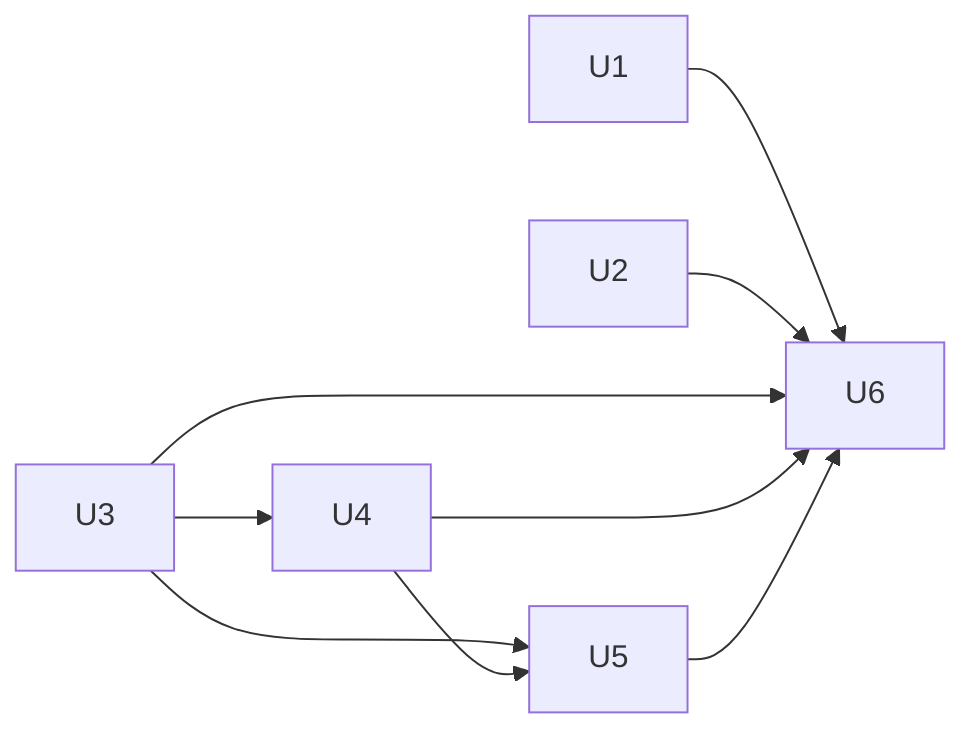

# Analysis, Trace, Stream, and Search - Plan

## Goal

Stream sources yield independent frames, alignment and minimization name the journey
they judged, and the leaves drop what nothing uses.

Stop condition: a journey difference cannot be attributed through scenario injections
and `Journey.Origin.Of`.

## Decisions

- The parent's Decisions apply. Phase 2's final commit `6a2ea03a` is an ancestor of this
  tree, and the parent's U8 `Landed:` on `main` is empty.
- `Disposition` and `Difference` stay in `analysis`. Why: both producers return them
  (`src/common/sim/device/vswitch/compare.go`, `src/common/sim/fabric/compare.go`), and
  the accepted [shape
  record](../architecture/2026-10-01-simulation-package-shape-direction.md#decision)
  keeps that shared leaf. Clarify `src/common/sim/analysis/doc.go`: producer-owned
  outcomes mean dataplane outcomes and execution stop reasons. `Scope.Compare` keeps its
  hierarchical key order. No contract promises lexical identifier or numeric-length
  order (`src/common/sim/analysis/scope.go`, `TestScopeOrderingAndRendering`).
- `fabric` owns alignment and the location of a behavioral difference. Why: it already
  selects scenario descendants and pairs injection groups
  (`src/common/sim/fabric/compare.go`, `collectScenarioJourneys`,
  `collectInjectionJourneys`). Alignment must use that pairing, including one-sided
  descendants, rather than zip the two flat reports. Protocol emissions without an
  `Origin.Of` remain represented by their final effect, as the [provenance
  solution](../solutions/architecture-patterns/comparing-two-forked-executions-attributes-observables-by-provenance.md)
  requires.
- Add `fabric.DifferenceLocation` to `Comparison`: area (`journey`, `run`, or
  `snapshot`), injection action index and UTC time, descendant lineage, subject, and
  exact field path. A journey's lineage starts at its injection and records each
  `Origin.Kind`, mirror name, and occurrence within that parent's same kind/name
  children. Raw frame IDs resolve ancestry within one side only. Non-journey locations
  have no injection or lineage. Why: `Difference` labels such as `journey terminal` and
  `final state` name multiple mismatches and lose their subjects.
- `fabric.Align(Comparison) (Alignment, bool)` returns the behavioral location plus an
  optional causal trace location containing the injection, lineage, side report indices,
  and entry index. `Different` always returns true, including run and snapshot
  differences without a differing trace. `Equivalent` returns false. `Inconclusive` can
  return a diagnostic trace location without asserting a behavioral difference. Why:
  both comparison implementations separate diagnostic facts from behavior.
- A search `Candidate` holds `Tuple` and `Actions []fabric.Action`. Candidates accept
  only injection and fault actions. Delete `FaultSpec`, `TimedFault`, and `L3Domain`.
  Why: `fabric.Action` already carries time, a fault payload, cloning, and
  declaration-order indices (`src/common/sim/fabric/scenario.go`). `Domain` has two
  implementations, while `L3Domain` has none. Number candidate actions once and preserve
  indices during reduction. The `(At, Index)` pair is the stable injection identity,
  matching `src/common/sim/fabric/scenario.go`, `Scenario.Validate`.
- Minimization preserves the initial `DifferenceLocation` and all three `Difference`
  values. It returns `Minimization` with the reduced candidate, minimality, original
  target, and difference, plus an error return. Why: matching the observable label alone
  can replace one injection's failure with another's
  (`src/common/sim/search/minimize.go`). A removal cannot erase the target injection.
  Run and snapshot targets explicitly name no journey. Amend the existing direction
  record with this contract.
- Limits require `Budget > 0`, `MaxCandidates >= 0`, and `MaxDifferences >= -1`. Zero
  candidates means enumerate the whole domain. Zero retained differences means counts
  only, and `-1` means unlimited. `Search` returns `(Result, error)` for invalid limits
  before enumeration. Candidate comparison errors increment `Result.Errors`, retain only
  the first error and its tuple in `Result.Err`, and do not increment
  `InconclusiveCount`. Why: errors are input failures, separate from honest partial
  results, and discarded candidates keep bounded summary data.
- Fault times canonicalize with `Round(0).UTC()` and deduplicate as `time.Time`. Why: Go
  1.27.1's `$(go env GOROOT)/src/time/time.go` documents undefined `UnixNano` results
  outside 1678 through 2262, including zero time. `Round(0)` strips monotonic readings
  and `UTC` normalizes location. Domain validation rejects zero timestamps, matching
  `fabric.Action.Validate`.
- Both tuple formats and source-MAC hashing use `fabric.Endpoint.Canonical`. Why: it
  already escapes delimiters (`src/common/sim/fabric/config.go`) and distinguishes
  `{"a/b", "c"}` from `{"a", "b/c"}`. This removes duplicate endpoint renderers without
  another exported helper.
- A spec source returns `Spec.Start + spacing`, relative to its consumer epoch. Why:
  `src/edge/simload/cmd/simload/main.go` parses a flow start but no consumer reads it,
  and the lab uses one delayed schedule in two consumers. Validate nonnegative start and
  the last offset including it. `StreamAttachment.Start` adds an independent attachment
  delay. The existing proposed [offered-load
  record](../architecture/2026-09-18-offered-load-streams-direction.md) is updated with
  this contract, retaining its proposed status.
- Errors follow the [errs
  convention](../solutions/architecture-patterns/errs-package-architecture-and-error-conventions.md).

## Requirements

R1. Every inventory entry has failing-first evidence or a struck reason.

R2. Yielded frames share no mutable tags or payload with the spec, another yield, or a
cloned cursor. Example: mutate the first frame's VID and payload. Both cursors' next
frames retain the template values.

R3. Every `Different` has a location. Example: injection 2's extra mirror aligns to
injection 2 and its lineage. A snapshot-only difference names its device and field
without a journey.

R4. Search accounts for every candidate. Example: one equivalent, one different, one
inconclusive, and one invalid injection produce `Tested == EquivalentCount +
TotalDifferences + InconclusiveCount + Errors == 4`. `Tested + len(Remainder) == Total`
also holds after a candidate limit.

R5. Minimization preserves its target through action removal and ordinal changes.
Example: injections and snapshot fields with equal labels and displayed values cannot
exchange identity. Removing an earlier equivalent injection preserves the target's
action index.

R6. Invalid inputs fail before enumeration. Example: budget zero tests no candidates.
Valid `MaxDifferences: 0` counts differences without replay data.

R7. Leaf contracts and examples agree with their consumers. Example:
`AssumptionsFor(port)` includes ancestors and descendants, excludes siblings, and
returns independent evidence slices.

## Out of scope

- Protocol state-machine changes, new wire codecs, routed traffic domains, device or
  medium seams, and general fabric queue or fork fixes.
- Search reads scenarios constructed by FlowSeer's Go callers. Their shape is validated.
  These are trusted authors, with no hostile serialized input.
- New observables, fingerprints, or attribution of unlinked protocol emissions. Existing
  behavioral comparisons and `EntryQueueThreshold` exclusion govern.
- Live-device writes or a lab run. Source and caller changes have local tests.

## Units

### U1. Metadata and trace leaves
Files: src/common/sim/analysis/metadata.go, src/common/sim/analysis/doc.go, src/common/sim/analysis/analysis_test.go, src/common/sim/analysis/metadata_internal_test.go, src/common/sim/netmodel/trust_test.go, src/common/sim/trace/trace_test.go
After: none
Change: `Metadata.AssumptionsFor` returns canonical independent assumptions whose scopes
overlap the requested scope. The two port-assumption tests use it while retaining their
statement and exact-scope predicates. The package comment distinguishes dataplane
outcomes from shared verdicts. Tests: ancestor, child, sibling, whole, and empty
matches, then mutation of returned evidence. `src/common/sim/trace/trace_test.go` pins
`Held == "Held"` and `OpQueue == "queue"`.
Verify: `.claude/skills/verify-change/scripts/verify-change.sh -- src/common/sim/analysis src/common/sim/trace src/common/sim/netmodel/trust_test.go`

### U2. Independent source frames and variation validation
Files: src/common/sim/stream/source.go, src/common/sim/stream/stream.go, src/common/sim/stream/variation.go, src/common/sim/stream/capture.go, src/common/sim/stream/source_test.go, src/common/sim/stream/stream_test.go, src/common/sim/stream/variation_test.go, src/common/sim/stream/variation_internal_test.go, src/common/sim/fabric/attach_test.go, src/edge/simload/cmd/simload/main_test.go, src/edge/simload/test/integration/lab_test.go
After: none
Change: each spec-source yield clones tags and payload before applying variations,
through a private frame-copy helper shared with capture sources. The source includes
`Spec.Start`, with start and offset-overflow validation. The lab removes `offsetSource`
and sets the delayed spec's start instead. Close `Variation` through private `apply`,
removing its unreachable custom variation guard and test double. State monotonic
offsets, independent frames, and encodable frames on `Source`. Validation checks every
size against the IP packet length when any UDP variation is present, in either
declaration order, including pointer forms. A size may add Ethernet padding but cannot
truncate that packet. Tests: mutate two yields and a cloned cursor for no, MAC, size,
and UDP variations. A retained fabric journey remains independent of the template.
Update `TestFrameRateOffsets`: a 10 fps source starting at 1 s yields 1 s and 1.1 s,
including after cloning. Negative start and last-offset overflow fail. Move the direct
apply half of `TestUDPPortVariationRejectsShortUDPDatagram` into the internal test file.
`main_test.go` pins the first transmit deadline at epoch plus 1 h for a document with
`start: "1h"`. The tagged interleaving test yields 0, 1, 2, 3 ms without the wrapper. In
`stream_test.go`, one otherwise-valid UDP template with sizes one octet below and
exactly at its encoded packet size tests both orders. The below-size case is the sole
refusal reason, as the [refusal
solution](../solutions/conventions/a-refusal-test-needs-an-input-only-the-refusal-rejects.md)
requires. Successful yields decode with unchanged IP and UDP lengths. Remove
`TestUDPPortVariationRejectsEarlierCustomVariation`: its input is a package-only test
double outside the closed variation set. Keep capture isolation coverage.
Verify: `.claude/skills/verify-change/scripts/verify-change.sh -- src/common/sim/stream src/common/sim/fabric/attach_test.go src/edge/simload/cmd/simload/main_test.go src/edge/simload/test/integration/lab_test.go`

### U3. Comparison locations and fabric alignment
Files: src/common/sim/fabric/compare.go, src/common/sim/fabric/comparison_location.go, src/common/sim/fabric/compare_journey.go, src/common/sim/fabric/compare_state.go, src/common/sim/fabric/align.go, src/common/sim/fabric/align_test.go, src/common/sim/fabric/compare_test.go, src/common/sim/fabric/compare_internal_test.go, src/common/sim/search/align.go, src/common/sim/search/align_test.go
After: none
Change: the existing behavioral walk supplies a location for every differing branch,
including exact entry, delivery, hop-result, run, and snapshot fields. Split the journey
and snapshot walks from `compare.go`. Move alignment into `fabric`, remove the old
search API, and share injection/ancestry pairing with comparison. Trace indices address
original entries. Behavioral paths skip queue diagnostics. Tests: migrate both alignment
cases without importing `search` into fabric. Add two roots with a difference only on
the second, extra mirror and release descendants, nested mirrors, divergent prior frame
IDs, equal traces with different terminal states or deliveries, run-only and
snapshot-only changes, and equivalent and inconclusive results. Pin each branch's
expected location and assert the disposition before alignment.
Verify: `.claude/skills/verify-change/scripts/verify-change.sh -- src/common/sim/fabric src/common/sim/search/align.go src/common/sim/search/align_test.go`

### U4. Validated domains and complete search accounting
Files: src/common/sim/search/domain.go, src/common/sim/search/fault.go, src/common/sim/search/l2.go, src/common/sim/search/search.go, src/common/sim/search/result.go, src/common/sim/search/minimize.go, src/common/sim/search/domain_test.go, src/common/sim/search/fault_test.go, src/common/sim/search/l2_test.go, src/common/sim/search/search_test.go, src/common/sim/search/result_test.go, src/common/sim/search/conformance_test.go, src/common/sim/search/minimize_test.go, src/common/sim/fabric/scenario.go, src/common/sim/fabric/scenario_test.go, src/common/sim/fabric/compare.go
After: U3
Change: `Action.Clone` deep-copies injection frames, packets, and fault sequences.
Comparison reuses that copy instead of its extra copying pass. Candidates preserve
indices and injection-before-fault order at tied times. L2 zero `At` keeps the existing
default epoch. Base traffic is validated as injection actions. Remove duplicate fault
types, the routed interface, and alignment from the package comment. Config `Validate`
methods reject empty source node names, VLANs above 4094, invalid fault actions, zero
action times, and cross-product sizes that overflow `int`. Empty dimensions remain valid
empty domains. Both constructors return `(domain, error)` after validation.
`FaultAction.Validate` also applies the existing `validateFault` rule. Canonicalize
times, use the shared endpoint encoding, and hash that encoding. `Limits.Validate` and
`Search` implement the accounting and retention decision. Adapt minimizer action
traversal and all existing callers to these API shapes, keeping its target rule until
U5. Tests: keep `TestCandidateCloneIsolation` and add action-clone mutations for tags,
payload, packet payload, and loss sequences. Reject one malformed dimension at a time.
Pin empty domains, deduplication, and duplicate `(At, Index)` rejection. Test times
outside the UnixNano range and equal instants in two zones, with literal UTC tuples.
`{"a/b", "c"}` and `{"a", "b/c"}` yield distinct tuples and source MACs. Four candidates
exercise all counters, preserve the first wrapped error, and continue after it. Zero
retention and `-1` unlimited retention are distinct. Keep
`TestTimedFaultDomainBehavioralTime`, the non-consuming checks, and exact remainder
tests, as the [search-dimension
solution](../solutions/conventions/a-search-dimension-with-no-behavioral-effect-is-dishonest-coverage.md)
requires. Tests reading retained differences use `MaxDifferences: -1`, including
`TestConformanceSearchCoverageAccounting` and `TestTimedFaultDomainBehavioralTime`. The
conformance case asserts nonempty retention before comparing evaluation orders. The
uncabled-pair case expects `Errors: 1`, zero inconclusive results, and an inspectable
error. Pin injection-before-fault behavior at equal times.
Verify: `.claude/skills/verify-change/scripts/verify-change.sh -- src/common/sim/search src/common/sim/fabric/scenario.go src/common/sim/fabric/scenario_test.go src/common/sim/fabric/compare.go`

### U5. Exact counterexample targets
Files: src/common/sim/search/minimize.go, src/common/sim/search/minimize_test.go, src/common/sim/search/conformance_test.go
After: U3, U4
Change: normalize and number actions once, select the initial comparison's location and
difference, and retain them across every injection-then-fault reduction trial. Invalid
budget, negative trial limit, comparison errors, and an initial non-difference return
errors. Zero trial limit uses the existing 64-trial default. Allow an empty trial when a
global difference survives. Each accepted trial is `Different` with the same target and
values. Return the named target even on `LimitReached`, with an independent candidate
and a tuple computed from the retained actions. Tests: two injections with the same
label and values cannot exchange identity. Removing an earlier equivalent injection
preserves a later target's index. Duplicate injections at one timestamp and reused
indices at different times remain distinct. Mirror lineages, run targets, and two
snapshot fields with identical displayed labels retain the right target. Keep
fixed-point and limit tests, replay each returned candidate, and assert both target and
difference. Errors never report `Minimal`.
Verify: `.claude/skills/verify-change/scripts/verify-change.sh -- src/common/sim/search/minimize.go src/common/sim/search/minimize_test.go src/common/sim/search/conformance_test.go`

### U6. Contract documentation and phase closure
Files: src/common/sim/README.md, src/common/sim/analysis/README.md, src/common/sim/trace/README.md, src/common/sim/stream/README.md, src/common/sim/search/README.md, src/common/sim/fabric/README.md, docs/architecture/2026-09-10-virtual-device-direction.md, docs/architecture/2026-09-18-offered-load-streams-direction.md, docs/architecture/2026-09-10-network-simulation-prior-art-research.md, docs/solutions/conventions/a-search-dimension-with-no-behavioral-effect-is-dishonest-coverage.md, docs/plans/2026-10-01-2200-refactor-sim-package-overhaul-phase12-plan.md, docs/plans/2026-10-01-2200-refactor-sim-package-overhaul-phase8-plan.md
After: U1, U2, U3, U4, U5
Change: README examples and prior-art API references use the final errors, candidate
actions, limits, minimization result, and `fabric.Align`. The analysis example uses
`errors.New` as `example_test.go` does. Amend the virtual-device record's Decision
package list, Consequences, bounded-search, and comparison sections for locations, exact
targets, counts-only retention, and removed `L3Domain`, preserving its proposed status.
Update source-start wording in the proposed offered-load record. Refresh the
search-dimension solution's removed `TimedFault.At` references. Strike phase 12's
minimum-payload API expectation because per-frame preflight remains necessary. Resolve
the inventory and record the outcome under the title. Tests: examples and consumer
suites pass. Check old names and tuple tokens in tests and `testdata/`. No golden holds
these tuples. Run the prose checker on every changed doc.
Verify: `.claude/skills/verify-change/scripts/verify-change.sh -- src/common/sim/README.md src/common/sim/analysis/README.md src/common/sim/trace/README.md src/common/sim/stream/README.md src/common/sim/search/README.md src/common/sim/fabric/README.md docs/architecture/2026-09-10-virtual-device-direction.md docs/architecture/2026-09-18-offered-load-streams-direction.md docs/architecture/2026-09-10-network-simulation-prior-art-research.md docs/solutions/conventions/a-search-dimension-with-no-behavioral-effect-is-dishonest-coverage.md docs/plans/2026-10-01-2200-refactor-sim-package-overhaul-phase12-plan.md docs/plans/2026-10-01-2200-refactor-sim-package-overhaul-phase8-plan.md`

Waves: U1 U2 U3 | U4 | U5 | U6



## Inventory

Original entry numbers are preserved. A struck claim has no behavior fix, and its reason
is the closure. Assigned claims get failing-first tests.

### Correctness

| Entry | Current evidence and disposition | Unit |
| --- | --- | --- |
| 1. Shared source frame | `src/common/sim/stream/source.go`, `Next`, copies the template value but not tags or payload. Mutation and cloned-cursor regression. | U2 |
| 2. Scope terminator order | ~~Identifier lexical order is wrong.~~ `Scope.Compare` promises canonical hierarchy, and no caller promises identifier order. Preserve identity, containment, and determinism (`src/common/sim/analysis/scope.go`, `src/common/sim/analysis/analysis_test.go`). | U1 |
| 3. Decimal field-length order | ~~Length order is wrong.~~ Field paths preserve boundaries, including empty elements. Decimal encoding still supplies a total order. No numeric-length ordering contract exists (`FieldScope`, `TestFieldScopePreservesPathIdentityAndContainment`). | U1 |
| 4. Extra journey omitted | `src/common/sim/search/align.go` visits only the common slice prefix. Compare an extra descendant and report its lineage and absent side. | U3 |
| 5. UDP/size order | `src/common/sim/stream/stream.go`, `Validate`, checks `minEarlierSize` only when encountering UDP. Validate both orders against the complete encoded IP packet. | U2 |
| 6. Different target accepted | `src/common/sim/search/minimize.go` checks `Difference.Observable` alone. Pin initial action identity, lineage, field, and values. | U5 |
| 7. Time identity/rendering | `src/common/sim/search/fault.go` deduplicates with `UnixNano` and renders the supplied zone. Use full UTC time identity. Source: Go 1.27.1 time docs cited in Decisions. | U4 |
| 8. Journey index absent | `Align` returns only an entry index. Return a location with injection and lineage, plus side report indices. | U3 |
| 9. Trace ordering | ~~Fact slices must compare lexically.~~ `compareStep` is already private after phase 2, and `EqualStep` consumes only equality. Length-first facts and lexical evidence give deterministic equality (`src/common/sim/trace/trace.go`, `src/common/sim/trace/trace_test.go`). | U1 |
| 10. Comparison error lost | `src/common/sim/search/search.go` ignores `Comparison.Err` and counts it as inconclusive. Preserve the first error and count errors separately. | U4 |
| 11. Endpoint hash collision | `defaultSourceMAC` hashes slash-joined components. Hash `Endpoint.Canonical` and pin delimiter-bearing endpoints. | U4 |

### Completeness and design

| Entry | Disposition | Unit |
| --- | --- | --- |
| `AssumptionsFor` absent | Add overlap filtering and independent evidence (`src/common/sim/analysis/metadata.go`). Replace the two scoped filters in `src/common/sim/netmodel/trust_test.go`. | U1 |
| Limits and domain validation absent | Add explicit validation and error-returning constructors and search. | U4 |
| Zero retention cannot mean counts only | Zero stores no counterexamples, `-1` is unlimited. | U4 |
| Vocabulary misses queue and held | ~~Change vocabulary values.~~ Both literals already match their declarations. Add assertions for coverage, with no failing-first behavior run. | U1 |
| Analysis example differs | ~~Change example behavior.~~ This is a prose mismatch. Align the README with `src/common/sim/analysis/example_test.go`, without a failing-first behavior run. | U6 |
| Disposition placement | ~~Move to a comparison leaf.~~ Both comparison producers return `analysis.Disposition`, and the accepted shape record keeps that shared leaf. The virtual-device record remains proposed. Clarify the package comment. | U1 |
| Fault structs repeat fabric | Use `fabric.Action` and `fabric.FaultAction`. | U4 |
| Alignment has no search dependency | Move to `fabric` with its comparison pairing. Amend the record. | U3, U6 |
| Concrete exported generator | ~~Hide `SplitMix64`.~~ Phase 2 already uses private `splitMix64` in `Variation.Apply` (`src/common/sim/stream/variation.go`, `src/common/sim/stream/splitmix.go`). | Closed |
| Source offset | `Spec.Start` is parsed but unread. Include it in `Next` and remove the lab wrapper (`src/edge/simload/cmd/simload/main.go`, `src/edge/simload/run.go`, lab test). | U2 |
| Minimum payload | ~~Add source metadata.~~ `src/edge/simload/run.go`, `preflightSources`, checks every frame's signature space and encoding before sockets open. A minimum alone cannot replace that check. Keep it. Strike phase 12's API expectation in U6 before this plan is retired. | Closed |
| Generator surface residues | Private `apply` removes an exported method with an inaccessible generator argument. Remove the custom-variation guard and its test double, since the external variation set is closed (`src/common/sim/stream/variation.go`). | U2 |
| Endpoint rendering differs | Both tuple renderers reuse `Endpoint.Canonical`. | U4 |

### Tests

| Entry | Disposition | Unit |
| --- | --- | --- |
| No yielded-frame mutation | Add spec-source mutation cases beside the existing capture isolation test. | U2 |
| Alignment has one journey | Add multiple roots and descendant groups to fabric alignment tests. | U3 |
| Empty L3 conformance struct | Delete `dummyL3Domain` and its assertion with the unused interface. Keep both concrete `Domain` assertions. | U4 |
| Returns after `t.Fatal` | ~~Remove the returns.~~ Both functions return values (`src/common/sim/fact_contract_test.go`, `firstAddedFactChange`, `firstRemovedFact`). Go 1.27.1 requires a fallthrough return (`$(go env GOROOT)/src/cmd/compile/internal/types2/stmt.go`, `funcBody`, and `return.go`, `isTerminating`). Retain them. | Closed |

## Verification

```bash
go test -race ./src/common/sim/analysis ./src/common/sim/trace ./src/common/sim/stream ./src/common/sim/search ./src/common/sim/fabric ./src/common/sim/netmodel ./src/common/sim/internal/simtest ./src/edge/simload/...
python3 .claude/skills/prose/scripts/check-prose.py src/common/sim/README.md src/common/sim/analysis/README.md src/common/sim/trace/README.md src/common/sim/stream/README.md src/common/sim/search/README.md src/common/sim/fabric/README.md docs/architecture/2026-09-10-virtual-device-direction.md docs/architecture/2026-09-18-offered-load-streams-direction.md docs/architecture/2026-09-10-network-simulation-prior-art-research.md docs/solutions/conventions/a-search-dimension-with-no-behavioral-effect-is-dishonest-coverage.md docs/plans/2026-10-01-2200-refactor-sim-package-overhaul-phase12-plan.md docs/plans/2026-10-01-2200-refactor-sim-package-overhaul-phase8-plan.md
go test -tags simload_lab -run 'TestInterleaved|TestOneSwitchFabric|TestLabConfig' ./src/edge/simload/test/integration
```

Verify the union of changed paths, without `--full` or all of `generated/go/yang`.
Documentation-only re-planning runs:

```bash
.claude/skills/verify-change/scripts/verify-change.sh -- docs/plans/2026-10-01-2200-refactor-sim-package-overhaul-phase8-plan.md
```

## Definition of done

- [ ] Parent U8 is satisfied, including exact journey targets.
- [ ] Every inventory entry has failing-first evidence or a struck reason.
- [ ] Every changed path has a green verifier receipt.
- [ ] README examples and the amended direction record match the APIs.
- [ ] This plan reads `implemented` with an outcome note under its title.
- [ ] No plan labels or unused interfaces enter code.

## Open questions

None.
