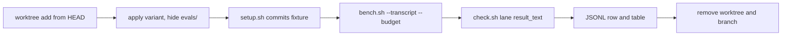

# Workflow Skill Evaluations - Plan

## Goal

`steer` can measure whether a FlowSeer workflow skill, or an edit to one,
helps. One command runs a skill's scenarios headless in throwaway
worktrees under up to three variants (the skill as edited, the skill at a
ref, no skill), grades each lane with mechanical checks, and prints
passes, cost, and whether the skill fired. The means: a runner in
`steer/scripts/` that reuses `tune`'s `bench.sh`, three scenarios each for
`plan` and `review`, and a `steer` step that runs them before a skill
grows.

**Stop condition:** a hidden skill still appears in a lane's `init` event,
or a headless lane cannot finish a scenario without a person.

## Decisions

- Measure the skills, not the models. `tune` ranks models on fixed tasks
  (`.claude/skills/tune/references/calibration.md`), and `steer` edits
  skills (`.claude/skills/steer/SKILL.md`, step 4) with no measure of
  whether an edit helps. Why: Anthropic's
  [skill authoring best practices](https://platform.claude.com/docs/en/agents-and-tools/agent-skills/best-practices),
  "Build evaluations first", asks for three scenarios, a baseline
  "without the Skill", and to "compare against baseline", and its testing
  checklist asks for "at least three evaluations". `docs/agent-steering.md`
  ("Project skills", "Research basis") cites
  [SWE-Skills-Bench](https://arxiv.org/abs/2603.15401), whose abstract
  reports zero pass-rate gain for 39 of 49 public skills and token
  overhead up to 451%.
- Scenarios live beside their skill, at
  `.agents/skills/<skill>/evals/<scenario>/`. Why: a skill edit and its
  scenarios change in one diff, and git tracks the `.agents/skills`
  spelling (`docs/solutions/conventions/a-gate-selected-by-name-stops-running-silently.md`,
  "A symlinked skill directory can disappear from targeted verification").
  The runner hides every `evals/` from the lane, as calibration keeps its
  accept files from the candidate.
- A scenario is `scenario.json`, an optional `setup.sh`, and `check.sh`.
  `scenario.json` mirrors Anthropic's evaluation structure: `skill`,
  `query`, `budget_usd`, `expected_behavior` (one sentence per check).
  The runner replaces `{EVAL_PARENT}` in `query` with the fixture commit's
  parent. `setup.sh` runs in the lane and commits the fixture.
  `check.sh <lane> <result-text>` prints one `PASS <name>` or
  `FAIL <name>` per check, with `EVAL_BASE` set to the fixture commit. Why:
  JSON needs no PyYAML, which no skill script imports, and calibration
  scores `PASS`/`FAIL` lines as partial credit ("Acceptance tests").
- Grade mechanically, never with a judge model. A check reads files on
  disk, frontmatter fields, `$(git rev-parse --git-dir)/flowseer-checkpoints`,
  the changed paths, `check-prose.py` or `plan-queue.py` output, or a grep
  of the final report for a path and symbol. Changed paths are `git diff
  --name-only $EVAL_BASE` plus untracked files, since a lane may leave its
  work uncommitted. No check runs `verify-change.sh`, for the cost
  `calibration.md` gives. Why: a judge model shares the beliefs of the
  model it grades, which `AGENTS.md` (Investigation discipline) rules out.
- Three variants on one lane base. `current` copies the skill directory
  from the runner's own checkout, uncommitted edits included. `ref:<rev>`
  takes it from `git archive <rev>`. `none` hides it. `AGENTS.md`, the
  other skills, the hooks, and user-level skills and plugins stay as they
  are. Why: `current` against `ref:HEAD` measures an edit, `none` is the
  Anthropic baseline, and hiding one skill isolates it.
- Lanes keep the hooks, so a seeded defect is one no hook reports, since
  `tools/hooks/stop-check.sh` hands every `test/conformance/` finding to
  the model. A lane branches from the runner checkout's `HEAD`, since the
  skills call scripts that move with the tree. A failing `setup.sh` is
  `stale`.
- The query never names the skill, is identical across variants, and ends
  with "Do not ask questions. Where you would ask, state the question and
  its options, then stop." Why: Vercel's eval (`docs/agent-steering.md`,
  "Research basis") found skills never invoked in 56% of cases, so the
  runner records whether the skill fired.
- `bench.sh` gains `--transcript` and `--budget`. `--transcript` runs
  claude with `--output-format stream-json --verbose` and reads the
  `result` event, which carries `result`, `usage`, `modelUsage`,
  `total_cost_usd`, `stop_reason`, and `permission_denials`. It adds
  `result_text`, `skills_listed` from the `init` event's `skills`, and
  `skills_invoked` from each `Skill` tool use's `input.skill`. Claude Code
  2.1.287 headless output shows these shapes: a Haiku lane told to load
  `prose` emitted a `Skill` tool use with input `{"skill": "prose"}`.
  `--budget` passes `--max-budget-usd`, which `claude --help` documents
  for `--print` only. Why: one parser for usage, refusal, and downgrade.
  `calibration.md` ("Refusal and downgrade") names a nonempty
  `permission_denials` as a refusal, which `bench.sh` never checks. U1
  adds it on both Claude paths, exempting `AskUserQuestion`, which a
  headless lane may be denied for asking (unverified).
- A `none` lane is valid only when `skills_listed` lacks the hidden skill.
  `delegate` is `user-invocable: false` and never appears there, so for
  such a skill the runner checks the lane's filesystem. Why: an ablation
  that leaves the skill loadable measures nothing.
- Each lane exports `FLOWSEER_RUNLOG` to a lane-local file. Why: `review`
  logs every reviewer through `runlog.py` (`review/SKILL.md`, step 5),
  whose default `~/.claude/models/runs.jsonl` feeds `tune`'s reviewer
  ranking (`tune/scripts/field.py`), and eval lanes would skew it.
- First scenarios cover `plan` (files the scripts parse) and `review` (a
  report and a checkpoint verdict). Cost bounds: `--budget` per lane from
  `budget_usd` (default 3) and `--max-total-usd` per invocation (default
  30), checked before each launch, lanes in sequence, one run per variant
  (unconfirmed, see Open questions). Why: twelve lanes is a `tune` sweep,
  and sequence leaves the pool to the person's session. Per-lane cost is
  unverified (a Haiku lane answering one word reported $0.023).
- `steer` step 4 runs `current` against `ref:HEAD` before an edit that
  adds lines to a skill with scenarios. It applies the edit when `current`
  loses no check `ref:HEAD` passed, and reruns both with `--runs 3` before
  rejecting. When `none` matches or beats `current` on every scenario,
  `steer` logs an observation proposing cuts. A skill without scenarios is
  edited as today and reported unmeasured (unconfirmed). Why: growth is
  what `docs/agent-steering.md` ("Project skills") warns against, and
  blocking the seven unmeasured workflow skills would stall the queue.
- The procedure goes in `steer/references/skill-evals.md`, not a new
  skill or a direction record. Why: `steer` is the only consumer, and
  `docs/agent-steering.md` records the skills' shape (updated in U5).
- One plan, no phases: the `After:` lines join all five units into one
  cluster under `.agents/skills/` (`plan/references/phases.md`).



## Requirements

1. `skill-eval.py --skill plan --variants current,none` prints one row per
   scenario and variant: `pass` as `k/n`, `invoked`, `cost_usd`, `wall_s`,
   and `status` (`ok`, `invalid`, `stale`, `refused`, `downgraded`,
   `skipped`). Example: three scenarios, two variants, six rows.
2. A `none` lane whose `skills_listed` holds the hidden skill is `invalid`
   and ungraded. Example: a stub whose `init` lists `plan`.
3. After setup, `git status --porcelain` is empty, `git log -1` is the
   fixture commit, and no `.agents/skills/*/evals/` exists, so a lane
   that commits with `git add -A` never sees the variant. Example: a
   `none` lane for `plan` has no `.agents/skills/plan/` and a clean status.
4. `bench.sh --transcript` writes `result_text`, `skills_listed`,
   `skills_invoked`, `usage`, and `cost_usd_reported`. Example: one
   `Skill` tool use for `prose` gives `skills_invoked: ["prose"]`.
5. No lane launches once reported cost reaches `--max-total-usd`. Example:
   `--max-total-usd 1` at $0.80 per lane runs two lanes, the rest
   `skipped`.
6. `--lint` checks every scenario: `scenario.json` has the four fields,
   `check.sh` is executable and `shellcheck` clean, and in a throwaway lane
   after `setup.sh`, with an empty result text, `check.sh` prints at least
   one `FAIL`. Example: a check that passes on an untouched lane fails.

## Out of scope

- Scenarios for `next`, `implement`, `compound`, `land`, `drive`, `steer`,
  and `delegate`, a judge model, Codex, Agy, or omp lanes (the `init` and
  `Skill` evidence is Claude's stream format), and running evaluations
  from `verify-change.sh` or a hook.
- Committed results. `steer` quotes the table in the edit's commit body.
- Input trust: `scenario.json`, `setup.sh`, and `check.sh` come from the
  repository's maintainers, who are trusted. The lane's transcript and
  tree come from a local model run and are parsed as data, never executed.

## Units

### U1. Transcript, budget, and denials in bench.sh
Files: .agents/skills/tune/scripts/bench.sh, .agents/skills/tune/scripts/test_bench.py, .agents/skills/tune/references/calibration.md
After: none
Change: `--transcript`, `--budget`, and the denial rule behave as
Decisions state. `--budget` on another CLI exits 2. Apart from the denial
rule, output without the new flags is unchanged. `calibration.md`, "Run a
lane", names the two flags.
Tests: `test_bench.py` stubs `claude` on `PATH` as it does omp. A stream
with `init`, one `Skill` tool use, and `result` gives `skills_listed`,
`skills_invoked: ["prose"]`, `result_text`, and the result's cost. The
`json` path keeps its other fields. `--budget 2` reaches the stub as
`--max-budget-usd 2`, and on omp exits 2. On both paths an
`AskUserQuestion` denial gives `refused: false`, a `Bash` denial `true`.
Verify: `.claude/skills/verify-change/scripts/verify-change.sh -- .agents/skills/tune/scripts/bench.sh .agents/skills/tune/scripts/test_bench.py .agents/skills/tune/references/calibration.md`

### U2. The skill-eval runner
Files: .agents/skills/steer/scripts/skill-eval.py, .agents/skills/steer/scripts/test_skill_eval.py
After: none
Change: `skill-eval.py --skill <name> [--scenario <s>] --variants
current,ref:<rev>,none [--runs N] [--model claude-opus-5-5]
[--max-total-usd 30] [--worktree-root <dir>] [--bench <path>] [--keep]
--out <jsonl>`. It finds its checkout from its own path, so it runs from
any directory. Per scenario, variant, and run it adds a worktree under
`--worktree-root` (default `~/Projects/worktrees/FlowSeer`) named
`eval-<skill>-<scenario>-<variant>-<n>` on branch `skill-eval/<same>`,
applies the variant and hides `evals/` (`git sparse-checkout` and
`update-index --skip-worktree` meet requirement 3), runs `setup.sh`, calls `bench.sh
--cli claude --transcript --budget` with `FLOWSEER_RUNLOG` set. It runs
`check.sh` on `result_text`, writes a JSONL row, and removes the worktree
and branch unless `--keep`. `--lint` checks requirement 6 in throwaway
lanes and prints how many scenarios it checked. The runner runs
unsandboxed, as `bench.sh` does.
Tests: `test_skill_eval.py` builds a temporary git repository with one
skill and two scenarios, points `--worktree-root` into the test's temp
directory and `--bench` at a stub. It covers requirements 1, 2, 3, and 5,
`ref:<rev>` restoring that revision's skill text, and the stub seeing
`FLOWSEER_RUNLOG`. One case runs `--lint` on the real tree and asserts its
count equals the `scenario.json` files `git ls-files --cached --others
--exclude-standard` lists, so a scenario discovery misses fails the test.
Verify: `.claude/skills/verify-change/scripts/verify-change.sh -- .agents/skills/steer/scripts/skill-eval.py .agents/skills/steer/scripts/test_skill_eval.py`

### U3. Plan scenarios
Files: .agents/skills/plan/evals/bounded-feature/, .agents/skills/plan/evals/skip-trivial/, .agents/skills/plan/evals/conflicts-direction/
After: U2
Change: `bounded-feature` asks for a plan for a small multi-file change in
one existing package. Checks: one new `docs/plans/*-plan.md` with
`artifact_contract: flowseer-plan/v1`, `status: planned`, and a template
`artifact_readiness`, a `### U1.` heading, `Files:` and `After:` under
every unit, a `Waves:` line, `check-prose.py` clean, `plan-queue.py`
listing it as `ready` or `replan` (`plan-state.py` reads parent plans
only), and every changed path under `docs/plans/`. `skip-trivial` asks to
plan a one-line wording fix in one README. Checks: no new file under
`docs/plans/`, and the changed paths include that README.
`conflicts-direction` asks to plan a new schema field carrying a link
speed as a `float` in Mbit/s, which the accepted
`docs/architecture/2026-09-25-schema-building-blocks-direction.md`
("One canonical unit per quantity") rules out in favor of `uint64` with
`_bps`. Checks: the plan names that record, and either a unit's `Files:`
names it, `artifact_readiness` is `needs-decisions`, or the plan's field
ends in `_bps`.
Tests: `skill-eval.py --lint` reports the three, each with a `FAIL` on an
untouched lane.
Verify: `.claude/skills/verify-change/scripts/verify-change.sh -- .agents/skills/plan/evals`

### U4. Review scenarios
Files: .agents/skills/review/evals/merge-deadlock/, .agents/skills/review/evals/weakened-test/, .agents/skills/review/evals/branch-verdict/
After: U2
Change: each `setup.sh` applies a patch and commits it, and each query
asks for a review of this branch's work since `{EVAL_PARENT}`.
`merge-deadlock` re-seeds calibration's known review bug (`calibration.md`,
"The review task") by removing the `stopForwarders` channel from
`src/common/pump/merge.go`, so a forwarder blocked on its source's
`Data()` never exits. Checks: the report names `merge.go` and `Data()` or
`Wait`, and no tracked file changed, since review is report-only.
`weakened-test` commits a change described as a refactor that deletes an
assertion from a test in `src/common/pump/pump_test.go`. Checks: the
report names that file and test function, and no tracked file changed.
`branch-verdict` commits a change with an off-by-one against its commit
message. Checks: the checkpoint file holds a `review` line whose verdict
is not `accept`, and no tracked file changed. None of the three defects is
one a conformance gate reports.
Tests: `skill-eval.py --lint` reports the three. Before committing
`merge-deadlock`, apply its patch in a scratch worktree and run
`merge_accept_test.go.txt` as `calibration.md` "Acceptance tests" shows.
`TestMergeAcceptSourceErrorPropagates` must fail, proving the bug real.
No test re-checks this after landing, so the commit message names it.
Verify: `.claude/skills/verify-change/scripts/verify-change.sh -- .agents/skills/review/evals`

### U5. Steer runs the evaluation
Files: .agents/skills/steer/SKILL.md, .agents/skills/steer/references/skill-evals.md, docs/agent-steering.md
After: U1 U2 U3
Change: `steer` step 4 gains one sentence: before an edit that adds lines
to a skill with an `evals/` directory, load `references/skill-evals.md`.
The reference holds the runner command with an absolute script path, the
Decisions' apply, rerun, and cut rules and cost defaults, the scenario
layout, and how to write a check that fails on an untouched lane.
`docs/agent-steering.md`, "Project skills", gains a paragraph on measuring
skill edits, citing the two sources already in "Research basis".
Tests: steer step 4 runs each embedded command once from the scratchpad:
`skill-eval.py --lint`, and one live `--skill plan --scenario skip-trivial
--variants current,none` pair whose table goes in the commit body.
Verify: `.claude/skills/verify-change/scripts/verify-change.sh -- .agents/skills/steer/SKILL.md .agents/skills/steer/references/skill-evals.md docs/agent-steering.md`

Waves: U1 U2 | U3 U4 | U5

## Verification

```bash
python3 .agents/skills/steer/scripts/skill-eval.py --lint
python3 .agents/skills/steer/scripts/skill-eval.py --skill plan --variants current,none --out "$TMPDIR/plan-eval.jsonl"
python3 .agents/skills/steer/scripts/skill-eval.py --skill review --variants current,none --out "$TMPDIR/review-eval.jsonl"
```

The live runs (unsandboxed, twelve lanes) go in U5's commit body.

## Definition of done

- [ ] Verifier green for every changed path, docs updated in the change.
- [ ] This plan's `status` set with an outcome note under its title.
- [ ] No plan labels in code, scenario files, or commit messages.

## Open questions

- Unconfirmed: may `steer` grow a skill without scenarios? (a) Yes,
  reported unmeasured. Recommended, since seven of the nine workflow
  skills have none. (b) Only after three scenarios exist, which follows
  "Build evaluations first" strictly but costs a scenario set per edit.
- Unconfirmed: lane models. (a) `claude-opus-5-5` only. Recommended, as
  twelve lanes per pair. (b) Also Sonnet and Haiku, per "Test with all
  models you plan to use", at three times the cost. That workflow
  sessions run only on Opus is unverified.
- Unconfirmed: runs per variant. (a) One, three before a rejection.
  Recommended, since a wrong rejection costs most. (b) Three always,
  triple the cost, with a variance figure on every edit.
- Unverified, shown by the first live runs: the `result` subtype when
  `--max-budget-usd` stops a lane, whether a headless lane is denied
  `AskUserQuestion`, whether review lanes dispatch subagents within the
  budget, and whether a review lane on a branch with an open plan writes
  its verdict there instead of the checkpoint file.
