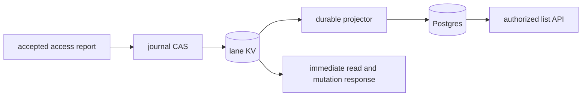

# Current State and the Postgres Read Model - Plan

## Goal

An operator lists and filters the last complete observation of each managed
interface from Postgres, while reads and mutation decisions use authoritative
KV. A replayable Service Module projects the lane bucket into tenant-scoped
tables on a separate Postgres deployment.

Stop condition: if this phase must discover unmanaged interfaces or publish
full device inventory, the source scope below is insufficient.

## Decisions

- First source: `DeviceLaneRecord.last_observations`, restricted
  to complete observations of managed interfaces. Why:
  `journal.keepLastObservation` already persists these in KV, whereas
  `IngestRecord` carries only syslog and `localnet/collect` has no ingestion
  producer. A list of these observations is not an interface inventory
  (decided by the user, 2026-10-08).
- The [parent plan](2026-10-02-2331-feat-central-ingestion-pipeline-plan.md)
  keeps its KV and disposable-read-model decisions. Implementation amends
  the [ingestion direction](../architecture/2026-10-02-central-ingestion-pipeline-direction.md)
  to name access reports as the first state source. Why: projecting an
  existing KV source needs neither a second authoritative bucket nor a new
  edge ingestion path.
- The [accepted Postgres direction](../architecture/2026-10-08-postgres-read-model-direction.md)
  defines separate deployment and shared tables with enforced tenant row
  policies. Why: these choices constrain stores and APIs beyond this phase
  (decided by the user, 2026-10-08).
- Current observations carry the accepted operation sequence beside their
  `InterfaceObservation`. Only a newer sequence advances it, and equal
  sequences require equal data. Why: `Journal.CloseRead` rejects superseded
  read entries, but `keepLastObservation` otherwise assigns without ordering
  against a newer mutation result. This orders accepted operations, not
  edge clocks.
- The protobuf map value becomes a store-owned observation wrapper. Why:
  the lane assigns sequences, while observations remain reusable across
  boundaries. Regenerate bindings without a compatibility shim.
- SQL commits a device checkpoint and its whole observation set together.
  It compares KV revision independently of operation sequence. Why: a lane
  revision can remove entries or change unrelated state. Removing a row
  must not let an older delivery restore it.
- `pgx/v5` v5.11.0 supplies the driver and pool. Why: its pinned
  [source](https://github.com/jackc/pgx/tree/v5.11.0) provides transactions
  and pooling. Its [changelog](https://github.com/jackc/pgx/blob/v5.11.0/CHANGELOG.md)
  dates release September 7, 2026, beyond the proposed 14-day cooldown.
  The importing unit still reviews the archive, hash, origin, and
  transitive dependencies and creates a
  [dependency statement](../dependencies/README.md). No dependency
  approval is granted by this plan.
- Embedded numbered migrations run in an administrative command. Runtime
  receives only writer and reader credentials. Why: ordinary clients
  must be unable to disable row policies or alter schema.
- Tenant-data tables and checkpoints use `tenant_id text NOT NULL`, included
  in every key. Why: `tenant.Validate` also admits `default`, which UUID-only
  SQL tenancy would reject. Migration and generation metadata contain no
  domain rows.
- Data transactions set tenant context locally and explicitly commit or
  roll back. Why: PostgreSQL 17's
  [configuration functions](https://www.postgresql.org/docs/17/functions-admin.html#FUNCTIONS-ADMIN-SET)
  bound local settings to a transaction, while pgx's
  [Pool.BeginTx](https://github.com/jackc/pgx/blob/v5.11.0/pgxpool/pool.go)
  does not roll back on context cancellation.
- The five units stay in one connected cluster. Why: the projector consumes
  the source contract and SQL store, and the host imports them. SQL and
  source work can start independently.

## Requirements

1. Complete managed-interface reads and mutation results persist with
   their operation sequence. Example: mutation 12 records `uplink`, then
   delayed read 11 closes without replacing it. Partial results and
   unmanaged reads create no retained current row.
2. Projection derives tenant and device from `journal.SplitLaneKey` and
   checks device refs and observation map names. Example: a mismatched
   device ref causes a corruption error, no SQL write, and no Ack. The
   module stops for repair rather than discarding malformed internal state.
3. SQL matches each source record's retained observation set after catch-up.
   Example: a newer record removing one interface deletes its SQL row
   while preserving other devices and tenants. Its device checkpoint
   remains after the last interface disappears.
4. SQL commits before Ack. Example: commit succeeds and Ack fails, then
   redelivery changes nothing. Revision 10 after 11 restores no removed
   row. Revisions and operation sequences use `numeric(20,0)`, constrained
   to 0..18446744073709551615, without an int64 conversion.
5. RLS constrains both runtime roles, even when an application predicate
   is omitted. Example: A cannot SELECT or INSERT a row for B. Missing
   context matches no row. One-connection pool reuse after cancellation
   and rollback does not retain the previous tenant.
6. Rebuild needs no new device read. Example: after source Ack, drop SQL
   tables, migrate, and rebuild. A new consumer restores retained KV
   values. Queries are Unavailable until its captured source barrier is
   reached. A stale writer cannot commit into the new generation. An
   empty source becomes ready, while a missing or recreated stream
   requires a new source identity and rebuild.
7. DEL and PURGE remove device rows but retain the checkpoint. Example:
   delete at 21 followed by PUT at 20 restores no row. Rebuild restores
   current values, not history. Source has no TTL or silent eviction.
8. `DeviceService.ListInterfaceObservations` requires a device ref and
   its existing `view` authorization rule. Example: denial happens before
   SQL. Optional exact filters are interface name, binding, admin status,
   and oper status. Page size is 1..100, default 50. Names sort with C
   collation. Opaque tokens bind tenant, device, filters, and generation,
   with mismatches rejected as InvalidArgument.
9. Rows carry observation, operation sequence, KV revision, and source
   identity. Example: a ready known device with no retained state returns
   an empty page. Missing tables, unavailable SQL, and incomplete rebuilds
   return Unavailable. Pagination promises no snapshot across writes.
   Tenant comes from authenticated context, never from payload.
10. SQL failure does not affect device-access outcomes. Example: disconnect
    SQL, complete a read and mutation through KV, restore SQL, and see
    convergence. No mutation decision or immediate response reads SQL.
11. A distinct lab Postgres service uses separate credentials. Example:
    stopping it leaves OpenFGA running. Runtime roles cannot run DDL,
    TRUNCATE, assume migration privileges, or bypass RLS. Reuse the
    existing pinned PostgreSQL 17 image in that separate service.

## Out of scope

- Full interface inventory, DeviceState identity mapping, scheduled SNMP
  collection, multi-binding reconciliation, and a state IngestRecord arm.
- ClickHouse, Raw Window, edge delivery changes, simulator work, Kubernetes
  store installation, and Postgres high availability.
- Arbitrary SQL or filter expressions, cross-device listing, historical
  queries, SQL mutation admission, and snapshot pagination.
- KV records come from FlowSeer's validated writers. Structural checks
  detect corruption, not a compromised broker administrator. Operator
  requests and tokens are untrusted and validated before query building.

## Units

### U1. SQL store, migrations, and dependency admission
Files: src/services/device/internal/readmodel/sql.go, src/services/device/internal/readmodel/migrate.go, src/services/device/internal/readmodel/migrations/, src/services/device/internal/readmodel/sql_test.go, src/services/device/internal/readmodel/README.md, go.mod, go.sum, docs/dependencies/statements/go/github.com/jackc/pgx/v5.md
After: none
Change: pgx enters with its reviewed dependency statement. Migrations create observation rows, device checkpoints, and administrative generation metadata. Data keys include tenant. RLS applies transaction-local tenancy to reader and writer roles. The store conditionally replaces a device's whole set and checkpoint in one transaction. Only a migration client changes schema. Missing schema or generation is an unavailable read model.
Tests: sql_test.go uses pinned Postgres with distinct owner, reader, and writer roles. Cover absent tenant, omitted predicates, cross-tenant writes, pool reuse after cancellation, uint64 bounds, stale set replacement, failed migration rollback, and forbidden runtime DDL and TRUNCATE. Missing Docker fails rather than skips these checks.
Verify: `.claude/skills/verify-change/scripts/verify-change.sh --full`

### U2. Ordered authoritative observations
Files: spec/proto/flowseer/store/device/v1/lane_record.proto, src/services/device/internal/journal/journal.go, src/services/device/internal/journal/journal_test.go, src/services/device/internal/journal/resolve_test.go, src/services/device/internal/deviceapi/status.go, src/services/device/internal/deviceapi/resolve.go, src/services/device/internal/drift/drift.go, src/services/device/internal/journal/README.md, generated/go/proto/flowseer/store/device/v1/
After: none
Change: last_observations holds a store wrapper with required sequence and complete observation. CloseRead and accepted mutation reports pass actual sequences. Newer sequences advance current state, equal duplicates are harmless, and conflicting equal data is refused. Status, drift, and resolution unwrap observations while continuing to read KV. Regenerate with buf generate.
Tests: journal_test.go and resolve_test.go cover an older read after a newer mutation observation, duplicate and conflicting sequences, partial and cached observations, unmanaged reads, and managed-entry removal. Existing status and drift suites retain their observable contracts. Audit those suites for old wrapper construction before regeneration.
Verify: `.claude/skills/verify-change/scripts/verify-change.sh --full`

### U3. Durable projection and fenced rebuild
Files: src/services/device/internal/readmodel/projector.go, src/services/device/internal/readmodel/rebuild.go, src/services/device/internal/readmodel/projector_test.go, src/services/device/internal/readmodel/rebuild_test.go, src/services/device/internal/readmodel/README.md
After: U1, U2
Change: a Service Module consumes KV_device-lanes with AckExplicit. Source identity includes stream name and creation time. SQL commit precedes Ack. DEL and PURGE retain checkpoints while deleting rows. Rebuild creates a new generation and DeliverAll consumer over retained messages. Writers take a shared transaction advisory lock and check generation inside it. Rebuild holds the matching exclusive session lock on a reserved administrative connection, invalidates the old generation, closes its consumer, clears rows and checkpoints, starts the new consumer, and releases the lock. Queries remain unavailable until bootstrap reaches its captured source barrier.
Tests: projector_test.go and rebuild_test.go use embedded NATS and real Postgres for commit/Ack interruption, duplicates, older delivery, set removal, DEL/PURGE ordering, source recreation, dropped and truncated SQL, writes during bootstrap, two instances with stale writers, cancellation, and empty-source readiness. Halfway failure stays unavailable and restarts with a fresh generation.
Verify: `.claude/skills/verify-change/scripts/verify-change.sh -- src/services/device/internal/readmodel/`

### U4. Authorized query API and host assembly
Files: spec/proto/flowseer/api/device/v1/device_service.proto, spec/proto/flowseer/store/device/v1/service_config.proto, src/services/device/internal/deviceapi/list_observations.go, src/services/device/internal/deviceapi/service.go, src/services/device/internal/deviceapi/list_observations_test.go, src/services/device/internal/deviceapi/README.md, src/services/device/internal/host/config.go, src/services/device/internal/host/config_test.go, src/services/device/internal/host/host.go, src/services/device/internal/host/serve.go, src/services/device/cmd/readmodel/, generated/go/proto/flowseer/api/device/v1/, generated/go/proto/flowseer/store/device/v1/
After: U3
Change: the new RPC uses device view authorization, ambient tenant, typed filters, and parameterized keyset pagination. Host reads paired reader and writer secret-file paths, owns pools of four connections each, and starts the projector. SQL statement_timeout and query deadlines are two seconds, lock_timeout is 250 milliseconds. A separate command reads the migration secret, migrates, and performs explicitly requested rebuilds. Runtime never receives that credential. A read-only repeatable-read transaction checks generation and returns rows from one SQL snapshot, so a concurrent rebuild cannot substitute partial rows after a readiness check.
Tests: list_observations_test.go covers device denial, absent tenant, every filter, page bounds, malformed and mismatched tokens, ordering, generation invalidation, empty pages, missing SQL, outage, and cancellation. config_test.go covers secret-path pairing and limits. Command tests cover migration failure and failed rebuild.
Verify: `.claude/skills/verify-change/scripts/verify-change.sh --full`

### U5. Separate lab database and end-to-end convergence
Files: deploy/lab/compose.yaml, deploy/lab/central.textproto, deploy/lab/README.md, src/services/device/test/integration/readmodel_test.go, src/services/device/test/integration/readmodel_env_test.go, src/services/device/test/integration/lab_fixtures_test.go, src/services/device/test/integration/authz_enforcement_test.go, src/services/device/test/integration/README.md, docs/architecture/2026-10-02-central-ingestion-pipeline-direction.md, docs/architecture/2026-10-08-postgres-read-model-direction.md
After: U4
Change: a separate Postgres service and local provisioning create the database and roles. Local secret files supply credentials. The accepted ingestion direction names the first source and settled Postgres isolation. The runbook shows migrate, startup, outage recovery, and rebuild. Production rebuilds over 10,000 records state blast radius and wait for approval. Sibling ingestion work stays outside this unit.
Tests: readmodel_test.go and readmodel_env_test.go read and mutate a managed interface, query SQL, stop SQL while KV operations continue, restore SQL, rebuild without another device read, and exercise two tenants through real authorization and RLS. lab_fixtures_test.go checks distinct service, pin, roles, and unchanged OpenFGA endpoint. authz_enforcement_test.go includes the new view RPC. Docker checks run and fail on missing Docker.
Verify: `.claude/skills/verify-change/scripts/verify-change.sh --full`

Waves: U1 U2 | U3 | U4 | U5

## Verification

Run focused checks and each unit's verifier. SQL checks require real
Postgres, with embedded NATS for projection. After U5, run the device
integration container tier documented in
`src/services/device/test/integration/README.md` and record its actual
command and verdict. Finish with `verify-change.sh --full`.

Pinned NATS v1.54.0's `jetstream/kv.go` maps KV history to retained messages
per subject. Its `consumer_config.go` defines durable, explicit Ack, and
DeliverAll policies. PostgreSQL 17 documents conditional
[ON CONFLICT updates](https://www.postgresql.org/docs/17/sql-insert.html#SQL-ON-CONFLICT)
and [advisory lock lifetime](https://www.postgresql.org/docs/17/explicit-locking.html#ADVISORY-LOCKS).
The tests prove the combined replay algorithm, which those APIs alone do not.

## Definition of done

- Managed-interface source scope and accepted Postgres direction implemented.
- Verifier receipts cover every changed path, with real SQL and container
  checks and dependency admission's required ruling.
- READMEs, lab instructions, and accepted direction amendments describe
  implemented scope and rebuild behavior.
- `plan record implemented` records units and commit range. Planning labels
  remain in this plan only.
