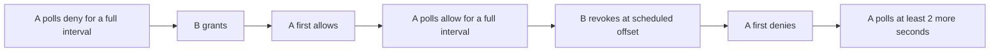

# SpiceDB authorization spike

Date: 2026-09-30

SpiceDB v1.56.2 and OpenFGA v1.21.0 were measured on the same generated
relationships through gRPC. This note supplies counterpart measurements for
the [OpenFGA spike](2026-09-30-openfga-authorization-spike.md). The engines
remain a decision in the [operator authorization
record](../architecture/2026-09-30-operator-authorization-direction.md).

## Setup

The harness and service containers lived outside the repository, under
`$TMPDIR`. The host was `Mac16,8`, with 12 CPUs and 51,539,607,552 bytes (48
GiB) of memory. Colima had six CPUs and 8 GiB. The harness created three
PostgreSQL 17 containers. The main SpiceDB Postgres held the `spice` database,
and later the `exclusion` and `membership` databases. The OpenFGA Postgres held
the `fga` database. The third Postgres held the SpiceDB rebuild database.
SpiceDB A and B used the main SpiceDB database. OpenFGA A and B used the main
OpenFGA database. Revocation ran on those main SpiceDB and OpenFGA instances.
The OpenFGA rebuild created a fresh store on the main OpenFGA instance. The
SpiceDB rebuild used a separate SpiceDB instance backed by the third Postgres.

SpiceDB used the default enabled dispatch cache, five-second revision
quantization, 0.1 maximum staleness percentage, and revision heartbeat. Lookup
kept `fully_consistent` and the same query parameters on every page. SpiceDB
carries the revision in each returned cursor. All timed OpenFGA calls used
gRPC, including checks, writes, `ListObjects`, and `ListUsers`. Schema and
dataset setup outside the timed rebuild also used HTTP. Ordinary measurements
disabled the OpenFGA query and iterator caches. Revocation enabled the check
query cache and cache controller with their default ten-second TTLs. Iterator
caches were off for that comparison. The main OpenFGA instances used
`--listObjects-max-results 50000`, `--listObjects-deadline 60s`, and
`--request-timeout 65s`. SpiceDB lookup used a client-side 60-second deadline
across all pages.

The main SpiceDB Postgres used its default connection settings until the
harness set `max_connections` to 400 after revocation for the remaining
measurements. The other Postgres containers kept their default connection
settings. WAL settings are not recorded. All engines shared the Colima VM.
Other work ran on the host. These are laptop measurements, not capacity
figures.

Before each latency and throughput execution, the harness read `sysctl -n
hw.model hw.ncpu hw.memsize`, `cpu` and `memory` from
`~/.colima/default/colima.yaml`, and `uptime`. Each latency row has five
executions of 1,000 sequential calls. The engines alternate within each row,
with the engine order changed on alternate executions. Each throughput execution
uses the same 1,600 random pairs and 16 callers.

## Workload

The dimensions match the OpenFGA note: 20 tenants, 50 sites per tenant, 40
edges per site, two capture sessions per edge, 200 users per tenant, one or
two of ten roles per user, two Tags per edge, and three Tag roots per tenant
with branching factor three and depth four including the root. There are
40,000 edges, 80,000 sessions, and 2,400 Tags.

The generated union has 6,455 role assignments and one role-capture grant per
tenant. Role ids are scoped to their tenant. User `u-t0-0000` is both a
platform admin and an assignee of tenant role `role:t0-r0`. User `u-t0-0002`
has the direct site grant. The dedicated Tag user `u-t0-0001` has a direct
capture grant on `tag:t0-r0`. There are no role grants on Tags. Of tenant 0's
edges, 406 carry a Tag in the 13-Tag `tag:t0-r0-b0` subtree and 1,104 carry a
Tag under `tag:t0-r0`.

Tag assignment is deterministic in every tenant. For edge index
`site*40+edge`, indices below 406 cycle through the 13 Tags in the `r0-b0`
subtree plus root `r1`, indices 406 through 1,103 use `r0-b1` plus root `r1`,
and all later indices use root `r1` plus root `r2`.

The OpenFGA note preserves the dimensions and aggregate relationship counts,
but not its generated fixture list. Equal dimensions do not make these
individual grants identical. The result differences below follow from this
dedicated Tag-user fixture.

## Schema and relationship counts

| Section | Model | Stored relationships per engine |
| --- | --- | --- |
| Check, batch, throughput, union lookup | Union | 292,238 |
| Revocation | Union | 292,238 plus temporary trial grants |
| Rebuild | Union, tenant 0 plus its platform grant | 14,615 |
| Membership checks and lookup | Intersections inside resource permissions | 336,245 |

The paired OpenFGA model uses `direct_*` stored relations with computed
references. The baseline OpenFGA model combines stored and computed grants
under one relation name. That extra reference hop is a model-shape difference,
despite equal permission semantics. The paired OpenFGA DSL for the types whose
permissions differ is:

```
type tenant
  relations
    define platform: [platform]
    define direct_admin: [user, role#assignee]
    define direct_capturer: [user, role#assignee]
    define direct_viewer: [user, role#assignee]
    define direct_full_payload: [user, role#assignee]
    define admin: direct_admin or admin from platform
    define capturer: direct_capturer or admin
    define viewer: direct_viewer or capturer or admin
    define full_payload: direct_full_payload
type site
  relations
    define tenant: [tenant]
    define direct_capturer: [user, role#assignee]
    define direct_viewer: [user, role#assignee]
    define capturer: direct_capturer or capturer from tenant
    define viewer: direct_viewer or capturer or viewer from tenant
type tag
  relations
    define tenant: [tenant]
    define parent: [tag]
    define direct_capturer: [user, role#assignee]
    define direct_viewer: [user, role#assignee]
    define capturer: direct_capturer or capturer from parent
    define viewer: direct_viewer or capturer or viewer from parent
type edge
  relations
    define site: [site]
    define tag: [tag]
    define capture: capturer from site or capturer from tag
    define view: capture or viewer from site or viewer from tag
```

The complete SpiceDB union schema as measured follows. Each definition maps to
[the union model](2026-09-30-openfga-authorization-spike.md#the-union-model):
`+` maps to `or` and `->` maps to `from`.

```zed
definition user {}
definition platform {
    relation admin: user
}
definition role {
    relation assignee: user
}
definition tenant {
    relation platform: platform
    relation direct_admin: user | role#assignee
    relation direct_capturer: user | role#assignee
    relation direct_viewer: user | role#assignee
    relation direct_full_payload: user | role#assignee
    permission admin = direct_admin + platform->admin
    permission capturer = direct_capturer + admin
    permission viewer = direct_viewer + capturer
    permission full_payload = direct_full_payload
}
definition site {
    relation tenant: tenant
    relation direct_capturer: user | role#assignee
    relation direct_viewer: user | role#assignee
    permission capturer = direct_capturer + tenant->capturer
    permission viewer = direct_viewer + capturer + tenant->viewer
}
definition tag {
    relation tenant: tenant
    relation parent: tag
    relation direct_capturer: user | role#assignee
    relation direct_viewer: user | role#assignee
    permission capturer = direct_capturer + parent->capturer
    permission viewer = direct_viewer + capturer + parent->viewer
}
definition edge {
    relation site: site
    relation tag: tag
    permission capture = site->capturer + tag->capturer
    permission view = capture + site->viewer + tag->viewer
}
definition capture_session {
    relation edge: edge
    relation requester: user
    permission download = requester + edge->capture
}
```

## Check latency

Cells are the median percentile across five executions, followed by the
minimum and maximum of that percentile in brackets. Units are milliseconds.
The timer includes Python request construction, serialization, the gRPC round
trip, and response decoding. The OpenFGA note does not state its client
language. The embedded rows were not measured for SpiceDB.

SpiceDB's dispatch cache was enabled and OpenFGA's query and iterator caches
were disabled for these tables. Each latency row repeats one pair for 1,000
sequential calls per execution. Repeated SpiceDB calls may have been served
from the dispatch cache. That possibility was not checked.

### p50

| Path | SpiceDB fully consistent | SpiceDB minimize latency | OpenFGA cache off |
| --- | --- | --- | --- |
| Global admin edge capture | 0.676 [0.634, 0.695] | 0.524 [0.494, 0.575] | 1.393 [1.156, 1.503] |
| Tenant capturer edge capture | 0.673 [0.637, 0.720] | 0.506 [0.490, 0.551] | 1.385 [1.320, 1.459] |
| Site capturer edge capture | 0.613 [0.585, 0.665] | 0.513 [0.500, 0.528] | 0.784 [0.741, 0.878] |
| Tag grant three levels up | 0.694 [0.678, 0.752] | 0.511 [0.495, 0.533] | 1.524 [1.485, 1.826] |
| No grant | 0.679 [0.665, 0.720] | 0.523 [0.497, 0.564] | 1.344 [1.252, 1.411] |
| Global admin tenant payload deny | 0.653 [0.582, 1.108] | 0.466 [0.448, 0.548] | 0.680 [0.614, 0.958] |
| Batch of 50 sessions | 2.459 [2.290, 2.894] | 2.317 [2.122, 4.496] | 22.799 [20.870, 26.655] |

### p99

| Path | SpiceDB fully consistent | SpiceDB minimize latency | OpenFGA cache off |
| --- | --- | --- | --- |
| Global admin edge capture | 1.029 [0.917, 4.241] | 0.763 [0.756, 2.262] | 4.486 [2.292, 6.603] |
| Tenant capturer edge capture | 1.381 [0.945, 2.712] | 0.811 [0.656, 1.157] | 3.673 [3.190, 5.729] |
| Site capturer edge capture | 1.106 [0.883, 1.648] | 0.832 [0.639, 4.824] | 2.575 [1.328, 3.066] |
| Tag grant three levels up | 2.021 [1.445, 5.403] | 0.949 [0.730, 1.602] | 2.914 [2.810, 7.490] |
| No grant | 1.242 [0.942, 2.226] | 0.768 [0.711, 1.296] | 3.601 [2.739, 4.443] |
| Global admin tenant payload deny | 1.017 [0.792, 4.031] | 0.843 [0.677, 4.945] | 2.539 [1.016, 5.635] |
| Batch of 50 sessions | 6.609 [5.141, 9.386] | 5.003 [4.353, 39.225] | 46.557 [36.279, 242.340] |

Each batch call contains 50 capture-session checks. Both engines returned 27
allows and 23 denies on every call. Batch percentiles come from 1,000 batch
calls in each of five executions.

The OpenFGA note's container p50/p99 values were 1.14/2.67 ms for global
admin, 0.93/2.15 for tenant capture, 0.66/1.09 for site capture, 1.14/1.97 for
a recursive Tag grant, 1.41/2.78 for deny, 0.55/1.55 for payload deny, and
31.97/53.93 for the 50-session batch. The fixture details and host load differ.
The separate contribution of each to any latency difference is unexplained.

Ordering is not resolved where the spreads overlap:

- Global admin edge capture, fully_consistent, p99.
- Site capturer edge capture, fully_consistent, p99.
- Site capturer edge capture, minimize_latency, p99.
- Tag grant three levels up, fully_consistent, p99.
- Global admin tenant payload deny, fully_consistent, p50.
- Global admin tenant payload deny, fully_consistent, p99.
- Global admin tenant payload deny, minimize_latency, p99.
- Batch of 50 sessions, minimize_latency, p99.

## Throughput

| Engine | Checks/s median [min, max] | Seconds median [min, max] |
| --- | --- | --- |
| SpiceDB fully consistent | 1651.738 [1399.355, 5366.107] | 0.969 [0.298, 1.143] |
| OpenFGA cache off | 1541.428 [1446.756, 1593.354] | 1.038 [1.004, 1.106] |

SpiceDB's dispatch cache was enabled and OpenFGA's query and iterator caches
were disabled for this table. The 5,366.107 checks/s value is an unexplained
execution in the SpiceDB spread.

The OpenFGA note measured about 1,430 checks/s against its container and
1,030 embedded. These executions use 1,600 seeded random edge/user pairs, the
tenant-scoped roles above, and Python callers on a shared host. The throughput
difference from 1,430 checks/s is unexplained. The embedded rows were not
measured for SpiceDB.

The min-max throughput spreads overlap, so their ordering is not resolved.

### Host load during timed executions

| Row | Executions | 1-minute load min-max | 5-minute load min-max | 15-minute load min-max |
| --- | --- | --- | --- | --- |
| Global admin edge capture | 15 | 5.27-5.98 | 6.06-6.18 | 6.65-6.68 |
| Tenant capturer edge capture | 15 | 5.97-6.06 | 6.17-6.20 | 6.67-6.69 |
| Site capturer edge capture | 15 | 5.97-6.06 | 6.17-6.19 | 6.67-6.67 |
| Tag grant three levels up | 15 | 5.97-6.21 | 6.16-6.21 | 6.66-6.67 |
| No grant | 15 | 6.19-6.60 | 6.21-6.29 | 6.67-6.69 |
| Global admin tenant payload deny | 15 | 6.60-6.87 | 6.29-6.36 | 6.69-6.71 |
| Batch of 50 sessions | 15 | 7.14-15.80 | 6.43-9.94 | 6.73-8.19 |
| throughput | 10 | 11.64-12.08 | 9.85-10.01 | 8.19-8.26 |
| tenant Member with claim | 10 | 7.57-7.93 | 8.76-8.82 | 8.80-8.82 |
| tenant Member without claim | 10 | 7.93-9.18 | 8.81-9.05 | 8.82-8.90 |
| tenant Enrollment decayed | 10 | 8.85-9.18 | 8.98-9.05 | 8.88-8.90 |
| tenant Partner admin with provider claim | 10 | 8.64-8.85 | 8.93-8.98 | 8.86-8.88 |
| tenant Global admin with platform claim | 10 | 8.64-8.99 | 8.93-9.00 | 8.86-8.88 |
| tenant Stranger | 10 | 8.48-8.75 | 8.89-8.95 | 8.85-8.87 |
| resource Global admin edge capture | 10 | 8.48-8.84 | 8.89-8.95 | 8.85-8.87 |
| resource Tenant capturer edge capture | 10 | 8.36-8.69 | 8.84-8.92 | 8.83-8.86 |
| resource Site capturer edge capture | 10 | 8.00-8.36 | 8.75-8.84 | 8.80-8.83 |
| resource Tag grant three levels up | 10 | 7.14-7.52 | 8.52-8.63 | 8.71-8.76 |
| resource No grant | 10 | 7.14-8.02 | 8.52-8.64 | 8.71-8.75 |
| resource Expired enrollment edge capture | 10 | 7.70-8.02 | 8.56-8.64 | 8.72-8.75 |

Hardware and Colima CPU/memory readings stayed constant. The load ranges above
summarize the `uptime` readings taken before every execution.

## Resource lookup

This table is one execution per row and has no load reading.

| Subject | SpiceDB raw/distinct | Pages | Total ms | Last nonempty page ms | OpenFGA objects | OpenFGA total ms |
| --- | --- | --- | --- | --- | --- | --- |
| Tag user | 1104/1104 | 2 | 372.686 | 23.577 | 1104 | 12.960 |
| Global admin | 42000/40000 | 42 | 4196.138 | 56.012 | 40000 | 82.658 |

The global admin's duplicate rows come from two site paths:
`site->tenant->direct_capturer->role#assignee` and
`site->tenant->platform->admin`. The scoped role adds a second path only for
tenant 0's 2,000 edges, for 42,000 raw rows overall. Sharing role id `r0`
across every tenant would duplicate that path on all 40,000 edges and produce
80,000 raw rows. `tag.capturer` has no tenant or admin path. A platform-admin
probe with no role assignment returned 40,000 raw and 40,000 distinct edges.
The client de-duplicates raw resources while draining every cursor. Total time
includes the final empty cursor request where the row count is an exact
multiple of 1,000.

The OpenFGA note measured 9 ms for the 1,104-edge Tag grant and 148 ms for the
40,000-edge admin grant. The paired gRPC measurements above use those result
sizes. The difference in their times is unexplained.

The union lookup is slower than the membership-intersection lookup on the same
sets: 1,104 took 372.686 ms versus 65.802 ms, and 40,000 took 4,196.138 ms
versus 1,773.847 ms. This inversion is unexplained.

For this probe, the harness started a separate OpenFGA instance on the same
OpenFGA Postgres with `--listObjects-max-results 1000`. The same Tag query
returned 1,000 objects in 18.216 ms. It contained no cursor or partial-result
marker. The OpenFGA note's cap probe expected 1,144 objects, whereas this
fixture expects 1,104. Both probes truncate at 1,000.

## Revocation and cache staleness

A serves checks throughout each trial. B writes and revokes the grant in the
same datastore as A. Polls record request-start and response timestamps,
result, and latency, about every 10 ms. Checks run for at least one full
quantization interval or cache TTL before the delete and for at least two
seconds after the first deny. Revokes are scheduled 0.5, 1.5, 2.5, 3.5, and
4.5 seconds after a five-second wall-clock boundary. Each accepted trial
asserts that A allowed after the latest boundary and before the delete. Every
mode has five accepted trials.

A grant control begins with a continuously polled deny, writes a grant through
B, and measures the first allow. The row may report revocation staleness only
if that engine/mode observed a stale control deny and a stale revoke allow.


The delete-response timestamp starts both post-delete timers. Only polls
started after that response count as stale allows. A missing last allow means
no stale allow was observed, not a zero-duration staleness estimate. The token
mode uses the revoking write's ZedToken for all such checks.

### Positive controls

| Engine / mode | Stale denied polls after grant, trials 1-5 | Grant response to first allow ms, trials 1-5 |
| --- | --- | --- |
| SpiceDB / `minimize_latency` | 386, 312, 220, 129, 49 | 4513.868, 3582.179, 2535.727, 1489.643, 574.033 |
| SpiceDB / `at_least_as_fresh` | 0, 0, 0, 0, 0 | 5.929, 9.650, 7.349, 1.985, 12.679 |
| SpiceDB / `fully_consistent` | 0, 0, 0, 0, 0 | 12.265, 9.979, 12.392, 8.121, 5.680 |
| OpenFGA / `UNSPECIFIED` | 766, 240, 157, 72, 164 | 8750.626, 2781.771, 1813.403, 838.500, 1923.620 |
| OpenFGA / `HIGHER_CONSISTENCY` | 0, 0, 0, 0, 0 | 9.295, 9.691, 9.543, 15.954, 1.419 |

### SpiceDB minimize latency

| Offset s | Allowed polls after delete | Delete response to last allow ms | Delete response to first deny ms | Post-delete check p50 ms |
| --- | --- | --- | --- | --- |
| 0.5 | 401 | 4870.421 | 4599.101 | 1.985 |
| 1.5 | 319 | 3883.386 | 3504.322 | 1.087 |
| 2.5 | 235 | 2911.897 | 2473.477 | 1.062 |
| 3.5 | 149 | 1803.084 | 1573.688 | 1.063 |
| 4.5 | 58 | 885.853 | 557.550 | 0.819 |

### SpiceDB at least as fresh

| Offset s | Allowed polls after delete | Delete response to last allow ms | Delete response to first deny ms | Post-delete check p50 ms |
| --- | --- | --- | --- | --- |
| 0.5 | 0 | none observed | 6.922 | 1.076 |
| 1.5 | 0 | none observed | 12.864 | 1.068 |
| 2.5 | 0 | none observed | 9.914 | 0.958 |
| 3.5 | 0 | none observed | 4.009 | 1.166 |
| 4.5 | 0 | none observed | 5.619 | 0.996 |

No stale control deny or revoked-grant allow was observed in this mode. The
harness therefore reports first-deny response timing and check latency,
without a staleness estimate.

### SpiceDB fully consistent

| Offset s | Allowed polls after delete | Delete response to last allow ms | Delete response to first deny ms | Post-delete check p50 ms |
| --- | --- | --- | --- | --- |
| 0.5 | 0 | none observed | 9.274 | 1.589 |
| 1.5 | 0 | none observed | 13.593 | 1.514 |
| 2.5 | 0 | none observed | 3.931 | 1.194 |
| 3.5 | 0 | none observed | 6.267 | 1.389 |
| 4.5 | 0 | none observed | 12.187 | 1.572 |

No stale control deny or revoked-grant allow was observed in this mode. The
harness therefore reports first-deny response timing and check latency,
without a staleness estimate.

### OpenFGA UNSPECIFIED

| Offset s | Allowed polls after delete | Delete response to last allow ms | Delete response to first deny ms | Post-delete check p50 ms |
| --- | --- | --- | --- | --- |
| 0.5 | 758 | 8743.093 | 8756.764 | 1.019 |
| 1.5 | 680 | 7777.398 | 7790.629 | 1.108 |
| 2.5 | 597 | 6810.237 | 6823.597 | 0.937 |
| 3.5 | 505 | 5834.287 | 5853.422 | 1.073 |
| 4.5 | 167 | 1924.493 | 1937.907 | 1.110 |

### OpenFGA HIGHER CONSISTENCY

| Offset s | Allowed polls after delete | Delete response to last allow ms | Delete response to first deny ms | Post-delete check p50 ms |
| --- | --- | --- | --- | --- |
| 0.5 | 0 | none observed | 4.576 | 1.739 |
| 1.5 | 0 | none observed | 6.881 | 1.828 |
| 2.5 | 0 | none observed | 4.241 | 1.759 |
| 3.5 | 0 | none observed | 11.977 | 1.877 |
| 4.5 | 0 | none observed | 9.202 | 2.022 |

No stale control deny or revoked-grant allow was observed in this mode. The
harness therefore reports first-deny response timing and check latency,
without a staleness estimate.

The executable acceptance output was:

```text
ASSERT SpiceDB minimize_latency: valid=5/5; grant controls with stale denies=5/5; revoked grants with stale allows=5/5; staleness figure permitted=true
ASSERT SpiceDB at_least_as_fresh: valid=5/5; grant controls with stale denies=0/5; revoked grants with stale allows=0/5; staleness figure permitted=false
ASSERT SpiceDB fully_consistent: valid=5/5; grant controls with stale denies=0/5; revoked grants with stale allows=0/5; staleness figure permitted=false
ASSERT OpenFGA UNSPECIFIED: valid=5/5; grant controls with stale denies=5/5; revoked grants with stale allows=5/5; staleness figure permitted=true
ASSERT OpenFGA HIGHER_CONSISTENCY: valid=5/5; grant controls with stale denies=0/5; revoked grants with stale allows=0/5; staleness figure permitted=false
```

For SpiceDB `minimize_latency`, a first deny can be followed by another allow.
In v1.56.2, [`querySelectRevision` and
`pgDatastore.optimizedRevisionFunc`](https://github.com/authzed/spicedb/blob/v1.56.2/internal/datastore/postgres/revisions.go)
select a snapshot around the quantized boundary.
[`CachedOptimizedRevisions.OptimizedRevision`](https://github.com/authzed/spicedb/blob/v1.56.2/internal/datastore/revisions/optimized.go)
can retain a cached candidate with a randomized allowance up to the configured
maximum staleness. This explains why first deny does not mark convergence in
this topology. It does not establish a bound for other datastores or
deployments.

The configured maximum-staleness allowance is 0.1 × 5 s = 500 ms past a
quantization boundary. In these trials, the last allow ran 303 to 412 ms past
the first boundary after the revoke. The revoked grant stayed allowed for up to
4.87 s after the delete response, with last allows ranging from 0.886 to
4.870 s. Last allow minus first deny was 229 to 438 ms.

The OpenFGA note measured 1.509-9.019 s with check caching and the cache
controller enabled across two replicas. The default-cache trials above observe
seconds of stale allows as well. The re-measured OpenFGA trials measured
1.924-8.743 s, which falls inside the OpenFGA spike's 1.509-9.019 s. Offsets
relative to each cache's age differ,
so individual trials need not match. The controller reads changes at most once
per its TTL ([`DetermineInvalidationTime`,
v1.21.0](https://github.com/openfga/openfga/blob/v1.21.0/internal/cachecontroller/cache_controller.go)).
Continuous polling preserves the cache's history across the delete. A
first-deny response without any observed stale allows would measure response
latency alone.

## Tag exclusion and preview

The exclusion variant was not measured comparably to the OpenFGA note. No
design under consideration previews an access change through the exclusion
model.

### Disposable rebuild

The rebuild copies tenant 0's union relationships, tenant-scoped role
assignments, capture sessions, and its platform-admin grant. Service startup,
database migration, and OpenFGA `CreateStore` are outside the timer. The
rebuild timer includes writing the schema/model and relationships over gRPC.
Apply deletes the 406 subtree edge-to-Tag relationships. The diff queries
every user's capture access on those edges in the original and disposable
stores.

This table is one execution per row and has no load reading.

| Engine | Relationships | Schema/model and load ms | Apply ms | All-user diff ms | Pairs / edges losing |
| --- | --- | --- | --- | --- | --- |
| SpiceDB | 14615 | 544.766 | 38.017 | 3204.364 | 406/406 |
| OpenFGA | 14615 | 1489.714 | 56.711 | 1793.662 | 406/406 |

The OpenFGA note rebuilt 14,629 relationships in 0.55 s, applied the change in
0.10 s, and diffed 406 edges with `ListUsers` in 2.54 s. This scope contains
14,615 relationships. It includes all tenant 0 role assignments and the
platform grant. The exact relationship-list difference from 14,629 is
unexplained because that fixture list is absent. Both measurements include
sessions. The OpenFGA re-measurement here took 1,489.714 ms to load versus
0.55 s in the OpenFGA spike, 56.711 ms to apply versus 0.10 s, and 1,793.662 ms
to diff versus 2.54 s. Each timing difference is unexplained. The all-user diff
here produces 406 pairs from the dedicated Tag user, while the note reports 291
pairs. The count difference follows from the fixture's relationship counts and
grant distribution. The client language is unknown and host load differs, so
their separate contributions to the timing differences remain unexplained.

## Tenant membership

The stored dataset has 336,245 relationships: the 292,238 union, 40,000 direct
edge-to-tenant links, 4,000 caveated enrollments, two customer partner links,
one provider admin, one expired enrollment, an expired-user capture grant, and
two customer capture grants to the provider admin. This is four fewer than the
OpenFGA note's 336,249. Its individual fixture list is absent, so the identity
of those four relationships is unexplained.

Enrollment carries `organization` and `expires_at` as stored SpiceDB caveat
context. Requests supply `claimed_orgs` and `current_time`:

```zed
caveat tenant_claim(claimed_orgs list<string>, current_time timestamp,
                    organization string, expires_at timestamp) {
    organization in claimed_orgs && current_time < expires_at
}
```

The resource model uses the OpenFGA spike's direct owning-tenant placement,
inside each resource permission:

```zed
// tenant
permission member = enrolled + partner->active_admin + platform->admin
permission active_admin = admin & member
// site
permission capturer = (direct_capturer + tenant->capturer) & tenant->member
permission viewer = (direct_viewer + capturer + tenant->viewer) & tenant->member
// tag
permission capturer = (direct_capturer + parent->capturer) & tenant->member
permission viewer = (direct_viewer + capturer + parent->viewer) & tenant->member
// edge
relation tenant: tenant
permission member = tenant->member
permission capture = (site->capturer + tag->capturer) & tenant->member
permission view = (capture + site->viewer + tag->viewer) & tenant->member
// capture_session
permission download = (requester + edge->capture) & edge->member
```

OpenFGA uses `(claimed and enrolled) or active_admin from partner or admin
from platform`, conditioned enrollment on `current_time < expires_at`, and
contextual `claimed` tuples. Resource intersections use `and member from
tenant` on edges, sites, and Tags. Sessions use `and member from edge`. Both
engines passed the same 14 correctness cases, including missing and wrong
claims, expired enrollment, a grant without a claim, and provider-admin and
platform-admin inheritance.

### Tenant check latency

Cells have the same median [min, max] convention as the check tables above.
Each row has five executions of 1,000 calls per engine. SpiceDB uses
`fully_consistent` and OpenFGA has caches off. SpiceDB's dispatch cache was
enabled and OpenFGA's query and iterator caches were disabled. Each execution
repeats one pair 1,000 times. Repeated SpiceDB calls may have been served from
the dispatch cache. That possibility was not checked.

| Case | SpiceDB p50 ms | OpenFGA p50 ms |
| --- | --- | --- |
| Member with claim | 0.719 [0.654, 0.751] | 0.747 [0.628, 0.797] |
| Member without claim | 0.801 [0.710, 1.283] | 0.811 [0.740, 1.065] |
| Enrollment decayed | 0.684 [0.668, 0.706] | 0.788 [0.730, 0.807] |
| Partner admin with provider claim | 0.746 [0.643, 0.768] | 0.984 [0.927, 1.018] |
| Global admin with platform claim | 0.715 [0.692, 0.737] | 0.904 [0.824, 1.073] |
| Stranger | 0.690 [0.642, 0.707] | 0.787 [0.756, 0.853] |

| Case | SpiceDB p99 ms | OpenFGA p99 ms |
| --- | --- | --- |
| Member with claim | 1.256 [1.195, 2.782] | 1.821 [1.558, 2.558] |
| Member without claim | 3.111 [1.089, 15.652] | 1.671 [1.233, 6.560] |
| Enrollment decayed | 1.037 [0.966, 1.570] | 1.737 [1.384, 4.387] |
| Partner admin with provider claim | 1.010 [0.981, 1.929] | 2.092 [1.777, 2.739] |
| Global admin with platform claim | 1.513 [0.942, 12.868] | 5.565 [1.647, 6.638] |
| Stranger | 0.946 [0.836, 1.058] | 1.375 [1.272, 2.378] |

### Resource check latency

| Case | SpiceDB p50 ms | OpenFGA p50 ms |
| --- | --- | --- |
| Global admin edge capture | 0.674 [0.646, 0.719] | 1.381 [1.358, 1.413] |
| Tenant capturer edge capture | 0.683 [0.617, 0.704] | 1.418 [1.336, 1.489] |
| Site capturer edge capture | 0.689 [0.588, 0.775] | 1.208 [1.126, 1.270] |
| Tag grant three levels up | 0.710 [0.682, 0.721] | 1.846 [1.821, 1.893] |
| No grant | 0.721 [0.656, 0.825] | 1.435 [1.268, 1.802] |
| Expired enrollment edge capture | 0.743 [0.722, 0.777] | 1.360 [1.282, 1.425] |

| Case | SpiceDB p99 ms | OpenFGA p99 ms |
| --- | --- | --- |
| Global admin edge capture | 0.904 [0.860, 1.602] | 2.568 [2.458, 2.620] |
| Tenant capturer edge capture | 0.985 [0.857, 1.029] | 2.745 [2.517, 3.337] |
| Site capturer edge capture | 1.107 [0.938, 2.400] | 2.774 [2.210, 6.376] |
| Tag grant three levels up | 1.397 [1.040, 1.774] | 3.611 [3.414, 4.013] |
| No grant | 1.938 [0.949, 6.074] | 6.454 [3.030, 7.217] |
| Expired enrollment edge capture | 1.514 [1.277, 4.476] | 3.177 [2.617, 3.502] |

The OpenFGA note's membership tenant checks had container p50 0.63-0.96 ms and
p99 1.27-1.91 ms. Its resource checks had embedded p50 1.05-2.94 ms. The
resource table above supplies the service-backed counterpart. The embedded rows
were not measured for SpiceDB. This model has direct edge-to-tenant membership
intersections. The separate effects of fixture differences and host load on
latency are unexplained.

Against OpenFGA cache off, tenant p50 spreads overlap for Member with claim and
Member without claim. Against OpenFGA cache off, tenant p99 spreads overlap
for Member with claim, Member without claim, Enrollment decayed, Partner admin
with provider claim, and Global admin with platform claim. Against OpenFGA cache
off, no resource p50 spread overlaps. Against OpenFGA cache off, resource p99
spreads overlap for Site capturer edge capture, No grant, and Expired enrollment
edge capture.

### Membership-aware resource lookup

The provider user is an enrolled admin of tenant 0, with a claim for tenant 0
and partner links from tenants 1 and 2,
plus explicit capture grants on those two customer tenants. It also inherits
capture on its own tenant's 2,000 edges. Its expected lookup set is 6,000
edges, of which 4,000 are customer edges.

This table is one execution per row and has no load reading.

| Subject | SpiceDB raw/distinct | Pages | Total ms | Last nonempty page ms | SpiceDB completion | OpenFGA objects | OpenFGA total ms | OpenFGA status |
| --- | --- | --- | --- | --- | --- | --- | --- | --- |
| Tag user | 1104/1104 | 2 | 65.802 | 12.055 | complete (count matches expected) | 1104 | 905.764 | complete (count matches expected) |
| Global admin | 42000/40000 | 42 | 1773.847 | 32.824 | complete (count matches expected) | 0 | 60019.708 | deadline, 0 of 40,000 expected |
| Partner admin | 6000/6000 | 6 | 244.898 | 34.700 | complete (count matches expected) | 0 | 60007.095 | deadline, 0 of 6,000 expected |

The OpenFGA note's direct-tenant placement returned 11 of 1,104 Tag edges and
zero global-admin edges after 60 s. The partner returned all 4,000 in 11.18 s.
This fixture has 6,000 eligible partner edges because the provider admin can
also capture its own tenant's 2,000 edges. SpiceDB returned the 4,000 customer
edges within that 6,000-edge result. OpenFGA returned zero before the deadline
even though its point check on a customer edge allowed. The table uses direct
tenant membership placement and a 60-second deadline. Counts and times that
differ despite this placement remain unexplained. The four-relationship
fixture difference and stored-grant reference shape limit the comparison. The
client language is unknown. No per-type-only placement is claimed as a
counterpart to this table.

## Findings

| Area | SpiceDB | OpenFGA | Notes |
| --- | --- | --- | --- |
| Point and batch checks | p50/p99, fully consistent, path order from the check tables: 0.676 [0.634, 0.695] / 1.029 [0.917, 4.241], 0.673 [0.637, 0.720] / 1.381 [0.945, 2.712], 0.613 [0.585, 0.665] / 1.106 [0.883, 1.648], 0.694 [0.678, 0.752] / 2.021 [1.445, 5.403], 0.679 [0.665, 0.720] / 1.242 [0.942, 2.226], 0.653 [0.582, 1.108] / 1.017 [0.792, 4.031], 2.459 [2.290, 2.894] / 6.609 [5.141, 9.386] ms. Minimize latency: 0.524 [0.494, 0.575] / 0.763 [0.756, 2.262], 0.506 [0.490, 0.551] / 0.811 [0.656, 1.157], 0.513 [0.500, 0.528] / 0.832 [0.639, 4.824], 0.511 [0.495, 0.533] / 0.949 [0.730, 1.602], 0.523 [0.497, 0.564] / 0.768 [0.711, 1.296], 0.466 [0.448, 0.548] / 0.843 [0.677, 4.945], 2.317 [2.122, 4.496] / 5.003 [4.353, 39.225] ms. | p50/p99, cache off, same path order: 1.393 [1.156, 1.503] / 4.486 [2.292, 6.603], 1.385 [1.320, 1.459] / 3.673 [3.190, 5.729], 0.784 [0.741, 0.878] / 2.575 [1.328, 3.066], 1.524 [1.485, 1.826] / 2.914 [2.810, 7.490], 1.344 [1.252, 1.411] / 3.601 [2.739, 4.443], 0.680 [0.614, 0.958] / 2.539 [1.016, 5.635], 22.799 [20.870, 26.655] / 46.557 [36.279, 242.340] ms. | Each cell is p50 / p99 with the row's [min, max]. Overlapping spreads are not resolved. |
| Throughput | 1,651.738 [1,399.355, 5,366.107] checks/s. 0.969 [0.298, 1.143] s. | 1,541.428 [1,446.756, 1,593.354] checks/s. 1.038 [1.004, 1.106] s. | The 5,366.107 checks/s SpiceDB execution is unexplained. |
| Union lookup | Tag user: 1,104 distinct in 372.686 ms. Global admin: 40,000 distinct in 4,196.138 ms. Both complete. | Tag user: 1,104 objects in 12.960 ms. Global admin: 40,000 objects in 82.658 ms. | SpiceDB raw counts are 1,104 and 42,000. |
| Revocation | `minimize_latency`: last allow 885.853-4,870.421 ms after delete response. `at_least_as_fresh` and `fully_consistent`: none observed. | `UNSPECIFIED`: last allow 1,924.493-8,743.093 ms after delete response. `HIGHER_CONSISTENCY`: none observed. | Five trials per mode. |
| Rebuild | Load 544.766 ms, apply 38.017 ms, all-user diff 3,204.364 ms. | Load 1,489.714 ms, apply 56.711 ms, all-user diff 1,793.662 ms. | One execution per row with no load reading. Each OpenFGA difference from the OpenFGA spike is unexplained. |
| Membership lookup | Tag user: 1,104 of 1,104 complete. Global admin: 40,000 of 40,000 complete. Partner admin: 6,000 of 6,000 complete. | Tag user: 1,104 of 1,104 complete. Global admin: deadline, 0 of 40,000 expected. Partner admin: deadline, 0 of 6,000 expected. | Direct tenant intersections. The deadline is 60 seconds. |

## Sources

- [OpenFGA authorization spike](2026-09-30-openfga-authorization-spike.md)
- [SpiceDB v1.56.2 Postgres revisions](https://github.com/authzed/spicedb/blob/v1.56.2/internal/datastore/postgres/revisions.go), `querySelectRevision` and `optimizedRevisionFunc`
- [SpiceDB v1.56.2 cached optimized revisions](https://github.com/authzed/spicedb/blob/v1.56.2/internal/datastore/revisions/optimized.go), `OptimizedRevision`
- [OpenFGA v1.21.0 cache controller](https://github.com/openfga/openfga/blob/v1.21.0/internal/cachecontroller/cache_controller.go), `DetermineInvalidationTime`
- [SpiceDB consistency](https://authzed.com/docs/spicedb/concepts/consistency)
- [SpiceDB caveats](https://authzed.com/docs/spicedb/concepts/caveats)
- [OpenFGA conditions](https://openfga.dev/docs/modeling/conditions)
