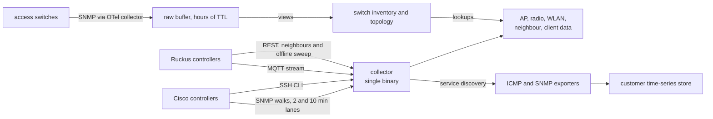

# Production monitoring baseline

Research date: 2026-10-01

FlowSeer replaces three monitoring systems. This note records roughly how big
they are, how they sample, how incidents look in their data, where that data
cannot be trusted, and which of those problems FlowSeer's accepted design
already rules out. All numbers are rounded. The note deliberately holds no
identifiers, addresses, schema details, or customer information.

| System | Serves | Replacement order |
| --- | --- | --- |
| Columnar edge monitoring store | One large customer: APs through their controllers, switch topology | First |
| Customer time-series store | The same customer: switch SNMP, AP and switch ICMP, a few servers | With the columnar store |
| Legacy time-series store | All other customers: one exporter flattens several Nagios instances into one data source, plus SNMP exporters for some switches | Later, gradually |

## Summary

| Question | Columnar store | Customer time-series store | Legacy time-series store |
| --- | --- | --- | --- |
| Devices | about 9,000 APs, about 850 switches, about 60 sites | about 9,000 AP and 870 switch ICMP targets | about 6,500 Nagios hosts, about 430 SNMP targets |
| Trend | Flat over 12 months | Flat over 6 months | Slow growth, about 3 % per half year |
| Native interval | 2 to 10 min | 5 min | 1 min scrape, values change about every 10 min |
| Ingest | about 40 M rows per day | about 16,000 samples/s | about 27,000 samples/s |
| Active series | (rows, not series) | about 5 M, about 8 M in the daily index | about 1.6 M |
| Disk | about 70 GiB per year of AP data | about 150 GiB data plus 270 GiB index for 6 months | about 45 GiB data plus 20 GiB index for 6 months |

Are we getting more devices? The large customer is stable. Its AP count
peaked at about 9,400 in spring 2026 and has held at about 8,850 since June,
with only a few dozen new APs per month. The legacy fleet grows slowly but
steadily, by about 30 hosts per month. Switches grow fastest there. Checks
grow faster than hosts, and standing CRITICAL checks fastest of all (about
+20 % in six months).

## Columnar edge monitoring store

### Setup

- One Go binary (under 20,000 lines) runs every controller in one process.
  A failed component retries after a few minutes.
- Cisco data comes from controller SNMP walks: AP and radio data every
  2 minutes, clients and neighbours every 10 minutes. An SSH CLI poller adds
  APs that have not joined.
- Ruckus data comes from an MQTT stream (AP status, clients) plus the REST
  API (neighbours, and a periodic offline sweep).
- The columnar store holds switch inventory and topology only. Switch
  interface counters live in the customer time-series store.
- The ICMP data moved to the customer time-series store in early 2026.
- Uplink mapping (switch port to AP) and several gap-filling rules are
  derived inside the database through views and lookup tables.

### Fleet

| Measure | Approximate value |
| --- | --- |
| APs | about 9,000 (about 64 % Cisco, 36 % Ruckus), about 10,000 seen within a year |
| Sites | about 60. APs per site: median about 120, largest about 700 |
| Controllers | 8, usually 2 per site, up to 5 |
| AP models | about 40. The largest model is about 30 % of the fleet, the five largest about two thirds |
| Wi-Fi 6 share | about 20 % a year ago, about 27 % now |
| Firmware | under 10 versions fleet-wide. One version runs on 75 to 85 % of each vendor's APs |
| AP uptime | median 1 to 2 months, p90 about 7 months |
| Switches | about 850 to 880, about 44,000 interfaces |
| SSIDs per AP | median 3, max about 7 |
| RF neighbours per AP | median about 17, max about 70 |
| Distinct wireless clients per day | about 25,000 |
| Online clients | about 15,000 fleet-wide, about 2 per AP |
| AP reboots | about 3 % of APs per day |

Client load is low and flat over the day. Sizing should follow AP count and
per-AP fan-out (radios, SSIDs, neighbours), not client count.

### Granularity and storage

| Data | Cisco interval | Ruckus interval | Rows per day | Share of volume |
| --- | --- | --- | --- | --- |
| AP status | 2 min | 3 min | about 4 M | about 30 % |
| Radio | 2 min | 3 min | about 9 M | about 13 % |
| WLAN | not collected | 3 min | about 8 M | about 15 % |
| RF neighbours | 10 min | not collected | about 15 M | about 45 % |
| Clients (kept 1 week) | 3 min | 3 min | about 5 M | under 1 % |

A wide row per entity and poll, sorted by entity then time, with dictionary
encoded strings and delta compression on gauges, gives 4 to 6 bytes per row.
That is about 70 GiB per year for 9,000 APs.

### Incident timing

An outage here is an AP reported offline for more than 10 minutes. Per month:

| Measure | Approximate value |
| --- | --- |
| Outages | about 1,300 (both vendors together) |
| Single-AP outages | about two thirds |
| Site-wide bursts (10 or more APs on one site within 5 minutes) | under 10, carrying about a fifth of outage volume |
| Largest burst | about 70 APs |
| Median Cisco outage | about 1.5 h |

Cisco outages start mostly in local morning working hours, about three times
the hourly average. That points at on-site work rather than failures. Ruckus
outages are spread evenly over the day. An alerting design that groups APs
by site and upstream switch would turn each burst into one incident.

### Data quality

- **Ruckus false offline.** Ruckus produces tens of thousands of
  single-sample offline readings per month on about 550 APs. Uptime keeps
  increasing across nearly all of them, and clients are still reported in
  about three quarters. These are not outages. Any availability number from
  this data overstates Ruckus downtime.
- **Zero means "not reported".** Cisco reports no WLAN data, no radio noise,
  SNR, RSSI or airtime, and no temperature. Ruckus neighbour polling silently
  stops after the first API error. Alert counts and flags are partly never
  filled.
- **Byte counters mean different things per vendor.** Ruckus reports
  per-report deltas, Cisco cumulative per-association counters. One Ruckus
  radio field carries dropped bytes instead of transmitted bytes. AP-level
  bytes are filled by summing client bytes, mixing both meanings. That is why
  they are zero in about 40 % of samples and go down in a few percent of
  consecutive samples.
- **Site is derived from the AP's current IP.** A DHCP change, overlapping
  ranges, or a site table edit moves an AP. About a third of APs changed site
  within a year.
- **Radio band is guessed from protocols.** A Wi-Fi 6 radio loses its band.
- **Values are synthesized.** Some noise and SNR values are computed from
  other fields, neighbours on other channels are dropped, and one vendor's
  CPU values are scaled wrongly.
- **Client status** uses two vendor vocabularies.
- **Querying is fragile.** The monitoring store is also the analytics store.
  A single wide analytic query over several months of AP data stalled ingest
  for about 2 minutes.

## Customer time-series store

Scrape targets come from the collector's service discovery, so both stores
share one inventory. Every switch is scraped by five SNMP jobs every
5 minutes, and every AP and switch by an ICMP probe.

| Job group | Share of series | What it carries |
| --- | --- | --- |
| Switch LLDP and CDP | about 55 % | Neighbour tables, plus a full interface table walk |
| Switch vendor MIBs | about 25 % | Hardware inventory, PoE, plus a full interface table walk |
| Switch interfaces | about 13 % | Interface table |
| ICMP | about 2 % | Probe results |
| Other | about 5 % | System group, DHCP and DNS servers, firewalls, containers, RADIUS |

Findings:

- **Series churn dominates storage.** The LLDP job creates about 25,000 new
  series every scrape, about 7 M per day, because volatile neighbour values
  are used as labels. The index is about twice the size of the samples.
- **The interface table is walked three times** per switch by different jobs.
- **Scrapes hit the timeout.** About 2 to 5 % of switch scrapes run into the
  scrape timeout on a normal day.
- **Switches.** About 95 % answer SNMP. About half of all interfaces are up.
  Ports with input errors number a few dozen.
- **ICMP disagrees with the controllers.** About 5 % of APs fail every ping for
  a whole day while the controllers report about 98.5 % of APs online. ICMP
  and controller availability measure different things. Average AP ping
  success also drifts by several points over months.
- **RTT** to APs: median about 6 ms, p99 about 20 ms.

## Legacy time-series store

One exporter flattens several Nagios instances into one data source. About
three quarters of all series are Nagios check data, about a fifth are switch
SNMP data.

### Nagios fleet

| Measure | Approximate value |
| --- | --- |
| Hosts | about 6,500 |
| Check results | about 240,000 (about 37 per host) |
| Distinct service names | about 100,000 |
| Host types | 50+ free-text values. Switches, AP and controller hosts, access gateways, hypervisors, and routers lead |
| Vendors | 60+ free-text values |
| States now | about 91 % OK, 8 % CRITICAL, under 1 % WARNING and UNKNOWN each |
| Ping RTA | median about 10 ms, p99 about 1.5 s |

The fleet is much broader than network gear: cable TV head ends and CMTS,
hypervisors, UPS units, digital signage, cameras, LTE and 5G equipment.

### Incident timing

Total ping loss over one week:

| Measure | Approximate value |
| --- | --- |
| Ping checks with any total loss | about 17,000 |
| Of those, dead the whole week | about a fifth |
| Median loss duration of the rest | about 30 min |
| New loss onsets per hour | about 100 baseline |

Two patterns stand out. Every night at the same early-morning hour the onset
count doubles, on every day checked. Further spikes of two to three times the
baseline appear at drifting times about 5 to 7 hours apart. A daily
maintenance or reconnect job explains the first, and something on the Nagios
side may explain the second. Neither is a real incident pattern, and both
need suppressing or explaining before alerting on this data.

About 17,000 checks were CRITICAL both now and a day ago. Most CRITICAL
states are standing conditions, not incidents.

### Data quality

- **Status is a one-hot label**, which multiplies most series by four.
- **Sampling is about 10x the source rate.**
- **Taxonomy is typed by hand.** Type and vendor hold spelling variants,
  translations, and numbered duplicates. Import needs a mapping table.
- **Dead targets stay forever.** About half the SNMP targets do not answer,
  and most of those have not answered once in a month.
- **About a quarter of up switch ports report speed 0**, so utilisation cannot
  be computed from reported speed alone.
- **Links are idle.** Median switch traffic is a few Mbit/s, the busiest port
  a few hundred Mbit/s. A 1 to 5 minute counter interval is adequate.

## What carries over to FlowSeer

| Area | Finding | Implication |
| --- | --- | --- |
| Scale | about 9,000 APs and 900 switches for one customer, about 6,500 hosts for the rest, slow growth | A single-node store handles this. Plan for about 20,000 devices |
| Fan-out | Per AP 2 to 3 radios, 3 SSIDs, about 17 neighbours. Per switch about 44 interfaces | Volume follows fan-out, not device count |
| RF neighbours | about 45 % of columnar volume | Store neighbour scans as changes or downsample them |
| Interval | Controllers 2 to 3 min, checks 10 min, switch SNMP 5 min | Store at the source interval |
| Availability | Controller, ICMP, and Nagios views disagree, and Ruckus emits false offline samples | Keep each reachability source separate and do not alert on a single sample |
| Incidents | About a fifth of AP outages are site-wide bursts, a nightly onset spike in Nagios | Correlate by site and upstream device, and model maintenance windows |
| Standing state | about 18,000 standing CRITICAL checks, growing | Separate standing conditions from transitions |

## What does not apply to FlowSeer

Checked against the accepted direction records. Only one legacy problem is
ruled out by construction. Most others are addressed only if FlowSeer is
built as directed, and several have no direction yet.

**Ruled out by construction**

- Cross-tenant data on the transport. Each tenant has its own NATS account and
  cannot publish into another tenant's subjects, and tenancy is ambient, never
  a payload field
  ([device service record](../architecture/2026-08-20-device-service-and-inventory-direction.md),
  [`protobuf.md`](../conventions/protobuf.md)). The legacy split, where
  tenant identity is a free-text label in a shared store, cannot occur on the
  bus.

**Addressed if built as directed**

| Legacy problem | FlowSeer rule |
| --- | --- |
| Site derived from current IP | Placement is an explicit append-only relation, and IP is binding data, never identity (device service record) |
| Zero for "not reported" | Edition-2024 field presence: unset means the device does not provide it ([`protobuf.md`](../conventions/protobuf.md)) |
| Mixed counter semantics | Counters carry a discontinuity timestamp and are converted once in the mapper ([schema building blocks record](../architecture/2026-09-25-schema-building-blocks-direction.md)) |
| One-hot status label | Status is an enum on the owning entity's State ([`protobuf.md`](../conventions/protobuf.md)) |
| Repeated interface table walks | A collector walks each table once per cycle with the union of columns ([`CONCEPTS.md`](../../CONCEPTS.md)) |
| Free-text vendor and model | Product identity comes from a generated sysObjectID table ([`CONCEPTS.md`](../../CONCEPTS.md)) |
| Polling faster than change | Indicator-gated fetches and delta events (device service record) |
| Silent stuck pollers, clients without timeouts | Every execute carries a deadline, and degraded paths and stream progress are visible from outside the process ([`observability.md`](../conventions/observability.md)) |
| Flapping online state from merged sources | Reachability and lifecycle are separate axes, MISSING needs every binding unreachable past a threshold, and the service settles disagreement before State is written (device service record) |
| Standing versus transition | Alarm state and alarm events are separate ([`CONCEPTS.md`](../../CONCEPTS.md)) |
| One binary for all controllers | One integration instance per controller under supervision (device service record) |
| Product logic in database views | Protocol-blind views and current state are projections a service computes ([schema building blocks record](../architecture/2026-09-25-schema-building-blocks-direction.md)) |

Dead targets are only half solved. Unreachable bindings escalate to MISSING
after a day, but auto-retire is off by default, so they keep being polled
until an operator retires them.

**No direction yet (open risks)**

- How device metrics are stored: backend, retention, and a cardinality
  budget for device-data labels. The observability convention bounds
  FlowSeer's own telemetry only, so the LLDP churn problem could recur.
- Switch interface counter history and raw-buffer design.
- Tenant isolation in the metric and event stores.
- Alerting policy beyond MISSING: grouping by site and upstream device,
  maintenance windows, deduplication.
- How vendor-reported AP status reconciles with FlowSeer's own binding
  reachability.

## Method notes

- Trends over months in the legacy store need instant queries at chosen
  timestamps, since range queries over months exceed its sample limit.
- Keep analytic queries on the columnar store to short windows or sampled
  hours. A client-side timeout does not stop the query on the server.
