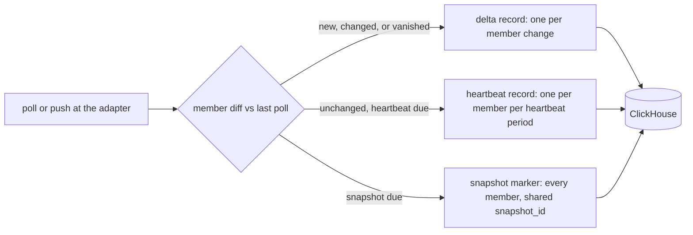

# Lane E: control-plane tables, adjacencies, L2 control, membership, slow sets

Scope: routing tables (Route, NextHop, NextHopGroup, BgpPath), adjacencies
(OSPF, IS-IS, BGP peer state, with BFD and VRRP state folded into the shared
transition table), L2 control (STP, LACP), membership and sessions (multicast,
802.1X, DHCP, NAT), slow config-like sets (InterfaceAddress, Vlan,
SwitchportFacet, NtpAssociation, AaaServer.status, NetworkInstance).

Read first: 02-best-practices F3 to F8 (keys, partitions), F24 to F25
(codecs), F33 (AggregatingMergeTree), F36 (retention classes), F43 (set at
time T with snapshot markers), F45 to F48 (dedup), F69 (site stamp), 12.2
and 12.3 (draft DDL this report reuses); 03-prior-art "Samples vs changes"
and "Snapshots vs changes for set-valued domains". No sibling lane report
existed in the scratchpad when this was written, so the set-valued choices
below follow 02 F43 and the 03 set-valued section and name where a sibling
lane may decide differently.

Every ClickHouse claim cites a finding number from 02 or 03 or a URL fetched
on 2026-10-08. Every column comes from a message under `spec/proto/flowseer/`
or is listed in "Schema gaps" as a proposed addition. Inference is marked.

## 1. Findings in one table

| # | Finding |
| --- | --- |
| 1 | Only `SyslogRecord` has an `IngestRecord` arm today (`spec/proto/flowseer/integration/ingest/v1/ingest_record.proto:25-29`). None of the domains in this lane can reach ClickHouse until each gets an arm and, for change-gated models, a carrier that says "this member appeared, changed, or vanished" (Schema gaps G1, G2). |
| 2 | The "delta events, not snapshots" rule (`docs/architecture/2026-08-20-device-service-and-inventory-direction.md:380-382`) and presence intervals are not in tension once the adapter emits three record kinds per set: a delta when a member appears, changes, or vanishes, a heartbeat for each present member at a slow fixed cadence (1 h), and a full snapshot marker at a slower cadence (daily or weekly). Insert volume then follows change plus a flat heartbeat term that is independent of the poll interval. Section 3 states the rule per domain. |
| 3 | One shared `protocol_transitions` table serves OSPF neighbor and interface, IS-IS adjacency, BGP peer, BFD, VRRP, STP port and bridge, LACP port and aggregator, AAA server status, NTP selection, and 802.1X auth state. Its read cost is a primary-key range per (device, protocol, entity), so the protocol mix in the table does not change any query's cost. Per-protocol tables would multiply parts per insert (03 anti-pattern "Small inserts and chained MVs") for no read benefit. Protocol-specific detail rides in four generic typed columns (instance, interface, peer id, peer address) plus one `UInt32` diagnostic. |
| 4 | Full RIB and BGP path history by polling is out of scope. The IPv4 default-free zone holds 1,086,162 FIB entries on 2026-10-08 (`https://bgp.potaroo.net/as2.0/index.html`, "Active BGP entries (FIB)"), so a 5 min poll of one full-table router would be 313 M rows per day before paths are counted. The research dossier already says routes are "better modeled as a `RouteRow` primitive table refreshed wholesale per poll" (`docs/research/schema-building-blocks/06-l3-routing-services.md:535-539`) and the atlas ranks the database tier "Large, expensive to poll, rarely needed by a management product" (`docs/research/network-domain-atlas/entities/05-routing.md:33-34`). The design keeps three tiers: per-table count samples for every router, a change log for routers whose table is under a size cap, and a change log for an operator-watched prefix list on the rest. Path history belongs to a BMP adapter (RFC 7854: "Following the initial table dump, the router sends incremental updates encapsulated in Route Monitoring messages") and uses the same change-log shape when it lands. |
| 5 | NAT session history by polling is wrong by construction: a session shorter than the poll interval is never seen, and RFC 6888 says "CGNs under heavy usage may produce large amounts of logs" and a port allocation scheme "SHOULD minimize log volume". Keep count samples per (instance, protocol, direction) and leave per-session records to a log stream (syslog or NetFlow NEL) if ever required. |
| 6 | Presence intervals (AggregatingMergeTree, `min(first_seen)`, `max(last_seen)`) fit multicast memberships, 802.1X sessions, DHCPv4 leases, DHCPv6 bindings, and snooping bindings. A `max(gone)` flag closes an interval on the poll that misses the member, which the pure 03 pattern lacks. All aggregates are idempotent, so redelivery after the 10 min NATS window is harmless (03 "Dedup under at-least-once delivery"). |
| 7 | Slow config-like sets use the F43 change log with snapshot markers in per-domain typed tables (`interface_address_changes`, `vlan_changes`, `switchport_membership_changes`, `ntp_association_changes`, `network_instance_changes`). Typed member columns (IPv6, UInt16) let a bloom filter answer "which device had address X" within a tenant (F19). A weekly snapshot bounds set-at-T reads to one week of changes. |
| 8 | Counters in this lane (STP `topology_changes`, `forward_transitions`, BPDU and LACPDU counts) go to two narrow sample tables, bridge-level every poll and port-level only when a counter moved since the last stored row (change-gated at the adapter). Edge ports, which are most access ports, have BPDU counters that never move, so the port table carries uplinks and a handful of changes. |
| 9 | Volume at 20,000 devices (section 8): about 1.1 M rows per day in `protocol_transitions` including daily snapshots, 2.7 M in `stp_bridge_samples`, under 2 M in the port sample tables, 8 to 12 M insert rows per day across the presence tables before merges collapse them to about 0.6 M per day, 0.4 M in the slow-set change logs, and 0.3 M in `route_table_samples`. Under 25 M rows per day for the whole lane, which is below the legacy columnar store's 40 M rows per day for 9,000 APs (`docs/research/2026-10-01-production-monitoring-baseline.md:31`). |
| 10 | Every query shape has a cost that depends on (devices in scope, entities per device, window, change rate or heartbeat rate) and not on tenant count or table size. The two exceptions are cross-device lookups by a member key (address, prefix, MAC) inside a tenant, whose bloom-filter scan grows with the tenant's own rows and is bounded by TTL and a time predicate, and longest-prefix match on routes, which has no index and must be bounded by a device list. |
| 11 | Schema gaps (section 10): 18 additions, led by the ingest arms and set carrier (G1, G2), summary count messages for routes and NAT (G3, G4), per-entity "time entered current state" fields the standards carry and the messages drop (OSPF `ospfNbrEvents`, IS-IS `isisISAdjLastUpTime`, BFD `bfdSessUpTime`, VRRP `vrrpv3OperationsUpTime`), and 802.1X session timing and terminate cause (`dot1xAuthSessionTime`, `dot1xAuthSessionTerminateCause`). |

## 2. Data semantics per group

Record kinds used below:

- **transition**: a state attribute of a keyed entity took a new value. One row per change. Small.
- **sample**: a periodic numeric reading (counter or gauge) of a keyed entity.
- **presence**: a keyed member is in a set now. Heartbeat and delta records collapse into intervals.
- **snapshot marker**: a full copy of a set at one instant, shared `snapshot_id`, used to anchor set-at-T (F43).

| Group | Message (path:line) | Entity key on the device | Kinds | Per-device cardinality (inference from the baseline fan-out, section 8) | Change process |
| --- | --- | --- | --- | --- | --- |
| Routing | `Route` `net/routing/v1/route.proto:14` keyed `(network_instance, destination_prefix)` | prefix inside an instance | transition (add, remove, attribute change), snapshot marker, count sample | campus router 100 to 50,000, full-table router about 1.1 M IPv4 | Bursty: an IGP event rewrites thousands of rows at once, quiet otherwise. |
| Routing | `BgpPath` `net/protocol/bgp/v1/bgp_path.proto:13` keyed `(network_instance, protocol_instance, prefix, neighbor_address, path_id)` | path | out of scope by polling (finding 4) | up to tens of millions on a full-table router with many peers | Continuous: the global update stream never stops (unverified rate). |
| Adjacencies | `OspfNeighbor` `net/protocol/ospf/v1/ospf_neighbor.proto:11`, key `(interface_name, version, protocol_instance, instance_id, neighbor_router_id)` | neighbor | transition on `state` (RFC 2328 §10.1 states "Down" to "Full", `ospf_neighbor_state.proto:6-24`), snapshot | 1 to 50 | Rare. `ospfNbrEvents` counts "The number of times this neighbor relationship has changed state or an error has occurred" (`spec/mib/ietf/OSPF-MIB:2396`), so a device-side counter exists that the message does not carry (G5). |
| Adjacencies | `OspfInterface` `ospf_interface.proto:12` | interface in an instance | transition on `state`, `cost`, DR/BDR role (`ospf_interface_state.proto`) | 1 to 100 | Rare. |
| Adjacencies | `OspfArea` `ospf_area.proto:10` | area | sample of `lsa_count`, `area_border_routers`, `as_border_routers` | 1 to 10 | Gauges, change-gated. |
| Adjacencies | `IsisAdjacency` `isis_adjacency.proto:14`, key `(interface_name, protocol_instance, neighbor_system_id, usage)` | adjacency | transition on `state` (`isis_adjacency_state.proto:6-16`), snapshot | 1 to 50 | Rare. `isisISAdjLastUpTime` is "When the adjacency most recently entered the state 'up'" (`spec/mib/ietf/ISIS-MIB:2421`), not carried (G6). |
| Adjacencies | `BgpPeer` `bgp_peer.proto:15`, key `(network_instance, protocol_instance, remote_address)` | peer | transition on `state` (RFC 4271 §8.2.2, six states, `bgp_peer_state.proto:7-22`), on `enabled`, on each address family `active`; counters belong to the sibling lane | 1 to hundreds | Rare per peer. `established_time` (`bgp_peer.proto:78`) is `bgpPeerFsmEstablishedTime`, "how long (in seconds) this peer has been in the established state" (`spec/mib/ietf/BGP4-MIB:381`), which dates the last transition even when polls missed it. `bgpPeerLastError` (`BGP4-MIB:353`) is not carried (G7). |
| Adjacencies | `BfdSession` `net/protocol/bfd/v1/bfd_session.proto:15` | session | transition on `state`, `remote_state`, with `local_diagnostic` as detail | 1 to hundreds | Flaps at the ms scale happen between polls; `bfdSessUpTime` dates the last up event (`spec/mib/ietf/BFD-STD-MIB:851`), not carried (G8). |
| Adjacencies | `VrrpGroup` `net/protocol/vrrp/v1/vrrp_group.proto:14` | (interface, address family, vrid) | transition on `state` (initialize, backup, master) and `master_address` | 1 to 50 | Rare. `vrrpv3OperationsUpTime` not carried (G9). |
| L2 control | `BridgeState` `net/protocol/stp/v1/bridge_state.proto:16` keyed by `network_instance` | bridge (CIST) | sample of `topology_changes` (counter, "total number of topology changes detected by this bridge since the management entity was last reset or initialized", `spec/mib/ietf/BRIDGE-MIB:368-375`), `time_since_topology_change`, `root_path_cost`; transition on `designated_root`, `root_port_interface_name`, `protocol_version` | 1 per bridge, plus 1 per `MstInstance` (`mst_instance.proto`, `mst_id`) | Counter moves on every topology change in the domain, which on a campus is tens per day. |
| L2 control | `PortState` (STP) `port_state.proto:16` | interface | transition on `role`, `state`, `oper_edge`, `designated_bridge`; sample of `forward_transitions`, `tx_bpdus`, `rx_bpdus`, `bad_bpdus` | 44 per switch (baseline:97) | Access ports change with endpoint link state. BPDU counters move only on non-edge ports. |
| L2 control | `MstPort` `mst_port.proto` | (mst_id, interface) | transition on `role`, `state`, `disputed` | ports x instances | Same as PortState. |
| L2 control | `PortState` (LACP) `net/protocol/lacp/v1/port_state.proto:14` | member interface | transition on `status`, `attached`, `enabled`, `partner.system_id`; sample of `lacpdus_tx`, `lacpdus_rx`, `bad_lacpdus` | 0 to 8 per switch | LACPDU counters move every 1 s or 30 s (`aggregator_state.proto` `fast`), so they are never idle. |
| L2 control | `AggregatorState` `aggregator_state.proto` | aggregator interface | transition on `partner_system_id`, `selected_members` (set) | 0 to 4 per switch | Rare. |
| Membership | `GroupMembership` `net/multicast/v1/group_membership.proto:18` keyed `(network_instance, vlan_id, group, source, interface_name)` | membership | presence, with `uptime` and `expires_in` as detail | 0 to hundreds per switch | Churns with receivers joining and leaving. `expires_in` says when a silent member would time out, so the adapter can predict a removal between polls. |
| Membership | `Session` `net/portaccess/v1/session.proto:15` keyed `(interface_name, mac)` | session | presence plus transition on `auth_state` | up to one per access port, more on multi-supplicant ports | Daily churn with endpoints. Carries `user_name`, personal data, so retention is the short class. `dot1xAuthSessionTime`, "The duration of the session in seconds" (`spec/mib/ieee/IEEE8021-PAE-MIB:1149`), and `dot1xAuthSessionTerminateCause` (`:1155-1162`) are not carried (G10). |
| Membership | `Dhcpv4Lease` `net/protocol/dhcp/v1/dhcpv4_lease.proto:13` keyed `(network_instance, address)` | lease | presence, detail `client_hardware_address`, `host_name`, `expires_at` | DHCP servers only: thousands to 100k per server | Churn equals client churn; `expires_at` bounds the interval end. |
| Membership | `Dhcpv6Binding` `dhcpv6_binding.proto:10` keyed `(network_instance, duid)` with nested IA_NA addresses and IA_PD prefixes | binding, exploded to one row per address or prefix | presence | as above | Same. |
| Membership | `DhcpSnoopingBinding` `dhcp_snooping_binding.proto:14` keyed `(network_instance, vlan_id, mac, address)` | binding | presence, detail `interface_name`, `kind`, `expires_in` | one per wired client per access switch | Same as clients. |
| Membership | `NatSession` `net/nat/v1/nat_session.proto:14` keyed by the 5-tuple pair | session | count sample only (finding 5) | thousands to millions on a gateway | Sub-poll lifetimes. |
| Slow sets | `InterfaceAddress` `net/ip/v1/interface_address.proto:15` keyed `(interface_name, address)` | address | transition (add, remove, `status`, `origin`), snapshot | 2 to 50 | Rare. |
| Slow sets | `Vlan` `net/switching/v1/vlan.proto:12` keyed `(network_instance, id)` | VLAN | transition (add, remove, `name`), snapshot | 5 to 300 | Rare. |
| Slow sets | `SwitchportFacet` `switchport_facet.proto:12` (embedded by an interface) | (interface, vlan, tagged) membership rows plus (interface) attribute row for `pvid`, `mode`, `frame_admission` | transition, snapshot | ports x VLANs per port, 1 to 4094 | Rare, but a trunk change rewrites hundreds of rows. |
| Slow sets | `NtpAssociation` `net/protocol/ntp/v1/association.proto:13` keyed `(network_instance, address)` | association | transition on `selection`, `stratum`; sample of `offset`, `delay`, `jitter`, `dispersion`, `reach` | 1 to 5 | Gauges every poll, states rare. |
| Slow sets | `AaaServer` `net/aaa/v1/aaa_server.proto:36` `status` | server address | transition on `status` (alive, dead, `aaa_server_status.proto`) | 1 to 4 | Rare, and the most valuable single bit on an access switch. |
| Slow sets | `NetworkInstance` `net/instance/v1/network_instance.proto` keyed `name` | instance | transition (add, remove, `kind`), snapshot | 1 to 50 | Rare. |

## 3. The delta-versus-presence tension, resolved per domain

The device service record says "Ingestion volume must stay proportional to
*change*, not fleet size: Adaptive Watch's indicator-gated fetches and delta
events, not snapshots"
(`docs/architecture/2026-08-20-device-service-and-inventory-direction.md:380-382`).
A presence interval needs a row that says "still here" or the interval
cannot close. The two are reconciled by making the adapter emit three record
kinds and by choosing cadences per domain:



Insert rows per device per day = entities x (changes per entity per day +
24 h / heartbeat period) + entities x (24 h / snapshot period). The poll
interval does not appear. That is the "proportional to change" rule with a
flat heartbeat term the operator can tune.

| Domain | Delta | Heartbeat | Snapshot marker | Why |
| --- | --- | --- | --- | --- |
| Adjacency and L2 state (transitions table) | every state change | none | daily, one row per entity with its current state | Set-at-T needs a baseline (F43). A daily snapshot of 0.6 M entities is 7 rows per second. |
| Routes (small tables, watched prefixes) | add, remove, attribute change | none | weekly | Routes are a set with attributes, F43 shape. Weekly cuts snapshot rows 7x against daily and bounds set-at-T to a week of changes. |
| Multicast, 802.1X, DHCP, snooping (presence) | appear, change, vanish (with `gone = 1`) | hourly | none | Presence intervals need no snapshot. The vanish delta closes the interval exactly, the heartbeat closes it within an hour if the vanish record is lost. |
| Slow sets | add, remove, attribute change | none | weekly | Same as routes. |
| Counters (STP, LACP, NTP gauges, route counts) | sample when any counter moved since the last stored sample, or hourly at most | n/a | n/a | A sample table with change-gating is the counter rule from 02 F25 to F30 applied with the adapter dropping idle rows. |

Residual tension: "state at T" for a transition table needs the daily
snapshot, which is a snapshot by name. It is one row per entity per day,
tiny, and it is what makes the read bounded by one day of changes instead of
the whole history. The record's sentence is about ingestion volume, which
this keeps proportional to change plus a constant.

## 4. Candidate models considered

| Model | Where it fits here | Where it does not |
| --- | --- | --- |
| Wide samples per entity per poll (02 12.1) | `stp_bridge_samples`, `route_table_samples`, `ntp_association_samples` | Every state table: 99 % of rows would repeat the previous state. STP port samples at 420k ports x 288 polls is 121 M rows per day of zeros. |
| Narrow transition rows (02 12.2) | `protocol_transitions` for every state attribute in this lane | Sets with attributes where add and remove matter more than attribute changes (routes, addresses), where F43's `op` column is clearer. |
| Change log with snapshot markers (02 F43, 12.3) | `route_changes`, `interface_address_changes`, `vlan_changes`, `switchport_membership_changes`, `network_instance_changes`, `ntp_association_changes` | High-churn sets (802.1X, DHCP), where the snapshot rows would dominate and the "set at T" replay would read a day of churn. |
| Presence intervals in AggregatingMergeTree (03 set-valued) | `multicast_membership_presence`, `portaccess_session_presence`, `dhcp_lease_presence`, `dhcp_snooping_presence` | Attribute history inside a member (a session's `auth_state` path), which the transitions table carries instead. |
| ReplacingMergeTree latest-state table | nowhere: current state lives in KV and Postgres (brief, fixed context) | |
| Collapsing engines | nowhere (F39: the sink would have to remember prior state) | |
| Per-protocol transition tables | rejected (finding 3) | |
| One generic `Map` attribute table for everything | rejected (03 anti-pattern "One generic table for every signal") | |

## 5. Recommended tables and DDL

Conventions from 02 section 12 apply: database `flowseer`, `Replicated*`
engines without Keeper arguments, `tenant_id LowCardinality(String)`,
`device_id UUID` (the `DeviceLocalRef.id` string parsed as UUID,
`model/inventory/v1/device.proto:16-19`), `ts DateTime` from
`Provenance.observed_at` (`model/inventory/v1/provenance.proto`), `record_id
UUID` from `IngestRecord.record_id` (`ingest_record.proto:14`), `retention_class
Enum8`, `site_id LowCardinality(String)` (F69), `ttl_only_drop_parts = 1`.
Provenance columns on every table: `binding_id String` (`BindingLocalRef.id`,
`binding.proto:17-19`), `edge_id LowCardinality(String)` (`EdgeLocalRef.id`,
`edge.proto:12-14`, empty when cloud-mediated), `protocol_kind Enum8` from
the `Provenance.protocol` oneof. They are omitted from the DDL below for
brevity and sit after `site_id` in every table.

Addresses: `IPv6` with IPv4 mapped (F11, and the IP functions page:
IPv4-mapped addresses display as `::ffff:111.222.33.44`,
`https://clickhouse.com/docs/sql-reference/functions/ip-address-functions`).
MAC: `UInt64` from the 6 octets, read back with `MACNumToString`
("interprets a UInt64 number as a MAC address in big endian format",
`https://clickhouse.com/docs/reference/functions/regular-functions/other-functions`).
Durations from `google.protobuf.Duration`: integer seconds or milliseconds
named for the unit, per the schema record's unit rule.

### 5.1 `protocol_transitions` (shared across protocols)

```sql
CREATE TABLE flowseer.protocol_transitions
(
    tenant_id       LowCardinality(String),
    device_id       UUID,
    protocol        LowCardinality(String),   -- 'ospf_neighbor','ospf_interface','isis_adjacency','bgp_peer',
                                              -- 'bfd_session','vrrp_group','stp_bridge','stp_port','mst_port',
                                              -- 'lacp_port','lacp_aggregator','aaa_server','ntp_association',
                                              -- 'portaccess_session'
    entity_key      String          CODEC(ZSTD(1)),   -- canonical join of the message key fields, see table below
    ts              DateTime        CODEC(Delta, ZSTD(1)),
    record_id       UUID,
    kind            Enum8('transition' = 1, 'snapshot' = 2),
    attribute       LowCardinality(String),   -- 'state','remote_state','role','enabled','status','attached',
                                              -- 'selection','auth_state','designated_root','master_address', ...
    old_code        UInt8           CODEC(T64, ZSTD(1)),   -- protobuf enum number, 0 when not an enum or unknown
    new_code        UInt8           CODEC(T64, ZSTD(1)),
    old_value       LowCardinality(String),   -- enum name or short text; 'snapshot' rows carry only new_*
    new_value       LowCardinality(String),
    -- generic typed detail, filled per protocol (table below), default when not applicable
    instance        LowCardinality(String),   -- network_instance or protocol_instance
    interface_name  LowCardinality(String),
    peer_id         String          CODEC(ZSTD(1)),   -- router id, system id hex, aggregator name, vrid, mst id
    peer_address    IPv6,
    diagnostic      UInt32          CODEC(T64, ZSTD(1)),   -- BFD local_diagnostic, OSPF priority, LACP key, ...
    retention_class Enum8('short' = 1, 'standard' = 2, 'long' = 3),
    site_id         LowCardinality(String),
    INDEX idx_ts       ts       TYPE minmax GRANULARITY 4,
    INDEX idx_peer_ip  peer_address TYPE bloom_filter(0.01) GRANULARITY 4
)
ENGINE = ReplicatedReplacingMergeTree
PARTITION BY toMonday(ts)
ORDER BY (tenant_id, device_id, protocol, entity_key, ts, record_id)
TTL ts + INTERVAL 1 YEAR DELETE WHERE retention_class = 'short',
    ts + INTERVAL 2 YEAR DELETE WHERE retention_class IN ('standard', 'long')
SETTINGS ttl_only_drop_parts = 1, min_age_to_force_merge_seconds = 604800,
         min_age_to_force_merge_on_partition_only = 1;
```

Entity key and detail fill per protocol (the key fields are the message's
documented key, joined with `|`, in the message's field order):

| protocol | entity_key | instance | interface_name | peer_id | peer_address | diagnostic | attributes |
| --- | --- | --- | --- | --- | --- | --- | --- |
| ospf_neighbor | `interface|version|protocol_instance|instance_id|neighbor_router_id` | protocol_instance | interface_name | neighbor_router_id dotted | neighbor_address | priority | state |
| ospf_interface | `interface|version|protocol_instance|instance_id` | protocol_instance | interface_name | area_id dotted | | cost | state, interface_type |
| isis_adjacency | `interface|protocol_instance|system_id_hex|usage` | protocol_instance | interface_name | neighbor_system_id hex | first neighbor_addresses | priority | state |
| bgp_peer | `network_instance|protocol_instance|remote_address` | network_instance | interface_name | remote_asn | remote_address | remote_router_id | state, enabled, af_active (one row per afi/safi with `peer_id = 'afi/safi'`) |
| bfd_session | `network_instance|local_discriminator` | network_instance | interface_name | remote_discriminator | remote_address | local_diagnostic | state, remote_state |
| vrrp_group | `interface|address_family|vrid` | | interface_name | vrid | master_address | version | state, master_address |
| stp_bridge | `network_instance|mst_id` (0 for CIST) | network_instance | root_port_interface_name | designated_root as `priority/mac` | | root_path_cost | designated_root, root_port, protocol_version |
| stp_port, mst_port | `interface` or `mst_id|interface` | network_instance | interface_name | designated_bridge | | path_cost | role, state, oper_edge, disputed |
| lacp_port | `interface` | | interface_name | aggregator_interface_name | | key | status, attached, enabled, partner_system_id |
| lacp_aggregator | `interface` | | interface_name | partner_system_id | | key | partner_system_id, selected_members (joined, sorted) |
| aaa_server | `address|protocol` | | | group_name | address | priority | status |
| ntp_association | `network_instance|address` | network_instance | | name | address | stratum | selection, stratum |
| portaccess_session | `interface|mac` | | interface_name | mac as string | | assigned_vlan_id | auth_state, method, role_name |

Reasoning per clause. ORDER BY leads with tenant and device (F3 to F6), then
`protocol` so one device's OSPF rows are contiguous and a per-protocol
query is one range, then `entity_key` so "history of this neighbor" is one
range, then time, then `record_id` to make the key unique and to collapse a
redelivered row on merge (F45). `protocol` and `attribute` are
`LowCardinality(String)` rather than `Enum8` so a new protocol needs no DDL
(F10, and the Enum alternative would need an `ALTER` per protocol, which is
the Telegraf regret in 03). `entity_key` as one `String` keeps the key short
and generic; the typed detail columns beside it carry the filterable parts
(`peer_address` for "every transition involving neighbor 10.0.0.1 in this
tenant", served by the bloom filter, F19). `old_code`/`new_code` are the
protobuf enum numbers so a flap count is `new_code != old_code` without
string work. Weekly partitions give 52 to 104 partitions over the retention
(F7, F8). The minmax on `ts` helps "all transitions in the last hour in
tenant X" when the filter does not name devices (02 12.2 reasoning).

Snapshot rows: once per day the sink writes `kind = 'snapshot'` with
`new_code`/`new_value` = current value for every entity it knows (from the
state projector's KV copy, so no device fetch happens). Weekly instead of
daily is the knob (F43 last paragraph).

### 5.2 `stp_bridge_samples`, `stp_port_samples`, `lacp_port_samples`

```sql
CREATE TABLE flowseer.stp_bridge_samples
(
    tenant_id        LowCardinality(String),
    device_id        UUID,
    network_instance LowCardinality(String),
    mst_id           UInt16    CODEC(T64, ZSTD(1)),   -- 0 = CIST (BridgeState), else MstInstance.mst_id
    ts               DateTime  CODEC(Delta, ZSTD(1)),
    topology_changes UInt64    CODEC(Delta, ZSTD(1)),   -- cumulative, BridgeState.topology_changes / MstInstance.topology_changes
    time_since_topology_change_s UInt32 CODEC(T64, ZSTD(1)),
    root_path_cost   UInt32    CODEC(T64, ZSTD(1)),
    designated_root_priority UInt16 CODEC(T64, ZSTD(1)),
    designated_root_mac UInt64 CODEC(ZSTD(1)),
    cist_internal_root_path_cost UInt32 CODEC(T64, ZSTD(1)),
    present_mask     UInt8     CODEC(T64, ZSTD(1)),   -- which optional fields were reported (F9)
    retention_class  Enum8('short' = 1, 'standard' = 2, 'long' = 3),
    site_id          LowCardinality(String)
)
ENGINE = ReplicatedReplacingMergeTree
PARTITION BY toMonday(ts)
ORDER BY (tenant_id, device_id, network_instance, mst_id, ts)
TTL ts + INTERVAL 90 DAY DELETE WHERE retention_class = 'short',
    ts + INTERVAL 1 YEAR DELETE WHERE retention_class = 'standard',
    ts + INTERVAL 2 YEAR DELETE WHERE retention_class = 'long'
SETTINGS ttl_only_drop_parts = 1;
```

`stp_port_samples` is the same shape keyed `(tenant_id, device_id,
interface_name, ts)` with `forward_transitions`, `tx_bpdus`, `rx_bpdus`,
`bad_bpdus` as `UInt64 CODEC(Delta, ZSTD(1))`, and `lacp_port_samples` keyed
the same with `lacpdus_tx`, `lacpdus_rx`, `bad_lacpdus`. `interface_name` is
`LowCardinality(String)` (under 10k distinct per device, F10). The adapter
writes a port row only when a counter moved since the last row it wrote, or
when an hour passed, whichever first. Rates and hourly rollups follow 02 F27
to F30 and 12.1 verbatim (`deltaSumTimestampState` per hour). The natural
key dedups a redelivery (F45).

`stp_bridge_samples` is written every poll because `topology_changes` is the
one counter whose rate is a chart operators read ("topology change storm").
`time_since_topology_change_s` lets the sink derive the exact last-change
instant (`ts - time_since`) and emit a `stp_bridge` transition row with
attribute `topology_change` when the counter moved, which is how the
transition table gets STP topology events at their true time even though
the poll is 5 min.

### 5.3 `route_table_samples` and `route_changes`

```sql
CREATE TABLE flowseer.route_table_samples
(
    tenant_id        LowCardinality(String),
    device_id        UUID,
    network_instance LowCardinality(String),
    table_type       Enum8('unspecified' = 0, 'rib' = 1, 'fib' = 2),     -- RouteTableType
    afi              Enum8('ipv4' = 1, 'ipv6' = 2),
    source_protocol  Enum8('unspecified' = 0, 'other' = 1, 'local' = 2, 'netmgmt' = 3, 'icmp' = 4, 'egp' = 5, 'ggp' = 6,
                           'hello' = 7, 'rip' = 8, 'isis' = 9, 'esis' = 10, 'cisco_igrp' = 11, 'bbn_spf_igp' = 12,
                           'ospf' = 13, 'bgp' = 14, 'idpr' = 15, 'cisco_eigrp' = 16, 'dvmrp' = 17, 'rpl' = 18,
                           'dhcp' = 19, 'ttdp' = 20),                     -- RouteSourceProtocol
    ts               DateTime  CODEC(Delta, ZSTD(1)),
    route_count      UInt32    CODEC(T64, ZSTD(1)),   -- gauge (G3)
    active_count     UInt32    CODEC(T64, ZSTD(1)),   -- gauge (G3)
    retention_class  Enum8('short' = 1, 'standard' = 2, 'long' = 3),
    site_id          LowCardinality(String)
)
ENGINE = ReplicatedReplacingMergeTree
PARTITION BY toMonday(ts)
ORDER BY (tenant_id, device_id, network_instance, table_type, afi, source_protocol, ts)
TTL ts + INTERVAL 1 YEAR DELETE WHERE retention_class = 'short',
    ts + INTERVAL 2 YEAR DELETE WHERE retention_class IN ('standard', 'long')
SETTINGS ttl_only_drop_parts = 1;
```

The counts need a summary message that does not exist today (G3). Until
then the sink can count `Route` records per key from a snapshot, but only
for devices whose table it receives in full.

```sql
CREATE TABLE flowseer.route_changes
(
    tenant_id        LowCardinality(String),
    device_id        UUID,
    network_instance LowCardinality(String),
    afi              Enum8('ipv4' = 1, 'ipv6' = 2),
    prefix_addr      IPv6,                                   -- IpPrefix address, IPv4 mapped
    prefix_len       UInt8     CODEC(T64, ZSTD(1)),          -- IpPrefix length
    table_type       Enum8('unspecified' = 0, 'rib' = 1, 'fib' = 2),
    ts               DateTime  CODEC(Delta, ZSTD(1)),
    op               Enum8('add' = 1, 'remove' = 2, 'change' = 3, 'snapshot' = 4),
    record_id        UUID,
    snapshot_id      UInt32    CODEC(T64, ZSTD(1)),          -- 0 unless op = 'snapshot'
    source_protocol  Enum8(... as above ...),
    preference       UInt32    CODEC(T64, ZSTD(1)),
    metric           UInt32    CODEC(T64, ZSTD(1)),
    active           UInt8,
    nh_interface     Array(LowCardinality(String)),          -- NextHopGroup.next_hops[].forwarding.interface_name
    nh_address       Array(IPv6),                            -- NextHopGroup.next_hops[].forwarding.address
    nh_special       Array(UInt8),                           -- NextHopGroup.next_hops[].special enum number
    nh_hash          UInt64,                                 -- computed in Go over the sorted next-hop set (G11)
    retention_class  Enum8('short' = 1, 'standard' = 2, 'long' = 3),
    site_id          LowCardinality(String),
    INDEX idx_prefix prefix_addr TYPE bloom_filter(0.01) GRANULARITY 4,
    INDEX idx_nh     nh_address  TYPE bloom_filter(0.01) GRANULARITY 4,
    INDEX idx_ts     ts          TYPE minmax GRANULARITY 4
)
ENGINE = ReplicatedReplacingMergeTree
PARTITION BY toMonday(ts)
ORDER BY (tenant_id, device_id, network_instance, afi, prefix_addr, prefix_len, table_type, ts, op, record_id)
TTL ts + INTERVAL 180 DAY DELETE WHERE retention_class = 'short',
    ts + INTERVAL 1 YEAR DELETE WHERE retention_class IN ('standard', 'long')
SETTINGS ttl_only_drop_parts = 1, min_age_to_force_merge_seconds = 604800,
         min_age_to_force_merge_on_partition_only = 1;
```

Reasoning. The prefix sits before `ts` so "history of 10.1.0.0/16 on this
router" is one range (02 12.3 reasoning for `mac`). Three parallel arrays
hold the next-hop group rather than `Array(Tuple(...))` so the bloom filter
can index `nh_address` ("which routes went via gateway X"). The Array page
documents `size0` for the length without reading the column
(`https://clickhouse.com/docs/sql-reference/data-types/array`). `nh_hash`
is computed in Go, never in SQL, because ClickHouse's `cityHash64`
"corresponds to CityHash v1.0.2" and differs from upstream
(`https://clickhouse.com/docs/sql-reference/functions/hash-functions`), so a
Go-side hash is the only one both sides can agree on. Which Go hash is a
plan decision (G11). The adapter admits a device to `route_changes` when its
table is under a per-tenant cap (default proposal 50,000 routes per
instance, inference) or when the prefix is on the tenant's watched list;
otherwise only `route_table_samples` sees it. Longest-prefix match on this
table (`isIPAddressInRange(addr, prefix)`, "returns 0 if the IP version of
the address and the CIDR don't match", IP functions page) has no index
support and must be bounded by a device list and a time window.

`BgpPath` has no table in this lane. When a BMP adapter lands, a
`bgp_path_changes` table takes this shape with `neighbor_address`,
`path_id`, `origin`, `as_path Array(UInt32)` plus `as_path_segment_types
Array(UInt8)`, `next_hop`, `med`, `local_preference`, `communities
Array(UInt32)`, `large_communities Array(Tuple(UInt32, UInt32, UInt32))`,
`best UInt8`, and `op` from the BMP route monitoring message (withdraw =
remove). Its volume follows the BGP update rate, which this report does not
estimate (unverified).

### 5.4 Presence tables (multicast, 802.1X, DHCP, snooping)

```sql
CREATE TABLE flowseer.portaccess_session_presence
(
    tenant_id       LowCardinality(String),
    device_id       UUID,
    interface_name  LowCardinality(String),
    mac             UInt64,
    bucket          Date,                                     -- toDate(first observation in the day)
    first_seen      SimpleAggregateFunction(min, DateTime),
    last_seen       SimpleAggregateFunction(max, DateTime),
    gone            SimpleAggregateFunction(max, UInt8),      -- 1 once a poll reported the member absent
    observations    SimpleAggregateFunction(sum, UInt32),     -- not idempotent, diagnostic only
    method          SimpleAggregateFunction(anyLast, UInt8),  -- PortAccessMethod enum number
    auth_state      SimpleAggregateFunction(anyLast, UInt8),  -- PortAccessAuthState enum number
    assigned_vlan_id SimpleAggregateFunction(anyLast, UInt16),
    role_name       SimpleAggregateFunction(anyLast, String),
    user_name       SimpleAggregateFunction(anyLast, String),
    retention_class SimpleAggregateFunction(anyLast, Enum8('short' = 1, 'standard' = 2, 'long' = 3)),
    site_id         SimpleAggregateFunction(anyLast, LowCardinality(String)),
    INDEX idx_mac  mac       TYPE bloom_filter(0.01) GRANULARITY 4,
    INDEX idx_user user_name TYPE bloom_filter(0.01) GRANULARITY 4
)
ENGINE = ReplicatedAggregatingMergeTree
PARTITION BY toStartOfMonth(bucket)
ORDER BY (tenant_id, device_id, interface_name, mac, bucket)
TTL bucket + INTERVAL 90 DAY DELETE WHERE retention_class = 'short',
    bucket + INTERVAL 180 DAY DELETE WHERE retention_class IN ('standard', 'long')
SETTINGS ttl_only_drop_parts = 1;
```

Siblings with the same engine, bucket, `first_seen`, `last_seen`, `gone`,
and `anyLast` detail:

| Table | ORDER BY after `(tenant_id, device_id, ...)` | Detail columns (anyLast) | Member bloom filters |
| --- | --- | --- | --- |
| `multicast_membership_presence` | `network_instance, vlan_id UInt16, group IPv6, source IPv6, interface_name, bucket` | `filter_mode`, `compatibility_version`, `kind`, `last_reporter IPv6`, `expires_in_s UInt32` | `group` |
| `dhcpv4_lease_presence` | `network_instance, address IPv6, bucket` | `pool_name`, `client_hardware_address UInt64`, `client_identifier String`, `host_name`, `allocation`, `expires_at DateTime`, `infinite UInt8` | `client_hardware_address`, `host_name` |
| `dhcpv6_binding_presence` | `network_instance, duid String, iaid UInt32, kind Enum8('na','pd'), address IPv6, prefix_len UInt8, bucket` | `pool_name`, `preferred_s`, `valid_s` | `address` |
| `dhcp_snooping_presence` | `network_instance, vlan_id, mac UInt64, address IPv6, bucket` | `interface_name`, `kind`, `expires_in_s` | `mac`, `address` |

Reasoning. The entity key before `bucket` keeps a member's whole history
contiguous (03 pattern "Interval-presence via min(first_seen)/max(last_seen)
SimpleAggregateFunction on an AggregatingMergeTree keyed by entity"). Daily
buckets mean a member present all month costs 30 merged rows per month.
`gone` closes the interval on the exact poll that missed the member, the
hourly heartbeat bounds the error if that delta is lost. Every aggregate but
`observations` is idempotent under redelivery (F33, 03 "Idempotent aggregate
engines"). `user_name` and `mac` are personal data, so the short retention
class is the default for `portaccess_session_presence` and the
`dhcp*_presence` tables and the long class is not offered. Monthly
partitions over 180 days keep 6 to 7 partitions.

`Dhcpv6Binding` is exploded to one row per IA address or prefix
(`dhcpv6_binding.proto`, `Dhcpv6IaNa.addresses`, `Dhcpv6IaPd.prefixes`)
because the lookup is "who held 2001:db8::5" and the row needs the address
in the key. The 802.1X `auth_state` path (authorizing, authorized, failed)
goes to `protocol_transitions` as `portaccess_session`.

NAT: `nat_session_samples` keyed `(tenant_id, device_id, network_instance,
protocol UInt8, direction Enum8, ts)` with `session_count UInt32` (G4) and
the summed `NatSessionCounters` as `UInt64 CODEC(Delta, ZSTD(1))`. No
per-session table.

### 5.5 Slow-set change logs

All five share the F43 shape of `route_changes` with `op`, `snapshot_id`,
`record_id`, weekly snapshots, and `ORDER BY (tenant_id, device_id, <member
key>, ts, op, record_id)`:

| Table | Member key | Attribute columns | Bloom filter |
| --- | --- | --- | --- |
| `interface_address_changes` | `interface_name, address IPv6` | `prefix_addr IPv6`, `prefix_len UInt8`, `origin UInt8`, `status UInt8`, `scope UInt8`, `preferred_s UInt32`, `valid_s UInt32`, `iid_method UInt8` | `address` |
| `vlan_changes` | `network_instance, vlan_id UInt16` | `name String`, `registration UInt8` | none |
| `switchport_membership_changes` | `interface_name, vlan_id UInt16` (`vlan_id = 0` carries the port row) | `tagged UInt8`, and on the port row `mode UInt8`, `pvid UInt16`, `ingress_filtering UInt8`, `frame_admission UInt8` | none |
| `ntp_association_changes` | `network_instance, address IPv6` | `name`, `stratum UInt8`, `reference_id FixedString(4)`, `selection UInt8`, `poll_interval_s UInt32` | `address` |
| `network_instance_changes` | `name` | `kind UInt8`, `route_distinguisher String`, `description String` | none |

`ntp_association_samples` keyed `(tenant_id, device_id, network_instance,
address, ts)` carries the gauges `offset_us Int64`, `delay_us UInt32`,
`dispersion_us UInt32`, `jitter_us UInt32`, `reach UInt8`, `stratum UInt8`
with `Gorilla`/`T64` codecs (F24, F25), change-gated with an hourly floor.
`AaaServer.status` has no table of its own: it is one attribute in
`protocol_transitions` (finding 3). `SwitchportFacet` is exploded to one
row per VLAN membership because a trunk's set-at-T is then the same
`argMax(op)` query as every other set, and because `tagged_vlan_ids` can
hold 4094 entries (`switchport_facet.proto`, `max_items: 4094`), which
would make an `Array` snapshot row large and unindexable.

## 6. Dedup behaviour under redelivery

| Table family | Mechanism | Residue after a late redelivery |
| --- | --- | --- |
| `protocol_transitions`, `*_changes` | `record_id` last in ORDER BY on ReplacingMergeTree (F45), `insert_deduplication_token` per batch (F48), `min_age_to_force_merge_*` on closed weeks (F44) | Until the merge, a duplicate transition row. Flap counts use `uniqExact(record_id)` or `GROUP BY ... record_id`, set-at-T uses `argMax`, which is unaffected. |
| `*_samples` | Natural key unique per poll (F45) | Byte-identical duplicate, zero delta in rate queries (03 "Samples vs changes"). |
| `*_presence` | Idempotent aggregates on AggregatingMergeTree (F33) | None in `first_seen`, `last_seen`, `gone`, `anyLast`. `observations` over-counts by one and is labelled diagnostic. |
| `*_hourly` rollups | 26.1 end-to-end async-insert dedup into dependent MVs inside the window (F44), `uniqExact` state per bucket outside it | None inside the window. Outside it, exact uniq per (entity, hour) is still correct because the state holds record ids. |

## 7. Representative queries and cost models

Granule arithmetic: `index_granularity` 8192 (02 section 12 conventions).
For a table keyed `(tenant, device, protocol or member, ts)` a query naming
one device reads the granules that hold that device's rows in the window,
plus at most one boundary granule per key range. Let D = devices in scope, E
= entities per device, W = window in days, c = transitions per entity per
day, h = heartbeat rows per entity per day (24 for presence tables), s =
snapshot rows per entity per day (1 for transitions, 1/7 for weekly sets).

| Query | SQL sketch | Rows read | Independent of total size because |
| --- | --- | --- | --- |
| Transitions for one device, newest first | `SELECT ... FROM protocol_transitions WHERE tenant_id = {t} AND device_id = {d} AND ts >= now() - INTERVAL 7 DAY ORDER BY ts DESC LIMIT 200` | `E x W x (c + s)`, at most 8192 x granules touched, read in reverse key order so LIMIT stops early (F51, F70) | One primary-key range per device. |
| Flaps in a scope last 24 h, top N entities | `SELECT device_id, protocol, entity_key, uniqExact(record_id) AS flaps FROM protocol_transitions WHERE tenant_id = {t} AND device_id IN ({devices}) AND kind = 'transition' AND ts >= now() - INTERVAL 1 DAY GROUP BY ALL ORDER BY flaps DESC LIMIT 20` | `D x E x (c + s)` rows, `D` key ranges | Device list bounds it, the minmax on `ts` prunes closed weeks. Grows with the scope the operator chose, not with other tenants. |
| State at T for one device | `WITH (SELECT max(ts) FROM protocol_transitions WHERE tenant_id = {t} AND device_id = {d} AND protocol = {p} AND kind = 'snapshot' AND ts <= {T}) AS snap SELECT entity_key, attribute, argMax(new_value, (ts, record_id)) FROM protocol_transitions WHERE tenant_id = {t} AND device_id = {d} AND protocol = {p} AND ts BETWEEN snap AND {T} GROUP BY entity_key, attribute` | `E x (1 + c x 1 day)` | Bounded by one snapshot interval (F43). |
| When did neighbor X change (cross-device, tenant) | `SELECT device_id, ts, old_value, new_value FROM protocol_transitions WHERE tenant_id = {t} AND peer_address = toIPv6('10.0.0.1') AND ts >= now() - INTERVAL 30 DAY ORDER BY ts DESC LIMIT 100` | Bloom filter over the tenant's granules in the window: `(tenant rows in window / 8192) x (fp 0.01 + hit rate)` granules, each 8192 rows | Grows with the tenant's own data in the window. Bounded by the window and TTL. Add `device_id IN (...)` to make it range-bound when the UI knows the scope. |
| Topology change rate chart, one bridge, 30 days hourly | `SELECT hour, deltaSumTimestampMerge(tc) FROM stp_bridge_hourly WHERE tenant_id = {t} AND device_id = {d} AND hour >= ... GROUP BY hour ORDER BY hour` | `24 x 30 x instances` rollup rows | Rollup (F33). Raw path would be `288 x 30` rows, also bounded. |
| Routes on device D at T | `WITH snap AS (SELECT max(ts) ... op = 'snapshot' AND ts <= {T}) SELECT prefix_addr, prefix_len, argMax(op, (ts, op)) AS last_op, argMax(nh_address, (ts, op)) ... WHERE tenant_id = {t} AND device_id = {d} AND network_instance = {i} AND ts BETWEEN snap AND {T} GROUP BY prefix_addr, prefix_len HAVING last_op != 'remove'` | `routes x (1 + 7 x c_route)` where c_route is route changes per route per day | Weekly snapshot bounds it. For a 50,000-route cap and a quiet week this is about 50,000 rows, 7 granules. |
| Route to prefix P over time on D | `WHERE tenant_id = {t} AND device_id = {d} AND network_instance = {i} AND afi = 'ipv4' AND prefix_addr = toIPv6('10.1.0.0') AND prefix_len = 16 ORDER BY ts DESC` | rows of that prefix only, one key range | Prefix before `ts` in the key. |
| Which devices routed via next hop X (tenant, 7 days) | `WHERE tenant_id = {t} AND has(nh_address, toIPv6('10.0.0.1')) AND ts >= ...` | Bloom filter on `nh_address`, same bound as the neighbor lookup | Same as above. |
| Who held IP A (DHCP, tenant, 90 days) | `SELECT device_id, client_hardware_address, min(first_seen), max(last_seen) FROM dhcpv4_lease_presence WHERE tenant_id = {t} AND address = toIPv6('10.2.3.4') AND bucket >= today() - 90 GROUP BY ALL` | Bloom or primary index if the DHCP server list is known: `D_dhcp x` one range each | Address is in the key after `network_instance`, so with the server device ids it is a primary-key range, no bloom needed. |
| Sessions on a switch port today | `WHERE tenant_id = {t} AND device_id = {d} AND interface_name = {if} AND bucket = today()` | rows of that port today: sessions x 1 merged row (plus unmerged parts, at most `h + changes`) | One range. |
| Online 802.1X sessions in a site at T | `WHERE tenant_id = {t} AND device_id IN ({devices}) AND bucket = toDate({T}) AND first_seen <= {T} AND (last_seen >= {T} - INTERVAL 1 HOUR) AND gone = 0` | `D x E_sessions x (1 + h + changes)` unmerged, `D x E_sessions` merged | Device list bounds it, heartbeat gives the 1 h tolerance. |
| VLAN set at T on device D | Same `argMax(op)` shape over `vlan_changes` anchored on the weekly snapshot | `vlans x (1 + 7 x c)` | Weekly snapshot. |
| Which switch had address A on an interface | `interface_address_changes WHERE tenant_id = {t} AND address = ...` | Bloom-bounded as above | Tenant rows in window. |

Queries whose cost would grow with total data and how they are bounded:
cross-device key lookups (bloom filter, tenant and time bound), longest
prefix match (no index, must carry a device list), and `uniqExact` over a
scope with thousands of devices in a long window (use the hourly rollup
below, which is `D x E x hours` rows).

## 8. Volume and storage at 20,000 devices

Fleet assumption (inference from the brief and the baseline): 10,000 APs
with none of this lane's data, 9,500 switches at 44 ports each
(`baseline:97`), 500 routers and firewalls. Entity counts: STP ports 420k,
LACP member ports 20k, OSPF neighbors 13k (500 routers x 10 plus 2,000 L3
switches x 4), IS-IS 1k, BGP peers 10k, BFD 10k, VRRP 2k, AAA servers 19k,
NTP associations 60k, 802.1X sessions 300k (0.7 per access port),
snooping bindings 300k, DHCPv4 leases 150k on 50 servers, multicast
memberships 50 per switch, routes under the cap 200 routers x 20,000 plus
2,000 L3 switches x 500.

| Table | Rows inserted per day | Rows after merge per day | Bytes per row (estimate with codecs, inference from 02 12.x and the baseline's 4 to 6 bytes per wide sample row) | Per year |
| --- | --- | --- | --- | --- |
| `protocol_transitions` | 0.55 M snapshots + 0.21 M STP port transitions (0.5 per port per day) + 0.3 M 802.1X auth_state + 0.05 M everything else = 1.1 M | same | 60 (two LowCardinality strings, entity_key 30 B, IPv6 16 B, UUID 16 B, compressed about 3x) | 24 GB |
| `stp_bridge_samples` | 9,500 x 288 = 2.7 M | same | 8 | 8 GB |
| `stp_port_samples` | uplinks 20k x 24 + changes 0.2 M = 0.7 M | same | 10 | 2.5 GB |
| `lacp_port_samples` | 20k x 24 = 0.5 M | same | 10 | 2 GB |
| `ntp_association_samples` | 60k x 24 = 1.4 M | same | 16 | 8 GB |
| `route_table_samples` | 2,200 devices x 2 instances x 6 protocols x 2 tables x 24 (change-gated, hourly floor) = 1.3 M | same | 8 | 4 GB |
| `route_changes` | 5 M routes x (1/7 snapshot + 0.02 changes) = 0.8 M | same | 80 (arrays) | 23 GB |
| `portaccess_session_presence` | 300k x (24 + 2) = 7.8 M | 300k x 1.3 = 0.4 M | 40 | 6 GB at 180 days |
| `dhcp_snooping_presence` | 300k x 25 = 7.5 M | 0.4 M | 30 | 4 GB at 180 days |
| `dhcpv4_lease_presence` + `dhcpv6_binding_presence` | 150k x 25 = 3.8 M | 0.2 M | 40 | 1.5 GB at 180 days |
| `multicast_membership_presence` | 475k x 25 = 12 M | 0.5 M | 30 | 5 GB |
| slow-set change logs (5 tables) | 2.5 M switchport memberships / 7 + 0.3 M others / 7 + changes = 0.45 M | same | 40 | 6.5 GB |
| Lane total | about 40 M inserted, 11 M stored | | | about 95 GB at the stated retention, under 20 % of the legacy 150 GB plus 270 GB index for six months (`baseline:33`) |

Write cost: 40 M rows per day is 460 rows per second averaged, with a 10x
burst on an IGP event or a site reboot. At one insert per table per
second from the sink that is 14 tables x 1 part per partition per insert,
well under `parts_to_delay_insert` 1000 per partition (F63) as long as the
sink batches per table and not per record. The presence tables carry the
heartbeat term (24 per entity per day). Raising the heartbeat to 4 h cuts
their insert rows 6x at the cost of a 4 h close tolerance, which is the
knob a tenant with 10,000 devices and dense 802.1X would turn.

## 9. Rollups

| Rollup | Source | Key | Aggregates | Serves |
| --- | --- | --- | --- | --- |
| `protocol_transitions_hourly` | `protocol_transitions WHERE kind = 'transition'` | `(tenant_id, device_id, protocol, attribute, hour)` | `uniqExactState(record_id)` as flaps, `uniqExactState(entity_key)` as entities affected, `max(ts)` | Flap charts over months, top-N devices in a scope by flaps per week |
| `stp_bridge_hourly` | `stp_bridge_samples` | `(tenant_id, device_id, network_instance, mst_id, hour)` | `deltaSumTimestampState(topology_changes, ts)`, `max(root_path_cost)`, `anyLast(designated_root_mac)` | Topology change rate charts (02 12.1 pattern) |
| `route_table_daily` | `route_table_samples` | `(tenant_id, device_id, network_instance, table_type, afi, source_protocol, day)` | `min`, `max`, `anyLast` of `route_count`, `active_count` | Route count trend over a year |
| `presence_daily_counts` (one per presence table) | each `*_presence` | `(tenant_id, device_id, bucket)` | `uniqExactState(member key)` | "Distinct clients per switch per day" without scanning members |

Each rollup is a single incremental MV from one raw table into
`ReplicatedAggregatingMergeTree` with its own longer TTL (F33, F34, 03
pattern "Rollup tiers"). No chained MVs (03 anti-pattern). `uniqExact`
states are bounded per bucket by `E x c`, so memory stays small.

## 10. Schema gaps

Each entry: what is missing, the proposed addition, the evidence.

| # | Gap | Proposed addition | Evidence |
| --- | --- | --- | --- |
| G1 | `IngestRecord.payload` has only `syslog` (`integration/ingest/v1/ingest_record.proto:25-29`). | One arm per message in this lane: `Route`, `OspfNeighbor`, `OspfInterface`, `OspfArea`, `IsisAdjacency`, `BgpPeer`, `BfdSession`, `VrrpGroup`, `BridgeState`, `MstInstance`, STP and LACP `PortState`, `MstPort`, `AggregatorState`, `GroupMembership`, `Session`, `Dhcpv4Lease`, `Dhcpv6Binding`, `DhcpSnoopingBinding`, `NatSession`, `InterfaceAddress`, `Vlan`, `NtpAssociation`, `AaaServer`, `NetworkInstance`, plus an interface carrier for `SwitchportFacet`. | The ingestion record: "The bus carries typed records only" and "Central registers one consumer per record type" (`docs/architecture/2026-10-02-central-ingestion-pipeline-direction.md:36-44`). |
| G2 | No carrier says whether a record is a delta (member appeared, changed, vanished), a heartbeat, or part of a snapshot, and no snapshot identity exists. | A `SetObservation` wrapper (or fields on `IngestRecord`): `kind` enum `{DELTA_ADD, DELTA_CHANGE, DELTA_REMOVE, HEARTBEAT, SNAPSHOT}`, `snapshot_id` (uint32, monotonic per device and set), `snapshot_complete` (bool on the last record of a snapshot), and for `DELTA_REMOVE` the member key only. | Section 3, the device service record's "delta events, not snapshots" (`2026-08-20-device-service-and-inventory-direction.md:380-382`), F43's need for a shared `snapshot_id`. |
| G3 | No route table summary. `Route` is one row per prefix, and the full-table case cannot be shipped. | `RouteTableSummary` in `net/routing/v1` keyed `(network_instance, table_type, afi, source_protocol)` with `route_count`, `active_count`, and optionally `last_change` where a device reports it. | `inetCidrRouteNumber`, "The number of current inetCidrRouteTable entries that are not invalid" (`spec/mib/ietf/IP-FORWARD-MIB:73-80`), finding 4. |
| G4 | No NAT session summary. | `NatSessionSummary` in `net/nat/v1` keyed `(network_instance, protocol, direction)` with `session_count` and summed `NatSessionCounters`. | Finding 5, RFC 6888 §4 and REQ-14 on log volume (`https://www.rfc-editor.org/rfc/rfc6888.html`). |
| G5 | `OspfNeighbor` has no state-change counter or time of the last change. | `uint64 events` (counter, with `last_discontinuity` per the counter rule) and `google.protobuf.Duration time_in_state` or `Timestamp state_since`. | `ospfNbrEvents`: "The number of times this neighbor relationship has changed state or an error has occurred" (`spec/mib/ietf/OSPF-MIB:2394-2397`). Dates a flap that happened between polls. |
| G6 | `IsisAdjacency` has no time of the last up transition. | `google.protobuf.Timestamp last_up_at` (derived from sysUpTime at the adapter). | `isisISAdjLastUpTime`: "When the adjacency most recently entered the state 'up'" (`spec/mib/ietf/ISIS-MIB:2420-2423`). |
| G7 | `BgpPeer` has no last error. | `bytes last_error` (2 octets, code and subcode) or a typed `BgpNotificationCode` enum plus subcode. | `bgpPeerLastError`: "The last error code and subcode seen by this peer on this connection" (`spec/mib/ietf/BGP4-MIB:352-355`). Explains a transition to Idle, which RFC 4271 §8.2.2 reaches when the FSM "releases all BGP resources". |
| G8 | `BfdSession` has no time of the last up transition and no `last_discontinuity`-style time for `up_transitions` beyond the counters message. | `google.protobuf.Timestamp last_up_at`. | `bfdSessUpTime`: "The value of sysUpTime on the most recent occasion at which the session came up" (`spec/mib/ietf/BFD-STD-MIB:850-853`). BFD flaps are sub-second, so polling cannot catch them without this. |
| G9 | `VrrpGroup` has no uptime in the current state. | `google.protobuf.Duration time_in_state`. | `vrrpv3OperationsUpTime`: "the amount of time ... since this virtual router (i.e., the 'vrrpv3OperationsStatus')" transitioned (`spec/mib/ietf/VRRPV3-MIB:330-333`). |
| G10 | `Session` (802.1X) has no session start, duration, terminate cause, or octet counters. | `google.protobuf.Duration session_time`, `SessionTerminateCause` enum (supplicantLogoff, portFailure, supplicantRestart, reauthFailed, authControlForceUnauth, portReInit, ...), and a `SessionCounters` message with octets and frames plus `last_discontinuity`. | `dot1xAuthSessionTime`: "The duration of the session in seconds" (`spec/mib/ieee/IEEE8021-PAE-MIB:1144-1151`), `dot1xAuthSessionTerminateCause` (`:1155-1162`), atlas: `dot1xAuthSessionStatsTable` holds "octets, duration, terminate cause" (`docs/research/network-domain-atlas/entities/07-security.md:41`) and dot1x sessions are "The only entity in the corpus that attaches an *identity* to an endpoint" (`04-gaps-and-recommendations.md:59-61`). The presence interval can then start at the device-reported time instead of the first poll. |
| G11 | No stable next-hop-group hash the adapter and the sink agree on. | Document the Go hash (one function in `src/protocol` or `src/common`) over the sorted next-hop tuples, and store it as `nh_hash`. Not a protobuf field. | `cityHash64` in ClickHouse "corresponds to CityHash v1.0.2" and differs from upstream (`https://clickhouse.com/docs/sql-reference/functions/hash-functions`), so SQL-side hashing would not match Go. |
| G12 | `Route` has no age or last-updated time. | `google.protobuf.Duration age` (or `Timestamp last_updated`). | `inetCidrRouteAge`: "The number of seconds since this route was last updated or otherwise determined to be correct" (`spec/mib/ietf/IP-FORWARD-MIB:314-315`), RFC 8349 also carries `last-updated` (dossier 06:59, unverified wording). Lets the sink timestamp a route change at the device's time. |
| G13 | `BgpPath` has no received time and no withdraw signal, which a BMP feed carries. | When a BMP adapter is planned: `google.protobuf.Timestamp received_at` and `bool withdrawn`, or a separate `BgpPathEvent`. | RFC 7854 route monitoring: "an initial dump of all routes received from a peer" then "incremental updates" (`https://www.rfc-editor.org/rfc/rfc7854.html`). OpenBMP keeps "full history for every changed BGP update" (`https://www.openbmp.org/`). |
| G14 | `BridgeState` and `MstInstance` carry `topology_changes` without `last_discontinuity`, unlike every `<Domain>Counters` message. | Move `topology_changes` and `time_since_topology_change` into a `BridgeCounters` message with `last_discontinuity`. STP `PortState` likewise for `forward_transitions`, `tx_bpdus`, `rx_bpdus`, `bad_bpdus`, and LACP `PortState` for the LACPDU counters. | Schema record counter rule: every counters message "carries `google.protobuf.Timestamp last_discontinuity`" (`docs/architecture/2026-09-25-schema-building-blocks-direction.md:137-143`). Without it the rate query cannot tell a reboot from a storm (02 F27). |
| G15 | `GroupMembership.uptime` and `expires_in` are relative durations with no absolute anchor, and `DhcpSnoopingBinding.expires_in` likewise. | Keep the durations (they are what devices report) and have the adapter stamp `first_seen_at = observed_at - uptime` into the set carrier (G2) so the presence interval starts at the device's time. | `group_membership.proto` fields 10 and 11, `dhcp_snooping_binding.proto` field 7. No schema change beyond G2. |
| G16 | `NtpAssociation` mixes gauges (`offset`, `delay`, `jitter`, `dispersion`, `reach`) with slow state (`stratum`, `selection`) in one message. | No split needed for the store (the sink routes fields to two tables), but a `last_discontinuity` is not relevant and `reach` is a shift register, not a counter: document that in the message. | `association.proto:13` and section 5.5. |
| G17 | `AaaServer` has no time the status last changed and no counters. | `google.protobuf.Timestamp status_since` and an `AaaServerCounters` message (requests, timeouts, `last_discontinuity`). | Atlas lists per-server statistics tables across vendors (`07-security.md:131-133`, FASTPATH and LANCOM `RADIUSStatisticsTable`). A dead RADIUS server is the highest-value transition on an access switch and today only a poll boundary dates it. |
| G18 | No per-tenant policy field says which routers are under the route-change cap or which prefixes are watched. | A tenant setting in the device service (not protobuf history): `route_change_cap` and `watched_prefixes`. | Section 5.3. The adapter needs it before it can decide what to publish. |

## 11. Failure modes and how the design avoids them

| Failure | Avoided by |
| --- | --- |
| Full-table router floods the store (313 M rows per day per router at 5 min) | Route cap and watched prefixes (5.3, G18), counts for the rest (G3). |
| STP port samples at 121 M rows per day of unchanged zeros | Change-gated port samples with an hourly floor (5.2). |
| Presence inserts scale with poll interval (144 per member per day at 10 min) | Delta plus hourly heartbeat (section 3): 25 per member per day, poll interval does not appear. |
| Lost "vanish" delta leaves an interval open forever | Heartbeat stops, so `last_seen` freezes within an hour, `gone` arrives on the next successful poll (5.4). |
| Lost transition row leaves a wrong "state at T" | Daily snapshot rows bound the error to one day (F43 last paragraph). |
| Redelivery inflates flap counts | `record_id` in the key and `uniqExact(record_id)` (section 6). |
| Too many parts from 14 tables (03 "Small inserts") | One insert per table per second with batching per table, weekly or monthly partitions, no chained MVs. |
| Tenant with 10,000 devices and dense 802.1X dominates the presence tables | Heartbeat period per tenant (section 8 note) and the short retention class. |
| Personal data in `user_name`, `mac`, `host_name` kept too long | Short retention class default on presence tables, long class not offered (5.4). Tenant forget via F57. |
| A new protocol needs DDL | `protocol` and `attribute` are `LowCardinality(String)` (5.1). |
| Bloom-filter lookups silently scan a tenant's whole history | Query builder requires a time window and prefers a device list (section 7), `max_bytes_to_read` on the query user (F56). |
| Longest-prefix match over routes with no index | Documented as device-list-bound only (section 7). |
| Clock skew between adapters makes `observed_at` ordering wrong across devices | Every key range is per device, so cross-device ordering never enters a cost model, only a display. |

## 12. Benchmark design

Generator (Go or Python, seeded, run against a local single-node ClickHouse
26.8 container with the DDL of section 5 minus `Replicated`):

| Parameter | Default | Scale steps |
| --- | --- | --- |
| Tenants | 200, sizes log-normal: 190 with 10 to 100 devices, 8 with 1,000, 2 with 10,000 | fixed |
| Devices per tenant | as above, total 20,000 (10,000 APs skipped) | 1x, 4x, 16x via tenant count multiplier for the "fixed scope, growing total" series |
| Entities per device | switches: 44 STP ports, 2 LACP, 2 AAA, 3 NTP, 30 sessions, 30 snooping, 50 multicast, 300 VLAN memberships; L3 switches (20 %): 4 OSPF neighbors, 500 routes; routers (500): 10 OSPF, 20 BGP, 20 BFD, 4 VRRP, 20,000 routes | fixed |
| Transition process | per entity a Poisson rate: STP port 0.5 per day, 802.1X auth_state 1 per day, OSPF and BGP 0.02 per day, BFD 0.05 per day, AAA 0.01 per day, routes 0.02 per day; 1 % of devices are "flappers" at 50x the rate | fixed |
| Set churn | sessions and snooping: 30 % of members replaced per day, uniform over the day; multicast 100 % per day; DHCP 20 % per day | fixed |
| Heartbeat | 1 h | 15 min and 4 h variants for the presence tables |
| Snapshot | daily for transitions, weekly for sets | weekly for transitions as a variant |
| Counter process | `topology_changes` increments with the device's transition events, BPDU counters +1 per 2 s on uplinks, LACPDU +1 per 30 s, 1 % of devices reset counters per day | fixed |
| Days | 30 | 30, 120 (for the TTL and partition count check) |
| Seed | 42 | fixed |
| Redelivery | 1 % of batches re-sent after 11 min with the same records | fixed, and 0 % as the control |

Inserts: batches of 10,000 rows per table through `clickhouse-go` v2 with
`async_insert = 0` and `insert_deduplication_token` per batch, as 01
section 3 and 02 F15 describe.

Measurements (from `system.query_log`, `system.parts`, `system.columns`,
`EXPLAIN indexes = 1`):

- Insert rows per second and parts per insert per table.
- `data_compressed_bytes / rows` per table and per column, to replace the
  bytes-per-row estimates in section 8.
- For each query in section 7, executed 20 times with fresh parameters
  (different device, different T): `read_rows`, `read_bytes`, granules from
  `EXPLAIN indexes = 1`, duration p50 and p95, `memory_usage`.
- Presence tables: merged row count versus inserted row count after
  `OPTIMIZE TABLE ... FINAL` on a copy, and the same query results before
  and after, to show the aggregates are merge-independent.
- Redelivery series versus control: `uniqExact(record_id)` flap counts
  must be equal, `count()` may differ.

Scale series and expected results:

| Series | What changes | Expected |
| --- | --- | --- |
| A: fixed scope, growing total | tenant multiplier 1x, 4x, 16x, same query parameters against the same tenant | `read_rows` and granules flat within 10 %, duration flat within noise, for every query except the two bloom-filter lookups, which stay flat because they filter on the same tenant (the tenant's rows do not grow). |
| B: fixed total, growing scope | device list 10, 100, 1,000, 3,000 | `read_rows` linear in devices within 2x of the formula in section 7. |
| C: growing window | 1 d, 7 d, 30 d, 120 d for the per-device queries | linear in days for raw tables, flat for the "state at T" query (one snapshot interval), linear in hours for rollup queries. |
| D: heartbeat 15 min vs 1 h vs 4 h | presence tables only | inserted rows scale 4x per step, merged rows flat, "online at T" result identical at T on a poll boundary, differs only for members whose vanish delta was dropped in the redelivery series. |
| E: snapshot daily vs weekly for transitions | `protocol_transitions` | stored rows drop by `0.55 M x 6/7` per day, "state at T" `read_rows` grows by up to 7x, still under 10 granules per device. |

Pass criteria per query: `read_rows` within 2x of the section 7 formula
with the generator's parameters substituted, flat across series A (ratio
16x/1x under 1.2 for `read_rows`), p95 under 500 ms for per-device queries
and under 5 s for scope queries over 3,000 devices on the local container,
`memory_usage` under 1 GB for every query, parts per partition after the
30-day run under 300 per table, and presence aggregates identical before
and after a forced merge.

## 13. Unverified

1. The bytes-per-row estimates in section 8 are inferences from 02 12.x and
   the baseline's 4 to 6 bytes per wide sample row. The benchmark replaces
   them.
2. Entity counts per device (STP ports, sessions, memberships, routes under
   the cap) are inferences from the baseline's per-switch 44 interfaces and
   the brief's device mix. No source gives multicast or 802.1X fan-out.
3. The transition rates (0.5 STP port transitions per port per day, and the
   others in section 12) are assumptions for the generator, not measured.
4. BGP update rate for a BMP-fed `bgp_path_changes` table.
5. Whether `ALTER TABLE ... MODIFY COLUMN` on an `Enum8` to add a value is
   metadata-only. Avoided by using `LowCardinality(String)` for `protocol`
   and `attribute`.
6. RFC 8349's `last-updated` route leaf wording (dossier 06:59 names the
   route object fields, the RFC text was not fetched).
7. Whether `Array(LowCardinality(String))` and `bloom_filter` on
   `Array(IPv6)` behave as assumed (the skip-index page in F19 does not
   list array support explicitly). The benchmark's `EXPLAIN indexes = 1`
   on the next-hop query settles it.
8. The 50,000-route cap and the hourly heartbeat are proposals, not
   measurements.
