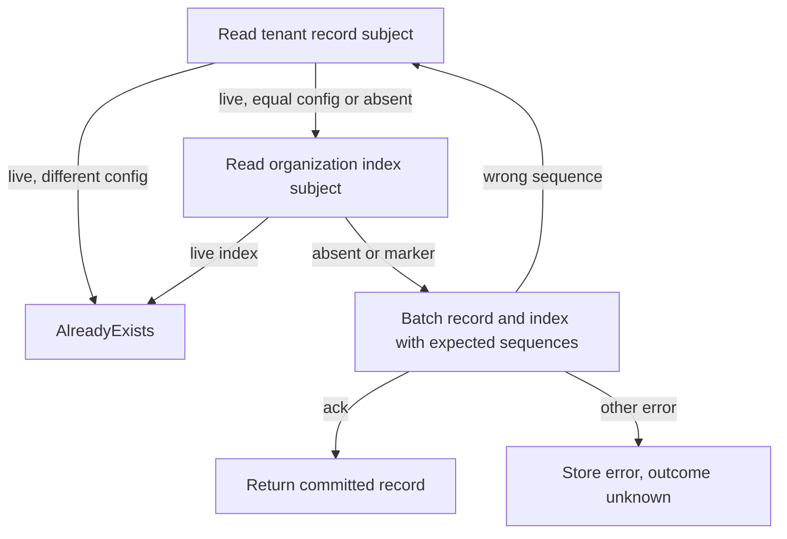

# A multi-key uniqueness claim needs one conditional batch, not record rollback

## The situation

The tenant store keeps a tenant record and an `org_` index in separate KV
subjects. A record-first implementation can write the record and then try to
claim the index. If that claim loses a race, rollback is a third write. A
cancelled caller or a lost reply can then delete a record that another caller
has already observed, or a stale ownership read can allow an index takeover.

## The rule

Use one server-side conditional commit for every key that defines the claim.
Read the last message on each subject, then publish all values in one atomic
batch. Put each subject's expected last sequence on its own message. The
server checks those expectations together at commit, so a writer that moved
either subject rejects the whole batch before it stores either value.

For a NATS KV bucket, the claim has this shape:

The read is not the claim. A live record with an equal configuration is the
retry case, and its stored bytes preserve the original creation time. A live
index refuses the organization even when its record is missing. A wrong-last-
sequence response is the only publish error that the caller retries. A
timeout, cancelled context, or lost acknowledgement leaves the outcome
unknown, so the next call re-reads the pair instead of deleting anything.

The stream must retain atomic publishing after every KV create or update.
The store constructor should refuse a bucket without that flag. This keeps a
misconfigured bucket from silently accepting a protocol that it cannot make
safe.

## Evidence in FlowSeer

The tenant store states the invariant directly: “A tenant's record and its
organization index are written together by one atomic batch”
(`src/services/device/internal/tenantstore/store.go:1-4`). `Create` reads both
subjects, builds two messages, and publishes them through one call
(`src/services/device/internal/tenantstore/store.go:136-199`). Each message
carries its own expected sequence (`src/services/device/internal/tenantstore/store.go:215-219`).
ADR-50 specifies the server-side guarantee that a mismatch on either
expectation rejects the whole batch before storage
([ADR-50](https://github.com/nats-io/nats-architecture-and-design/blob/main/adr/ADR-50.md)).

The state matrix injects every applicable read and publish fault, retries the
same call, and checks the raw stream invariant after each result
(`src/services/device/internal/tenantstore/claim_internal_test.go:632-786`,
`src/services/device/internal/tenantstore/claim_internal_test.go:807-835`).
Contention tests prove that same-configuration writers return the same
creation time and that same-id or same-organization competitors leave one
record and one index (`src/services/device/internal/tenantstore/claim_internal_test.go:839-935`).

The hub restores `AllowAtomicPublish` after every tenant KV setup and the
restart test checks that it survives a restart
(`src/modules/edgebus/hub.go:326-346`,
`src/modules/edgebus/edgebus_test.go:732-770`). `tenantstore.New` rejects a
bucket without the flag (`src/services/device/internal/tenantstore/store_test.go:368-390`).

## What this does not cover

The batch is atomic within one JetStream stream. It does not make a write to a
different stream or a filesystem transactional. A physical file-store failure
between the batch's two stores, clustered wrong-sequence responses, malformed
records, and retry exhaustion remain separate test boundaries
([operator authorization record, 2026-09-30 amendment](../../architecture/2026-09-30-operator-authorization-direction.md#tenants-as-landed)).
