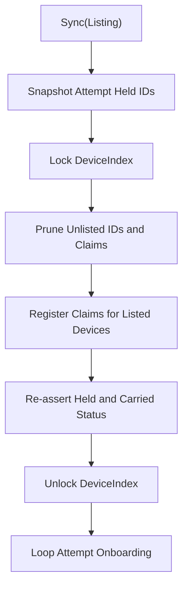

# A Process-Lifetime Index Fed by Attempt-Scoped State Must Apply Listings Under One Lock

When an edge daemon hosts an observation listener beside a connection-oriented
management lane, the two operate on different lifecycles. The observation listener
runs for the entire process and requires immediate device attribution for inbound
datagrams. The management lane runs inside supervised attempts that restart on
transport faults. The device resolution table cannot live inside the attempt, or
inbound observations drop during lane reconnects.

Coupling a process-lifetime lookup table to attempt-scoped sync logic introduces
two failure modes:

1. **Split critical sections.** If pruning unlisted devices, recording new claims,
   and marking devices served happen across separate lock acquisitions, concurrent
   lookups observe torn state. An address shared by two listed devices briefly
   resolves to one device, or an existing held device briefly drops incoming
   packets as unknown.
2. **Attempt-state drift.** If the attempt skips onboarding for devices it already
   holds, a device de-listed by central and later restored is skipped by the lane,
   leaving it pruned from the lookup index forever.

## Guidance

Structure listing updates as a single atomic transformation on the index:



1. **Snapshot attempt state before locking.** Capture a copy of active identifiers
   held by the attempt without holding the attempt lock during index writes.
2. **Execute transitions in one critical section.** Provide an `ApplyListing` method
   that takes the listing and the held snapshot under one write lock. Prune dropped
   identifiers, rebuild address claims, and re-assert served flags in that single pass.
3. **Preserve verified state across attempt boundaries.** If a device was previously
   served at the same listed address by an earlier attempt of this process, carry its
   served status over during the listing pass. This maintains observation attribution
   while the new attempt establishes management sessions.
4. **Apply listings before onboarding.** Run `ApplyListing` before iterating over
   devices to dial management endpoints. This guarantees that inbound observations
   use the latest listing even while individual device connections stall on timeouts.

## Examples

In `src/edge/agent/internal/lanehost/index.go`, `ApplyListing` performs the full
transition under `idx.mu.Lock()`:

```go
func (idx *DeviceIndex) ApplyListing(devices []*attachv1.ListedDevice, heldIDs map[string]struct{}) {
	if idx == nil {
		return
	}
	idx.mu.Lock()
	defer idx.mu.Unlock()

	keep := make(map[string]struct{}, len(devices))
	for _, listed := range devices {
		if listed != nil && listed.GetDeviceId() != "" {
			keep[listed.GetDeviceId()] = struct{}{}
		}
	}

	for devID, rec := range idx.devices {
		if _, ok := keep[devID]; !ok {
			delete(idx.devices, devID)
			idx.dropClaimLocked(rec.address, devID)
		}
	}

	for _, listed := range devices {
		if listed == nil || listed.GetDeviceId() == "" {
			continue
		}
		devID := listed.GetDeviceId()
		addr := normalizeAddress(extractIP(listed.GetIp()))

		old, hadOld := idx.devices[devID]
		_, isHeld := heldIDs[devID]
		served := isHeld || (hadOld && old.address == addr && old.served)

		idx.setDeviceLocked(devID, addr, bindingRefOf(listed.GetBindingId()), served)
	}
}
```

The caller in `src/edge/agent/internal/lanehost/onboard.go` passes the snapshot
ahead of the onboarding loop:

```go
if o.cfg.Index != nil {
	var heldIDs map[string]struct{}
	o.mu.Lock()
	if len(o.held) > 0 {
		heldIDs = make(map[string]struct{}, len(o.held))
		for id := range o.held {
			heldIDs[id] = struct{}{}
		}
	}
	o.mu.Unlock()

	o.cfg.Index.ApplyListing(devices, heldIDs)
}

for _, listed := range devices {
	o.onboard(ctx, listed)
}
```

## Evidence in FlowSeer

- `src/edge/agent/internal/lanehost/index.go:174-220`: `ApplyListing` atomically
  reconciles devices and claims under a single write lock.
- `src/edge/agent/internal/lanehost/onboard.go:157-173`: `Sync` snapshots attempt
  held state and updates the index before starting per-device onboarding.
- `src/edge/agent/internal/lanehost/onboard_test.go:848-963`: `TestSync_PruneAndRecordClaimsBeforeOnboarding`
  proves that address claims and prunes take effect before individual device onboarding
  completes or times out.
- `src/edge/agent/internal/lanehost/onboard_test.go:731-778`: `TestSync_HeldDeviceRelistedAtNewAddressResolvesFromNewAddressAndNoLongerOld`
  verifies that a held device moved to a new address resolves from that address.
- `src/edge/agent/internal/lanehost/onboard_test.go:602-636`: `TestSync_ListingDropsDeviceRemovesItsAddressFromIndex`
  proves that dropping a device from a listing drops its resolution immediately.
- `src/edge/agent/internal/lanehost/index_test.go:277-321`: `TestDeviceIndex_SharedAddressAcrossTwoOnboarders`
  proves that an address shared by two devices resolves as ambiguous across onboarder
  lifecycles.

## What this does not cover

- Conflict resolution when central lists one device identifier at multiple addresses
  simultaneously.
- Re-authenticating or refreshing credentials across management attempt restarts.
