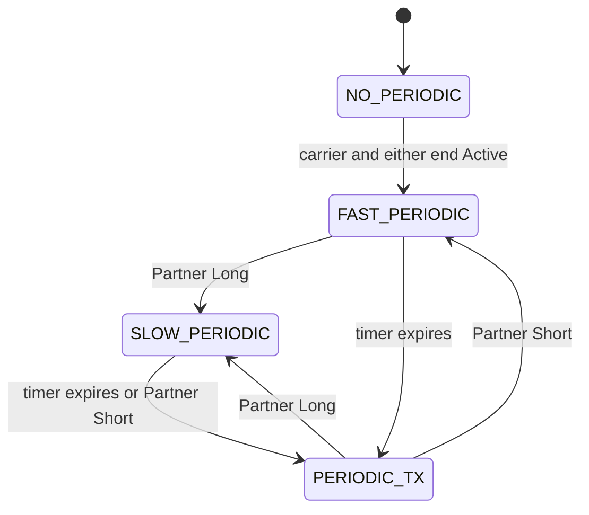
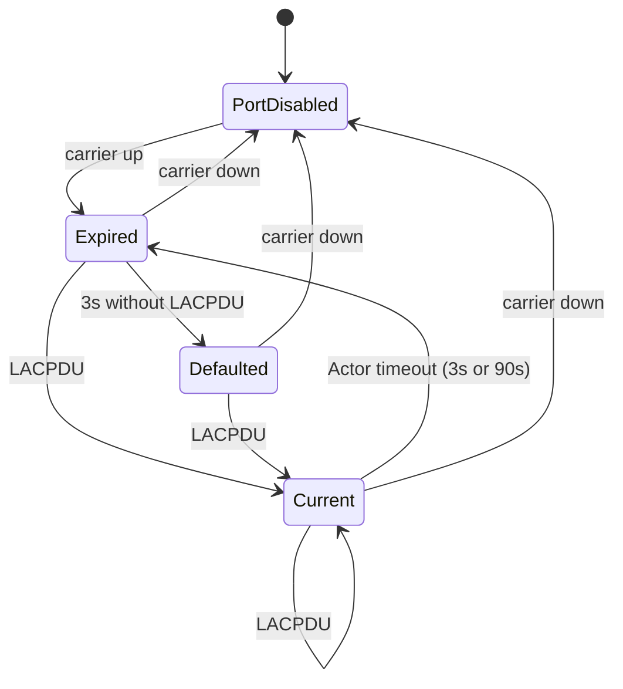
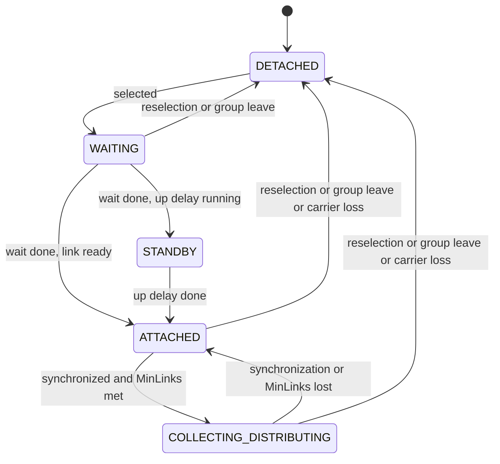

# lag

Package `lag` implements link aggregation for the virtual switch. LACP follows
IEEE Std 802.1AX-2014 as read from `AX` (Sources below), with Version 1 LACPDUs
and the Marker Responder (`AX` 5.3 a to d). Bond modes and bucket selection use
`OVS` where `AX` leaves distribution open. The Limits below bound the model.

The layer runs deterministically in memory without background goroutines or wall
clocks. Time advances through explicit, time-stamped calls to `LinkChange`,
`Receive`, and `Advance`.

## Example

This static LAG uses the active-backup selection in [layer.go](layer.go).
Carrier loss moves traffic from the configured primary to the other member.

```go
package main

import (
	"fmt"
	"time"

	"go.aledante.io/FlowSeer/src/common/net/ethernet"
	"go.aledante.io/FlowSeer/src/common/net/netaddr"
	"go.aledante.io/FlowSeer/src/common/sim/layer"
	"go.aledante.io/FlowSeer/src/common/sim/layer/lag"
	"go.aledante.io/FlowSeer/src/common/sim/port"
)

func main() {
	ports, err := port.NewBuilder().
		Add(port.Port{Name: "lag1", Kind: port.LAG}).
		Add(port.Port{Name: "1/1/1", Kind: port.Physical, LagParent: "lag1"}).
		Add(port.Port{Name: "1/1/2", Kind: port.Physical, LagParent: "lag1"}).
		Build()
	if err != nil {
		panic(err)
	}

	sysMAC, err := netaddr.Parse("02:00:00:00:00:01")
	if err != nil {
		panic(err)
	}

	cfg := lag.Config{
		LAGs: map[string]lag.LAG{
			"lag1": {
				Mode:    lag.ActiveBackup,
				Primary: "1/1/1",
			},
		},
	}

	lyr, err := lag.New(cfg, layer.Env{Ports: ports, MAC: sysMAC})
	if err != nil {
		panic(err)
	}

	t0 := time.Unix(1700000000, 0)
	lyr.LinkChange(t0, "1/1/1", true)
	lyr.LinkChange(t0, "1/1/2", true)

	frame := ethernet.Frame{}
	sel := lyr.Select(t0, "lag1", frame, 0)
	fmt.Printf("Selected member: %s (ok=%t)\n", sel.Member, sel.OK)

	t1 := t0.Add(time.Second)
	fx := lyr.LinkChange(t1, "1/1/1", false)
	fmt.Printf("Changed LAGs: %v\n", fx.Changed)

	sel2 := lyr.Select(t1, "lag1", frame, 0)
	fmt.Printf("Selected member after failover: %s (ok=%t)\n", sel2.Member, sel2.OK)
}
```

## Bond modes and the bucket table

`AX` 6.2.4 leaves the distribution algorithm open, subject to frame ordering
and duplication constraints. The modes and bucket table follow `OVS`
`ofproto/bond.c`. [hash.go](hash.go) defines this layer's FNV-1a hashes, which
use different hash functions from OVS's `bond_hash`.

The layer exposes three bond modes via `Mode`:

- `ActiveBackup` (""): see "Active-backup selection" below.
- `BalanceSLB` ("BalanceSLB"): Balances outbound frames using source MAC and
  VLAN identifier.
- `BalanceTCP` ("BalanceTCP"): Balances TCP and UDP traffic across member links
  using layer 2 through layer 4 header fields, and requires negotiated LACP
  (see "Balance-tcp and LACP" below).

`Select` commits its choice. `Peek` computes the identical choice and mutates
nothing. Both take the current time, since a selection can be stale enough to
report the rebalance-unmodeled signal below.

### Bucket assignment

Both balancing modes compute a 32-bit hash value with FNV-1a (`hash/fnv`) and
extract the low 8 bits: `bucket = hash & 0xff`, one of 256. Each LAG holds a
256-entry bucket table as runtime state. Assignments persist across selections,
as in `OVS` `ofproto/bond.c`'s `choose_output_member` and `get_enabled_member`:

- If the bucket already has a member and that member is still enabled, the
  lookup keeps it (`Selection.Cause` is `kept`). A member fault therefore
  moves only the buckets that were on it. Buckets on surviving members are
  untouched.
- Otherwise the bucket takes the member at the front of the enabled list
  (`first-use` if the bucket had never been assigned, `reassigned` if its
  member was disabled), and that member moves to the back of the list.

The enabled list is the runtime list the step above rotates. A member that becomes
newly enabled joins the back of the list
(`bond_enable_member`: `ovs_list_insert` before the list head), and several
members enabled together in one call join in name order.

### Rebalancing is not modeled

`OVS` `ofproto/bond.c`'s `bond_rebalance` moves buckets by measured traffic.
The layer does not measure load, so it reports when rebalancing would be due.
`AX` Annex B.3 describes dynamic reallocation in its informative guidance.

`LAG.RebalanceInterval` governs the signal. Nil normalizes to 10s, zero
disables it, and a positive value under 1s normalizes to 1s, following
`OVS` `vswitchd/bridge.c`'s `bond-rebalance-interval` setting. Once a balanced
selection's bucket was assigned at least one interval
ago and the LAG has two or more enabled members, `Selection.RebalanceUnmodeled`
is true. The caller decides what to do with that (the switch layer raises an
`Incomplete` issue from it). This package only reports it.

### Active-backup selection

Active-backup follows `OVS` `ofproto/bond.c`'s `bond_choose_member`:

1. The configured `Primary`, if it is enabled (`Selection.Cause` is `primary`).
2. Otherwise the member that was last active, if it is still enabled
   (`last-active`).
3. Otherwise the lowest-named enabled member (`first-enabled`). OVS walks a
   hash map at this step. The lowest name makes this layer's choice deterministic.

A committing call records its choice as the new last-active member.
`Selection.Prior` holds the member last active before the call.

### Balance-tcp and LACP

`BalanceTCP` requires negotiated LACP: with `LACP.Mode` `Off`, or with no
member attached to a partner, it selects nothing, unless `Fallback` applies.
`Fallback` then selects as active-backup (`OVS` `ofproto/bond.c`,
`choose_output_member`'s `BM_TCP` and `LACP_CONFIGURED` branches).

## Configuration comparison

The comparison contract is defined in [diff.go](diff.go).
`Diff` normalizes both sides with the zero `layer.Env` before comparing them.
Defaults that derive from the port table or the switch system ID therefore
compare as written: a default `LACPConfig.Key` stays 0, a zero
`LACPConfig.SystemID` stays zero, and no port-table member is added. A caller
that needs those defaults compared normalizes both sides with the real
`layer.Env` first. Top-level `vswitch.Diff` does this automatically, including
the case where a port table implies the LAG capability but the raw `LAG` field
was omitted.

Member changes have subject kind `lag_member`. Their keys quote the LAG and
member names separately, for example `"lag1"/"1/1/1"`, so names containing
separators remain distinct (`TestDiffMemberSubjectKeysAreInjectiveAcrossLAGs`
in [diff_injectivity_test.go](diff_injectivity_test.go)).

## BalanceSLB hash input

The distribution choice is left open by `AX` 6.2.4. `hashSLB` in
[hash.go](hash.go) writes these fields into the 32-bit FNV-1a hasher:

1. `HashBasis` (4 octets, big-endian uint32).
2. Source MAC address (6 octets).
3. 802.1Q VLAN identifier (2 octets, big-endian uint16).

## BalanceTCP hash input

`hashTCP` in [hash.go](hash.go) defines another distribution choice under `AX`
6.2.4. Only IPv4 and IPv6 EtherTypes allow the payload to be decoded with
`ip.Decode`. A decoded IP header contributes layer 3 and 4 fields. Other
EtherTypes and failed IP decoding, including invalid IPv4 header checksums,
stop hashing after layer 2. An ARP-typed frame carrying valid IPv4 and UDP
headers still contributes only layer 2 (`TestInspectTCPHashInputChecksEtherType`
in [hash_internal_test.go](hash_internal_test.go)).

The byte sequence fed into FNV-1a is:

1. `HashBasis` (4 octets, big-endian uint32).
2. Source MAC address (6 octets).
3. Destination MAC address (6 octets).
4. EtherType (2 octets, big-endian uint16).
5. Source IP address (4 octets for IPv4, 16 octets for IPv6).
6. Destination IP address (4 octets for IPv4, 16 octets for IPv6).
7. IP protocol or next header (1 octet, uint8).
8. TCP/UDP ports (4 octets: 2 octets source port, 2 octets destination port),
   included only when protocol is 6 (TCP) or 17 (UDP) and the payload contains at
   least 4 octets.

## Link delays and timers

`UpDelay` and `DownDelay` follow `OVS` `ofproto/bond.c`'s
`bond_link_status_update`. They are additional constraints outside `AX`.
`MinLinks` is also a layer constraint ([lacp.go](lacp.go)).

Carrier state changes pass to `LinkChange(now, member, up)`.

- If the configured delay (`UpDelay` when up is true, `DownDelay` when up is false)
  is zero, the transition takes effect immediately.
- If the configured delay is greater than zero, the transition is deferred.
  `LinkChange` arms a timer at `now + delay`. `NextWake` reports the timer, and
  the subsequent call to `Advance` applies the transition once the timer expires.
- LACP starts from the carrier transition. An up delay keeps a selected member in
  `STANDBY` and leaves Actor Synchronization clear until the delayed link is ready
  (`AX` 6.4.14.1 k). Under LACP, carrier loss removes collection and distribution
  immediately (`AX` 6.3.12 and Figure 6-18). A down delay retains the delayed
  link state for static LAG selection.

## LACP protocol machine

When `LACP.Mode` is `Active` or `Passive`, the layer executes the `AX` 6.3 and
6.4 machines using Version 1 Slow Protocols frames (EtherType 0x8809) sent to
`01:80:c2:00:00:02` (`AX` 6.4.2). [lacp.go](lacp.go) holds selection and Mux,
[layer.go](layer.go) drives reception, and [transmit.go](transmit.go) drives
Periodic and Transmit.

### Actor information

Each member maintains an Actor `lacp.Info` with the fields of `AX` 6.4.2.2,
updated by `updateActorInfo` in [lacp.go](lacp.go):

- `SystemPriority`: LAG administrative priority (default 32768).
- `SystemID`: Switch system MAC address.
- `Key`: Operational aggregation key, with the default described below.
- `PortPriority`: Member administrative priority (default 32768).
- `PortID`: 1-based index among all of the layer's member ports, sorted by name
  (`AX` 6.3.4).
- `State`: Bitmask containing:
  - `StateActive` (0x01): Set when LACP mode is Active.
  - `StateShortTimeout` (0x02): Set when `Fast` is true.
  - `StateAggregation` (0x04): Always set.
  - `StateSynchronization` (0x08): Set when attached to the aggregator.
  - `StateCollecting` (0x10): Set when enabled.
  - `StateDistributing` (0x20): Set when enabled.
  - `StateDefaulted` (0x40): Set while partner information is defaulted.
  - `StateExpired` (0x80): Set on entry to `Expired` and cleared by `Current`,
    `Defaulted`, or initialization.

With LACP off, Collecting and Distributing still follow the member's enabled
state (`TestStaticLAGActorStateFollowsEnabled` in [layer_test.go](layer_test.go)).

The default key is the LAG's 1-based position in the environment's name-sorted
LAG ports ([config.go](config.go)). `AX` 6.3.5 gives keys System-local meaning,
allows nonzero values, and permits operational keys to change. Adding a LAG
can shift these defaults. The layer's retention key covers every LAG, so that
change rebuilds the layer and detaches its members, as a key change requires
(`AX` 6.4.14 NOTE 2, [layer.go](layer.go), and
[vswitch/derive.go](../../device/vswitch/derive.go)).

### Transmission

Transmission rates use two standard periods:

- Fast: 1 second.
- Slow: 30 seconds.

The Partner's Short timeout selects Fast. Long selects Slow, independently of
the local `Fast` setting. `AX` 6.4.4 supplies the periods and 6.4.13,
Figure 6-19, defines the Periodic machine:



Carrier loss, LACP off, or both ends Passive returns the machine to
`NO_PERIODIC` and clears the need to transmit. At carrier up, Periodic runs
before Receive. The administrative Partner's Long timeout selects Slow,
then Receive's `Expired` state requests Short and causes an immediate LACPDU.

Actor changes and stale echoes also request transmission. `update_NTT` in
`AX` 6.4.9 compares the received Partner's identity, Activity, Timeout,
Synchronization, and Aggregation against the local Actor. Collecting,
Distributing, Defaulted, and Expired are outside that comparison.

The Transmit machine permits at most three LACPDUs in any one-second window
(`AX` 6.4.16). A pending transmission leaves `NextWake` set to the earliest
available slot. It samples Actor and Partner information when sent, so multiple
requests collapse into one current PDU. An immediate transmission leaves the
Periodic timer running. Carrier flaps retain the window's transmission history.

### Marker Responder

`ReceiveMarker` in [marker.go](marker.go) responds on the ingress member even
when its Mux is detached or LACP is off (`AX` 6.5.1 and 6.5.4.2, Figure 6-28).
The response uses the same source
address as that member's LACPDUs. `lacp.MarkerResponse` preserves the requester
port, system, transaction, version, and reserved octets, and changes the TLV
type to Marker Response. Marker Responses and malformed requests produce no
emission. The switch consumes requests under `lag.marker.respond` and drops
refused frames with `unsupported-lacpdu`.

### Receive machine

The Receive machine follows `AX` 6.4.12, Figure 6-18, with the functions of 6.4.9.
For example, a slow member that last received a LACPDU at 10s stays `Current`
until 100s, then `Expired` until 103s, then `Defaulted`. The peer's advertised
timeout does not change those deadlines. A member that hears no peer defaults
3 seconds after carrier-up, at either rate (`TestReceiveTimeoutUsesActorRate`
and `TestExpiredHoldsForThreeSeconds` in `layer_test.go`).



`Fast` selects the Actor's Short timeout (3 seconds). Otherwise it uses Long
(90 seconds), as `AX` 6.4.4 and 6.4.10 specify. `Expired` clears the Partner's
Synchronization, requests its Short timeout, and sets the Actor's Expired bit.
The member stops collecting and distributing while that bit is set.

The administrative Partner has zero identity fields and is Individual, with
Synchronization and Collecting set (`0x18`, `AX` 6.4.7 and `recordDefault` in 6.4.9).
`Defaulted` records it, sets the Actor's Defaulted bit, and clears Expired.
`PortDisabled` clears the Partner's Synchronization and keeps its remaining
fields and the Actor's Defaulted and Expired bits. Initialization records the
administrative Partner before entering `PortDisabled`, so its Partner state
is `0x10`. A disabled member whose peer system and port appear on another member
resets to these initial values (`port_moved`, `AX` 6.4.8).

`Receive` accepts Partner synchronization only when the peer claims it and
the PDU's Partner identity and Aggregation bit match the local Actor, or when
the peer is Individual. The peer must also be Active, or acknowledge the local
Actor's Active bit while that Actor is Active (`recordPDU`, `AX` 6.4.9).

### Aggregator attachment and selection

Selection follows `AX` 6.4.14.1 in [lacp.go](lacp.go). The LAG keeps one
Aggregator, which `AX` 6.7.4.2 permits. Which group wins it is this layer's
choice: the candidate whose Partner identifier compares first leads.
A candidate has carrier, the LAG's operational key, and learned Partner
information in `Current` or `Expired`. The identifier includes Partner system
priority, system ID, key, port priority, and port ID.

An Aggregated lead selects candidates with the same Partner system priority,
system ID, and key whose Partner has Aggregation set. An Individual lead selects
itself. A member whose carrier is down retains its selection while its Partner
still belongs to the group. If two members of one LAG are cabled to each other,
the lower-named member is the candidate.

A newly selected member enters the Mux `WAITING` state for the two-second
`Aggregate_Wait_Time`. Members waiting to attach to that Aggregator share the
same deadline, so a member learned one second later does not attach early, while
already-attached members remain forwarding.

Mux uses the coupled control diagram (`AX` 6.4.15, Figure 6-22), because one
`enabled` flag controls both collection and distribution. `MinLinks` gates
collection and distribution while attachment and synchronization proceed, so
two peers with the same constraint can still negotiate.



`Info.Attached` lists members in `ATTACHED` or `COLLECTING_DISTRIBUTING`.
`Info.Enabled` lists only members in `COLLECTING_DISTRIBUTING`. Actor
Synchronization follows `Attached`. Actor Collecting and Distributing follow
`Enabled`. `MinLinks` gates the transition to `COLLECTING_DISTRIBUTING`, so a
group may be attached while every member remains disabled.

### Fallback

`Fallback: false` is a departure from `AX` 6.4.12, which uses the administrative
Partner after defaulting. The layer adopts the fallback switch in `OVS`
`lib/lacp.c`'s `lacp_update_attached` and its default in `vswitchd/bridge.c`.

With `Fallback` enabled and no learned group available, the layer selects one
defaulted member for active-backup forwarding. The administrative Partner is
Individual (`AX` 6.3.6.1), so it cannot share its Aggregator (6.4.14.1 h).
`Primary` wins when it has carrier and is Defaulted. Otherwise the lowest-named
member wins. The selection still waits for `Aggregate_Wait_Time`, and `MinLinks`
can leave the selected member
disabled. This allows traffic to pass to a non-LACP endpoint before aggregation
negotiation completes without treating the LAG as a multi-member aggregator.

## Convergence evidence: pending members

This reporting contract is defined by `pendingEntry` in [layer.go](layer.go).
Aggregate wait and receive expiry come from `AX` 6.4.15 and 6.4.12. Link delays
are the additional constraints described above.

`Info` records, in an unexported field, the member ports that may still change
state on their own, each with the time that is currently scheduled to happen.
Callers outside the package cannot read it. `NextWake` is the exported way to
learn when the layer next changes state by itself. A pending member does not
downgrade `Info`'s other fields or a `Select` result: the answer as of now is
definite. A member reports at most one cause, the first one that applies:

1. `aggregate-wait`: it is in Mux `WAITING` (`At` is the shared aggregator
   selection deadline).
2. `link-delay`: its up or down delay timer is running (`At` is when it fires).
3. `partner-expired`: its partner information is `Expired` (`At` is when the
   receive timer elapses, moving it to `Defaulted`).
4. `unsynchronized`: it is attached to the lead partner but that partner has
   not advertised `StateSynchronization` (`At` is its next receive timeout).

## State retention

Retention is the layer's configuration contract in [layer.go](layer.go) and
[vswitch/derive.go](../../device/vswitch/derive.go).

`RetentionKey(cfg Config, env layer.Env) string` encodes
every normalized input the link-aggregation runtime state depends on: its own
configuration normalized against the environment, member port
administrative and operational states, and the switch's system ID. `vswitch.Derive`
retains the runtime layer only when both keys match and rebuilds it otherwise.

## Limits

- No Marker Generator or Receiver (`AX` 6.5.4.1), churn detection (6.4.17),
  Version 2 TLVs or conversation-sensitive distribution (6.6), or Distributed
  Resilient Network Interconnect across switches (clause 9).
- A conversation moved from a detached link uses its new link immediately.
  `AX` 6.3.14 requires frame order to be preserved. The layer sees no frames
  in transit and implements no drain or Marker exchange before moving it.
- Every member link is treated as point-to-point. The Receive machine never
  enters `LACP_DISABLED` (`AX` 6.4.8 and 6.7.3).
- Timers run at nominal values. `AX` 6.4.4 permits a 250 ms tolerance.
- Load-driven rebalancing is reported and never performed. `AX` Annex B.3
  discusses reallocation as informative guidance. [layer.go](layer.go)'s
  `rebalanceUnmodeled` supplies the signal.

## Sources

`AX` is [IEEE P802.1AX-REV/D4.54, 15 October 2014][ax], the unapproved draft
used as the reference for IEEE Std 802.1AX-2014. The published standard was
not read, so equivalence to its text remains unverified.

`OVS` is Open vSwitch at commit `73e38c8dfd9ff5f95a92e583780cd996ac11bca7`:

- [ofproto/bond.c][ovs-bond]: `choose_output_member`, `get_enabled_member`,
  `bond_enable_member`, and `bond_choose_member` for distribution,
  `bond_link_status_update` for delays, and `bond_rebalance` for load-based moves.
- [lib/lacp.c][ovs-lacp]: `lacp_update_attached` for the fallback switch.
- [vswitchd/bridge.c][ovs-bridge]: fallback defaults and rebalance interval bounds.

[ax]: https://www.ietf.org/lib/dt/documents/LIAISON/liaison-2014-11-08-ieee-8021-rtg-completion-of-8021ax-rev-link-aggregation-to-ietf-routing-area-and-routing-area-wg-attachment-2.pdf
[ovs-bond]: https://raw.githubusercontent.com/openvswitch/ovs/73e38c8dfd9ff5f95a92e583780cd996ac11bca7/ofproto/bond.c
[ovs-lacp]: https://raw.githubusercontent.com/openvswitch/ovs/73e38c8dfd9ff5f95a92e583780cd996ac11bca7/lib/lacp.c
[ovs-bridge]: https://raw.githubusercontent.com/openvswitch/ovs/73e38c8dfd9ff5f95a92e583780cd996ac11bca7/vswitchd/bridge.c
