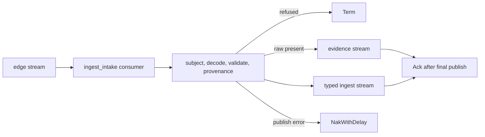

# Central intake

Central intake follows each attached edge buffer and moves validated
`IngestRecord` messages into the central streams owned by `edgebus`. The host
starts it with the hub's central JetStream context:

```go
in, err := intake.Start(ctx, intake.Config{
	Hub:     hub,
	Central: hub.JetStream(),
})
if err != nil {
	return err
}
defer in.Close()
```

The edge is identified by the stream it came from. The message subject must
begin with that edge's `flowseer.<tenant>.edge.<edge-id>.ingest.` subtree. Intake
then unmarshals the envelope, runs `protovalidate`, and checks that
`provenance.edge` names the same edge. A refusal is terminated and counted, so
the source consumer does not redeliver it.



A typed syslog record uses the device id in its payload, even when the edge
published it on a different `ingest.<source>` branch. A record without raw
evidence is republished as received. A record with raw evidence is published
first to `flowseer.<tenant>.evidence.syslog.<device-id>`, then to
`flowseer.<tenant>.ingest.syslog.<device-id>` after `raw` is cleared. Both
messages use `<tenant>.<record_id>` as their JetStream message id.

Central delivery is at least once. A validation infrastructure error or a
publish failure uses `NakWithDelay`, so the edge message remains pending. A
message from an edge the hub has no tenant for is retried the same way, because
that says nothing about the record. A repeat inside the central stream's
duplicate window, up to ten minutes and capped by the stream's maximum age, is
acknowledged as a duplicate. A message can still
be lost when the edge stream reaches its age or byte bound, because JetStream
discards its oldest message. The stream and subject definitions live in
[`src/modules/edgebus/subjects.go`](../../../../modules/edgebus/subjects.go)
and the central stream limits live in
[`src/modules/edgebus/hub.go`](../../../../modules/edgebus/hub.go).

Intake publishes these instruments in the scope
`go.aledante.io/FlowSeer/src/services/device/internal/intake`:

- counters for republished records, deliveries a central stream reported as a
  duplicate (one count per delivery), stored raw evidence, refusals by
  reason, and retry requests
- `flowseer.intake.record.duration` in seconds from delivery to `Ack`, `Term`,
  or `NakWithDelay`
- `flowseer.intake.record.age` in seconds from the edge stream timestamp to
  delivery

Refusals emit the named event `flowseer.intake.record.refused` at WARN level.
The event carries the stream edge, refusal reason, and subject and is limited
to one event per edge every ten seconds. The full refusal count remains in the
counter. If JetStream stops a consumer, intake logs a WARN with the edge and a
bounded `error.type`.
